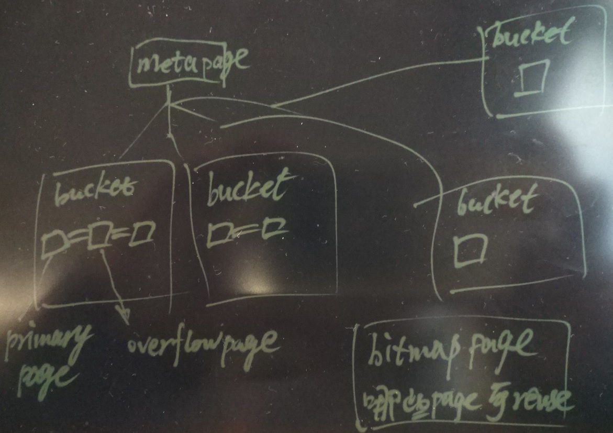
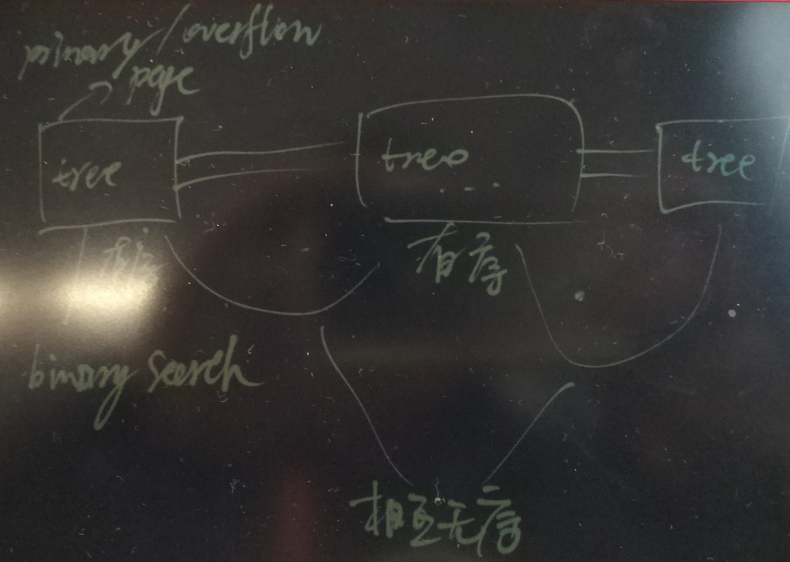

## PostgreSQL 10.0 preview 性能增强 - hash index metapage cache、高并发增强  
##### [TAG 13](../class/13.md)
                                                                                  
### 作者                                                                                                                               
digoal                                                                             
                                                                                    
### 日期                                                                               
2017-03-13                                                                              
                                                                                
### 标签                                                                             
PostgreSQL , 10.0 , hash index    
                                                                                  
----                                                                            
                                                                                     
## 背景      
hash index是PostgreSQL中一个非常老的索引访问方法，也是非常经典的索引。  
  
hash index中存储的是索引字段的hash value，而不是原始值，btree索引中存储的是原始值。  
  
因此，当字段非常大时，btree索引可能无法使用。  
  
例如  
  
```  
postgres=# create table test_hash_btree(c1 text);  
CREATE TABLE  
postgres=# insert into test_hash_btree values (repeat(random()::text,10000));  
INSERT 0 1  
postgres=# create index idx on test_hash_btree (c1);  
CREATE INDEX  
postgres=# insert into test_hash_btree values (repeat(random()::text,100000));  
ERROR:  index row requires 19504 bytes, maximum size is 8191  
postgres=# drop index idx;  
DROP INDEX  
postgres=# create index idx on test_hash_btree using hash(c1);  
WARNING:  hash indexes are not WAL-logged and their use is discouraged  
CREATE INDEX  
postgres=# insert into test_hash_btree values (repeat(random()::text,100000));  
INSERT 0 1  
postgres=# insert into test_hash_btree values (repeat(random()::text,10000000));  
INSERT 0 1  
```  
  
这种情况下可以使用hash index，而正因为 hashindex中存储 的是哈希，所以它只能用作等值查询。  
  
除非有一种哈希函数能保证哈希后的值和哈希前的值顺序具备一致性。否则hash index是无法支持排序、>,<,>=,<=的查询的。  
  
## 哈希索引的结构  
哈希索引包含4种页，meta page, primary bucket page, overflow page, bitmap page.  
  
metapage（0号页） , 包含了HASH索引的控制信息，指导如何找到其他页面（每个bucket的primary page），以及当前存储概貌。其他索引的0号页基本都是这一个套路。  
  
primary bucket page，hash index将存储划分为多个bucket（逻辑概念），每个bucket中包含若干page（每个bucket的page数量不需要一致），当插入数据时，根据计算得到的哈希，通过映射算法，映射到某个bucket，也就是说数据首先知道应该插入哪个bucket中，然后插入bucket中的primary page，如果primary page空间不足时，会扩展overflow page，数据写入overflow page.  
  
在page中，数据是有序存储（TREE），page内支持二分查找(binary search)，而page与page之间是不保证顺序的，所以hash index不支持order by。  
  
overflow page，是bucket里面的页，当primary page没有足够空间时，扩展的块称为overflow page.  
  
bimap page，记录primary , overflow page是否为空可以被重用。  
  
注意bucket, page都没有提供收缩功能，即无法从OS中收缩空间，但是提供了reuse(通过bitmap page跟踪）.  
  
  
  
  
  
## 10.0 哈希索引增强  
1\. Cache Hash Index meta page  
  
缓存hash index meta page页到backend process的私有内存中，减少meta page的访问。  
  
2\. Concurrent Hash Indexes  
  
大幅提升查询性能，超过BTREE接近一倍。  
  
```  
Patch_Ver/Client count 1 8 16 32 64 72 80 88 96 128  
  
HEAD-Btree  19397 122488 194433 344524 519536 527365 597368 559381 614321 609102  
HEAD-Hindex 18539 141905 218635 363068 512067 522018 492103 484372 440265 393231  
Patch       22504 146937 235948 419268 637871 637595 674042 669278 683704 639967  
  
% improvement between HEAD-Hash index vs Patch and HEAD-Btree index vs  
Patch-Hash index is:  
  
Head-Hash vs Patch   21.38 3.5 7.9 15.47 24.56 22.14 36.97 38.17 55.29 62.74  
Head-Btree vs. Patch 16.01 19.96 21.35 21.69 22.77 20.9 12.83 19.64 11.29 5.06  
  
This data shows that patch improves the performance of hash index upto  
62.74 and it also makes hash-index faster than btree-index by ~20% (most  
client counts show the performance improvement in the range of 15~20%.  
  
For the matter of comparison with btree, I think the impact of performance  
improvement of hash index will be more when the data doesn't fit shared  
buffers and the performance data for same is as below:  
  
Data doesn't fits in shared buffers  
scale_factor - 3000  
shared_buffers - 8GB  
  
Client_Count/Patch 16 64 96  
Head-Btree 170042 463721 520656  
Patch-Hash 227528 603594 659287  
% diff 33.8 30.16 26.62  
The performance with hash-index is ~30% better than Btree.  Note, that for  
now,  I have not taken the data for HEAD- Hash index.  I think there will  
many more cases like when hash index is on char (20) column where the  
performance of hash-index can be much better than btree-index for equal to  
searches.  
  
Note that this patch is a very-much WIP patch and I am posting it mainly to  
facilitate the discussion.  Currently, it doesn't have any code to perform  
incomplete splits, the logic for locking/pins during Insert is yet to be  
done and many more things  
```  
        
这个patch的讨论，详见邮件组，本文末尾URL。            
            
PostgreSQL社区的作风非常严谨，一个patch可能在邮件组中讨论几个月甚至几年，根据大家的意见反复的修正，patch合并到master已经非常成熟，所以PostgreSQL的稳定性也是远近闻名的。            
                        
## 参考                
https://commitfest.postgresql.org/13/715/  
  
https://www.postgresql.org/message-id/flat/CAD__OugX0aOa7qopz3d-nbBAoVmvSmdFJOX4mv5tFRpijqH47A@mail.gmail.com#CAD__OugX0aOa7qopz3d-nbBAoVmvSmdFJOX4mv5tFRpijqH47A@mail.gmail.com  
  
https://commitfest.postgresql.org/10/647/  
  
https://www.postgresql.org/message-id/flat/CAA4eK1LfzcZYxLoXS874Ad0+S-ZM60U9bwcyiUZx9mHZ-KCWhw@mail.gmail.com#CAA4eK1LfzcZYxLoXS874Ad0+S-ZM60U9bwcyiUZx9mHZ-KCWhw@mail.gmail.com  
  
src/backend/access/hash/README  
  
  
  
  
  
  
  
  
  
  
  
  
  
  
  
  
  
  
  
  
  
  
  
  
  
  
  
  
  
  
  
  
  
  
  
  
  
  
  
  
  
  
  
  
  
  
  
  
  
  
  
  
  
  
  
  
  
  
  
  
  
  
  
  
  
  
  
  
  
  
  
  
  
#### [PostgreSQL 许愿链接](https://github.com/digoal/blog/issues/76 "269ac3d1c492e938c0191101c7238216")
您的愿望将传达给PG kernel hacker、数据库厂商等, 帮助提高数据库产品质量和功能, 说不定下一个PG版本就有您提出的功能点. 针对非常好的提议，奖励限量版PG文化衫、纪念品、贴纸、PG热门书籍等，奖品丰富，快来许愿。[开不开森](https://github.com/digoal/blog/issues/76 "269ac3d1c492e938c0191101c7238216").  
  
  
#### [9.9元购买3个月阿里云RDS PostgreSQL实例](https://www.aliyun.com/database/postgresqlactivity "57258f76c37864c6e6d23383d05714ea")
  
  
#### [PostgreSQL 解决方案集合](https://yq.aliyun.com/topic/118 "40cff096e9ed7122c512b35d8561d9c8")
  
  
#### [德哥 / digoal's github - 公益是一辈子的事.](https://github.com/digoal/blog/blob/master/README.md "22709685feb7cab07d30f30387f0a9ae")
  
  

  
  
#### [PolarDB 学习图谱: 训练营、培训认证、在线互动实验、解决方案、生态合作、写心得拿奖品](https://www.aliyun.com/database/openpolardb/activity "8642f60e04ed0c814bf9cb9677976bd4")
  
  
#### [购买PolarDB云服务折扣活动进行中, 55元起](https://www.aliyun.com/activity/new/polardb-yunparter?userCode=bsb3t4al "e0495c413bedacabb75ff1e880be465a")
  
  
#### [About 德哥](https://github.com/digoal/blog/blob/master/me/readme.md "a37735981e7704886ffd590565582dd0")
  
