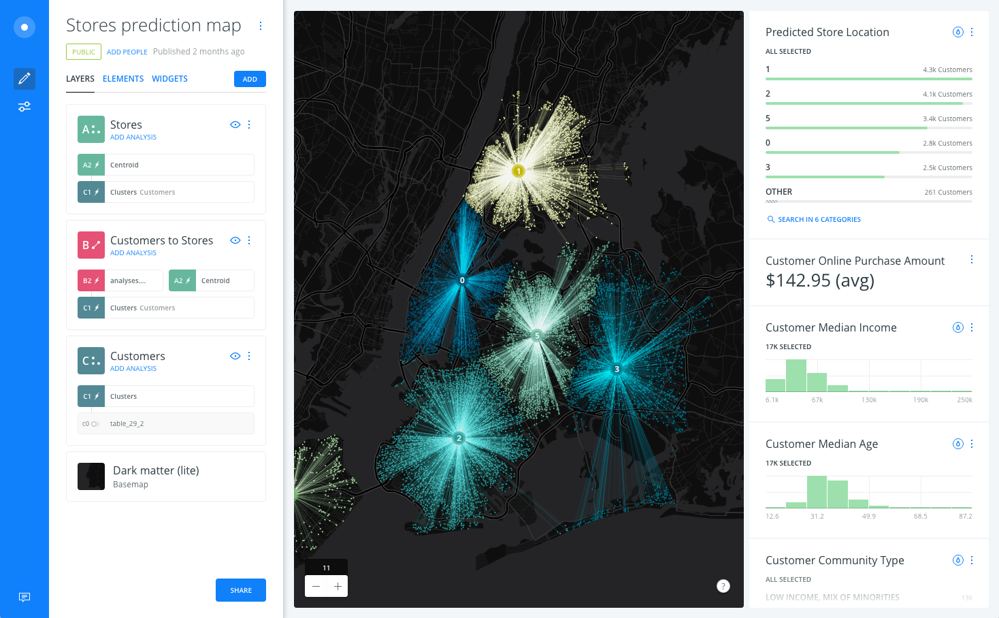

## 基于PostgreSQL和地理位置信息打造的洞察平台 - CARTO  
##### [TAG 15]
           
### 作者           
digoal            
              
### 日期            
2017-03-15                                      
            
### 标签                                                                                                                            
PostgreSQL , 洞察平台 , CARTO    
          
----            
          
## 背景    
https://github.com/CartoDB/cartodb/  
  
What is CARTO?  
  
CARTO is an open, powerful, and intuitive platform for discovering and predicting the key insights underlying the location data in our world.  
  
Empower organizations to optimize operational performance, strategic investments, and everyday decisions with CARTO Engine—our embeddable platform for web and mobile apps—and the new CARTO Builder, a drag and drop analysis tool.  
  
It was built to make it easier for people to tell their stories by providing them with flexible and intuitive ways to create maps and design geospatial applications. CARTO can be installed on your own server and we also offer a hosted service at carto.com.  
  
If you would like to see some live demos, check out our videos on Vimeo. We hope you like it!  
  
  
  
carto基于PostgreSQL与PostGIS打造。    
  
What can I do with CARTO?  
  
With CARTO, you can upload your geospatial data (Shapefiles, GeoJSON, etc) using a web form and then make it public or private.  
  
After it is uploaded, you can visualize it in a dataset or on a map, search it using SQL, and apply map styles using CartoCSS. You can even access it using the CARTO APIs, or export it to a file.  
  
In other words, with CARTO you can make awesome maps and build powerful geospatial applications! Definitely check out the CARTO Platform for interactive examples and code.  
