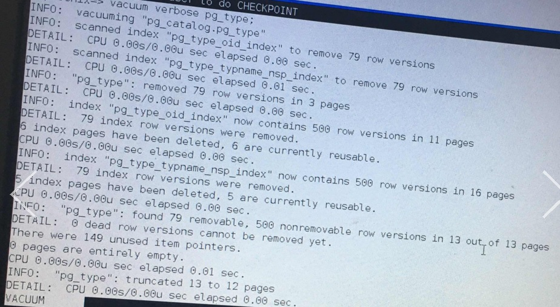
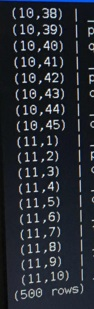
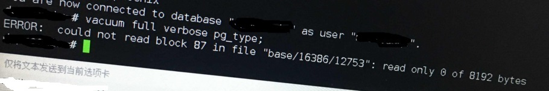
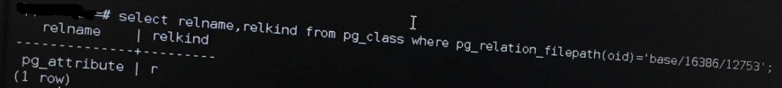
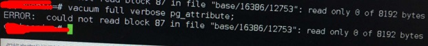
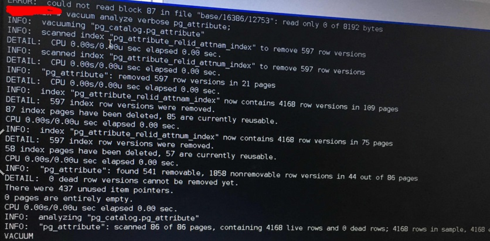
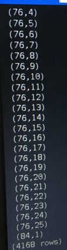
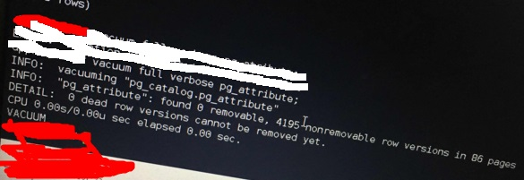

## PostgreSQL 末尾数据块损坏(如pg_type pg_attribute) case  
               
### 作者               
digoal                
                  
### 日期                
2017-03-15                                          
                
### 标签                                                                                                                                
PostgreSQL , 数据块损坏 , pg_type , pg_attribute    
              
----                
              
## 背景        
某些用户遇到的一些问题，报读数据块错误。  
  
```  
ERROR: colud not read block 15 in file "base/16386/12741": read only 0 of 8192 bytes  
```  
  
大概的意识是，第15个数据块，没有正确的读出数据，数据为0字节。  
  
第一反应是数据块坏了。  
  
根据路径，可以查询到损坏的是什么对象  
  
```  
select relname,relkind  from pg_class where pg_relation_filepath(oid)='base/16386/12741';  
  
返回  
  
pg_type  
```  
  
对pg_type对象执行vacuum full verbose，依旧报错  
  
```  
vacuum full verbose pg_type;  
  
ERROR: colud not read block 15 in file "base/16386/12741": read only 0 of 8192 bytes  
```  
  
执行vacuum verbose  
  
```  
vacuum verbose pg_type;  
  
INFO: "pg_type": found 79 removable, 500 nonremovable row versions in 13 out of 13 pages.  
```  
  
  
  
观察到pg_type只有13个page，而前面报错是读第15个块(page)异常。怀疑是与visibility map或freespace map相关文件的BUG。  
  
PS: 每个数据文件，都会对应vm和fsm文件，如果是unlogged 对象，还有init后缀的文件作为标识。其实VM文件，每个PAGE对应2个BIT，表示页是否完全可见，是否为FREEZE状态等。而fsm文件是每个页的剩余空间，每个页用1个字节表示，所以可以表示1/256的精度。  
  
检查pg_type是否已修复，执行select ctid from pg_type，扫描完所有结果  
  
```  
select ctid from pg_type;  
```  
  
  
  
虽然正常了，但是系统中还有报错的块。  
  
接下来对pg_type表执行vacuum full verbose，发现还会报错，报的是另一个文件读取错误。  
  
```  
vacuum full verbose pg_type;  
  
ERROR: colud not read block 87 in file "base/16386/12753": read only 0 of 8192 bytes  
```  
  
  
  
通过报错的文件路径，查询得到这个报错是pg_attribute，因为vacuum full时需要查询pg_attribute(这个表存储的是每个字段的属性)元数据。说明这部分元数据也有损坏。  
  
```  
select relname,relkind  from pg_class where pg_relation_filepath(oid)='base/16386/12753';  
```  
  
  
  
对pg_attribute执行vacuum full verbose,报错相同。因为vacuum full时需要查询pg_attribute元数据  
  
```  
vacuum full verbose pg_attribute;  
  
ERROR: colud not read block 87 in file "base/16386/12753": read only 0 of 8192 bytes  
```  
  
  
  
执行vacuum analyze verbose pg_attribute;  
  
```  
vacuum analyze verbose pg_attribute;  
```  
  
  
  
从执行结果分析，pg_attribute这个表，只有86个数据块，而报错的是读取第87个数据块的错误。  
  
执行完vacuum verbose, pg_attribute也修复了。  
  
执行以下SQL扫全表，确认一下是否正确。  
  
```  
select ctid from pg_attribute;  
```  
  
  
  
执行select ctid from pg_attribute返回了85个数据块的数据（ctid从0开始编号）。    
    
全表扫描没有出现错误，末尾为0的数据块已修复。  
  
最后，执行vacuum full verbose 可以正常执行。  
  
  
  
## 小结  
这个问题可能是尾部块回收的一个BUG，至于怎么引起的，目前怀疑1.可能是Linux ext4文件系统使用data=writeback mount参数，操作系统或文件系统CRASH后导致的问题。2.可能是操作不当引起,例如文件系统进入只读状态,或者强制将数据库变成recovery状态. 3.可能是HOT技术相关的某个BUG,牵涉到vacuum(可以通过pageinspect观察ctid的重定向,是否指向了末尾的空块,可能性很小). 由于还没有找到复现方法, 与社区沟通中。  
  
社区的patch  
  
https://git.postgresql.org/gitweb/?p=postgresql.git;a=commit;h=2523bef15e446d25d16b206bac3b6ef6ad6a8a7d  
  
```
Fix WAL-logging of FSM and VM truncation.

When a relation is truncated, it is important that the FSM is truncated as
well. Otherwise, after recovery, the FSM can return a page that has been
truncated away, leading to errors like:

ERROR:  could not read block 28991 in file "base/16390/572026": read only 0
of 8192 bytes

We were using MarkBufferDirtyHint() to dirty the buffer holding the last
remaining page of the FSM, but during recovery, that might in fact not
dirty the page, and the FSM update might be lost.

To fix, use the stronger MarkBufferDirty() function. MarkBufferDirty()
requires us to do WAL-logging ourselves, to protect from a torn page, if
checksumming is enabled.

Also fix an oversight in visibilitymap_truncate: it also needs to WAL-log
when checksumming is enabled.

Analysis by Pavan Deolasee.

Discussion: <CABOikdNr5vKucqyZH9s1Mh0XebLs_jRhKv6eJfNnD2wxTn=_9A@mail.gmail.com>

Backpatch to 9.3, where we got data checksums.
```
  
如果您遇到读某个块只能读出0字节，可能和文中是同一个CASE，解决方法。  
  
可以使用文中提到的QUERY，找到对应的对象名，如果对象是表或者物化视图，可以使用 ```vacuum analyze 名字;``` 来进行修复。  
  
如果是索引，重建索引即可。  
  
如果你不确定是哪个对象，或者有多个对象损坏，建议直接使用vacuum analyze;进行修复（全库）.或使用如下命令对整个集群的所有数据生效。  
  
```  
vacuumdb -az  
  
这是postgresql的一个命令  
  
vacuumdb --help  
vacuumdb cleans and analyzes a PostgreSQL database.  
  
Usage:  
  vacuumdb [OPTION]... [DBNAME]  
  
Options:  
  -a, --all                       vacuum all databases  
  -d, --dbname=DBNAME             database to vacuum  
  -e, --echo                      show the commands being sent to the server  
  -f, --full                      do full vacuuming  
  -F, --freeze                    freeze row transaction information  
  -j, --jobs=NUM                  use this many concurrent connections to vacuum  
  -q, --quiet                     don't write any messages  
  -t, --table='TABLE[(COLUMNS)]'  vacuum specific table(s) only  
  -v, --verbose                   write a lot of output  
  -V, --version                   output version information, then exit  
  -z, --analyze                   update optimizer statistics  
  -Z, --analyze-only              only update optimizer statistics; no vacuum  
      --analyze-in-stages         only update optimizer statistics, in multiple  
                                  stages for faster results; no vacuum  
  -?, --help                      show this help, then exit  
  
Connection options:  
  -h, --host=HOSTNAME       database server host or socket directory  
  -p, --port=PORT           database server port  
  -U, --username=USERNAME   user name to connect as  
  -w, --no-password         never prompt for password  
  -W, --password            force password prompt  
  --maintenance-db=DBNAME   alternate maintenance database  
  
Read the description of the SQL command VACUUM for details.  
  
Report bugs to <pgsql-bugs@postgresql.org>.  
```  
  
<a rel="nofollow" href="http://info.flagcounter.com/h9V1"  ></a>  
  
  
  
  
  
  
## [digoal's 大量PostgreSQL文章入口](https://github.com/digoal/blog/blob/master/README.md "22709685feb7cab07d30f30387f0a9ae")
  
