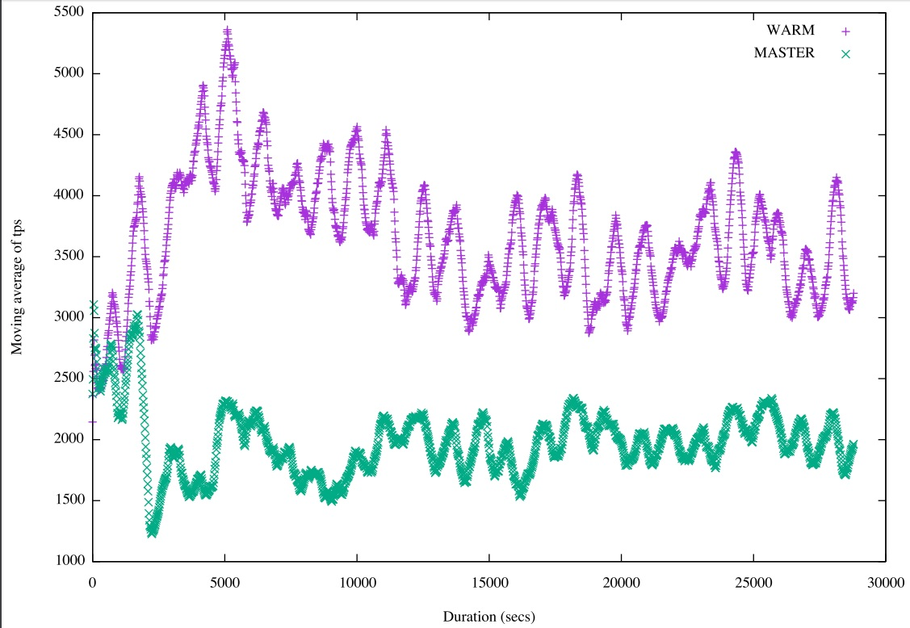

## PostgreSQL 10.0 preview 性能增强 - Write Amplification Reduction Method (WARM)消除某些情况下的INDEX写放大  
##### [TAG 13](../class/13.md)
                    
### 作者                                                                 
digoal               
                      
### 日期                 
2017-03-21                 
                  
### 标签               
PostgreSQL , 10.0 , WARM , 写放大 , 索引写放大    
                    
----              
                       
## 背景     
目前，PostgreSQL的MVCC是多版本来实现的，当更新数据时，产生新的版本。(社区正在着手增加基于回滚段的存储引擎)     
    
由于索引存储的是KEY+CTID（行号），当tuple的新版本与旧版本不在同一个数据块(BLOCK)的时候，索引也要随之变化，当新版本在同一个块里面时，则发生HOT UPDATE，索引的值不需要更新，但是因为产生了一条新的记录，所以也需要插入一条索引item，垃圾回收时，将其回收，因此产生了写放大。     
      
（HOT指，旧的tuple头部，CHAIN指向新的TUPLE。）      
      
但是HOT总不能覆盖100%的更新，当tuple新版本不在同一个BLOCK时，即使索引的字段值未发生变化，也需要更新索引，因为行号变化了。      
      
这个问题在UBER的某篇文档中反映过      
      
[《为PostgreSQL讨说法 - 浅析《UBER ENGINEERING SWITCHED FROM POSTGRES TO MYSQL》》](../201607/20160728_01.md)       
      
PostgreSQL 10.0会将这个问题解决掉，有两个手段。      
      
1\. 增加间接索引的功能。    
    
[《PostgreSQL 10.0 preview 性能增强 - 间接索引(secondary index)》](../201703/20170312_21.md)  
    
2\. 增加WARM的特性，也就是本文要说的。    
    
## 索引放大的问题  
使用pageinspect观察page的变化。    
    
```  
postgres=# create extension pageinspect ;  
CREATE EXTENSION  
```  
    
创建一个表，3列，每列一个索引。  
  
```  
postgres=# create table tbl(id int primary key, c1 int, c2 int);  
CREATE TABLE  
postgres=# create index idx1 on tbl (c1);  
^[[ACREATE INDEX  
postgres=# create index idx2 on tbl (c2);  
CREATE INDEX  
```  
  
插入一条记录  
  
```  
postgres=# insert into tbl values (1,1,1);  
INSERT 0 1  
```  
  
更新一个字段的值，其他字段的值不变  
  
```  
postgres=# begin;  
BEGIN  
postgres=# update tbl set c1=2 where id=1 returning ctid,*;  
 ctid  | id | c1 | c2   
-------+----+----+----  
 (0,2) |  1 |  2 |  1  
(1 row)  
UPDATE 1  
```  
  
ctid=0,2，因此发生了HOT，记录没有出现在其他PAGE。  
  
在另一个会话，观察三个索引的leaf page，可以看到，数据没有变化的索引，也插入了一条ITEM  
  
```  
postgres=# select * from bt_page_items('idx2',1);  
 itemoffset | ctid  | itemlen | nulls | vars |          data             
------------+-------+---------+-------+------+-------------------------  
          1 | (0,2) |      16 | f     | f    | 01 00 00 00 00 00 00 00  
          2 | (0,1) |      16 | f     | f    | 01 00 00 00 00 00 00 00  
(2 rows)  
postgres=# select * from bt_page_items('idx1',1);  
 itemoffset | ctid  | itemlen | nulls | vars |          data             
------------+-------+---------+-------+------+-------------------------  
          1 | (0,1) |      16 | f     | f    | 01 00 00 00 00 00 00 00  
          2 | (0,2) |      16 | f     | f    | 02 00 00 00 00 00 00 00  
(2 rows)  
postgres=# select * from bt_page_items('tbl_pkey',1);  
 itemoffset | ctid  | itemlen | nulls | vars |          data             
------------+-------+---------+-------+------+-------------------------  
          1 | (0,2) |      16 | f     | f    | 01 00 00 00 00 00 00 00  
          2 | (0,1) |      16 | f     | f    | 01 00 00 00 00 00 00 00  
(2 rows)  
```  
  
使用vacuum回收垃圾（或者等其自动回收），垃圾回收时，如果要删除heap表中的dead tuple，首先要删除索引对应的item。  
  
```  
postgres=# end;  
COMMIT  
  
postgres=# vacuum verbose tbl;  
INFO:  vacuuming "public.tbl"  
INFO:  scanned index "tbl_pkey" to remove 1 row versions  
DETAIL:  CPU 0.00s/0.00u sec elapsed 0.00 sec.  
INFO:  scanned index "idx1" to remove 1 row versions  
DETAIL:  CPU 0.00s/0.00u sec elapsed 0.00 sec.  
INFO:  scanned index "idx2" to remove 1 row versions  
DETAIL:  CPU 0.00s/0.00u sec elapsed 0.00 sec.  
INFO:  "tbl": removed 1 row versions in 1 pages  
DETAIL:  CPU 0.00s/0.00u sec elapsed 0.00 sec.  
INFO:  index "tbl_pkey" now contains 1 row versions in 2 pages  
DETAIL:  1 index row versions were removed.  
0 index pages have been deleted, 0 are currently reusable.  
CPU 0.00s/0.00u sec elapsed 0.00 sec.  
INFO:  index "idx1" now contains 1 row versions in 2 pages  
DETAIL:  1 index row versions were removed.  
0 index pages have been deleted, 0 are currently reusable.  
CPU 0.00s/0.00u sec elapsed 0.00 sec.  
INFO:  index "idx2" now contains 1 row versions in 2 pages  
DETAIL:  1 index row versions were removed.  
0 index pages have been deleted, 0 are currently reusable.  
CPU 0.00s/0.00u sec elapsed 0.00 sec.  
INFO:  "tbl": found 1 removable, 1 nonremovable row versions in 1 out of 1 pages  
DETAIL:  0 dead row versions cannot be removed yet.  
There were 0 unused item pointers.  
Skipped 0 pages due to buffer pins.  
0 pages are entirely empty.  
CPU 0.00s/0.00u sec elapsed 0.00 sec.  
VACUUM  
  
  
ostgres=# select * from bt_page_items('idx1',1);  
 itemoffset | ctid  | itemlen | nulls | vars |          data             
------------+-------+---------+-------+------+-------------------------  
          1 | (0,2) |      16 | f     | f    | 02 00 00 00 00 00 00 00  
(1 row)  
  
postgres=# select * from bt_page_items('idx2',1);  
 itemoffset | ctid  | itemlen | nulls | vars |          data             
------------+-------+---------+-------+------+-------------------------  
          1 | (0,2) |      16 | f     | f    | 01 00 00 00 00 00 00 00  
(1 row)  
  
postgres=# select * from bt_page_items('tbl_pkey',1);  
 itemoffset | ctid  | itemlen | nulls | vars |          data             
------------+-------+---------+-------+------+-------------------------  
          1 | (0,2) |      16 | f     | f    | 01 00 00 00 00 00 00 00  
(1 row)  
```  
  
写放大就是这样产生的，所以10.0的两个特性可以解决这样的问题。  
  
## 间接索引  
之前讲过，这里就不重复了  
  
[《PostgreSQL 10.0 preview 性能增强 - 间接索引(secondary index)》](../201703/20170312_21.md)  
  
## WARM  
warm使用chain和recheck来解决写放大的问题。  
  
建表与索引如下  
  
```  
CREATE TABLE test (col1 int, col2 int, col3 int, col4 text);  
CREATE INDEX testindx_col1 ON test (col1);  
CREATE INDEX testindx_col2 ON test (col2);  
CREATE INDEX testindx_col3 ON test (col3);  
  
INSERT INTO test VALUES (1, 11, 111, 'foo');  
```  
  
当前的索引条目  
  
```  
testindx_col1: (1)    ===> (0,1)  
testindx_col2: (11)   ===> (0,1)  
testindx_col3: (111)  ===> (0,1)  
```  
  
WARM上场，更新col1=2，指向0,2，此时没有变更的索引，不需要更新，依旧指向0,1，而发生变化的索引，也指向0,1，通过chain指向0,2。  
  
```  
Now if a transaction T1 UPDATEs the table such as, "UPDATE test SET col1 =  
2". This does not satisfy the HOT property since index column 'col1' is  
being updated. But as per WARM algorithm, since only testindx_col1's index  
key has changed, we insert a new index tuple only in testindx_col1. Say the  
new heap tuple has CTID (0,2). So testindx_col1 will have a new index tuple  
with key (2), but still pointing to CTID (0,1)  
  
testindx_col1: (1)    ==>  (0,1)  
               (2)    ===> (0,1)  
testindx_col2: (11)   ===> (0,1)  
testindx_col3: (111)  ===> (0,1)  
  
The heap at this point has two tuples, linked by CTID chain.  
(0,1)* ---> (0,2)  
```  
  
不管怎么更新，都通过chain来指向，所以不需要修改没有发生变化的索引。  
  
```  
If T3 later updates col2 and T4 further updates col3,  
T3: UPDATE test SET col2 = 12;  
T4: UPDATE test SET col3 = 112;  
  
The heap will look like:  
(0,1)* ---> (0,2) ---> (0,3) ---> (0,4)  
  
And the index pointers will be:  
  
testindx_col1: (1)   ===> (0,1)  
                       (2)   ===> (0,1)  
testindx_col2: (11)  ===> (0,1)  
                       (12)  ===> (0,1)  
testindx_col3: (111) ===> (0,1)  
                       (112) ===> (0,1)  
```  
  
通过FLAG表示当前行是否有chain。  
  
当查询到chain tuple时，顺藤摸瓜，根据事务快照，判断可见性。  
  
为什么需要recheck, 因为warm的引入发生值变化的索引，值与heap root lp中存储的值不一样了，因此需要recheck.  
  
warm的引入，对有较多索引的表的更新，性能提升是非常明显的。  
  
  
    
这个patch的讨论，详见邮件组，本文末尾URL。      
      
PostgreSQL社区的作风非常严谨，一个patch可能在邮件组中讨论几个月甚至几年，根据大家的意见反复的修正，patch合并到master已经非常成熟，所以PostgreSQL的稳定性也是远近闻名的。      
        
## 参考      
https://commitfest.postgresql.org/13/775/  
    
https://www.postgresql.org/message-id/flat/CABOikdMNy6yowA+wTGK9RVd8iw+CzqHeQSGpW7Yka_4RSZ_LOQ@mail.gmail.com#CABOikdMNy6yowA+wTGK9RVd8iw+CzqHeQSGpW7Yka_4RSZ_LOQ@mail.gmail.com  
  
https://www.postgresql.org/message-id/CABOikdMop5Rb_RnS2xFdAXMZGSqcJ-P-BY2ruMd%2BbuUkJ4iDPw@mail.gmail.com  
  
<a rel="nofollow" href="http://info.flagcounter.com/h9V1"  ></a>  
  
  
  
  
  
  
## [digoal's 大量PostgreSQL文章入口](https://github.com/digoal/blog/blob/master/README.md "22709685feb7cab07d30f30387f0a9ae")
  
