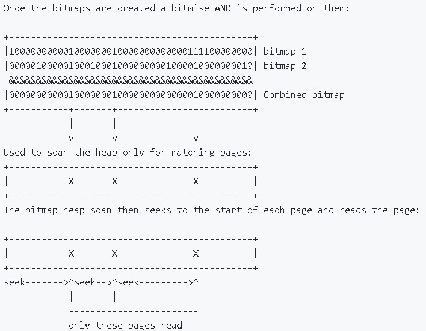
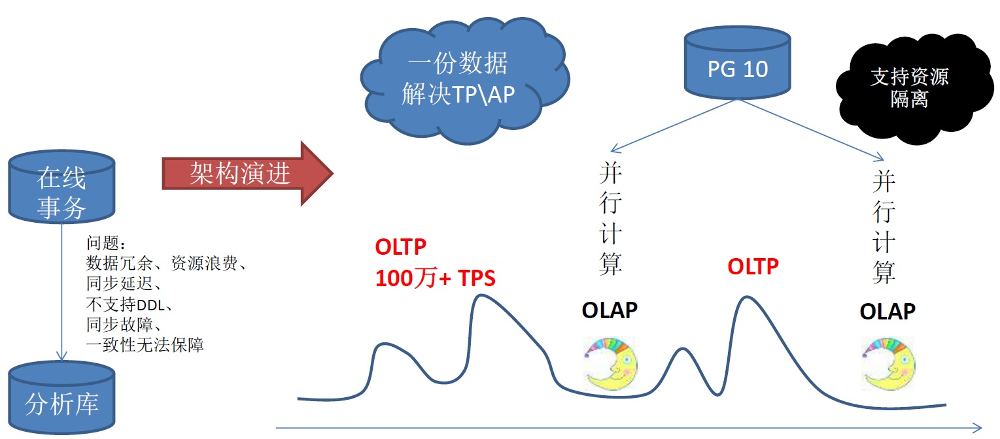

## 数据库三十六计 - PostgreSQL 三十六计(上)    
##### [TAG 22](../class/22.md)  
                      
### 作者                                                                   
digoal                 
                        
### 日期                   
2017-03-22                  
                    
### 标签                 
PostgreSQL , 三十六计    
                      
----                
                         
## 背景      
## PostgreSQL 三十六计 - 上    
### 1. 任意字段组合查询有高招。  
  
在业务中，任意字段组合查询的需求越来越多，也就是俗称的ADHoc查询。例如前端人机交互，根本不知道用户会对哪些字段进行检索，任意字段组合搜索、透视。为了达到查询加速效果，传统数据库需要对每一种查询组合建立多字段复合索引，导致索引非常多，非常冗余。写入性能下降也非常严重。  
  
PostgreSQL 有多种技术来解决任意字段搜索问题。  
  
1、GIN复合索引。通过GIN复合索引，用户可以对GIN索引内的任意字段或字段组合进行搜索，保持非常高的查询效率。  
  
```  
create index idx on tbl using GIN (col1, col2, ... coln);  
```  
  
2、多个单列索引组合位图扫描。用户可以对这些字段任意组合搜索，保持非常高的查询效率。  
  
```  
create index idx1 on tbl (col1);  
create index idx2 on tbl (col2);  
  
create index idxn on tbl (coln);  
```  
  
3、布隆过滤索引。支持任意字段组合的等值搜索。  
  
```  
create index idx1 on tbl using bloom (col1, col2, ... coln);  
```  
  
以上任意方法，都可以帮助开发人员解决多字段任意组合搜索的需求。  
  
背景技术实际上都是位图扫描，每个字段的过滤条件对应一个位图，当有多个输入字段条件时，根据条件的与或关系，对各个位图进行与或，得到满足条件的BIT，扫描对应BIT对应的block即可。  
  
  
  
[《HTAP数据库 PostgreSQL 场景与性能测试之 20 - (OLAP) 用户画像圈人场景 - 多个字段任意组合条件筛选与透视》](../201711/20171107_21.md)    
  
### 2. 物联网、智能DNS、金融、气象等行业数据中，在某个时间区间，数据具有范围含义，如何高效对付这种场景的包含、相交搜索？  
  
范围查询很苦恼，效率低下量不少，range类型来帮忙，一条记录顶千条，查询索引GiST来帮忙，零点几毫秒要不要。  
  
范围类型 + GIST索引，传感器多条记录压缩为单条记录范围表述；支持智能DNS、金融、气象、传感器数据等高效范围匹配。  
  
例如1个传感器5分钟产生了10000条记录，在1.1-1.4之间波动，可以存储为[1.1, 1.4]一条记录，而不是1万条记录。  
  
匹配时支持 ```$? @<``` 字段 高效率索引检索。  
  
```  
create table tbl (  
  sid int,        -- 传感器ID  
  ts tsrange,     -- 采样时间区间  
  val numrange,   -- 采样区间的值范围  
  cnt int,        -- 采样了多少个点  
  sum float8,     -- 采样值综合  
  avg float8      -- 采样值均值  
);  
  
create index idx on tbl using gist (val);  
  
select * from tbl where val @> 1.1;    -- 取值区间, 包含1.1的行  
```  
  
### 3. O2O，社交没有GIS可不得了。天气预报、导航、路由规划、宇航局、测绘局没有GIS也要乱。  
  
空间相关的业务上不仅有经纬度、点面判断、距离判断的需求。还有栅格、路径规划、图层、拓扑、地址经纬度MAPPING、空间类型索引与操作符的需求。不仅有二维数据，还有多维数据。不仅支持串行，还有多核并行。PostGIS服务于军用、民用、科研几十年，覆盖面广、开发框架支持丰富，值得信赖。  
  
PostGIS，用于处理空间数据类型。  
  
pgrouting，内置多种图算法，用于处理基于路网的路径规划，解决商旅问题等。  
  
pgpointcloud，点云插件，用于存储点云数据。  
  
```  
create extension postgis;  
create extensioin pgrouting;  
create extension pgpointcloud;  
```  
  
### 4. 监控系统要颠覆，主动问询模式能耗比低，百分之99是无用功。PostgreSQL异步消息、流式计算一出手，能耗比提升99，千万NVPS有木有。  
  
在物联网中，结合PostgreSQL的流式计算，当传感器上报的数据达到触发事件的条件时，往异步消息通道发送一则消息，应用程序实时的接收异步消息，发现异常。  
  
即节省了空间（结合流式处理，完全可以轻量化部署），又能提高传播的效率（一对多的传播），程序设计也可以简单化。  
  
例如zabbix监控系统，如果每秒产生千万级的新值(new values per second)，传统的zabbix处理会非常吃力，除了插入吃力(实际上大部分插入是无用功，正常的值完全可以适应范围类型压缩插入，异常的值才是有效值)，主动查询询问式的方式也很吃力。  
  
使用PostgreSQL流式计算功能，仅仅当值有问题（根据流规则判断）时，向异步消息通道发送异常消息，WEB服务仅需监控通道即可，无需频繁的查询数据库来获取是否有异常。PostgreSQL单机就可以支持更高的NVPS，例如百万级/s是非常轻松的。  
  
[《PostgreSQL 异步消息实践 - Feed系统实时监测与响应(如 电商主动服务) - 分钟级到毫秒级的实现》](../201711/20171111_01.md)    
  
[《HTAP数据库 PostgreSQL 场景与性能测试之 27 - (OLTP) 物联网 - FEED日志, 流式处理 与 阅后即焚 (CTE)》](../201711/20171107_28.md)    
  
[《HTAP数据库 PostgreSQL 场景与性能测试之 31 - (OLTP) 高吞吐数据进出(堆存、行扫、无需索引) - 阅后即焚(读写大吞吐并测)》](../201711/20171107_32.md)    
  
[《HTAP数据库 PostgreSQL 场景与性能测试之 32 - (OLTP) 高吞吐数据进出(堆存、行扫、无需索引) - 阅后即焚(JSON + 函数流式计算)》](../201711/20171107_33.md)    
  
### 5. DT时代数据多得不得了，传统关系数据库扛不住，来看看PostgreSQL流式实时处理溜不溜。  
解决监控、物联网、金融 等业务场景实时计算和实时事件响应需求。  
  
定义stream(流)，然后基于stream定义对应的transform(事件触发模块)，以及Continuous Views(实时统计模块)。  
  
数据往流里面插入，transform和Continuous Views就在后面实时的对流里的数据进行处理，对开发人员来说很友好，很高效。  
  
值得庆祝的还有，所有的接口都是SQL操作，非常的方便，大大降低了开发难度。  
  
https://github.com/pipelinedb/pipelinedb  
  
```  
CREATE STREAM wiki_stream (hour timestamp, project text, title text, view_count bigint, size bigint);  
  
CREATE CONTINUOUS VIEW wiki_stats AS  
SELECT hour, project,  
        count(*) AS total_pages,  
        sum(view_count) AS total_views,  
        min(view_count) AS min_views,  
        max(view_count) AS max_views,  
        avg(view_count) AS avg_views,  
        percentile_cont(0.99) WITHIN GROUP (ORDER BY view_count) AS p99_views,  
        sum(size) AS total_bytes_served  
FROM wiki_stream  
GROUP BY hour, project;  
```  
  
```  
CREATE TABLE t (user text, value int);  
  
CREATE OR REPLACE FUNCTION insert_into_t()  
  RETURNS trigger AS  
  $$  
  BEGIN  
    INSERT INTO t (user, value) VALUES (NEW.user, NEW.value);  
    RETURN NEW;  
  END;  
  $$  
  LANGUAGE plpgsql;  
  
CREATE CONTINUOUS TRANSFORM ct AS  
  SELECT user::text, value::int FROM stream WHERE value > 100  
  THEN EXECUTE PROCEDURE insert_into_t();  
```  
  
### 6. 支付宝AR红包闹新年，即有位置又有图片相似搜索，敢问数据库能不能做，PostGIS、PostgreSQL imgsmlr图像特征查询亮高招。  
互联网、AR红包、虚拟现实与GIS结合、广告营销 等业务场景。既有地理位置数据，又有图像处理需求。  
  
例如AR红包是GIS与图像、社交、广告等业务碰撞产生的一个全新业务场景。  
  
需要做广告投放的公司，可以对着广告牌，或者店铺中的某个商品拍照，然后藏AR红包。  
  
要找红包的人，需要找到这家店，并且也对准藏红包的物体拍摄，比较藏红包和找红包的两张图片，就可以实现抢红包的流程。  
  
PostGIS处理地理信息，imgsmlr处理图像特征值相似检索，完美支持以上场景。功能强大性能好。  
  
```  
create extension postgis;  
create extension imgsmlr;  
```  
  
[《(AR虚拟现实)红包 技术思考 - GIS与图像识别的完美结合》](../201701/20170113_01.md)    
  
### 7. 相似的数组、相似的文本、相似的分词、相似的图像数据库能处理吗？PostgreSQL 火眼金睛，实时辨别相似数据。盗图、盗文跑不掉。  
在搜索引擎、数据公司、互联网中都会有网络爬虫的产品，或者有人机交互的产品中。  
  
有人的地方就有江湖，盗文、盗图的现象屡见不鲜，而更惨的是，盗图和盗文还会加一些水印。  
  
也就是说，你在判断盗图、盗文的时候，不能光看完全一致，可能要看的是相似度。  
  
这给内容去重带来了很大的麻烦。  
  
PostgreSQL数据库整合了相似度去重的算法和索引接口，可以方便、高效的处理相似数据。  
  
如相似的数组、相似的文本、相似的分词、相似的图像的搜索和去重，根据图片鉴黄等等。  
  
[《用PostgreSQL 做实时高效 搜索引擎 - 全文检索、模糊查询、正则查询、相似查询、ADHOC查询》](../201712/20171205_02.md)    
  
[《HTAP数据库 PostgreSQL 场景与性能测试之 17 - (OLTP) 数组相似查询》](../201711/20171107_18.md)    
  
[《HTAP数据库 PostgreSQL 场景与性能测试之 16 - (OLTP) 文本特征向量 - 相似特征(海明...)查询》](../201711/20171107_17.md)    
  
[《HTAP数据库 PostgreSQL 场景与性能测试之 13 - (OLTP) 字符串搜索 - 相似查询》](../201711/20171107_14.md)   
  
### 8. 数据库CPU杀手：模糊查询、正则匹配有解吗？PostgreSQL GIN, GiST索引一把抓，亿级数据毫秒响应很靠谱。  
PostgreSQL可以针对整条记录、指定字段、多个字段，建立全文索引。  
  
支持高效的全文检索；支持```%x%```的前后全模糊查询；支持正则表达式查询；  
  
以上全文检索、前后模糊、相似查询全部支持索引，亿级数据，毫秒级响应速度。  
  
背景原理，PostgreSQL 使用pg_trgm插件对文本进行自动切分，建立GIN索引，查询时根据被查询的词自动切分并匹配倒排索引，通过倒排快速实现模糊搜索。  
  
```  
create extension pg_trgm;  
  
create index idx on tbl using GIN (txt gin_trgm_ops);  
  
select * from tbl where txt ~ 'xxx';  
  
select * from tbl where txt like '%xxx';  
```  
  
[《HTAP数据库 PostgreSQL 场景与性能测试之 12 - (OLTP) 字符串搜索 - 前后模糊查询》](../201711/20171107_13.md)    
  
[《HTAP数据库 PostgreSQL 场景与性能测试之 9 - (OLTP) 字符串模糊查询 - 含索引实时写入》](../201711/20171107_10.md)    
  
### 9. 云端高招，冷热分离、多实例数据共享。分析师、快速试错、OLTP、OLAP一网打尽。  
助力分析师，快速建模与试错。  
  
对传统企业来说，OLTP系统大多数使用的是Oracle等商业数据库，使用PostgreSQL可以与Oracle的功能、性能、SQL语法等做到高度兼容。  
  
而对于分析场景，使用MPP产品HybridDB(基于GPDB)，则可以很好的解决PB级以上的AP需求。  
  
OLTP与OLAP的数据，通过OSS_EXT外部表插件，将数据存储在阿里云OSS对象存储中，多个实例可以同一份数据，分析师在分析时，不影响生产实例。OSS对象存储的访问速度取决于并行度。  
  
  
  
[《打造云端流计算、在线业务、数据分析的业务数据闭环 - 阿里云RDS、HybridDB for PostgreSQL最佳实践》](../201707/20170728_01.md)    
  
RDS PG OSS 外部表文档：https://help.aliyun.com/knowledge_detail/43352.html  
  
HDB PG OSS 外部表文档：https://help.aliyun.com/document_detail/35457.html  
  
### 10. HTAP是趋势，OLTP数据库能同时实现OLAP吗？PostgreSQL 大补丸：多核并行、向量计算、JIT、列式存储、聚合算子复用。提升两个数量级小case。  
OLAP系统，单个任务需要对大量的数据进行运算。  
  
多核并行，解决大数据运算时的CPU瓶颈。单个分析型的SQL，可以用到多核并行计算，提升查询性能。  
  
  
  
向量计算，使用CPU缓存，批量进行向量化计算，不借助外力的情况下，提升10倍以上性能。  
  
JIT，大幅降低记录数庞大运算时，频繁函数式调用引入的切换开销。大幅提升性能。  
  
列存储，大幅降低行存储deform引入的开销。大幅降低扫描的数据量，大幅降低缓存的使用量。  
  
聚合算子复用，大幅降低多个聚合函数，CPU的计算开销。例如(sum,avg,count,min,max)可以复用算子降低运算需求。  
  
### 11. 商业时代，广告满天飞，提高营销转化率有高招。PostgreSQL实时用户画像与圈人来帮忙，万亿user tags毫秒响应开心么。  
助力广告主实时营销。  
  
推荐系统的三个核心问题  
  
精准，属于数据挖掘系统的事情，使用PostgreSQL MADlib机器学习库可以实现标签数据的学习和人物标签的生成。  
  
实时，实时的更新标签，在数据库中进行流式处理，相比外部流处理的方案，节约资源，减少开发成本，提高开发效率，提高时效性。  
  
高效，使用PostgreSQL以及数组的GIN索引功能，实现在万亿USER_TAGS的情况下的毫秒级别的圈人功能。  
  
[《恭迎万亿级营销(圈人)潇洒的迈入毫秒时代 - 万亿user_tags级实时推荐系统数据库设计》](../201612/20161225_01.md)    
  
使用流式计算、结合阿里云varbitx插件，实现实时万亿级USER_TAGS的毫秒级实时查询，同时只要原始存储成本的1/80。  
  
[《阿里云RDS PostgreSQL varbitx实践 - 流式标签 (阅后即焚流式批量计算) - 万亿级，任意标签圈人，毫秒响应》](../201712/20171212_01.md)    
  
### 12. 危化品管理有痛点，PostgreSQL GIS、化学类型、流计算来帮忙。  
危化品的监管，包括位置信息处理、点面判断、按距离搜索、化学数据处理。  
  
危化品种类繁多。包括如常见的易爆、易燃、放射、腐蚀、剧毒、等等。  
  
由于危化品的危害极大，所以监管显得尤为重要，  
  
1\. 生产环节  
  
将各个原来人工监控的环节数字化，使用 传感器、流计算、规则（可以设置为动态的规则） 代替人的监管和经验。  
  
2\. 销售环节  
  
利用社会关系分析，在销售环节挖掘不法分子，挖掘骗贷、骗保的虚假交易。利用地理位置跟踪，掌控整个交易的货物运输过程。  
  
3\. 仓储环节  
  
仓储环节依旧使用传感器、流计算、应急机制对仓管的产品进行实时的监管，而对于危化品本身，我们已经不能使用普通的数据类型来存储，很幸运的是在PostgreSQL的生态圈中，有专门支持化学行业的RDKit支持，支持存储化合物类型，以及基于化合物类型的数据处理  
  
（包括化学反应，分解等等）。  
  
4\. 运输环节  
  
在危化品的运输环节，使用传感器对货车、集装箱内的危化品的指标进行实时的监控，使用流式数据库pipelineDB流式的处理传感器实时上报的数据；使用PostgreSQL+PostGIS+pgrouting 对于货车的形式路径进行管理，绕开禁行路段、拥堵路段。  
  
当出现事故时，使用PostgreSQL的GIS索引，快速的找出附近的应急救助资源（如交警、消防中队、医院、120）。  
  
同时对危化品的货物存储，使用化学物类型存储，可以对这些类型进行更多的约束和模拟的合成，例如可以发现化学反应，防止出现类似天津爆炸事件。  
  
5\. 消耗环节  
  
增加剩余量的监控，在闭环中起到很好的作用，达到供需平衡，避免供不应求，或者供过于求的事情发生。  
  
6\. 动态指挥中心  
  
在给生产、仓库、物流配送、消耗环节添加了终端、传感器后，就建立了一个全面的危化品监管数据平台。 构建实时的监管全图。  
  
7\. 缉毒、发现不法分子等  
  
通过社会关系学分析，结合RDKit插件，在数据库中存储了人的信息，存储了人与化学物的关系（比如购买过），然后，根据社会关系学分析，将一堆的化合物（原材料）结合起来，看看会不会发生反应，生成毒品或危化品。从而发现不法分子。  
  
[《从天津滨海新区大爆炸、危化品监管聊聊 IT人背负的社会责任感》](../201612/20161228_01.md)    
  
http://www.rdkit.org/docs/Cartridge.html  
  
<a rel="nofollow" href="http://info.flagcounter.com/h9V1"  ></a>  
  
  
  
  
  
  
## [digoal's 大量PostgreSQL文章入口](https://github.com/digoal/blog/blob/master/README.md "22709685feb7cab07d30f30387f0a9ae")
  
