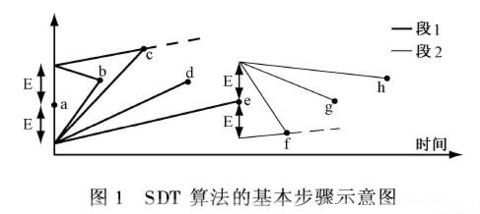

## 数据库三十六计 - PostgreSQL 三十六计(中)    
##### [TAG 22](../class/22.md)  
                      
### 作者                                                                   
digoal                 
                        
### 日期                   
2017-03-22                  
                    
### 标签                 
PostgreSQL , 三十六计    
                      
----                
                         
## 背景      
## PostgreSQL 三十六计 - 中    
### 13. 金融风控、公安刑侦、社会关系、人脉分析 等业务场景，高效实现图式数据搜索。    
    
利用PostgreSQL函数编程，异步消息，复杂JOIN，递归查询，一对多关系存储等手段，解决高效的图式数据查询需求。     
        
1\. 猎头挖人       
    
作为IT人士或者猎头、HR，对Linkedin一定不陌生，领英网实际上就是一个维护人际关系的网站。            
           
通过搜索你的一度人脉，可以找到与你直接相关的人，搜索2度人脉，可以搜索到与你间接相关的人。           
            
当然你还可以继续搜索N度人脉，不过那些和你可能就不那么相关了。            
           
如果你知道和美女范冰冰隔了几度人脉，是不是有点心动了呢？            
           
其实在古代，就有这种社会关系学，还有这种专门的职业，买官卖官什么的，其实都是人脉关系网。看过红楼梦的话，你会发现那家子人怎么那么多亲戚呢？             
           
2\. 公安破案           
           
公安刑侦学也是一类人脉相关的应用，只是现在的关系和行为越来越复杂，这种关系也越来越复杂，原来的人能接触的范围基本上就靠2条腿，顶多加匹马。          
          
现在，手机，电脑，ATM机，超时，摄像头，汽车等等，都通过公路网、互联网连接在一起。          
            
一个人的行为，产生的关系会更加的复杂，单靠人肉的关系分析，刑侦难度变得越来越复杂。           
                
3\. 金融风控            
           
比如银行在审核贷款资格时，通常需要审核申请人是否有偿还能力，是否有虚假消息，行为习惯，资产，朋友圈等等。  同样涉及到复杂的人物关系，人的行为关系分析等等。           
          
此类围绕人为中心，事件为关系牵连的业务催生了图数据库的诞生。           
            
目前比较流行的图数据库比如neo4j，在数据量超过内存大小时，性能下降较厉害。          
            
PostgreSQL是一个功能全面的数据库，其中就有一些图数据库产品的后台是使用PostgreSQL的，例如OpenCog， Cayley等。              
           
除了这些图数据库产品，PostgreSQL本身在关系查询，关系管理方面也非常的成熟，十亿量级的关系网数据，3层关系运算仅需毫秒。         
        
还可以用于运算人与人之间的最短关系，穷举关系等。        
        
主要用到的技术plpgsql服务端编程、异步消息、数组、游标、pgrouting路由算法等。        
  
[《小微贷款、天使投资(风控助手)业务数据库设计(图式搜索\图谱分析) - 阿里云RDS PostgreSQL, HybridDB for PostgreSQL最佳实践》](../201708/20170801_01.md)    
  
[《金融风控、公安刑侦、社会关系、人脉分析等需求分析与数据库实现 - PostgreSQL图数据库场景应用》](../201612/20161213_01.md)    
    
### 14. with recursive递归查询有妙用。    
    
大量数据的求差集、最新数据搜索, 最新日志数据与全量数据的差异比对, 递归收敛扫描，提升数百倍性能。    
  
[《PostgrSQL 递归SQL的几个应用 - 极客与正常人的思维》](../201705/20170519_01.md)    
  
[《PostgreSQL 递归查询CASE - 树型路径分组输出》](../201703/20170324_01.md)    
  
[《用PostgreSQL找回618秒逝去的青春 - 递归收敛优化》](../201612/20161201_01.md)    
  
[《distinct xx和count(distinct xx)的变态递归优化方法 - 索引收敛(skip scan)扫描》](../201611/20161128_02.md)    
  
[《时序数据合并场景加速分析和实现 - 复合索引，窗口分组查询加速，变态递归加速》](../201611/20161128_01.md)    
  
[《PostgreSQL 使用递归SQL 找出数据库对象之间的依赖关系》](../201607/20160725_01.md)    
  
[《PostgreSQL 递归死循环案例及解法》](../201607/20160723_01.md)    
  
[《PostgreSQL 递归查询一例 - 资金累加链》](../201604/20160405_01.md)    
  
[《PostgreSQL Oracle 兼容性之 - WITH 递归 ( connect by )》](../201512/20151221_02.md)    
  
[《递归优化CASE - group by & distinct tuning case : use WITH RECURSIVE and min() function》](../201210/20121009_01.md)    
  
[《递归优化CASE - performance tuning case :use cursor\trigger\recursive replace (group by and order by) REDUCE needed blockes scan》](../201209/20120914_01.md)    
    
### 15. 数据一致性分享、数据泵    
    
在IoT的场景中，有流式分析的需求，也有存储历史数据的需求，同时还有数据挖掘的需求，搜索引擎可能也需要同一份数据，还有一些业务可能也要用到同一份数据。           
          
但是如果把数据统统放到一个地方，这么多的业务，它们有的要求实时处理，有的要求批量处理，有的可能需要实时的更新数据，有的可能要对大数据进行分析。       
    
10万级别左右的机器，PostgreSQL 的数据吞吐量可以达到100万条/s以上，同时数据库本身具备了严格的可靠性和一致性保证。        
        
PostgreSQL为分享数据提供了插槽的概念，每个插槽对应一个目标端，支持断点续传，支持多个目标端。用于流式的分享数据是非常好的选择。        
  
[《实时数据交换平台 - BottledWater-pg with confluent》](../201612/20161205_02.md)    
  
[《PostgreSQL 逻辑订阅 - DDL 订阅 实现方法》](../201712/20171204_04.md)    
  
[《PostgreSQL 逻辑订阅 - 给业务架构带来了什么希望？》](../201704/20170413_01.md)    
  
[《PostgreSQL 10.0 preview 逻辑订阅 - 原理与最佳实践》](../201702/20170227_01.md)    
    
### 16. ad lock解决高并发更新少量记录的秒杀问题    
秒杀在商品交易中是一个永恒的话题，从双十一，到一票难求，比的仅仅是手快吗？           
            
其实对于交易平台来说，面对的不仅仅是人肉，还有很多脚本，外挂自动化的抢购系统，压力可想而知。           
            
秒杀的优化手段很多，就拿数据库来说，有用排队机制的，有用异步消息的，有用交易合并的。           
            
PostgreSQL提供了一种更极端的秒杀应对方法，裸秒。可以让用户尽情的释放激情，以一台32核64线程的机器为例，每秒可以获取、探测约130万次的ad lock。            
            
试想一下，对单条记录的秒杀操作，达到了单机100万/s的处理能力后，秒杀算什么？100台机器就能处理1亿/s的秒杀请求。        
  
[《HTAP数据库 PostgreSQL 场景与性能测试之 30 - (OLTP) 秒杀 - 高并发单点更新》](../201711/20171107_31.md)    
  
[《聊一聊双十一背后的技术 - 不一样的秒杀技术, 裸秒》](../201611/20161117_01.md)    
  
[《PostgreSQL 秒杀场景优化》](../201509/20150914_01.md)    
    
### 17. PostgreSQL 使用阿里云 varbitx支持实时用户画像    
用户画像在市场营销的应用重建中非常常见，已经不是什么新鲜的东西，比较流行的解决方案是给用户贴标签，根据标签的组合，圈出需要的用户。          
          
通常画像系统会用到宽表，以及分布式的系统。          
          
宽表的作用是存储标签，例如每列代表一个标签，但是通常数据库到2000个列基本就是极限了，上万TAG的话，只能使用多表JOIN来实现，效率较差。        
        
另一方面，使用宽表(甚至列存储)，标签的筛选性能也比较差（无法达到实时级别）。        
          
以PostgreSQL数据库为基础，以BIT来存储用户，每行一个TAG的方式，单机支持十万亿user tags体量，毫秒级实时圈人。         
    
[《阿里云RDS PostgreSQL varbitx实践 - 流式标签 (阅后即焚流式批量计算) - 万亿级，任意标签圈人，毫秒响应》](../201712/20171212_01.md)    
  
[《阿里云RDS for PostgreSQL varbitx插件与实时画像应用场景介绍》](../201705/20170502_01.md)    
  
[《基于 阿里云 RDS PostgreSQL 打造实时用户画像推荐系统(varbitx)》](../201610/20161021_01.md)    
        
### 18. 路径动态规划，助力物流配送、打车软件、导航软件、出行软件、高速、高铁等业务场景        
物流行业是被电子商务催生的产业之一。          
            
快件的配送和揽件的调度算法是物流行业一个非常重要的课题，直接关系到配送或揽件的时效，以及物流公司的运作成本。            
           
好的算法，可以提高时效，降低成本，甚至可以更好的调动社会资源，就像滴滴打车一样，也许能全民参与哦。            
           
以后也许上班路途还能顺路提供快递服务呢。            
           
以物流行业为例，PostgreSQL为物流行业应用提供了包括机器学习(madlib)、路径规划(pgrouting)、地理位置信息存储和处理等基础服务。     
  
[《聊一聊双十一背后的技术 - 物流、动态路径规划》](../201611/20161114_01.md)    
        
### 19. 金融级可靠性，事务级可控多副本。       
传统的金融行业高度依赖共享存储来解决数据库的高可用，数据0丢失以及异地容灾的场景。          
        
共享存储的解决方案价格昂贵，对厂商的依赖较大。        
          
PostgreSQL基于同步流复制的任意副本解决方案，在解决0丢失，高可用以及容灾的问题的同时，还可以提供只读的功能。相比传统的存储解决方案，优势更加明显。     
    
允许用户根据事务的可靠性要求，设置事务所需的副本数。    
  
[《PostgreSQL - 鱼与熊掌可兼得 - 多副本0丢失与高性能兼得 - 事务级异步、同步开关》](../201712/20171207_01.md)    
  
PostgreSQL 事务提交模式synchronous_commit 介绍：  
  
```    
synchronous_commit    
    
local, remote_write, remote_apply, on, off.    
```    
    
解释    
    
```    
local, 本地fsync    
    
remote_write, 本地fsync + 超阈值个数的 sync standby write   (quorum based sync standby)    
    
on, 本地fsync + 超阈值个数的 sync standby fsync  (quorum based sync standby)    
    
remote_write, 本地fsync + 超阈值个数的 sync standby apply   (quorum based sync standby)    
    
off, 本地write       
```    
    
### 20. 块级瘦索引，解决物联网、金融、日志、行为轨迹类数据快速导入与高效查询的矛盾    
    
在物联网、金融、日志类型场景中，数据持续不断的产生，对于堆存储来说，有线性相关的特点。        
        
例如，时间字段往往和物理存储的顺序具有线性相关性。        
        
例如，有一些自增字段，也和堆存储的物理顺序线性相关。        
        
对与物理存储线性相关的字段（时间，自增字段），PostgreSQL提供了一种BRIN块级范围索引，索引中存储了对应数据块中的字段统计信息（例如最大值，最小值，平均值，记录数、SUM，空值个数等）        
        
这种索引很小，因为索引的粒度是连续的块，而不是每条记录。        
        
通常比BTREE索引小几百倍。        
        
如果字段的线性相关性很好，进行范围查询或者精确检索时，效率非常高。        
        
对于统计查询，也可以使用BRIN索引，提高分析统计的效率。        
  
```  
create index idx on tbl using BRIN (ts);  
```  
  
[《PostgreSQL 9种索引的原理和应用场景》](../201706/20170627_01.md)    
  
[《自动选择正确索引访问接口(btree,hash,gin,gist,sp-gist,brin,bitmap...)的方法》](../201706/20170617_01.md)    
    
### 21. 时序数据有损压缩        
在物联网、金融、FEED等场景中，往往有大批量的指标数据产生并进入数据库，通常包含 时间、值 两个字段。        
        
这些数据由于量非常庞大，而且就像音频一样，实际上是可以对其进行有损的压缩存储的。        
        
最为流行的是旋转门的压缩算法，在PostgreSQL中可以使用UDF，方便的实现这个功能。        
        
从而实现流式\时序数据的有损压缩，例如在UDF中使用旋转门压缩算法，压缩时序数据。    
  
  
  
[《旋转门数据压缩算法在PostgreSQL中的实现 - 流式压缩在物联网、监控、传感器等场景的应用》](../201608/20160813_01.md)    
    
### 22. 准确诠释数据类型，基因工程        
PostgreSQL凭借良好的扩展性，不仅仅是一个数据库，同时也是具备非常强大的数据处理能力的数据平台。        
        
很多垂直行业的用户拿它来做各种和业务贴合非常紧密的事情。         
             
例如PostgreSQL在生命科学领域的应用案例 - 基因工程。            
          
通常的思维可能是这样的，把数据存在数据库，需要运算的时候，再把数据取出进行运算（例如配对），需要花费非常多的网络传输时间。     
    
PostgreSQL提供了基因工程相关的数据类型，操作类型，索引。满足基因工程业务的需求。          
        
用户可以直接在数据库中对基因数据进行处理。    
  
[《为了部落 - 如何通过PostgreSQL基因配对，产生优良下一代》](../201606/20160621_01.md)    
    
### 23. 准确诠释数据类型，化学分子    
RDKit是PostgreSQL的化学插件，支持化学数据类型的高效率存取，检索，索引。以及操作符，例如化学成分的分解，合成。    
    
对于一个数据库来说，支持一个数据类型，首先需要支持数据类型的INPUT和OUTPUT，然后还要支持索引高效率的检索这种类型的数据，需要支持足够多的OP满足业务的需求，支持UDF处理对应的数据类型。    
    
如果没有准确的诠释，只能存储为二进制字节流，或者字符串，运算、检索、操作、函数处理都不可能。    
  
http://www.rdkit.org/  
    
### 24. 数据预测、挖掘      
PostgreSQL、以及ApsaraDB HybridDB(基于GPDB)，等PostgreSQL相关的数据库，都支持MADlib机器学习库，这个库支持机器学习领域常见的算法（例如聚类、线性回归、贝叶斯、文本处理等等）        
        
其中在数据领域用得较多的数据预测，可以使用MADLib的多元回归库，进行对数据的预测。        
        
结合plR语言 或者R + pivotalR 、 python + pythonR插件，可以自动将R\python语言的命令转换为MADlib库函数，对数据进行分析。        
        
非常适合使用R或者python对数据进行分析的数据科学家使用。        
        
其特点是高效（数据与运算一体，可以使用LLVM\向量计算等技术优化，同时不需要传播数据，节约了传播的开销）、易用（支持常见的SQL、r, python等编程）。        
   
http://madlib.apache.org/  
  
https://cran.r-project.org/web/packages/PivotalR/PivotalR.pdf  
  
https://pypi.python.org/pypi/pymadlib/0.1.4  
  
<a rel="nofollow" href="http://info.flagcounter.com/h9V1"  ></a>  
  
  
  
  
  
  
## [digoal's 大量PostgreSQL文章入口](https://github.com/digoal/blog/blob/master/README.md "22709685feb7cab07d30f30387f0a9ae")
  
