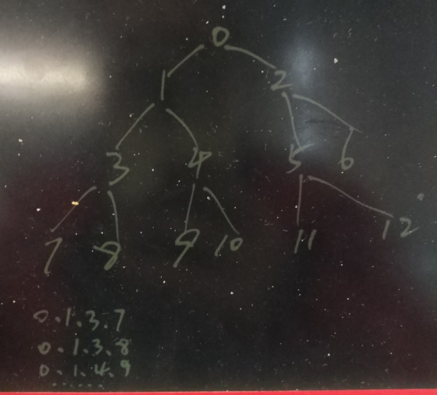

## PostgreSQL 递归查询CASE - 树型路径分组输出  
##### [TAG 15](../class/15.md)
                                
### 作者                                                                             
digoal                           
                                  
### 日期                             
2017-03-24                            
                              
### 标签                           
PostgreSQL , 递归查询 , with recursive , 路径分组 , 路径递归            
                                
----                          
                                   
## 背景    
PostgreSQL的递归查询可以解决很多树形结构，路径查询等问题。  
  
结合PostgreSQL plpgsql编程，可以实现更加复杂的问题，比如接下来这个CASE。  
  
  
  
用户要求输出每个末端路径涉及的所有的记录。  
  
## 例子  
创建测试表，插入路径数据.  
  
```  
create table test(id serial, path text, info text);  
insert into test (path)  values ('0'),('0.1'),('0.1.3'),('0.1.4'),('0.1.3.7'),('0.1.3.8'),('0.1.4.9'),('0.1.4.10'),('0.2'),('0.2.5'),('0.2.6'),('0.2.5.11'),('0.2.5.12');  
  
pipeline=# select * from test;  
 id |   path   | info   
----+----------+------  
  1 | 0        |   
  2 | 0.1      |   
  3 | 0.1.3    |   
  4 | 0.1.4    |   
  5 | 0.1.3.7  |   
  6 | 0.1.3.8  |   
  7 | 0.1.4.9  |   
  8 | 0.1.4.10 |   
  9 | 0.2      |   
 10 | 0.2.5    |   
 11 | 0.2.6    |   
 12 | 0.2.5.11 |   
 13 | 0.2.5.12 |   
(13 rows)  
```  
  
### 需求  
每个末端，以及所有到达末端的所有记录，进行分组  
  
组1  
  
```  
0  
0.1  
0.1.3  
0.1.3.7  
```  
  
组2  
  
```  
0  
0.1  
0.1.3  
0.1.3.8  
```  
  
组3  
  
```  
0  
0.1  
0.1.4  
0.1.4.9  
```  
  
组4  
  
```  
0  
0.1  
0.1.4  
0.1.4.10  
```  
  
组5  
  
```  
0  
0.2  
0.2.5  
0.2.5.11  
```  
  
组6  
  
```  
0  
0.2  
0.2.5  
0.2.5.12  
```  
  
组7  
  
```  
0  
0.2  
0.2.6  
```  
  
将以上数据分组输出，输出时新增两个字段，组编号，以及记录本身在组内按路径顺序的编号  
  
例如:   
  
组1  
  
```  
组ID，路径ID，原有记录信息  
1, 1, 0  
1, 2, 0.1  
1, 3, 0.1.3  
1, 4, 0.1.3.7  
```  
  
组2  
  
```  
组ID，路径ID，原有记录信息  
2, 1, 0  
2, 2, 0.1  
2, 3, 0.1.3  
2, 4, 0.1.3.8  
```  
  
其他略  
  
### 思路  
1\. 查询出末端路径  
  
2\. 根据末端路径，使用PostgreSQL递归语句找出每个末端对应的所有路径记录  
  
### 找出末端路径  
首先，需要用到ltree插件，目的是检索出末端路径。（当然不使用也可以，用它可以简化我们的QUERY）。  
  
创建ltree插件  
  
```  
create extension ltree;  
```  
  
创建gist索引  
  
```  
CREATE INDEX path_gist_idx ON test USING GIST ((path::ltree));  
```  
  
使用自关联，可以查询出末端记录  
  
```  
pipeline=# select t1.path from test t1 where not exists (select 1 from test t2 where t1.path::ltree @> t2.path::ltree and t1.path<>t2.path) order by 1;  
   path     
----------  
 0.1.3.7  
 0.1.3.8  
 0.1.4.10  
 0.1.4.9  
 0.2.5.11  
 0.2.5.12  
 0.2.6  
(7 rows)  
  
pipeline=# explain select t1.path from test t1 where not exists (select 1 from test t2 where t1.path::ltree @> t2.path::ltree and t1.path<>t2.path);  
                                     QUERY PLAN                                       
------------------------------------------------------------------------------------  
 Nested Loop Anti Join  (cost=0.14..5.91 rows=13 width=32)  
   ->  Seq Scan on test t1  (cost=0.00..1.13 rows=13 width=32)  
   ->  Index Scan using path_gist_idx on test t2  (cost=0.14..0.34 rows=1 width=32)  
         Index Cond: ((t1.path)::ltree @> (path)::ltree)  
         Filter: (t1.path <> path)  
(5 rows)  
```  
  
### 递归，输出每个末端路径为分组的数据  
例如'0.2.5.12'，可以这样输出  
  
```  
with recursive tmp as (  
  select * from test where path='0.2.5.12'  
  union all  
  select test.* from test join tmp on (test.path = regexp_replace( (case when strpos(tmp.path, '.')=0 then null else tmp.path end) , '\.[\d]+$'::text , ''))   
)  
select * from tmp;  
  
 id |   path   | info   
----+----------+------  
 13 | 0.2.5.12 |   
 10 | 0.2.5    |   
  9 | 0.2      |   
  1 | 0        |   
(4 rows)  
```  
  
我们可以写一个online code，看看效果  
  
```  
do language plpgsql $$  
declare  
  v_path text;  
  rec record;  
  v_gid int :=1;  
begin  
  for v_path in select t1.path from test t1 where not exists (select 1 from test t2 where t1.path::ltree @> t2.path::ltree and t1.path<>t2.path) order by 1  
  loop  
    for rec in with recursive tmp as (  
      select v_gid as gid, 1 as lid,* from test where test.path=v_path  
      union all  
      select tmp.gid, tmp.lid+1, test.* from test join tmp on (test.path = regexp_replace( (case when strpos(tmp.path, '.')=0 then null else tmp.path end) , '\.[\d]+$'::text , ''))   
    )  
    select * from tmp  
    loop  
      raise notice '%', rec;  
    end loop;  
    v_gid := v_gid+1;  
  end loop;  
end;  
$$;  
  
  
NOTICE:  (1,1,5,0.1.3.7,)  
NOTICE:  (1,2,3,0.1.3,)  
NOTICE:  (1,3,2,0.1,)  
NOTICE:  (1,4,1,0,)  
NOTICE:  (2,1,6,0.1.3.8,)  
NOTICE:  (2,2,3,0.1.3,)  
NOTICE:  (2,3,2,0.1,)  
NOTICE:  (2,4,1,0,)  
NOTICE:  (3,1,8,0.1.4.10,)  
NOTICE:  (3,2,4,0.1.4,)  
NOTICE:  (3,3,2,0.1,)  
NOTICE:  (3,4,1,0,)  
NOTICE:  (4,1,7,0.1.4.9,)  
NOTICE:  (4,2,4,0.1.4,)  
NOTICE:  (4,3,2,0.1,)  
NOTICE:  (4,4,1,0,)  
NOTICE:  (5,1,12,0.2.5.11,)  
NOTICE:  (5,2,10,0.2.5,)  
NOTICE:  (5,3,9,0.2,)  
NOTICE:  (5,4,1,0,)  
NOTICE:  (6,1,13,0.2.5.12,)  
NOTICE:  (6,2,10,0.2.5,)  
NOTICE:  (6,3,9,0.2,)  
NOTICE:  (6,4,1,0,)  
NOTICE:  (7,1,11,0.2.6,)  
NOTICE:  (7,2,9,0.2,)  
NOTICE:  (7,3,1,0,)  
DO  
Time: 2.813 ms  
```  
  
为了方便使用，可以写成函数  
  
```  
create or replace function get_test() returns setof record as $$  
declare  
  v_path text;  
  rec record;  
  v_gid int :=1;  
begin  
  for v_path in select t1.path from test t1 where not exists (select 1 from test t2 where t1.path::ltree @> t2.path::ltree and t1.path<>t2.path) order by 1  
  loop  
    for rec in with recursive tmp as (  
      select v_gid as gid, 1 as lid,* from test where test.path=v_path  
      union all  
      select tmp.gid, tmp.lid+1, test.* from test join tmp on (test.path = regexp_replace( (case when strpos(tmp.path, '.')=0 then null else tmp.path end) , '\.[\d]+$'::text , ''))   
    )  
    select * from tmp  
    loop  
      return next rec;  
    end loop;  
    v_gid := v_gid+1;  
  end loop;  
end;  
$$ language plpgsql strict;  
```  
  
最终的输出结果如下  
  
```  
pipeline=# select * from get_test() as (gid int, lid int, id int, path text, info text);  
 gid | lid | id |   path   | info   
-----+-----+----+----------+------  
   1 |   1 |  5 | 0.1.3.7  |   
   1 |   2 |  3 | 0.1.3    |   
   1 |   3 |  2 | 0.1      |   
   1 |   4 |  1 | 0        |   
   2 |   1 |  6 | 0.1.3.8  |   
   2 |   2 |  3 | 0.1.3    |   
   2 |   3 |  2 | 0.1      |   
   2 |   4 |  1 | 0        |   
   3 |   1 |  8 | 0.1.4.10 |   
   3 |   2 |  4 | 0.1.4    |   
   3 |   3 |  2 | 0.1      |   
   3 |   4 |  1 | 0        |   
   4 |   1 |  7 | 0.1.4.9  |   
   4 |   2 |  4 | 0.1.4    |   
   4 |   3 |  2 | 0.1      |   
   4 |   4 |  1 | 0        |   
   5 |   1 | 12 | 0.2.5.11 |   
   5 |   2 | 10 | 0.2.5    |   
   5 |   3 |  9 | 0.2      |   
   5 |   4 |  1 | 0        |   
   6 |   1 | 13 | 0.2.5.12 |   
   6 |   2 | 10 | 0.2.5    |   
   6 |   3 |  9 | 0.2      |   
   6 |   4 |  1 | 0        |   
   7 |   1 | 11 | 0.2.6    |   
   7 |   2 |  9 | 0.2      |   
   7 |   3 |  1 | 0        |   
(27 rows)  
  
Time: 1.495 ms  
```  
  
PostgreSQL的功能相当多，你GET到了吗？  
  
## 小知识点  
1\. ltree是PostgreSQL的树形结构类型，详见  
  
https://www.postgresql.org/docs/9.6/static/ltree.html  
  
本文用到了它的路径包含与否的判断操作符  
  
Operator|	Returns|	Description  
---|---|---  
ltree @> ltree|	boolean|	is left argument an ancestor of right (or equal)?  
ltree <@ ltree|	boolean|	is left argument a descendant of right (or equal)?  
  
2\. PostgreSQL中的规则表达式匹配代替函数regexp_replace  
  
```  
regexp_replace( string , '\.[\d]+$'::text , '')  
  
截断末尾的 '.数字' ， 取上一路径  
```  
  
3\. PostgreSQL中用于查询字符出现位置的函数strpos  
  
```  
strpos(tmp.path, '.') = 0 表示这个字符串中没有'.'  
```  
  
4\. 实际上ltree也支持取上一路径的功能，参考如下函数库  
  
Function|	Return Type|	Description|	Example|	Result  
---|---|---|---|---  
subltree(ltree, int start, int end)|	ltree|	subpath of ltree from position start to position end-1 (counting from 0)|	subltree('Top.Child1.Child2',1,2)|	Child1  
subpath(ltree, int offset, int len)|	ltree|	subpath of ltree starting at position offset, length len. If offset is negative, subpath starts that far from the end of the path. If len is negative, leaves that many labels off the end of the path.|	subpath('Top.Child1.Child2',0,2)|	Top.Child1  
subpath(ltree, int offset)|	ltree|	subpath of ltree starting at position offset, extending to end of path. If offset is negative, subpath starts that far from the end of the path.|	subpath('Top.Child1.Child2',1)|	Child1.Child2  
nlevel(ltree)|	integer|	number of labels in path|	nlevel('Top.Child1.Child2')|	3  
index(ltree a, ltree b)|	integer|	position of first occurrence of b in a; -1 if not found	|index('0.1.2.3.5.4.5.6.8.5.6.8','5.6')|	6  
index(ltree a, ltree b, int offset)|	integer|	position of first occurrence of b in a, searching starting at offset; negative offset means start -offset labels from the end of the path|	index('0.1.2.3.5.4.5.6.8.5.6.8','5.6',-4)|	9  
text2ltree(text)|	ltree|	cast text to ltree|-|-		  
ltree2text(ltree)|	text|	cast ltree to text|-|-		  
lca(ltree, ltree, ...)|	ltree|	lowest common ancestor, i.e., longest common prefix of paths (up to 8 arguments supported)|	lca('1.2.2.3','1.2.3.4.5.6')|	1.2  
lca(ltree[])|	ltree|	lowest common ancestor, i.e., longest common prefix of paths|	lca(array['1.2.2.3'::ltree,'1.2.3'])|	1.2  
  
  
<a rel="nofollow" href="http://info.flagcounter.com/h9V1"  ></a>  
  
  
  
  
  
  
## [digoal's 大量PostgreSQL文章入口](https://github.com/digoal/blog/blob/master/README.md "22709685feb7cab07d30f30387f0a9ae")
  
