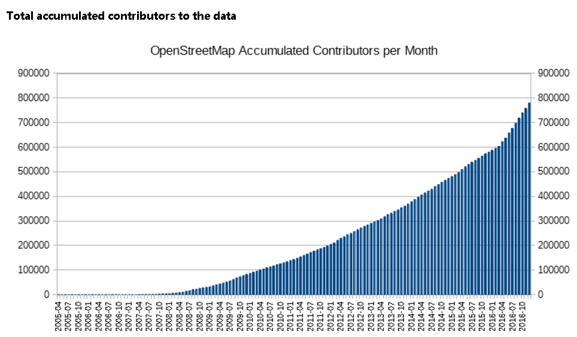
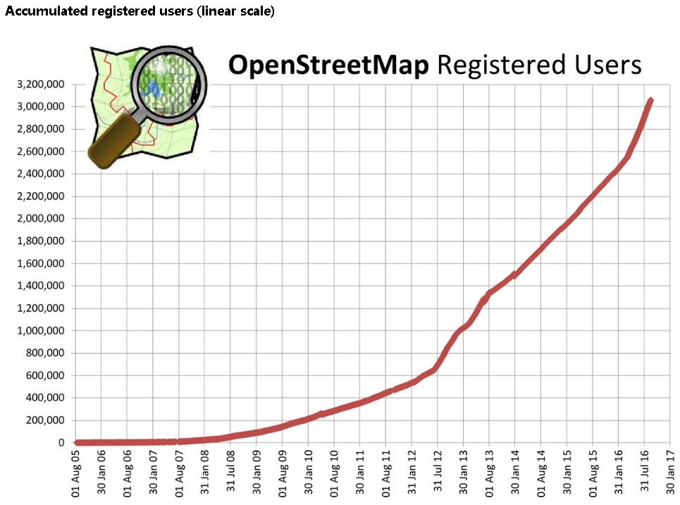
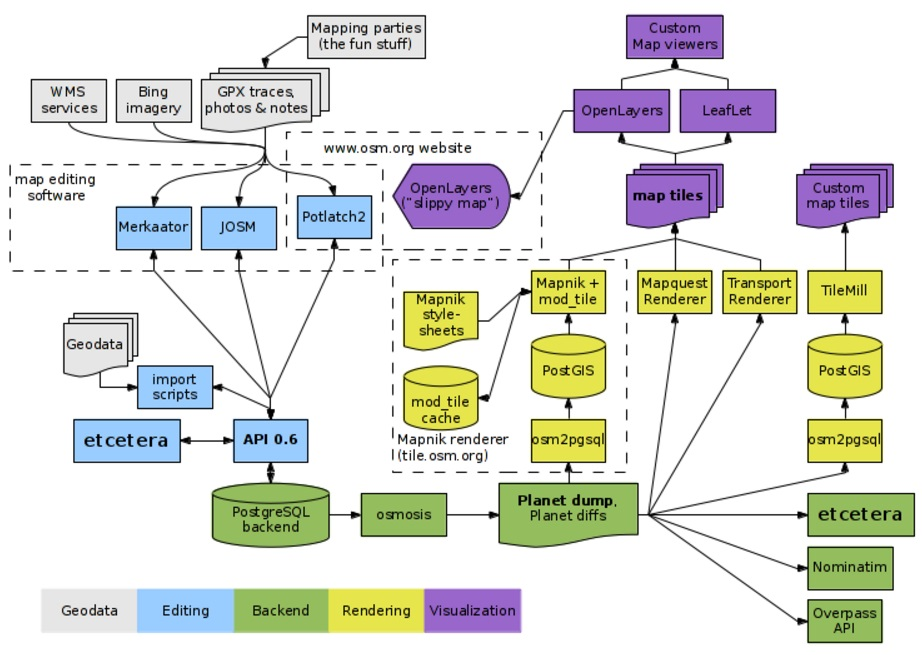
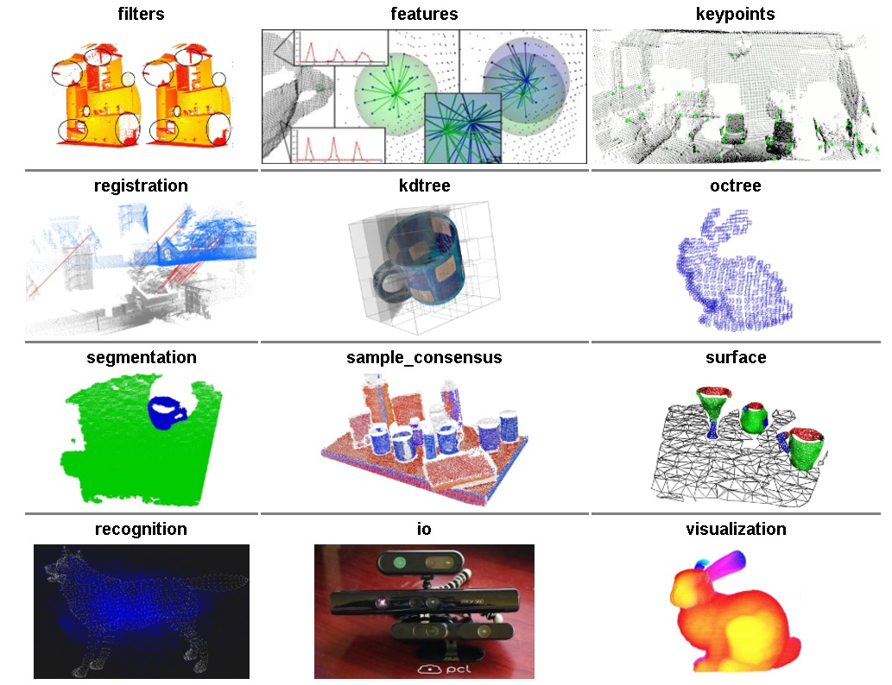

## 开放地图OpenStreetMap与PostGIS的三生三世十里桃花  
                      
### 作者                                                                   
digoal                 
                        
### 日期                   
2017-03-22                  
                    
### 标签                 
PostgreSQL , PostGIS , pgrouting , OSM , OpenStreetMap , 开放地图    
                      
----                
                         
## 背景      
喜欢自由吗？喜欢自由的使用全球地图吗？喜欢自由的贡献、开发全球地图吗？那你一定要来了解一下风靡全球的OpenStreetMap。谷歌最强劲的对手。  
  
openstreetmap全球统计报告  
  
http://wiki.openstreetmap.org/wiki/Stats#Registered_users_statistics_reports  
  
  
  
  
  
### 什么是OpenStreeMap  
  
http://wiki.openstreetmap.org/wiki/Zh-hans:%E5%85%B3%E4%BA%8E  
  
OpenStreetMap是一个全人类都可以编辑及自由使用的全球地图。其中的大部分内容都由志愿者从无到有地构建起来，并以开放授权发布。  
  
OpenStreetMap版权协定允许自由且免费使用我们的地图图像与地图数据，而且本项目鼓励把数据用于有趣崭新的用途。欲知道为什么我们要开放的地图，请参考 Why OpenStreetMap? ，哪里你亦可找到我们最常见的问题：“为什么不使用谷歌（Google）地图？”  
  
#### 地图  
  
浏览我们的地图十分容易。随便翻看一下地图，感受该图的覆盖区域和详细程度。数年来我们取得了丰硕的成果，达成了许多里程碑事件。众多个人、政府和企业已经利用了这些地图数据。在很多国家，OpenStreetMap 已经成为其他地图供应商在诸多应用中的可行替代品。然而地图尚未完成，世界依旧广袤，你生活的地方周边 OSM 看起来怎样呢？  
  
#### 绘图  
  
这并不是普通的在线项目。我们并不只是在电脑屏前默默绘图；我们会外出测量大小城镇及乡郊。这是一项社群地图绘制成果。我们使用 wiki 式的协作编辑软件去实现，因此我们的地图将不断扩大、优化。如果你有全球定位系统（GPS）设备，你可以向本项目贡献自己录制的轨迹。我们也可以使用必应航空影像或其他制图手段。你可以直接用在线编辑器iD，更可以下载JOSM桌面应用程序。各适其式，款款出色。  
  
#### 开发  
  
大量的软件开发工作正将本项目带向诸多不同的方向。正如前章所述，我们设计了各种地图编辑工具。事实上，从前端的瓦片地图界面到后台的数据存取 API （读写地图数据的网络服务接口），正是这些开源软件驱动了 OpenStreetMap 。运用我们的数据开展的子项目有着良好的机遇，但是我们的核心组件的漏洞修复和功能增加也需要人来帮助。  
我们始终欢迎开发者和翻译员！  
  
#### OSM 基金会  
  
OpenStreetMap 基金会是一家募集资金的机构。购买和维护用于 OpenStreetMap 项目的服务器是一项巨大的开支。基金会支持本项目，但并不控制本项目或“拥有” OSM 数据。基金会致力于激励自由地理空间数据的增长、发展、分发，从而提供任何人可使用和分享的地理空间数据。  
  
#### OSM应用  
web类应用、教学、科研等。  
  
Web applications  
  
Developers that want to use OpenStreetMap in their web applications can see the list of JavaScript libraries. There are additional libraries in other programming languages. Deploying your own Slippy Map lists corresponding JavaScript libraries and Content Management Systems supporting OpenStreetMap. Maybe you need WMS and TMS, or to create your own tiles.  
  
Education  
  
OpenStreetMap has created a unique curriculum that is focused on introducing the topics that OSM addresses: mapping, open source technologies, crowd sourcing and community efforts. It is geared towards university level students. Further, OpenStreetMap has several open problems which would make good student projects. These are items that need researching and "longer-term" issues which could be worked on by students as a project separate from the core open source development progress happening within the community.  
  
Research  
  
At the conference SotM-EU 2011, Muki Haklay gave a talk with advice to academics interested in OSM and the video is available online. See our Research page for details of academic research work.  
  
[《OSM在极低GIS中对应用》](20170327_01_pdf_001.pdf)     
  
## 如何贡献(制作)OSM地图  
分为5个步骤  
  
1\. 收集数据  
  
最常见的收集GPS数据的方法，一部带有GPS功能的手机，轨迹记录软件。  
  
收集数据，OSM可以用到信息很多：  
  
从最常见的“路名”到停车场、邮箱、邮编、港口。通常，由于使用的交通工具不同，不同的人对地图细节的要求也不同。例如，司机希望地图上标明高速公路、高架道路的匝口，两车道还是四车道，单行还是双向行驶；行人想了解公交车站，过街天桥或地道；户外旅行不仅希望知道路线，多半也想了解海拔高度。简单地说，把你认为可能有用的信息都标上。  
  
OSM图友往往从基本开始，逐渐增加地图的细节。所以主干道、重要的道路是个不错的开始，人行道、邮箱之类多半最后才加上去。当然，各人有各自的方式，你完全可以自由发挥。  
  
2\. 上传数据  
  
首先，将数据保存为GPX格式。GPS的手册或软件使用指南来确定如何将轨迹保存成GPX格式。  
  
将GPX文件上传到OSM。  
  
上传过程  
  
2\.1 打开 OSM 主页.  
  
2\.2 登录 (你需要在 这里 先注册一个 OSM 账号 ).  
  
2\.3 点击顶部的 “GPS traces” 标签.  
  
2\.4 点击 "See just your traces, or upload a trace".  
  
2\.5 如下操作3个编辑框:  
  
2\.5\.1 选定你要上传的文件.  
  
2\.5\.2 命名这个文件.  
  
2\.5\.3 添加有助于找到它的标签,如 “英国伦敦” (每个单词都是一个标签, 所以 Isle of Wight 应该写成 "IOW" 或 "Isle-of-wight").  
  
2\.6 如果你希望和其它人分享你的数据 (我们鼓励这样做), 选中 "Public" .  
  
2\.7 点击 "Upload".  
  
2\.8 数据过一会儿就会加入到OSM中. 不过, 你可以在上传数据后立刻使用它。  
  
2\.9 完成后你可以用 JOSM 下载包括你的数据在内的这个区域内的所有数据。或者你可以在 Potlatch 中使用它. 方法是点击轨迹右侧的 'edit' 链接(不是顶上的'edit').  
  
3\. 创建和编辑OSM数据  
  
OSM数据由以下元素组成和表示方法：  
  
详见  
  
http://wiki.openstreetmap.org/wiki/Elements  
  
节点(Nodes): 最基本的要素,是其它要素的组成部分.  
  
路线(Ways): 有方向性的节点序列, 在编辑器里显示成连接起来的线段.  
  
闭合路线(Closed Ways): 闭合路线是完全闭合的路线. 一般用来表示区域如公园,湖泊,岛屿等.  
  
所有这些元素都有标签，以描述地名，道路类型等信息。你可以用各种编辑器来创建元素和标签。  
  
使用potlatch , josm , merkaartor 等软件，可以编辑OSM数据，例如将GPS轨迹点，串成道路。  
  
4\. 标示数据和新增资料  
  
当完成了一条路线时,你需要给它加上标签来确定它在地图上渲染的效果.标签有很多,其中一些是很常用的.在 JOSM 中,通过在Properties/Memberships 添加键值对来添加标签.  
  
当你完成了编辑后, 你需要 将你的修改上传到 OSM.  
  
5\. 渲染并试用地图  
  
5\.1 客户端渲染  
  
Kosmos : Kosmos 是为了让OSM使用者在自己的计算机上渲染地图而设计的轻量级的OSM地图渲染平台. 大概是三种工具中最容易使用的.  
  
Osmarender: 一个基于可扩展样式表语言转换 (XSLT) 的渲染器,能够创建可缩放矢量图形(SVG), SVG可以用浏览器观看或转换成位图.  
  
Mapnik: 一个用C++写的非常快的渲染器,可以生成位图(png, jpeg)和矢量图形(pdf, svg, postscript)。  
  
5\.2 openstreetmap网站渲染  
  
让数据显示在 OpenStreetMap 的主页 的 slippy map 上. 在主页的右上方有一个 '+' . 点击 '+' 后会出现一个包括 'Mapnik' 和 'Osmarender' 的基础层的选项. 分别显示对应的渲染器生成的地图.  
  
## 如何下载地图OSM数据  
  
OSM网站中全部都是来自用户上传的GPX数据，登陆openstreetmap网站后，用户可以输入经纬度的区间，构成一个矩阵区间，那么这部分的数据会被下载。  
  
## 如何将地图数据导入PostgreSQL GIS库  
  
http://wiki.openstreetmap.org/wiki/PostgreSQL  
  
http://wiki.openstreetmap.org/wiki/Converting_map_data_between_formats  
  
The PostGIS extension for PostgreSQL is often used for geographic data. PostGIS adds geospatial functions and two metadata tables. Again we do not use this for our core database, however we do use all of these things on the tile server database as required by the Mapnik rendering engine.  
  
以下工具，可以将OSM数据导入PostgreSQL  
  
Osmosis can be used to populate a more general PostgreSQL/PostGIS database from a Planet.osm OSM data dump file.  
  
osm2postgresql is powered by Osmosis and does much more (but works only on GNU/Linux)  
  
osm2pgsql handles transformation of the planet data into the expected format.  
  
OSM2PostGIS pretty new  
  
OSM in a box has a own converter  
  
Imposm PostGIS importer that supports custom DB schemas. Can import planet files with low memory.  
  
osm2pgrouting imports to PostgreSQL/PostGIS database for routing purpose. (以路由为目的)  
  
## OpenStreeMap与PostgreSQL的渊源  
http://wiki.openstreetmap.org/wiki/Using_OpenStreetMap  
  
PostGIS是一个历史非常悠久的GIS库，除了能够处理GIS数据，由于框架是通用的，所以还可以处理复杂的向量数据、多维数据等。  
  
与PostGIS与PostgreSQL 是OpenStreetMap软件开发组件中的必要组件。  
  
  
  
PostGIS与pointcloudlib结合，可以落地到非常广泛的场景中。比如精密加工、测绘、3D打印等。  
  
http://pointclouds.org/documentation/tutorials/  
  
  
  
## 参考  
  
http://wiki.openstreetmap.org/wiki/Zh-hans:%E5%85%B3%E4%BA%8E  
  
[《OSM在极低GIS中对应用》](20170327_01_pdf_001.pdf)     
  
http://planet.postgis.net/  
  
http://wiki.openstreetmap.org/wiki/Using_OpenStreetMap  
  
  
  
  
  
  
  
  
  
## [digoal's 大量PostgreSQL文章入口](https://github.com/digoal/blog/blob/master/README.md "22709685feb7cab07d30f30387f0a9ae")
  
