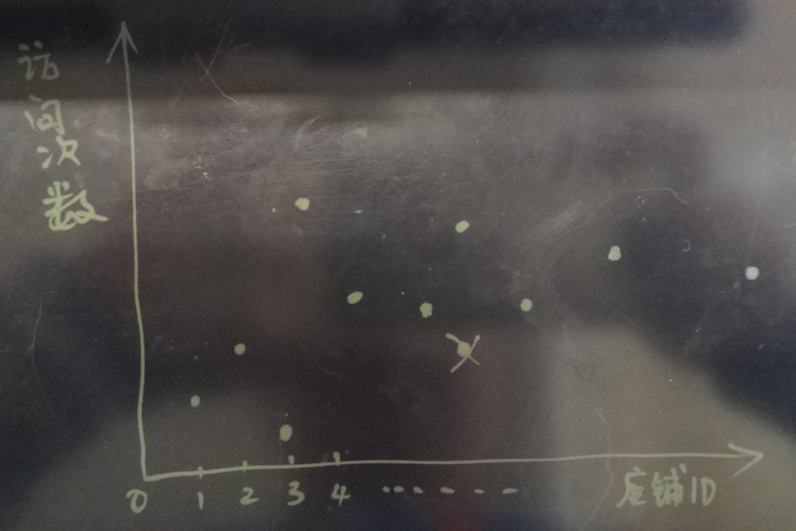
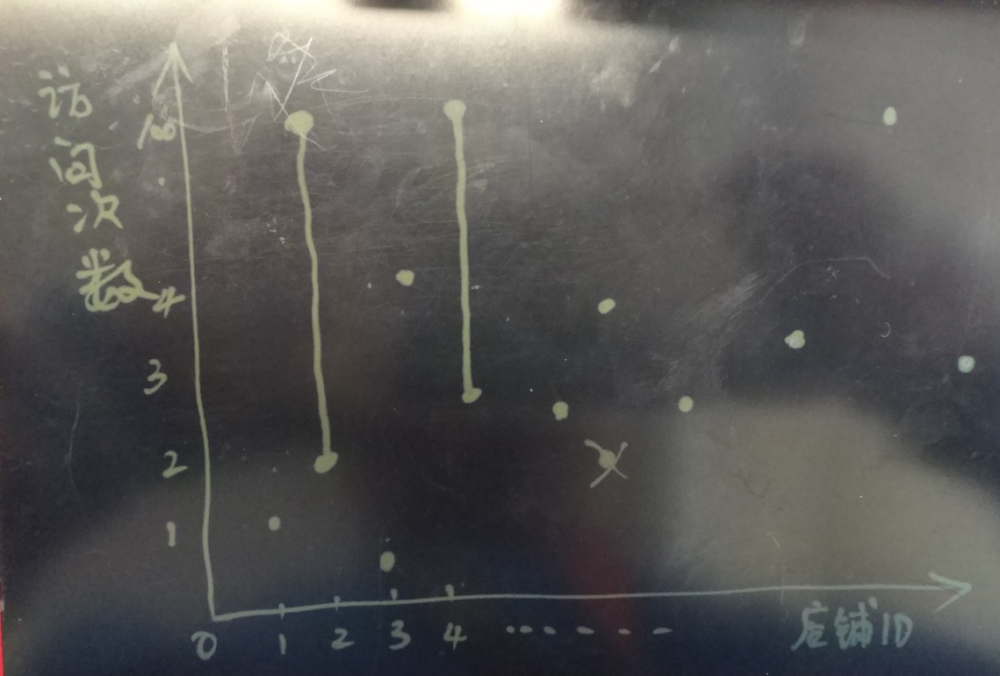
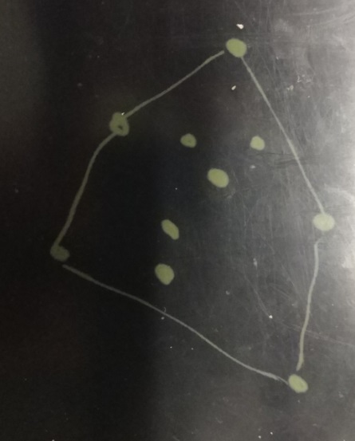
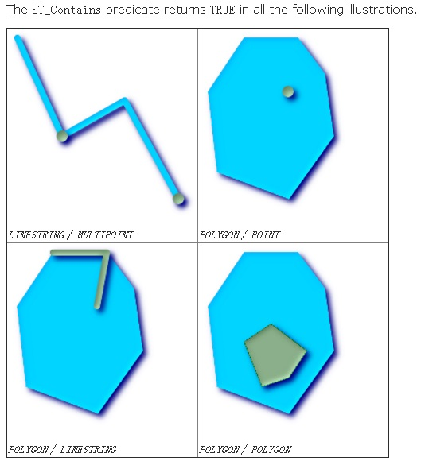
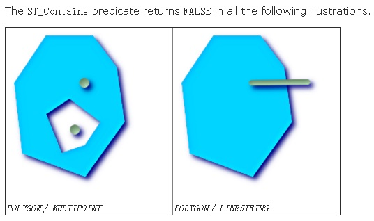
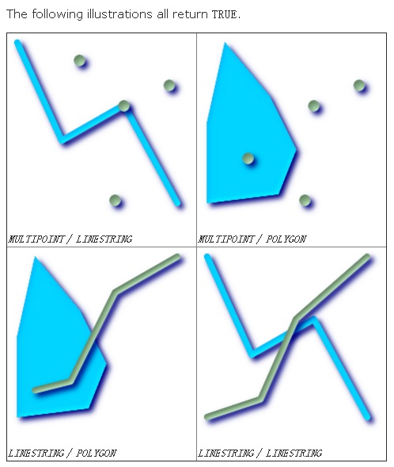
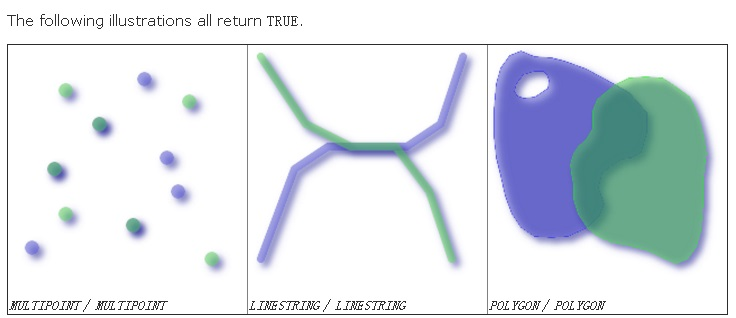
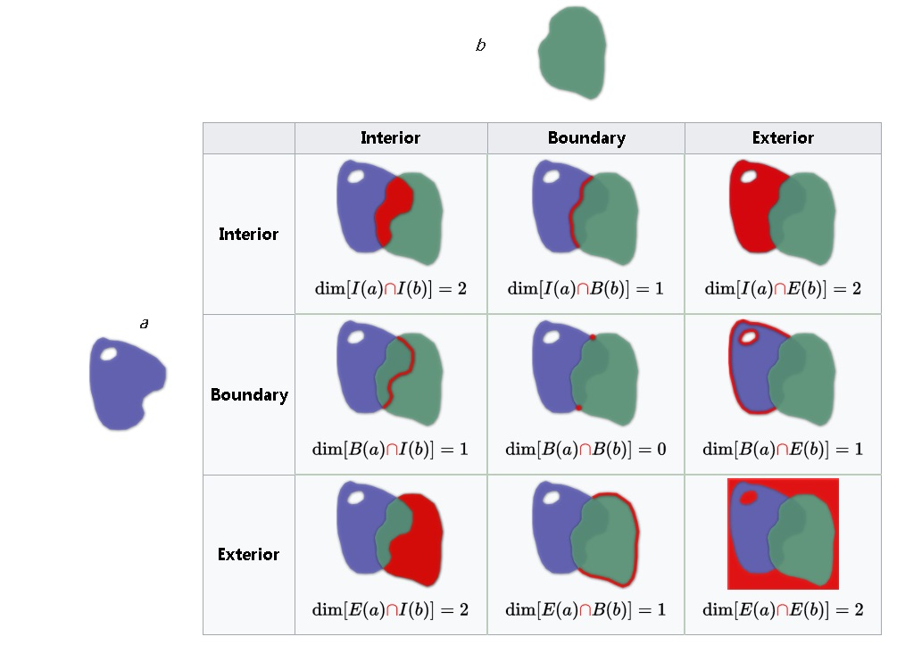
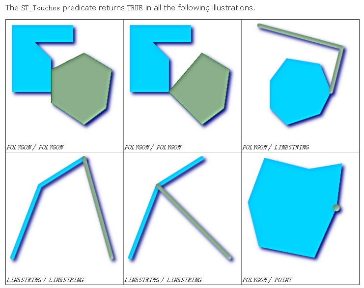

## 视觉挖掘与PostGIS空间数据库的完美邂逅 - 广告营销\圈人        
##### [TAG 15](../class/15.md)
                   
### 作者           
digoal          
               
### 日期           
2017-03-28          
                  
### 标签                                         
PostgreSQL , PostGIS , 视觉匹配 , 空间相交 , 圈人          
           
----           
           
## 背景          
推荐系统是广告营销平台的奶牛，其核心是精准、实时、高效。             
             
这么多广告平台，到底谁家强？谁的核心牛逼？              
              
1\. 精准，指对用户的描述精准，通常需要基于大量的用户行为数据，经历深度学习后形成的用户画像，或称之为标签系统。 标签的准确性关系到推荐的精准度，比如你可能不会对一个正常的年轻人推荐老花眼镜（当然如果有其他购买意向的标签来指出他有购买老花眼镜的欲望除外）。         
              
2\. 实时，指标签的更新实时性，很多标签是具有非常强的时效性的，比如一次营销的目标人群，又或者用户最近浏览的一些商品可能是有潜在购买欲望的商品，都具备时效性。如果你的标签生成是隔天，或者个很多天的，那么可能已经错过了推荐时机。实时性在推荐系统中是非常重要的。         
              
3\. 高效，指基于标签圈人的动作的效率与并发能力，作为购买广告的金主，当然是期望他们拿到数据的速度越快越好。并且会有很多人向你的平台购买广告，这考验的是并发能力。              
              
做到以上三点，这样的广告平台才具备一定的竞争力。         
               
PostgreSQL 数组与GIN索引可以完美的支持这样的业务场景，可以参考我去年写的这个案子。         
        
[《恭迎万亿级营销(圈人)潇洒的迈入毫秒时代 - 万亿user_tags级实时推荐系统数据库设计》](../201612/20161225_01.md)          
        
以上案子适合店铺访问分阶层的场景，例如1-1000,1001-5000,....分档。        
        
如果店铺的访问次数没有分档，完全精细化表示，怎么挖掘呢？        
        
接下来，将要给大家介绍的方法，使用空间数据库来实现以上场景。        
        
## 业务背景介绍        
用户在逛淘宝时，购买一个商品，可能会看很多家店铺，一番货比三家后，才会决定从哪家买。        
        
用户每天会访问很多的店铺，如果某个用户访问某家店铺的次数非常多，说明一个什么问题呢？        
        
这家店一定有什么吸引该用户，那么如果店家针对这些用户推送活动、或者采用合适的营销手段，客户在这家店铺购买商品的可能性就非常高。        
      
        
    
这个是圈人的手段之一。        
        
数据结构可能会包括如下        
        
用户ID，店铺ID1，访问次数，店铺ID2，访问次数，。。。。。(例如1:1, 2:1即1号店访问了1次，2号店访问了1次)。          
          
有了这些数据，业务方可以根据店铺的访问次数圈出一部分人群，比如A店铺访问超出多少次的，或者B店铺访问超过多少次的等。          
          
如果让你来处理，你会使用什么技术呢？          
          
## 数据规模介绍      
        
店铺ID上亿、用户数上亿、访问次数不定。          
          
以上业务需求，如果裸算，会耗费大量的CPU。          
          
## 视觉挖掘介绍    
PostGIS是一个空间数据库，如果将这些数据转换为空间数据，则可以使用空间函数来实现圈人的目的，比如圈人可以表示为：multipoint与某条线段相交。    
    
这个操作可以使用PostGIS的空间索引来完成。          
          
把访问轨迹数据转换为multipoint的几何类型来实现这个业务需求。          
          
这两个函数，可以将multipoint构造为几何类型          
          
http://postgis.net/docs/manual-2.3/ST_MPointFromText.html          
          
http://postgis.net/docs/manual-2.3/ST_GeomFromText.html          
          
```          
ST_MPointFromText          
          
ST_GeomFromText           
```          
          
某个用户的访问轨迹，在数据库中存储为多个点组成的几何类型        
        
        
        
而圈人，则使用两个几何类型的相交即可，例如访问2号店铺在2到100次，或者，访问4号店铺在3到100次的人群。转化为求 "多线段几何图形" 与 "多点几何图形" 相交的结果集。        
        
        
    
### 注意    
(目前postgis GA版本还不支持这个操作, 接下来我假设postgis已支持multipoint && linestring的基础上)。    
    
目前&&支持的是bounding box的相交，并不是point，所以直接判断&&的结果，得到的结果并不是我们想要的。    
    
PostGIS众多高难度的几何操作都实现了，这个需求看样子真的不是几何需求。    
    
```    
&& — Returns TRUE if A's 2D bounding box intersects B's 2D bounding box.    
```    
       
## 一、例子        
### 建表        
```        
test=> create table test(userid int8 primary key, feeds text);        
CREATE TABLE        
```        
        
数据格式(店铺ID:访问次数;店铺ID:访问次数....)        
        
### 空间函数索引         
根据以上格式，构建multipoint，并创建空间索引，注意空字符串转化为极点(0 0)。        
        
```          
test=> create index idx_test_feeds on test using gist ((case when feeds='' then ST_MPointFromText('MULTIPOINT(0 0)') else ST_MPointFromText('MULTIPOINT('||replace(replace(feeds,':', ' '),';',',')||')') end));          
CREATE INDEX          
        
        
test=> \d+ test        
                 Table "public.test"        
 Column |  Type  | Modifiers | Storage  | Description         
--------+--------+-----------+----------+-------------        
 userid | bigint | not null  | plain    |         
 feeds  | text   |           | extended |         
Indexes:        
    "test_pkey" PRIMARY KEY, btree (userid)        
    "idx_test_feeds" gist ((        
CASE        
    WHEN feeds = ''::text THEN st_mpointfromtext('MULTIPOINT(0 0)'::text)        
    ELSE st_mpointfromtext(('MULTIPOINT('::text || replace(replace(feeds, ':'::text, ' '::text), ';'::text, ','::text)) || ')'::text)        
END))        
Has OIDs: no        
```          
        
### 插入测试数据        
插入几条测试数据，分别表示这些用户的访问了哪些店铺，以及次数。        
        
```          
insert into test values (1, '1:1');          
insert into test values (2, '1:100');          
insert into test values (3, '2:1');          
insert into test values (4, '2:100');          
insert into test values (5, '1:100;2:100');          
```          
        
### 圈人需求查询         
1\. 查询访问1号店铺>=2, <=100次的用户          
          
构造一条线段ST_LineFromText('LINESTRING(1 2, 1 100)')，查询相交即可。          
          
```          
select * from test where           
(case when feeds='' then ST_MPointFromText('MULTIPOINT(0 0)') else ST_MPointFromText('MULTIPOINT('||replace(replace(feeds,':', ' '),';',',')||')') end)          
&&          
ST_LineFromText('LINESTRING(1 2, 1 100)');          
          
 userid |    feeds            
--------+-------------        
      2 | 1:100        
      5 | 1:100;2:100        
(2 rows)        
```        
        
执行计划，可以看到使用了空间索引        
        
```        
 Index Scan using idx_test_feeds on test  (cost=0.41..48.47 rows=232 width=40)        
   Index Cond: (CASE WHEN (feeds = ''::text) THEN '010400000001000000010100000000000000000000000000000000000000'::geometry ELSE st_mpointfromtext((('MULTIPOINT('::text || replace(replace(feeds, ':'::text, ' '::text), ';'::text, ','::text        
)) || ')'::text)) END && '010200000002000000000000000000F03F0000000000000040000000000000F03F0000000000005940'::geometry)        
(2 rows)        
```          
          
2\. 查询访问1号店铺>=2, <=100次的用户，或者，访问2号店铺>=2, <=100次的用户          
          
构造一个多线段类型ST_MLineFromText('MULTILINESTRING((1 2, 1 100), (2 2, 2 100))')，查询相交即可。          
          
```          
select * from test where           
(case when feeds='' then ST_MPointFromText('MULTIPOINT(0 0)') else ST_MPointFromText('MULTIPOINT('||replace(replace(feeds,':', ' '),';',',')||')') end)          
&&          
ST_MLineFromText('MULTILINESTRING((1 2, 1 100), (2 2, 2 100))');          
          
 userid |    feeds            
--------+-------------        
      2 | 1:100        
      4 | 2:100        
      5 | 1:100;2:100        
(3 rows)         
```        
        
执行计划，可以看到使用了空间索引        
        
```        
 Index Scan using idx_test_feeds on test  (cost=0.41..48.47 rows=232 width=40)        
   Index Cond: (CASE WHEN (feeds = ''::text) THEN '010400000001000000010100000000000000000000000000000000000000'::geometry ELSE st_mpointfromtext((('MULTIPOINT('::text || replace(replace(feeds, ':'::text, ' '::text), ';'::text, ','::text        
)) || ')'::text)) END && '010500000002000000010200000002000000000000000000F03F0000000000000040000000000000F03F00000000000059400102000000020000000000000000000040000000000000004000000000000000400000000000005940'::geometry)        
(2 rows)        
```          
          
3\. 查询访问1号店铺>=2, <=100次的用户，并且，访问2号店铺>=2, <=100次的用户          
          
查询两条线段ST_LineFromText('LINESTRING(1 2, 1 100)'),  ST_LineFromText('LINESTRING(2 2, 2 100)')都相交即可          
          
```          
select * from test where           
(case when feeds='' then ST_MPointFromText('MULTIPOINT(0 0)') else ST_MPointFromText('MULTIPOINT('||replace(replace(feeds,':', ' '),';',',')||')') end)          
&&          
ST_LineFromText('LINESTRING(1 2, 1 100)')          
and          
(case when feeds='' then ST_MPointFromText('MULTIPOINT(0 0)') else ST_MPointFromText('MULTIPOINT('||replace(replace(feeds,':', ' '),';',',')||')') end)          
&&          
ST_LineFromText('LINESTRING(2 2, 2 100)');          
          
 userid |    feeds            
--------+-------------        
      5 | 1:100;2:100        
(1 row)        
```         
          
执行计划，可以看到使用了空间索引          
        
```        
 Bitmap Heap Scan on test  (cost=5.14..39.98 rows=46 width=40)        
   Recheck Cond: ((CASE WHEN (feeds = ''::text) THEN '010400000001000000010100000000000000000000000000000000000000'::geometry ELSE st_mpointfromtext((('MULTIPOINT('::text || replace(replace(feeds, ':'::text, ' '::text), ';'::text, ','::t        
ext)) || ')'::text)) END && '010200000002000000000000000000F03F0000000000000040000000000000F03F0000000000005940'::geometry) AND (CASE WHEN (feeds = ''::text) THEN '010400000001000000010100000000000000000000000000000000000000'::geometry E        
LSE st_mpointfromtext((('MULTIPOINT('::text || replace(replace(feeds, ':'::text, ' '::text), ';'::text, ','::text)) || ')'::text)) END && '0102000000020000000000000000000040000000000000004000000000000000400000000000005940'::geometry))        
   ->  Bitmap Index Scan on idx_test_feeds  (cost=0.00..5.13 rows=46 width=0)        
         Index Cond: ((CASE WHEN (feeds = ''::text) THEN '010400000001000000010100000000000000000000000000000000000000'::geometry ELSE st_mpointfromtext((('MULTIPOINT('::text || replace(replace(feeds, ':'::text, ' '::text), ';'::text, ',        
'::text)) || ')'::text)) END && '010200000002000000000000000000F03F0000000000000040000000000000F03F0000000000005940'::geometry) AND (CASE WHEN (feeds = ''::text) THEN '010400000001000000010100000000000000000000000000000000000000'::geomet        
ry ELSE st_mpointfromtext((('MULTIPOINT('::text || replace(replace(feeds, ':'::text, ' '::text), ';'::text, ','::text)) || ')'::text)) END && '0102000000020000000000000000000040000000000000004000000000000000400000000000005940'::geometry)        
)        
(4 rows)        
        
或        
        
 Index Scan using idx_test_feeds on test  (cost=0.67..45.59 rows=46 width=40)        
   Index Cond: ((CASE WHEN (feeds = ''::text) THEN '010400000001000000010100000000000000000000000000000000000000'::geometry ELSE st_mpointfromtext((('MULTIPOINT('::text || replace(replace(feeds, ':'::text, ' '::text), ';'::text, ','::tex        
t)) || ')'::text)) END && '010200000002000000000000000000F03F0000000000000040000000000000F03F0000000000005940'::geometry) AND (CASE WHEN (feeds = ''::text) THEN '010400000001000000010100000000000000000000000000000000000000'::geometry ELS        
E st_mpointfromtext((('MULTIPOINT('::text || replace(replace(feeds, ':'::text, ' '::text), ';'::text, ','::text)) || ')'::text)) END && '0102000000020000000000000000000040000000000000004000000000000000400000000000005940'::geometry))        
(2 rows)        
```          
         
## 二、postgis不支持multipoint && linestring前如何实现视觉挖掘?    
那么postgis哪些视觉、几何运算和本文相关呢？    
    
postgis在处理multipoint时，大多数几何运算，会将multipoint自动转换为闭合的、占据最大面积或者体积的bound box.    
    
    
    
1\. B的所有部分都在A的内部，并且，B至少有1个内部的点在A的内部。    
    
```    
ST_Contains — Returns true if and only if no points of B lie in the exterior of A, and at least one point of the interior of B lies in the interior of A.    
    
boolean ST_Contains(geometry geomA, geometry geomB);  -- a包含b    
```    
    
蓝色为A，灰色为B    
    
TRUE    
    
        
    
FALSE, 并不是所有的点都在A的内部    
    
    
    
2\. B的任何点都不在A的外面。    
    
```    
ST_Covers — Returns 1 (TRUE) if no point in Geometry B is outside Geometry A    
    
boolean ST_Covers(geometry geomA, geometry geomB);    
    
boolean ST_Covers(geography geogpolyA, geography geogpointB);    
```    
    
3\. A的任何点都不在B的外面。    
    
```    
ST_CoveredBy — Returns 1 (TRUE) if no point in Geometry/Geography A is outside Geometry/Geography B    
    
boolean ST_CoveredBy(geometry geomA, geometry geomB);    
    
boolean ST_CoveredBy(geography geogA, geography geogB);    
```    
    
4\. A与B有部分共用的部分，并且，共用的部分不是A或者B的全部(即公共部分只是A或B的一部分)    
    
```    
ST_Crosses — Returns TRUE if the supplied geometries have some, but not all, interior points in common.    
    
boolean ST_Crosses(geometry g1, geometry g2);    
```    
    
    
    
5\. A和B没有任何空间交集    
    
```    
ST_Disjoint — Returns TRUE if the Geometries do not "spatially intersect" - if they do not share any space together.    
    
boolean ST_Disjoint( geometry A , geometry B );    
```    
    
6\. A和B有空间相交, 与ST_Disjoint相反    
    
```    
ST_Intersects — Returns TRUE if the Geometries/Geography "spatially intersect in 2D" - (share any portion of space) and FALSE if they don't (they are Disjoint).     
For geography -- tolerance is 0.00001 meters (so any points that close are considered to intersect)  -- geography类型允许0.00001 meters的误差    
    
boolean ST_Intersects( geometry geomA , geometry geomB );    
    
boolean ST_Intersects( geography geogA , geography geogB );    
```    
    
7\. A和B有空间相交，但是A或B都不会完全包含对方。即一定有一部分在对方的外面。    
    
```    
ST_Overlaps — Returns TRUE if the Geometries share space, are of the same dimension, but are not completely contained by each other.    
    
boolean ST_Overlaps(geometry A, geometry B);    
```    
    
    
    
8\. 返回A和B在指定几何计算特性样式下的运算结果，或者,判断两个几何体是否符合指定的几何特性。    
    
```    
ST_Relate — Returns true if this Geometry is spatially related to anotherGeometry, by testing for intersections between the Interior, Boundary and Exterior of the two geometries as specified by the values in the intersectionMatrixPattern. If no intersectionMatrixPattern is passed in, then returns the maximum intersectionMatrixPattern that relates the 2 geometries.    
    
boolean ST_Relate(geometry geomA, geometry geomB, text intersectionMatrixPattern);    
    
text ST_Relate(geometry geomA, geometry geomB);    
    
text ST_Relate(geometry geomA, geometry geomB, integer BoundaryNodeRule);    
```    
    
http://postgis.net/docs/manual-2.3/ST_Relate.html    
    
运算样式如下    
    
https://en.wikipedia.org/wiki/DE-9IM    
    
    
    
9\. 判断A几何特性是否包含B几何特性    
    
```    
ST_RelateMatch — Returns true if intersectionMattrixPattern1 implies intersectionMatrixPattern2    
    
boolean ST_RelateMatch(text intersectionMatrix, text intersectionMatrixPattern);    
    
SELECT ST_RelateMatch('101202FFF', 'TTTTTTFFF') ;    
-- result --    
t    
    
--example of common intersection matrix patterns and example matrices    
-- comparing relationships of involving one invalid geometry and ( a line and polygon that intersect at interior and boundary)    
SELECT mat.name, pat.name, ST_RelateMatch(mat.val, pat.val) As satisfied    
    FROM    
        ( VALUES ('Equality', 'T1FF1FFF1'),    
                ('Overlaps', 'T*T***T**'),    
                ('Within', 'T*F**F***'),    
                ('Disjoint', 'FF*FF****') As pat(name,val)    
        CROSS JOIN    
            (	VALUES ('Self intersections (invalid)', '111111111'),    
                    ('IE2_BI1_BB0_BE1_EI1_EE2', 'FF2101102'),    
                    ('IB1_IE1_BB0_BE0_EI2_EI1_EE2', 'F11F00212')    
            ) As mat(name,val);    
```    
    
10\. A和B至少有1个公共点，但是他们的内部没有相交。    
    
```    
ST_Touches — Returns TRUE if the geometries have at least one point in common, but their interiors do not intersect.    
    
boolean ST_Touches(geometry g1, geometry g2);    
```    
    
    
    
11\. A完全在B里面    
    
```    
ST_Within — Returns true if the geometry A is completely inside geometry B    
    
boolean ST_Within(geometry A, geometry B);    
```    
    
    
  
### 如何实现本文的视觉挖掘?  
几何特性如下，A为存储的multipoint(或者单点)，B为我们输入的条件线段。  
  
那么应该具备如下特性:  
  
1\. A 和 B 有公共点，但是他们的内部不存在相交。  
  
或者  
  
2\. A 完全在B里面。  
  
或者  
  
3\. A 和 B 内部相交。  
  
### 转换为SQL  
1\. 点击1号店铺在2到100次之间的用户有哪些？  
  
```  
select * from test1 where      
(  
st_touches( ST_LineFromText('LINESTRING(1 2, 1 100)'), feeds )  
or  
st_within( feeds, ST_LineFromText('LINESTRING(1 2, 1 100)') )  
or
st_crosses( feeds, ST_LineFromText('LINESTRING(1 2, 1 100)') )
)  
;   
  
 userid |                                                 feeds                                                    
--------+--------------------------------------------------------------------------------------------------------  
      2 | 0104000000010000000101000000000000000000F03F0000000000005940  
      5 | 0104000000020000000101000000000000000000F03F0000000000005940010100000000000000000000400000000000005940  
(2 rows)  
  
  
执行计划  
  
 Bitmap Heap Scan on public.test1  (cost=12.41..17.95 rows=1 width=40) (actual time=0.166..0.209 rows=2 loops=1)
   Output: userid, feeds
   Recheck Cond: (('010200000002000000000000000000F03F0000000000000040000000000000F03F0000000000005940'::geometry && test1.feeds) OR ('010200000002000000000000000000F03F0000000000000040000000000000F03F0000000000005940'::geometry ~ test1.feeds) OR (test1.feeds && '010200000002000000000000000000F03F0000000000000040000000000000F03F0000000000005940'::geometry))    -- 这个实现需要重新检查
   Filter: ((('010200000002000000000000000000F03F0000000000000040000000000000F03F0000000000005940'::geometry && test1.feeds) AND _st_touches('010200000002000000000000000000F03F0000000000000040000000000000F03F0000000000005940'::geometry, test1.feeds)) OR (('010200000002000000000000000000F03F0000000000000040000000000000F03F0000000000005940'::geometry ~ test1.feeds) AND _st_contains('010200000002000000000000000000F03F0000000000000040000000000000F03F0000000000005940'::geometry, test1.feeds)) OR ((test1.feeds && '010200000002000000000000000000F03F0000000000000040000000000000F03F0000000000005940'::geometry) AND _st_crosses(test1.feeds, '010200000002000000000000000000F03F0000000000000040000000000000F03F0000000000005940'::geometry)))   -- 重新检测过滤的条件
   Heap Blocks: exact=1
   Buffers: shared hit=4
   ->  BitmapOr  (cost=8.28..8.28 rows=1 width=0) (actual time=0.020..0.020 rows=0 loops=1)  
         Buffers: shared hit=2  
         ->  Bitmap Index Scan on idx_test1_feeds  (cost=0.00..4.14 rows=1 width=0) (actual time=0.015..0.015 rows=2 loops=1)  
               Index Cond: ('010200000002000000000000000000F03F0000000000000040000000000000F03F0000000000005940'::geometry && test1.feeds)  -- 这里可能会有大量符合条件的记录  
               Buffers: shared hit=1  
         ->  Bitmap Index Scan on idx_test1_feeds  (cost=0.00..4.14 rows=1 width=0) (actual time=0.004..0.004 rows=1 loops=1)  
               Index Cond: ('010200000002000000000000000000F03F0000000000000040000000000000F03F0000000000005940'::geometry ~ test1.feeds)   -- 针对单个点的  ~ — Returns TRUE if A's bounding box contains B's.  
               Buffers: shared hit=1  
         ->  Bitmap Index Scan on idx_test1_feeds  (cost=0.00..4.14 rows=1 width=0) (actual time=0.003..0.003 rows=2 loops=1)
               Index Cond: (test1.feeds && '010200000002000000000000000000F03F0000000000000040000000000000F03F0000000000005940'::geometry)
               Buffers: shared hit=1
```  
  
## 性能优化  
不管是multipoint还是linestring，理论上视觉判断是很好判断的，但是目前postgis没有对这个简单的视觉判断加直接的索引过滤，需要使用st_touches和st_within两个来判断，而且multipoint会转换为linestring，这样的话相交的概率就大大增加了。  
  
优化方法，每个用户，每个店铺对应一条记录，店铺和访问次数可以使用一个point来表示。  
  
通过st_within来判断即可，可以走索引。  
  
当然这么做，和存两个标量字段的效率就差不多了。   
    
## 小结      
PostGIS在民用、科研、军工等各个领域都有应用，贯穿测绘、宇航局、气象、视觉、导航、物流、物联网等等各个行业。      
      
几乎所有的视觉或地图类的框架也将PostGIS作为默认组件来支持。      
      
http://postgis.net/docs/manual-2.3/      
      
实际上有很多应用可以往视觉处理方面靠，比如本文提到的根据店铺的访问次数圈人的场景，如果将其存储为multipoint，那么圈人的动作就可以转换为视觉处理，求相交。      
      
通过PostGIS的空间索引，这种应用完全可以做到毫秒级的响应。      
      
让我们一起迎接实时营销的毫秒时代。      
      
同时我们也可以开脑洞想象一下，是不是还有很多解不了的问题，可以用视觉处理来解决呢？      
      
## 参考          
[《OpenGIS Implementation Standard for Geographic information - Simple feature access - Part 2: SQL option》](20170328_04_pdf_001.pdf)    
  
http://postgis.net/docs/manual-2.3/        
      
http://pointclouds.org/      
        
http://postgis.net/docs/manual-2.3/ST_MPointFromText.html          
          
http://postgis.net/docs/manual-2.3/ST_GeomFromText.html          
        
http://postgis.net/docs/manual-2.3/ST_MakeLine.html        
        
http://postgis.net/docs/manual-2.3/ST_MLineFromText.html        
        
[《恭迎万亿级营销(圈人)潇洒的迈入毫秒时代 - 万亿user_tags级实时推荐系统数据库设计》](../201612/20161225_01.md)          
        
[《基于 阿里云 RDS PostgreSQL 打造实时用户画像推荐系统》](../201610/20161021_01.md)        
  
<a rel="nofollow" href="http://info.flagcounter.com/h9V1"  ></a>  
  
  
  
  
  
  
## [digoal's 大量PostgreSQL文章入口](https://github.com/digoal/blog/blob/master/README.md "22709685feb7cab07d30f30387f0a9ae")
  
