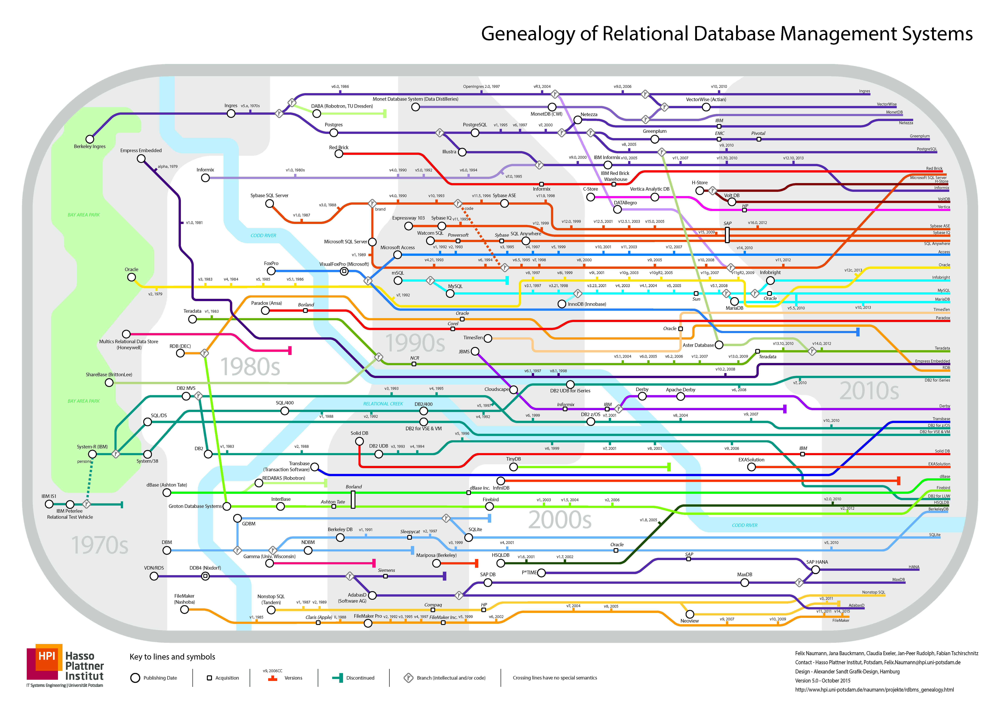

## 一张图读懂RDBMS的历史和基因
##### [TAG 22](../class/22.md)
               
### 作者       
digoal      
           
### 日期       
2017-03-28      
              
### 标签                                     
PostgreSQL , 关系数据库历史 , rdbms  
       
----       
       
## 背景      
https://hpi.de/naumann/projects/rdbms-genealogy.html  
  
  
  
  
  
  
  
  
  
  
## [digoal's 大量PostgreSQL文章入口](https://github.com/digoal/blog/blob/master/README.md "22709685feb7cab07d30f30387f0a9ae")
  
