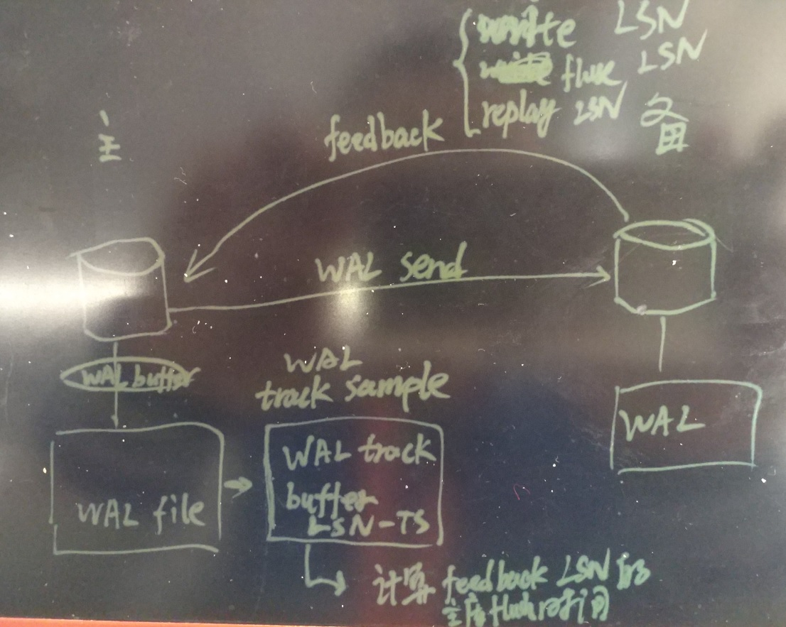
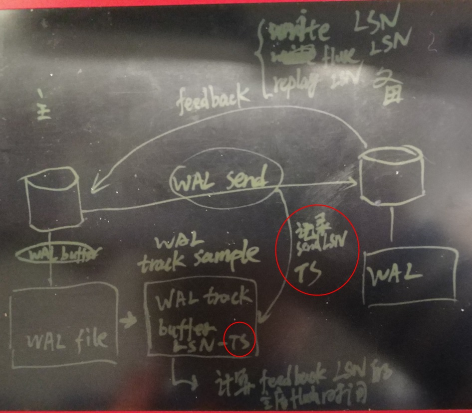

## PostgreSQL 10.0 preview 功能增强 - 流复制统计视图pg_stat_replication增强, 新增时间维度延迟评估
##### [TAG 13](../class/13.md)
                                                                      
### 作者                                                                                                                   
digoal                                                                 
                                                                        
### 日期                                                                   
2017-03-29                                                                  
                                                                    
### 标签                                                                 
PostgreSQL , 10.0 , 时间度量备库延迟 , pg_stat_replication 
                                                                      
----                                                                
                                                                         
## 背景        
pg_stat_replication视图中有4个字段记录了从备库反馈的WAL位点。如下:  
  
```  
postgres=# \d pg_stat_replication   
          View "pg_catalog.pg_stat_replication"  
      Column      |           Type           | Modifiers   
------------------+--------------------------+-----------  
 pid              | integer                  |   
 usesysid         | oid                      |   
 usename          | name                     |   
 application_name | text                     |   
 client_addr      | inet                     |   
 client_hostname  | text                     |   
 client_port      | integer                  |   
 backend_start    | timestamp with time zone |   
 backend_xmin     | xid                      |   
 state            | text                     |   
 sent_location    | pg_lsn                   | -- 主库已经发送的截至LSN位置  
 write_location   | pg_lsn                   | -- 备库已经WRITE的LSN位置  
 flush_location   | pg_lsn                   | -- 备库已经持久化的LSN位置  
 replay_location  | pg_lsn                   | -- 备库已经APPLY的LSN位置  
 sync_priority    | integer                  |   
 sync_state       | text                     |   
```  
  
通过计算，我们可以得到当前备库与主库在4个维度的延迟（WAL字节数）情况。  
  
```  
pg_current_xlog_insert_location  --  得到当前数据库的WAL插入位点  
  
pg_xlog_location_diff  --  计算两个WAL LSN位点的差距  
  
-- SQL如下, 计算主备的发送延迟  
  
select pg_size_pretty(pg_xlog_location_diff(pg_current_xlog_insert_location(), sent_location)) from pg_stat_replication;  
  
其他维度的查询，更改sent_location即可.  
```  
    
使用以上方法，能查询的延迟是字节形式反馈的。  
  
那么如果要转换为时间形式，目前没有很好的方法，除非从WAL文件中读取对应LSN RECORD的时间信息。  
  
10.0将在pg_stat_replication视图中新增几个字段，用于表示时间上的延迟(write_lag, flush_lag and replay_lag)。  
  
```    
Replication lag tracking for walsenders  
  
Adds write_lag, flush_lag and replay_lag cols to pg_stat_replication.  
  
Implements a lag tracker module that reports the lag times based upon  
measurements of the time taken for recent WAL to be written, flushed and  
replayed and for the sender to hear about it. These times  
represent the commit lag that was (or would have been) introduced by each  
synchronous commit level, if the remote server was configured as a  
synchronous standby.  For an asynchronous standby, the replay_lag column  
approximates the delay before recent transactions became visible to queries.  
If the standby server has entirely caught up with the sending server and  
there is no more WAL activity, the most recently measured lag times will  
continue to be displayed for a short time and then show NULL.  
  
Physical replication lag tracking is automatic. Logical replication tracking  
is possible but is the responsibility of the logical decoding plugin.  
Tracking is a private module operating within each walsender individually,  
with values reported to shared memory. Module not used outside of walsender.  
  
Design and code is good enough now to commit - kudos to the author.  
In many ways a difficult topic, with important and subtle behaviour so this  
shoudl be expected to generate discussion and multiple open items: Test now!  
  
Author: Thomas Munro, following designs by Fujii Masao and Simon Riggs  
Review: Simon Riggs, Ian Barwick and Craig Ringer  
```      
  
## 原理  
  
  
1\. 主库开辟了一块buffer，同时采样并记录主库flush wal record的LSN位置以及对应的时间。  
  
```  
+/* A sample associating a log position with the time it was written. */    
+typedef struct  
+{  
+   XLogRecPtr lsn;  
+   TimestampTz time;  
+} WalTimeSample;  
+  
+/* The size of our buffer of time samples. */  wal flush lsn以及对应的时间 采样  
+#define LAG_TRACKER_BUFFER_SIZE 8192  
+  
+/* A mechanism for tracking replication lag. */    
+static struct  
+{  
+   XLogRecPtr last_lsn;  
+   WalTimeSample buffer[LAG_TRACKER_BUFFER_SIZE];  
+   int write_head;  
+   int read_heads[NUM_SYNC_REP_WAIT_MODE];            --  对应备库write, flush, replay三种模式.  
+   WalTimeSample last_read[NUM_SYNC_REP_WAIT_MODE];   --    
+} LagTracker;  
  
  
  
  
/* SyncRepWaitMode */  
#define SYNC_REP_NO_WAIT                (-1)  
#define SYNC_REP_WAIT_WRITE             0  
#define SYNC_REP_WAIT_FLUSH             1  
#define SYNC_REP_WAIT_APPLY             2  
  
#define NUM_SYNC_REP_WAIT_MODE  3  
```  
  
2\. 实际上，目前记录的并不是FLUSH WAL record的LSN位置以及对应的时间，而是wal sender LSN的时间，所以目前的代码，我们应该理解为延时是从发送LSN到备库write,flush,replay三个阶段的延时。  
  
而不是主库FLUSH LSN到备库write,flusn,replay的延时。  
  
当主备WAL的发送延迟不大时，这个是比较准确的，当主备的WAL发送延迟较大时，这个就不准了。  
  
  
  
代码如下。  
  
```  
    /*  
+    * Record the current system time as an approximation of the time at which  
+    * this WAL position was written for the purposes of lag tracking.  
+    *  
+    * In theory we could make XLogFlush() record a time in shmem whenever WAL  
+    * is flushed and we could get that time as well as the LSN when we call  
+    * GetFlushRecPtr() above (and likewise for the cascading standby  
+    * equivalent), but rather than putting any new code into the hot WAL path  
+    * it seems good enough to capture the time here.  We should reach this  
+    * after XLogFlush() runs WalSndWakeupProcessRequests(), and although that  
+    * may take some time, we read the WAL flush pointer and take the time  
+    * very close to together here so that we'll get a later position if it  
+    * is still moving.  
+    *  
+    * Because LagTrackerWriter ignores samples when the LSN hasn't advanced,  
+    * this gives us a cheap approximation for the WAL flush time for this  
+    * LSN.  
+    *  
+    * Note that the LSN is not necessarily the LSN for the data contained in  
+    * the present message; it's the end of the the WAL, which might be  
+    * further ahead.  All the lag tracking machinery cares about is finding  
+    * out when that arbitrary LSN is eventually reported as written, flushed  
+    * and applied, so that it can measure the elapsed time.  
+    */  
+   LagTrackerWrite(SendRqstPtr, GetCurrentTimestamp());  
  
+/*  
+ * Record the end of the WAL and the time it was flushed locally, so that  
+ * LagTrackerRead can compute the elapsed time (lag) when this WAL position is  
+ * eventually reported to have been written, flushed and applied by the  
+ * standby in a reply message.  
+ * Exported to allow logical decoding plugins to call this when they choose.  
+ */  
+void  
+LagTrackerWrite(XLogRecPtr lsn, TimestampTz local_flush_time)  
+{  
+   bool buffer_full;  
+   int new_write_head;  
+   int i;  
+  
+   if (!am_walsender)  
+       return;  
+  
+   /*  
+    * If the lsn hasn't advanced since last time, then do nothing.  This way  
+    * we only record a new sample when new WAL has been written.  
+    */  
+   if (LagTracker.last_lsn == lsn)  
+       return;  
+   LagTracker.last_lsn = lsn;  
+  
+   /*  
+    * If advancing the write head of the circular buffer would crash into any  
+    * of the read heads, then the buffer is full.  In other words, the  
+    * slowest reader (presumably apply) is the one that controls the release  
+    * of space.  
+    */  
+   new_write_head = (LagTracker.write_head + 1) % LAG_TRACKER_BUFFER_SIZE;  
+   buffer_full = false;  
+   for (i = 0; i < NUM_SYNC_REP_WAIT_MODE; ++i)  
+   {  
+       if (new_write_head == LagTracker.read_heads[i])  
+           buffer_full = true;  
+   }  
+  
+   /*  
+    * If the buffer is full, for now we just rewind by one slot and overwrite  
+    * the last sample, as a simple (if somewhat uneven) way to lower the  
+    * sampling rate.  There may be better adaptive compaction algorithms.  
+    */  
+   if (buffer_full)  
+   {  
+       new_write_head = LagTracker.write_head;  
+       if (LagTracker.write_head > 0)  
+           LagTracker.write_head--;  
+       else  
+           LagTracker.write_head = LAG_TRACKER_BUFFER_SIZE - 1;  
+   }  
+  
+   /* Store a sample at the current write head position. */  
+   LagTracker.buffer[LagTracker.write_head].lsn = lsn;  
+   LagTracker.buffer[LagTracker.write_head].time = local_flush_time;  
+   LagTracker.write_head = new_write_head;  
+}  
```  
  
3\. 每个wal sender都会维护一个LagTracker。  
  
4\. 备库wal receiver进程会feedback 备库的WAL write, flush, replay的LSN位点，主库的wal sender进程收到feedback后，通过LagTrackerRead(记录在BUFFER中的LSN+时间戳，以及当前时间)，得到备库的延迟。  
  
代码如下  
  
```  
+/*  
+ * Find out how much time has elapsed between the moment WAL position 'lsn'  
+ * (or the highest known earlier LSN) was flushed locally and the time 'now'.  
+ * We have a separate read head for each of the reported LSN locations we  
+ * receive in replies from standby; 'head' controls which read head is  
+ * used.  Whenever a read head crosses an LSN which was written into the  
+ * lag buffer with LagTrackerWrite, we can use the associated timestamp to  
+ * find out the time this LSN (or an earlier one) was flushed locally, and  
+ * therefore compute the lag.  
+ *  
+ * Return -1 if no new sample data is available, and otherwise the elapsed  
+ * time in microseconds.  
+ */  
+static TimeOffset  
+LagTrackerRead(int head, XLogRecPtr lsn, TimestampTz now)  
+{  
+   TimestampTz time = 0;  
+  
+   /* Read all unread samples up to this LSN or end of buffer. */  
+   while (LagTracker.read_heads[head] != LagTracker.write_head &&  
+          LagTracker.buffer[LagTracker.read_heads[head]].lsn <= lsn)  
+   {  
+       time = LagTracker.buffer[LagTracker.read_heads[head]].time;  
+       LagTracker.last_read[head] =  
+           LagTracker.buffer[LagTracker.read_heads[head]];  
+       LagTracker.read_heads[head] =  
+           (LagTracker.read_heads[head] + 1) % LAG_TRACKER_BUFFER_SIZE;  
+   }  
+  
+   if (time > now)  
+   {  
+       /* If the clock somehow went backwards, treat as not found. */  
+       return -1;  
+   }  
+   else if (time == 0)  
+   {  
+       /*  
+        * We didn't cross a time.  If there is a future sample that we  
+        * haven't reached yet, and we've already reached at least one sample,  
+        * let's interpolate the local flushed time.  This is mainly useful for  
+        * reporting a completely stuck apply position as having increasing  
+        * lag, since otherwise we'd have to wait for it to eventually start  
+        * moving again and cross one of our samples before we can show the  
+        * lag increasing.  
+        */  
+       if (LagTracker.read_heads[head] != LagTracker.write_head &&  
+           LagTracker.last_read[head].time != 0)  
+       {  
+           double fraction;  
+           WalTimeSample prev = LagTracker.last_read[head];  
+           WalTimeSample next = LagTracker.buffer[LagTracker.read_heads[head]];  
+  
+           Assert(lsn >= prev.lsn);  
+           Assert(prev.lsn < next.lsn);  
+  
+           if (prev.time > next.time)  
+           {  
+               /* If the clock somehow went backwards, treat as not found. */  
+               return -1;  
+           }  
+  
+           /* See how far we are between the previous and next samples. */  
+           fraction =  
+               (double) (lsn - prev.lsn) / (double) (next.lsn - prev.lsn);  
+  
+           /* Scale the local flush time proportionally. */  
+           time = (TimestampTz)  
+               ((double) prev.time + (next.time - prev.time) * fraction);  
+       }  
+       else  
+       {  
+           /* Couldn't interpolate due to lack of data. */  
+           return -1;  
+       }  
+   }  
+  
+   /* Return the elapsed time since local flush time in microseconds. */  
+   Assert(time != 0);  
+   return now - time;  
+}  
```  
  
以上仅适用于物理复制。  
  
对于逻辑复制，decode plugin需要负责开发对应的延迟存储和获取的代码。  
  
## 目前实现的弊端,以及其他设计思路  
目前10.0的做法是最小化的代码改动量，实现一个近似的时间度量的主备延迟。弊端是，当WAL SENDER断开后或者发送存在较大延迟是，这种方法统计得到的备库时间的延迟偏差就会比较大。  
  
其他的方法思考，比如在WAL中记录一些WAL插值（比如通过wal custom接口，记录LSN位置和时间）, 因为COMMIT\ROLLBACK WAL RECORD以及WAL插值都记录了时间，备库可以直接在解析时得到LSN以及时间，所以可以直接反馈write, flush, replay的时间。通过这种方法，主库不需要开辟WAL来跟踪LSN的时间。这种方法得到的时间相对比较精确，但是会增加日志写入量，同时可能需要修改流复制协议。  
  
      
这个patch的讨论，详见邮件组，本文末尾URL。          
          
PostgreSQL社区的作风非常严谨，一个patch可能在邮件组中讨论几个月甚至几年，根据大家的意见反复的修正，patch合并到master已经非常成熟，所以PostgreSQL的稳定性也是远近闻名的。           
        
## 参考        
https://git.postgresql.org/gitweb/?p=postgresql.git;a=commit;h=6912acc04f0bbcfdb799a120618507601e862490  
  
<a rel="nofollow" href="http://info.flagcounter.com/h9V1"  ></a>  
  
  
  
  
  
  
## [digoal's 大量PostgreSQL文章入口](https://github.com/digoal/blog/blob/master/README.md "22709685feb7cab07d30f30387f0a9ae")
  
