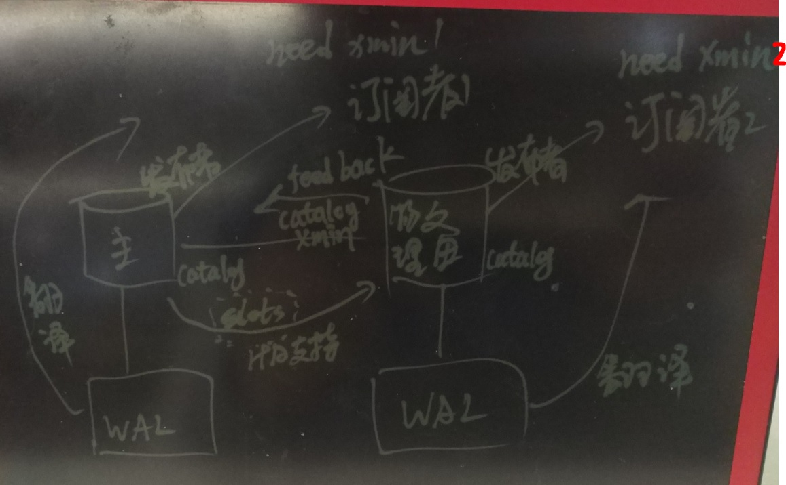

## PostgreSQL 10.0 preview 功能增强 - 物理备库支持逻辑订阅,订阅支持物理主备HA漂移  
##### [TAG 13](../class/13.md)
                                                                          
### 作者                                                                                                                       
digoal                                                                     
                                                                            
### 日期                                                                       
2017-03-30                                                                     
                                                                        
### 标签                                                                     
PostgreSQL , 10.0 , 主备漂移 , 逻辑复制    
                                                                          
----                                                                    
                                                                             
## 背景     
逻辑复制的本质是从WAL日志中，翻译出逻辑的数据（ROW），然后同步到下游节点。实际上是一个发布和订阅的流程。  
  
那么有两个问题，  
  
1\. 当上游节点使用了流复制搭建主备HA，并且主备发生切换时，下游节点的订阅还能继续吗？  
  
2\. 可以使用备库节点作为逻辑复制的上游节点吗？（即物理备库作为逻辑复制的发布节点）  
  
要回答这2个问题，我们要聚焦到WAL日志的翻译工作上。换句话说，备库能不能承担翻译WAL的工作。  
  
翻译WAL要用到什么呢？  
  
1\. WAL日志，主库和备库的WAL日志是一样的，所以这个条件是具备的。  
  
2\. CATALOG，将WAL翻译成ROW，必须要知道当时的表结构是啥样的。由于表结构可能变化，或者表可能被删除，CATALOG会发生变化，那么这些dead tuple必须要保留到翻译对应的WAL还需要它时。在主库上面，记录了逻辑订阅端的xmin以及catalog xmin，查看pg_replication_slots视图得到，也就知道哪些CATALOG DEAD TUPLE需要被保留。但是备库呢？备库如果要作为逻辑复制的发布者，必须它的订阅者消费的截至catalog xmin(即需要保留的dead tuple)上报给（上报WAL LSN是没用的，因为WAL在主库可能已经清除了）。上报catalog xmin通过什么方法呢？流复制协议即可。  
  
PS:  
  
PostgreSQL的逻辑复制不像MYSQL，MYSQL需要将所有的WAL都翻译成BINLOG，实际上目标可能只订阅一张表，那么就不需要浪费这么多的开销。  
  
PostgreSQL的发布端只需要将被订阅的表产生的WAL翻译成ROW传输给订阅端，这块是很节约空间的。但是请注意，这可能也是CATALOG膨胀的原因之一，比如订阅端一直不订阅，那么这个catalog xmin就一直不动，如果接下来主库发生了大量的表结构变化，或者大量TEMP TABLE的使用（导致了大量的CATALOG垃圾产生），可能导致catalog的膨胀。  
  
好了，进入正题，10.0到底做了什么来支持备库可以作为逻辑复制的发布者？  
  
  
  
由于主库保留了所有订阅者中最小的CATALOG XMIN的catalog dead tuple，所以，即使发生了HA，订阅者1，依旧可以漂移到下游节点，继续订阅。  
  
换句话说10.0支持逻辑订阅的漂移了。  
  
## 10.0流复制协议改进,支持feedback回传catalog xmin  
10.0 流复制协议, feedback消息格式如下，支持了备库反馈catalog xmin，支持级联备库，一路反馈到顶端的主库。  
  
https://www.postgresql.org/docs/devel/static/protocol-replication.html  
  
```  
Hot Standby feedback message (F)  
Byte1('h')  
Identifies the message as a Hot Standby feedback message.  
  
Int64  
The client's system clock at the time of transmission, as microseconds since midnight on 2000-01-01.  
  
Int32  
The standby's current global xmin, excluding the catalog_xmin from any replication slots. If both this value and the following catalog_xmin are 0 this is treated as a notification that Hot Standby feedback will no longer be sent on this connection. Later non-zero messages may reinitiate the feedback mechanism.  
  
Int32  
The epoch of the global xmin xid on the standby.  
  
Int32  
The lowest catalog_xmin of any replication slots on the standby. Set to 0 if no catalog_xmin exists on the standby or if hot standby feedback is being disabled.  
  
Int32  
The epoch of the catalog_xmin xid on the standby.  
```  
  
有了这个协议，备库就能把它的订阅者需要的catalog xmin反馈给上游顶端的主库。主库只要不清理catalog dead tuple，那么物理备库就可以愉快的支持逻辑订阅了。  
    
## 注意  
如果主库频繁的使用临时表，会导致catalog大量的insert, delete(特别是pg_attribute, pg_class，容易膨胀)，如果物理备库的级联逻辑备库复制较慢(那么它需要的catalog xmin会更早)，可能引发膨胀。  
  
社区有计划推出不在catalog内的临时表，或者持久化临时表。可以解决这个问题。  
  
https://wiki.postgresql.org/wiki/Postgres_Professional_roadmap  
  
```  
Better temporary tables  
  
Temporary tables outside of system catalog  
  
Some applications create temporary tables at a very high rate. In such cases, writing all of these temporary tables to system catalog becomes an issue, as:  
1. System catalog suffers from bloat;  
2. OIDs are consumed at high rate with risk of wraparound.  
The possible solution of this problem is to store temporary table meta-information in memory without touching persistent data structures.  
  
  
Temporary tables on standbys  
  
Temporary tables on standbys is a very frequently asked for feature. Assuming we can store temporary table meta-information in-memory, we can implement single-transaction temporary tables on standbys. In order to implement multi-transaction temporary tables we need to solve the MVCC problem. Currently, standby receives information about xids from master and can't issue any xid itself. The solution could be in introduction of parallel axis of "local xids" on standby.  
```  
  
  
这个patch的讨论，详见邮件组，本文末尾URL。              
              
PostgreSQL社区的作风非常严谨，一个patch可能在邮件组中讨论几个月甚至几年，根据大家的意见反复的修正，patch合并到master已经非常成熟，所以PostgreSQL的稳定性也是远近闻名的。               
            
## 参考            
https://git.postgresql.org/gitweb/?p=postgresql.git;a=commit;h=5737c12df0581b3298e3e9586bdef170811ce176  
  
https://www.postgresql.org/message-id/flat/CAMsr+YFi-LV7S8ehnwUiZnb=1h_14PwQ25d-vyUNq-f5S5r=Zg@mail.gmail.com#CAMsr+YFi-LV7S8ehnwUiZnb=1h_14PwQ25d-vyUNq-f5S5r=Zg@mail.gmail.com  
  
https://www.postgresql.org/docs/devel/static/protocol-replication.html  
  
https://blog.2ndquadrant.com/failover-slots-postgresql/  
  

  
<a rel="nofollow" href="http://info.flagcounter.com/h9V1"  ></a>  
  
  
  
  
  
  
## [digoal's 大量PostgreSQL文章入口](https://github.com/digoal/blog/blob/master/README.md "22709685feb7cab07d30f30387f0a9ae")
  
