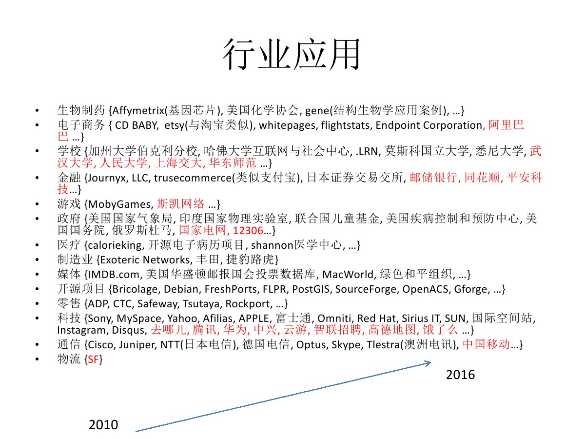

## PostgreSQL 10.0 preview 性能增强 - 推出JIT开发框架(朝着HTAP迈进)  
##### [TAG 13](../class/13.md) , [TAG 16](../class/16.md)
          
### 作者             
digoal     
      
### 日期                                                                         
2017-03-30    
         
### 标签      
PostgreSQL , 10.0 , HTAP , 动态编译 , JIT , LLVM , 表达式 , 函数跳转    
                                                                            
----                                                                      
                                                                               
## 背景     
数据库发展了几十年，出现了很多产品，有面向OLTP（在线事务处理）的，有面向OLAP（在线分析）的。  
  
虽然两个场景各有需求特色，但是企业需要为其需求买单，因为目前很少有产品可以同时满足在线处理和在线分析的需求。  
  
比如一家企业，通常都有业务的波峰波谷，比如游戏业务，通常波谷可能是在凌晨，因为大多数人都睡了。而波峰可能出现在每天的工作闲时、游戏运营时段、节假日等。  
  
为了分析业务数据，企业通常需要构建一个数据仓库，将业务数据从OLTP数据库写入OLAP数据库，这里存在几个问题  
  
1\. 需要额外的成本  
  
2\. 数据存在延时  
  
如果OLTP数据库产品本身已经具备了OLAP的能力，以上两个问题将迎刃而解。  
  
例如在业务高峰期，使用备库进行查询类分析，在业务低峰，使用主库计算并产生报表。  
  
那么什么样的数据库能同时具备OLTP和OLAP的能力呢？（现在这种场景称之为HTAP，混合业务）  
  
PostgreSQL在OLTP领域的功能、性能、稳定性、可靠性久经考验  
  
  
  
PostgreSQL在OLAP方面有哪些强项呢？  
  
首先我们了解一下OLAP数据库应有的能力。  
  
## OLAP数据库应具备的能力  
  
1\. 列存储  
  
通常OLAP是基于列的分析，列存储可以减少分析时需要扫描的数据量，提高性能。  
  
同时列存储还有几个好处，压缩比高，可以更好的支持向量计算。  
  
2\. JIT  
  
通常OLAP分析可能涉及较多的聚合，条件过滤等，这些操作在数据库内核中是一些对应的函数，可能每一行都会流经这些函数，当分析的数据量很庞大时，需要大量的函数调用，stack的进出交换，内存拷贝等。  
  
动态编译，可以减少函数调用，解决以上瓶颈。  
  
3\. 向量计算  
  
利用CPU的cache和向量化执行指令，可以批量执行，从而提高大量数据处理的速度，往往有10X的性能提升。  
  
4\. 多核并行  
  
现在的主机，CPU核数都很多，上百个核的机器已经越来越普遍，而OLAP并不是高并发的应用，他们往往并发低，但是单条QUERY需要的运算量非常庞大。  
  
所以能充分利用多核处理单条QUERY，可以很好的满足OLAP的需求。  
  
5\. sharding+MPP  
  
单机的能力毕竟是有限，所以数据分片，MPP（节点间自由协作，数据自动重分布），可以有效的解决单机的性能瓶颈。  
  
6\. GPU\FPGA扩展计算能力  
  
CPU擅长的是任务型的运算，而GPU\FPGA可以更好的满足计算密集型的事务，单机的数据处理能力可以通过GPU或FPGA计算得到提升。  
  
7\. OLAP函数和语法、窗口语法、扩展分析语言等  
  
OLAP分析可能需要用到复杂的函数、聚合、窗口。甚至需要自己动手编写一些复杂的计算函数，或者分析函数。  
  
所以对数据库内置的函数是否完备、支持的SQL语法是否完备息息相关。同时对数据库的编程能力，功能扩展能力也息息相关。  
  
8\. 块索引  
  
通常数据仓库的数据量级非常庞大，往往B-TREE索引在体量、检索速度、建立速度可能不能满足业务需求。  
  
块级索引，是以块为单位，记录块内元数据的索引（最大值、最小值、空值、COUTN、SUM、相关性等）可以很好的支撑OLAP的场景。  
  
9\. 压缩  
  
压缩也是OLAP的核心诉求之一，当你的历史数据越来越庞大时，你可能就知道压缩的好处了。  
  
主要是节约成本，（CPU加解压）时间换空间。  
  
10\. 数据摄取、导入能力  
  
对于OLAP系统，数据的摄取能力很重要，比如兼容更多的数据类型，可以访问更多的数据来源。  
  
导入能力，考验数据导入的速度，加载数据的接口是否丰富。  
  
## PostgreSQL HTAP之路  
PostgreSQL 从2010年就开始布局HTAP，正在稳步的引领开源数据库占领HTAP高地。 从FDW，列存储，多核并行，GPU插件，sharding，向量计算，JIT等方面均有体现。  
  
[《分析加速引擎黑科技 - LLVM、列存、多核并行、算子复用 大联姻 - 一起来开启PostgreSQL的百宝箱》](../201612/20161216_01.md)  
  
[《PostgreSQL 10.0 preview 功能增强 - OLAP增强 向量聚集索引(列存储扩展)》](../201703/20170313_06.md)  
  
[《PostgreSQL 9.6 引领开源数据库攻克多核并行计算难题》](../201610/20161001_01.md)  
  
https://github.com/pg-strom  
  
[《PostgreSQL 聚集存储 与 BRIN索引 - 高并发行为、轨迹类大吞吐数据查询场景解说》](../201702/20170219_01.md)  
  
[《PostgreSQL 9.5 new feature - Support GROUPING SETS, CUBE and ROLLUP.》](../201505/20150526_02.md)  
  
https://www.postgresql.org/docs/9.6/static/tutorial-window.html  
  
## 10.0 布局JIT框架  
PostgreSQL 10.0把SQL执行的框架从树形递归调用时改成了非递归的opcode驱动模式，可以大幅降低处理大批量数据，大批表达式时的函数调用、内存拷贝等开销。  
  
同时这种执行模式使得JIT的开发变得更加轻松，朝着HTAP迈进。  
  
```  
Faster expression evaluation and targetlist projection.  
  
This replaces the old, recursive tree-walk based evaluation, with  
non-recursive, opcode dispatch based, expression evaluation.  
Projection is now implemented as part of expression evaluation.  
  
This both leads to significant performance improvements, and makes  
future just-in-time compilation of expressions easier.  
  
The speed gains primarily come from:  
- non-recursive implementation reduces stack usage / overhead  
- simple sub-expressions are implemented with a single jump, without  
  function calls  
- sharing some state between different sub-expressions  
- reduced amount of indirect/hard to predict memory accesses by laying  
  out operation metadata sequentially; including the avoidance of  
  nearly all of the previously used linked lists  
- more code has been moved to expression initialization, avoiding  
  constant re-checks at evaluation time  
  
Future just-in-time compilation (JIT) has become easier, as  
demonstrated by released patches intended to be merged in a later  
release, for primarily two reasons: Firstly, due to a stricter split  
between expression initialization and evaluation, less code has to be  
handled by the JIT. Secondly, due to the non-recursive nature of the  
generated "instructions", less performance-critical code-paths can  
easily be shared between interpreted and compiled evaluation.  
  
The new framework allows for significant future optimizations. E.g.:  
- basic infrastructure for to later reduce the per executor-startup  
  overhead of expression evaluation, by caching state in prepared  
  statements.  That'd be helpful in OLTPish scenarios where  
  initialization overhead is measurable.  
- optimizing the generated "code". A number of proposals for potential  
  work has already been made.  
- optimizing the interpreter. Similarly a number of proposals have  
  been made here too.  
  
The move of logic into the expression initialization step leads to some  
backward-incompatible changes:  
- Function permission checks are now done during expression  
  initialization, whereas previously they were done during  
  execution. In edge cases this can lead to errors being raised that  
  previously wouldn't have been, e.g. a NULL array being coerced to a  
  different array type previously didn't perform checks.  
- The set of domain constraints to be checked, is now evaluated once  
  during expression initialization, previously it was re-built  
  every time a domain check was evaluated. For normal queries this  
  doesn't change much, but e.g. for plpgsql functions, which caches  
  ExprStates, the old set could stick around longer.  The behavior  
  around might still change.  
  
Author: Andres Freund, with significant changes by Tom Lane,  
changes by Heikki Linnakangas  
Reviewed-By: Tom Lane, Heikki Linnakangas  
Discussion: https://postgr.es/m/20161206034955.bh33paeralxbtluv@alap3.anarazel.de  
```  
              
## 参考              
https://postgr.es/m/20161206034955.bh33paeralxbtluv@alap3.anarazel.de  
  
https://git.postgresql.org/gitweb/?p=postgresql.git;a=commit;h=b8d7f053c5c2bf2a7e8734fe3327f6a8bc711755  
  
https://git.postgresql.org/gitweb/?p=postgresql.git;a=commit;h=2f0903ea196503fc8af373a9de46b1e01a23508c  
  
https://postgr.es/m/26088.1490315792@sss.pgh.pa.us  
  

  
<a rel="nofollow" href="http://info.flagcounter.com/h9V1"  ></a>  
  
  
  
  
  
  
## [digoal's 大量PostgreSQL文章入口](https://github.com/digoal/blog/blob/master/README.md "22709685feb7cab07d30f30387f0a9ae")
  
