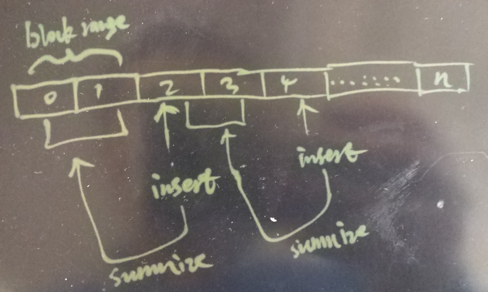

## PostgreSQL 10.0 preview 功能增强 - BRIN 索引更新smooth化    
##### [TAG 13](../class/13.md)  
                            
### 作者                               
digoal                       
                        
### 日期                                                                                           
2017-04-05                      
                           
### 标签                        
PostgreSQL , 10.0 , BRIN , de-summarization , summarization , 平滑更新BRIN , 平滑失效BRIN    
                                                                                              
----                                                                                        
                                                                                                 
## 背景                    
我们将数据存入PostgreSQL时，如果创建的是堆表，那么数据是往数据文件的末尾不断追加存储的。   
  
为了提高数据的检索速度，可以对响应的字段创建索引，在PostgreSQL中，已有8种索引类型，分别是B-Tree，hash, gin, gist, sp-gist, brin, bloom, rum。分别对应不同的应用场景。  
  
如果数据值与物理存储线性相关性比较好，可以使用块级索引（BRIN），以块（或连续的若干块）为最小单位，索引中存储的是这些最小单位的统计信息（最大值，最小值，记录条数，SUM，NULL值条数等）。  
  
为了提高插入速度，HEAP末端的块，可能并不会实时的更新到BRIN索引中，10.0以前，vacuum或者autovacuum表时，会生成未生成统计信息的HEAP block range，如果插入很快，比如在一个vacuum周期内，插入了100个数据块的内容，那么vacuum需要扫描这100个数据块并生成BRIN索引对应的信息。  
  
  
  
## 10.0 写时触发更新brin  
为了防止插入过快，导致vacuum一次要统计过多的数据块，或者导致未进入BRIN索引的堆表末端数据块过多，10.0的改进如下，在插入时，如果插入到下一个block range的块时，自动触发vacuum去统计前一个block range的BRIN统计信息（如果还没有被统计的话）。  
  
这样就可以解决前面提到的问题，因为insert的时候，只要到达block range边界，就会自动触发vacuum去统计它。  
  
开启"insert的时候，只要到达block range边界，就会自动触发vacuum去统计它"的方法，创建索引时，指定autosummarize参数。  
  
https://www.postgresql.org/docs/devel/static/sql-createindex.html  
  
```  
BRIN indexes accept different parameters:  
  
pages_per_range  
Defines the number of table blocks that make up one block range for each entry of a BRIN index (see Section 65.1 for more details). The default is 128.  
  
autosummarize  
Defines whether a summarization run is invoked for the previous page range whenever an insertion is detected on the next one.  
  
create index idx on table using brin (id) with (autosummarize=on);  
```  
  
  
  
同时，10.0还新增了用户UDF接口，用户可以自己调用函数，去统计（更新）BRIN索引，指定表，以及堆表对应的block_id即可。  
  
```  
+-- Test brin_summarize_range  
+CREATE TABLE brin_summarize (  
+    value int  
+) WITH (fillfactor=10, autovacuum_enabled=false);  
+CREATE INDEX brin_summarize_idx ON brin_summarize USING brin (value) WITH (pages_per_range=2);  
+-- Fill a few pages  
+DO $$  
+DECLARE curtid tid;  
+BEGIN  
+  LOOP  
+    INSERT INTO brin_summarize VALUES (1) RETURNING ctid INTO curtid;  
+    EXIT WHEN curtid > tid '(2, 0)';  
+  END LOOP;  
+END;  
+$$;  
+-- summarize one range  
+SELECT brin_summarize_range('brin_summarize_idx', 0);  
+ brin_summarize_range   
+----------------------  
+                    1  
+(1 row)  
+  
+-- nothing: already summarized  
+SELECT brin_summarize_range('brin_summarize_idx', 1);  
+ brin_summarize_range   
+----------------------  
+                    0  
+(1 row)  
+  
+-- summarize one range  
+SELECT brin_summarize_range('brin_summarize_idx', 2);  
+ brin_summarize_range   
+----------------------  
+                    1  
+(1 row)  
+  
+-- nothing: page doesn't exist in table  
+SELECT brin_summarize_range('brin_summarize_idx', 4294967295);  
+ brin_summarize_range   
+----------------------  
+                    0  
+(1 row)  
+  
+-- invalid block number values  
+SELECT brin_summarize_range('brin_summarize_idx', -1);  
+ERROR:  block number out of range: -1  
+SELECT brin_summarize_range('brin_summarize_idx', 4294967296);  
+ERROR:  block number out of range: 4294967296  
```  
  
patch信息如下  
  
```  
BRIN auto-summarization  
  
Previously, only VACUUM would cause a page range to get initially  
summarized by BRIN indexes, which for some use cases takes too much time  
since the inserts occur.  To avoid the delay, have brininsert request a  
summarization run for the previous range as soon as the first tuple is  
inserted into the first page of the next range.  Autovacuum is in charge  
of processing these requests, after doing all the regular vacuuming/  
analyzing work on tables.  
  
This doesn't impose any new tasks on autovacuum, because autovacuum was  
already in charge of doing summarizations.  The only actual effect is to  
change the timing, i.e. that it occurs earlier.  For this reason, we  
don't go any great lengths to record these requests very robustly; if  
they are lost because of a server crash or restart, they will happen at  
a later time anyway.  
  
Most of the new code here is in autovacuum, which can now be told about  
"work items" to process.  This can be used for other things such as GIN  
pending list cleaning, perhaps visibility map bit setting, both of which  
are currently invoked during vacuum, but do not really depend on vacuum  
taking place.  
  
The requests are at the page range level, a granularity for which we did  
not have SQL-level access; we only had index-level summarization  
requests via brin_summarize_new_values().  It seems reasonable to add  
SQL-level access to range-level summarization too, so add a function  
brin_summarize_range() to do that.  
  
Authors: Álvaro Herrera, based on sketch from Simon Riggs.  
Reviewed-by: Thomas Munro.  
Discussion: https://postgr.es/m/20170301045823.vneqdqkmsd4as4ds@alvherre.pgsql  
```  
  
## 10.0 brin索引条目失效接口  
brin记录的是block range的最大值，最小值，随着对应block range内数据的更新，删除，BRIN IDX中对应的block range统计信息可能会越来越宽泛（不准确），因此为了提高BRIN的精度，10.0新增了一个失效接口，可以将对应block range的brin index内的条目失效，然后你可以等VACUUM再次统计它，或者调用前面提到的UDF接口来统计它。  
  
  
  
失效heap block range对应brin idx条目的方法  
  
```  
+SELECT brin_desummarize_range('brinidx', 0);  
+ brin_desummarize_range   
+------------------------  
+   
+(1 row)  
+  
  
+-- Tests for brin_desummarize_range  
+SELECT brin_desummarize_range('brinidx', -1); -- error, invalid range  
+ERROR:  block number out of range: -1  
+SELECT brin_desummarize_range('brinidx', 0);  
+ brin_desummarize_range   
+------------------------  
+   
+(1 row)  
+  
+SELECT brin_desummarize_range('brinidx', 0);  
+ brin_desummarize_range   
+------------------------  
+   
+(1 row)  
+  
+SELECT brin_desummarize_range('brinidx', 100000000);  
+ brin_desummarize_range   
+------------------------  
+   
+(1 row)  
+  
```  
  
patch信息如下  
  
```  
BRIN de-summarization  
  
When the BRIN summary tuple for a page range becomes too "wide" for the  
values actually stored in the table (because the tuples that were  
present originally are no longer present due to updates or deletes), it  
can be useful to remove the outdated summary tuple, so that a future  
summarization can install a tighter summary.  
  
This commit introduces a SQL-callable interface to do so.  
  
Author: Álvaro Herrera  
Reviewed-by: Eiji Seki  
Discussion: https://postgr.es/m/20170228045643.n2ri74ara4fhhfxf@alvherre.pgsql  
```  
  
这个patch的讨论，详见邮件组，本文末尾URL。          
           
PostgreSQL社区的作风非常严谨，一个patch可能在邮件组中讨论几个月甚至几年，根据大家的意见反复的修正，patch合并到master已经非常成熟，所以PostgreSQL的稳定性也是远近闻名的。                   
           
## 参考                    
https://git.postgresql.org/gitweb/?p=postgresql.git;a=commit;h=7526e10224f0792201e99631567bbe44492bbde4  
  
https://git.postgresql.org/gitweb/?p=postgresql.git;a=commit;h=c655899ba9ae2a0d24e99c797167c33e0cfa0820  
  
https://www.postgresql.org/docs/devel/static/sql-createindex.html  
  
<a rel="nofollow" href="http://info.flagcounter.com/h9V1"  ></a>  
  
  
  
  
  
  
## [digoal's 大量PostgreSQL文章入口](https://github.com/digoal/blog/blob/master/README.md "22709685feb7cab07d30f30387f0a9ae")
  
