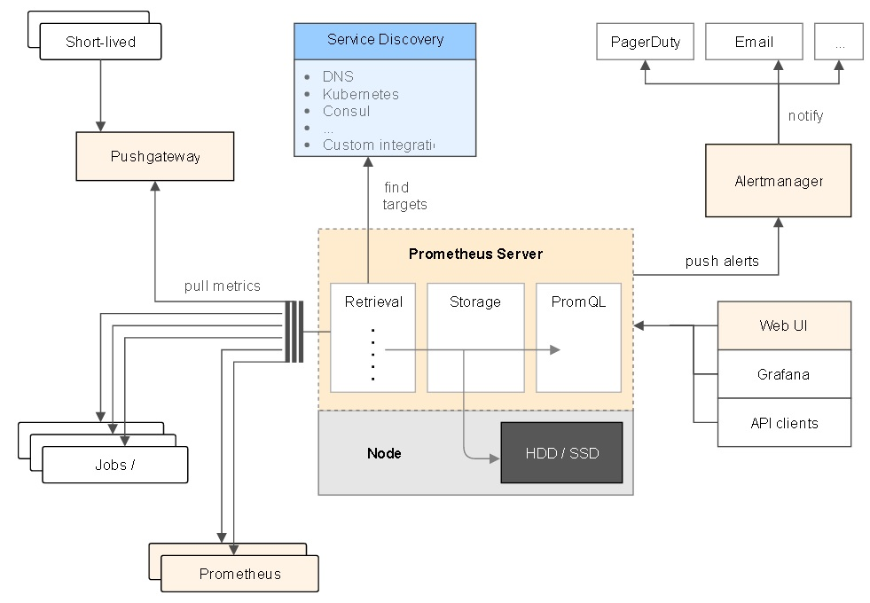

## Prometheus 监控平台  
                                            
### 作者                                               
digoal                                       
                                        
### 日期                                                                                                           
2017-04-09                                      
                                           
### 标签                                        
PostgreSQL , 监控平台 , ganglia , zabbix , nagios , Prometheus , GO    
                                                                                                              
----                                                                                                        
                                                                                                                 
## 背景        
## What is Prometheus?  
Prometheus is an open-source systems monitoring and alerting toolkit originally built at SoundCloud. Since its inception in 2012, many companies and organizations have adopted Prometheus, and the project has a very active developer and user community. It is now a standalone open source project and maintained independently of any company. To emphasize this and clarify the project's governance structure, Prometheus joined the Cloud Native Computing Foundation in 2016 as the second hosted project after Kubernetes.  
  
For a more elaborate overview, see the resources linked from the media section.  
  
是一个非常活跃的项目, 结合PostgreSQL的时序数据和流式计算，会更好。  
  
## 架构  
  
  
## ppt  
[Deploying Prometheus](0170409_03_pdf_001.pdf)  
  
## 参考      
https://prometheus.io/docs/introduction/overview/  
  
https://prometheus.io/docs/introduction/getting_started/  
  
https://github.com/prometheus/prometheus  
  
  
  
  
  
  
  
  
## [digoal's 大量PostgreSQL文章入口](https://github.com/digoal/blog/blob/master/README.md "22709685feb7cab07d30f30387f0a9ae")
  
