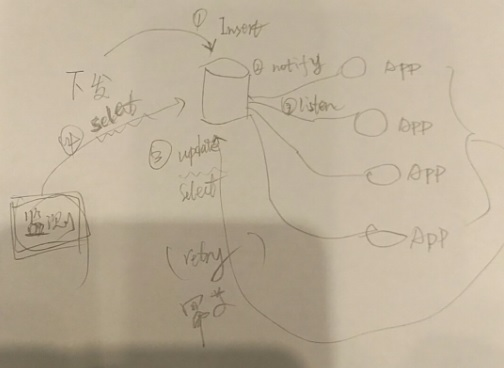
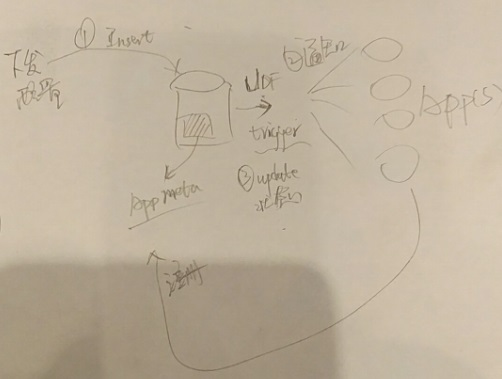

## 微服务配置管理  
                                              
### 作者                                                 
digoal                                         
                                          
### 日期                                                                                                             
2017-04-09                                        
                                             
### 标签                                          
PostgreSQL , 微服务 , 配置管理 , UDF , 异步消息 , JSON , XML     
                                                                                                                
----                                                                                                          
                                                                                                                   
## 背景      
  
  
微服务的介绍，请参考  
  
https://martinfowler.com/articles/microservices.html  
  
不管是微服务，或者其他软件架构，docker等。APP(微服务)配置的同步，变更，下发，都是需要面对的。  
  
例如你可以用消息队列，但是这种方式比较重，同时在APP重启后，可能还需要消费一部分消息（实际上重启后可以直接读取最新配置，不需要重新消费）。  
  
使用PostgreSQL以及UDF可以比较好的解决微服务的配置存储、变更、下发的问题。  
  
## 配置存储  
PostgreSQL 支持json, XML, kv, 数组等数据类型，可以非常方便的存储应用配置。  
  
## 配置变更通知方法1 - notify, listen  
PostgreSQL提供了一个异步消息的功能，用户可以往通道中发消息，也可以监听来自通道的消息。  
  
这种方式比较适合下发配置，例如每个微服务都监听来自某个通道的消息，当需要变更配置时，往配置变更表插入一条新的配置记录，同时调用触发器函数，往通道中发送消息，所有的微服务都会接收到来自该通道的消息。  
  
  
  
弊端  
  
1\. 每个微服务都需要与PostgreSQL建立一个长连接，并监听某个通道。如果监听断开，重新建立连接和监听之前的消息会丢掉。  
  
这个问题可以解，比如连接断开后，重新建立监听，同时微服务主动询问一下数据库（查询配置表），是否有新的配置。如果有的话自动获取最新配置信息。  
  
2\. 由于每个微服务都需要占用一个长连接，对数据库来说，几万个微服务，就需要几万个长连接，平均每个连接消耗2MB内存的话，就需要1万个连接需要20GB内存。  
  
notify/listen 异步消息还有其他比较适合的应用场合，例如  
  
[《从电波表到数据库小程序之 - 数据库异步广播(notify/listen)》](../201701/20170116_01.md)   
  
[《从微信小程序 到 数据库"小程序" , 鬼知道我经历了什么》](../201701/20170113_03.md)    
  
[《[转载]postgres+socket.io+nodejs实时地图应用实践》](../201701/20170113_02.md)    
  
## 配置变更通知方法2 - UDF  
PostgreSQL 还有trigger以及UDF的功能，如果用在微服务的配置管理场景，相比异步消息，没有以上两个问题。  
  
  
  
怎么做到呢？  
  
1\. 微服务的注册，例如为每个微服务注册后，在数据库中表现为一条唯一身份的记录（微服务的指纹）。  
  
2\. 微服务注册后，启动服务时，从配置表读取最新的配置。  
  
3\. 当下发配置时，往配置表插入一条记录（或者更新配置记录），我们暂且将配置的ID表示为NEW ID，老的配置为OLD ID，然后通过DML trigger，触发调用一个UDF。  
  
4\. 这个UDF可以是PostgreSQL pljava, plpython, C等过程语言编写的触发器函数，UDF的目标是根据已注册的微服务，联系并把配置变更涉及的ID或者内容直接发送给微服务，如果是发送ID，微服务还需要访问数据库，读取对应的配置。  
  
弊端  
  
1\. 由于是数据库通过UDF主动通知服务的，所以微服务必须有对应的API，增加了微服务的复杂度。  
  
## 小结  
PostgreSQL 的异步消息机制、触发器、UDF接口等功能，结合json, xml, kv, 数组等类型。可以很好的解决微服务的配置管理问题。  
  
这个应用场景的灵感来自PG社区的同学（51信用卡）公司里的场景，期待用户方的详尽分享。  
  
## 参考        
https://www.postgresql.org/docs/9.6/static/sql-notify.html  
  
https://www.postgresql.org/docs/9.6/static/sql-listen.html  
  
https://www.postgresql.org/docs/9.6/static/libpq-notify.html  
  
  
  
  
  
  
  
  
## [digoal's 大量PostgreSQL文章入口](https://github.com/digoal/blog/blob/master/README.md "22709685feb7cab07d30f30387f0a9ae")
  
