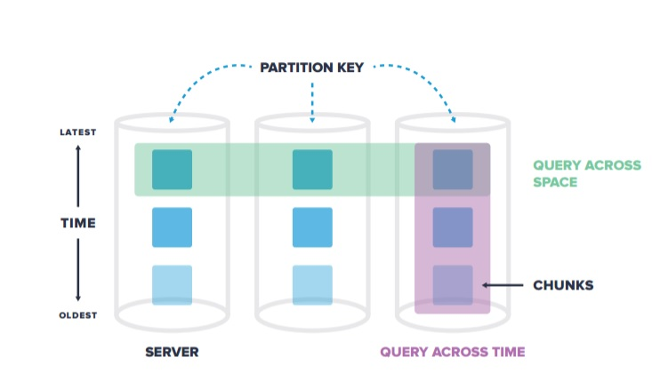

## 时序数据库有哪些特点? TimescaleDB时序数据库介绍  
##### [TAG 15](../class/15.md) , [TAG 18](../class/18.md)
                                                
### 作者                                                   
digoal                                           
                                            
### 日期                                                                                                               
2017-04-09                                          
                                               
### 标签                                            
PostgreSQL , TimescaleDB , 时间序列 , 物联网 , IoT     
                                                                                                                  
----                                                                                                            
                                                                                                                     
## 背景        
随着物联网的发展，时序数据库的需求越来越多，比如水文监控、工厂的设备监控、国家安全相关的数据监控、通讯监控、金融行业指标数据、传感器数据等。  
  
在互联网行业中，也有着非常多的时序数据，例如用户访问网站的行为轨迹，应用程序产生的日志数据等等。  
  
时序数据有几个特点  
  
1\. 基本上都是插入，没有更新的需求。  
  
2\. 数据基本上都有时间属性，随着时间的推移不断产生新的数据，旧的数据不需要保存太久。  
  
业务方对时序数据通常有几个查询需求  
  
1\. 获取最新状态，查询最近的数据（例如传感器最新的状态）  
  
2\. 展示区间统计，指定时间范围，查询统计信息，例如平均值，最大值，最小值，计数等。。。  
  
3\. 获取异常数据，根据指定条件，筛选异常数据  
  
## 时序数据库应该具备的特点  
1\. 压缩能力  
  
通常用得上时序数据库的业务，传感器产生的数据量都是非常庞大的，数据压缩可以降低存储成本。  
  
2\. 自动rotate  
  
时序数据通常对历史数据的保留时间间隔是有规定的，例如一个线上时序数据业务，可能只需要保留最近1周的数据。  
  
为了方便使用，时序数据库必须有数据自动rotate的能力。  
  
3\. 支持分片，水平扩展  
  
因为涉及的传感器可能很多，单个节点可能比较容易成为瓶颈，所以时序数据库应该具备水平扩展的能力，例如分表应该支持水平分区。  
  
4\. 自动扩展分区，  
  
业务对时序数据的查询，往往都会带上对时间区间进行过滤，因此时序数据通常在分区时，一定会有一个时间分区的概念。时序数据库务必能够支持自动扩展分区，减少用户的管理量，不需要人为的干预自动扩展分区。例如1月份月末，自动创建2月份的分区。  
  
5\. 插入性能  
  
时序数据，插入是一个强需求。对于插入性能要求较高。  
  
6\. 分区可删除  
  
分区可以被删除，例如保留1个月的数据，1个月以前的分区都可以删除掉。  
  
7\. 易用性(SQL接口)  
  
SQL是目前最通用的数据库访问语言，如果时序数据库能支持SQL是最好的。  
  
8\. 类型丰富  
  
物联网的终端各异，会有越来越多的非标准类型的支持需求。例如采集图像的传感器，数据库中至少要能够存取图像的特征值。而对于其他垂直行业也是如此，为了最大程度的诠释业务，必须要有精准的数据类型来支撑。  
  
9\. 索引接口  
  
支持索引，毫无疑问是为了加速查询而引入的。  
  
10\. 高效分析能力  
  
时序数据，除了单条的查询，更多的是报表分析或者其他的分析类需求。这对时序数据库的统计能力也是一个挑战。  
  
11\. 其他特色  
  
11\.1 支持丰富的数据类型，数组、范围类型、JSON类型、K-V类型、GIS类型、图类型等。满足更多的工业化需求，例如传感器的位置信息、传感器上传的数据值的范围，批量以数组或JSON的形式上传，传感器甚至可能上传图片特征值，便于图片的分析。（例如国家安全相关），轨迹数据的上层则带有GIS属性。  
  
这个世界需要的是支持类型丰富的时序数据库，而不是仅仅支持简单类型的时序数据库。  
  
11\.2 支持丰富的索引接口，因为类型丰富了，普通的B-TREE索引可能无法满足快速的检索需求，需要更多的索引来支持 数组、JSON、GIS、图特征值、K-V、范围类型等。 (例如PostgreSQL的gin, gist, sp-gist, brin, rum, bloom, hash索引接口)  
  
这两点可以继承PostgreSQL数据库的已有功能，已完全满足。  
  
## TimescaleDB介绍  
TimescaleDB是基于PostgreSQL数据库打造的一款时序数据库，插件化的形式，随着PostgreSQL的版本升级而升级，不会因为另立分支带来麻烦。  
  
### TimescaleDB架构  
  
  
  
数据自动按时间和空间分片（chunk）。  
  
### TimescaleDB具备以下特点  
  
1\. 基于时序优化  
  
2\. 自动分片（按时间、空间自动分片(chunk)）  
  
3\. 全SQL接口  
  
4\. 支持垂直于横向扩展  
  
5\. 支持时间维度、空间维度自动分区。空间维度指属性字段（例如传感器ID，用户ID等）  
  
6\. 支持多个SERVER，多个CHUNK的并行查询。分区在TimescaleDB中被称为chunk。  
  
7\. 自动调整CHUNK的大小  
  
8\. 内部写优化（批量提交、内存索引、事务支持、数据倒灌）。  
  
内存索引，因为chunk size比较适中，所以索引基本上都不会被交换出去，写性能比较好。  
  
数据倒灌，因为有些传感器的数据可能写入延迟，导致需要写以前的chunk，timescaleDB允许这样的事情发生(可配置)。  
  
9\. 复杂查询优化（根据查询条件自动选择chunk，最近值获取优化(最小化的扫描,类似递归收敛)，limit子句pushdown到不同的server,chunks，并行的聚合操作）  
  
[《时序数据合并场景加速分析和实现 - 复合索引，窗口分组查询加速，变态递归加速》](../201611/20161128_01.md)   
  
10\. 利用已有的PostgreSQL特性（支持GIS，JOIN等），方便的管理（流复制、PITR）  
  
11\. 支持自动的按时间保留策略（自动删除过旧数据）  
  
## 疑问  
1\. chunk过多，会不会影响查询性能？  
  
这点不需要担心，PostgreSQL 10.0已经优化了  
  
[《PostgreSQL 10.0 preview 性能增强 - 分区表子表元信息搜索性能增强》](../201703/20170312_16.md)  
  
## 例子  
1\. 创建时序表(hypertable)  
  
```  
# Create a schema for a new hypertable  
CREATE TABLE sensor_data (  
"time" timestamp with time zone NOT NULL,  
device_id TEXT NOT NULL,  
location TEXT NULL,  
temperature NUMERIC NULL,  
humidity NUMERIC NULL,  
pm25 NUMERIC  
);  
  
# Create a hypertable from this data  
SELECT create_hypertable  
('sensor_data', 'time', 'device_id', 16);  
```  
  
2\. 迁移数据到hyper table  
  
```  
# Migrate data from existing Postgres table into  
# a TimescaleDB hypertable  
INSERT INTO sensor_data (SELECT * FROM old_data);  
```  
  
3\. 查询hyper table  
  
```  
# Query hypertable like any SQL table  
SELECT device_id, AVG(temperature) from sensor_data  
WHERE temperature IS NOT NULL AND humidity > 0.5  
AND time > now() - interval '7 day'  
GROUP BY device_id;  
```  
  
4\. 查询最近异常的数据  
  
```  
# Metrics about resource-constrained devices  
SELECT time, cpu, freemem, battery FROM devops  
WHERE device_id='foo'  
AND cpu > 0.7 AND freemem < 0.2  
ORDER BY time DESC  
LIMIT 100;  
```  
  
5\. 计算最近7天，每小时的异常次数  
  
```  
# Calculate total errors by latest firmware versions  
# per hour over the last 7 days  
SELECT date_trunc('hour', time) as hour, firmware,  
COUNT(error_msg) as errno FROM data  
WHERE firmware > 50  
AND time > now() - interval '7 day'  
GROUP BY hour, firmware  
ORDER BY hour DESC, errno DESC;  
```  
  
6\. 计算巴士的每小时平均速度  
  
```  
# Find average bus speed in last hour  
# for each NYC borough  
SELECT loc.region, AVG(bus.speed) FROM bus  
INNER JOIN loc ON (bus.bus_id = loc.bus_id)  
WHERE loc.city = 'nyc'  
AND bus.time > now() - interval '1 hour'  
GROUP BY loc.region;  
```  
  
7\. 展示最近12小时，每小时的平均值  
  
```  
=#  SELECT date_trunc('hour', time) AS hour, AVG(weight)  
    FROM logs  
    WHERE device_type = 'pressure-sensor' AND customer_id = 440  
      AND time > now() - interval '12 hours'  
    GROUP BY hour;  
  
 hour               | AVG(weight)  
--------------------+--------------  
 2017-01-04 12:00   | 170.0  
 2017-01-04 13:00   | 174.2  
 2017-01-04 14:00   | 174.0  
 2017-01-04 15:00   | 178.6  
 2017-01-04 16:00   | 173.0  
 2017-01-04 17:00   | 169.9  
 2017-01-04 18:00   | 168.1  
 2017-01-04 19:00   | 170.2  
 2017-01-04 20:00   | 167.4  
 2017-01-04 21:00   | 168.6  
```  
  
8\. 监控每分钟过载的设备数量  
  
```  
=#  SELECT date_trunc('minute', time) AS minute, COUNT(device_id)  
    FROM logs  
    WHERE cpu_level > 0.9 AND free_mem < 1024  
      AND time > now() - interval '24 hours'  
    GROUP BY minute  
    ORDER BY COUNT(device_id) DESC LIMIT 25;  
  
 minute             | heavy_load_devices  
--------------------+---------------------  
 2017-01-04 14:59   | 1653  
 2017-01-04 15:01   | 1650  
 2017-01-04 15:00   | 1605  
 2017-01-04 15:02   | 1594  
 2017-01-04 15:03   | 1594  
 2017-01-04 15:04   | 1561  
 2017-01-04 15:06   | 1499  
 2017-01-04 15:05   | 1460  
 2017-01-04 15:08   | 1459  
```  
  
9\. 最近7天，按固件版本，输出每个固件版本的报错次数  
  
```  
=#  SELECT firmware_version, SUM(error_count) FROM logs  
    WHERE time > now() - interval '7 days'  
    GROUP BY firmware_version  
    ORDER BY SUM(error_count) DESC LIMIT 10;  
  
 firmware_version  | SUM(error_count)  
-------------------+-------------------  
 1.0.10            | 191  
 1.1.0             | 180  
 1.1.1             | 179  
 1.0.8             | 164  
 1.1.3             | 161  
 1.1.2             | 152  
 1.2.1             | 144  
 1.2.0             | 137  
 1.0.7             | 130  
 1.0.5             | 112  
 1.2.2             | 110  
```  
  
10\. 某个范围，每小时，温度高于90度的设备数量。  
  
```  
=#  SELECT date_trunc('hour', time) AS hour, COUNT(logs.device_id)  
    FROM logs  
    JOIN devices ON logs.device_id = devices.id  
    WHERE logs.temperature > 90 AND devices.location = 'SITE-1'  
    GROUP BY hour;  
  
 hour               | COUNT(logs.device_id)  
--------------------+------------------------  
 2017-01-04 12:00   | 994  
 2017-01-04 13:00   | 905  
 2017-01-04 14:00   | 875  
 2017-01-04 15:00   | 910  
 2017-01-04 16:00   | 905  
 2017-01-04 17:00   | 840  
 2017-01-04 18:00   | 801  
 2017-01-04 19:00   | 813  
 2017-01-04 20:00   | 798  
```  
  
## 小结  
1\. TimescaleDB是基于PostgreSQL的时序数据库插件，完全继承了PostgreSQL的功能，对于复杂查询，各种类型(GIS,json,k-v,图像特征值,range,数组,复合类型,自定义类型,.....)的支持非常丰富，非常适合工业化的时序数据库场景需求。  
  
1\.1 支持丰富的数据类型，数组、范围类型、JSON类型、K-V类型、GIS类型、图类型等。满足更多的工业化需求，例如传感器的位置信息、传感器上传的数据值的范围，批量以数组或JSON的形式上传，传感器甚至可能上传图片特征值，便于图片的分析。（例如国家安全相关），轨迹数据的上层则带有GIS属性。    
  
未来，这个世界更多需要的是支持类型丰富的时序数据库，而不仅仅是支持简单类型的时序数据库。  
  
1\.2 支持丰富的索引接口，因为类型丰富了，普通的B-TREE索引可能无法满足快速的检索需求，需要更多的索引来支持 数组、JSON、GIS、图特征值、K-V、范围类型等。 (例如PostgreSQL的gin, gist, sp-gist, brin, rum, bloom, hash索引接口)  
  
2\. 数据的后期处理，分析，结合PostgreSQL退出的HTAP特性，可以更好的满足大量时序数据的实时查询，实时挖掘的需求。  
  
结合技术包括:  CPU多核并行计算、向量计算、LLVM、列存储、算子复用、内置的sharding 等等。  
  
[《PostgreSQL 10.0 preview 性能增强 - 推出JIT开发框架(朝着HTAP迈进)》](../201703/20170330_02.md)    
  
[《分析加速引擎黑科技 - LLVM、列存、多核并行、算子复用 大联姻 - 一起来开启PostgreSQL的百宝箱》](../201612/20161216_01.md)    
  
[《PostgreSQL 向量化执行插件(瓦片式实现) 10x提速OLAP》](../201702/20170225_01.md)   
  
[《PostgreSQL 10.0 preview 功能增强 - OLAP增强 向量聚集索引(列存储扩展)》](../201703/20170313_06.md)   
  
[《PostGIS 地理信息数据 多核并行处理》](../201703/20170307_03.md)  
  
[《PostgreSQL 9.6 sharding + 单元化 (based on postgres_fdw) 最佳实践 - 通用水平分库场景设计与实践》](../201610/20161005_01.md)    
  
[《PostgreSQL 9.6 引领开源数据库攻克多核并行计算难题》](../201610/20161001_01.md)    
  
## 参考          
http://www.timescale.com/index.html  
  
http://www.timescale.com/papers/timescaledb.pdf  
  
https://github.com/timescale/timescaledb  
  
[TimescaleDB PPT](20170409_05_pdf_001.pdf)  
  
<a rel="nofollow" href="http://info.flagcounter.com/h9V1"  ></a>  
  
  
  
  
  
  
## [digoal's 大量PostgreSQL文章入口](https://github.com/digoal/blog/blob/master/README.md "22709685feb7cab07d30f30387f0a9ae")
  
