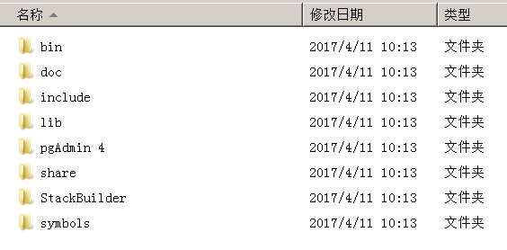
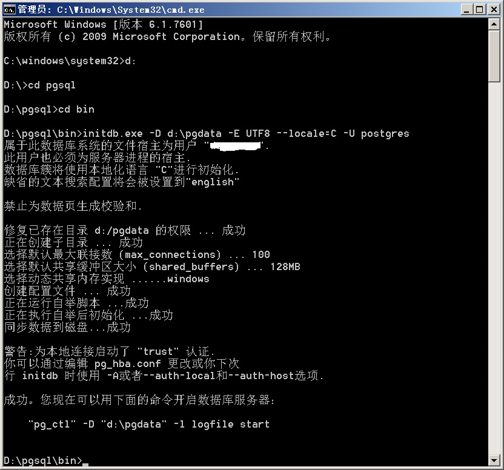
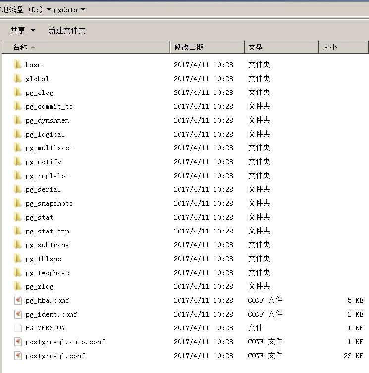
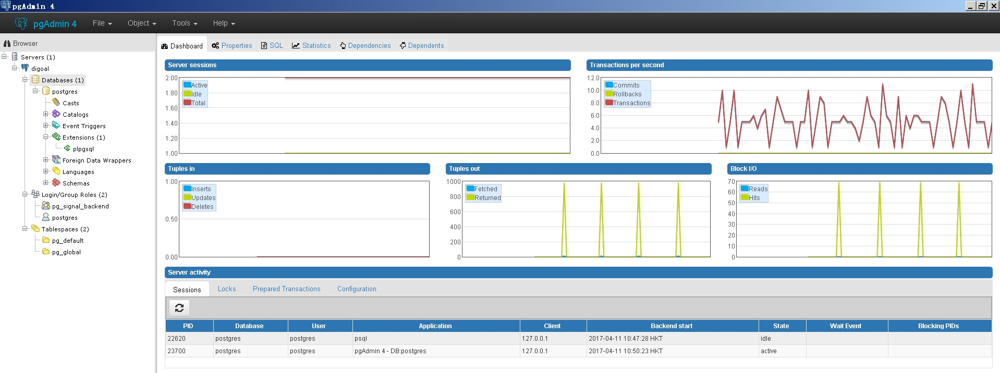
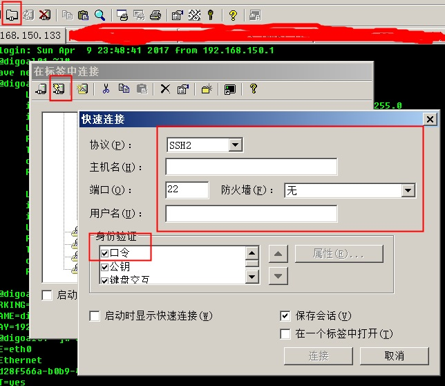

## 快速入门PostgreSQL应用开发与管理 - 1 如何搭建一套学习、开发PostgreSQL的环境  
##### [TAG 31](../class/31.md)
                                                        
### 作者                                                           
digoal                                                   
                                                    
### 日期                                                                                                                       
2017-04-11                                                 
                                                       
### 标签                                                    
PostgreSQL , Linux , Windows , pgadmin , 学习环境搭建    
                                                                                                                          
----                                                                                                                    
                                                                                                                             
## 背景     
万事开头难，搭建好一套学习、开发PostgreSQL的环境，是重中之重。  
  
因为其他平台(Ubuntu, CentOS, MAC)的用户大多数都具备了自行安装数据库的能力，在这里我只写一个面向Windows用户的学习环境搭建文档。  
  
分为三个部分，用户可以自由选择。  
  
如果你想深入的学习PostgreSQL，建议搭建PostgreSQL on Linux的环境。如果你只是想将数据库使用在日常的应用开发工作中，有也不需要PG的其他附加插件的功能，那么你可以选择PostgreSQL on Win的环境搭建。  
  
如果你不想搭建本地的PostgreSQL，那么你可以使用云数据库服务，比如阿里云RDS for PostgreSQL。  
  
## 本章大纲
## 一、PostgreSQL on Win环境搭建  
### 1 环境要求  
### 2 下载PostgreSQL安装包  
### 3 解压PostgreSQL安装包  
### 4 下载pgadmin安装包(可选)  
### 5 安装pgadmin(可选)  
### 6 规划数据文件目录  
### 7 初始化数据库集群  
### 8 配置postgresql.conf  
### 9 配置pg_hba.conf(可选)  
### 10 启动、停止数据库集群  
### 11 如何自动启动数据库集群  
### 12 使用psql 命令行连接数据库  
### 13 新增用户  
### 14 使用psql帮助  
### 15 使用psql语法补齐  
### 16 使用psql sql语法帮助  
### 17 查看当前配置  
### 18 设置会话参数  
### 19 在psql中切换到另一个用户或数据库  
### 20 使用pgadmin4连接数据库  
### 21 文档  
## 二、PostgreSQL on Linux(虚拟机)环境搭建  
### 1 环境要求  
### 2 下载Linux镜像  
### 3 安装VMware Workstation(试用版本)  
### 4 安装securecrt(试用版本)  
### 5 安装Linux虚拟机  
### 6 配置Linux虚拟机网络  
### 7 securecrt终端连接Linux  
### 8 配置linux  
### 9 配置yum仓库(可选)  
### 10 创建普通用户  
### 11 规划数据库存储目录  
### 12 下载PostgreSQL源码  
### 13 安装PostgreSQL  
### 14 配置linux用户环境变量  
### 15 初始化数据库集群  
### 16 配置数据库  
### 17 启动数据库集群  
### 18 连接数据库  
### 19 安装pgadmin(可选)  
### 20 配置pgadmin(可选)  
### 21 使用pgadmin连接数据库(可选)  
## 三、云数据库RDS for PostgreSQL  
### 1 购买云数据库  
### 2 设置并记住RDS for PostgreSQL数据库根用户名和密码  
### 3 配置网络  
### 4 配置白名单  
### 5 本地安装pgadmin(可选)  
### 6 本地配置pgadmin(可选)  
### 7 使用pgadmin连接RDS PostgreSQL数据库(可选)  
  
## 一、PostgreSQL on Win环境搭建  
### 1 环境要求  
Win 7 x64, 8GB以上内存, 4核以上, SSD硬盘(推荐)，100GB以上剩余空间, 可以访问公网(10MB/s以上网络带宽)  
  
### 2 下载PostgreSQL安装包  
https://www.postgresql.org/download/windows/  
  
建议下载高级安装包，不需要安装，直接使用。  
  
下载win x64的版本(建议下载最新版本)  
  
http://www.enterprisedb.com/products/pgbindownload.do  
  
例如  
  
https://get.enterprisedb.com/postgresql/postgresql-9.6.2-3-windows-x64-binaries.zip  
  
### 3 解压PostgreSQL安装包  
postgresql-9.6.2-3-windows-x64-binaries.zip  
  
例如解压到d:\pgsql  
  
  
  
bin: 二进制文件  
  
doc: 文档  
  
include: 头文件  
  
lib: 动态库  
  
pgAdmin 4: 图形化管理工具  
  
share: 扩展库  
  
StackBuilder: 打包库  
  
symbols: 符号表  
  
### 4 下载pgadmin安装包(可选)  
如果PostgreSQL包中没有包含pgAdmin，建议自行下载一个  
  
建议下载pgadmin4(pgadmin3不再维护)  
  
https://www.pgadmin.org/index.php  
  
https://www.postgresql.org/ftp/pgadmin3/pgadmin4/v1.3/windows/  
  
### 5 安装pgadmin(可选)  
  
### 6 规划数据文件目录  
例如将D盘的pgdata作为数据库目录。  
  
新建d:\pgdata空目录。  
  
### 7 初始化数据库集群  
以管理员身份打开cmd.exe  
  
  
  
```  
>d:  
  
>cd pgsql  
  
>cd bin  
  
>initdb.exe -D d:\pgdata -E UTF8 --locale=C -U postgres  
  
初始化时，指定数据库文件目录，字符集，本地化，数据库超级用户名  
```  
  
  
  
  
  
### 8 配置postgresql.conf  
数据库配置文件名字postgresql.conf，这个文件在数据文件目录D:\pgdata中。  
  
将以下内容追加到postgresql.conf文件末尾  
  
```  
listen_addresses = '0.0.0.0'  
port = 1921  
max_connections = 200  
tcp_keepalives_idle = 60  
tcp_keepalives_interval = 10  
tcp_keepalives_count = 6  
shared_buffers = 512MB  
maintenance_work_mem = 64MB  
dynamic_shared_memory_type = windows  
vacuum_cost_delay = 0  
bgwriter_delay = 10ms  
bgwriter_lru_maxpages = 1000  
bgwriter_lru_multiplier = 5.0  
bgwriter_flush_after = 0  
old_snapshot_threshold = -1  
wal_level = minimal  
synchronous_commit = off  
full_page_writes = on  
wal_buffers = 64MB  
wal_writer_delay = 10ms  
wal_writer_flush_after = 4MB  
checkpoint_timeout = 35min  
max_wal_size = 2GB  
min_wal_size = 80MB  
checkpoint_completion_target = 0.1  
checkpoint_flush_after = 0  
random_page_cost = 1.5  
log_destination = 'csvlog'  
logging_collector = on  
log_directory = 'pg_log'  
log_truncate_on_rotation = on  
log_checkpoints = on  
log_connections = on  
log_disconnections = on  
log_error_verbosity = verbose  
log_temp_files = 8192  
log_timezone = 'Asia/Hong_Kong'  
autovacuum = on  
log_autovacuum_min_duration = 0  
autovacuum_naptime = 20s  
autovacuum_vacuum_scale_factor = 0.05  
autovacuum_freeze_max_age = 1500000000  
autovacuum_multixact_freeze_max_age = 1600000000  
autovacuum_vacuum_cost_delay = 0  
vacuum_freeze_table_age = 1400000000  
vacuum_multixact_freeze_table_age = 1500000000  
datestyle = 'iso, mdy'  
timezone = 'Asia/Hong_Kong'  
lc_messages = 'C'  
lc_monetary = 'C'  
lc_numeric = 'C'  
lc_time = 'C'  
default_text_search_config = 'pg_catalog.english'  
```  
  
### 9 配置pg_hba.conf(可选)  
数据库防火墙文件名字pg_hba.conf，这个文件在数据文件目录D:\pgdata中。  
  
将以下内容追加到文件末尾，表示允许网络用户使用用户密码连接你的postgresql数据库.  
  
```  
host all all 0.0.0.0/0 md5  
```  
  
### 10 启动、停止数据库集群  
使用命令行启动数据库集群  
  
```  
>d:  
  
>cd pgsql  
  
>cd bin  
  
D:\pgsql\bin>pg_ctl.exe start -D d:\pgdata  
正在启动服务器进程  
  
D:\pgsql\bin>LOG:  00000: redirecting log output to logging collector process  
HINT:  Future log output will appear in directory "pg_log".  
LOCATION:  SysLogger_Start, syslogger.c:622  
```  
  
使用命令行停止数据库集群  
  
```
D:\pgsql\bin>pg_ctl.exe stop -m fast -D "d:\pgdata"
等待服务器进程关闭 .... 完成
服务器进程已经关闭
```
  
### 11 如何自动启动数据库集群  
配置windows自动启动服务.  
  
### 12 使用psql 命令行连接数据库  
psql -h IP地址 -p 端口 -U 用户名 数据库名  
  
```  
D:\pgsql\bin>psql -h 127.0.0.1 -p 1921 -U postgres postgres  
psql (9.6.2)  
输入 "help" 来获取帮助信息.  
  
postgres=# \dt  
```  
  
### 13 新增用户  
新建用户属于数据库操作，先使用psql和超级用户postgres连接到数据库。  
  
新增一个普通用户  
  
```  
postgres=# create role digoal login encrypted password 'pwd_digoal';  
CREATE ROLE  
```  
  
新增一个超级用户  
  
```  
postgres=# create role dba_digoal login superuser encrypted password 'dba_pwd_digoal';  
CREATE ROLE  
```  
  
新增一个流复制用户  
  
```  
postgres=# create role digoal_rep replication login encrypted password 'pwd';  
CREATE ROLE  
```  
  
你还可以将一个用户在不同角色之间切换  
  
例如将digoal设置为超级用户  
  
```  
postgres=# alter role digoal superuser;  
ALTER ROLE  
```  
  
查看已有用户  
  
```  
postgres=# \du+  
                                 角色列表  
  角色名称  |                    属性                    | 成员属于 | 描述  
------------+--------------------------------------------+----------+------  
 dba_digoal | 超级用户                                   | {}       |  
 digoal     | 超级用户                                   | {}       |  
 digoal_rep | 复制                                       | {}       |  
 postgres   | 超级用户, 建立角色, 建立 DB, 复制, 绕过RLS | {}       |  
```  
  
### 14 使用psql帮助  
psql有很多快捷的命令，使用\\?就可以查看。  
  
```  
postgres=# \?  
一般性  
  \copyright            显示PostgreSQL的使用和发行许可条款  
  \errverbose            以最冗长的形式显示最近的错误消息  
  \g [文件] or;     执行查询 (并把结果写入文件或 |管道)  
  \gexec                 执行策略，然后执行其结果中的每个值  
  \gset [PREFIX]     执行查询并把结果存到psql变量中  
  \q             退出 psql  
  \crosstabview [COLUMNS] 执行查询并且以交叉表显示结果  
  \watch [SEC]          每隔SEC秒执行一次查询  
  
帮助  
  \? [commands]          显示反斜线命令的帮助  
  
  ......  
  
```  
  
### 15 使用psql语法补齐  
如果你编译PostgreSQL使用了补齐选项，那么在psql中按TAB键，可以自动补齐命令。  
  
### 16 使用psql sql语法帮助  
如果你忘记了某个SQL的语法，使用\\h 命令即可打印命令的帮助  
  
例如  
  
```  
postgres=# \h create table  
命令：       CREATE TABLE  
描述：       建立新的数据表  
语法：  
CREATE [ [ GLOBAL | LOCAL ] { TEMPORARY | TEMP } | UNLOGGED ] TABLE [ IF NOT EXI  
STS ] 表名 ( [  
  { 列名称 数据_类型 [ COLLATE 校对规则 ] [ 列约束 [ ... ] ]  
    | 表约束  
    | LIKE 源表 [ like选项 ... ] }  
    [, ... ]  
] )  
  
......  
```  
  
### 17 查看当前配置  
show 参数名  
  
```  
postgres=# show client_encoding;  
 client_encoding  
-----------------  
 GBK  
(1 行记录)  
```  
  
查看pg_settings  
  
```  
postgres=# select * from pg_settings;  
```  
  
### 18 设置会话参数  
set 参数名=值;  
  
```  
postgres=# set client_encoding='sql_ascii';  
SET  
```  
  
### 19 在psql中切换到另一个用户或数据库  
\\c 切换到其他用户或数据库  
  
```  
postgres=# \c template1 digoal  
您现在已经连接到数据库 "template1",用户 "digoal".  
```  
  
### 20 使用pgadmin4连接数据库  
pgAdmin4被安装在这个目录  
  
```  
d:\pgsql\pgAdmin 4\bin  
```  
  
双击pgAdmin4.exe打开pgadmin4(有点耗时，自动启动HTTPD服务)  
  
点击server，右键，创建server.  
  
配置server别名，连接数据库的 IP，端口，用户，密码，数据库名  
  
  
  
### 21 文档  
PostgreSQL的安装包中包含了pgadmin, PostgreSQL的文档，找到对应的doc目录，打开index.html。  
  
## 二、PostgreSQL on Linux(虚拟机)环境搭建  
  
### 1 环境要求  
Win 7 x64, 8GB以上内存, 4核以上, SSD硬盘(推荐)，100GB以上剩余空间, 可以访问公网(10MB/s以上网络带宽)  
  
### 2 下载Linux镜像  
http://isoredirect.centos.org/centos/6/isos/x86_64/  
  
http://mirrors.163.com/centos/6.9/isos/x86_64/CentOS-6.9-x86_64-minimal.iso  
  
### 3 安装VMware Workstation(试用版本)  
http://www.vmware.com/cn/products/workstation/workstation-evaluation.html  
  
### 4 安装securecrt(试用版本)  
securecrt可以用来连接Linux终端，方便使用  
  
https://www.vandyke.com/products/securecrt/windows.html  
  
### 5 安装Linux虚拟机  
打开vmware, 创建虚拟机, 选择CentOS 6 x64版本.  
  
1\. 配置建议：  
  
4G内存，40G磁盘，2核以上，NAT网络模式。  
  
2\. 安装建议：  
  
minimal最小化安装。  
  
3\. root密码：  
  
记住你设置的root密码。  
  
4\. Linux安装配置建议  
  
配置主机名，配置网络（根据你的vmware NAT网络进行配置），关闭selinux，关闭防火墙或开放ssh端口(测试环境)。  
  
### 6 配置Linux虚拟机网络  
vmware窗口连接linux  
  
例子，192.168.150 请参考你的vmware NAT网络修改一下。   
  
配置网关  
  
```  
vi /etc/sysconfig/network  
  
NETWORKING=yes  
HOSTNAME=digoal01  
GATEWAY=192.168.150.2  
```  
  
配置IP  
  
```  
cat /etc/sysconfig/network-scripts/ifcfg-eth0   
  
DEVICE=eth0  
TYPE=Ethernet  
UUID=d28f566a-b0b9-4bde-95e7-20488af19eb6  
ONBOOT=yes  
NM_CONTROLLED=yes  
BOOTPROTO=static  
HWADDR=00:0C:29:5D:6D:9C  
IPADDR=192.168.150.133  
PREFIX=24  
GATEWAY=192.168.150.2  
DNS1=192.168.150.2  
DEFROUTE=yes  
IPV4_FAILURE_FATAL=yes  
IPV6INIT=no  
NAME="System eth0"  
```  
  
配置DNS  
  
```  
cat /etc/resolv.conf  
  
nameserver 192.168.150.2  
```  
  
重启网络服务  
  
```  
service network restart  
```  
  
### 7 securecrt终端连接Linux  
添加一个session，连接到Linux虚拟机。  
  
  
  
### 8 配置linux  
  
1\. /etc/sysctl.conf  
  
```  
vi /etc/sysctl.conf  
  
追加到文件末尾  
  
kernel.shmall = 4294967296  
kernel.shmmax=135497418752  
kernel.shmmni = 4096  
kernel.sem = 50100 64128000 50100 1280  
fs.file-max = 7672460  
fs.aio-max-nr = 1048576  
net.ipv4.ip_local_port_range = 9000 65000  
net.core.rmem_default = 262144  
net.core.rmem_max = 4194304  
net.core.wmem_default = 262144  
net.core.wmem_max = 4194304  
net.ipv4.tcp_max_syn_backlog = 4096  
net.core.netdev_max_backlog = 10000  
net.ipv4.netfilter.ip_conntrack_max = 655360  
net.ipv4.tcp_timestamps = 0  
net.ipv4.tcp_tw_recycle=1  
net.ipv4.tcp_timestamps=1  
net.ipv4.tcp_keepalive_time = 72   
net.ipv4.tcp_keepalive_probes = 9   
net.ipv4.tcp_keepalive_intvl = 7  
vm.zone_reclaim_mode=0  
vm.dirty_background_bytes = 40960000  
vm.dirty_ratio = 80  
vm.dirty_expire_centisecs = 6000  
vm.dirty_writeback_centisecs = 50  
vm.swappiness=0  
vm.overcommit_memory = 0  
vm.overcommit_ratio = 90  
```  
  
生效  
  
```  
sysctl -p  
```  
  
2\. /etc/security/limits.conf   
  
```  
vi /etc/security/limits.conf   
  
* soft    nofile  131072  
* hard    nofile  131072  
* soft    nproc   131072  
* hard    nproc   131072  
* soft    core    unlimited  
* hard    core    unlimited  
* soft    memlock 500000000  
* hard    memlock 500000000  
```  
  
3\. /etc/security/limits.d/*  
  
```  
rm -f /etc/security/limits.d/*  
```  
  
4\. 关闭selinux  
  
```  
# vi /etc/sysconfig/selinux   
  
SELINUX=disabled  
SELINUXTYPE=targeted  
```  
  
5\. 配置OS防火墙  
（建议按业务场景设置，我这里先清掉）       
    
```  
iptables -F  
```  
    
配置范例     
     
```  
# 私有网段  
-A INPUT -s 192.168.0.0/16 -j ACCEPT  
-A INPUT -s 10.0.0.0/8 -j ACCEPT  
-A INPUT -s 172.16.0.0/16 -j ACCEPT  
```  
  
重启linux。  
  
```  
reboot  
```  
  
### 9 配置yum仓库(可选)  
在linux虚拟机中，找一个有足够空间的分区，下载ISO镜像    
    
```  
wget http://mirrors.163.com/centos/6.9/isos/x86_64/CentOS-6.9-x86_64-bin-DVD1.iso  
  
wget http://mirrors.163.com/centos/6.9/isos/x86_64/CentOS-6.9-x86_64-bin-DVD2.iso  
```  
    
新建ISO挂载点目录    
    
```  
mkdir /mnt/cdrom1  
mkdir /mnt/cdrom2  
```  
    
挂载ISO    
    
```  
mount -o loop,defaults,ro /u01/CentOS-6.8-x86_64-bin-DVD1.iso /mnt/cdrom1  
mount -o loop,defaults,ro /u01/CentOS-6.8-x86_64-bin-DVD2.iso /mnt/cdrom2  
```  
  
备份并删除原有的YUM配置文件    
    
```  
mkdir /tmp/yum.bak  
cd /etc/yum.repos.d/  
mv * /tmp/yum.bak/  
```  
    
新增YUM配置文件    
    
```  
cd /etc/yum.repos.d/  
  
vi local.repo  
  
[local-yum]  
name=Local Repository  
baseurl=file:///mnt/cdrom1  
enabled=1  
gpgcheck=0  
```  
    
刷新YUM缓存    
    
```  
yum clean all  
```  
    
测试    
    
```  
yum list  
  
yum install createrepo   -- 方便后面测试  
```  
  
修改YUM配置，修改路径为上层目录    
    
```  
cd /etc/yum.repos.d/  
  
vi local.repo  
  
[local-yum]  
name=Local Repository  
baseurl=file:///mnt/  
enabled=1  
gpgcheck=0  
```  
    
创建YUM索引    
    
```  
cd /mnt/  
createrepo .  
```  
  
刷新YUM缓存，测试      
    
```  
yum clean all  
  
yum list  
  
yum install vim  
```  
  
### 10 创建普通用户  
  
```  
useradd digoal  
```  
  
### 11 规划数据库存储目录  
假设/home分区有足够的空间, /home/digoal/pgdata规划为数据文件目录  
  
```  
Filesystem      Size  Used Avail Use% Mounted on  
/dev/sda3        14G  5.7G  7.2G  45% /  
```  
  
### 12 下载PostgreSQL源码  
  
https://www.postgresql.org/ftp/source/  
  
```  
su - digoal  
  
wget https://ftp.postgresql.org/pub/source/v9.6.2/postgresql-9.6.2.tar.bz2  
```  
  
### 13 安装PostgreSQL  
安装依赖包  
  
```  
root用户下，使用yum 安装依赖包  
  
yum -y install coreutils glib2 lrzsz mpstat dstat sysstat e4fsprogs xfsprogs ntp readline-devel zlib-devel openssl-devel pam-devel libxml2-devel libxslt-devel python-devel tcl-devel gcc make smartmontools flex bison perl-devel perl-Ext  
Utils* openldap-devel jadetex  openjade bzip2  
```  
  
编译安装PostgreSQL  
  
```  
digoal用户下，编译安装PostgreSQL  
  
tar -jxvf postgresql-9.6.2.tar.bz2  
cd postgresql-9.6.2  
./configure --prefix=/home/digoal/pgsql9.6  
make world -j 8  
make install-world  
```  
  
### 14 配置linux用户环境变量  
digoal用户下，配置环境变量  
  
```  
su - digoal  
vi ~/.bash_profile  
  
追加  
  
export PS1="$USER@`/bin/hostname -s`-> "  
export PGPORT=1921  
export PGDATA=/home/digoal/pgdata  
export LANG=en_US.utf8  
export PGHOME=/home/digoal/pgsql9.6  
export LD_LIBRARY_PATH=$PGHOME/lib:/lib64:/usr/lib64:/usr/local/lib64:/lib:/usr/lib:/usr/local/lib:$LD_LIBRARY_PATH  
export PATH=$PGHOME/bin:$PATH:.  
export DATE=`date +"%Y%m%d%H%M"`  
export MANPATH=$PGHOME/share/man:$MANPATH  
export PGHOST=$PGDATA  
export PGUSER=postgres  
export PGDATABASE=postgres  
alias rm='rm -i'  
alias ll='ls -lh'  
unalias vi  
```  
  
重新登录digoal用户，配置生效  
  
```  
exit  
  
su - digoal  
```  
  
### 15 初始化数据库集群  
  
```  
initdb -D $PGDATA -E UTF8 --locale=C -U postgres  
```  
  
### 16 配置数据库  
配置文件在$PGDATA目录中  
  
1\. 配置postgresql.conf  
  
```  
追加  
  
listen_addresses = '0.0.0.0'  
port = 1921  
max_connections = 200  
unix_socket_directories = '.'  
tcp_keepalives_idle = 60  
tcp_keepalives_interval = 10  
tcp_keepalives_count = 10  
shared_buffers = 512MB  
dynamic_shared_memory_type = posix  
vacuum_cost_delay = 0  
bgwriter_delay = 10ms  
bgwriter_lru_maxpages = 1000  
bgwriter_lru_multiplier = 10.0  
bgwriter_flush_after = 0   
old_snapshot_threshold = -1  
backend_flush_after = 0   
wal_level = replica  
synchronous_commit = off  
full_page_writes = on  
wal_buffers = 16MB  
wal_writer_delay = 10ms  
wal_writer_flush_after = 0   
checkpoint_timeout = 30min   
max_wal_size = 2GB  
min_wal_size = 128MB  
checkpoint_completion_target = 0.05    
checkpoint_flush_after = 0    
random_page_cost = 1.3   
log_destination = 'csvlog'  
logging_collector = on  
log_truncate_on_rotation = on  
log_checkpoints = on  
log_connections = on  
log_disconnections = on  
log_error_verbosity = verbose  
autovacuum = on  
log_autovacuum_min_duration = 0  
autovacuum_naptime = 20s  
autovacuum_vacuum_scale_factor = 0.05  
autovacuum_freeze_max_age = 1500000000  
autovacuum_multixact_freeze_max_age = 1600000000  
autovacuum_vacuum_cost_delay = 0  
vacuum_freeze_table_age = 1400000000  
vacuum_multixact_freeze_table_age = 1500000000  
datestyle = 'iso, mdy'  
timezone = 'PRC'  
lc_messages = 'C'  
lc_monetary = 'C'  
lc_numeric = 'C'  
lc_time = 'C'  
default_text_search_config = 'pg_catalog.english'  
shared_preload_libraries='pg_stat_statements'  
```  
  
2\. 配置pg_hba.conf  
  
```  
追加  
  
host all all 0.0.0.0/0 md5  
```  
  
### 17 启动数据库集群  
  
```  
su - digoal  
  
pg_ctl start  
```  
  
### 18 连接数据库  
  
```  
su - digoal  
  
psql  
psql (9.6.2)  
Type "help" for help.  
  
postgres=#   
```  
  
### 19 安装pgadmin(可选)  
在windows 机器上，安装pgadmin  
  
https://www.pgadmin.org/download/windows4.php  
  
### 20 配置pgadmin(可选)  
  
参考章节1  
  
### 21 使用pgadmin连接数据库(可选)  
  
参考章节1  
  
## 三、云数据库RDS for PostgreSQL  
  
### 1 购买云数据库  
  
https://www.aliyun.com/product/rds/postgresql  
  
### 2 设置并记住RDS for PostgreSQL数据库根用户名和密码  
  
在RDS 控制台操作。  
  
### 3 配置网络  
  
在RDS 控制台操作，配置连接数据库的URL和端口。  
  
### 4 配置白名单  
  
在RDS 控制台操作，配置来源IP的白名单，如果来源IP为动态IP，白名单设置为0.0.0.0。  
  
(数据库开放公网连接有风险，请谨慎设置，本文仅为测试环境。)  
  
### 5 本地安装pgadmin(可选)  
在windows 机器上，安装pgadmin  
  
https://www.pgadmin.org/download/windows4.php  
  
### 6 本地配置pgadmin(可选)  
  
参考章节1  
  
### 7 使用pgadmin连接RDS PostgreSQL数据库(可选)  
  
参考章节1  
  
<a rel="nofollow" href="http://info.flagcounter.com/h9V1"  ></a>  
  
  
  
  
  
  
## [digoal's 大量PostgreSQL文章入口](https://github.com/digoal/blog/blob/master/README.md "22709685feb7cab07d30f30387f0a9ae")
  
