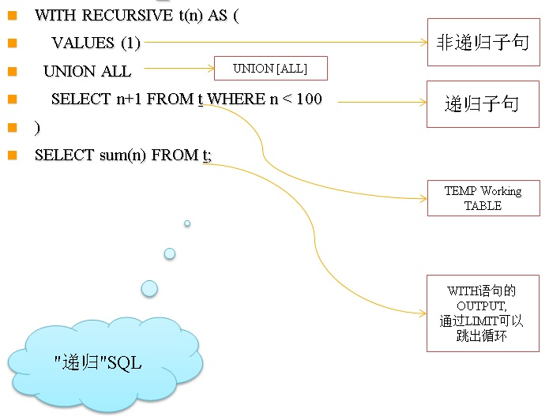
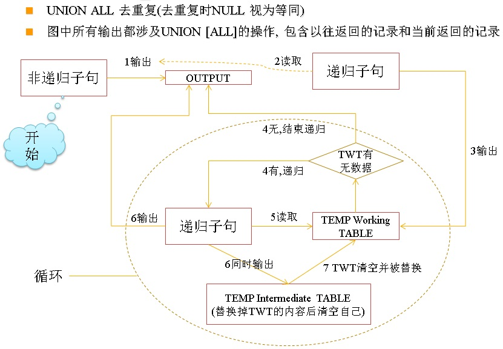
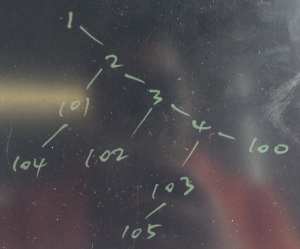

## 快速入门PostgreSQL应用开发与管理 - 3 访问数据  
##### [TAG 31](../class/31.md)
                                                          
### 作者                                                             
digoal                                                     
                                                      
### 日期                                                                                                                         
2017-04-11                                                   
                                                         
### 标签                                                      
PostgreSQL , Linux    
                                                                                                                            
----                                                                                                                      
                                                                                                                               
## 背景     
在线SQL平台  
  
http://www.sqlfiddle.com/  
  
## 本章大纲
### 1. 使用PSQL  
### 2. 使用Select语句  
### 3. 使用游标  
### 4. 行表达式  
### 5. with和递归查询  
### 6. 执行DML\DDL\DCL  
### 7. 选择行  
### 8. 使用序列  
### 9. 使用默认值  
### 10. 生成数据  
### 11. 检查空值（NULL）  
### 12. 时间和日期  
### 13. 多个表协同工作
  
## 第一章 : 访问数据  
### 1. 使用PSQL  
  
psql 是PostgreSQL软件包中的命令行工具，可以连接数据库，执行SQL。  
  
psql 详细用法参考  
  
```  
psql --help  
  
or  
  
man psql  
```  
  
psql的选项  
  
```  
psql --help  
psql is the PostgreSQL interactive terminal.  
  
Usage:  
  psql [OPTION]... [DBNAME [USERNAME]]  
  
General options:  
  -c, --command=COMMAND    run only single command (SQL or internal) and exit  
  -d, --dbname=DBNAME      database name to connect to (default: "postgres")  
  -f, --file=FILENAME      execute commands from file, then exit  
  -l, --list               list available databases, then exit  
  -v, --set=, --variable=NAME=VALUE  
                           set psql variable NAME to VALUE  
                           (e.g., -v ON_ERROR_STOP=1)  
  -V, --version            output version information, then exit  
  -X, --no-psqlrc          do not read startup file (~/.psqlrc)  
  -1 ("one"), --single-transaction  
                           execute as a single transaction (if non-interactive)  
  -?, --help[=options]     show this help, then exit  
      --help=commands      list backslash commands, then exit  
      --help=variables     list special variables, then exit  
  
Input and output options:  
  -a, --echo-all           echo all input from script  
  -b, --echo-errors        echo failed commands  
  -e, --echo-queries       echo commands sent to server  
  -E, --echo-hidden        display queries that internal commands generate  
  -L, --log-file=FILENAME  send session log to file  
  -n, --no-readline        disable enhanced command line editing (readline)  
  -o, --output=FILENAME    send query results to file (or |pipe)  
  -q, --quiet              run quietly (no messages, only query output)  
  -s, --single-step        single-step mode (confirm each query)  
  -S, --single-line        single-line mode (end of line terminates SQL command)  
  
Output format options:  
  -A, --no-align           unaligned table output mode  
  -F, --field-separator=STRING  
                           field separator for unaligned output (default: "|")  
  -H, --html               HTML table output mode  
  -P, --pset=VAR[=ARG]     set printing option VAR to ARG (see \pset command)  
  -R, --record-separator=STRING  
                           record separator for unaligned output (default: newline)  
  -t, --tuples-only        print rows only  
  -T, --table-attr=TEXT    set HTML table tag attributes (e.g., width, border)  
  -x, --expanded           turn on expanded table output  
  -z, --field-separator-zero  
                           set field separator for unaligned output to zero byte  
  -0, --record-separator-zero  
                           set record separator for unaligned output to zero byte  
  
Connection options:  
  -h, --host=HOSTNAME      database server host or socket directory (default: "127.0.0.1")  
  -p, --port=PORT          database server port (default: "1921")  
  -U, --username=USERNAME  database user name (default: "postgres")  
  -w, --no-password        never prompt for password  
  -W, --password           force password prompt (should happen automatically)  
  
For more information, type "\?" (for internal commands) or "\help" (for SQL  
commands) from within psql, or consult the psql section in the PostgreSQL  
documentation.  
  
Report bugs to <pgsql-bugs@postgresql.org>.  
```  
  
使用psql连接数据库例子  
  
```  
psql -h 127.0.0.1 -p 1921 -U postgres -d postgres  
psql (9.6.1)  
Type "help" for help.  
  
postgres=#   
```  
  
### 2. 使用Select语句  
psql 支持输出帮助文档，例如select 子句的语法  
  
```  
postgres=# \h select  
Command:     SELECT  
Description: retrieve rows from a table or view  
Syntax:  
[ WITH [ RECURSIVE ] with_query [, ...] ]  
SELECT [ ALL | DISTINCT [ ON ( expression [, ...] ) ] ]  
    [ * | expression [ [ AS ] output_name ] [, ...] ]  
    [ FROM from_item [, ...] ]  
    [ WHERE condition ]  
    [ GROUP BY grouping_element [, ...] ]  
    [ HAVING condition [, ...] ]  
    [ WINDOW window_name AS ( window_definition ) [, ...] ]  
    [ { UNION | INTERSECT | EXCEPT } [ ALL | DISTINCT ] select ]  
    [ ORDER BY expression [ ASC | DESC | USING operator ] [ NULLS { FIRST | LAST } ] [, ...] ]  
    [ LIMIT { count | ALL } ]  
    [ OFFSET start [ ROW | ROWS ] ]  
    [ FETCH { FIRST | NEXT } [ count ] { ROW | ROWS } ONLY ]  
    [ FOR { UPDATE | NO KEY UPDATE | SHARE | KEY SHARE } [ OF table_name [, ...] ] [ NOWAIT | SKIP LOCKED ] [...] ]  
  
where from_item can be one of:  
  
    [ ONLY ] table_name [ * ] [ [ AS ] alias [ ( column_alias [, ...] ) ] ]  
                [ TABLESAMPLE sampling_method ( argument [, ...] ) [ REPEATABLE ( seed ) ] ]  
    [ LATERAL ] ( select ) [ AS ] alias [ ( column_alias [, ...] ) ]  
    with_query_name [ [ AS ] alias [ ( column_alias [, ...] ) ] ]  
    [ LATERAL ] function_name ( [ argument [, ...] ] )  
                [ WITH ORDINALITY ] [ [ AS ] alias [ ( column_alias [, ...] ) ] ]  
    [ LATERAL ] function_name ( [ argument [, ...] ] ) [ AS ] alias ( column_definition [, ...] )  
    [ LATERAL ] function_name ( [ argument [, ...] ] ) AS ( column_definition [, ...] )  
    [ LATERAL ] ROWS FROM( function_name ( [ argument [, ...] ] ) [ AS ( column_definition [, ...] ) ] [, ...] )  
                [ WITH ORDINALITY ] [ [ AS ] alias [ ( column_alias [, ...] ) ] ]  
    from_item [ NATURAL ] join_type from_item [ ON join_condition | USING ( join_column [, ...] ) ]  
  
and grouping_element can be one of:  
  
    ( )  
    expression  
    ( expression [, ...] )  
    ROLLUP ( { expression | ( expression [, ...] ) } [, ...] )  
    CUBE ( { expression | ( expression [, ...] ) } [, ...] )  
    GROUPING SETS ( grouping_element [, ...] )  
  
and with_query is:  
  
    with_query_name [ ( column_name [, ...] ) ] AS ( select | values | insert | update | delete )  
  
TABLE [ ONLY ] table_name [ * ]  
```  
  
目标、源 别名  
  
```  
postgres=# select 'nihao' as col_alias -- 列别名  
           from pg_class as t 源别名  
           limit 1;  
 col_alias   
-----------  
 nihao  
(1 row)  
```  
  
select 目标  
  
字段、函数、表达式、子查询  
  
```  
postgres=# select relname, -- 列名  
                  now(), -- 函数  
                  upper(relname)||'__digoal',   -- 表达式  
                  (select 1+2+3)  -- 子查询  
                  from pg_class limit 2;   
     relname     |              now              |        ?column?         | ?column?   
-----------------+-------------------------------+-------------------------+----------  
 pg_type         | 2017-04-11 15:09:45.440779+08 | PG_TYPE__digoal         |        6  
 pg_toast_187550 | 2017-04-11 15:09:45.440779+08 | PG_TOAST_187550__digoal |        6  
(2 rows)  
```  
  
select 源  
  
表、视图、物化视图、函数、表达式、子查询  
  
```  
select * from pg_class;  
  
select * from 视图;  
  
select * from 物化视图;  
  
select * from 函数(参数);  -- 如果函数返回的是record，需要格式化  
  
select * from 函数(参数) as t(列1 类型1, ... ,列n 类型n);  -- 如果函数返回的是record，需要格式化  
  
select 函数(参数);  
  
select 函数(参数) as t(列1 类型1, ... ,列n 类型n);  
  
select 表达式;  
  
select (子查询) as t;  
```  
  
select where条件  
  
```  
postgres=# select relname,reltuples from pg_class where relname='pg_class';  
 relname  | reltuples   
----------+-----------  
 pg_class |       360  
(1 row)  
```  
  
select 排序  
  
```  
postgres=# select oid,relname from pg_class order by oid limit 1;  
 oid |              relname                
-----+-----------------------------------  
 112 | pg_foreign_data_wrapper_oid_index  
(1 row)  
```  
  
select 随机排序  
  
```  
postgres=# select oid,relname from pg_class order by random() limit 1;  
  oid  |  relname    
-------+-----------  
 13124 | sql_parts  
(1 row)  
```  
  
select 分组  
  
```  
postgres=# select relkind,count(*) from pg_class group by relkind;  
 relkind | count   
---------+-------  
 f       |     1  
 c       |     2  
 t       |    28  
 S       |     3  
 i       |   149  
 r       |    80  
 v       |   115  
(7 rows)  
```  
  
select 限制输出条数  
  
```  
postgres=# select relkind,count(*) from pg_class group by relkind limit 1;  
 relkind | count   
---------+-------  
 f       |     1  
(1 row)  
```  
  
select 位移  
  
```  
postgres=# select relkind,count(*) from pg_class group by relkind order by relkind offset 1 limit 1;  
 relkind | count   
---------+-------  
 c       |     2  
(1 row)  
```  
  
select 当前表以及所有继承表  
  
```  
postgres=# create table p(id int, info text, crt_time timestamp);  
CREATE TABLE  
postgres=# create table c1(id int, info text, crt_time timestamp) inherits(p);  
NOTICE:  merging column "id" with inherited definition  
NOTICE:  merging column "info" with inherited definition  
NOTICE:  merging column "crt_time" with inherited definition  
CREATE TABLE  
postgres=# create table c2(id int, info text, crt_time timestamp) inherits(p);  
NOTICE:  merging column "id" with inherited definition  
NOTICE:  merging column "info" with inherited definition  
NOTICE:  merging column "crt_time" with inherited definition  
CREATE TABLE  
postgres=# create table cc1(id int, info text, crt_time timestamp) inherits(c1);  
NOTICE:  merging column "id" with inherited definition  
NOTICE:  merging column "info" with inherited definition  
NOTICE:  merging column "crt_time" with inherited definition  
CREATE TABLE  
postgres=# insert into p values (1,'p',now());  
INSERT 0 1  
postgres=# insert into c1 values (1,'c1',now());  
INSERT 0 1  
postgres=# insert into c2 values (1,'c2',now());  
INSERT 0 1  
postgres=# insert into cc1 values (1,'cc1',now());  
INSERT 0 1  
postgres=# select * from p;  
 id | info |          crt_time            
----+------+----------------------------  
  1 | p    | 2017-04-11 15:37:01.157824  
  1 | c1   | 2017-04-11 15:37:05.635794  
  1 | c2   | 2017-04-11 15:37:11.271823  
  1 | cc1  | 2017-04-11 15:37:16.177828  
(4 rows)  
  
postgres=# select tableoid::regclass,* from p;  
 tableoid | id | info |          crt_time            
----------+----+------+----------------------------  
 p        |  1 | p    | 2017-04-11 15:37:01.157824  
 c1       |  1 | c1   | 2017-04-11 15:37:05.635794  
 c2       |  1 | c2   | 2017-04-11 15:37:11.271823  
 cc1      |  1 | cc1  | 2017-04-11 15:37:16.177828  
(4 rows)  
```  
  
select 当前表  
  
```  
postgres=# select tableoid::regclass,* from  only p;  
 tableoid | id | info |          crt_time            
----------+----+------+----------------------------  
 p        |  1 | p    | 2017-04-11 15:37:01.157824  
(1 row)  
  
postgres=# select tableoid::regclass,* from  only c1;  
 tableoid | id | info |          crt_time            
----------+----+------+----------------------------  
 c1       |  1 | c1   | 2017-04-11 15:37:05.635794  
(1 row)  
```  
    
### 3. 使用游标  
创建游标  
  
```  
postgres=# begin;  
BEGIN  
postgres=# \h declare  
Command:     DECLARE  
Description: define a cursor  
Syntax:  
DECLARE name [ BINARY ] [ INSENSITIVE ] [ [ NO ] SCROLL ]  
    CURSOR [ { WITH | WITHOUT } HOLD ] FOR query  
  
postgres=# declare cur1 cursor for select oid,relname,relkind from pg_class;  
DECLARE CURSOR  
```  
  
fetch 游标  
  
```  
postgres=# \h fetch  
Command:     FETCH  
Description: retrieve rows from a query using a cursor  
Syntax:  
FETCH [ direction [ FROM | IN ] ] cursor_name  
  
where direction can be empty or one of:  
  
    NEXT  
    PRIOR  
    FIRST  
    LAST  
    ABSOLUTE count  
    RELATIVE count  
    count  
    ALL  
    FORWARD  
    FORWARD count  
    FORWARD ALL  
    BACKWARD  
    BACKWARD count  
    BACKWARD ALL  
  
postgres=# fetch 2 from cur1;  
  oid   |     relname     | relkind   
--------+-----------------+---------  
   1247 | pg_type         | r  
 187553 | pg_toast_187550 | t  
(2 rows)  
```  
  
关闭游标  
  
```  
postgres=# \h close  
Command:     CLOSE  
Description: close a cursor  
Syntax:  
CLOSE { name | ALL }  
  
postgres=# close cur1;  
CLOSE CURSOR  
```  
  
### 4. 行表达式  
行表达式  
  
```  
postgres=# select * from (values(1,'test1'),(2,'test2'),(3,'test3')) as t(id, info);  
 id | info    
----+-------  
  1 | test1  
  2 | test2  
  3 | test3  
(3 rows)  
```  
  
### 5. with和递归查询  
with语句  
  
```  
postgres=# with   
a as (select * from (values(1,'test1'),(2,'test2'),(3,'test3')) as t(id, info)),  
b as (select oid,relname,relkind from pg_class)   
select a.*,b.* from a,b where a.id=mod(b.oid::int,3)+1;  
  
 id | info  |  oid   |                    relname                    | relkind   
----+-------+--------+-----------------------------------------------+---------  
  3 | test3 |   1247 | pg_type                                       | r  
  3 | test3 | 187553 | pg_toast_187550                               | t  
  3 | test3 | 186725 | new_type                                      | c  
  2 | test2 | 187555 | pg_toast_187550_index                         | i  
  3 | test3 | 187550 | test                                          | r  
  3 | test3 | 187559 | pg_toast_187556                               | t  
  2 | test2 | 187561 | pg_toast_187556_index                         | i  
```  
  
递归语句  
  
   
  
  
  
例子  
  
  
  
```  
postgres=# with recursive a as (select * from (values (1,2),(2,3),(3,4),(4,100),(2,101),(101,104),(3,102),(4,103),(103,105)) as t(id1,id2)),   
tmp as (  
select * from a where id2=105  
union all  
select a.* from a join tmp on (a.id2=tmp.id1)  
)  
select * from tmp;  
 id1 | id2   
-----+-----  
 103 | 105  
   4 | 103  
   3 |   4  
   2 |   3  
   1 |   2  
(5 rows)  
```  
  
### 6. 执行DML\DDL\DCL  
  
插入  
  
```  
postgres=# create table tbl1(id int, info text, crt_time timestamp);  
CREATE TABLE  
postgres=# insert into tbl1 (id,info,crt_time) values (1,'test',now());  
INSERT 0 1  
postgres=# select * from tbl1;  
 id | info |          crt_time            
----+------+----------------------------  
  1 | test | 2017-04-11 15:30:38.810826  
(1 row)  
```  
  
批量插入1  
  
```  
postgres=# insert into tbl1 (id, info ,crt_time) select generate_series(1,10000),'test',now();  
INSERT 0 10000  
postgres=# select count(*) from tbl1;  
 count   
-------  
 10001  
(1 row)  
```  
  
批量插入2  
  
```  
postgres=# insert into tbl1 (id,info,crt_time) values (1,'test',now()), (2,'test2',now()), (3,'test3',now());  
INSERT 0 3  
```  
  
批量插入3  
  
```  
postgres=# begin;  
BEGIN  
postgres=# insert into tbl1 (id,info,crt_time) values (1,'test',now());  
INSERT 0 1  
postgres=# insert into tbl1 (id,info,crt_time) values (2,'test2',now());  
INSERT 0 1  
postgres=# insert into tbl1 (id,info,crt_time) values (3,'test3',now());  
INSERT 0 1  
postgres=# end;  
COMMIT  
```  
  
更新  
  
```  
postgres=# update tbl1 set info='new value' where id=1;  
UPDATE 4  
```  
  
有则更新、无则插入  
  
```  
postgres=# create table tbl2(id int primary key, info text, crt_time timestamp);  
CREATE TABLE  
postgres=# insert into tbl2 select generate_series(1,1000),'test',now() on conflict  (id) do update set info=excluded.info, crt_time=excluded.crt_time;  
INSERT 0 1000  
postgres=# insert into tbl2 select generate_series(1,1000),'test',now() on conflict  (id) do update set info=excluded.info, crt_time=excluded.crt_time;  
INSERT 0 1000  
postgres=# insert into tbl2 select generate_series(1,1000),'test',now() on conflict  (id) do nothing;  
INSERT 0 0  
```  
  
删除数据  
  
```  
postgres=# delete from tbl1 where id=1;  
DELETE 4  
```  
  
批量更新  
  
```
update target_table set c2 = t.c2 from (values(1,1),(2,2),(3,3)...(2000,2000)) as t(c1,c2) where target_table.c1=t.c1;
```
  
批量删除  
  
```
delete from target_table using (values(1,1),(2,2),(3,3)...(2000,2000)) as t(c1,c2) where target_table.c1 = t.c1;
```
  
truncate(如果要清除全表，建议使用truncate)  
  
注意，请使用DDL锁超时，如果有继承表，并且只想清理当前表，使用ONLY.  
  
建议所有的DDL操作前，都设置锁超时，避免堵塞其他操作。  
  
```  
postgres=# \h truncate  
Command:     TRUNCATE  
Description: empty a table or set of tables  
Syntax:  
TRUNCATE [ TABLE ] [ ONLY ] name [ * ] [, ... ]  
    [ RESTART IDENTITY | CONTINUE IDENTITY ] [ CASCADE | RESTRICT ]  
  
postgres=# set lock_timeout = '1s';  -- 设置锁超时  
SET  
postgres=# truncate only tbl1;  -- 清理当前表（不清理继承表）  
TRUNCATE TABLE  
```  
  
drop表  
  
drop表时，如果有依赖对象，想一同删除，可以使用cascade关键字  
  
```  
postgres=# drop table p;  
ERROR:  cannot drop table p because other objects depend on it  
DETAIL:  table c1 depends on table p  
table cc1 depends on table c1  
table c2 depends on table p  
HINT:  Use DROP ... CASCADE to drop the dependent objects too.  
postgres=# drop table p cascade;  
NOTICE:  drop cascades to 3 other objects  
DETAIL:  drop cascades to table c1  
drop cascades to table cc1  
drop cascades to table c2  
DROP TABLE  
```  
  
alter table修改表  
  
例如添加字段  
  
```  
postgres=# alter table tbl1 add column c1 int;  
ALTER TABLE  
```  
  
添加字段，并添加默认值（会rewrite table, 不建议对大表这么操作，会很久。大表增加字段和默认值，建议先增加自动，默认值可以异步小批量的UPDATE）  
  
```  
postgres=# alter table tbl1 add column c2 int default 100;  
ALTER TABLE  
```  
  
转换兼容类型  
  
```  
postgres=# alter table tbl1 alter column c2 type int2;  
ALTER TABLE  
```  
  
转换不兼容类型  
  
```  
postgres=# create table tbl2(id int, info text, crt_time timestamp);  
CREATE TABLE  
postgres=# insert into tbl2 values (1,'1', now());  
INSERT 0 1  
postgres=# insert into tbl2 values (2,'2a', now());  
INSERT 0 1  
  
postgres=# select to_number(info,'9999999999999999999') from tbl2;  
 to_number   
-----------  
         1  
         2  
(2 rows)  
  
postgres=# alter table tbl2 alter column info type int using to_number(info,'9999999999999999999');  
ALTER TABLE  
```  
  
psql服务端COPY(文件读写在数据库所在服务器)  
  
```  
postgres=# \h copy  
Command:     COPY  
Description: copy data between a file and a table  
Syntax:  
COPY table_name [ ( column_name [, ...] ) ]  
    FROM { 'filename' | PROGRAM 'command' | STDIN }  
    [ [ WITH ] ( option [, ...] ) ]  
  
COPY { table_name [ ( column_name [, ...] ) ] | ( query ) }  
    TO { 'filename' | PROGRAM 'command' | STDOUT }  
    [ [ WITH ] ( option [, ...] ) ]  
  
where option can be one of:  
  
    FORMAT format_name  
    OIDS [ boolean ]  
    FREEZE [ boolean ]  
    DELIMITER 'delimiter_character'  
    NULL 'null_string'  
    HEADER [ boolean ]  
    QUOTE 'quote_character'  
    ESCAPE 'escape_character'  
    FORCE_QUOTE { ( column_name [, ...] ) | * }  
    FORCE_NOT_NULL ( column_name [, ...] )  
    FORCE_NULL ( column_name [, ...] )  
    ENCODING 'encoding_name'  
```  
  
COPY out  
  
```  
postgres=# copy tbl2 to '/tmp/test.csv';  
COPY 2  
```  
  
COPY in  
  
```  
postgres=# copy tbl2 from '/tmp/test.csv';  
COPY 2  
```  
  
psql客户端COPY(文件读写在客户端)  
  
COPY in  
  
```  
 cat /tmp/test.csv | psql -h 127.0.0.1 -p 1921 -U postgres -d postgres -c "copy tbl2 from stdin"  
COPY 2  
```  
  
COPY out  
  
```  
psql -h 127.0.0.1 -p 1921 -U postgres -d postgres -c "copy tbl2 to stdout" > /tmp/test.csv  
  
cat /tmp/test.csv  
1       1       2017-04-11 15:48:39.728835  
2       2       2017-04-11 15:48:44.370834  
1       1       2017-04-11 15:48:39.728835  
2       2       2017-04-11 15:48:44.370834  
1       1       2017-04-11 15:48:39.728835  
2       2       2017-04-11 15:48:44.370834  
```  
  
软件开发时请使用程序语言对应的驱动接口。  
  
### 7. 选择行  
  
where子句过滤条件  
  
```  
postgres=# select tableoid::regclass,xmin,xmax,cmin,cmax,ctid,relname from pg_class where relname='pg_type';  
 tableoid |   xmin   | xmax | cmin | cmax | ctid  | relname   
----------+----------+------+------+------+-------+---------  
 pg_class | 94858157 |    0 |    1 |    1 | (0,3) | pg_type  
(1 row)  
```  
  
隐藏字段(表oid, 插入事务号, 删除事务号, 事务命令偏移值, 行号)  
  
```  
postgres=# select tableoid::regclass,xmin,xmax,cmin,cmax,ctid,relname from pg_class limit 10;  
 tableoid |   xmin   | xmax | cmin | cmax |  ctid  |        relname          
----------+----------+------+------+------+--------+-----------------------  
 pg_class | 94858157 |    0 |    1 |    1 | (0,3)  | pg_type  
 pg_class | 94858326 |    0 |    1 |    1 | (0,4)  | pg_toast_187550  
 pg_class | 94858205 |    0 |  232 |  232 | (0,5)  | new_type  
 pg_class | 94858326 |    0 |    2 |    2 | (0,6)  | pg_toast_187550_index  
 pg_class | 94858326 |    0 |    4 |    4 | (0,7)  | test  
 pg_class | 95516401 |    0 |    1 |    1 | (0,9)  | pg_toast_187556  
 pg_class | 95516401 |    0 |    2 |    2 | (0,10) | pg_toast_187556_index  
 pg_class | 95516401 |    0 |    4 |    4 | (0,11) | tblaccount4  
 pg_class |     1726 |    0 |    2 |    2 | (0,20) | hints_id_seq  
 pg_class |     1726 |    0 |    5 |    5 | (0,22) | pg_toast_17134  
(10 rows)  
```  
  
### 8. 使用序列  
PostgreSQL允许创建多个序列，每个序列独立自主，有自己的取值空间。  
  
序列一旦消耗掉，就无法回退，除非设置它。  
  
序列通常用来表示唯一自增值。  
  
创建序列  
  
```  
postgres=# \h create sequence  
Command:     CREATE SEQUENCE  
Description: define a new sequence generator  
Syntax:  
CREATE [ TEMPORARY | TEMP ] SEQUENCE [ IF NOT EXISTS ] name [ INCREMENT [ BY ] increment ]  
    [ MINVALUE minvalue | NO MINVALUE ] [ MAXVALUE maxvalue | NO MAXVALUE ]  
    [ START [ WITH ] start ] [ CACHE cache ] [ [ NO ] CYCLE ]  
    [ OWNED BY { table_name.column_name | NONE } ]  
  
postgres=# create sequence seq;  
CREATE SEQUENCE  
```  
  
获取序列值  
  
```  
postgres=# select nextval('seq'::regclass);  
 nextval   
---------  
       1  
(1 row)  
  
postgres=# select nextval('seq'::regclass);  
 nextval   
---------  
       2  
(1 row)  
```  
  
读取序列当前状态  
  
```  
postgres=# select * from seq;  
 sequence_name | last_value | start_value | increment_by |      max_value      | min_value | cache_value | log_cnt | is_cycled | is_called   
---------------+------------+-------------+--------------+---------------------+-----------+-------------+---------+-----------+-----------  
 seq           |          2 |           1 |            1 | 9223372036854775807 |         1 |           1 |      31 | f         | t  
(1 row)  
```  
  
读取当前会话，上一次获取的序列值  
  
```  
postgres=# select * from currval('seq'::regclass);  
 currval   
---------  
       2  
(1 row)  
```  
  
设置序列起始值  
  
```  
postgres=# \h alter sequence  
Command:     ALTER SEQUENCE  
Description: change the definition of a sequence generator  
Syntax:  
ALTER SEQUENCE [ IF EXISTS ] name [ INCREMENT [ BY ] increment ]  
    [ MINVALUE minvalue | NO MINVALUE ] [ MAXVALUE maxvalue | NO MAXVALUE ]  
    [ START [ WITH ] start ]  
    [ RESTART [ [ WITH ] restart ] ]  
    [ CACHE cache ] [ [ NO ] CYCLE ]  
    [ OWNED BY { table_name.column_name | NONE } ]  
  
postgres=# alter sequence seq restart with 1;  
ALTER SEQUENCE  
postgres=# select nextval('seq'::regclass);  
 nextval   
---------  
       1  
(1 row)  
```  
  
设置序列是否轮回  
  
```  
postgres=# alter sequence seq cycle;  
ALTER SEQUENCE  
```  
  
设置序列的cache值，提升性能，每个会话，一次会获取一个CACHE的VALUE。  
  
```  
postgres=# alter sequence seq cache 10000;  
ALTER SEQUENCE  
```  
  
设置序列的步调  
  
```  
postgres=# alter sequence seq increment by 99;  
ALTER SEQUENCE  
postgres=# select nextval('seq'::regclass);  
 nextval   
---------  
     100  
(1 row)  
  
postgres=# select nextval('seq'::regclass);  
 nextval   
---------  
     199  
(1 row)  
```  
  
修改序列的nextval(与restart效果一样)  
  
```  
postgres=# select setval('seq'::regclass, 1);  
 setval   
--------  
      1  
(1 row)  
  
postgres=# select nextval('seq'::regclass);  
 nextval   
---------  
     100  
(1 row)  
  
postgres=# select nextval('seq'::regclass);  
 nextval   
---------  
     199  
(1 row)  
```  
  
serial2,serial4,serial8类型  
  
这三个类型，对应int2,int4,int8，同时会自动创建序列，并将默认值设置为序列值。  
  
```  
postgres=# create table tbl3(id serial2);  
CREATE TABLE  
postgres=# \d+ tbl3  
                                             Table "public.tbl3"  
 Column |   Type   |                     Modifiers                     | Storage | Stats target | Description   
--------+----------+---------------------------------------------------+---------+--------------+-------------  
 id     | smallint | not null default nextval('tbl3_id_seq'::regclass) | plain   |              |   
```  
  
### 9. 使用默认值  
  
```  
postgres=# create table tbl4(id int, info text, crt_time timestamp default now());  
CREATE TABLE  
  
postgres=# insert into tbl4 (id, info) values (1,'test');  
INSERT 0 1  
postgres=# select * from tbl4;  
 id | info |          crt_time            
----+------+----------------------------  
  1 | test | 2017-04-11 16:08:12.232796  
(1 row)  
```  
  
### 10. 生成数据  
PostgreSQL 的函数支持返回多条记录，使用这种方法可以很方便的生成测试数据。  
  
```  
postgres=# \df generate_series  
                                                               List of functions  
   Schema   |      Name       |         Result data type          |                        Argument data types                         |  Type    
------------+-----------------+-----------------------------------+--------------------------------------------------------------------+--------  
 pg_catalog | generate_series | SETOF bigint                      | bigint, bigint                                                     | normal  
 pg_catalog | generate_series | SETOF bigint                      | bigint, bigint, bigint                                             | normal  
 pg_catalog | generate_series | SETOF integer                     | integer, integer                                                   | normal  
 pg_catalog | generate_series | SETOF integer                     | integer, integer, integer                                          | normal  
 pg_catalog | generate_series | SETOF numeric                     | numeric, numeric                                                   | normal  
 pg_catalog | generate_series | SETOF numeric                     | numeric, numeric, numeric                                          | normal  
 pg_catalog | generate_series | SETOF timestamp with time zone    | timestamp with time zone, timestamp with time zone, interval       | normal  
 pg_catalog | generate_series | SETOF timestamp without time zone | timestamp without time zone, timestamp without time zone, interval | normal  
(8 rows)  
```  
  
插入1万条测试数据  
  
```  
postgres=# create table tbl5(id int, info text, crt_time timestamp);  
CREATE TABLE  
postgres=# insert into tbl5 select id, md5(random()::text), clock_timestamp() from generate_series(1,10000) t(id);  
INSERT 0 10000  
postgres=# select * from tbl5 limit 10;  
 id |               info               |          crt_time            
----+----------------------------------+----------------------------  
  1 | 1b9e90de0b1236339503a9a79b13dd55 | 2017-04-11 16:11:07.106191  
  2 | c43a151d1a7df9d587488ca5ac4df7c3 | 2017-04-11 16:11:07.106326  
  3 | 789ec7d6feb1cdac55f252cc17ef8bf1 | 2017-04-11 16:11:07.106335  
  4 | 1c229df1e6b2aa344bee239b91b9c1af | 2017-04-11 16:11:07.10634  
  5 | 88d95fc422a28361292201dc7f648a54 | 2017-04-11 16:11:07.106345  
  6 | 3f8f88d9a69fdd92062a8bd9e49e5a6a | 2017-04-11 16:11:07.10635  
  7 | b66c5c9b46eef16e28e9d909442cb675 | 2017-04-11 16:11:07.106355  
  8 | 2a28d6a7b760821d826d6fc4891fa167 | 2017-04-11 16:11:07.106361  
  9 | 3fd0ec10c7068b83646b1920e4f97319 | 2017-04-11 16:11:07.106366  
 10 | d0544855ee8f926c5e5ee821e3932344 | 2017-04-11 16:11:07.106371  
(10 rows)  
```  
  
其他生产数据的方法  
  
pgbench 压测生成tpc-B测试数据  
  
```  
pgbench -i -s 10  
NOTICE:  table "pgbench_history" does not exist, skipping  
NOTICE:  table "pgbench_tellers" does not exist, skipping  
NOTICE:  table "pgbench_accounts" does not exist, skipping  
NOTICE:  table "pgbench_branches" does not exist, skipping  
creating tables...  
100000 of 1000000 tuples (10%) done (elapsed 0.08 s, remaining 0.74 s)  
200000 of 1000000 tuples (20%) done (elapsed 0.19 s, remaining 0.75 s)  
300000 of 1000000 tuples (30%) done (elapsed 0.30 s, remaining 0.69 s)  
400000 of 1000000 tuples (40%) done (elapsed 0.41 s, remaining 0.61 s)  
500000 of 1000000 tuples (50%) done (elapsed 0.51 s, remaining 0.51 s)  
600000 of 1000000 tuples (60%) done (elapsed 0.62 s, remaining 0.41 s)  
700000 of 1000000 tuples (70%) done (elapsed 0.72 s, remaining 0.31 s)  
800000 of 1000000 tuples (80%) done (elapsed 0.84 s, remaining 0.21 s)  
900000 of 1000000 tuples (90%) done (elapsed 0.95 s, remaining 0.11 s)  
1000000 of 1000000 tuples (100%) done (elapsed 1.06 s, remaining 0.00 s)  
vacuum...  
set primary keys...  
done.  
```  
  
pgbench 压测, 使用脚本生成测试数据  
  
```  
postgres=# create table tbl6(id int ,info text, crt_time timestamp);  
CREATE TABLE  
  
vi test.sql  
\set id random(1,10000000)  
insert into tbl6 values (:id, md5(random()::text), now());  
  
pgbench -M prepared -n -r -f ./test.sql -P 1 -c 32 -j 32 -t 1000  
transaction type: ./test.sql  
scaling factor: 1  
query mode: prepared  
number of clients: 32  
number of threads: 32  
number of transactions per client: 1000  
number of transactions actually processed: 32000/32000  
latency average = 0.111 ms  
latency stddev = 0.355 ms  
tps = 257806.709420 (including connections establishing)  
tps = 265264.082829 (excluding connections establishing)  
script statistics:  
 - statement latencies in milliseconds:  
         0.001  \set id random(1,10000000)  
         0.111  insert into tbl6 values (:id, md5(random()::text), now());  
```  
  
do 编程  
  
```  
postgres=# do language plpgsql $$  
declare  
begin  
  for i in 1..100 loop  
    insert into tbl6 select mod(id,i), md5(random()::text), clock_timestamp() from generate_series(1,1000) t(id);  
  end loop;  
end;  
$$;  
DO  
```  
  
plpgsql 编程  
  
```  
create or replace function func_test() returns void as $$  
declare  
begin  
...  
end;  
$$ language plpgsql strict;  
```  
  
### 11. 检查空值（NULL）  
  
判断空值  
  
is null  
  
```  
postgres=# select 1 where null is null;  
 ?column?   
----------  
        1  
(1 row)  
```  
  
is not null  
  
```  
postgres=# select 1 where null is not null;  
 ?column?   
----------  
(0 rows)  
  
postgres=# select 1 where 'a' is not null;  
 ?column?   
----------  
        1  
(1 row)  
```  
  
is distinct from null  
  
```  
postgres=# select 1 where 'a' is distinct from null;  
 ?column?   
----------  
        1  
(1 row)  
  
postgres=# select 1 where null is distinct from null;  
 ?column?   
----------  
(0 rows)  
  
postgres=# select 1 where null is not distinct from null;  
 ?column?   
----------  
        1  
(1 row)  
```  
  
is distinct from 或 is not distinct from 可以用于两张表的JOIN，如果希望NULL与NULL相连，可以使用is not distinct from  
  
```  
postgres=# select 1 where 'a'='a';  
 ?column?   
----------  
        1  
(1 row)  
postgres=# select 1 where 'a' is not distinct from 'a';  
 ?column?   
----------  
        1  
(1 row)  
  
  
postgres=# select 1 where null=null;  -- 无法关联  
 ?column?   
----------  
(0 rows)  
  
postgres=# select 1 where null is not distinct from null;  -- 可以关联  
 ?column?   
----------  
        1  
(1 row)  
```  
  
修正空值  
  
```  
postgres=# select coalesce(null,'a');  
 coalesce   
----------  
 a  
(1 row)  
  
postgres=# select coalesce(null,'a','b');  
 coalesce   
----------  
 a  
(1 row)  
  
postgres=# select coalesce(null,null,'b');  
 coalesce   
----------  
 b  
(1 row)  
```  
  
### 12. 时间和日期  
  
当前日期  
  
```  
postgres=# select current_date;  
    date      
------------  
 2017-04-11  
(1 row)  
```  
  
事务时间  
  
```  
postgres=# select current_time;  
       timetz         
--------------------  
 16:25:53.179793+08  
(1 row)  
```  
  
事务timestamp  
  
```  
postgres=# select now();  
              now                
-------------------------------  
 2017-04-11 16:25:53.179793+08  
(1 row)  
```  
  
语句时间  
  
```  
postgres=# select clock_timestamp()::time;  
 clock_timestamp   
-----------------  
 16:26:57.251972  
(1 row)  
  
postgres=# select statement_timestamp()::time;  
 statement_timestamp   
---------------------  
 16:27:02.886793  
(1 row)  
  
postgres=# select statement_timestamp()::timetz;  
 statement_timestamp   
---------------------  
 16:27:06.975794+08  
(1 row)  
  
postgres=# select clock_timestamp()::timetz;  
  clock_timestamp     
--------------------  
 16:27:10.199891+08  
(1 row)  
  
```  
  
语句timestamp  
  
```  
postgres=# select statement_timestamp();  
      statement_timestamp        
-------------------------------  
 2017-04-11 16:26:42.905786+08  
(1 row)  
  
postgres=# select clock_timestamp();  
        clock_timestamp          
-------------------------------  
 2017-04-11 16:26:47.695877+08  
(1 row)  
```  
  
提取时间中的信息  
  
https://www.postgresql.org/docs/9.6/static/functions-datetime.html  
  
unix epoch time  
  
```  
postgres=# select extract(epoch from now());  
    date_part       
------------------  
 1491899255.64279  
(1 row)  
```  
  
年  
  
```  
postgres=# SELECT EXTRACT(YEAR from now());  
 date_part   
-----------  
      2017  
(1 row)  
```  
  
月  
  
```  
postgres=# SELECT EXTRACT(month from now());  
 date_part   
-----------  
         4  
(1 row)  
```  
  
一年中的第几日  
  
```  
postgres=# SELECT EXTRACT(doy from now());  
 date_part   
-----------  
       101  
(1 row)  
```  
  
一年中的第几周  
  
```  
postgres=# SELECT EXTRACT(week from now());  
 date_part   
-----------  
        15  
(1 row)  
```  
  
一月中的第几日  
  
```  
postgres=# SELECT EXTRACT(day from now());  
 date_part   
-----------  
        11  
(1 row)  
```  
  
一周中的第几日  
  
```  
postgres=# SELECT EXTRACT(dow from now());  
 date_part   
-----------  
         2  
(1 row)  
```  
  
### 13. 多个表协同工作  
  
子查询  
  
```  
只能返回一列  
postgres=# select (select * from (values (1,2),(2,3)) as t(c1,c2)) , relname, relkind from pg_class;  
ERROR:  subquery must return only one column  
LINE 1: select (select * from (values (1,2),(2,3)) as t(c1,c2)) , re...  
               ^  
只能返回一条记录  
postgres=# select (select * from (values (1),(2)) as t(c1)) , relname, relkind from pg_class;  
ERROR:  more than one row returned by a subquery used as an expression  
  
postgres=# select (select * from (values (1),(2)) as t(c1) limit 1) , relname, relkind from pg_class;  
 c1 |                    relname                    | relkind   
----+-----------------------------------------------+---------  
  1 | pg_type                                       | r  
  1 | pg_toast_187550                               | t  
  1 | new_type                                      | c  
  1 | pg_toast_187550_index                         | i  
  1 | test                                          | r  
  1 | pg_toast_187556                               | t  
  
postgres=# select t.relname from (select * from pg_class limit 1) t , pg_class where t.relname=pg_class.relname;  
 relname   
---------  
 pg_type  
(1 row)  
```  
  
JOIN  
  
```  
postgres=# select t1.relname,t2.rolname from pg_class t1, pg_authid t2 where t1.relowner=t2.oid limit 10;  
        relname        | rolname    
-----------------------+----------  
 pg_type               | postgres  
 pg_toast_187550       | postgres  
 new_type              | postgres  
 pg_toast_187550_index | postgres  
 test                  | postgres  
 pg_toast_187556       | postgres  
 pg_toast_187556_index | postgres  
 tblaccount4           | postgres  
 hints_id_seq          | postgres  
 pg_toast_17134        | postgres  
(10 rows)  
```  
  
update from  
  
```  
postgres=# create table tbl7(id int, info text, crt_time timestamp);  
CREATE TABLE  
postgres=# create table tbl8(id int, info text, crt_time timestamp);  
CREATE TABLE  
postgres=# insert into tbl7 select generate_series(1,100), 'test', now();  
INSERT 0 100  
postgres=# insert into tbl8 select generate_series(1,100), md5(random()::text), now();  
INSERT 0 100  
postgres=# update tbl7 set info=tbl8.info from tbl8 where tbl7.id=tbl8.id;  
UPDATE 100  
postgres=# select info from tbl7 limit 10;  
               info                 
----------------------------------  
 4c86016ec0236be89de3ef4f6044b201  
 b7a9c835cac248ef0de3003f4f41e57e  
 60173e7d7bd328826f48cdf32b74ae96  
 dec7041c58dcb367a0ab59c272032d80  
 775017af1ec532808e24be24ed9e1593  
 67b7326219629ea22d88bdb47e1f4b54  
 0da20f68c459518081f4f3c3a58fc088  
 21b20b667563a7d67f0a92aae2c64b09  
 4074650815e08ddb6f2af8d4b05fd992  
 a2cf8866d99361a545b7a96cbb718a9c  
(10 rows)  
```  
  
  
<a rel="nofollow" href="http://info.flagcounter.com/h9V1"  ></a>  
  
  
  
  
  
  
## [digoal's 大量PostgreSQL文章入口](https://github.com/digoal/blog/blob/master/README.md "22709685feb7cab07d30f30387f0a9ae")
  
