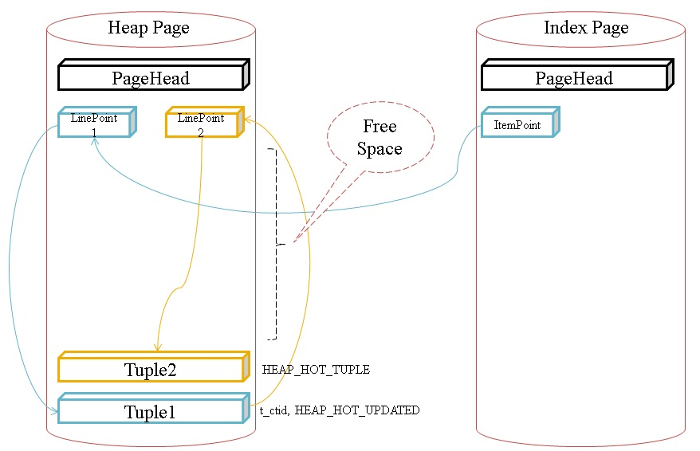
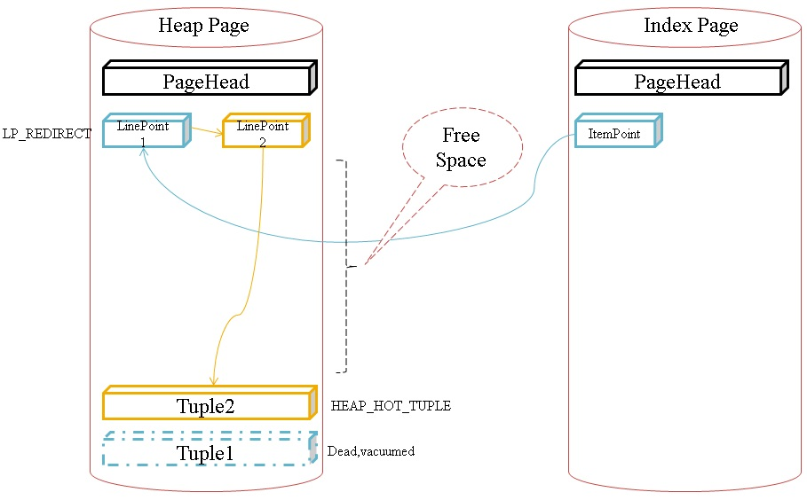

## 快速入门PostgreSQL应用开发与管理 - 6 事务和锁  
##### [TAG 31](../class/31.md)
                                                                
### 作者                                                                   
digoal                                                           
                                                            
### 日期                                                                                                                               
2017-04-12                                                         
                                                               
### 标签                                                            
PostgreSQL , Linux          
                                                                                                                                  
----                                                                                                                            
                                                                                                                                     
## 背景        
## 本章大纲
### 一、什么是事务  
### 二、单用户情况下的事务  
### 三、多用户情况下的事务  
#### 1 PostgreSQL如何处理事务隔离？  
#### 2 多用户情况下的事务并发处理  
### 四、锁  
### 五、数据恢复粒度  
### 六、数据年龄  
### 七、事务冻结  
### 八、垃圾回收  
### 九、flash back query  
  
## 第四章：事务和锁  
https://www.postgresql.org/docs/9.6/static/mvcc.html  
  
### 1. 什么是事务  
  
ACID介绍  
  
1\. 原子性：同一个事务中的所有操作，要么全部成功，要么全部失败。即使数据库恢复，也不能出现同一个事务中对数据库的操作一部分成功一部分失败的情况。  
  
2\. 一致性：任何时刻，数据库对用户的视角始终是按事务提交的顺序一致的，即使数据库恢复，也不能出现后提交的事务存在，而先提交的事务不存在的情况。  
  
以转账案例为例，假设有五个账户，每个账户余额是100元，那么五个账户总额是500元，如果在这个5个账户之间同时发生多个转账，无论并发多少个，比如在A与B账户之间转账5元，在C与D账户之间转账10元，在B与E之间转账15元，五个账户总额也应该还是500元。  
  
以插入数据为例，a插入1并提交，随后b插入2并提交。当数据库发生恢复时，要么a存在，要么a,b同时存在，绝对不可能出现b存在但是a不存在的情况。  
  
3\. 持久化：事务成功提交，表示事务对数据库的修改已经持久化到永久存储，即使断电也不会丢失。除非永久存储的介质损坏。  
  
4\. 隔离性：有4种隔离级别，读未提交，读已提交，可重复度，串行化。  
  
```  
postgres=# \h begin  
Command:     BEGIN  
Description: start a transaction block  
Syntax:  
BEGIN [ WORK | TRANSACTION ] [ transaction_mode [, ...] ]  
  
where transaction_mode is one of:  
  
    ISOLATION LEVEL { SERIALIZABLE | REPEATABLE READ | READ COMMITTED | READ UNCOMMITTED }  
    READ WRITE | READ ONLY  
    [ NOT ] DEFERRABLE  
```  
  
读未提交，表示可以读到其他会话未提交的数据。  
  
PostgreSQL不支持读未提交（脏读）。  
  
读已提交，表示可以读到其他会话已提交的数据。  
  
```  
postgres=# create table iso_test(id int, info text);  
CREATE TABLE  
postgres=# insert into iso_test values (1,'test');  
INSERT 0 1  
  
会话 1  
postgres=# begin;  
BEGIN  
postgres=# select * from iso_test;  
 id | info   
----+------  
  1 | test  
(1 row)  
  
会话 2  
postgres=# begin;  
BEGIN  
postgres=# update iso_test set info='new';  
UPDATE 1  
  
会话 1  
postgres=# select * from iso_test;  
 id | info   
----+------  
  1 | test  
(1 row)  
  
会话 2  
postgres=# end;  
COMMIT  
  
会话 1  
postgres=# select * from iso_test;  
 id | info   
----+------  
  1 | new  
(1 row)  
```  
  
可重复读，表示在一个事务中，执行同一条SQL，读到的是同样的数据（即使被读的数据可能已经被其他会话修改并提交）。  
  
```  
会话 1   
postgres=# begin transaction isolation level repeatable read ;  
BEGIN  
postgres=# select * from iso_test;  
 id | info   
----+------  
  1 | new  
(1 row)  
  
会话 2  
postgres=# begin;  
BEGIN  
postgres=# update iso_test set info='digoal';  
UPDATE 1  
postgres=# end;  
COMMIT  
  
会话 1   
postgres=# select * from iso_test;  
 id | info   
----+------  
  1 | new  
(1 row)  
```  
  
串行化，表示并行事务模拟串行执行，违反串行执行规则的事务，将回滚。  
  
```  
会话 1   
postgres=# begin transaction isolation level serializable ;  
BEGIN  
postgres=# select count(*) from iso_test;  
 count   
-------  
     6  
(1 row)  
  
会话 2  
postgres=# begin transaction isolation level serializable ;  
BEGIN  
postgres=# select count(*) from iso_test;  
 count   
-------  
     6  
(1 row)  
  
会话 1  
postgres=# insert into iso_test select * from iso_test;  
INSERT 0 6  
postgres=# select count(*) from iso_test;  
 count   
-------  
    12  
(1 row)  
  
会话 2   
postgres=# insert into iso_test select * from iso_test;  
INSERT 0 6  
postgres=# select count(*) from iso_test;  
 count   
-------  
    12  
(1 row)  
  
会话 1  
postgres=# end;  
COMMIT  
  
会话 2  
postgres=# end;  
ERROR:  could not serialize access due to read/write dependencies among transactions  
DETAIL:  Reason code: Canceled on identification as a pivot, during commit attempt.  
HINT:  The transaction might succeed if retried.  
```  
  
串行隔离级别锁信息查看  
  
```  
select relation::regclass,* from pg_locks where pid in (串行事务会话pid);  
```  
  
### 2. 单用户情况下的事务  
  
单用户情况下的事务，没有并行问题，属于串行事务，仅仅体现一致性、原子性、持久化。  
  
### 3. 多用户情况下的事务  
  
并行事务，体现事务隔离，锁。  
  
#### PostgreSQL如何处理事务隔离？  
  
1\. 多版本概念  
  
数据插入时，在记录的头信息中xmin字段，记录当前事务ID（xid）。  
  
删除数据时，在记录的头信息中xmax字段，记录当前事务ID（xid），头部infomask标记记录已删除。  
  
更新数据时，在被删除的记录的头信息中xmax字段，记录当前事务ID（xid），头部infomask标记记录已删除。同时插入一条新的记录，新记录的头信息中xmin字段，记录当前事务ID（xid）。  
  
```  
INSERT, xmin = current xid  
DELETE, xmax = current xid  
UPDATE, old tuple xmax = current xid, new tuple xmin = current xid  
```  
  
2\. 快照概念  
  
当前数据库中未提交的最小事务xmin，所有小于这个事务号的记录，对用户都可见。  
  
当前数据库中最小的未分配事务号xmax，所有大于这个事务号的记录，对用户都不可见。  
  
在xmin,xmax区间内，仍未提交的事务号list，所有等于这些事务号的记录，对用户都不可见。   
  
查询数据时，根据事务隔离级别、以上快照信息、行头信息中的xmin,xmax值、记录对应的事务提交状态，以及infomask标记信息，判断记录是否可见。  
  
3\. HOT  
  
为了降低索引的更新，当更新后的记录在同一个数据块中时，旧的记录使用ctid引用到对应的新记录的offset，如果更新后的记录，索引字段的值未编号，则不需要更新索引。  
  
  
  
  
  
#### 多用户情况下的事务并发处理  
  
1\. 读写不冲突  
  
2\. 读到什么数据，取决于事务隔离级别。  
  
### 4. 锁  
1\. 锁对象  
  
src/include/storage/lock.h  
  
```  
/*  
 * LOCKTAG is the key information needed to look up a LOCK item in the  
 * lock hashtable.  A LOCKTAG value uniquely identifies a lockable object.  
 *  
 * The LockTagType enum defines the different kinds of objects we can lock.  
 * We can handle up to 256 different LockTagTypes.  
 */  
typedef enum LockTagType  
{  
        LOCKTAG_RELATION,                       /* whole relation */  
        /* ID info for a relation is DB OID + REL OID; DB OID = 0 if shared */  
        LOCKTAG_RELATION_EXTEND,        /* the right to extend a relation */  
        /* same ID info as RELATION */  
        LOCKTAG_PAGE,                           /* one page of a relation */  
        /* ID info for a page is RELATION info + BlockNumber */  
        LOCKTAG_TUPLE,                          /* one physical tuple */  
        /* ID info for a tuple is PAGE info + OffsetNumber */  
        LOCKTAG_TRANSACTION,            /* transaction (for waiting for xact done) */  
        /* ID info for a transaction is its TransactionId */  
        LOCKTAG_VIRTUALTRANSACTION, /* virtual transaction (ditto) */  
        /* ID info for a virtual transaction is its VirtualTransactionId */  
        LOCKTAG_SPECULATIVE_TOKEN,      /* speculative insertion Xid and token */  
        /* ID info for a transaction is its TransactionId */  
        LOCKTAG_OBJECT,                         /* non-relation database object */  
        /* ID info for an object is DB OID + CLASS OID + OBJECT OID + SUBID */  
  
        /*  
         * Note: object ID has same representation as in pg_depend and  
         * pg_description, but notice that we are constraining SUBID to 16 bits.  
         * Also, we use DB OID = 0 for shared objects such as tablespaces.  
         */  
        LOCKTAG_USERLOCK,                       /* reserved for old contrib/userlock code */  
        LOCKTAG_ADVISORY                        /* advisory user locks */  
} LockTagType;  
```  
  
2\. 表级锁  
  
src/include/storage/lockdefs.h  
  
```  
#define AccessShareLock                 1    /* SELECT */  
#define RowShareLock                    2    /* SELECT FOR UPDATE/FOR SHARE */  
#define RowExclusiveLock                3    /* INSERT, UPDATE, DELETE */  
#define ShareUpdateExclusiveLock        4    /* VACUUM (non-FULL), ANALYZE, CREATE INDEX CONCURRENTLY */  
#define ShareLock                       5    /* CREATE INDEX (WITHOUT CONCURRENTLY) */  
#define ShareRowExclusiveLock           6    /* CREATE TRIGGER and many forms of ALTER TABLE, like EXCLUSIVE MODE, but allows ROW SHARE */  
#define ExclusiveLock                   7    /* REFRESH MATERIALIZED VIEW CONCURRENTLY, blocks ROW SHARE/SELECT...FOR UPDATE */  
#define AccessExclusiveLock             8    /* many ALTER TABLE, DROP TABLE, TRUNCATE, REINDEX, CLUSTER,   
                                              * VACUUM FULL, and REFRESH MATERIALIZED VIEW (without CONCURRENTLY)  
                                              * and unqualified LOCK TABLE */  
```  
  
alter table 不同的操作，请求的锁也不一样，详见  
  
https://www.postgresql.org/docs/9.6/static/sql-altertable.html  
  
表级锁冲突列表  
  
Requested Lock Mode|    ACCESS SHARE|   ROW SHARE|      ROW EXCLUSIVE|  SHARE UPDATE EXCLUSIVE| SHARE|  SHARE ROW EXCLUSIVE|    EXCLUSIVE|      ACCESS EXCLUSIVE  
---|---|---|---|---|---|---|---|---  
ACCESS SHARE|   -|-|-|-|-|-|-|  X  
ROW SHARE        |      -|-|-|-|-|-|                                            X|      X  
ROW EXCLUSIVE    |      -|-|-|-|                                X|      X|      X|      X  
SHARE UPDATE EXCLUSIVE| -|-|-|                          X|      X|      X|      X|      X  
SHARE|  -|-|                                            X|      X|-|    X|      X|      X  
SHARE ROW EXCLUSIVE|    -|-|                     X|     X|      X|      X|      X|      X  
EXCLUSIVE|      -|                      X|      X|      X|      X|      X|      X|      X  
ACCESS EXCLUSIVE|               X|      X|      X|      X|      X|      X|      X|      X  
  
3\. 行级锁  
  
src/include/access/heapam.h  
  
```  
/*  
 * Possible lock modes for a tuple.  
 */  
typedef enum LockTupleMode  
{  
        /* SELECT FOR KEY SHARE */  
        LockTupleKeyShare,  
        /* SELECT FOR SHARE */  
        LockTupleShare,  
        /* SELECT FOR NO KEY UPDATE, and UPDATEs that don't modify key columns */  
        LockTupleNoKeyExclusive,  
        /* SELECT FOR UPDATE, UPDATEs that modify key columns, and DELETE */  
        LockTupleExclusive  
} LockTupleMode;  
```  
  
行级锁冲突列表  
  
Requested Lock Mode| FOR KEY SHARE|     FOR SHARE|      FOR NO KEY UPDATE|      FOR UPDATE  
---|---|---|---|---  
FOR KEY SHARE|-|-|-|                            X  
FOR SHARE|-|-|                  X|      X|  
FOR NO KEY UPDATE|-|            X|      X|      X  
FOR UPDATE|     X|      X|      X|      X  
  
例子  
  
测试数据 :     
    
```    
digoal=# CREATE TABLE A (    
digoal(#         AID integer not null,    
digoal(#         Col1 integer,    
digoal(#         PRIMARY KEY (AID)    
digoal(#   );    
CREATE TABLE    
digoal=#     
digoal=#   CREATE TABLE B (    
digoal(#         BID integer not null,    
digoal(#         AID integer not null,    
digoal(#         Col2 integer,    
digoal(#         PRIMARY KEY (BID),    
digoal(#         FOREIGN KEY (AID) REFERENCES A(AID)    
digoal(#   );    
CREATE TABLE    
digoal=# INSERT INTO A (AID) VALUES (1),(2);    
INSERT 0 2    
digoal=#   INSERT INTO B (BID,AID) VALUES (2,1);    
INSERT 0 1    
digoal=# create extension pgrowlocks;  -- 观察行锁的插件  
CREATE EXTENSION    
```    
    
场景1 :    
    
SESSION A :     
    
```    
digoal=# begin;    
BEGIN    
digoal=# insert into b (aid,bid) values (1,1);    
INSERT 0 1    
```    
    
SESSION B :     
    
```    
digoal=# select * from pgrowlocks('a');    
 locked_row | locker | multi |  xids  |       modes       |  pids       
------------+--------+-------+--------+-------------------+---------    
 (0,1)      |   1706 | f     | {1706} | {"For Key Share"} | {18172}    
(1 row)    
    
-- 注意锁模式是"For Key Share", 锁的是a表的aid=1的记录    
    
digoal=# select * from pgrowlocks('b');    
 locked_row | locker | multi | xids | modes | pids     
------------+--------+-------+------+-------+------    
(0 rows)    
    
digoal=# select * from a where ctid='(0,1)';    
 aid | col1     
-----+------    
   1 |         
(1 row)    
    
digoal=# update a set col1=22 where aid=1;    
UPDATE 1    
-- 更新A表的非键值无需等待    
```    
    
场景2 :     
    
SESSION A :     
    
```    
digoal=# begin;    
BEGIN    
digoal=# update b set aid=2 where aid<>2;    
UPDATE 2    
SESSION B :     
digoal=# select * from pgrowlocks('a');    
 locked_row | locker | multi |  xids  |       modes       |  pids       
------------+--------+-------+--------+-------------------+---------    
 (0,2)    |   1708 | f     | {1708} | {"For Key Share"} | {18172}    
(1 row)    
    
-- 注意锁模式是"For Key Share" , 锁的是a表的aid=2的记录     
    
digoal=# select * from a where ctid='(0,2)';    
 aid | col1     
-----+------    
   2 |         
(1 row)    
    
digoal=# update a set col1=22 where aid=2;    
UPDATE 1    
    
-- 更新A表的非键值无需等待    
```    
    
会话B更新A表的时候, 是什么锁？    
    
场景3 :     
    
SESSION A :     
    
```    
digoal=# begin;    
BEGIN    
digoal=# update b set aid=2 where aid<>2;    
UPDATE 2    
```    
    
SESSION B :     
    
```    
digoal=# begin;    
BEGIN    
digoal=# update a set col1=22 where aid=1;    
UPDATE 1    
digoal=# update a set col1=22 where aid=2;    
UPDATE 1    
```    
    
SESSION C :     
    
```    
-- 一定要在第三个会话才能看到这些锁的状态.    
-- 因为MVCC, 本地会话看到的是已经更新后的TUPLE, 新的tuple头上的infomask的信息.    
-- 要看旧版本的infomask, 必须在其他会话查看.     
digoal=# select * from pgrowlocks('a');    
 locked_row | locker | multi |    xids     |             modes             |     pids          
------------+--------+-------+-------------+-------------------------------+---------------    
 (0,3)      |   1710 | f     | {1710}      | {Update}                      | {18332}    
 (0,4)      |      3 | t     | {1708,1710} | {"Key Share","No Key Update"} | {18172,18332}    
(2 rows)    
    
-- 注意会话B获取了1个No Key Update锁, 就是digoal=# update a set col1=22 where aid=2;这条产生的.    
因为更新的不是键值相关的.    
    
digoal=# select * from pgrowlocks('b');    
 locked_row | locker | multi |  xids  |  modes   |  pids       
------------+--------+-------+--------+----------+---------    
 (0,1)      |   1708 | f     | {1708} | {Update} | {18172}    
 (0,2)      |   1708 | f     | {1708} | {Update} | {18172}    
(2 rows)    
```    
  
4\. 用户锁  
  
用户轻量锁，锁ID值，支持事务级或者会话级持锁粒度，支持touch锁操作（touch不到锁，则返回false）。  
  
常用于长时间持锁的场景，或者用于秒杀场景。  
  
```  
SELECT pg_advisory_lock(id) FROM foo WHERE id = 12345; -- ok  
SELECT pg_advisory_lock(id) FROM foo WHERE id > 12345 LIMIT 100; -- danger!  
SELECT pg_advisory_lock(q.id) FROM  
(  
  SELECT id FROM foo WHERE id > 12345 LIMIT 100  
) q; -- ok  
```  
  
秒杀例子  
  
```  
create table test(id int primary key, crt_time timestamp);  
insert into test values (1);  
```  
    
```  
vi test.sql  
update test set crt_time=now() where id=1 and pg_try_advisory_xact_lock(1);  
  
pgbench -M prepared -n -r -P 1 -f ./test.sql -c 64 -j 64 -T 100  
  
transaction type: ./test.sql  
scaling factor: 1  
query mode: prepared  
number of clients: 64  
number of threads: 64  
duration: 100 s  
number of transactions actually processed: 39104368  
latency average = 0.163 ms  
latency stddev = 0.216 ms  
tps = 391012.743072 (including connections establishing)  
tps = 391175.983419 (excluding connections establishing)  
script statistics:  
 - statement latencies in milliseconds:  
         0.163  update test set crt_time=now() where id=1 and pg_try_advisory_xact_lock(1);  
```  
  
5\. 死锁  
  
当发生会话之间相互等待时，出现死锁  
  
例子  
  
会话 1   
  
```  
postgres=# create table d_lock(id int, info text);  
CREATE TABLE  
postgres=# insert into d_lock values (1,'test');  
INSERT 0 1  
postgres=# insert into d_lock values (2,'test');  
INSERT 0 1  
  
postgres=# begin;  
BEGIN  
postgres=# update d_lock set info='a' where id=1;  
UPDATE 1  
```  
  
会话 2   
  
```  
postgres=# begin;  
BEGIN  
postgres=# update d_lock set info='b' where id=2;  
UPDATE 1  
postgres=# update d_lock set info='b' where id=1;  
等待  
```  
  
会话 1   
  
```  
postgres=# update d_lock set info='a' where id=2;  -- 等待，检测到死锁，自动回滚  
ERROR:  deadlock detected  
DETAIL:  Process 13602 waits for ShareLock on transaction 96548629; blocked by process 18060.  
Process 18060 waits for ShareLock on transaction 96548628; blocked by process 13602.  
HINT:  See server log for query details.  
CONTEXT:  while updating tuple (0,2) in relation "d_lock"  
```  
  
会话 2   
  
```  
会话 1 自动释放锁后，会话2更新成功  
UPDATE 1  
```  
  
死锁检测间隔配置  
  
```  
postgres=# show deadlock_timeout ;  
 deadlock_timeout   
------------------  
 1s  
(1 row)  
```  
  
6\. 查看锁状态  
  
```  
with t_wait as                       
(select a.mode,a.locktype,a.database,a.relation,a.page,a.tuple,a.classid,  
a.objid,a.objsubid,a.pid,a.virtualtransaction,a.virtualxid,a,  
transactionid,b.query,b.xact_start,b.query_start,b.usename,b.datname   
  from pg_locks a,pg_stat_activity b where a.pid=b.pid and not a.granted),  
t_run as   
(select a.mode,a.locktype,a.database,a.relation,a.page,a.tuple,  
a.classid,a.objid,a.objsubid,a.pid,a.virtualtransaction,a.virtualxid,  
a,transactionid,b.query,b.xact_start,b.query_start,  
b.usename,b.datname from pg_locks a,pg_stat_activity b where   
a.pid=b.pid and a.granted)   
select r.locktype,r.mode r_mode,r.usename r_user,r.datname r_db,  
r.relation::regclass,r.pid r_pid,  
r.page r_page,r.tuple r_tuple,r.xact_start r_xact_start,  
r.query_start r_query_start,  
now()-r.query_start r_locktime,r.query r_query,w.mode w_mode,  
w.pid w_pid,w.page w_page,  
w.tuple w_tuple,w.xact_start w_xact_start,w.query_start w_query_start,  
now()-w.query_start w_locktime,w.query w_query    
from t_wait w,t_run r where  
  r.locktype is not distinct from w.locktype and  
  r.database is not distinct from w.database and  
  r.relation is not distinct from w.relation and  
  r.page is not distinct from w.page and  
  r.tuple is not distinct from w.tuple and  
  r.classid is not distinct from w.classid and  
  r.objid is not distinct from w.objid and  
  r.objsubid is not distinct from w.objsubid and  
  r.transactionid is not distinct from w.transactionid and  
  r.pid <> w.pid  
  order by   
  ((  case w.mode  
    when 'INVALID' then 0  
    when 'AccessShareLock' then 1  
    when 'RowShareLock' then 2  
    when 'RowExclusiveLock' then 3  
    when 'ShareUpdateExclusiveLock' then 4  
    when 'ShareLock' then 5  
    when 'ShareRowExclusiveLock' then 6  
    when 'ExclusiveLock' then 7  
    when 'AccessExclusiveLock' then 8  
    else 0  
  end  ) +   
  (  case r.mode  
    when 'INVALID' then 0  
    when 'AccessShareLock' then 1  
    when 'RowShareLock' then 2  
    when 'RowExclusiveLock' then 3  
    when 'ShareUpdateExclusiveLock' then 4  
    when 'ShareLock' then 5  
    when 'ShareRowExclusiveLock' then 6  
    when 'ExclusiveLock' then 7  
    when 'AccessExclusiveLock' then 8  
    else 0  
  end  )) desc,r.xact_start;  
```  
  
### 5. 数据恢复粒度  
  
数据库的PITR恢复，支持事务粒度的恢复。  
  
PITR恢复可以选择截止在:    
    
1\. 事务结束时(COMMIT/ABORT);     
    
2\. 或者是用户使用pg_create_restore_point()创建的还原点位置;    
  
recovery.conf  
  
```  
#recovery_target_name = ''      # e.g. 'daily backup 2011-01-26'  
#  
#recovery_target_time = ''      # e.g. '2004-07-14 22:39:00 EST'  
#  
#recovery_target_xid = ''  
#  
#recovery_target_inclusive = true , 当使用recovery_target_time时，false表示恢复到第一个时间点的第一个结束点，true表示恢复到时间点的最后一个结束点。  
```  
  
### 6. 数据年龄  
PostgreSQL目前使用的是32位的xid，所以需要轮询使用。  
  
表的年龄，取决于这张表的最老的记录与当前事务直接经历了多少个事务。  
  
计算表的年龄  
  
```  
postgres=# select age(relfrozenxid) , relname from pg_class;  
    age     |                    relname                      
------------+-----------------------------------------------  
    1690473 | pg_type  
    1690304 | pg_toast_187550  
 2147483647 | new_type  
 2147483647 | pg_toast_187550_index  
    1032229 | pg_toast_187556  
```  
  
### 7. 事务冻结  
  
由于xid需要轮询使用，为了防止出现"未来"的事务，一条记录的事务号，必须在20亿（约）个事务内设置为冻结事务号。  
  
冻结的事务号=2，可以被所有事务可见。  
  
例子  
  
```  
postgres=# set vacuum_freeze_min_age =0;  
SET  
postgres=# vacuum freeze test;  
VACUUM  
```  
  
强制冻结配置  
  
```  
autovacuum_freeze_max_age = 150000000 # 年龄超过这个值，会强制执行冻结  
```  
  
### 8. 垃圾回收  
  
PostgreSQL 使用多版本的技术支持ACID，所以更新，删除后，会产生垃圾。  
  
autovacuum被用于自动的垃圾回收，当表中的垃圾版本超过一定的比例（可配置）后，会自动的触发垃圾回收。  
  
自动垃圾回收的参数设置  
  
```  
autovacuum = on  # 开启自动垃圾回收  
autovacuum_naptime = 1min  # 垃圾回收进程唤醒间隔  
autovacuum_vacuum_scale_factor = 0.05  # 超过垃圾记录占比时，触发垃圾回收  
```  
  
手动垃圾回收  
  
```  
vacuum 表名;  
```  
  
### 9. flash back query  
  
闪回查询  
  
```    
create table public."TBL" (    
  c1 int,    
  c2 int,    
  "C3" text,    
  c4 text,    
  c5 text,    
  c6 text,    
  c7 int,    
  crt_time timestamp,    
  primary key (c1,"C3",c6,c4)    
);    
```    
    
创建记录表, 跟踪表的DML和truncate. 可以增加一列txid_snapshot类型存储txid_current_snapshot(), 这样就能回退到一个一致的点了.     
    
```    
CREATE TABLE public.undo_t (    
  id serial8 primary key,    
  xid int8,    
  relid oid,    
  table_schema text,    
  table_name text,    
  when_tg text,    
  level text,    
  op text,    
  encoding name,    
  old_rec public."TBL",    
  new_rec public."TBL",    
  crt_time timestamp without time zone DEFAULT now(),    
  username text,    
  client_addr inet,    
  client_port int    
);    
```    
    
创建触发器函数, 将DML, TRUNCATE的数据插入跟踪表    
    
```    
CREATE OR REPLACE FUNCTION public.undo_t_trace()    
RETURNS trigger    
LANGUAGE plpgsql    
AS $BODY$    
DECLARE    
  v_username text := session_user;    
  v_client_addr inet := inet_client_addr();    
  v_client_port int := inet_client_port();    
  v_xid bigint := txid_current();  -- 记录事务号, 回退时以事务号为界限.    
  v_encoding name := pg_client_encoding();    
BEGIN    
  case TG_OP    
  when 'DELETE' then     
    insert into public.undo_t (xid, relid, table_schema, table_name, when_tg, level, op, encoding, old_rec, username, client_addr, client_port)    
      values (v_xid, tg_relid, tg_table_schema, tg_table_name, tg_when, tg_level, tg_op, v_encoding, OLD, v_username, v_client_addr, v_client_port);    
  when 'INSERT' then     
    insert into public.undo_t (xid, relid, table_schema, table_name, when_tg, level, op, encoding, new_rec, username, client_addr, client_port)    
      values (v_xid, tg_relid, tg_table_schema, tg_table_name, tg_when, tg_level, tg_op, v_encoding, NEW, v_username, v_client_addr, v_client_port);    
  when 'UPDATE' then     
    insert into public.undo_t (xid, relid, table_schema, table_name, when_tg, level, op, encoding, old_rec, new_rec, username, client_addr, client_port)    
      values (v_xid, tg_relid, tg_table_schema, tg_table_name, tg_when, tg_level, tg_op, v_encoding, OLD, NEW, v_username, v_client_addr, v_client_port);    
  when 'TRUNCATE' then     
    insert into public.undo_t (xid, relid, table_schema, table_name, when_tg, level, op, encoding, old_rec, username, client_addr, client_port)    
      select v_xid, tg_relid, tg_table_schema, tg_table_name, tg_when, tg_level, tg_op, v_encoding, t, v_username, v_client_addr, v_client_port from public."TBL" AS t;    
  else    
    return null;    
  end case;    
  RETURN null;    
END;    
$BODY$ strict volatile;    
```    
    
添加触发器, 记录表的dml和truncate.    
    
```    
CREATE TRIGGER tg1 AFTER DELETE or INSERT or UPDATE ON public."TBL" FOR EACH ROW EXECUTE PROCEDURE public.undo_t_trace();    
CREATE TRIGGER tg2 BEFORE TRUNCATE ON public."TBL" FOR EACH STATEMENT EXECUTE PROCEDURE public.undo_t_trace();    
```    
    
插入测试数据, 为了增加难度, 我们使用了转义字符. 确保前后数据一致.    
    
```    
insert into "TBL" values (1,1,'te\\s\t','c4','c5','c6',1,now());    
insert into "TBL" values (2,1,'te\\s\t','c4','c5','c6',1,now());    
insert into "TBL" values (3,1,'te\\s\t','c4','c5','c6',1,now());    
insert into "TBL" values (4,1,'te\\s\t','c4','c5','c6',1,now());    
insert into "TBL" values (5,1,'te\\s\t','c4','c5','c6',1,now());    
insert into "TBL" values (6,1,'te\\s\t','c4','c5','c6',1,now());    
```    
    
插入后, 可以看到 INSERT被跟踪了, 并且我们存储了插入数据时的客户端编码. 方便解决编码问题.    
    
```    
postgres=# select * from undo_t;    
 id |   xid   |  relid   | table_schema | table_name | when_tg | level |   op   | encoding | old_rec |                          new_    
rec                           |          crt_time          | username | client_addr | client_port     
----+---------+----------+--------------+------------+---------+-------+--------+----------+---------+------------------------------    
------------------------------+----------------------------+----------+-------------+-------------    
  1 | 1301665 | 50534894 | public       | TBL        | AFTER   | ROW   | INSERT | UTF8     |         | (1,1,"te\\\\s\\t",c4,c5,c6,1,    
"2014-08-28 23:06:09.790227") | 2014-08-28 23:06:09.790227 | postgres |             |                
  2 | 1301666 | 50534894 | public       | TBL        | AFTER   | ROW   | INSERT | UTF8     |         | (2,1,"te\\\\s\\t",c4,c5,c6,1,    
"2014-08-28 23:06:09.79597")  | 2014-08-28 23:06:09.79597  | postgres |             |                
  3 | 1301667 | 50534894 | public       | TBL        | AFTER   | ROW   | INSERT | UTF8     |         | (3,1,"te\\\\s\\t",c4,c5,c6,1,    
"2014-08-28 23:06:09.80206")  | 2014-08-28 23:06:09.80206  | postgres |             |                
  4 | 1301668 | 50534894 | public       | TBL        | AFTER   | ROW   | INSERT | UTF8     |         | (4,1,"te\\\\s\\t",c4,c5,c6,1,    
"2014-08-28 23:06:09.80903")  | 2014-08-28 23:06:09.80903  | postgres |             |                
  5 | 1301669 | 50534894 | public       | TBL        | AFTER   | ROW   | INSERT | UTF8     |         | (5,1,"te\\\\s\\t",c4,c5,c6,1,    
"2014-08-28 23:06:09.819092") | 2014-08-28 23:06:09.819092 | postgres |             |                
  6 | 1301670 | 50534894 | public       | TBL        | AFTER   | ROW   | INSERT | UTF8     |         | (6,1,"te\\\\s\\t",c4,c5,c6,1,    
"2014-08-28 23:06:10.228624") | 2014-08-28 23:06:10.228624 | postgres |             |                
(6 rows)    
    
postgres=# select * from "TBL";    
 c1 | c2 |   C3    | c4 | c5 | c6 | c7 |          crt_time              
----+----+---------+----+----+----+----+----------------------------    
  1 |  1 | te\\s\t | c4 | c5 | c6 |  1 | 2014-08-28 23:06:09.790227    
  2 |  1 | te\\s\t | c4 | c5 | c6 |  1 | 2014-08-28 23:06:09.79597    
  3 |  1 | te\\s\t | c4 | c5 | c6 |  1 | 2014-08-28 23:06:09.80206    
  4 |  1 | te\\s\t | c4 | c5 | c6 |  1 | 2014-08-28 23:06:09.80903    
  5 |  1 | te\\s\t | c4 | c5 | c6 |  1 | 2014-08-28 23:06:09.819092    
  6 |  1 | te\\s\t | c4 | c5 | c6 |  1 | 2014-08-28 23:06:10.228624    
(6 rows)    
```    
    
回退操作我们这里用一个inline plpgsql 代码来处理, 如果你要写成函数也可以, 只需要传入一个XID即可.    
    
回退最后一个事务, 即c1=6的那条记录. 以事务号1301670为界限.    
    
注意变量使用标量, 因为在for 和 cursor fetch到一个变量时, 变量必须是标量.    
    
参考代码    
    
src/pl/plpgsql/src/pl_gram.y    
    
```    
do language plpgsql $$    
declare    
  v_op text;    
  v_encoding_curr text := pg_client_encoding();     
  v_encoding_tmp text;    
  v_old text;  -- 本来这里打算用public."TBL"来作为变量类型, 不过for, cursor都不允许存储非标量类型, 所以还是选择了标量text, 使用时转换.    
  v_new text;    
  v_xid int8 := 1301670;     
begin    
  for v_op, v_encoding_tmp, v_old, v_new in     
    select op,encoding,old_rec::text,new_rec::text from undo_t where xid>=v_xid order by xid desc,id desc    
  LOOP    
    execute 'set client_encoding='''||v_encoding_tmp||'''';    
    case v_op     
    when 'INSERT' then     
      delete from public."TBL" t where t=v_new::public."TBL";     
    when 'DELETE' then    
      insert into public."TBL" values ((v_old::public."TBL").*);     
    when 'TRUNCATE' then    
      insert into public."TBL" values ((v_old::public."TBL").*);     
    when 'UPDATE' then    
      delete from public."TBL" t where t=v_new::public."TBL";     
      insert into public."TBL" values ((v_old::public."TBL").*);     
    else    
    end case;     
  end loop;     
  execute 'set client_encoding='''||v_encoding_curr||'''';     
end;     
$$;    
```    
    
回退成功    
    
```    
postgres=# select * from "TBL";    
 c1 | c2 |   C3    | c4 | c5 | c6 | c7 |          crt_time              
----+----+---------+----+----+----+----+----------------------------    
  1 |  1 | te\\s\t | c4 | c5 | c6 |  1 | 2014-08-28 23:06:09.790227    
  2 |  1 | te\\s\t | c4 | c5 | c6 |  1 | 2014-08-28 23:06:09.79597    
  3 |  1 | te\\s\t | c4 | c5 | c6 |  1 | 2014-08-28 23:06:09.80206    
  4 |  1 | te\\s\t | c4 | c5 | c6 |  1 | 2014-08-28 23:06:09.80903    
  5 |  1 | te\\s\t | c4 | c5 | c6 |  1 | 2014-08-28 23:06:09.819092    
(5 rows)    
```    
    
回退操作同样会产生undo记录.    
    
```    
postgres=# select * from undo_t;    
 id |   xid   |  relid   | table_schema | table_name | when_tg | level |   op   | encoding |                          old_rec           
                    |                          new_rec                           |          crt_time          | username | client_ad    
dr | client_port     
----+---------+----------+--------------+------------+---------+-------+--------+----------+----------------------------------------    
--------------------+------------------------------------------------------------+----------------------------+----------+----------    
---+-------------    
  1 | 1301665 | 50534894 | public       | TBL        | AFTER   | ROW   | INSERT | UTF8     |                                            
                    | (1,1,"te\\\\s\\t",c4,c5,c6,1,"2014-08-28 23:06:09.790227") | 2014-08-28 23:06:09.790227 | postgres |              
   |                
  2 | 1301666 | 50534894 | public       | TBL        | AFTER   | ROW   | INSERT | UTF8     |                                            
                    | (2,1,"te\\\\s\\t",c4,c5,c6,1,"2014-08-28 23:06:09.79597")  | 2014-08-28 23:06:09.79597  | postgres |              
   |                
  3 | 1301667 | 50534894 | public       | TBL        | AFTER   | ROW   | INSERT | UTF8     |                                            
                    | (3,1,"te\\\\s\\t",c4,c5,c6,1,"2014-08-28 23:06:09.80206")  | 2014-08-28 23:06:09.80206  | postgres |              
   |                
  4 | 1301668 | 50534894 | public       | TBL        | AFTER   | ROW   | INSERT | UTF8     |                                            
                    | (4,1,"te\\\\s\\t",c4,c5,c6,1,"2014-08-28 23:06:09.80903")  | 2014-08-28 23:06:09.80903  | postgres |              
   |                
  5 | 1301669 | 50534894 | public       | TBL        | AFTER   | ROW   | INSERT | UTF8     |                                            
                    | (5,1,"te\\\\s\\t",c4,c5,c6,1,"2014-08-28 23:06:09.819092") | 2014-08-28 23:06:09.819092 | postgres |              
   |                
  6 | 1301670 | 50534894 | public       | TBL        | AFTER   | ROW   | INSERT | UTF8     |                                            
                    | (6,1,"te\\\\s\\t",c4,c5,c6,1,"2014-08-28 23:06:10.228624") | 2014-08-28 23:06:10.228624 | postgres |              
   |                
  7 | 1301671 | 50534894 | public       | TBL        | AFTER   | ROW   | DELETE | UTF8     | (6,1,"te\\\\s\\t",c4,c5,c6,1,"2014-08-2    
8 23:06:10.228624") |                                                            | 2014-08-28 23:07:07.750644 | postgres |              
   |                
(7 rows)    
```    
    
现在执行一个UPDATE, 把所有的记录更新掉.    
    
```    
postgres=# update "TBL" set c7=100;    
UPDATE 5    
postgres=# select * from "TBL";    
 c1 | c2 |   C3    | c4 | c5 | c6 | c7  |          crt_time              
----+----+---------+----+----+----+-----+----------------------------    
  1 |  1 | te\\s\t | c4 | c5 | c6 | 100 | 2014-08-28 23:06:09.790227    
  2 |  1 | te\\s\t | c4 | c5 | c6 | 100 | 2014-08-28 23:06:09.79597    
  3 |  1 | te\\s\t | c4 | c5 | c6 | 100 | 2014-08-28 23:06:09.80206    
  4 |  1 | te\\s\t | c4 | c5 | c6 | 100 | 2014-08-28 23:06:09.80903    
  5 |  1 | te\\s\t | c4 | c5 | c6 | 100 | 2014-08-28 23:06:09.819092    
(5 rows)    
    
postgres=# select * from undo_t;    
 id |   xid   |  relid   | table_schema | table_name | when_tg | level |   op   | encoding |                          old_rec           
                    |                           new_rec                            |          crt_time          | username | client_    
addr | client_port     
----+---------+----------+--------------+------------+---------+-------+--------+----------+----------------------------------------    
--------------------+--------------------------------------------------------------+----------------------------+----------+--------    
-----+-------------    
  1 | 1301665 | 50534894 | public       | TBL        | AFTER   | ROW   | INSERT | UTF8     |                                            
                    | (1,1,"te\\\\s\\t",c4,c5,c6,1,"2014-08-28 23:06:09.790227")   | 2014-08-28 23:06:09.790227 | postgres |            
     |                
  2 | 1301666 | 50534894 | public       | TBL        | AFTER   | ROW   | INSERT | UTF8     |                                            
                    | (2,1,"te\\\\s\\t",c4,c5,c6,1,"2014-08-28 23:06:09.79597")    | 2014-08-28 23:06:09.79597  | postgres |            
     |                
  3 | 1301667 | 50534894 | public       | TBL        | AFTER   | ROW   | INSERT | UTF8     |                                            
                    | (3,1,"te\\\\s\\t",c4,c5,c6,1,"2014-08-28 23:06:09.80206")    | 2014-08-28 23:06:09.80206  | postgres |            
     |                
  4 | 1301668 | 50534894 | public       | TBL        | AFTER   | ROW   | INSERT | UTF8     |                                            
                    | (4,1,"te\\\\s\\t",c4,c5,c6,1,"2014-08-28 23:06:09.80903")    | 2014-08-28 23:06:09.80903  | postgres |            
     |                
  5 | 1301669 | 50534894 | public       | TBL        | AFTER   | ROW   | INSERT | UTF8     |                                            
                    | (5,1,"te\\\\s\\t",c4,c5,c6,1,"2014-08-28 23:06:09.819092")   | 2014-08-28 23:06:09.819092 | postgres |            
     |                
  6 | 1301670 | 50534894 | public       | TBL        | AFTER   | ROW   | INSERT | UTF8     |                                            
                    | (6,1,"te\\\\s\\t",c4,c5,c6,1,"2014-08-28 23:06:10.228624")   | 2014-08-28 23:06:10.228624 | postgres |            
     |                
  7 | 1301671 | 50534894 | public       | TBL        | AFTER   | ROW   | DELETE | UTF8     | (6,1,"te\\\\s\\t",c4,c5,c6,1,"2014-08-2    
8 23:06:10.228624") |                                                              | 2014-08-28 23:07:07.750644 | postgres |            
     |                
  8 | 1301672 | 50534894 | public       | TBL        | AFTER   | ROW   | UPDATE | UTF8     | (1,1,"te\\\\s\\t",c4,c5,c6,1,"2014-08-2    
8 23:06:09.790227") | (1,1,"te\\\\s\\t",c4,c5,c6,100,"2014-08-28 23:06:09.790227") | 2014-08-28 23:08:52.887568 | postgres |            
     |                
  9 | 1301672 | 50534894 | public       | TBL        | AFTER   | ROW   | UPDATE | UTF8     | (2,1,"te\\\\s\\t",c4,c5,c6,1,"2014-08-2    
8 23:06:09.79597")  | (2,1,"te\\\\s\\t",c4,c5,c6,100,"2014-08-28 23:06:09.79597")  | 2014-08-28 23:08:52.887568 | postgres |            
     |                
 10 | 1301672 | 50534894 | public       | TBL        | AFTER   | ROW   | UPDATE | UTF8     | (3,1,"te\\\\s\\t",c4,c5,c6,1,"2014-08-2    
8 23:06:09.80206")  | (3,1,"te\\\\s\\t",c4,c5,c6,100,"2014-08-28 23:06:09.80206")  | 2014-08-28 23:08:52.887568 | postgres |            
     |                
 11 | 1301672 | 50534894 | public       | TBL        | AFTER   | ROW   | UPDATE | UTF8     | (4,1,"te\\\\s\\t",c4,c5,c6,1,"2014-08-2    
8 23:06:09.80903")  | (4,1,"te\\\\s\\t",c4,c5,c6,100,"2014-08-28 23:06:09.80903")  | 2014-08-28 23:08:52.887568 | postgres |        
     |                
 12 | 1301672 | 50534894 | public       | TBL        | AFTER   | ROW   | UPDATE | UTF8     | (5,1,"te\\\\s\\t",c4,c5,c6,1,"2014-08-2    
8 23:06:09.819092") | (5,1,"te\\\\s\\t",c4,c5,c6,100,"2014-08-28 23:06:09.819092") | 2014-08-28 23:08:52.887568 | postgres |            
     |                
(12 rows)    
```    
    
回退到更新前, 即1301672 这个XID需要回退掉.    
    
```    
do language plpgsql $$    
declare    
  v_op text;    
  v_encoding_curr text := pg_client_encoding();    
  v_encoding_tmp text;    
  v_old text;    
  v_new text;    
  v_xid int8 := 1301672;     
begin    
  for v_op, v_encoding_tmp, v_old, v_new in     
    select op,encoding,old_rec::text,new_rec::text from undo_t where xid>=v_xid order by xid desc,id desc    
  LOOP    
    execute 'set client_encoding='''||v_encoding_tmp||'''';     
    case v_op     
    when 'INSERT' then     
      delete from public."TBL" t where t=v_new::public."TBL";     
    when 'DELETE' then    
      insert into public."TBL" values ((v_old::public."TBL").*);     
    when 'TRUNCATE' then    
      insert into public."TBL" values ((v_old::public."TBL").*);     
    when 'UPDATE' then    
      delete from public."TBL" t where t=v_new::public."TBL";     
      insert into public."TBL" values ((v_old::public."TBL").*);     
    else    
    end case;     
  end loop;     
  execute 'set client_encoding='''||v_encoding_curr||'''';     
end;     
$$;    
    
postgres=# select * from "TBL";    
 c1 | c2 |   C3    | c4 | c5 | c6 | c7 |          crt_time              
----+----+---------+----+----+----+----+----------------------------    
  5 |  1 | te\\s\t | c4 | c5 | c6 |  1 | 2014-08-28 23:06:09.819092    
  4 |  1 | te\\s\t | c4 | c5 | c6 |  1 | 2014-08-28 23:06:09.80903    
  3 |  1 | te\\s\t | c4 | c5 | c6 |  1 | 2014-08-28 23:06:09.80206    
  2 |  1 | te\\s\t | c4 | c5 | c6 |  1 | 2014-08-28 23:06:09.79597    
  1 |  1 | te\\s\t | c4 | c5 | c6 |  1 | 2014-08-28 23:06:09.790227    
(5 rows)    
```    
    
现在把所有记录删除掉    
    
```    
postgres=# delete from "TBL";    
DELETE 5    
postgres=# select * from undo_t;    
 id |   xid   |  relid   | table_schema | table_name | when_tg | level |   op   | encoding |                           old_rec          
                      |                           new_rec                            |          crt_time          | username | clien    
t_addr | client_port     
----+---------+----------+--------------+------------+---------+-------+--------+----------+----------------------------------------    
----------------------+--------------------------------------------------------------+----------------------------+----------+------    
-------+-------------    
  1 | 1301665 | 50534894 | public       | TBL        | AFTER   | ROW   | INSERT | UTF8     |                                            
                      | (1,1,"te\\\\s\\t",c4,c5,c6,1,"2014-08-28 23:06:09.790227")   | 2014-08-28 23:06:09.790227 | postgres |          
       |                
  2 | 1301666 | 50534894 | public       | TBL        | AFTER   | ROW   | INSERT | UTF8     |                                            
                      | (2,1,"te\\\\s\\t",c4,c5,c6,1,"2014-08-28 23:06:09.79597")    | 2014-08-28 23:06:09.79597  | postgres |          
       |                
  3 | 1301667 | 50534894 | public       | TBL        | AFTER   | ROW   | INSERT | UTF8     |                                            
                      | (3,1,"te\\\\s\\t",c4,c5,c6,1,"2014-08-28 23:06:09.80206")    | 2014-08-28 23:06:09.80206  | postgres |          
       |                
  4 | 1301668 | 50534894 | public       | TBL        | AFTER   | ROW   | INSERT | UTF8     |                                            
                      | (4,1,"te\\\\s\\t",c4,c5,c6,1,"2014-08-28 23:06:09.80903")    | 2014-08-28 23:06:09.80903  | postgres |          
       |                
  5 | 1301669 | 50534894 | public       | TBL        | AFTER   | ROW   | INSERT | UTF8     |                                            
                      | (5,1,"te\\\\s\\t",c4,c5,c6,1,"2014-08-28 23:06:09.819092")   | 2014-08-28 23:06:09.819092 | postgres |          
       |                
  6 | 1301670 | 50534894 | public       | TBL        | AFTER   | ROW   | INSERT | UTF8     |                                            
                      | (6,1,"te\\\\s\\t",c4,c5,c6,1,"2014-08-28 23:06:10.228624")   | 2014-08-28 23:06:10.228624 | postgres |          
       |                
  7 | 1301671 | 50534894 | public       | TBL        | AFTER   | ROW   | DELETE | UTF8     | (6,1,"te\\\\s\\t",c4,c5,c6,1,"2014-08-2    
8 23:06:10.228624")   |                                                              | 2014-08-28 23:07:07.750644 | postgres |          
       |                
  8 | 1301672 | 50534894 | public       | TBL        | AFTER   | ROW   | UPDATE | UTF8     | (1,1,"te\\\\s\\t",c4,c5,c6,1,"2014-08-2    
8 23:06:09.790227")   | (1,1,"te\\\\s\\t",c4,c5,c6,100,"2014-08-28 23:06:09.790227") | 2014-08-28 23:08:52.887568 | postgres |          
       |                
  9 | 1301672 | 50534894 | public       | TBL        | AFTER   | ROW   | UPDATE | UTF8     | (2,1,"te\\\\s\\t",c4,c5,c6,1,"2014-08-2    
8 23:06:09.79597")    | (2,1,"te\\\\s\\t",c4,c5,c6,100,"2014-08-28 23:06:09.79597")  | 2014-08-28 23:08:52.887568 | postgres |          
       |                
 10 | 1301672 | 50534894 | public       | TBL        | AFTER   | ROW   | UPDATE | UTF8     | (3,1,"te\\\\s\\t",c4,c5,c6,1,"2014-08-2    
8 23:06:09.80206")    | (3,1,"te\\\\s\\t",c4,c5,c6,100,"2014-08-28 23:06:09.80206")  | 2014-08-28 23:08:52.887568 | postgres |          
       |                
 11 | 1301672 | 50534894 | public       | TBL        | AFTER   | ROW   | UPDATE | UTF8     | (4,1,"te\\\\s\\t",c4,c5,c6,1,"2014-08-2    
8 23:06:09.80903")    | (4,1,"te\\\\s\\t",c4,c5,c6,100,"2014-08-28 23:06:09.80903")  | 2014-08-28 23:08:52.887568 | postgres |          
       |                
 12 | 1301672 | 50534894 | public       | TBL        | AFTER   | ROW   | UPDATE | UTF8     | (5,1,"te\\\\s\\t",c4,c5,c6,1,"2014-08-2    
8 23:06:09.819092")   | (5,1,"te\\\\s\\t",c4,c5,c6,100,"2014-08-28 23:06:09.819092") | 2014-08-28 23:08:52.887568 | postgres |          
       |                
 13 | 1301673 | 50534894 | public       | TBL        | AFTER   | ROW   | DELETE | UTF8     | (5,1,"te\\\\s\\t",c4,c5,c6,100,"2014-08    
-28 23:06:09.819092") |                                                              | 2014-08-28 23:09:50.590689 | postgres |          
       |                
 14 | 1301673 | 50534894 | public       | TBL        | AFTER   | ROW   | INSERT | UTF8     |                                            
                      | (5,1,"te\\\\s\\t",c4,c5,c6,1,"2014-08-28 23:06:09.819092")   | 2014-08-28 23:09:50.590689 | postgres |          
       |                
 15 | 1301673 | 50534894 | public       | TBL        | AFTER   | ROW   | DELETE | UTF8     | (4,1,"te\\\\s\\t",c4,c5,c6,100,"2014-08    
-28 23:06:09.80903")  |                                                              | 2014-08-28 23:09:50.590689 | postgres |          
       |                
 16 | 1301673 | 50534894 | public       | TBL        | AFTER   | ROW   | INSERT | UTF8     |                                            
                      | (4,1,"te\\\\s\\t",c4,c5,c6,1,"2014-08-28 23:06:09.80903")    | 2014-08-28 23:09:50.590689 | postgres |          
       |                
 17 | 1301673 | 50534894 | public       | TBL        | AFTER   | ROW   | DELETE | UTF8     | (3,1,"te\\\\s\\t",c4,c5,c6,100,"2014-08    
-28 23:06:09.80206")  |                                                              | 2014-08-28 23:09:50.590689 | postgres |          
       |                
 18 | 1301673 | 50534894 | public       | TBL        | AFTER   | ROW   | INSERT | UTF8     |                                            
                      | (3,1,"te\\\\s\\t",c4,c5,c6,1,"2014-08-28 23:06:09.80206")    | 2014-08-28 23:09:50.590689 | postgres |          
       |                
 19 | 1301673 | 50534894 | public       | TBL        | AFTER   | ROW   | DELETE | UTF8     | (2,1,"te\\\\s\\t",c4,c5,c6,100,"2014-08    
-28 23:06:09.79597")  |                                                              | 2014-08-28 23:09:50.590689 | postgres |          
       |                
 20 | 1301673 | 50534894 | public       | TBL        | AFTER   | ROW   | INSERT | UTF8     |                                            
                      | (2,1,"te\\\\s\\t",c4,c5,c6,1,"2014-08-28 23:06:09.79597")    | 2014-08-28 23:09:50.590689 | postgres |          
       |                
 21 | 1301673 | 50534894 | public       | TBL        | AFTER   | ROW   | DELETE | UTF8     | (1,1,"te\\\\s\\t",c4,c5,c6,100,"2014-08    
-28 23:06:09.790227") |                                                              | 2014-08-28 23:09:50.590689 | postgres |          
       |                
 22 | 1301673 | 50534894 | public       | TBL        | AFTER   | ROW   | INSERT | UTF8     |                                            
                      | (1,1,"te\\\\s\\t",c4,c5,c6,1,"2014-08-28 23:06:09.790227")   | 2014-08-28 23:09:50.590689 | postgres |          
       |                
 23 | 1301674 | 50534894 | public       | TBL        | AFTER   | ROW   | DELETE | UTF8     | (5,1,"te\\\\s\\t",c4,c5,c6,1,"2014-08-2    
8 23:06:09.819092")   |                                                              | 2014-08-28 23:10:17.32766  | postgres |          
       |                
 24 | 1301674 | 50534894 | public       | TBL        | AFTER   | ROW   | DELETE | UTF8     | (4,1,"te\\\\s\\t",c4,c5,c6,1,"2014-08-2    
8 23:06:09.80903")    |                                                              | 2014-08-28 23:10:17.32766  | postgres |          
       |                
 25 | 1301674 | 50534894 | public       | TBL        | AFTER   | ROW   | DELETE | UTF8     | (3,1,"te\\\\s\\t",c4,c5,c6,1,"2014-08-2    
8 23:06:09.80206")    |                                                              | 2014-08-28 23:10:17.32766  | postgres |          
       |                
 26 | 1301674 | 50534894 | public       | TBL        | AFTER   | ROW   | DELETE | UTF8     | (2,1,"te\\\\s\\t",c4,c5,c6,1,"2014-08-2    
8 23:06:09.79597")    |                                                              | 2014-08-28 23:10:17.32766  | postgres |          
       |                
 27 | 1301674 | 50534894 | public       | TBL        | AFTER   | ROW   | DELETE | UTF8     | (1,1,"te\\\\s\\t",c4,c5,c6,1,"2014-08-2    
8 23:06:09.790227")   |                                                              | 2014-08-28 23:10:17.32766  | postgres |          
       |                
(27 rows)    
```    
    
回退到删除前, 即1301674回退掉.    
    
```    
do language plpgsql $$    
declare    
  v_op text;    
  v_encoding_curr text := pg_client_encoding();    
  v_encoding_tmp text;    
  v_old text;    
  v_new text;    
  v_xid int8 := 1301674;     
begin    
  for v_op, v_encoding_tmp, v_old, v_new in     
    select op,encoding,old_rec::text,new_rec::text from undo_t where xid>=v_xid order by xid desc,id desc    
  LOOP    
    execute 'set client_encoding='''||v_encoding_tmp||'''';     
    case v_op     
    when 'INSERT' then     
      delete from public."TBL" t where t=v_new::public."TBL";     
    when 'DELETE' then    
      insert into public."TBL" values ((v_old::public."TBL").*);     
    when 'TRUNCATE' then    
      insert into public."TBL" values ((v_old::public."TBL").*);     
    when 'UPDATE' then    
      delete from public."TBL" t where t=v_new::public."TBL";     
      insert into public."TBL" values ((v_old::public."TBL").*);     
    else    
    end case;     
  end loop;     
  execute 'set client_encoding='''||v_encoding_curr||'''';     
end;     
$$;    
    
postgres=# select * from "TBL";    
 c1 | c2 |   C3    | c4 | c5 | c6 | c7 |          crt_time              
----+----+---------+----+----+----+----+----------------------------    
  1 |  1 | te\\s\t | c4 | c5 | c6 |  1 | 2014-08-28 23:06:09.790227    
  2 |  1 | te\\s\t | c4 | c5 | c6 |  1 | 2014-08-28 23:06:09.79597    
  3 |  1 | te\\s\t | c4 | c5 | c6 |  1 | 2014-08-28 23:06:09.80206    
  4 |  1 | te\\s\t | c4 | c5 | c6 |  1 | 2014-08-28 23:06:09.80903    
  5 |  1 | te\\s\t | c4 | c5 | c6 |  1 | 2014-08-28 23:06:09.819092    
(5 rows)    
```    
    
现在回退到只有一条记录的时候. 即1301666     
    
```    
postgres=#  do language plpgsql $$    
declare    
  v_op text;    
  v_encoding_curr text := pg_client_encoding();    
  v_encoding_tmp text;    
  v_old text;    
  v_new text;    
  v_xid int8 := 1301666;     
begin    
  for v_op, v_encoding_tmp, v_old, v_new in     
    select op,encoding,old_rec::text,new_rec::text from undo_t where xid>=v_xid order by xid desc,id desc    
  LOOP    
    execute 'set client_encoding='''||v_encoding_tmp||'''';     
    case v_op     
    when 'INSERT' then     
      delete from public."TBL" t where t=v_new::public."TBL";     
    when 'DELETE' then    
      insert into public."TBL" values ((v_old::public."TBL").*);     
    when 'TRUNCATE' then    
      insert into public."TBL" values ((v_old::public."TBL").*);     
    when 'UPDATE' then    
      delete from public."TBL" t where t=v_new::public."TBL";     
      insert into public."TBL" values ((v_old::public."TBL").*);     
    else    
    end case;     
  end loop;     
  execute 'set client_encoding='''||v_encoding_curr||'''';     
end;     
$$;    
DO    
postgres=# select * from "TBL";    
 c1 | c2 |   C3    | c4 | c5 | c6 | c7 |          crt_time              
----+----+---------+----+----+----+----+----------------------------    
  1 |  1 | te\\s\t | c4 | c5 | c6 |  1 | 2014-08-28 23:06:09.790227    
(1 row)    
```    
    
接下来测试一下添加字段后的回退.    
    
```    
postgres=# alter table "TBL" add column c8 text;    
ALTER TABLE    
postgres=# insert into "TBL" values (2,1,'test','c4','c5','c6',1,now(),'c8');    
INSERT 0 1    
postgres=# insert into "TBL" values (3,1,'test','c4','c5','c6',1,now(),'c8');    
INSERT 0 1    
postgres=# select * from "TBL";    
 c1 | c2 |   C3    | c4 | c5 | c6 | c7 |          crt_time          | c8     
----+----+---------+----+----+----+----+----------------------------+----    
  1 |  1 | te\\s\t | c4 | c5 | c6 |  1 | 2014-08-28 23:06:09.790227 |     
  2 |  1 | test    | c4 | c5 | c6 |  1 | 2014-08-28 23:14:00.235677 | c8    
  3 |  1 | test    | c4 | c5 | c6 |  1 | 2014-08-28 23:14:35.012675 | c8    
```    
    
回退到添加字段前1301666.    
    
```    
postgres=#  do language plpgsql $$    
declare    
  v_op text;    
  v_encoding_curr text := pg_client_encoding();    
  v_encoding_tmp text;    
  v_old text;    
  v_new text;    
  v_xid int8 := 1301666;     
begin    
  for v_op, v_encoding_tmp, v_old, v_new in     
    select op,encoding,old_rec::text,new_rec::text from undo_t where xid>=v_xid order by xid desc,id desc    
  LOOP    
    execute 'set client_encoding='''||v_encoding_tmp||'''';     
    case v_op     
    when 'INSERT' then     
      delete from public."TBL" t where t=v_new::public."TBL";     
    when 'DELETE' then    
      insert into public."TBL" values ((v_old::public."TBL").*);     
    when 'TRUNCATE' then    
      insert into public."TBL" values ((v_old::public."TBL").*);     
    when 'UPDATE' then    
      delete from public."TBL" t where t=v_new::public."TBL";     
      insert into public."TBL" values ((v_old::public."TBL").*);     
    else    
    end case;     
  end loop;     
  execute 'set client_encoding='''||v_encoding_curr||'''';     
end;     
$$;    
DO    
postgres=# select * from "TBL";    
 c1 | c2 |   C3    | c4 | c5 | c6 | c7 |          crt_time          | c8     
----+----+---------+----+----+----+----+----------------------------+----    
  1 |  1 | te\\s\t | c4 | c5 | c6 |  1 | 2014-08-28 23:06:09.790227 |     
(1 row)    
```    
    
接下来删除字段测试    
    
```    
postgres=# alter table "TBL" drop column c5;    
ALTER TABLE    
postgres=# select * from "TBL";    
 c1 | c2 |   C3    | c4 | c6 | c7 |          crt_time          | c8     
----+----+---------+----+----+----+----------------------------+----    
  1 |  1 | te\\s\t | c4 | c6 |  1 | 2014-08-28 23:06:09.790227 |     
(1 row)    
    
postgres=# insert into "TBL" values (3,1,'test','c4','c6',1,now(),'c8');    
INSERT 0 1    
postgres=# select * from "TBL";    
 c1 | c2 |   C3    | c4 | c6 | c7 |          crt_time          | c8     
----+----+---------+----+----+----+----------------------------+----    
  1 |  1 | te\\s\t | c4 | c6 |  1 | 2014-08-28 23:06:09.790227 |     
  3 |  1 | test    | c4 | c6 |  1 | 2014-08-28 23:17:24.722663 | c8    
(2 rows)    
```    
    
回退到1301666    
    
```    
postgres=#  do language plpgsql $$    
declare    
  v_op text;    
  v_encoding_curr text := pg_client_encoding();    
  v_encoding_tmp text;    
  v_old text;    
  v_new text;    
  v_xid int8 := 1301666;     
begin    
  for v_op, v_encoding_tmp, v_old, v_new in     
    select op,encoding,old_rec::text,new_rec::text from undo_t where xid>=v_xid order by xid desc,id desc    
  LOOP    
    execute 'set client_encoding='''||v_encoding_tmp||'''';     
    case v_op     
    when 'INSERT' then     
      delete from public."TBL" t where t=v_new::public."TBL";     
    when 'DELETE' then    
      insert into public."TBL" values ((v_old::public."TBL").*);     
    when 'TRUNCATE' then    
      insert into public."TBL" values ((v_old::public."TBL").*);     
    when 'UPDATE' then    
      delete from public."TBL" t where t=v_new::public."TBL";     
      insert into public."TBL" values ((v_old::public."TBL").*);     
    else    
    end case;     
  end loop;     
  execute 'set client_encoding='''||v_encoding_curr||'''';     
end;     
$$;    
DO    
postgres=# select * from "TBL";    
 c1 | c2 |   C3    | c4 | c6 | c7 |          crt_time          | c8     
----+----+---------+----+----+----+----------------------------+----    
  1 |  1 | te\\s\t | c4 | c6 |  1 | 2014-08-28 23:06:09.790227 |     
(1 row)    
```    
  
<a rel="nofollow" href="http://info.flagcounter.com/h9V1"  ></a>  
  
  
  
  
  
  
## [digoal's 大量PostgreSQL文章入口](https://github.com/digoal/blog/blob/master/README.md "22709685feb7cab07d30f30387f0a9ae")
  
