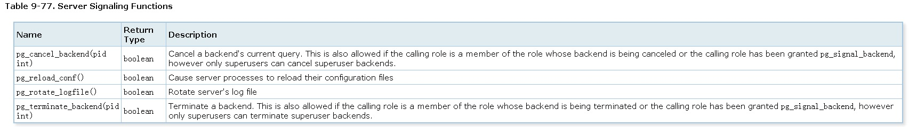

## 快速入门PostgreSQL应用开发与管理 - 7 函数、存储过程和触发器  
##### [TAG 31](../class/31.md)
                                                                  
### 作者                                                                     
digoal                                                             
                                                              
### 日期                                                                                                                                 
2017-04-12                                                           
                                                                 
### 标签                                                              
PostgreSQL , Linux            
                                                                                                                                    
----                                                                                                                              
                                                                                                                                       
## 背景   
## 本章大纲
### 一、运算符与函数  
#### 1 逻辑运算  
#### 2 比较运算  
#### 3 算数  
#### 4 字符串  
#### 5 bytea  
#### 6 bit  
#### 7 规则表达式  
#### 8 日期、数字、字符串格式化输出  
#### 9 时间  
#### 10 枚举  
#### 11 几何  
#### 12 网络地址  
#### 13 全文检索  
#### 14 XML  
#### 15 JSON、JSONB  
#### 16 序列  
#### 17 条件表达式  
#### 18 数组  
#### 19 范围  
#### 20 聚合  
#### 21 窗口  
#### 22 子查询表达式  
#### 23 行与数组表达式  
#### 24 返回集合的函数  
#### 25 系统信息函数  
#### 26 系统管理函数  
### 二、过程语言  
#### 1 语法  
#### 2 plpgsql函数内部结构  
#### 3 控制结构  
#### 4 游标  
#### 5 异常消息处理  
#### 6 plpgsql触发器函数  
### 三、解析一个存储过程  
#### 1 检查存储过程(函数)内容  
#### 2 调试plpgsql存储过程，输出每一次调用的QUERY详细执行计划  
#### 3 调试plpgsql函数  
### 四、SQL 函数  
### 五、触发器  
#### 1 触发器函数  
#### 2 事件触发器函数  
### 六、类型转换  

## 第五章：函数、存储过程和触发器  
https://www.postgresql.org/docs/9.6/static/functions.html  
  
### 1. 运算符与函数  
  
#### 逻辑运算  
```  
and, or, not  
```  
  
a|      b|      a AND b|        a OR b  
---|---|---|---  
TRUE|   TRUE|   TRUE|   TRUE  
TRUE|   FALSE|  FALSE|  TRUE  
TRUE|   NULL|   NULL|   TRUE  
FALSE|  FALSE|  FALSE|  FALSE  
FALSE|  NULL|   FALSE|  NULL  
NULL|   NULL|   NULL|   NULL  
  
a|      NOT a  
---|---  
TRUE|   FALSE  
FALSE|  TRUE  
NULL|   NULL  
  
#### 比较运算  
```  
a BETWEEN x AND y  
a >= x AND a <= y  
  
a NOT BETWEEN x AND y  
a < x OR a > y  
```  
  
比较操作符  
  
Operator|       Description  
---|---  
<|      less than  
>|      greater than  
<=|     less than or equal to  
>=|     greater than or equal to  
=|      equal  
<> or !=|       not equal  
  
断言语法  
  
Predicate|      Description  
---|---  
a BETWEEN x AND y|      between  
a NOT BETWEEN x AND y|  not between  
a BETWEEN SYMMETRIC x AND y|    between, after sorting the comparison values  
a NOT BETWEEN SYMMETRIC x AND y|        not between, after sorting the comparison values  
a IS DISTINCT FROM b|   not equal, treating null like an ordinary value  
a IS NOT DISTINCT FROM b|       equal, treating null like an ordinary value  
expression IS NULL|     is null  
expression IS NOT NULL| is not null  
expression ISNULL|      is null (nonstandard syntax)  
expression NOTNULL|     is not null (nonstandard syntax)  
boolean_expression IS TRUE|     is true  
boolean_expression IS NOT TRUE| is false or unknown  
boolean_expression IS FALSE|    is false  
boolean_expression IS NOT FALSE|        is true or unknown  
boolean_expression IS UNKNOWN|  is unknown  
boolean_expression IS NOT UNKNOWN|      is true or false  
  
计算空值或非空个数  
  
Function|       Description|    Example|        Example Result  
---|---|---|---  
num_nonnulls(VARIADIC "any")|   returns the number of non-null arguments|       num_nonnulls(1, NULL, 2)|       2  
num_nulls(VARIADIC "any")|      returns the number of null arguments|   num_nulls(1, NULL, 2)|  1  
  
  
#### 算数  
运算符  
  
  
  
函数  
  
  
  
  
  
随机值函数  
  
  
  
三角函数  
  
  
  
#### 字符串  
常用字符串操作符与函数  
  
  
  
字符串处理函数  
  
  
  
  
  
  
  
编码转换函数  
  
  
  
  
  
  
  
  
  
格式化函数  
  
常用于构建动态SQL  
  
```  
format(formatstr text [, formatarg "any" [, ...] ])  
```  
  
嵌入格式  
  
```  
%[position][flags][width]type  
  
type:  
  
s formats the argument value as a simple string. A null value is treated as an empty string.  
  
I treats the argument value as an SQL identifier, double-quoting it if necessary. It is an error for the value to be null (equivalent to quote_ident).  
  
L quotes the argument value as an SQL literal. A null value is displayed as the string NULL, without quotes (equivalent to quote_nullable).  
```  
  
例子  
  
```  
SELECT format('Hello %s', 'World');  
Result: Hello World  
  
SELECT format('Testing %s, %s, %s, %%', 'one', 'two', 'three');  
Result: Testing one, two, three, %  
  
SELECT format('INSERT INTO %I VALUES(%L)', 'Foo bar', E'O\'Reilly');  
Result: INSERT INTO "Foo bar" VALUES('O''Reilly')  
  
SELECT format('INSERT INTO %I VALUES(%L)', 'locations', E'C:\\Program Files');  
Result: INSERT INTO locations VALUES(E'C:\\Program Files')  
```  
  
#### bytea  
函数和操作符  
  
  
  
  
  
#### bit  
操作符  
  
  
  
INT与BIT的转换 , 例子  
  
```  
44::bit(10)                    0000101100  
44::bit(3)                     100  
cast(-44 as bit(12))           111111010100  
'1110'::bit(4)::integer        14  
```  
  
#### 规则表达式  
正则操作符  
  
  
  
例子  
  
```  
'abc' ~ 'abc'    true  
'abc' ~ '^a'     true  
'abc' ~ '(b|d)'  true  
'abc' ~ '^(b|c)' false  
```  
  
转义字符  
  
  
  
快捷字符  
  
  
  
例子, 提取匹配字符  
  
```  
SELECT SUBSTRING('XY1234Z', 'Y*([0-9]{1,3})');  
Result: 123  
```  
  
例子, 行列变换  
  
```  
一个或多个空格隔开  
SELECT foo FROM regexp_split_to_table('the quick brown fox jumps over the lazy dog', E'\\s+') AS foo;  
  foo     
-------  
 the      
 quick    
 brown    
 fox      
 jumps   
 over     
 the      
 lazy     
 dog      
(9 rows)  
  
0个或多个空格隔开  
SELECT foo FROM regexp_split_to_table('the quick brown fox', E'\\s*') AS foo;  
 foo   
-----  
 t           
 h           
 e           
 q           
 u           
 i           
 c           
 k           
 b           
 r           
 o           
 w           
 n           
 f           
 o           
 x           
(16 rows)  
```  
  
例子, 行转数组  
  
```  
SELECT regexp_split_to_array('the quick brown fox jumps over the lazy dog', E'\\s+');  
              regexp_split_to_array               
-----------------------------------------------  
 {the,quick,brown,fox,jumps,over,the,lazy,dog}  
(1 row)  
```  
  
#### 日期、数字、字符串格式化输出  
格式化函数  
  
  
  
时间、日期格式化样式  
  
  
  
  
  
时间日期格式化前缀  
  
  
  
数字格式化样式  
  
  
  
数字格式化前缀  
  
  
  
to_char例子  
  
  
  
  
  
#### 时间  
操作符  
  
  
  
函数  
  
  
  
  
  
时区转换函数  
  
  
  
例子  
  
```  
SELECT TIMESTAMP '2001-02-16 20:38:40' AT TIME ZONE 'MST';  
Result: 2001-02-16 19:38:40-08  
  
SELECT TIMESTAMP WITH TIME ZONE '2001-02-16 20:38:40-05' AT TIME ZONE 'MST';  
Result: 2001-02-16 18:38:40  
```  
  
获取事务、语句调用时的时间  
  
```  
事务时间  
transaction_timestamp()  
now()  
  
语句时间  
statement_timestamp()  
clock_timestamp()  
timeofday()  
```  
  
获取当前事务时间或日期  
  
```  
CURRENT_DATE  
  
带时区  
CURRENT_TIME  
CURRENT_TIMESTAMP  
CURRENT_TIME(precision)  
CURRENT_TIMESTAMP(precision)  
  
不带时区  
LOCALTIME  
LOCALTIMESTAMP  
LOCALTIME(precision)  
LOCALTIMESTAMP(precision)  
```  
  
睡眠函数  
  
```  
pg_sleep(seconds)  
pg_sleep_for(interval)  
pg_sleep_until(timestamp with time zone)  
```  
  
例子  
  
```  
SELECT pg_sleep(1.5);  
SELECT pg_sleep_for('5 minutes');  
SELECT pg_sleep_until('tomorrow 03:00');  
```  
  
#### 枚举  
  
枚举类型函数  
  
  
  
例子  
  
```  
CREATE TYPE rainbow AS ENUM ('red', 'orange', 'yellow', 'green', 'blue', 'purple');  
```  
  
#### 几何  
  
操作符  
  
  
  
函数  
  
  
  
类型转换函数  
  
  
  
#### 网络地址  
操作符  
  
  
  
函数  
  
  
  
  
  
#### 全文检索  
操作符  
  
  
  
函数  
  
  
  
  
  
调试函数  
  
  
  
#### XML  
https://www.postgresql.org/docs/9.6/static/functions-xml.html  
  
#### JSON、JSONB  
json\jsonb 通用操作符  
  
  
  
jsonb 操作符  
  
  
  
构建JSON值的函数  
  
  
  
JSON值处理函数  
  
  
  
  
  
  
  
  
#### 序列  
函数  
  
  
  
例子  
  
```  
SELECT setval('foo', 42);           Next nextval will return 43  
SELECT setval('foo', 42, true);     Same as above  
SELECT setval('foo', 42, false);    Next nextval will return 42  
```  
  
#### 条件表达式  
  
CASE表达式 1  
  
```  
CASE WHEN condition THEN result  
     [WHEN ...]  
     [ELSE result]  
END  
```  
  
例子  
  
```  
SELECT * FROM test;  
  
 a  
---  
 1  
 2  
 3  
  
  
SELECT a,  
       CASE WHEN a=1 THEN 'one'  
            WHEN a=2 THEN 'two'  
            ELSE 'other'  
       END  
    FROM test;  
  
 a | case  
---+-------  
 1 | one  
 2 | two  
 3 | other  
```  
  
CASE表达式 2  
  
```  
CASE expression  
    WHEN value THEN result  
    [WHEN ...]  
    [ELSE result]  
END  
```  
  
例子  
  
```  
SELECT a,  
       CASE a WHEN 1 THEN 'one'  
              WHEN 2 THEN 'two'  
              ELSE 'other'  
       END  
    FROM test;  
  
 a | case  
---+-------  
 1 | one  
 2 | two  
 3 | other  
  
  
SELECT ... WHERE CASE WHEN x <> 0 THEN y/x > 1.5 ELSE false END;  -- 不符合条件的then不会被执行，所以这里不会报除以0的错误  
```  
  
COALESCE表达式  
  
输出第一个不为空的参数，都为空则输出空  
  
```  
COALESCE(value [, ...])  
```  
  
例子  
  
```  
SELECT COALESCE(description, short_description, '(none)') ...  
```  
  
NULLIF表达式  
  
v1,v2相等时返回NULL, 否则返回v1。  
  
```  
NULLIF(value1, value2)  
```  
  
GREATEST and LEAST表达式  
  
忽略NULL，仅仅当所有值都为NULL时返回NULL。  
  
```  
返回最大值  
GREATEST(value [, ...])  
  
  
返回最小值  
LEAST(value [, ...])  
```  
  
#### 数组  
操作符  
  
  
  
函数  
  
  
  
  
  
#### 范围  
操作符  
  
  
  
函数  
  
  
  
  
#### 聚合  
参考章节 - 高级SQL  
  
  
  
  
  
  
  
  
  
  
  
#### 窗口  
参考章节 - 高级SQL  
  
  
  
#### 子查询表达式  
exists表达式  
  
```  
EXISTS (subquery)  
```  
  
例子   
  
```  
SELECT col1  
FROM tab1  
WHERE EXISTS (SELECT 1 FROM tab2 WHERE col2 = tab1.col2);  
```  
  
in表达式  
  
```  
expression IN (subquery)  
  
row_constructor IN (subquery)  
```  
  
not in表达式  
  
```  
expression NOT IN (subquery)  
  
row_constructor NOT IN (subquery)  
```  
  
any, some表达式(一个意思)  
  
```  
expression operator ANY (subquery)  
expression operator SOME (subquery)  
  
row_constructor operator ANY (subquery)  
row_constructor operator SOME (subquery)  
```  
  
all表达式  
  
```  
expression operator ALL (subquery)  
  
row_constructor operator ALL (subquery)  
```  
  
OP单行子查询表达式  
  
```  
row_constructor operator (subquery)  
```  
  
#### 行与数组表达式  
in表达式  
  
```  
expression IN (value [, ...])  
  
等同于  
  
expression = value1  
OR  
expression = value2  
OR  
...  
```  
  
not in表达式  
  
```  
expression NOT IN (value [, ...])  
  
等同于  
  
expression <> value1  
AND  
expression <> value2  
AND  
...  
```  
  
any, some(array)表达式  
  
```  
expression operator ANY (array expression)  
expression operator SOME (array expression)  
```  
  
all(array)表达式  
  
```  
expression operator ALL (array expression)  
```  
  
行与行构造器的比较操作表达式  
  
```  
row_constructor operator row_constructor  
  
operator is =, <>, <, <=, > or >=  
  
row_constructor IS DISTINCT FROM row_constructor  
  
row_constructor IS NOT DISTINCT FROM row_constructor  
```  
  
复合类型比较表达式  
  
```  
record operator record  
```  
  
#### 返回集合的函数  
返回多行（集合）的函数，常用于构造测试数据  
  
  
  
  
  
例子  
  
```  
SELECT * FROM generate_series(2,4);  
 generate_series  
-----------------  
               2  
               3  
               4  
(3 rows)  
  
SELECT * FROM generate_series('2008-03-01 00:00'::timestamp,  
                              '2008-03-04 12:00', '10 hours');  
   generate_series     
---------------------  
 2008-03-01 00:00:00  
 2008-03-01 10:00:00  
 2008-03-01 20:00:00  
 2008-03-02 06:00:00  
 2008-03-02 16:00:00  
 2008-03-03 02:00:00  
 2008-03-03 12:00:00  
 2008-03-03 22:00:00  
 2008-03-04 08:00:00  
(9 rows)  
  
-- basic usage  
SELECT generate_subscripts('{NULL,1,NULL,2}'::int[], 1) AS s;  
 s   
---  
 1  
 2  
 3  
 4  
(4 rows)  
  
-- set returning function WITH ORDINALITY  
SELECT * FROM pg_ls_dir('.') WITH ORDINALITY AS t(ls,n);  
       ls        | n  
-----------------+----  
 pg_serial       |  1  
 pg_twophase     |  2  
 postmaster.opts |  3  
 pg_notify       |  4  
 postgresql.conf |  5  
 pg_tblspc       |  6  
 logfile         |  7  
 base            |  8  
 postmaster.pid  |  9  
 pg_ident.conf   | 10  
 global          | 11  
 pg_clog         | 12  
 pg_snapshots    | 13  
 pg_multixact    | 14  
 PG_VERSION      | 15  
 pg_xlog         | 16  
 pg_hba.conf     | 17  
 pg_stat_tmp     | 18  
 pg_subtrans     | 19  
(19 rows)  
```  
  
#### 系统信息函数  
系统信息函数，可以帮助用户了解数据库的运行情况，配置情况等。  
  
很多系统信息查看函数返回的是record类型，关于返回的结构解释，请参考  
  
https://www.postgresql.org/docs/9.6/static/functions-info.html  
  
会话信息函数  
  
  
  
检查是否有访问指定对象的权限  
  
  
  
检查资源是否可见  
  
  
  
查看系统表相关的信息  
  
  
  
  
  
获得数据库对象的信息或address等信息  
  
  
  
获得对象的注释信息  
  
  
  
获得数据库当前的事务快照信息  
  
  
  
已提交事务的时间戳等信息  
  
  
  
数据库的控制信息  
  
  
  
#### 系统管理函数  
  
读取、设置参数值  
  
  
  
信号相关函数（cancel query,杀死会话,reload配置文件,切换log文件）  
  
  
  
物理备份、备份控制、redo文件 相关函数  
  
  
  
物理、流式recovery信息读取、恢复控制 相关函数  
  
  
  
  
  
快照导出函数（生成一致性快照）  
  
  
  
流复制相关函数(创建slot, decode等)  
  
  
  
  
  
获取数据库对象的空间占用情况的函数  
  
  
  
获得对象物理存储位置（文件名）函数  
  
  
  
索引维护函数  
  
  
  
服务端文件操作函数  
  
  
  
用户AD lock函数  
  
  
  
### 2. 过程语言  
PostgreSQL支持多种过程语言，包括plpgsql, sql, c, python, perl, java等等。  
  
其中plpgsql是使用较多的过程语言，与Oracle的PL/SQL功能类似。  
  
#### 语法  
  
```  
CREATE [ OR REPLACE ] FUNCTION  
    name ( [ [ argmode ] [ argname ] argtype [ { DEFAULT | = } default_expr ] [, ...] ] )  
    [ RETURNS rettype  
      | RETURNS TABLE ( column_name column_type [, ...] ) ]  
  { LANGUAGE lang_name  
    | TRANSFORM { FOR TYPE type_name } [, ... ]  
    | WINDOW  
    | IMMUTABLE | STABLE | VOLATILE | [ NOT ] LEAKPROOF  
    | CALLED ON NULL INPUT | RETURNS NULL ON NULL INPUT | STRICT  
    | [ EXTERNAL ] SECURITY INVOKER | [ EXTERNAL ] SECURITY DEFINER  
    | PARALLEL { UNSAFE | RESTRICTED | SAFE }  
    | COST execution_cost  
    | ROWS result_rows  
    | SET configuration_parameter { TO value | = value | FROM CURRENT }  
    | AS 'definition'  
    | AS 'obj_file', 'link_symbol'  
  } ...  
    [ WITH ( attribute [, ...] ) ]  
```  
  
plpgsql支持任意参数、任意返回值、返回多行、返回数组、复合类型等。  
  
#### plpgsql函数内部结构  
  
```  
[ <<label>> ]  
[ DECLARE  
    declarations ]  
BEGIN  
    statements  
END [ label ];  
```  
  
例子1  
  
```  
CREATE FUNCTION somefunc() RETURNS integer AS $$  
<< outerblock >>  
DECLARE  
    quantity integer := 30;  
BEGIN  
    RAISE NOTICE 'Quantity here is %', quantity;  -- Prints 30  
    quantity := 50;  
    --  
    -- Create a subblock  
    --  
    DECLARE  
        quantity integer := 80;  
    BEGIN  
        RAISE NOTICE 'Quantity here is %', quantity;  -- Prints 80  
        RAISE NOTICE 'Outer quantity here is %', outerblock.quantity;  -- Prints 50  
    END;  
  
    RAISE NOTICE 'Quantity here is %', quantity;  -- Prints 50  
  
    RETURN quantity;  
END;  
$$ LANGUAGE plpgsql;  
```  
  
变量声明语法  
  
```  
name [ CONSTANT ] type [ COLLATE collation_name ] [ NOT NULL ] [ { DEFAULT | := | = } expression ];  
```  
  
例子  
  
```  
DECLARE  
  
user_id integer;  
quantity numeric(5);  
url varchar;  
myrow tablename%ROWTYPE;  
myfield tablename.columnname%TYPE;  
arow RECORD;  
  
quantity integer DEFAULT 32;  
url varchar := 'http://mysite.com';  
user_id CONSTANT integer := 10;  
```  
  
参数使用的例子，可以使用位置参数，或者别名。  
  
```  
CREATE FUNCTION instr(varchar, integer) RETURNS integer AS $$  
DECLARE  
    v_string ALIAS FOR $1;  
    index ALIAS FOR $2;  
BEGIN  
    -- some computations using v_string and index here  
END;  
$$ LANGUAGE plpgsql;  
  
  
CREATE FUNCTION concat_selected_fields(in_t sometablename) RETURNS text AS $$  
BEGIN  
    RETURN in_t.f1 || in_t.f3 || in_t.f5 || in_t.f7;  
END;  
$$ LANGUAGE plpgsql;  
```  
  
基本表达式  
  
赋值  
  
```  
variable { := | = } expression;  
```  
  
执行无结果调用  
  
```  
PERFORM query;  
```  
  
通常被用来判断是否有记录，例如  
  
```  
PERFORM 1 from tbl where xxx limit 1;  
if found then  
  xxx  
else  
  xxx  
end if;  
```  
  
执行返回单行的表达式或QUERY，并将结果存入变量。  
  
```  
SELECT select_expressions INTO [STRICT] target FROM ...;  
INSERT ... RETURNING expressions INTO [STRICT] target;  
UPDATE ... RETURNING expressions INTO [STRICT] target;  
DELETE ... RETURNING expressions INTO [STRICT] target;  
```  
  
将结果存入变量时，如果没有结果被存入，或者存入的结果超过1条，可以这样来判断  
  
If STRICT is not specified in the INTO clause, then target will be set to the first row returned by the query, or to nulls if the query returned no rows.  
  
```  
SELECT * INTO myrec FROM emp WHERE empname = myname;  
IF NOT FOUND THEN  
    RAISE EXCEPTION 'employee % not found', myname;  
END IF;  
```  
  
If the STRICT option is specified, the query must return exactly one row or a run-time error will be reported,   
  
either NO_DATA_FOUND (no rows) or TOO_MANY_ROWS (more than one row).  
  
```  
BEGIN  
    SELECT * INTO STRICT myrec FROM emp WHERE empname = myname;  
    EXCEPTION  
        WHEN NO_DATA_FOUND THEN  
            RAISE EXCEPTION 'employee % not found', myname;  
        WHEN TOO_MANY_ROWS THEN  
            RAISE EXCEPTION 'employee % not unique', myname;  
END;  
```  
  
执行动态SQL  
  
```  
EXECUTE command-string [ INTO [STRICT] target ] [ USING expression [, ... ] ];  
```  
  
例子  
  
```  
EXECUTE 'SELECT count(*) FROM mytable WHERE inserted_by = $1 AND inserted <= $2'  
   INTO c  
   USING checked_user, checked_date;  
  
EXECUTE 'SELECT count(*) FROM '  
    || quote_ident(tabname)  
    || ' WHERE inserted_by = $1 AND inserted <= $2'  
   INTO c  
   USING checked_user, checked_date;  
  
EXECUTE format('SELECT count(*) FROM %I '  
   'WHERE inserted_by = $1 AND inserted <= $2', tabname)  
   INTO c  
   USING checked_user, checked_date;  
  
EXECUTE format('UPDATE tbl SET %I = %L '  
   'WHERE key = %L', colname, newvalue, keyvalue);  
```  
  
获取上一条SQL的执行状态  
  
```  
GET [ CURRENT ] DIAGNOSTICS variable { = | := } item [ , ... ];  
  
例子  
  
GET DIAGNOSTICS integer_var = ROW_COUNT;  
```  
  
支持的变量如下  
  
  
  
FOUND变量取值原理  
  
```  
A SELECT INTO statement sets FOUND true if a row is assigned, false if no row is returned.  
  
A PERFORM statement sets FOUND true if it produces (and discards) one or more rows, false if no row is produced.  
  
UPDATE, INSERT, and DELETE statements set FOUND true if at least one row is affected, false if no row is affected.  
  
A FETCH statement sets FOUND true if it returns a row, false if no row is returned.  
  
A MOVE statement sets FOUND true if it successfully repositions the cursor, false otherwise.  
  
A FOR or FOREACH statement sets FOUND true if it iterates one or more times, else false.   
FOUND is set this way when the loop exits; inside the execution of the loop, FOUND is not modified by the loop statement,   
although it might be changed by the execution of other statements within the loop body.  
  
RETURN QUERY and RETURN QUERY EXECUTE statements set FOUND true if the query returns at least one row, false if no row is returned.  
  
Other PL/pgSQL statements do not change the state of FOUND.   
Note in particular that EXECUTE changes the output of GET DIAGNOSTICS, but does not change FOUND.  
  
FOUND is a local variable within each PL/pgSQL function; any changes to it affect only the current function.  
```  
  
NULL; 忽略执行，什么也不干  
  
```  
BEGIN  
    y := x / 0;  
EXCEPTION  
    WHEN division_by_zero THEN  
        NULL;  -- ignore the error  
END;  
  
  
BEGIN  
    y := x / 0;  
EXCEPTION  
    WHEN division_by_zero THEN  -- ignore the error  
END;  
```  
  
#### 控制结构  
返回单行  
  
```  
RETURN expression;  
  
例子  
  
-- functions returning a scalar type  
RETURN 1 + 2;  
RETURN scalar_var;  
  
-- functions returning a composite type  
RETURN composite_type_var;  
RETURN (1, 2, 'three'::text);  -- must cast columns to correct types  
```  
  
返回多行(returns setof)  
  
```  
RETURN NEXT expression;  
RETURN QUERY query;  
RETURN QUERY EXECUTE command-string [ USING expression [, ... ] ];  
  
例子  
  
CREATE TABLE foo (fooid INT, foosubid INT, fooname TEXT);  
INSERT INTO foo VALUES (1, 2, 'three');  
INSERT INTO foo VALUES (4, 5, 'six');  
  
CREATE OR REPLACE FUNCTION get_all_foo() RETURNS SETOF foo AS  
$BODY$  
DECLARE  
    r foo%rowtype;  
BEGIN  
    FOR r IN  
        SELECT * FROM foo WHERE fooid > 0  
    LOOP  
        -- can do some processing here  
        RETURN NEXT r; -- return current row of SELECT  
    END LOOP;  
    RETURN;  
END  
$BODY$  
LANGUAGE plpgsql;  
  
SELECT * FROM get_all_foo();  
```  
  
条件控制  
  
```  
IF and CASE statements let you execute alternative commands based on certain conditions. PL/pgSQL has three forms of IF:  
  
IF ... THEN ... END IF  
  
IF ... THEN ... ELSE ... END IF  
  
IF ... THEN ... ELSIF ... THEN ... ELSE ... END IF  
  
and two forms of CASE:  
  
CASE ... WHEN ... THEN ... ELSE ... END CASE  
  
CASE WHEN ... THEN ... ELSE ... END CASE  
```  
  
循环  
  
```  
[ <<label>> ]  
LOOP  
    statements  
END LOOP [ label ];  
```  
  
```  
EXIT [ label ] [ WHEN boolean-expression ];  
```  
  
例子  
  
```  
LOOP  
    -- some computations  
    IF count > 0 THEN  
        EXIT;  -- exit loop  
    END IF;  
END LOOP;  
  
LOOP  
    -- some computations  
    EXIT WHEN count > 0;  -- same result as previous example  
END LOOP;  
  
<<ablock>>  
BEGIN  
    -- some computations  
    IF stocks > 100000 THEN  
        EXIT ablock;  -- causes exit from the BEGIN block  
    END IF;  
    -- computations here will be skipped when stocks > 100000  
END;  
```  
  
for 循环  
  
```  
[ <<label>> ]  
FOR target IN EXECUTE text_expression [ USING expression [, ... ] ] LOOP  
    statements  
END LOOP [ label ];  
```  
  
数组循环  
  
```  
[ <<label>> ]  
FOREACH target [ SLICE number ] IN ARRAY expression LOOP  
    statements  
END LOOP [ label ];  
```  
  
例子  
  
```  
CREATE FUNCTION sum(int[]) RETURNS int8 AS $$  
DECLARE  
  s int8 := 0;  
  x int;  
BEGIN  
  FOREACH x IN ARRAY $1  
  LOOP  
    s := s + x;  
  END LOOP;  
  RETURN s;  
END;  
$$ LANGUAGE plpgsql;  
```  
  
异常捕获  
  
```  
[ <<label>> ]  
[ DECLARE  
    declarations ]  
BEGIN  
    statements  
EXCEPTION  
    WHEN condition [ OR condition ... ] THEN  
        handler_statements  
    [ WHEN condition [ OR condition ... ] THEN  
          handler_statements  
      ... ]  
END;  
```  
  
例子  
  
```  
WHEN division_by_zero THEN ...  
WHEN SQLSTATE '22012' THEN ...  
```  
  
```  
INSERT INTO mytab(firstname, lastname) VALUES('Tom', 'Jones');  
BEGIN  
    UPDATE mytab SET firstname = 'Joe' WHERE lastname = 'Jones';  
    x := x + 1;  
    y := x / 0;  
EXCEPTION  
    WHEN division_by_zero THEN  
        RAISE NOTICE 'caught division_by_zero';  
        RETURN x;  
END;  
  
  
CREATE TABLE db (a INT PRIMARY KEY, b TEXT);  
  
CREATE FUNCTION merge_db(key INT, data TEXT) RETURNS VOID AS  
$$  
BEGIN  
    LOOP  
        -- first try to update the key  
        UPDATE db SET b = data WHERE a = key;  
        IF found THEN  
            RETURN;  
        END IF;  
        -- not there, so try to insert the key  
        -- if someone else inserts the same key concurrently,  
        -- we could get a unique-key failure  
        BEGIN  
            INSERT INTO db(a,b) VALUES (key, data);  
            RETURN;  
        EXCEPTION WHEN unique_violation THEN  
            -- Do nothing, and loop to try the UPDATE again.  
        END;  
    END LOOP;  
END;  
$$  
LANGUAGE plpgsql;  
  
SELECT merge_db(1, 'david');  
SELECT merge_db(1, 'dennis');  
```  
  
捕获异常，输出异常结构指定属性  
  
```  
GET STACKED DIAGNOSTICS variable { = | := } item [ , ... ];  
```  
  
异常结构变量如下  
  
  
  
例子  
  
```  
DECLARE  
  text_var1 text;  
  text_var2 text;  
  text_var3 text;  
BEGIN  
  -- some processing which might cause an exception  
  ...  
EXCEPTION WHEN OTHERS THEN  
  GET STACKED DIAGNOSTICS text_var1 = MESSAGE_TEXT,  
                          text_var2 = PG_EXCEPTION_DETAIL,  
                          text_var3 = PG_EXCEPTION_HINT;  
END;  
```  
  
输出异常位置(PG_CONTEXT)  
  
```  
CREATE OR REPLACE FUNCTION outer_func() RETURNS integer AS $$  
BEGIN  
  RETURN inner_func();  
END;  
$$ LANGUAGE plpgsql;  
  
CREATE OR REPLACE FUNCTION inner_func() RETURNS integer AS $$  
DECLARE  
  stack text;  
BEGIN  
  GET DIAGNOSTICS stack = PG_CONTEXT;  
  RAISE NOTICE E'--- Call Stack ---\n%', stack;  
  RETURN 1;  
END;  
$$ LANGUAGE plpgsql;  
  
SELECT outer_func();  
  
NOTICE:  --- Call Stack ---  
PL/pgSQL function inner_func() line 5 at GET DIAGNOSTICS  
PL/pgSQL function outer_func() line 3 at RETURN  
CONTEXT:  PL/pgSQL function outer_func() line 3 at RETURN  
 outer_func  
 ------------  
           1  
(1 row)  
```  
  
#### 游标  
声明游标变量   
  
```  
name [ [ NO ] SCROLL ] CURSOR [ ( arguments ) ] FOR query;  
```  
  
例子  
  
```  
DECLARE  
    curs1 refcursor;  
    curs2 CURSOR FOR SELECT * FROM tenk1;  
    curs3 CURSOR (key integer) FOR SELECT * FROM tenk1 WHERE unique1 = key;  
```  
  
打开游标例子1, 普通QUERY  
  
```  
OPEN unbound_cursorvar [ [ NO ] SCROLL ] FOR query;  
  
OPEN curs1 FOR SELECT * FROM foo WHERE key = mykey;  
```  
  
打开游标例子2, 动态QUERY  
  
```  
OPEN unbound_cursorvar [ [ NO ] SCROLL ] FOR EXECUTE query_string  
                                     [ USING expression [, ... ] ];  
  
OPEN curs1 FOR EXECUTE format('SELECT * FROM %I WHERE col1 = $1',tabname) USING keyvalue;  
```  
  
打开bound游标  
  
```  
OPEN bound_cursorvar [ ( [ argument_name := ] argument_value [, ...] ) ];  
  
例子  
  
OPEN curs2;  
OPEN curs3(42);  
OPEN curs3(key := 42);  
  
DECLARE  
    key integer;  
    curs4 CURSOR FOR SELECT * FROM tenk1 WHERE unique1 = key;  
BEGIN  
    key := 42;  
    OPEN curs4;  
```  
  
使用游标  
  
获取数据  
  
```  
FETCH [ direction { FROM | IN } ] cursor INTO target;  
  
例子  
  
FETCH curs1 INTO rowvar;  
FETCH curs2 INTO foo, bar, baz;  
FETCH LAST FROM curs3 INTO x, y;  
FETCH RELATIVE -2 FROM curs4 INTO x;  
```  
  
移动游标位置   
  
```  
MOVE [ direction { FROM | IN } ] cursor;  
  
例子  
  
MOVE curs1;  
MOVE LAST FROM curs3;  
MOVE RELATIVE -2 FROM curs4;  
MOVE FORWARD 2 FROM curs4;  
```  
  
更新、删除游标当前记录  
  
```  
UPDATE table SET ... WHERE CURRENT OF cursor;  
DELETE FROM table WHERE CURRENT OF cursor;  
  
例子  
  
UPDATE foo SET dataval = myval WHERE CURRENT OF curs1;  
```  
  
关闭游标  
  
```  
CLOSE cursor;  
  
例子  
  
CLOSE curs1;  
```  
  
返回游标  
  
```  
CREATE TABLE test (col text);  
INSERT INTO test VALUES ('123');  
  
CREATE FUNCTION reffunc(refcursor) RETURNS refcursor AS '  
BEGIN  
    OPEN $1 FOR SELECT col FROM test;  
    RETURN $1;  
END;  
' LANGUAGE plpgsql;  
  
BEGIN;  
SELECT reffunc('funccursor');  
FETCH ALL IN funccursor;  
COMMIT;  
  
CREATE FUNCTION reffunc2() RETURNS refcursor AS '  
DECLARE  
    ref refcursor;  
BEGIN  
    OPEN ref FOR SELECT col FROM test;  
    RETURN ref;  
END;  
' LANGUAGE plpgsql;  
  
-- need to be in a transaction to use cursors.  
BEGIN;  
SELECT reffunc2();  
  
      reffunc2  
--------------------  
 <unnamed cursor 1>  
(1 row)  
  
FETCH ALL IN "<unnamed cursor 1>";  
COMMIT;  
  
CREATE FUNCTION myfunc(refcursor, refcursor) RETURNS SETOF refcursor AS $$  
BEGIN  
    OPEN $1 FOR SELECT * FROM table_1;  
    RETURN NEXT $1;  
    OPEN $2 FOR SELECT * FROM table_2;  
    RETURN NEXT $2;  
END;  
$$ LANGUAGE plpgsql;  
  
-- need to be in a transaction to use cursors.  
BEGIN;  
  
SELECT * FROM myfunc('a', 'b');  
  
FETCH ALL FROM a;  
FETCH ALL FROM b;  
COMMIT;  
```  
  
for游标循环  
  
```  
[ <<label>> ]  
FOR recordvar IN bound_cursorvar [ ( [ argument_name := ] argument_value [, ...] ) ] LOOP  
    statements  
END LOOP [ label ];  
```  
  
#### 异常消息处理  
抛出异常  
  
```  
RAISE [ level ] 'format' [, expression [, ... ]] [ USING option = expression [, ... ] ];  
RAISE [ level ] condition_name [ USING option = expression [, ... ] ];  
RAISE [ level ] SQLSTATE 'sqlstate' [ USING option = expression [, ... ] ];  
RAISE [ level ] USING option = expression [, ... ];  
RAISE ;  
```  
  
option取值范围  
  
```  
MESSAGE  
  
    Sets the error message text.   
    This option can't be used in the form of RAISE that includes a format string before USING.  
  
DETAIL  
  
    Supplies an error detail message.  
  
HINT  
  
    Supplies a hint message.  
  
ERRCODE  
  
    Specifies the error code (SQLSTATE) to report, either by condition name, as shown in Appendix A,   
    or directly as a five-character SQLSTATE code.  
  
COLUMN  
CONSTRAINT  
DATATYPE  
TABLE  
SCHEMA  
  
    Supplies the name of a related object.  
```  
  
例子  
  
```  
RAISE EXCEPTION 'Nonexistent ID --> %', user_id  
      USING HINT = 'Please check your user ID';  
  
RAISE 'Duplicate user ID: %', user_id USING ERRCODE = 'unique_violation';  
RAISE 'Duplicate user ID: %', user_id USING ERRCODE = '23505';  
  
RAISE division_by_zero;  
RAISE SQLSTATE '22012';  
  
RAISE unique_violation USING MESSAGE = 'Duplicate user ID: ' || user_id;  
```  
  
断言  
  
```  
ASSERT condition [ , message ];  
```  
  
#### plpgsql触发器函数  
参考触发器部分  
  
### 3. 解析一个存储过程  
  
#### 检查存储过程(函数)内容  
```  
postgres=# create or replace function f() returns void as $$  
declare  
begin  
  raise notice 'this is a test';  
end;  
$$ language plpgsql;  
CREATE FUNCTION  
  
postgres=# select * from pg_get_functiondef('f'::regproc);  
          pg_get_functiondef             
---------------------------------------  
 CREATE OR REPLACE FUNCTION public.f()+  
  RETURNS void                        +  
  LANGUAGE plpgsql                    +  
 AS $function$                        +  
 declare                              +  
 begin                                +  
   raise notice 'this is a test';     +  
 end;                                 +  
 $function$                           +  
   
(1 row)  
```  
  
#### 调试plpgsql存储过程，输出每一次调用的QUERY详细执行计划  
1\. LOAD 'auto_explain' ;     
    
只在当前SESSION生效，不需要重启数据库, 需要超级用户权限。    
      
普通用户不允许加载auto_explain模块. (普通用户只允许加载$libdir/plugins目录下的模块,但是auto_explain即使拷贝到这个目录也不行)    
    
```  
load 'auto_explain';  
set client_min_messages='log';  
set auto_explain.log_min_duration = 0;  
set auto_explain.log_analyze = true;  
set auto_explain.log_verbose = true;  
set auto_explain.log_buffers = true;  
set auto_explain.log_nested_statements = true;  
  
输出函数内的所有被调用的QUERY的执行计划。  
  
postgres=# do language plpgsql $$          
declare  
begin  
  perform 1 from pg_class where oid=1;  
end;  
$$;  
  
LOG:  duration: 0.008 ms  plan:  
Query Text: SELECT 1 from pg_class where oid=1  
Index Only Scan using pg_class_oid_index on pg_catalog.pg_class  (cost=0.27..1.29 rows=1 width=4) (actual time=0.006..0.006 rows=0 loops=1)  
  Output: 1  
  Index Cond: (pg_class.oid = '1'::oid)  
  Heap Fetches: 0  
  Buffers: shared hit=2  
DO  
```  
  
#### 调试plpgsql函数  
安装plugin_debugger  
  
https://git.postgresql.org/gitweb/?p=pldebugger.git;a=summary  
  
配置postgresql.conf  
  
```  
shared_preload_libraries = '$libdir/plugin_debugger'  
```  
  
重启数据库  
  
创建extension  
  
```  
CREATE EXTENSION pldbgapi;  
```  
  
调试函数  
  
  
  
  
  
### 4. SQL 函数  
  
sql函数支持的语法较少  
  
例子  
  
```  
postgres=# create or replace function f1(int,int) returns int as $$  
select $1+$2;  
$$ language sql strict;  
CREATE FUNCTION  
postgres=# select f1(1,2);  
 f1   
----  
  3  
(1 row)  
```  
  
### 5. 触发器  
#### 触发器函数  
PostgreSQL 触发器支持行级、语句级触发器。支持insert,update,delete,truncate触发。  
  
语法  
  
```  
postgres=# \h create trigger  
Command:     CREATE TRIGGER  
Description: define a new trigger  
Syntax:  
CREATE [ CONSTRAINT ] TRIGGER name { BEFORE | AFTER | INSTEAD OF } { event [ OR ... ] }  
    ON table_name  
    [ FROM referenced_table_name ]  
    [ NOT DEFERRABLE | [ DEFERRABLE ] [ INITIALLY IMMEDIATE | INITIALLY DEFERRED ] ]  
    [ FOR [ EACH ] { ROW | STATEMENT } ]  
    [ WHEN ( condition ) ]  
    EXECUTE PROCEDURE function_name ( arguments )  
  
where event can be one of:  
  
    INSERT  
    UPDATE [ OF column_name [, ... ] ]  
    DELETE  
    TRUNCATE  
```  
  
触发器分类  
  
When|   Event|  Row-level|      Statement-level    
---|---|---|---    
BEFORE  |INSERT/UPDATE/DELETE|  Tables| Tables and views    
TRUNCATE|       —       |Tables| -     
AFTER|  INSERT/UPDATE/DELETE|   Tables| Tables and views    
TRUNCATE|       —       |Tables| -    
INSTEAD OF|     |INSERT/UPDATE/DELETE|  Views|  —    
TRUNCATE|       |—|     —| -     
  
同一个表或视图上可以创建多个触发器, 调用的顺序和触发器的类型有关.     
    
表上各种触发器的调用先后顺序如下 :     
    
```    
1. before for each statement    
2. before for each row    
3. after for each row    
4. after for each statement    
```   
  
视图上各种触发器的调用先后顺序如下 :     
    
```    
1. before for each statement    
2. instead for each row    
3. after for each statement    
```    
  
同类触发器如果有多个, 调用顺序则和触发器的名字有关, 按照名字的排序进行调用.   
  
首先需要编写触发器函数，支持plpgsql, plpython, C等函数编写的触发器函数。然后创建触发器。  
  
plpgsql支持的触发器函数变量  
  
```  
NEW  
Data type RECORD; variable holding the new database row for INSERT/UPDATE operations in row-level triggers.   
This variable is NULL in statement-level triggers and for DELETE operations.  
  
OLD  
Data type RECORD; variable holding the old database row for UPDATE/DELETE operations in row-level triggers.   
This variable is NULL in statement-level triggers and for INSERT operations.  
  
TG_NAME  
Data type name; variable that contains the name of the trigger actually fired.  
  
TG_WHEN  
Data type text; a string of BEFORE, AFTER, or INSTEAD OF, depending on the trigger's definition.  
  
TG_LEVEL  
Data type text; a string of either ROW or STATEMENT depending on the trigger's definition.  
  
TG_OP  
Data type text; a string of INSERT, UPDATE, DELETE, or TRUNCATE telling for which operation the trigger was fired.  
  
TG_RELID  
Data type oid; the object ID of the table that caused the trigger invocation.  
  
TG_RELNAME  
Data type name; the name of the table that caused the trigger invocation.   
This is now deprecated, and could disappear in a future release. Use TG_TABLE_NAME instead.  
  
TG_TABLE_NAME  
Data type name; the name of the table that caused the trigger invocation.  
  
TG_TABLE_SCHEMA  
Data type name; the name of the schema of the table that caused the trigger invocation.  
  
TG_NARGS  
Data type integer; the number of arguments given to the trigger procedure in the CREATE TRIGGER statement.  
  
TG_ARGV[]  
Data type array of text; the arguments from the CREATE TRIGGER statement.   
The index counts from 0. Invalid indexes (less than 0 or greater than or equal to tg_nargs) result in a null value.  
  
A trigger function must return either NULL or a record/row value having exactly the structure of the table the trigger was fired for.  
```  
  
以plpgsql为例，触发器函数范例。  
  
使用hstore 和触发器跟踪敏感数据的DML。  
  
创建需要被跟踪的测试表  
  
```  
CREATE TABLE test (id int primary key, info text, crt_time timestamp(0));  
```  
  
创建hstore extension;  
  
```  
CREATE EXTENSION hstore;  
```  
  
创建通用的存储跟踪记录的记录表  
  
```  
CREATE TABLE table_change_rec (  
id serial8 primary key,  
relid oid,  
table_schema text,  
table_name text,  
when_tg text,  
level text,  
op text,  
old_rec hstore,  
new_rec hstore,  
crt_time timestamp without time zone DEFAULT now(),  
username text,  
client_addr inet,  
client_port int  
);  
```  
  
创建通用的触发器函数  
  
```  
CREATE OR REPLACE FUNCTION dml_trace()  
RETURNS trigger  
LANGUAGE plpgsql  
AS $BODY$  
DECLARE  
v_new_rec hstore;  
v_old_rec hstore;  
v_username text := session_user;  
v_client_addr inet := inet_client_addr();  
v_client_port int := inet_client_port();  
BEGIN  
case TG_OP  
when 'DELETE' then   
  v_old_rec := hstore(OLD.*);  
  insert into table_change_rec (relid, table_schema, table_name, when_tg, level, op, old_rec, username, client_addr, client_port)  
    values (tg_relid, tg_table_schema, tg_table_name, tg_when, tg_level, tg_op, v_old_rec, v_username, v_client_addr, v_client_port);  
when 'INSERT' then   
  v_new_rec := hstore(NEW.*);  
  insert into table_change_rec (relid, table_schema, table_name, when_tg, level, op, new_rec, username, client_addr, client_port)  
    values (tg_relid, tg_table_schema, tg_table_name, tg_when, tg_level, tg_op, v_new_rec, v_username, v_client_addr, v_client_port);  
when 'UPDATE' then   
  v_old_rec := hstore(OLD.*);  
  v_new_rec := hstore(NEW.*);  
  insert into table_change_rec (relid, table_schema, table_name, when_tg, level, op, old_rec, new_rec, username, client_addr, client_port)  
    values (tg_relid, tg_table_schema, tg_table_name, tg_when, tg_level, tg_op, v_old_rec, v_new_rec, v_username, v_client_addr, v_client_port);  
else  
  return null;  
end case;  
  RETURN null;  
END;  
$BODY$ strict;  
```  
  
在测试表上分别创建插入, 更新, 删除的三个触发器.  
  
```  
CREATE TRIGGER tg AFTER DELETE or INSERT or UPDATE ON test FOR EACH ROW EXECUTE PROCEDURE dml_trace();  
```  
  
测试插入, 删除, 更新操作是否被跟踪.  
  
(已更新dml_trace, 以下例子未包含client_addr和client_port)  
  
```  
postgres=# insert into test values (1, 'digoal', now());  
INSERT 0 1  
postgres=# select * from test;  
 id |  info  |      crt_time         
----+--------+---------------------  
  1 | digoal | 2012-06-25 10:54:43  
(1 row)  
  
postgres=# select * from table_change_rec;  
 id | relid | table_schema | table_name | when_tg | level |   op   | old_rec |                            new_rec                     
          |          crt_time          | username   
----+-------+--------------+------------+---------+-------+--------+---------+------------------------------------------------------  
----------+----------------------------+----------  
  4 | 23731 | public       | test       | AFTER   | ROW   | INSERT |         | "id"=>"1", "info"=>"digoal", "crt_time"=>"2012-06-25   
10:54:43" | 2012-06-25 10:54:42.839553 | postgres  
(1 row)  
  
postgres=# update test set info='DIGOAL' where id=1;  
UPDATE 1  
postgres=# select * from test;  
 id |  info  |      crt_time         
----+--------+---------------------  
  1 | DIGOAL | 2012-06-25 10:54:43  
(1 row)  
  
postgres=# select * from table_change_rec;  
 id | relid | table_schema | table_name | when_tg | level |   op   |                            old_rec                               
|                            new_rec                             |          crt_time          | username   
----+-------+--------------+------------+---------+-------+--------+----------------------------------------------------------------  
+----------------------------------------------------------------+----------------------------+----------  
  4 | 23731 | public       | test       | AFTER   | ROW   | INSERT |                                                                  
| "id"=>"1", "info"=>"digoal", "crt_time"=>"2012-06-25 10:54:43" | 2012-06-25 10:54:42.839553 | postgres  
  5 | 23731 | public       | test       | AFTER   | ROW   | UPDATE | "id"=>"1", "info"=>"digoal", "crt_time"=>"2012-06-25 10:54:43"   
| "id"=>"1", "info"=>"DIGOAL", "crt_time"=>"2012-06-25 10:54:43" | 2012-06-25 10:55:41.006069 | postgres  
(2 rows)  
  
postgres=# delete from test where id=1;  
DELETE 1  
postgres=# select * from test;  
 id | info | crt_time   
----+------+----------  
(0 rows)  
  
postgres=# select * from table_change_rec;  
 id | relid | table_schema | table_name | when_tg | level |   op   |                            old_rec                               
|                            new_rec                             |          crt_time          | username   
----+-------+--------------+------------+---------+-------+--------+----------------------------------------------------------------  
+----------------------------------------------------------------+----------------------------+----------  
  4 | 23731 | public       | test       | AFTER   | ROW   | INSERT |                                                                  
| "id"=>"1", "info"=>"digoal", "crt_time"=>"2012-06-25 10:54:43" | 2012-06-25 10:54:42.839553 | postgres  
  5 | 23731 | public       | test       | AFTER   | ROW   | UPDATE | "id"=>"1", "info"=>"digoal", "crt_time"=>"2012-06-25 10:54:43"   
| "id"=>"1", "info"=>"DIGOAL", "crt_time"=>"2012-06-25 10:54:43" | 2012-06-25 10:55:41.006069 | postgres  
  6 | 23731 | public       | test       | AFTER   | ROW   | DELETE | "id"=>"1", "info"=>"DIGOAL", "crt_time"=>"2012-06-25 10:54:43"   
|                                                                | 2012-06-25 10:56:00.862319 | postgres  
(3 rows)  
```  
  
使用each函数分解显示hstore存储的信息.  
  
```  
postgres=# select id,(each(old_rec)).* from table_change_rec;  
 id |   key    |        value          
----+----------+---------------------  
  5 | id       | 1  
  5 | info     | digoal  
  5 | crt_time | 2012-06-25 10:54:43  
  6 | id       | 1  
  6 | info     | DIGOAL  
  6 | crt_time | 2012-06-25 10:54:43  
(6 rows)  
  
postgres=# select id,(each(new_rec)).* from table_change_rec;  
 id |   key    |        value          
----+----------+---------------------  
  4 | id       | 1  
  4 | info     | digoal  
  4 | crt_time | 2012-06-25 10:54:43  
  5 | id       | 1  
  5 | info     | DIGOAL  
  5 | crt_time | 2012-06-25 10:54:43  
(6 rows)  
```  
  
#### 事件触发器函数  
事件触发器，当数据库中发生某些DDL或DCL事件（ddl_command_start，ddl_command_end，sql_drop，table_rewrite）时，可以被捕获，并触发调用用户定义的事件触发器函数。  
  
语法  
  
```  
postgres=# \h create event  
Command:     CREATE EVENT TRIGGER  
Description: define a new event trigger  
Syntax:  
CREATE EVENT TRIGGER name  
    ON event  
    [ WHEN filter_variable IN (filter_value [, ... ]) [ AND ... ] ]  
    EXECUTE PROCEDURE function_name()  
```  
  
目前事件触发器，支持的command tag如下  
  
  
  
  
  
  
  
首先要创建返回event_trigger的函数，然后创建事件触发器。  
  
例子1，禁止postgres用户在数据库digoal中执行CREATE TABLE和DROP TABLE命令.    
  
创建触发器函数 :     
    
```    
CREATE OR REPLACE FUNCTION abort()       
  RETURNS event_trigger                      
 LANGUAGE plpgsql    
  AS $$    
BEGIN    
  if current_user = 'postgres' then    
    RAISE EXCEPTION 'event:%, command:%', tg_event, tg_tag;    
  end if;    
 END;    
$$;    
```    
    
创建事件触发器 :     
    
```    
digoal=# create event trigger a on ddl_command_start when TAG IN ('CREATE TABLE', 'DROP TABLE') execute procedure abort();    
CREATE EVENT TRIGGER    
digoal=# select * from pg_event_trigger ;    
 evtname |     evtevent      | evtowner | evtfoid | evtenabled |            evttags                
---------+-------------------+----------+---------+------------+-------------------------------    
 a       | ddl_command_start |       10 |   16683 | O          | {"CREATE TABLE","DROP TABLE"}    
(1 row)    
```    
    
测试postgres用户是否可以使用create table和drop table .    
    
```    
digoal=# \c digoal postgres    
You are now connected to database "digoal" as user "postgres".    
```    
    
无法新建表了    
    
```    
digoal=# create table new(id int);    
ERROR:  event:ddl_command_start, command:CREATE TABLE    
digoal=# \d new    
Did not find any relation named "new".    
digoal=# \dt    
          List of relations    
 Schema |  Name   | Type  |  Owner       
--------+---------+-------+----------    
 public | digoal  | table | postgres    
 public | digoal1 | table | postgres    
 public | test    | table | postgres    
(3 rows)    
```    
    
无法删表了    
    
```    
digoal=# drop table digoal;    
ERROR:  event:ddl_command_start, command:DROP TABLE    
digoal=# \d digoal    
    Table "public.digoal"    
 Column |  Type   | Modifiers     
--------+---------+-----------    
 id     | integer |     
```    
    
测试其他用户是否会有影响 (未受到影响)  
    
```    
digoal=# \c digoal digoal    
You are now connected to database "digoal" as user "digoal".    
digoal=> create table tbl(id int);    
CREATE TABLE    
digoal=> drop table tbl;    
DROP TABLE    
```    
    
例子2，用事件触发器来实现recycle bin  
我们创建一个schema来存放重命名的对象。    
    
用一个表来记录重命名的前后关系。    
    
```  
postgres=# create schema recyclebin;    
postgres=# create table recyclebin.trace(id serial8 primary key,type_name text,nsp_name text,obj_name text,tg_tag text,new_nsp_name text,new_obj_name text,crt_time timestamp);    
CREATE TABLE    
```  
    
创建一个事件触发器函数进行测试：    
     
在遇到sql_drops事件时被触发，执行rename的动作，而不是真实的DROP TABLE。从而实现recycle bin的功能。     
    
```  
CREATE OR REPLACE FUNCTION test_event_trigger_for_drops()    
        RETURNS event_trigger LANGUAGE plpgsql AS $$    
DECLARE    
    obj record;    
    v_type_name text[] := '{}'::text[];    
    v_nsp_name text[] := '{}'::text[];    
    v_obj_name text[] := '{}'::text[];    
    v_tg_tag text := TG_TAG;    
    v_crt_time timestamp := now();    
    i int := 1;    
    v_new_nsp_name text := 'recyclebin';    
    v_new_obj_name text;    
    have_table boolean := false;    
    x text;    
    tt text := '';    
    v_sql text[];    
    v_sqlend text := '';    
    v_cname text;    
BEGIN    
    FOR obj IN SELECT * FROM pg_event_trigger_dropped_objects()    
    LOOP    
        RAISE NOTICE '% dropped object: % %.% %',    
                     v_tg_tag,    
                     obj.object_type,    
                     obj.schema_name,    
                     obj.object_name,    
                     obj.object_identity;    
        v_type_name := array_append(v_type_name, obj.object_type);    
        v_nsp_name := array_append(v_nsp_name, obj.schema_name);    
        v_obj_name := array_append(v_obj_name, obj.object_name);    
        if (obj.object_type = 'table') then    
          have_table := true;    
        end if;    
    END LOOP;    
    if ( have_table = true ) then    
      RAISE NOTICE 'Move table to recycle bin';    
      RAISE exception 'Found table in drop list.';    
    end if;    
        
    EXCEPTION WHEN others then    
      raise notice 'begin: ';    
      raise notice '-----------------------------------------------------------';    
      FOREACH x in ARRAY v_obj_name LOOP    
        if v_type_name[i] = 'table' then    
          v_new_obj_name := 'md5'||md5(random()::text||clock_timestamp()::text);    
          v_sql[1] := 'alter table '||v_nsp_name[i]||'.'||x||' set schema '||v_new_nsp_name||';';    
          v_sql[2] := 'alter table '||v_new_nsp_name||'.'||x||' rename to '||v_new_obj_name||';';              
          v_sql[3] := 'insert into recyclebin.trace(type_name,nsp_name,obj_name,tg_tag,new_nsp_name,new_obj_name,crt_time)     
            values ('||quote_nullable(v_type_name[i])||','||quote_nullable(v_nsp_name[i])||','||quote_nullable(v_obj_name[i])||','||quote_nullable(v_tg_tag)||','||quote_nullable(v_new_nsp_name)||','||quote_nullable(v_new_obj_name)||','||quote_nullable(v_crt_time)||');';    
          v_sqlend := v_sqlend||v_sql[1]||v_sql[2]||v_sql[3];    
        end if;    
        i := i+1;    
      END LOOP;    
    
          v_cname := 'myconn';    
          if (dblink_get_connections() @> array[v_cname] is not true) then    
            perform dblink_connect(v_cname, 'dbname='||current_database());    
          else    
            perform dblink_disconnect(v_cname);    
            perform dblink_connect(v_cname, 'dbname='||current_database());    
          end if;    
          perform dblink_send_query(v_cname, v_sqlend);    
          perform dblink_disconnect(v_cname);    
    
      raise notice 'BEGIN; % COMMIT;', v_sqlend;    
      raise notice '-----------------------------------------------------------';    
      raise exception 'Good Luck.';    
END;    
$$;   
```  
  
创建事件触发器：    
    
```  
CREATE EVENT TRIGGER test_event_trigger_for_drops    
   ON sql_drop     
   EXECUTE PROCEDURE test_event_trigger_for_drops();    
```  
    
测试：    
    
```  
postgres=# create table test(id int);    
CREATE TABLE    
postgres=# create table test1(id int) inherits(test);    
NOTICE:  merging column "id" with inherited definition    
CREATE TABLE    
postgres=# create table test2(id int) inherits(test);    
NOTICE:  merging column "id" with inherited definition    
CREATE TABLE    
postgres=# create table test3(id int) inherits(test);    
NOTICE:  merging column "id" with inherited definition    
CREATE TABLE    
```  
    
删除    
    
```  
postgres=# drop table test cascade;    
NOTICE:  drop cascades to 3 other objects    
DETAIL:  drop cascades to table test1    
drop cascades to table test2    
drop cascades to table test3    
NOTICE:  DROP TABLE dropped object: table public.test public.test    
NOTICE:  DROP TABLE dropped object: type public.test public.test    
NOTICE:  DROP TABLE dropped object: type public._test public.test[]    
NOTICE:  DROP TABLE dropped object: table public.test1 public.test1    
NOTICE:  DROP TABLE dropped object: type public.test1 public.test1    
NOTICE:  DROP TABLE dropped object: type public._test1 public.test1[]    
NOTICE:  DROP TABLE dropped object: table public.test2 public.test2    
NOTICE:  DROP TABLE dropped object: type public.test2 public.test2    
NOTICE:  DROP TABLE dropped object: type public._test2 public.test2[]    
NOTICE:  DROP TABLE dropped object: table public.test3 public.test3    
NOTICE:  DROP TABLE dropped object: type public.test3 public.test3    
NOTICE:  DROP TABLE dropped object: type public._test3 public.test3[]    
NOTICE:  Move table to recycle bin    
NOTICE:  begin:     
NOTICE:  -----------------------------------------------------------    
NOTICE:  BEGIN; alter table public.test set schema recyclebin;alter table recyclebin.test rename to md584b8a4bd192773d3bfe554016b4f4b46;insert into recyclebin.trace(type_name,nsp_name,obj_name,tg_tag,new_nsp_name,new_obj_name,crt_time)     
    values ('table','public','test','DROP TABLE','recyclebin','md584b8a4bd192773d3bfe554016b4f4b46','2016-12-24 11:58:23.497347');alter table public.test1 set schema recyclebin;alter table recyclebin.test1 rename to md59e63afc3c45a334f054e1a04711c1b9b;insert into recyclebin.trace(type_name,nsp_name,obj_name,tg_tag,new_nsp_name,new_obj_name,crt_time)     
    values ('table','public','test1','DROP TABLE','recyclebin','md59e63afc3c45a334f054e1a04711c1b9b','2016-12-24 11:58:23.497347');alter table public.test2 set schema recyclebin;alter table recyclebin.test2 rename to md599fc68c328a54d5a4ded5cb98b5468eb;insert into recyclebin.trace(type_name,nsp_name,obj_name,tg_tag,new_nsp_name,new_obj_name,crt_time)     
    values ('table','public','test2','DROP TABLE','recyclebin','md599fc68c328a54d5a4ded5cb98b5468eb','2016-12-24 11:58:23.497347');alter table public.test3 set schema recyclebin;alter table recyclebin.test3 rename to md5de3d73b4c8d0afe47cbcd61ba9a8f7e1;insert into recyclebin.trace(type_name,nsp_name,obj_name,tg_tag,new_nsp_name,new_obj_name,crt_time)     
    values ('table','public','test3','DROP TABLE','recyclebin','md5de3d73b4c8d0afe47cbcd61ba9a8f7e1','2016-12-24 11:58:23.497347'); COMMIT;    
NOTICE:  -----------------------------------------------------------    
ERROR:  Good Luck.    
CONTEXT:  PL/pgSQL function test_event_trigger_for_drops() line 66 at RAISE    
```  
    
表已经被转移到recyclebin了。       
    
```  
postgres=# \dt    
No relations found.    
  
postgres=# select * from recyclebin.trace;    
 id | type_name |  nsp_name  | obj_name |   tg_tag   | new_nsp_name |            new_obj_name             |          crt_time              
----+-----------+------------+----------+------------+--------------+-------------------------------------+----------------------------    
  1 | table     | public     | test     | DROP TABLE | recyclebin   | md56015e0b40b55526be0bc35591f749438 | 2016-12-24 11:12:39.535339    
  2 | table     | public     | test     | DROP TABLE | recyclebin   | md5697b9f6a4ddca7c5d3a5e555bc13524e | 2016-12-24 11:17:56.478331    
  3 | table     | public     | test     | DROP TABLE | recyclebin   | md56e003aa8d4580d773dfb9ed218095350 | 2016-12-24 11:18:26.072341    
  4 | table     | public     | test     | DROP TABLE | recyclebin   | md5987a31420a41c0335096e13bf3104bee | 2016-12-24 11:24:28.805337    
  7 | table     | public     | test     | DROP TABLE | recyclebin   | md5ab75b9adad19028dc139c9594c1ad283 | 2016-12-24 11:30:57.128355    
  9 | table     | recyclebin | test     | DROP TABLE | recyclebin   | md556dc1d9f932e19958780ec9088015531 | 2016-12-24 11:42:34.987422    
 10 | table     | public     | test     | DROP TABLE | recyclebin   | md5dfe0ecb69b7f0c559b5512ac2cc3ac5f | 2016-12-24 11:43:00.849329    
 11 | table     | public     | test     | DROP TABLE | recyclebin   | md5be413eefcb0a06359a813ea235aec991 | 2016-12-24 11:51:46.498338    
 12 | table     | public     | test1    | DROP TABLE | recyclebin   | md5c703b51dfd054b08b092df4e4ad24074 | 2016-12-24 11:51:46.498338    
 13 | table     | public     | test2    | DROP TABLE | recyclebin   | md50b59927a9a61e0324d4434a246da79b6 | 2016-12-24 11:51:46.498338    
 14 | table     | public     | test     | DROP TABLE | recyclebin   | md584b8a4bd192773d3bfe554016b4f4b46 | 2016-12-24 11:58:23.497347    
 15 | table     | public     | test1    | DROP TABLE | recyclebin   | md59e63afc3c45a334f054e1a04711c1b9b | 2016-12-24 11:58:23.497347    
 16 | table     | public     | test2    | DROP TABLE | recyclebin   | md599fc68c328a54d5a4ded5cb98b5468eb | 2016-12-24 11:58:23.497347    
 17 | table     | public     | test3    | DROP TABLE | recyclebin   | md5de3d73b4c8d0afe47cbcd61ba9a8f7e1 | 2016-12-24 11:58:23.497347    
(14 rows)    
```  
  
查看当前数据库中存在的事件触发器  
  
```  
digoal=# select * from pg_event_trigger ;    
```  
  
### 6. 类型转换  
例如要从一个类型转换为另一个类型。  
  
语法  
  
```  
CAST ( expression AS type )  
expression::type  
```  
  
例子  
  
```  
postgres=# select cast('2017-01-01' as date);  
    date      
------------  
 2017-01-01  
(1 row)  
  
postgres=# select '2017-01-01'::date;  
    date      
------------  
 2017-01-01  
(1 row)  
```  
  
自定义转换函数  
  
语法  
  
```  
postgres=# \h create cast  
Command:     CREATE CAST  
Description: define a new cast  
Syntax:  
CREATE CAST (source_type AS target_type)  
    WITH FUNCTION function_name (argument_type [, ...])  
    [ AS ASSIGNMENT | AS IMPLICIT ]  
  
CREATE CAST (source_type AS target_type)  
    WITHOUT FUNCTION  
    [ AS ASSIGNMENT | AS IMPLICIT ]  
  
CREATE CAST (source_type AS target_type)  
    WITH INOUT  
    [ AS ASSIGNMENT | AS IMPLICIT ]  
```  
  
例子  
  
```  
postgres=# select '12.1a.1'::text::numeric;  
ERROR:  invalid input syntax for type numeric: "12.1a.1"  
  
postgres=# create or replace function text_to_numeric(text) returns numeric as $$  
select to_number($1,'9999999999999999999999999.99999999999999');  
$$ language sql strict;  
CREATE FUNCTION  
postgres=# select text_to_numeric('12.1a.1');  
 text_to_numeric   
-----------------  
           12.11  
(1 row)  
  
postgres=# create cast (text as numeric) with function text_to_numeric(text) ;  
CREATE CAST  
  
postgres=# select '12.1a.1'::text::numeric;  
 numeric   
---------  
   12.11  
(1 row)  
```  
  
<a rel="nofollow" href="http://info.flagcounter.com/h9V1"  ></a>  
  
  
  
  
  
  
## [digoal's 大量PostgreSQL文章入口](https://github.com/digoal/blog/blob/master/README.md "22709685feb7cab07d30f30387f0a9ae")
  
