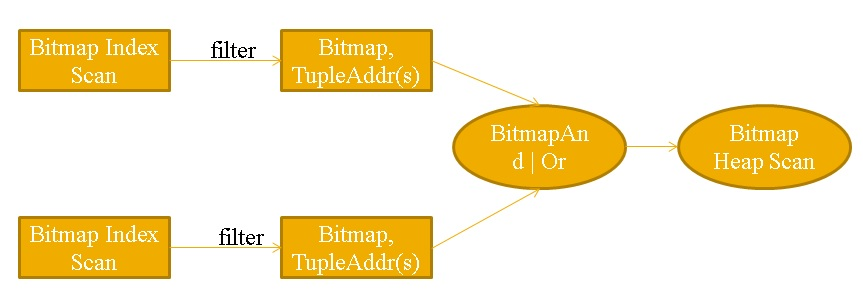
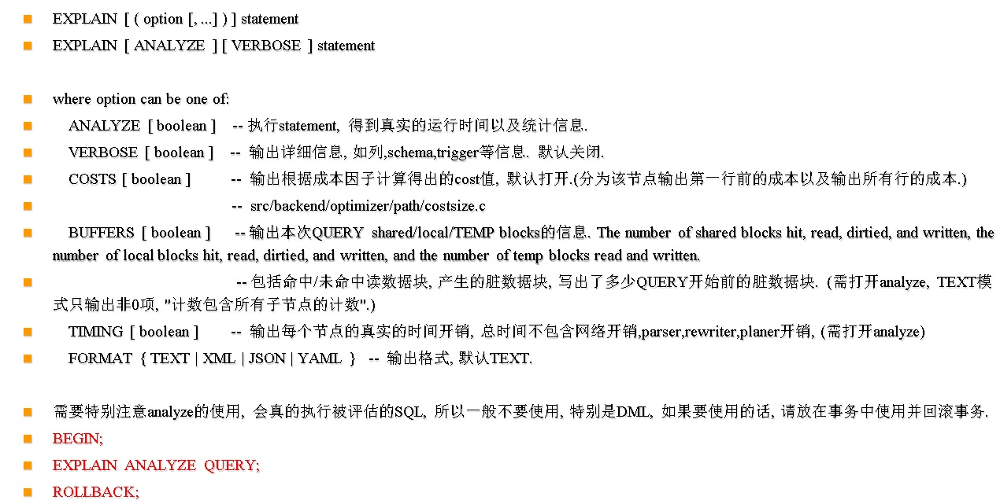
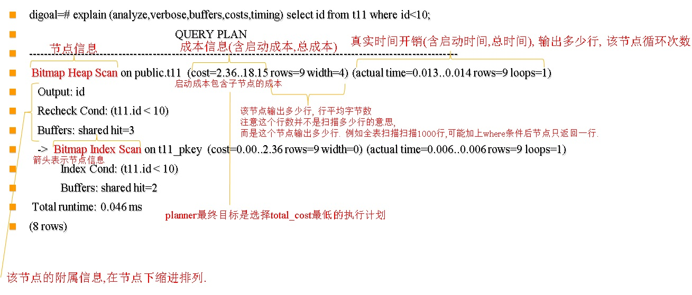
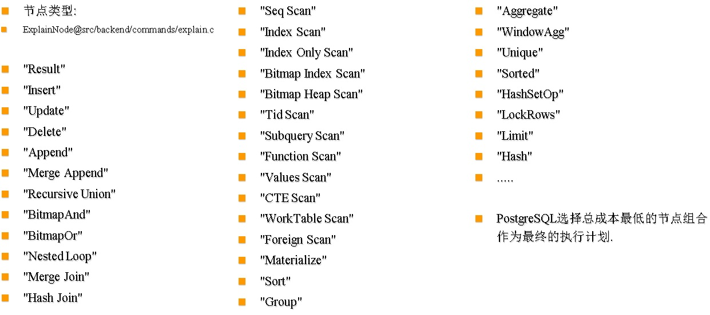

## 快速入门PostgreSQL应用开发与管理 - 8 PostgreSQL 管理    
##### [TAG 31](../class/31.md)
                                                                      
### 作者                                                                         
digoal                                                                 
                                                                  
### 日期                                                                                                                                     
2017-04-12                                                               
                                                                     
### 标签                                                                  
PostgreSQL , Linux                
                                                                                                                                        
----                                                                                                                                  
                                                                                                                                           
## 背景  
## 本章大纲
### 一、权限体系    
#### 1 逻辑结构      
#### 2 权限体系      
#### 3 schema使用 , 特别注意    
#### 4 用户      
#### 5 public      
#### 6 如何查看和解读一个对象的当前权限状态    
### 二、索引介绍    
#### 1 索引有什么用？    
#### 2 索引的类型    
#### 3 索引合并扫描    
#### 4 表膨胀检查    
#### 5 检查膨胀    
#### 6 索引维护    
### 三、系统配置    
#### 1 存储、文件系统规划    
#### 2 网络规划    
#### 3 CPU评估    
#### 4 内核配置    
#### 5 资源限制    
#### 6 防火墙配置    
### 四、数据库初始化    
#### 1 initdb 介绍    
#### 2 postgresql.conf参数配置    
#### 3 pg_hba.conf数据库防火墙配置    
### 五、PostgreSQL控制    
#### 1 环境变量配置    
#### 2 停库    
#### 3 重启    
#### 4 启动    
#### 5 Linux自启动服务    
### 六、数据库备份和还原    
#### 1 逻辑备份    
#### 2 逻辑还原    
#### 3 配置归档、流复制    
#### 4 创建流复制用户    
#### 5 配置流复制防火墙    
#### 6 远程物理基础备份      
#### 7 物理增量备份    
#### 8 PITR（时间点恢复）    
#### PITR 时间点恢复 例子       
### 七、数据库性能    
#### 1 参数优化    
#### 2 性能视图 pg_stat*    
#### 3 TOP SQL    
#### 4 AWR    
#### 5 auto_explain    
#### 6 explain解读    
### 八、数据库压测    
#### 1 pg_bench介绍    
#### 2 tpc-b测试    
#### 3 自定义测试    
### 九、日常维护 

## 第六章：PostgreSQL 管理   
### 1. 权限体系    
#### 逻辑结构      
最上层是实例，实例中允许创建多个数据库，每个数据库中可以创建多个schema，每个schema下面可以创建多个对象。      
      
对象包括表、物化视图、操作符、索引、视图、序列、函数、... 等等。      
      
      
      
在数据库中所有的权限都和角色（用户）挂钩，public是一个特殊角色，代表所有人。      
      
超级用户是有允许任意操作对象的，普通用户只能操作自己创建的对象。      
      
另外有一些对象是有赋予给public角色默认权限的，所以建好之后，所以人都有这些默认权限。        
      
#### 权限体系      
      
      
实例级别的权限由pg_hba.conf来控制，例如 ：       
      
```    
# TYPE  DATABASE        USER            ADDRESS                 METHOD    
# "local" is for Unix domain socket connections only    
local   all             all                                     trust    
# IPv4 local connections:    
host    all             all             127.0.0.1/32            trust    
host all postgres 0.0.0.0/0 reject    
host all all 0.0.0.0/0 md5    
```    
      
配置解释      
      
```    
允许任何本地用户无密码连接任何数据库      
      
不允许postgres用户从任何外部地址连接任何数据库      
      
允许其他任何用户从外部地址通过密码连接任何数据库      
```    
      
数据库级别的权限，包括允许连接数据库，允许在数据库中创建schema。      
      
默认情况下，数据库在创建后，允许public角色连接，即允许任何人连接。      
      
默认情况下，数据库在创建后，不允许除了超级用户和owner之外的任何人在数据库中创建schema。      
      
默认情况下，数据库在创建后，会自动创建名为public 的schema，这个schema的all权限已经赋予给public角色，即允许任何人在里面创建对象。      
      
schema级别的权限，包括允许查看schema中的对象，允许在schema中创建对象。      
      
默认情况下新建的schema的权限不会赋予给public角色，因此除了超级用户和owner，任何人都没有权限查看schema中的对象或者在schema中新建对象。      
      
#### schema使用 , 特别注意    
```    
According to the SQL standard, the owner of a schema always owns all objects within it.     
    
PostgreSQL allows schemas to contain objects owned by users other than the schema owner.     
    
This can happen only if the schema owner grants the CREATE privilege on his schema to someone else,     
or a superuser chooses to create objects in it.    
    
schema的owner默认是该schema下的所有对象的owner，但是PostgreSQL又允许用户在别人的schema下创建对象，所以一个对象可能属于两个owner，而且schema 的owner有 drop对象的权限。      
    
对于两个owner都有drop的权限，这个我个人认为是一个BUG。      
    
所以千万不要把自己的对象创建到别人的schema下面，那很危险。      
```    
      
对象级别的权限，每种类型的对象权限属性都不一样，具体请参考      
      
http://www.postgresql.org/docs/9.5/static/sql-grant.html      
      
以表为例，可以有SELECT | INSERT | UPDATE | DELETE | TRUNCATE | REFERENCES | TRIGGER这些权限。      
      
```    
GRANT { { SELECT | INSERT | UPDATE | DELETE | TRUNCATE | REFERENCES | TRIGGER }    
    [, ...] | ALL [ PRIVILEGES ] }    
    ON { [ TABLE ] table_name [, ...]    
         | ALL TABLES IN SCHEMA schema_name [, ...] }    
    TO role_specification [, ...] [ WITH GRANT OPTION ]    
    
GRANT { { SELECT | INSERT | UPDATE | REFERENCES } ( column_name [, ...] )    
    [, ...] | ALL [ PRIVILEGES ] ( column_name [, ...] ) }    
    ON [ TABLE ] table_name [, ...]    
    TO role_specification [, ...] [ WITH GRANT OPTION ]    
    
GRANT { { USAGE | SELECT | UPDATE }    
    [, ...] | ALL [ PRIVILEGES ] }    
    ON { SEQUENCE sequence_name [, ...]    
         | ALL SEQUENCES IN SCHEMA schema_name [, ...] }    
    TO role_specification [, ...] [ WITH GRANT OPTION ]    
    
GRANT { { CREATE | CONNECT | TEMPORARY | TEMP } [, ...] | ALL [ PRIVILEGES ] }    
    ON DATABASE database_name [, ...]    
    TO role_specification [, ...] [ WITH GRANT OPTION ]    
    
GRANT { USAGE | ALL [ PRIVILEGES ] }    
    ON DOMAIN domain_name [, ...]    
    TO role_specification [, ...] [ WITH GRANT OPTION ]    
    
GRANT { USAGE | ALL [ PRIVILEGES ] }    
    ON FOREIGN DATA WRAPPER fdw_name [, ...]    
    TO role_specification [, ...] [ WITH GRANT OPTION ]    
    
GRANT { USAGE | ALL [ PRIVILEGES ] }    
    ON FOREIGN SERVER server_name [, ...]    
    TO role_specification [, ...] [ WITH GRANT OPTION ]    
    
GRANT { EXECUTE | ALL [ PRIVILEGES ] }    
    ON { FUNCTION function_name ( [ [ argmode ] [ arg_name ] arg_type [, ...] ] ) [, ...]    
         | ALL FUNCTIONS IN SCHEMA schema_name [, ...] }    
    TO role_specification [, ...] [ WITH GRANT OPTION ]    
    
GRANT { USAGE | ALL [ PRIVILEGES ] }    
    ON LANGUAGE lang_name [, ...]    
    TO role_specification [, ...] [ WITH GRANT OPTION ]    
    
GRANT { { SELECT | UPDATE } [, ...] | ALL [ PRIVILEGES ] }    
    ON LARGE OBJECT loid [, ...]    
    TO role_specification [, ...] [ WITH GRANT OPTION ]    
    
GRANT { { CREATE | USAGE } [, ...] | ALL [ PRIVILEGES ] }    
    ON SCHEMA schema_name [, ...]    
    TO role_specification [, ...] [ WITH GRANT OPTION ]    
    
GRANT { CREATE | ALL [ PRIVILEGES ] }    
    ON TABLESPACE tablespace_name [, ...]    
    TO role_specification [, ...] [ WITH GRANT OPTION ]    
    
GRANT { USAGE | ALL [ PRIVILEGES ] }    
    ON TYPE type_name [, ...]    
    TO role_specification [, ...] [ WITH GRANT OPTION ]    
    
where role_specification can be:    
    
    [ GROUP ] role_name    
  | PUBLIC    
  | CURRENT_USER    
  | SESSION_USER    
    
GRANT role_name [, ...] TO role_name [, ...] [ WITH ADMIN OPTION ]    
```    
      
简单介绍一下grant的一些通用选项      
      
WITH ADMIN OPTION表示被赋予权限的用户，拿到对应的权限后，还能将对应的权限赋予给其他人，否则只能自己有这个权限，但是不能再赋予给其他人。      
      
#### 用户      
用户，角色在PostgreSQL是一个概念。        
    
#### public      
public角色，代表所有人的意思。      
    
#### 如何查看和解读一个对象的当前权限状态    
以表为例 ：       
      
```    
select relname,relacl from pg_class where relkind='r';    
```    
      
或者执行        
      
```    
SELECT n.nspname as "Schema",    
  c.relname as "Name",    
  CASE c.relkind WHEN 'r' THEN 'table' WHEN 'v' THEN 'view' WHEN 'm' THEN 'materialized view' WHEN 'S' THEN 'sequence' WHEN 'f' THEN 'foreign table' END as "Type",    
  pg_catalog.array_to_string(c.relacl, E'\n') AS "Access privileges",    
  pg_catalog.array_to_string(ARRAY(    
    SELECT attname || E':\n  ' || pg_catalog.array_to_string(attacl, E'\n  ')    
    FROM pg_catalog.pg_attribute a    
    WHERE attrelid = c.oid AND NOT attisdropped AND attacl IS NOT NULL    
  ), E'\n') AS "Column privileges",    
  pg_catalog.array_to_string(ARRAY(    
    SELECT polname    
    || CASE WHEN polcmd != '*' THEN    
           E' (' || polcmd || E'):'    
       ELSE E':'     
       END    
    || CASE WHEN polqual IS NOT NULL THEN    
           E'\n  (u): ' || pg_catalog.pg_get_expr(polqual, polrelid)    
       ELSE E''    
       END    
    || CASE WHEN polwithcheck IS NOT NULL THEN    
           E'\n  (c): ' || pg_catalog.pg_get_expr(polwithcheck, polrelid)    
       ELSE E''    
       END    || CASE WHEN polroles <> '{0}' THEN    
           E'\n  to: ' || pg_catalog.array_to_string(    
               ARRAY(    
                   SELECT rolname    
                   FROM pg_catalog.pg_roles    
                   WHERE oid = ANY (polroles)    
                   ORDER BY 1    
               ), E', ')    
       ELSE E''    
       END    
    FROM pg_catalog.pg_policy pol    
    WHERE polrelid = c.oid), E'\n')    
    AS "Policies"    
FROM pg_catalog.pg_class c    
     LEFT JOIN pg_catalog.pg_namespace n ON n.oid = c.relnamespace    
WHERE c.relkind IN ('r', 'v', 'm', 'S', 'f')    
  AND n.nspname !~ '^pg_' AND pg_catalog.pg_table_is_visible(c.oid)    
ORDER BY 1, 2;    
```    
      
得到权限说明如下      
      
```    
 Schema |      Name       |   Type   |       Access privileges        | Column privileges | Policies     
--------+-----------------+----------+--------------------------------+-------------------+----------    
 public | sbtest1         | table    | postgres=arwdDxt/postgres     +|                   |     
        |                 |          | digoal=a*r*w*d*D*x*t*/postgres |                   |     
 public | sbtest10        | table    | postgres=arwdDxt/postgres      |                   |     
 public | sbtest10_id_seq | sequence |                                |                   |     
 public | sbtest11        | table    | postgres=arwdDxt/postgres      |                   |     
 public | sbtest11_id_seq | sequence |                                |                   |     
 public | sbtest12        | table    | postgres=arwdDxt/postgres      |                   |     
 public | sbtest12_id_seq | sequence |                                |                   |     
```    
      
解释一下 Access privileges      
      
rolename=xxx 其中rolename就是被赋予权限的用户名，即权限被赋予给谁了?        
      
=xxx 表示这个权限赋予给了public角色，即所有人      
      
/yyyy 表示是谁赋予的这个权限?      
      
权限的含义如下      
      
```    
rolename=xxxx -- privileges granted to a role    
        =xxxx -- privileges granted to PUBLIC    
    
            r -- SELECT ("read")    
            w -- UPDATE ("write")    
            a -- INSERT ("append")    
            d -- DELETE    
            D -- TRUNCATE    
            x -- REFERENCES    
            t -- TRIGGER    
            X -- EXECUTE    
            U -- USAGE    
            C -- CREATE    
            c -- CONNECT    
            T -- TEMPORARY    
      arwdDxt -- ALL PRIVILEGES (for tables, varies for other objects)    
            * -- grant option for preceding privilege    
    
        /yyyy -- role that granted this privilege    
```    
      
例子      
      
赋予权限的人是postgres用户， sbtest2表的select权限被赋予给了digoal用户。      
      
```    
postgres=# grant select on sbtest2 to digoal;    
GRANT    
postgres=# \dp+ sbtest2    
                                  Access privileges    
 Schema |  Name   | Type  |     Access privileges     | Column privileges | Policies     
--------+---------+-------+---------------------------+-------------------+----------    
 public | sbtest2 | table | postgres=arwdDxt/postgres+|                   |     
        |         |       | digoal=r/postgres         |                   |     
(1 row)    
```    
      
回收权限一定要针对已有的权限来，如果你发现这里的权限还在，那照着权限回收即可。      
      
例如      
      
```    
revoke select on sbtest2 from digoal;      
```    
    
### 2. 索引介绍    
#### 索引有什么用？    
    
```    
加速TUPLE定位    
    
主键, 唯一约束    
    
排序    
```    
    
#### 索引的类型    
B-Tree：支持排序、范围查询、精确查询；适合所有数据类型，单个索引条目不能超过索引页的1/3。    
    
hash：支持等值查询；适合超长字段。    
    
gin：倒排索引，支持等值、包含、相交、等查询；适合多值类型（数组、全文检索等），任意字段组合查询。    
    
gist：R-Tree索引，支持包含，相交，距离，点面判断等查询；适合几何类型、范围类型、全文检索、异构类型等。    
    
sp-gist：空间分区（平衡）r-tree，支持包含，相交，距离，点面判断等查询；适合几何类型、范围类型、全文检索、异构类型等。    
    
brin：块级索引，适合物理存储与列值存在较好相关性的字段。比如时序数据、物联网传感数据、FEED数据等。支持范围查询、等值查询。    
    
rum：扩展索引接口，支持全文检索，支持附加标量类型的全文检索，支持带位置关系的全文检索。    
    
#### 索引合并扫描    
多个索引，PostgreSQL会使用bitmapAnd或bitmapOr合并扫描。    
    
    
    
#### 表膨胀检查    
```    
SELECT    
  current_database() AS db, schemaname, tablename, reltuples::bigint AS tups, relpages::bigint AS pages, otta,    
  ROUND(CASE WHEN otta=0 OR sml.relpages=0 OR sml.relpages=otta THEN 0.0 ELSE sml.relpages/otta::numeric END,1) AS tbloat,    
  CASE WHEN relpages < otta THEN 0 ELSE relpages::bigint - otta END AS wastedpages,    
  CASE WHEN relpages < otta THEN 0 ELSE bs*(sml.relpages-otta)::bigint END AS wastedbytes,    
  CASE WHEN relpages < otta THEN $$0 bytes$$::text ELSE (bs*(relpages-otta))::bigint || $$ bytes$$ END AS wastedsize,    
  iname, ituples::bigint AS itups, ipages::bigint AS ipages, iotta,    
  ROUND(CASE WHEN iotta=0 OR ipages=0 OR ipages=iotta THEN 0.0 ELSE ipages/iotta::numeric END,1) AS ibloat,    
  CASE WHEN ipages < iotta THEN 0 ELSE ipages::bigint - iotta END AS wastedipages,    
  CASE WHEN ipages < iotta THEN 0 ELSE bs*(ipages-iotta) END AS wastedibytes,    
  CASE WHEN ipages < iotta THEN $$0 bytes$$ ELSE (bs*(ipages-iotta))::bigint || $$ bytes$$ END AS wastedisize,    
  CASE WHEN relpages < otta THEN    
    CASE WHEN ipages < iotta THEN 0 ELSE bs*(ipages-iotta::bigint) END    
    ELSE CASE WHEN ipages < iotta THEN bs*(relpages-otta::bigint)    
      ELSE bs*(relpages-otta::bigint + ipages-iotta::bigint) END    
  END AS totalwastedbytes    
FROM (    
  SELECT    
    nn.nspname AS schemaname,    
    cc.relname AS tablename,    
    COALESCE(cc.reltuples,0) AS reltuples,    
    COALESCE(cc.relpages,0) AS relpages,    
    COALESCE(bs,0) AS bs,    
    COALESCE(CEIL((cc.reltuples*((datahdr+ma-    
      (CASE WHEN datahdr%ma=0 THEN ma ELSE datahdr%ma END))+nullhdr2+4))/(bs-20::float)),0) AS otta,    
    COALESCE(c2.relname,$$?$$) AS iname, COALESCE(c2.reltuples,0) AS ituples, COALESCE(c2.relpages,0) AS ipages,    
    COALESCE(CEIL((c2.reltuples*(datahdr-12))/(bs-20::float)),0) AS iotta -- very rough approximation, assumes all cols    
  FROM    
     pg_class cc    
  JOIN pg_namespace nn ON cc.relnamespace = nn.oid AND nn.nspname <> $$information_schema$$    
  LEFT JOIN    
  (    
    SELECT    
      ma,bs,foo.nspname,foo.relname,    
      (datawidth+(hdr+ma-(case when hdr%ma=0 THEN ma ELSE hdr%ma END)))::numeric AS datahdr,    
      (maxfracsum*(nullhdr+ma-(case when nullhdr%ma=0 THEN ma ELSE nullhdr%ma END))) AS nullhdr2    
    FROM (    
      SELECT    
        ns.nspname, tbl.relname, hdr, ma, bs,    
        SUM((1-coalesce(null_frac,0))*coalesce(avg_width, 2048)) AS datawidth,    
        MAX(coalesce(null_frac,0)) AS maxfracsum,    
        hdr+(    
          SELECT 1+count(*)/8    
          FROM pg_stats s2    
          WHERE null_frac<>0 AND s2.schemaname = ns.nspname AND s2.tablename = tbl.relname    
        ) AS nullhdr    
      FROM pg_attribute att     
      JOIN pg_class tbl ON att.attrelid = tbl.oid    
      JOIN pg_namespace ns ON ns.oid = tbl.relnamespace     
      LEFT JOIN pg_stats s ON s.schemaname=ns.nspname    
      AND s.tablename = tbl.relname    
      AND s.inherited=false    
      AND s.attname=att.attname,    
      (    
        SELECT    
          (SELECT current_setting($$block_size$$)::numeric) AS bs,    
            CASE WHEN SUBSTRING(SPLIT_PART(v, $$ $$, 2) FROM $$#"[0-9]+.[0-9]+#"%$$ for $$#$$)    
              IN ($$8.0$$,$$8.1$$,$$8.2$$) THEN 27 ELSE 23 END AS hdr,    
          CASE WHEN v ~ $$mingw32$$ OR v ~ $$64-bit$$ THEN 8 ELSE 4 END AS ma    
        FROM (SELECT version() AS v) AS foo    
      ) AS constants    
      WHERE att.attnum > 0 AND tbl.relkind=$$r$$    
      GROUP BY 1,2,3,4,5    
    ) AS foo    
  ) AS rs    
  ON cc.relname = rs.relname AND nn.nspname = rs.nspname    
  LEFT JOIN pg_index i ON indrelid = cc.oid    
  LEFT JOIN pg_class c2 ON c2.oid = i.indexrelid    
) AS sml order by wastedbytes desc limit 5    
```    
    
#### 检查膨胀    
```    
SELECT    
  current_database() AS db, schemaname, tablename, reltuples::bigint AS tups, relpages::bigint AS pages, otta,    
  ROUND(CASE WHEN otta=0 OR sml.relpages=0 OR sml.relpages=otta THEN 0.0 ELSE sml.relpages/otta::numeric END,1) AS tbloat,    
  CASE WHEN relpages < otta THEN 0 ELSE relpages::bigint - otta END AS wastedpages,    
  CASE WHEN relpages < otta THEN 0 ELSE bs*(sml.relpages-otta)::bigint END AS wastedbytes,    
  CASE WHEN relpages < otta THEN $$0 bytes$$::text ELSE (bs*(relpages-otta))::bigint || $$ bytes$$ END AS wastedsize,    
  iname, ituples::bigint AS itups, ipages::bigint AS ipages, iotta,    
  ROUND(CASE WHEN iotta=0 OR ipages=0 OR ipages=iotta THEN 0.0 ELSE ipages/iotta::numeric END,1) AS ibloat,    
  CASE WHEN ipages < iotta THEN 0 ELSE ipages::bigint - iotta END AS wastedipages,    
  CASE WHEN ipages < iotta THEN 0 ELSE bs*(ipages-iotta) END AS wastedibytes,    
  CASE WHEN ipages < iotta THEN $$0 bytes$$ ELSE (bs*(ipages-iotta))::bigint || $$ bytes$$ END AS wastedisize,    
  CASE WHEN relpages < otta THEN    
    CASE WHEN ipages < iotta THEN 0 ELSE bs*(ipages-iotta::bigint) END    
    ELSE CASE WHEN ipages < iotta THEN bs*(relpages-otta::bigint)    
      ELSE bs*(relpages-otta::bigint + ipages-iotta::bigint) END    
  END AS totalwastedbytes    
FROM (    
  SELECT    
    nn.nspname AS schemaname,    
    cc.relname AS tablename,    
    COALESCE(cc.reltuples,0) AS reltuples,    
    COALESCE(cc.relpages,0) AS relpages,    
    COALESCE(bs,0) AS bs,    
    COALESCE(CEIL((cc.reltuples*((datahdr+ma-    
      (CASE WHEN datahdr%ma=0 THEN ma ELSE datahdr%ma END))+nullhdr2+4))/(bs-20::float)),0) AS otta,    
    COALESCE(c2.relname,$$?$$) AS iname, COALESCE(c2.reltuples,0) AS ituples, COALESCE(c2.relpages,0) AS ipages,    
    COALESCE(CEIL((c2.reltuples*(datahdr-12))/(bs-20::float)),0) AS iotta -- very rough approximation, assumes all cols    
  FROM    
     pg_class cc    
  JOIN pg_namespace nn ON cc.relnamespace = nn.oid AND nn.nspname <> $$information_schema$$    
  LEFT JOIN    
  (    
    SELECT    
      ma,bs,foo.nspname,foo.relname,    
      (datawidth+(hdr+ma-(case when hdr%ma=0 THEN ma ELSE hdr%ma END)))::numeric AS datahdr,    
      (maxfracsum*(nullhdr+ma-(case when nullhdr%ma=0 THEN ma ELSE nullhdr%ma END))) AS nullhdr2    
    FROM (    
      SELECT    
        ns.nspname, tbl.relname, hdr, ma, bs,    
        SUM((1-coalesce(null_frac,0))*coalesce(avg_width, 2048)) AS datawidth,    
        MAX(coalesce(null_frac,0)) AS maxfracsum,    
        hdr+(    
          SELECT 1+count(*)/8    
          FROM pg_stats s2    
          WHERE null_frac<>0 AND s2.schemaname = ns.nspname AND s2.tablename = tbl.relname    
        ) AS nullhdr    
      FROM pg_attribute att     
      JOIN pg_class tbl ON att.attrelid = tbl.oid    
      JOIN pg_namespace ns ON ns.oid = tbl.relnamespace     
      LEFT JOIN pg_stats s ON s.schemaname=ns.nspname    
      AND s.tablename = tbl.relname    
      AND s.inherited=false    
      AND s.attname=att.attname,    
      (    
        SELECT    
          (SELECT current_setting($$block_size$$)::numeric) AS bs,    
            CASE WHEN SUBSTRING(SPLIT_PART(v, $$ $$, 2) FROM $$#"[0-9]+.[0-9]+#"%$$ for $$#$$)    
              IN ($$8.0$$,$$8.1$$,$$8.2$$) THEN 27 ELSE 23 END AS hdr,    
          CASE WHEN v ~ $$mingw32$$ OR v ~ $$64-bit$$ THEN 8 ELSE 4 END AS ma    
        FROM (SELECT version() AS v) AS foo    
      ) AS constants    
      WHERE att.attnum > 0 AND tbl.relkind=$$r$$    
      GROUP BY 1,2,3,4,5    
    ) AS foo    
  ) AS rs    
  ON cc.relname = rs.relname AND nn.nspname = rs.nspname    
  LEFT JOIN pg_index i ON indrelid = cc.oid    
  LEFT JOIN pg_class c2 ON c2.oid = i.indexrelid    
) AS sml order by wastedibytes desc limit 5    
```    
    
#### 索引维护    
1、新建索引    
    
```    
set maintenance_work_mem ='4GB';  -- 越大，创建索引越快    
set lock_timeout = '1s';  -- 避免长时间锁等待    
    
create index [CONCURRENTLY] xxx on xxx using xxx (colxxx);  -- 根据实际情况，是否使用 CONCURRENTLY（不堵塞读写）。    
```    
    
2、删除旧索引    
    
```    
set lock_timeout = '1s';  -- 避免长时间锁等待    
    
drop index oldindex;    
```    
    
3、PK\UK的维护，与之类似，增加一步骤。    
    
```    
ALTER TABLE tbl ADD    
    [ CONSTRAINT constraint_name ]    
    { UNIQUE | PRIMARY KEY } USING INDEX index_name    
    [ DEFERRABLE | NOT DEFERRABLE ] [ INITIALLY DEFERRED | INITIALLY IMMEDIATE ]    
```    
    
### 3. 系统配置    
    
#### 1、存储、文件系统规划    
    
索引盘：对应索引表空间。    
    
  空间评估、IOPS评估、带宽评估。建议采用SSD，文件系统采用ext4或xfs。    
    
数据盘：对应数据文件表空间。    
    
  空间评估、IOPS评估、带宽评估。建议采用SSD，文件系统采用ext4或xfs。    
    
重做日志盘：对应WAL目录。    
    
  空间评估、IOPS评估、带宽评估。建议采用SSD，文件系统采用ext4或xfs。    
    
归档盘：对应WAL归档目录。    
    
  空间评估、IOPS评估、带宽评估。可以采用机械盘，文件系统采用ext4或xfs或ZFS，可以开启文件系统压缩功能。    
    
备份盘：对应数据库备份目录。    
    
  空间评估、IOPS评估、带宽评估。可以采用机械盘，文件系统采用ext4或xfs或ZFS，可以开启文件系统压缩功能。    
    
日志盘(pg_log)：对应数据库审计、错误日志目录。    
    
  空间评估、IOPS评估、带宽评估。可以采用机械盘，文件系统采用ext4或xfs或ZFS，可以开启文件系统压缩功能。    
    
#### 2、网络规划    
    
带宽评估，网段规划，防火墙规划。    
    
不建议使用公网。    
    
#### 3、CPU评估    
    
根据业务需求，评估CPU主频，核数。建议实测性能指标。    
    
#### 4、内核配置    
    
/etc/sysctl.conf    
    
```    
# add by digoal.zhou    
fs.aio-max-nr = 1048576    
fs.file-max = 76724600    
kernel.core_pattern= /data01/corefiles/core_%e_%u_%t_%s.%p             
# /data01/corefiles事先建好，权限777，如果是软链接，对应的目录修改为777    
kernel.sem = 4096 2147483647 2147483646 512000        
# 信号量, ipcs -l 或 -u 查看，每16个进程一组，每组信号量需要17个信号量。    
kernel.shmall = 107374182          
# 所有共享内存段相加大小限制(建议内存的80%)    
kernel.shmmax = 274877906944       
# 最大单个共享内存段大小(建议为内存一半), >9.2的版本已大幅降低共享内存的使用    
kernel.shmmni = 819200             
# 一共能生成多少共享内存段，每个PG数据库集群至少2个共享内存段    
net.core.netdev_max_backlog = 10000    
net.core.rmem_default = 262144           
# The default setting of the socket receive buffer in bytes.    
net.core.rmem_max = 4194304              
# The maximum receive socket buffer size in bytes    
net.core.wmem_default = 262144           
# The default setting (in bytes) of the socket send buffer.    
net.core.wmem_max = 4194304              
# The maximum send socket buffer size in bytes.    
net.core.somaxconn = 4096    
net.ipv4.tcp_max_syn_backlog = 4096    
net.ipv4.tcp_keepalive_intvl = 20    
net.ipv4.tcp_keepalive_probes = 3    
net.ipv4.tcp_keepalive_time = 60    
net.ipv4.tcp_mem = 8388608 12582912 16777216    
net.ipv4.tcp_fin_timeout = 5    
net.ipv4.tcp_synack_retries = 2    
net.ipv4.tcp_syncookies = 1        
# 开启SYN Cookies。当出现SYN等待队列溢出时，启用cookie来处理，可防范少量的SYN攻击    
net.ipv4.tcp_timestamps = 1        
# 减少time_wait    
net.ipv4.tcp_tw_recycle = 0        
# 如果=1则开启TCP连接中TIME-WAIT套接字的快速回收，但是NAT环境可能导致连接失败，建议服务端关闭它    
net.ipv4.tcp_tw_reuse = 1          
# 开启重用。允许将TIME-WAIT套接字重新用于新的TCP连接    
net.ipv4.tcp_max_tw_buckets = 262144    
net.ipv4.tcp_rmem = 8192 87380 16777216    
net.ipv4.tcp_wmem = 8192 65536 16777216    
net.nf_conntrack_max = 1200000    
net.netfilter.nf_conntrack_max = 1200000    
vm.dirty_background_bytes = 409600000           
#  系统脏页到达这个值，系统后台刷脏页调度进程 pdflush（或其他） 自动将(dirty_expire_centisecs/100）秒前的脏页刷到磁盘    
vm.dirty_expire_centisecs = 3000                 
#  比这个值老的脏页，将被刷到磁盘。3000表示30秒。    
vm.dirty_ratio = 95                              
#  如果系统进程刷脏页太慢，使得系统脏页超过内存 95 % 时，则用户进程如果有写磁盘的操作（如fsync, fdatasync等调用），则需要主动把系统脏页刷出。    
#  有效防止用户进程刷脏页，在单机多实例，并且使用CGROUP限制单实例IOPS的情况下非常有效。      
vm.dirty_writeback_centisecs = 100                
#  pdflush（或其他）后台刷脏页进程的唤醒间隔， 100表示1秒。    
vm.mmap_min_addr = 65536    
vm.overcommit_memory = 0         
#  在分配内存时，允许少量over malloc, 如果设置为 1, 则认为总是有足够的内存，内存较少的测试环境可以使用 1 .      
vm.overcommit_ratio = 90         
#  当overcommit_memory = 2 时，用于参与计算允许指派的内存大小。    
vm.swappiness = 0                
#  关闭交换分区    
vm.zone_reclaim_mode = 0         
# 禁用 numa, 或者在vmlinux中禁止.     
net.ipv4.ip_local_port_range = 40000 65535        
# 本地自动分配的TCP, UDP端口号范围    
fs.nr_open=20480000    
# 单个进程允许打开的文件句柄上限    
    
# 以下参数请注意    
# vm.extra_free_kbytes = 4096000    
# vm.min_free_kbytes = 2097152    
# 如果是小内存机器，以上两个值不建议设置    
# vm.nr_hugepages = 66536        
#  建议shared buffer设置超过64GB时 使用大页，页大小 /proc/meminfo Hugepagesize    
# vm.lowmem_reserve_ratio = 1 1 1    
# 对于内存大于64G时，建议设置，否则建议默认值 256 256 32    
```    
    
sysctl -p    
    
#### 5、资源限制    
    
/etc/security/limits.conf    
    
```    
* soft    nofile  1024000    
* hard    nofile  1024000    
* soft    nproc   unlimited    
* hard    nproc   unlimited    
* soft    core    unlimited    
* hard    core    unlimited    
* soft    memlock unlimited    
* hard    memlock unlimited    
```    
    
#### 6、防火墙配置    
    
例子    
    
```    
# 私有网段    
-A INPUT -s 192.168.0.0/16 -j ACCEPT    
-A INPUT -s 10.0.0.0/8 -j ACCEPT    
-A INPUT -s 172.16.0.0/16 -j ACCEPT    
```    
    
### 4. 数据库初始化    
    
#### 1、initdb 介绍    
    
```    
initdb initializes a PostgreSQL database cluster.    
    
Usage:    
  initdb [OPTION]... [DATADIR]    
    
Options:    
  -A, --auth=METHOD         default authentication method for local connections    
      --auth-host=METHOD    default authentication method for local TCP/IP connections    
      --auth-local=METHOD   default authentication method for local-socket connections    
 [-D, --pgdata=]DATADIR     location for this database cluster    
  -E, --encoding=ENCODING   set default encoding for new databases    
      --locale=LOCALE       set default locale for new databases    
      --lc-collate=, --lc-ctype=, --lc-messages=LOCALE    
      --lc-monetary=, --lc-numeric=, --lc-time=LOCALE    
                            set default locale in the respective category for    
                            new databases (default taken from environment)    
      --no-locale           equivalent to --locale=C    
      --pwfile=FILE         read password for the new superuser from file    
  -T, --text-search-config=CFG    
                            default text search configuration    
  -U, --username=NAME       database superuser name    
  -W, --pwprompt            prompt for a password for the new superuser    
  -X, --xlogdir=XLOGDIR     location for the transaction log directory    
    
Less commonly used options:    
  -d, --debug               generate lots of debugging output    
  -k, --data-checksums      use data page checksums    
  -L DIRECTORY              where to find the input files    
  -n, --noclean             do not clean up after errors    
  -N, --nosync              do not wait for changes to be written safely to disk    
  -s, --show                show internal settings    
  -S, --sync-only           only sync data directory    
    
Other options:    
  -V, --version             output version information, then exit    
  -?, --help                show this help, then exit    
    
If the data directory is not specified, the environment variable PGDATA    
is used.    
```    
    
例子    
    
```    
initdb -D $PGDATA -E UTF8 --locale=C -U postgres -X $PG_XLOG -W    
```    
    
#### 2、postgresql.conf参数配置    
    
例子    
    
```      
listen_addresses = '0.0.0.0'      
port = 1921      
max_connections = 200      
tcp_keepalives_idle = 60      
tcp_keepalives_interval = 10      
tcp_keepalives_count = 6      
shared_buffers = 512MB      
maintenance_work_mem = 64MB      
dynamic_shared_memory_type = windows      
vacuum_cost_delay = 0      
bgwriter_delay = 10ms      
bgwriter_lru_maxpages = 1000      
bgwriter_lru_multiplier = 5.0      
bgwriter_flush_after = 0      
old_snapshot_threshold = -1      
wal_level = minimal      
synchronous_commit = off      
full_page_writes = on      
wal_buffers = 64MB      
wal_writer_delay = 10ms      
wal_writer_flush_after = 4MB      
checkpoint_timeout = 35min      
max_wal_size = 2GB      
min_wal_size = 80MB      
checkpoint_completion_target = 0.1      
checkpoint_flush_after = 0      
random_page_cost = 1.5      
log_destination = 'csvlog'      
logging_collector = on      
log_directory = 'pg_log'      
log_truncate_on_rotation = on      
log_checkpoints = on      
log_connections = on      
log_disconnections = on      
log_error_verbosity = verbose      
log_temp_files = 8192      
log_timezone = 'Asia/Hong_Kong'      
autovacuum = on      
log_autovacuum_min_duration = 0      
autovacuum_naptime = 20s      
autovacuum_vacuum_scale_factor = 0.05      
autovacuum_freeze_max_age = 1500000000      
autovacuum_multixact_freeze_max_age = 1600000000      
autovacuum_vacuum_cost_delay = 0      
vacuum_freeze_table_age = 1400000000      
vacuum_multixact_freeze_table_age = 1500000000      
datestyle = 'iso, mdy'      
timezone = 'Asia/Hong_Kong'      
lc_messages = 'C'      
lc_monetary = 'C'      
lc_numeric = 'C'      
lc_time = 'C'      
default_text_search_config = 'pg_catalog.english'      
```     
    
#### 3、pg_hba.conf数据库防火墙配置    
    
例子    
    
```      
host all all 0.0.0.0/0 md5      
```      
    
### 5. PostgreSQL控制    
#### 1、环境变量配置    
    
/home/digoal/.bash_profile    
    
```    
export PGPORT=1921      
export PGDATA=/home/digoal/pgdata      
export LANG=en_US.utf8      
export PGHOME=/home/digoal/pgsql9.6      
export LD_LIBRARY_PATH=$PGHOME/lib:/lib64:/usr/lib64:/usr/local/lib64:/lib:/usr/lib:/usr/local/lib:$LD_LIBRARY_PATH      
export PATH=$PGHOME/bin:$PATH:.      
export MANPATH=$PGHOME/share/man:$MANPATH      
export PGHOST=$PGDATA      
export PGUSER=postgres      
export PGDATABASE=postgres    
```    
    
#### 2、停库    
    
```    
pg_ctl stop -m fast -D $PGDATA    
```    
    
#### 3、重启    
    
```    
pg_ctl restart -m fast -D $PGDATA    
```    
    
#### 4、启动    
    
```    
pg_ctl start -D $PGDATA    
```    
    
#### 5、Linux自启动服务    
    
```    
vi /etc/rc.local    
    
su - digoal -c "pg_ctl start -D $PGDATA"    
```    
    
### 6. 数据库备份和还原    
#### 1、逻辑备份    
    
```    
pg_dump --help    
    
pg_dump dumps a database as a text file or to other formats.    
    
Usage:    
  pg_dump [OPTION]... [DBNAME]    
    
General options:    
  -f, --file=FILENAME          output file or directory name    
  -F, --format=c|d|t|p         output file format (custom, directory, tar,    
                               plain text (default))    
  -j, --jobs=NUM               use this many parallel jobs to dump    
  -v, --verbose                verbose mode    
  -V, --version                output version information, then exit    
  -Z, --compress=0-9           compression level for compressed formats    
  --lock-wait-timeout=TIMEOUT  fail after waiting TIMEOUT for a table lock    
  -?, --help                   show this help, then exit    
    
Options controlling the output content:    
  -a, --data-only              dump only the data, not the schema    
  -b, --blobs                  include large objects in dump    
  -c, --clean                  clean (drop) database objects before recreating    
  -C, --create                 include commands to create database in dump    
  -E, --encoding=ENCODING      dump the data in encoding ENCODING    
  -n, --schema=SCHEMA          dump the named schema(s) only    
  -N, --exclude-schema=SCHEMA  do NOT dump the named schema(s)    
  -o, --oids                   include OIDs in dump    
  -O, --no-owner               skip restoration of object ownership in    
                               plain-text format    
  -s, --schema-only            dump only the schema, no data    
  -S, --superuser=NAME         superuser user name to use in plain-text format    
  -t, --table=TABLE            dump the named table(s) only    
  -T, --exclude-table=TABLE    do NOT dump the named table(s)    
  -x, --no-privileges          do not dump privileges (grant/revoke)    
  --binary-upgrade             for use by upgrade utilities only    
  --column-inserts             dump data as INSERT commands with column names    
  --disable-dollar-quoting     disable dollar quoting, use SQL standard quoting    
  --disable-triggers           disable triggers during data-only restore    
  --enable-row-security        enable row security (dump only content user has    
                               access to)    
  --exclude-table-data=TABLE   do NOT dump data for the named table(s)    
  --if-exists                  use IF EXISTS when dropping objects    
  --inserts                    dump data as INSERT commands, rather than COPY    
  --no-security-labels         do not dump security label assignments    
  --no-synchronized-snapshots  do not use synchronized snapshots in parallel jobs    
  --no-tablespaces             do not dump tablespace assignments    
  --no-unlogged-table-data     do not dump unlogged table data    
  --quote-all-identifiers      quote all identifiers, even if not key words    
  --section=SECTION            dump named section (pre-data, data, or post-data)    
  --serializable-deferrable    wait until the dump can run without anomalies    
  --snapshot=SNAPSHOT          use given snapshot for the dump    
  --strict-names               require table and/or schema include patterns to    
                               match at least one entity each    
  --use-set-session-authorization    
                               use SET SESSION AUTHORIZATION commands instead of    
                               ALTER OWNER commands to set ownership    
    
Connection options:    
  -d, --dbname=DBNAME      database to dump    
  -h, --host=HOSTNAME      database server host or socket directory    
  -p, --port=PORT          database server port number    
  -U, --username=NAME      connect as specified database user    
  -w, --no-password        never prompt for password    
  -W, --password           force password prompt (should happen automatically)    
  --role=ROLENAME          do SET ROLE before dump    
    
If no database name is supplied, then the PGDATABASE environment    
variable value is used.    
```    
    
[《PostgreSQL 最佳实践 - 在线逻辑备份与恢复介绍》](../201608/20160823_01.md)     
    
例子    
    
备份digoal库, DDL中不包含表空间. 所以恢复时不需要提前创建对应的表空间.      
    
```    
pg_dump -f ./digoal.dmp -F p -C -E UTF8 --no-tablespaces -h 127.0.0.1 -p 1999 -U postgres digoal        
```    
    
#### 2、逻辑还原    
    
```    
pg_restore --help    
    
pg_restore restores a PostgreSQL database from an archive created by pg_dump.    
    
Usage:    
  pg_restore [OPTION]... [FILE]    
    
General options:    
  -d, --dbname=NAME        connect to database name    
  -f, --file=FILENAME      output file name    
  -F, --format=c|d|t       backup file format (should be automatic)    
  -l, --list               print summarized TOC of the archive    
  -v, --verbose            verbose mode    
  -V, --version            output version information, then exit    
  -?, --help               show this help, then exit    
    
Options controlling the restore:    
  -a, --data-only              restore only the data, no schema    
  -c, --clean                  clean (drop) database objects before recreating    
  -C, --create                 create the target database    
  -e, --exit-on-error          exit on error, default is to continue    
  -I, --index=NAME             restore named index    
  -j, --jobs=NUM               use this many parallel jobs to restore    
  -L, --use-list=FILENAME      use table of contents from this file for    
                               selecting/ordering output    
  -n, --schema=NAME            restore only objects in this schema    
  -O, --no-owner               skip restoration of object ownership    
  -P, --function=NAME(args)    restore named function    
  -s, --schema-only            restore only the schema, no data    
  -S, --superuser=NAME         superuser user name to use for disabling triggers    
  -t, --table=NAME             restore named relation (table, view, etc.)    
  -T, --trigger=NAME           restore named trigger    
  -x, --no-privileges          skip restoration of access privileges (grant/revoke)    
  -1, --single-transaction     restore as a single transaction    
  --disable-triggers           disable triggers during data-only restore    
  --enable-row-security        enable row security    
  --if-exists                  use IF EXISTS when dropping objects    
  --no-data-for-failed-tables  do not restore data of tables that could not be    
                               created    
  --no-security-labels         do not restore security labels    
  --no-tablespaces             do not restore tablespace assignments    
  --section=SECTION            restore named section (pre-data, data, or post-data)    
  --strict-names               require table and/or schema include patterns to    
                               match at least one entity each    
  --use-set-session-authorization    
                               use SET SESSION AUTHORIZATION commands instead of    
                               ALTER OWNER commands to set ownership    
    
Connection options:    
  -h, --host=HOSTNAME      database server host or socket directory    
  -p, --port=PORT          database server port number    
  -U, --username=NAME      connect as specified database user    
  -w, --no-password        never prompt for password    
  -W, --password           force password prompt (should happen automatically)    
  --role=ROLENAME          do SET ROLE before restore    
    
The options -I, -n, -P, -t, -T, and --section can be combined and specified    
multiple times to select multiple objects.    
    
If no input file name is supplied, then standard input is used.    
```    
    
如果备份为-F p格式，备份输出为文本，直接运行即可。    
    
```    
psql postgres postgres -f ./digoal.dmp      
```    
    
#### 3、配置归档、流复制    
    
要支持物理备份，务必打开归档，同时建议打开流复制。    
    
配置归档目录    
    
```    
# mkdir -p /disk1/digoal/arch    
# chown digoal:digoal /disk1/digoal/arch    
```    
    
配置流复制和归档    
    
vi postgresql.conf    
    
```    
max_worker_processes = 16      
    
max_wal_senders = 8    
  
wal_level = replica
    
archive_command = 'test ! -f /disk1/digoal/arch/%f && cp %p /disk1/digoal/arch/%f'    
```    
    
重启数据库    
    
```    
pg_ctl restart -m fast -D $PGDATA    
```    
    
#### 4、创建流复制用户    
    
```    
postgres=# create role rep replication login encrypted password 'rep123';    
CREATE ROLE    
```    
    
#### 5、配置流复制防火墙    
    
vi $PGDATA/pg_hba.conf    
    
```    
host replication rep 0.0.0.0/0 md5    
```    
    
pg_ctl reload -D $PGDATA    
    
#### 6、远程物理基础备份    
    
```    
pg_basebackup --help    
pg_basebackup takes a base backup of a running PostgreSQL server.    
    
Usage:    
  pg_basebackup [OPTION]...    
    
Options controlling the output:    
  -D, --pgdata=DIRECTORY receive base backup into directory    
  -F, --format=p|t       output format (plain (default), tar)    
  -r, --max-rate=RATE    maximum transfer rate to transfer data directory    
                         (in kB/s, or use suffix "k" or "M")    
  -R, --write-recovery-conf    
                         write recovery.conf after backup    
  -S, --slot=SLOTNAME    replication slot to use    
  -T, --tablespace-mapping=OLDDIR=NEWDIR    
                         relocate tablespace in OLDDIR to NEWDIR    
  -x, --xlog             include required WAL files in backup (fetch mode)    
  -X, --xlog-method=fetch|stream    
                         include required WAL files with specified method    
      --xlogdir=XLOGDIR  location for the transaction log directory    
  -z, --gzip             compress tar output    
  -Z, --compress=0-9     compress tar output with given compression level    
    
General options:    
  -c, --checkpoint=fast|spread    
                         set fast or spread checkpointing    
  -l, --label=LABEL      set backup label    
  -P, --progress         show progress information    
  -v, --verbose          output verbose messages    
  -V, --version          output version information, then exit    
  -?, --help             show this help, then exit    
    
Connection options:    
  -d, --dbname=CONNSTR   connection string    
  -h, --host=HOSTNAME    database server host or socket directory    
  -p, --port=PORT        database server port number    
  -s, --status-interval=INTERVAL    
                         time between status packets sent to server (in seconds)    
  -U, --username=NAME    connect as specified database user    
  -w, --no-password      never prompt for password    
  -W, --password         force password prompt (should happen automatically)    
```    
    
创建备份目录，备份可以通过流复制协议，备份到远程。    
    
```    
# mkdir -p /disk1/digoal/backup    
# chown digoal:digoal /disk1/digoal/backup    
```    
    
例子 1，通过流复制用户，以及流复制备份    
    
```    
export PGPASSWORD=rep123    
    
pg_basebackup -D /disk1/digoal/backup -F t -z -h 数据库IP -p 数据库端口 -U rep     
```    
    
例子 2，使用cp备份    
    
步骤如下    
    
```    
SQL:

select pg_start_backup('test');    
```
   
``` 
OS:

copy 数据文件，表空间等目录    
```   
  
``` 
SQL:

select pg_stop_backup();    
```    
    
#### 7、物理增量备份    
    
物理增量备份分为两种，    
    
一种是数据文件的增量备份，需要等10.0或者使用pg_rman, pg_probackup    
    
https://github.com/postgrespro/pg_probackup    
    
https://github.com/ossc-db/pg_rman    
    
另一种是归档增量备份。    
    
将归档文件拷贝到备份存储即可。    
    
#### 8、PITR（时间点恢复）    
    
1\. 如果是异机备份，首先要部署PostgreSQL软件环境，建议部署的PostgreSQL软件版本与备份的数据文件一致。编译参数一致。    
    
如何查看编译参数？在源库执行如下命令    
    
```    
pg_config    
```    
    
部署软件时，还需要部署源库所有的PostgreSQL插件，并且需要确保插件版本一致。    
    
2\. 构建恢复目录，需要有足够的空间。    
    
3\. 解压数据文件，归档到各自的目录。    
    
如果有表空间，将表空间使用软链连接到$PGDATA/pg_tblspc，或者将表空间解压到$PGDATA/pg_tblspc。    
    
4\. 修改postgresql.conf    
    
主要修改参数，包括监听端口，shared buffer, preload library 等，防止端口冲突导致启动失败。    
    
5\. 配置$PGDATA/recovery.conf，同时设置恢复目标    
    
主要配置，restore_command。（如果是搭建流复制备库，则需要配置的是#primary_conninfo = '' # e.g. 'host=localhost port=5432'。）    
    
```    
#restore_command = ''           # e.g. 'cp /mnt/server/archivedir/%f %p'    
```    
    
设置恢复到哪个时间点、XID或者target name。（如果是搭建流复制备库，则需要配置recovery_target_timeline = 'latest'）    
    
```    
#recovery_target_name = ''      # e.g. 'daily backup 2011-01-26'    
#    
#recovery_target_time = ''      # e.g. '2004-07-14 22:39:00 EST'    
#    
#recovery_target_xid = ''    
#    
#recovery_target_inclusive = true    
```    
    
6\. 启动恢复库    
    
```    
pg_ctl start -D 恢复库$PGDATA    
```    
    
#### PITR 时间点恢复 例子    
数据变更操作(主库)    
    
```    
postgres=# select pg_create_restore_point('digoal');      
 pg_create_restore_point       
-------------------------      
 1D6/FB17EC08      
(1 row)      
```    
    
首先要创建一个记录还原点XID的表。记录XID，时间，以及描述信息。（来代替pg_create_restore_point 系统函数的功能）      
      
```      
postgres=> create table restore_point(id serial primary key, xid int8, crt_time timestamp default now(), point text);      
CREATE TABLE      
```      
    
创建一个函数，代替pg_create_restore_point的功能，插入还原点。      
      
```      
postgres=> create or replace function create_restore_point(i_point text) returns void as $$      
declare       
begin      
  insert into restore_point(xid,point) values (txid_current(),i_point);      
end;      
$$ language plpgsql strict;      
CREATE FUNCTION      
```      
      
插入一个还原点      
      
```      
postgres=> select create_restore_point('digoal');      
 create_restore_point       
----------------------      
       
(1 row)      
```      
      
查询这个表的信息：     
    
```      
postgres=> select * from restore_point;      
 id |  xid   |          crt_time          | point        
----+--------+----------------------------+--------      
  1 | 561426 | 2015-06-19 09:18:57.525475 | digoal      
(1 row)      
postgres=> select * from restore_point where point='digoal';      
 id |  xid   |          crt_time          | point        
----+--------+----------------------------+--------      
  1 | 561426 | 2015-06-19 09:18:57.525475 | digoal      
(1 row)      
```      
      
接下来要模拟一下还原：      
      
```      
postgres=> create table test(id int,info text);      
CREATE TABLE      
postgres=> insert into test select generate_series(1,1000),md5(random()::text);      
INSERT 0 1000      
```      
      
记录当前哈希值。用于恢复后的比对。      
      
```      
postgres=> select sum(hashtext(t.*::text)) from test t;      
     sum            
--------------      
 -69739904784      
(1 row)      
```      
      
接下来我要做一笔删除操作，在删除前，我先创建一条还原点信息。      
      
```      
postgres=> select create_restore_point('before delete test');      
 create_restore_point       
----------------------      
       
(1 row)      
postgres=> delete from test;      
DELETE 1000      
postgres=> select * from restore_point where point='before delete test';      
 id |  xid   |          crt_time          |       point              
----+--------+----------------------------+--------------------      
  2 | 561574 | 2015-06-19 09:45:28.030295 | before delete test      
(1 row)      
```      
      
我只需要恢复到561574 即可。接下来就是模拟恢复了。      
    
主动产生一些XLOG，触发归档。      
      
```      
postgres=> select pg_xlogfile_name(pg_current_xlog_location());      
     pg_xlogfile_name           
--------------------------      
 000000010000000200000041      
(1 row)      
postgres=> insert into test select generate_series(1,100000);      
INSERT 0 100000      
postgres=> insert into test select generate_series(1,100000);      
INSERT 0 100000      
postgres=> select pg_xlogfile_name(pg_current_xlog_location());      
     pg_xlogfile_name           
--------------------------      
 000000010000000200000042      
(1 row)      
```      
      
下载阿里云RDS的备份和归档到本地。      
      
在本地需要安装一个postgresql, 与阿里云RDS的编译配置参数一致(例如数据块的大小)，最好使用的模块也一致，这里没有用到其他模块，所以无所谓。      
      
通过pg_settings来看一下RDS的配置信息，版本信息，方便我们在本地进行恢复。      
      
```      
postgres=> select name,setting,unit from pg_settings where category='Preset Options';      
         name          | setting | unit       
-----------------------+---------+------      
 block_size            | 8192    |        
 data_checksums        | on      |       
 integer_datetimes     | on      |       
 max_function_args     | 100     |       
 max_identifier_length | 63      |       
 max_index_keys        | 32      |       
 segment_size          | 131072  | 8kB      
 server_version        | 9.4.1   |       
 server_version_num    | 90401   |       
 wal_block_size        | 8192    |       
 wal_segment_size      | 2048    | 8kB      
(11 rows)      
postgres=> select version();      
                                                   version                                                          
--------------------------------------------------------------------------------------------------------------      
 PostgreSQL 9.4.1 on x86_64-unknown-linux-gnu, compiled by gcc (GCC) 4.4.6 20110731 (Red Hat 4.4.6-3), 64-bit      
(1 row)      
```      
      
本地编译安装PostgreSQL 9.4.1，编译参数与RDS一致。阿里云RDS这几个参数都是默认的。      
      
```      
  --with-blocksize=BLOCKSIZE      
                          set table block size in kB [8]      
  --with-segsize=SEGSIZE  set table segment size in GB [1]      
  --with-wal-blocksize=BLOCKSIZE      
                          set WAL block size in kB [8]      
  --with-wal-segsize=SEGSIZE      
                          set WAL segment size in MB [16]      
      
      
# useradd digoal      
# su - digoal      
$ vi .bash_profile      
# add by digoal      
export PS1="$USER@`/bin/hostname -s`-> "      
export PGPORT=1931      
export PGDATA=/home/digoal/pg_root      
export LANG=en_US.utf8      
export PGHOME=/home/digoal/pgsql9.4.1      
export LD_LIBRARY_PATH=$PGHOME/lib:/lib64:/usr/lib64:/usr/local/lib64:/lib:/usr/lib:/usr/local/lib:$LD_LIBRARY_PATH      
export DATE=`date +"%Y%m%d%H%M"`      
export PATH=$PGHOME/bin:$PATH:.      
export MANPATH=$PGHOME/share/man:$MANPATH      
export PGHOST=$PGDATA      
export PGDATABASE=postgres      
alias rm='rm -i'      
alias ll='ls -lh'      
unalias vi      
      
# wget https://ftp.postgresql.org/pub/source/v9.4.1/postgresql-9.4.1.tar.bz2      
# tar -jxvf postgresql-9.4.1.tar.bz2      
# cd postgresql-9.4.1      
# ./configure --prefix=/home/digoal/pgsql9.4.1 --with-pgport=1931 --with-perl --with-python --with-tcl --with-openssl --with-pam --with-ldap --with-libxml --with-libxslt --enable-thread-safety --enable-debug      
# gmake world && gmake install-world      
```      
      
下载备份和归档文件，解压：      
      
基础备份选择需要恢复的时间点之前的一个备份，归档则选择在此之后的所有归档文件。      
      
```      
total 453M      
-rw-r--r-- 1 root   root    17M Jun 19 10:23 000000010000000200000040.tar.gz      
-rw-r--r-- 1 root   root    17M Jun 19 10:23 000000010000000200000041.tar.gz      
-rw-r--r-- 1 root   root   404M Jun 19 10:23 hins668881_xtra_20150618232331.tar.gz      
      
# mkdir /home/digoal/pg_root      
# mv hins668881_xtra_20150618232331.tar.gz /home/digoal/pg_root      
# tar -zxvf hins668881_xtra_20150618232331.tar.gz      
[root@db-172-16-3-150 ~]# tar -xvf 000000010000000200000040.tar.gz       
000000010000000200000040      
[root@db-172-16-3-150 ~]# tar -xvf 000000010000000200000041.tar.gz       
000000010000000200000041      
[root@db-172-16-3-150 ~]# mv 000000010000000200000040 /home/digoal/      
[root@db-172-16-3-150 ~]# mv 000000010000000200000041 /home/digoal/      
[root@db-172-16-3-150 ~]# chown -R digoal:digoal /home/digoal      
[root@db-172-16-3-150 ~]# chmod -R 700 /home/digoal/pg_root      
```      
      
修改配置文件，注释掉阿里云RDS PG的一些定制参数。      
      
```      
$ vi postgresql.conf      
    
port=1931      
      
注释RDS自定义的GUC参数      
#rds_enable_proxy=on      
#rds_available_extensions='plpgsql,pg_stat_statements,btree_gin,btree_gist,chkpass,citext,cube,dblink,dict_int,earthdistance,hstore,intagg,intarray,isn,ltree,pgcrypto,pgrowlocks,pg_prewarm,pg_trgm,postgres_fdw,sslinfo,tablefunc,tsearch2,unaccent,postgis,postgis_topology,fuzzystrmatch,postgis_tiger_geocoder,plperl,pltcl,plv8,plls,plcoffee,"uuid-ossp"'      
#rds_enable_admin_user_as_super=on      
```      
      
配置recovery.conf      
      
打开hot_standby，恢复到目标点后暂停，如果确认已经到达，使用resume激活。      
      
```      
$ vi recovery.conf      
standby_mode = 'on'      
restore_command = 'cp /home/digoal/%f %p'                 
recovery_target_xid='561574'  # 使用我们自建的恢复点的XID      
recovery_target_inclusive=true      
pause_at_recovery_target=true      
```      
      
启动数据库      
      
```      
$ pg_ctl start      
```      
      
检查是否恢复到指定XID      
      
```      
digoal@db-172-16-3-150-> psql -h 127.0.0.1 -p 1931      
psql (9.4.1)      
Type "help" for help.      
      
postgres=> \dt      
             List of relations      
 Schema |      Name       | Type  | Owner        
--------+-----------------+-------+--------      
 public | ha_health_check | table | aurora      
 public | login_log       | table | digoal      
 public | restore_point   | table | digoal      
 public | session         | table | digoal      
 public | tbl_small       | table | digoal      
 public | test            | table | digoal      
 public | userinfo        | table | digoal      
(7 rows)      
```      
      
检查，已经恢复到DELETE test表的数据之前了。      
      
```      
postgres=> select count(*) from test;      
 count       
-------      
  1000      
(1 row)      
postgres=> select sum(hashtext(t.*::text)) from test t;      
     sum            
--------------      
 -69739904784      
(1 row)      
```      
    
### 7. 数据库性能    
    
#### 1、参数优化    
    
假设 512GB 内存, SSD.     
    
```    
listen_addresses = '0.0.0.0'    
port = 1921    
max_connections = 5000    
unix_socket_directories = '.'  # 确保unix socket处于安全目录    
tcp_keepalives_idle = 60       # 避免网络层设备主动断开空闲连接的问题    
tcp_keepalives_interval = 10   # 避免网络层设备主动断开空闲连接的问题    
tcp_keepalives_count = 10      # 避免网络层设备主动断开空闲连接的问题    
shared_buffers = 128GB         # 1/4 物理内存    
maintenance_work_mem = 4GB     # 加速创建索引，VACUUM垃圾回收，平时最多消耗 maintenance_work_mem * autovacuum_max_workers 内存    
dynamic_shared_memory_type = posix    
vacuum_cost_delay = 0          # SSD, 建议设置为0, 不打断vacuum    
bgwriter_delay = 10ms          # 快速刷shared buffer脏页    
bgwriter_lru_maxpages = 1000       
bgwriter_lru_multiplier = 10.0    
bgwriter_flush_after = 0       # IO很好的机器，不需要考虑平滑调度。否则建议设置为大于0    
max_worker_processes = 128    
max_parallel_workers_per_gather = 0    
old_snapshot_threshold = -1    
backend_flush_after = 0        # IO很好的机器，不需要考虑平滑调度    
wal_level = replica    
synchronous_commit = off       # 异步提交    
full_page_writes = on          # COW文件系统，或者对齐并支持BLOCK_SIZE大小原子写的SSD，可以关闭，提高性能，减少WAL的写入量。    
wal_buffers = 1GB    
wal_writer_delay = 10ms    
wal_writer_flush_after = 0     # IO很好的机器，不需要考虑平滑调度    
checkpoint_timeout = 30min     # 不建议频繁做检查点，否则XLOG会产生很多的FULL PAGE WRITE。    
max_wal_size = 256GB           # 建议设置为SHARED BUFFER的2倍    
min_wal_size = 32GB    
checkpoint_completion_target = 0.05    # 硬盘好的情况下，可以让检查点快速结束，恢复时也可以快速达到一致状态。    
checkpoint_flush_after = 0             # IO很好的机器，不需要考虑平滑调度    
archive_mode = on    
archive_command = '/bin/date'          #  后期再修改，如  'test ! -f /disk1/digoal/arch/%f && cp %p /disk1/digoal/arch/%f'    
max_wal_senders = 8    
random_page_cost = 1.3                 # IO很好的机器，不需要考虑离散和顺序扫描的成本差异    
parallel_tuple_cost = 0    
parallel_setup_cost = 0    
min_parallel_relation_size = 0    
effective_cache_size = 300GB           # 看着办，减掉数据库shared buffer, maintenance work mem, work mem, wal shared buffer，剩下的都是OS可用的CACHE。    
force_parallel_mode = off    
log_destination = 'csvlog'    
logging_collector = on    
log_truncate_on_rotation = on    
log_checkpoints = on    
log_connections = on    
log_disconnections = on    
log_error_verbosity = verbose    
log_timezone = 'PRC'    
autovacuum = on    
log_autovacuum_min_duration = 0    
autovacuum_max_workers = 16             # CPU核多，并且IO好的情况下，可多点，但是注意 16*autovacuum mem ，会消耗较多内存，所以内存也要有基础。      
autovacuum_naptime = 20s    
autovacuum_vacuum_scale_factor = 0.05   # 垃圾版本超过5%时，触发垃圾回收    
vacuum_freeze_min_age = 50000000        # 年龄超过5000万的记录，都设置为冻结年龄    
vacuum_multixact_freeze_min_age = 5000000       
autovacuum_freeze_max_age = 1600000000      # 表的年龄超过16亿时，强制触发vacuum freeze(即使没有开启autovacuum)    
vacuum_freeze_table_age = 1200000000        # 表的年龄超过12亿时，autovacuum 触发vacuum freeze    
vacuum_multixact_freeze_table_age = 1100000000        
datestyle = 'iso, mdy'    
timezone = 'PRC'    
lc_messages = 'C'    
lc_monetary = 'C'    
lc_numeric = 'C'    
lc_time = 'C'    
default_text_search_config = 'pg_catalog.english'    
shared_preload_libraries='pg_stat_statements'    
```    
    
#### 2、性能视图 pg_stat*    
    
```    
                     List of relations    
   Schema   |            Name             | Type |  Owner       
------------+-----------------------------+------+----------    
 pg_catalog | pg_stat_activity            | view | postgres    
 pg_catalog | pg_stat_all_indexes         | view | postgres    
 pg_catalog | pg_stat_all_tables          | view | postgres    
 pg_catalog | pg_stat_archiver            | view | postgres    
 pg_catalog | pg_stat_bgwriter            | view | postgres    
 pg_catalog | pg_stat_database            | view | postgres    
 pg_catalog | pg_stat_database_conflicts  | view | postgres    
 pg_catalog | pg_stat_progress_vacuum     | view | postgres    
 pg_catalog | pg_stat_replication         | view | postgres    
 pg_catalog | pg_stat_ssl                 | view | postgres    
 pg_catalog | pg_stat_sys_indexes         | view | postgres    
 pg_catalog | pg_stat_sys_tables          | view | postgres    
 pg_catalog | pg_stat_user_functions      | view | postgres    
 pg_catalog | pg_stat_user_indexes        | view | postgres    
 pg_catalog | pg_stat_user_tables         | view | postgres    
 pg_catalog | pg_stat_wal_receiver        | view | postgres    
 pg_catalog | pg_stat_xact_all_tables     | view | postgres    
 pg_catalog | pg_stat_xact_sys_tables     | view | postgres    
 pg_catalog | pg_stat_xact_user_functions | view | postgres    
 pg_catalog | pg_stat_xact_user_tables    | view | postgres    
 pg_catalog | pg_statio_all_indexes       | view | postgres    
 pg_catalog | pg_statio_all_sequences     | view | postgres    
 pg_catalog | pg_statio_all_tables        | view | postgres    
 pg_catalog | pg_statio_sys_indexes       | view | postgres    
 pg_catalog | pg_statio_sys_sequences     | view | postgres    
 pg_catalog | pg_statio_sys_tables        | view | postgres    
 pg_catalog | pg_statio_user_indexes      | view | postgres    
 pg_catalog | pg_statio_user_sequences    | view | postgres    
 pg_catalog | pg_statio_user_tables       | view | postgres    
 pg_catalog | pg_stats                    | view | postgres    
(30 rows)    
```    
    
#### 3、TOP SQL    
    
pg_stat_statements插件，统计SQL调用的资源消耗。    
  
postgresql.conf  
  
```    
shared_preload_libraries = 'pg_stat_statements';    
```    
    
创建extension:  
  
```    
create extension pg_stat_statements;    
```
    
TOP 5 CPU_TIME SQL    
    
```    
select c.rolname,b.datname,a.total_time/a.calls per_call_time,a.* from pg_stat_statements a, pg_database b, pg_authid c where a.userid=c.oid and a.dbid=b.oid order by a.total_time desc limit 5;    
```    
    
#### 4、AWR    
    
[《PostgreSQL AWR报告(for 阿里云ApsaraDB PgSQL)》](../201611/20161123_01.md)     
    
#### 5、auto_explain    
    
打印超时SQL当时的执行计划。    
    
```    
shared_preload_libraries = 'auto_explain'    
    
配置    
auto_explain.log_analyze = on                       
auto_explain.log_nested_statements = on             
auto_explain.log_buffers = on               
auto_explain.log_min_duration = '1s'          
auto_explain.log_timing = on                
auto_explain.log_verbose = on    
```    
    
#### 6、explain解读    
    
explain 语法    
    
    
    
explain 例子    
    
    
    
explain 节点    
    
    
    
### 8. 数据库压测    
    
#### pg_bench介绍    
    
```    
pgbench --help    
    
pgbench is a benchmarking tool for PostgreSQL.    
    
Usage:    
  pgbench [OPTION]... [DBNAME]    
    
Initialization options:    
  -i, --initialize         invokes initialization mode    
  -F, --fillfactor=NUM     set fill factor    
  -n, --no-vacuum          do not run VACUUM after initialization    
  -q, --quiet              quiet logging (one message each 5 seconds)    
  -s, --scale=NUM          scaling factor    
  --foreign-keys           create foreign key constraints between tables    
  --index-tablespace=TABLESPACE    
                           create indexes in the specified tablespace    
  --tablespace=TABLESPACE  create tables in the specified tablespace    
  --unlogged-tables        create tables as unlogged tables    
    
Options to select what to run:    
  -b, --builtin=NAME[@W]   add builtin script NAME weighted at W (default: 1)    
                           (use "-b list" to list available scripts)    
  -f, --file=FILENAME[@W]  add script FILENAME weighted at W (default: 1)    
  -N, --skip-some-updates  skip updates of pgbench_tellers and pgbench_branches    
                           (same as "-b simple-update")    
  -S, --select-only        perform SELECT-only transactions    
                           (same as "-b select-only")    
    
Benchmarking options:    
  -c, --client=NUM         number of concurrent database clients (default: 1)    
  -C, --connect            establish new connection for each transaction    
  -D, --define=VARNAME=VALUE    
                           define variable for use by custom script    
  -j, --jobs=NUM           number of threads (default: 1)    
  -l, --log                write transaction times to log file    
  -L, --latency-limit=NUM  count transactions lasting more than NUM ms as late    
  -M, --protocol=simple|extended|prepared    
                           protocol for submitting queries (default: simple)    
  -n, --no-vacuum          do not run VACUUM before tests    
  -P, --progress=NUM       show thread progress report every NUM seconds    
  -r, --report-latencies   report average latency per command    
  -R, --rate=NUM           target rate in transactions per second    
  -s, --scale=NUM          report this scale factor in output    
  -t, --transactions=NUM   number of transactions each client runs (default: 10)    
  -T, --time=NUM           duration of benchmark test in seconds    
  -v, --vacuum-all         vacuum all four standard tables before tests    
  --aggregate-interval=NUM aggregate data over NUM seconds    
  --progress-timestamp     use Unix epoch timestamps for progress    
  --sampling-rate=NUM      fraction of transactions to log (e.g., 0.01 for 1%)    
    
Common options:    
  -d, --debug              print debugging output    
  -h, --host=HOSTNAME      database server host or socket directory    
  -p, --port=PORT          database server port number    
  -U, --username=USERNAME  connect as specified database user    
  -V, --version            output version information, then exit    
  -?, --help               show this help, then exit    
```    
    
#### tpc-b测试    
    
```    
  \set aid random(1, 100000 * :scale)    
  \set bid random(1, 1 * :scale)    
  \set tid random(1, 10 * :scale)    
  \set delta random(-5000, 5000)    
  BEGIN;    
  UPDATE pgbench_accounts SET abalance = abalance + :delta WHERE aid = :aid;    
  SELECT abalance FROM pgbench_accounts WHERE aid = :aid;    
  UPDATE pgbench_tellers SET tbalance = tbalance + :delta WHERE tid = :tid;    
  UPDATE pgbench_branches SET bbalance = bbalance + :delta WHERE bid = :bid;    
  INSERT INTO pgbench_history (tid, bid, aid, delta, mtime) VALUES (:tid, :bid, :aid, :delta, CURRENT_TIMESTAMP);    
  END;    
```    
    
初始化数据, 1000万记录。    
    
```    
export PGPASSWORD=密码    
    
pgbench -i -s 100    
```    
    
测试    
    
```    
export PGPASSWORD=密码    
    
pgbench -M prepared -n -r -P 1 -c 连接数 -j 线程数 -h 主机IP -p 端口 -U 用户 数据库名 -T 时间(秒)    
```    
    
#### 自定义测试    
    
创建测试表    
    
```    
create table test(id int primary key, info text, crt_time timestamp);    
```    
    
创建脚本    
    
```    
vi test.sql    
    
\set id random(1,100000000)    
insert into test (id,info,crt_time) values (:id, md5(random()::text), now()) on conflict (id) do update set info=excluded.info, crt_time=excluded.crt_time;    
```    
    
压测    
    
```    
pgbench -M prepared -n -r -P 1 -f ./test.sql -c 32 -j 32 -T 100    
progress: 1.0 s, 246533.1 tps, lat 0.128 ms stddev 0.536    
progress: 2.0 s, 254653.8 tps, lat 0.125 ms stddev 0.333    
progress: 3.0 s, 232433.6 tps, lat 0.137 ms stddev 0.812    
progress: 4.0 s, 258225.7 tps, lat 0.123 ms stddev 0.250    
```    
    
### 9. 日常维护  
1、AWR健康报告  
  
2、垃圾回收  
  
3、膨胀索引重建  
  
4、TOP SQL性能优化  
  
5、错误日志分析  
  
6、安全风险评估（SQL注入、暴力破解、密码周期修改）  
  
7、备份可用性校验  
  
8、历史备份和归档清理  
  
9、历史数据清理  
  
10、实时监控系统建设  
  
11、HA建设、监控、演练  
  
12、容灾建设、监控、演练  
  
13、审计系统建设  
  
14、业务逻辑优化  
  
15、内核优化  
  
16、版本升级、BUG FIX  
  
17、社区交流  
  
<a rel="nofollow" href="http://info.flagcounter.com/h9V1"  ></a>  
  
  
  
  
  
  
## [digoal's 大量PostgreSQL文章入口](https://github.com/digoal/blog/blob/master/README.md "22709685feb7cab07d30f30387f0a9ae")
  
