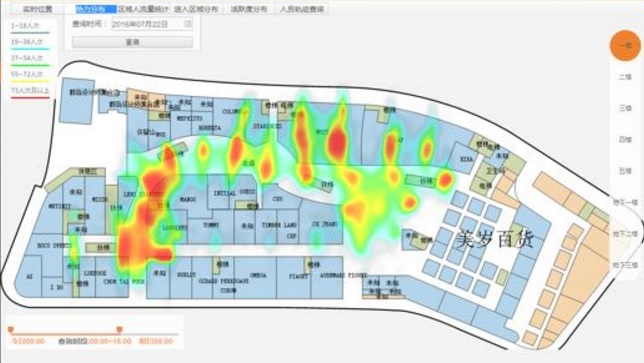

## 奔跑吧，大屏 - 时间+空间 实时四维数据透视  
##### [TAG 15](../class/15.md) , [TAG 18](../class/18.md)
                              
### 作者                                 
digoal                         
                          
### 日期                                                                                             
2017-04-13                       
                             
### 标签                          
PostgreSQL , 递归查询 , 大屏播报 , 最拥堵的路口 , 最旺的商铺 , 某个区域最拥堵的厕所 , 数据透视 , 流式计算 , 时序数据      
                                                                                                
----                                                                                          
                                                                                                   
## 背景     
  
  
随着物联网的发展，数据的产生越来越快。比如马路的汽车通过数据，用户的驻留数据，水纹传感器的数据，电商的FEED数据，网约车的轨迹数据 等等。  
  
这么多的数据，用途也不一样，有需要流式实时统计的，也有时序处理相关需求的，还有全量分析需求的。   
  
这些都有对应的解决方案。  
  
[《流计算风云再起 - PostgreSQL携PipelineDB力挺IoT》](../201612/20161220_01.md)    
  
[《时序数据库有哪些特点? TimescaleDB时序数据库介绍》](../201704/20170409_05.md)    
  
[《ApsaraDB的左右互搏(PgSQL+HybridDB+OSS) - 解决OLTP+OLAP混合需求》](../201701/20170101_02.md)    
  
以指挥中心的大屏为例，有一些需求就很有意思，比如  
  
1\. 展示最新的传感器TOP VALUE数据。  
  
2\. 选择时间轴，按区域，展示人流量。  
  
## 例子  
### 1 输出所有传感器上报的最新值  
这个需要和我之前写的这个例子很相似。  
  
[《时序数据合并场景加速分析和实现 - 复合索引，窗口分组查询加速，变态递归加速》](../201611/20161128_01.md)    
  
设计表结构，gid表示传感器ID，val是上传的值，crt_time是时间。  
  
假设有1万个传感器，插入1000万条记录。  
  
```  
create unlogged table sort_test(  
  id serial8 primary key,          -- 自增主键  
  s_id int,                        -- 传感器ID  
  val  numeric(10,2),              -- 传感器值  
  crt_time timestamp default clock_timestamp()    -- 上报时间  
);    
```  
  
写入1000万传感器测试数据  
  
```  
postgres=# insert into sort_test (s_id,val) select random()*10000, random()*100 from generate_series(1,10000000);  
INSERT 0 10000000  
```  
  
创建索引  
  
```  
postgres=# create index idx_test on sort_test using btree(s_id,id desc);  
```  
  
使用递归调用的方法，获取所有传感器的最新值(以每个传感器的最大的自增ID为最新上报标记)  
  
```  
create type r as (s_id int, val numeric(10,2));  -- 复合类型  
  
with recursive skip as (    
  (    
    select (s_id,val)::r as r from sort_test where id in (select id from sort_test where s_id is not null order by s_id,id desc limit 1)   
  )    
  union all    
  (    
    select (  
      select (s_id,val)::r as r from sort_test where id in (select id from sort_test t where t.s_id>(s.r).s_id and t.s_id is not null order by s_id,id desc limit 1)   
    ) from skip s where (s.r).s_id is not null  
  )               -- 这里的where (s.r).s_id is not null 一定要加, 否则就死循环了.   
)     
select (t.r).s_id, (t.r).val from skip t where t.* is not null;   
```  
  
1000万条记录，筛选1万条最新记录，耗费时间：129毫秒。  
  
为什么能这么快？因为用了递归，减少了扫描量和运算量。  
  
```  
 s_id  |  val    
-------+-------  
     0 | 83.55  
     1 | 91.62  
     2 | 72.70  
     3 | 45.46  
     4 | 99.97  
     5 | 17.04  
     6 |  8.96  
     7 | 25.83  
     8 | 28.10  
     9 | 26.19  
    10 | 83.03  
    11 |  1.30  
......  
Time: 128.779 ms  
```  
  
使用游标则更快，一次获取10条，仅花费0.36毫秒。  
  
```  
postgres=# begin;  
BEGIN  
Time: 0.095 ms  
postgres=# declare cur cursor for with recursive skip as (    
  (    
    select (s_id,val)::r as r from sort_test where id in (select id from sort_test where s_id is not null order by s_id,id desc limit 1)   
  )    
  union all    
  (    
    select (  
      select (s_id,val)::r as r from sort_test where id in (select id from sort_test t where t.s_id>(s.r).s_id and t.s_id is not null order by s_id,id desc limit 1)   
    ) from skip s where (s.r).s_id is not null  
  )               -- 这里的where (s.r).s_id is not null 一定要加, 否则就死循环了.   
)     
select (t.r).s_id, (t.r).val from skip t where t.* is not null;  
DECLARE CURSOR  
Time: 0.841 ms  
postgres=# fetch 10 from cur;  
 s_id |  val    
------+-------  
    0 | 83.55  
    1 | 91.62  
    2 | 72.70  
    3 | 45.46  
    4 | 99.97  
    5 | 17.04  
    6 |  8.96  
    7 | 25.83  
    8 | 28.10  
    9 | 26.19  
(10 rows)  
  
Time: 0.364 ms  
```  
  
### 2 输出某个城市的车流TOP 10路口  
  
  
相比第一个例子，做了一次收敛，按VALUE排序，输出最大的。  
  
假设每个路口有传感器不断上报路口通过的车流数量。大屏展示通过量最大的10个路口。  
  
为了测试方便，我这里依旧使用第一个例子的数据，末尾加上。  
  
```  
postgres=# with recursive skip as (    
  (    
    select (s_id,val)::r as r from sort_test where id in (select id from sort_test where s_id is not null order by s_id,id desc limit 1)   
  )    
  union all    
  (    
    select (  
      select (s_id,val)::r as r from sort_test where id in (select id from sort_test t where t.s_id>(s.r).s_id and t.s_id is not null order by s_id,id desc limit 1)   
    ) from skip s where (s.r).s_id is not null  
  )               -- 这里的where (s.r).s_id is not null 一定要加, 否则就死循环了.   
)     
select (t.r).s_id, (t.r).val from skip t where t.* is not null order by 2 desc limit 10;   
  
  
 s_id |  val    
------+-------  
  997 | 99.99  
 2233 | 99.97  
  610 | 99.97  
    4 | 99.97  
 6735 | 99.96  
  545 | 99.93  
 2992 | 99.91  
 4747 | 99.90  
  543 | 99.89  
 7229 | 99.88  
(10 rows)  
  
Time: 126.052 ms  
```  
  
1000万条记录，筛选1万条最新记录，输出TOP 10，耗费时间：126毫秒。  
  
### 3 某个区域，某个时间段，按钮人流量输出TOP 商铺  
  
  
相比前两个例子，多了两个维度：  
  
一个是时间维度，用户可以勾选时间段进行分析。另一个是区域维度，用户要勾选地区，输出地区内的数据。  
  
思考：  
  
空间索引不像B-TREE索引是有序存储的，空间索引是GIST索引，使用了类似聚类分区的结构，因此在进行多列复合时，GIST的空间查询结合索引排序输出第一条，是行不通的，会引入显示的SORT。  
  
原理参考  
  
[《从难缠的模糊查询聊开 - PostgreSQL独门绝招之一 GIN , GiST , SP-GiST , RUM 索引原理与技术背景》](../201612/20161231_01.md)  
  
同时查询条件包含了时间区间作为条件，索引非驱动列（子段gid+VAL）的排序也是行不通的。  
  
什么时候能使用复合索引的查询+排序？  
  
仅仅当排序列前面的所有列都是等值查询时，才能使用隐式排序，并且索引的顺序要和排序的顺序一致。例如index(a,b,c)支持where a=? and b=? order by c，但是不支持where a> ? and b=? order by c等等。  
  
重新规划测试数据，为了测试方便, 以point取代经纬度，真实业务可以使用geometry类型。    
  
```  
create table test (  
  id serial8 primary key,    -- 自增序列  
  gid int,                   -- 商铺ID  
  val int,                   -- 商铺人流  
  pos point,                 -- 商铺位置, 为了测试方便, 以point取代经纬度  
  crt_time timestamp         -- 上传时间  
);  
```  
  
插入1000万测试数据，1万个店铺ID，1亿的点阵范围中的随机point。   
  
```  
postgres=# insert into test (gid,val,pos,crt_time) select random()*10000, random()*100000, point(random()*10000, random()*10000), clock_timestamp() from generate_series(1,10000000);  
  
postgres=# select min(crt_time),max(crt_time) from test;  
            min             |            max               
----------------------------+----------------------------  
 2017-04-13 20:04:18.969268 | 2017-04-13 20:04:54.578339  
(1 row)  
```  
  
时间+空间 的快速传感器最大值筛选怎么加速呢？  
  
分两种情况优化  
  
1\. 总的传感器（店铺）不多（例如1万个店铺）  
  
利用索引快速搜索每个GID的最大VAL，使用partial index，规避时间问题；使用CPU完成点面判断。  
  
例子，  
  
例如我们允许用户勾选的最小时间范围是2小时，可以每2小时建一个partial  index。（使用这么多partial index很变态，也不优雅。建议10.0的分区表优化后，每2小时切一个分区。）  
  
```  
create index idx_test_1 on test (gid, val desc) where crt_time between '2017-04-13 20:04:18.969268' and '2017-04-13 20:04:30.969268';  
```  
  
这个区间的总数据量, 约350万。  
  
```  
postgres=# select count(*) from test where crt_time between '2017-04-13 20:04:18.969268' and '2017-04-13 20:04:30.969268';  
  count    
---------  
 3461005  
(1 row)  
```  
  
使用这个partial index，以及递归调用，取出该区间的所有店铺的最大值。然后根据点面判断，得到某个区域的数据，再排序输出TOP 10。  
  
```  
with recursive skip as (    
  (    
    select t0 from test t0 where id in   
      (select id from test where gid is not null and crt_time between '2017-04-13 20:04:18.969268' and '2017-04-13 20:04:30.969268' order by gid,val desc limit 1) -- 时间参数，取出最小GID的最大val。作为启动记录  
  )    
  union all    
  (    
    select (  
      select t1 from test t1 where id in (select id from test t where t.gid > (s.t0).gid and t.gid is not null   
      and crt_time between '2017-04-13 20:04:18.969268' and '2017-04-13 20:04:30.969268'   -- 时间参数  
      order by gid,val desc limit 1)   
    ) from skip s where (s.t0).gid is not null  
  )               -- 这里的where (s.t0).gid is not null 一定要加, 否则就死循环了.   
)     
select (t.t0).* from skip t where t.* is not null  
and circle '((5000,5000), 1000)' @> (t.t0).pos  -- 区域参数  
order by (t.t0).val desc limit 10;   -- 取出前十的店铺  
```  
  
135毫秒返回  
  
```  
   id    | gid  |  val  |                 pos                 |          crt_time            
---------+------+-------+-------------------------------------+----------------------------  
 1754353 | 4001 | 99997 | (4755.64117543399,5253.53815406561) | 2017-04-13 20:04:24.563999  
  600729 | 5874 | 99996 | (5507.96090625226,4394.04523000121) | 2017-04-13 20:04:20.851141  
 1137330 | 4248 | 99995 | (4332.14340358973,4383.84034205228) | 2017-04-13 20:04:22.575639  
 2609044 | 7209 | 99995 | (5809.22217573971,4967.18854177743) | 2017-04-13 20:04:27.328745  
 1330926 | 2834 | 99994 | (4153.9505450055,4986.64934188128)  | 2017-04-13 20:04:23.197925  
  208578 | 3439 | 99994 | (4186.14753056318,5103.39797474444) | 2017-04-13 20:04:19.598547  
  703010 | 5736 | 99993 | (4913.89285307378,4628.21466382593) | 2017-04-13 20:04:21.178653  
  298380 | 7680 | 99992 | (4539.91844784468,4454.29485291243) | 2017-04-13 20:04:19.884725  
  996318 | 7658 | 99992 | (4462.14715018868,5504.16304729879) | 2017-04-13 20:04:22.122626  
 3120169 | 3261 | 99991 | (4814.33014851063,4505.81138487905) | 2017-04-13 20:04:28.98197  
(10 rows)  
  
Time: 135.480 ms  
```  
  
执行计划如下  
  
```  
------------------------------------------------------------------------------------------------------------------------------------------------------------------------------------  
 Limit  (cost=937.82..937.83 rows=1 width=40) (actual time=147.241..147.243 rows=10 loops=1)  
   Output: ((t.t0).id), ((t.t0).gid), ((t.t0).val), ((t.t0).pos), ((t.t0).crt_time)  
   Buffers: shared hit=80066  
   CTE skip  
     ->  Recursive Union  (cost=1.00..935.54 rows=101 width=64) (actual time=0.037..141.284 rows=10002 loops=1)  
           Buffers: shared hit=80066  
           ->  Nested Loop  (cost=1.00..9.03 rows=1 width=64) (actual time=0.036..0.036 rows=1 loops=1)  
                 Output: t0.*  
                 Inner Unique: true  
                 Buffers: shared hit=8  
                 ->  HashAggregate  (cost=0.57..0.58 rows=1 width=8) (actual time=0.022..0.023 rows=1 loops=1)  
                       Output: test.id  
                       Group Key: test.id  
                       Buffers: shared hit=4  
                       ->  Limit  (cost=0.43..0.55 rows=1 width=16) (actual time=0.017..0.018 rows=1 loops=1)  
                             Output: test.id, test.gid, test.val  
                             Buffers: shared hit=4  
                             ->  Index Scan using idx_test_1 on public.test  (cost=0.43..431864.13 rows=3461209 width=16) (actual time=0.017..0.017 rows=1 loops=1)  
                                   Output: test.id, test.gid, test.val  
                                   Index Cond: (test.gid IS NOT NULL)  
                                   Buffers: shared hit=4  
                 ->  Index Scan using test_pkey on public.test t0  (cost=0.43..8.45 rows=1 width=72) (actual time=0.012..0.012 rows=1 loops=1)  
                       Output: t0.*, t0.id  
                       Index Cond: (t0.id = test.id)  
                       Buffers: shared hit=4  
           ->  WorkTable Scan on skip s  (cost=0.00..92.45 rows=10 width=32) (actual time=0.014..0.014 rows=1 loops=10002)  
                 Output: (SubPlan 1)  
                 Filter: ((s.t0).gid IS NOT NULL)  
                 Rows Removed by Filter: 0  
                 Buffers: shared hit=80058  
                 SubPlan 1  
                   ->  Nested Loop  (cost=1.20..9.22 rows=1 width=64) (actual time=0.013..0.013 rows=1 loops=10001)  
                         Output: t1.*  
                         Inner Unique: true  
                         Buffers: shared hit=80058  
                         ->  HashAggregate  (cost=0.76..0.77 rows=1 width=8) (actual time=0.009..0.009 rows=1 loops=10001)  
                               Output: t_1.id  
                               Group Key: t_1.id  
                               Buffers: shared hit=40033  
                               ->  Limit  (cost=0.43..0.75 rows=1 width=16) (actual time=0.008..0.008 rows=1 loops=10001)  
                                     Output: t_1.id, t_1.gid, t_1.val  
                                     Buffers: shared hit=40033  
                                     ->  Index Scan using idx_test_1 on public.test t_1  (cost=0.43..369056.35 rows=1153736 width=16) (actual time=0.008..0.008 rows=1 loops=10001)  
                                           Output: t_1.id, t_1.gid, t_1.val  
                                           Index Cond: ((t_1.gid > (s.t0).gid) AND (t_1.gid IS NOT NULL))  
                                           Buffers: shared hit=40033  
                         ->  Index Scan using test_pkey on public.test t1  (cost=0.43..8.45 rows=1 width=72) (actual time=0.003..0.003 rows=1 loops=10000)  
                               Output: t1.*, t1.id  
                               Index Cond: (t1.id = t_1.id)  
                               Buffers: shared hit=40025  
   ->  Sort  (cost=2.28..2.29 rows=1 width=40) (actual time=147.240..147.241 rows=10 loops=1)  
         Output: ((t.t0).id), ((t.t0).gid), ((t.t0).val), ((t.t0).pos), ((t.t0).crt_time)  
         Sort Key: ((t.t0).val) DESC  
         Sort Method: top-N heapsort  Memory: 26kB  
         Buffers: shared hit=80066  
         ->  CTE Scan on skip t  (cost=0.00..2.27 rows=1 width=40) (actual time=0.252..147.138 rows=317 loops=1)  
               Output: (t.t0).id, (t.t0).gid, (t.t0).val, (t.t0).pos, (t.t0).crt_time  
               Filter: ((t.* IS NOT NULL) AND ('<(5000,5000),1000>'::circle @> (t.t0).pos))  
               Rows Removed by Filter: 9685  
               Buffers: shared hit=80066  
 Planning time: 0.508 ms  
 Execution time: 147.505 ms  
(62 rows)  
```  
  
2\. 店铺很多，但是时间+空间收敛后，记录数不多(比如几百万)  
  
这种情况，可以考虑使用时间分区表。然后构建空间索引。  
  
通过时间条件，定位到指定的分区，通过空间索引，筛选数据。对筛选后的数据，通过少量CPU计算得到TOP店铺。  
  
例子  
  
2\.1 将表按时间分区（例如每2小时一个分区，前面有介绍为什么这么做）  
  
```  
略，我这里假设每两小时约1千万数据。  
```  
  
2\.2 创建空间索引  
  
```  
postgres=# create index idx_test_gist on test using gist(pos);  
CREATE INDEX  
```  
  
2\.3 透视  
  
SQL中输入时间条件时，PostgreSQL会自动锁定到分区表，我这里为了简便，直接写TEST表。  
  
使用窗口查询，得到TOP SQL  
  
```  
select * from  
(  
  select row_number() over(partition by gid order by val desc) as rn, * from test   
  where   
  circle '((5000,5000), 1000)' @> pos  -- 区域参数  
) t  
where rn = 1   -- 取出该区间内每个店铺的最大值  
order by val desc limit 10;     -- 取出前十的店铺  
```  
  
效率  
  
```  
 rn |   id    | gid  |  val  |                 pos                 |          crt_time            
----+---------+------+-------+-------------------------------------+----------------------------  
  1 | 7859807 | 2311 | 99999 | (4900.04640072584,4950.79724118114) | 2017-04-13 20:04:46.013424  
  1 | 4658616 | 3699 | 99999 | (5625.03716442734,5338.90711143613) | 2017-04-13 20:04:35.467025  
  1 | 1754353 | 4001 | 99997 | (4755.64117543399,5253.53815406561) | 2017-04-13 20:04:24.563999  
  1 | 6076598 | 4610 | 99997 | (5679.03681658208,4793.08029171079) | 2017-04-13 20:04:40.09587  
  1 | 6139261 | 4069 | 99997 | (5225.87833926082,4101.83480009437) | 2017-04-13 20:04:40.301817  
  1 |  600729 | 5874 | 99996 | (5507.96090625226,4394.04523000121) | 2017-04-13 20:04:20.851141  
  1 | 4281282 | 9720 | 99996 | (5036.95292398334,4731.64941649884) | 2017-04-13 20:04:34.237957  
  1 | 5579952 | 1503 | 99996 | (4271.09604235739,5250.28191972524) | 2017-04-13 20:04:38.469311  
  1 | 5310205 | 1317 | 99995 | (4439.0160869807,4796.70224711299)  | 2017-04-13 20:04:37.590451  
  1 | 1137330 | 4248 | 99995 | (4332.14340358973,4383.84034205228) | 2017-04-13 20:04:22.575639  
(10 rows)  
  
Time: 633.342 ms  
```  
  
执行计划  
  
```  
 Limit  (cost=39265.88..39265.91 rows=10 width=48) (actual time=730.704..730.706 rows=10 loops=1)  
   Output: t.rn, t.id, t.gid, t.val, t.pos, t.crt_time  
   Buffers: shared hit=317037, temp read=1921 written=1928  
   ->  Sort  (cost=39265.88..39266.01 rows=50 width=48) (actual time=730.702..730.703 rows=10 loops=1)  
         Output: t.rn, t.id, t.gid, t.val, t.pos, t.crt_time  
         Sort Key: t.val DESC  
         Sort Method: top-N heapsort  Memory: 26kB  
         Buffers: shared hit=317037, temp read=1921 written=1928  
         ->  Subquery Scan on t  (cost=38939.80..39264.80 rows=50 width=48) (actual time=520.846..728.927 rows=10001 loops=1)  
               Output: t.rn, t.id, t.gid, t.val, t.pos, t.crt_time  
               Filter: (t.rn = 1)  
               Rows Removed by Filter: 303477  
               Buffers: shared hit=317037, temp read=1921 written=1928  
               ->  WindowAgg  (cost=38939.80..39139.80 rows=10000 width=48) (actual time=520.844..703.933 rows=313478 loops=1)  
                     Output: row_number() OVER (?), test.id, test.gid, test.val, test.pos, test.crt_time  
                     Buffers: shared hit=317037, temp read=1921 written=1928  
                     ->  Sort  (cost=38939.80..38964.80 rows=10000 width=40) (actual time=520.837..594.505 rows=313478 loops=1)  
                           Output: test.gid, test.val, test.id, test.pos, test.crt_time  
                           Sort Key: test.gid, test.val DESC  
                           Sort Method: external merge  Disk: 15368kB  
                           Buffers: shared hit=317037, temp read=1921 written=1928  
                           ->  Index Scan using idx_test_gist on public.test  (cost=0.42..38275.42 rows=10000 width=40) (actual time=0.240..336.235 rows=313478 loops=1)  
                                 Output: test.gid, test.val, test.id, test.pos, test.crt_time  
                                 Index Cond: ('<(5000,5000),1000>'::circle @> test.pos)  
                                 Buffers: shared hit=317037  
 Planning time: 0.140 ms  
 Execution time: 734.226 ms  
(27 rows)  
```  
  
### 内核层面优化(空间GRID分区表的支持)  
让PostgreSQL支持空间GRID分区(实际上你现在就可以使用继承来实现，触发器中使用grid+mod判断应该插入哪个分区)。  
  
参考如下  
  
[《蜂巢的艺术与技术价值 - PostgreSQL PostGIS's hex-grid》](../201701/20170124_01.md)   
  
  
  
对于时间+空间维度的数据透视，可以创建空间grid分区 + 时间分区 二级分区。  
  
检索时，通过分区表直接过滤到目标子分区表。再通过btree索引，递归调用，筛选出每个店铺在候选区间的峰值数据，最后加上少量CPU运算，得到TOP店铺。  
  
使用这种方法，时间+空间的四维数据透视，查询效率可以进入100毫秒以内。  
  
### 业务优化方法  
1\. 对于例子1和2，由于业务层面取的都是最近的数据，历史数据并不关心。除了使用递归优化，还有2种方法。  
  
方法1，不记录历史，将插入换成插入或更新。使用这种方法，查询sort_test得到的始终是最新的值。  
  
```  
create unlogged table sort_test(  
  s_id int primary key,            -- 传感器ID  
  val  numeric(10,2),              -- 传感器值  
  crt_time timestamp default clock_timestamp()    -- 上报时间  
);    
  
insert into sort_test(s_id,val,crt_time) values (?,?,?) on conflict (s_id) do update set val=excluded.val,crt_time=excluded.crt_time;  
```  
  
方法2，记录历史，同时记录最新状态。使用触发器完成这项工作。  
  
分解：  
  
数据插入时，自动更新最后一条记录。(写入量和更新量同等)   
  
例子  
  
创建一个状态表记录最新状态，创建一个触发器，写入历史数据时，自动更新最新状态表。  
  
```  
create unlogged table hist(  
  id serial8 primary key,          -- 自增主键  
  s_id int,                        -- 传感器ID  
  val  numeric(10,2),              -- 传感器值  
  crt_time timestamp default clock_timestamp()    -- 上报时间  
);    
  
create unlogged table hist_stat(  
  s_id int primary key,            -- 传感器ID  
  val  numeric(10,2),              -- 传感器值  
  crt_time timestamp default clock_timestamp()    -- 上报时间  
);    
  
  
  
create or replace function tg() returns trigger as $$  
declare  
begin  
  insert into hist_stat (s_id,val,crt_time) values (NEW.s_id,NEW.val,NEW.crt_time) on conflict (s_id) do update set val=excluded.val,crt_time=excluded.crt_time;  
  return null;  
end;  
$$ language plpgsql strict;  
  
create trigger tg after insert on hist for each row execute procedure tg();  
```  
  
插入数据，自动更新到最新状态  
  
```  
postgres=# insert into hist(s_id,val) values(1,1);  
INSERT 0 1  
postgres=# insert into hist(s_id,val) values(1,1);  
INSERT 0 1  
postgres=# insert into hist(s_id,val) values(1,1);  
INSERT 0 1  
postgres=# insert into hist(s_id,val) values(1,1);  
INSERT 0 1  
postgres=# insert into hist(s_id,val) values(1,1);  
INSERT 0 1  
postgres=# select * from hist;  
 id | s_id | val  |          crt_time            
----+------+------+----------------------------  
  3 |    1 | 1.00 | 2017-04-13 22:23:25.165286  
  4 |    1 | 1.00 | 2017-04-13 22:23:26.23929  
  5 |    1 | 1.00 | 2017-04-13 22:23:26.646152  
  6 |    1 | 1.00 | 2017-04-13 22:23:26.991189  
  7 |    1 | 1.00 | 2017-04-13 22:23:27.376265  
(5 rows)  
  
postgres=# select * from hist_stat ;  
 s_id | val  |          crt_time            
------+------+----------------------------  
    1 | 1.00 | 2017-04-13 22:23:27.376265  
(1 row)  
```  
  
查询时，直接查询最新状态表，连递归调用都省了。  
  
```  
postgres=# select * from hist_stat ;  
 s_id | val  |          crt_time            
------+------+----------------------------  
    1 | 1.00 | 2017-04-13 22:23:27.376265  
(1 row)  
```  
  
2\. 对于例子3，由于分析的是历史数据，而且分析维度是时间和空间两个维度。  
  
因此可以将其中一个维度作为分区，将数据打散，打散之后，对分区建立另一个维度的索引。  
  
这样的话，在查询时，可以将数据尽量的收敛到更小的范围。  
   
空间和时间都支持分区。（空间分区建议使用网格化的表述，便于查找和定位分区）。    
  
## 参考  
  
[《流计算风云再起 - PostgreSQL携PipelineDB力挺IoT》](../201612/20161220_01.md)    
  
[《时序数据库有哪些特点? TimescaleDB时序数据库介绍》](../201704/20170409_05.md)    
  
[《ApsaraDB的左右互搏(PgSQL+HybridDB+OSS) - 解决OLTP+OLAP混合需求》](../201701/20170101_02.md)    
  
[《时序数据合并场景加速分析和实现 - 复合索引，窗口分组查询加速，变态递归加速》](../201611/20161128_01.md)    
  
[《从难缠的模糊查询聊开 - PostgreSQL独门绝招之一 GIN , GiST , SP-GiST , RUM 索引原理与技术背景》](../201612/20161231_01.md)  
  
[《蜂巢的艺术与技术价值 - PostgreSQL PostGIS's hex-grid》](../201701/20170124_01.md)    
  
<a rel="nofollow" href="http://info.flagcounter.com/h9V1"  ></a>  
  
  
  
  
  
  
## [digoal's 大量PostgreSQL文章入口](https://github.com/digoal/blog/blob/master/README.md "22709685feb7cab07d30f30387f0a9ae")
  
