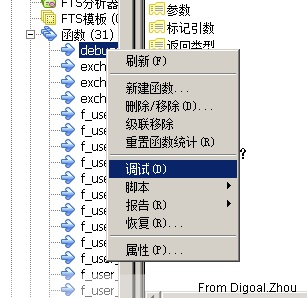
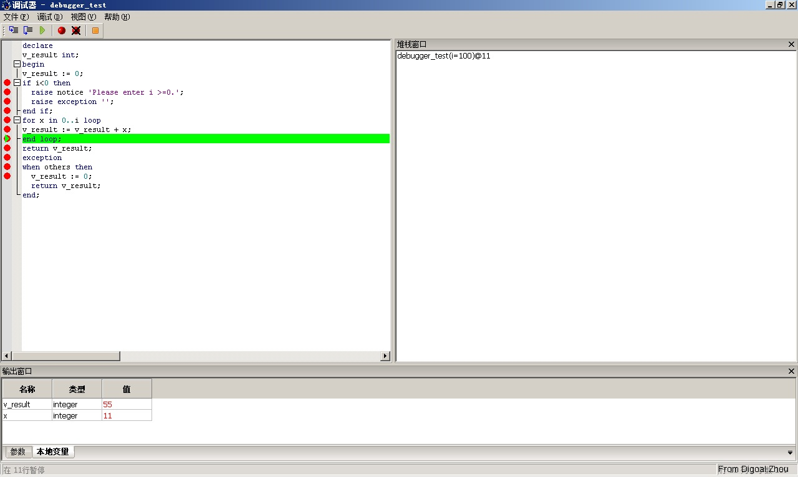

## 如何在PostgreSQL中调试plpgsql存储过程(pldebugger, pldbgapi)  
                                                              
### 作者                                                                 
digoal                                                         
                                                          
### 日期                                                                                                                             
2017-04-24                                                        
                                                             
### 标签                                                          
PostgreSQL , 调试plpgsql  
                                                                                                                                
----                                                                                                                          
                                                                                                                                   
## 背景          
PostgreSQL支持多种存储过程语言，例如plpgsql, C, plpython, plperl, pltcl, pljava, 等等。  
  
用户可以使用这些存储过程语言，创建对应的函数或存储过程（returns void）。  
  
那么如何调试PostgreSQL的存储过程呢？社区提供了一个插件pldebugger，可用于调试存储过程。  
  
https://git.postgresql.org/gitweb/?p=pldebugger.git;a=summary  
  
## pldebugger介绍  
```  
  16 Installation  
  17 ------------  
  18   
  19 - Copy this directory to contrib/ in your PostgreSQL source tree.  
  20   
  21 - Run 'make; make install'  
  22   
  23 - Edit your postgresql.conf file, and modify the shared_preload_libraries config  
  24   option to look like:  
  25   
  26   shared_preload_libraries = '$libdir/plugin_debugger'  
  27   
  28 - Restart PostgreSQL for the new setting to take effect.  
  29   
  30 - Run the following command in the database or databases that you wish to  
  31   debug functions in:  
  32   
  33   CREATE EXTENSION pldbgapi;  
  34   
  35   (on server versions older than 9.1, you must instead run the pldbgapi--1.0.sql  
  36   script directly using psql).  
  37   
  38   
  39 Usage  
  40 -----  
  41   
  42 Connect pgAdmin to the database containing the functions you wish to debug.  
  43 Right-click the function to debug, and select Debugging->Debug to execute and  
  44 debug the function immediately, or select Debugging->Set Global Breakpoint to  
  45 set a breakpoint on the function. This will cause the debugger to wait for  
  46 another session (such as a backend servicing a web app) to execute the function  
  47 and allow you to debug in-context.  
  48   
  49 For further information, please see the pgAdmin documentation.  
  50   
  51   
  52 Troubleshooting  
  53 ---------------  
  54   
  55 The majority of problems we've encountered with the plugin are caused by  
  56 failing to add (or incorrectly adding) the debugger plugin library to the  
  57 shared_preload_libraries configuration directive in postgresql.conf (following  
  58 which, the server *must* be restarted). This will prevent global breakpoints  
  59 working on all platforms, and on some (notably Windows) may prevent the   
  60 pldbgapi.sql script from executing correctly.  
  61   
  62   
  63 Architecture  
  64 ------------  
  65   
  66 The debugger consists of three parts:  
  67   
  68 1. The client. This is typically a GUI displays the source code, current  
  69    stack frame, variables etc, and allows the user to set breakpoints and  
  70    step throught the code. The client can reside on a different host than  
  71    the database server.  
  72   
  73 2. The target backend. This is the backend that runs the code being debugged.  
  74    The plugin_debugger.so library must be loaded into the target backend.  
  75   
  76 3. Debugging proxy. This is another backend process that the client is  
  77    connected to. The API functions, pldbg_* in pldbgapi.so library, are  
  78    run in this backend.  
  79   
  80 The client is to connected to the debugging proxy using a regular libpq  
  81 connection. When a debugging session is active, the proxy is connected  
  82 to the target via a socket. The protocol between the proxy and the target  
  83 backend is not visible to others, and is subject to change. The pldbg_*  
  84 API functions form the public interface to the debugging facility.  
  85   
  86   
  87 debugger client  *------ libpq --------* Proxy backend  
  88   (pgAdmin)                                 *  
  89                                             |  
  90                                   pldebugger socket connection  
  91                                             |  
  92                                             *  
  93 application client *----- libpq -------* Target backend  
```  
  
如果在编译pldebugger时遇到如下告警，可以修改一下pldbgapi.c  
  
```  
pldbgapi.c: In function ‘pldbg_get_stack’:  
pldbgapi.c:790:25: warning: format ‘%d’ expects argument of type ‘int’, but argument 3 has type ‘uint64 {aka long unsigned int}’ [-Wformat=]  
   sprintf( callCount, "%d", srf->call_cntr );  
                         ^  
  
修改如下  
  
                /*  
                 * frameString points to a string like:  
                 *      targetName:funcOID:lineNumber:arguments  
                 */  
                sprintf( callCount, "%zu", srf->call_cntr );  
```  
  
## pldebugger安装  
1\. 编译软件  
  
```  
git clone git://git.postgresql.org/git/pldebugger.git  
  
cd pldebugger  
  
export PATH=/home/digoal/pgsql9.6/bin:$PATH  
  
USE_PGXS=1 make clean  
USE_PGXS=1 make  
USE_PGXS=1 make install  
```  
  
2\. 修改配置  
  
```  
cd $PGDATA  
vi postgresql.conf  
  
shared_preload_libraries = '$libdir/plugin_debugger'  
```  
  
3\. 重启数据库  
  
```  
pg_ctl restart -m fast  
```  
  
## 如何调试存储过程  
1\. 在需要调试存储过程的目标数据库中，安装pldbgapi插件  
  
```  
postgres=# create extension pldbgapi ;  
CREATE EXTENSION  
```  
  
2\. 创建被调试的测试代码(如果已经有目标函数了,请忽略此步骤)  
  
```  
create or replace function debugger_test (i int) returns int as $$    
declare    
v_result int;    
begin    
v_result := 0;    
if i<0 then    
  raise notice 'Please enter i >=0.';    
  raise exception '';    
end if;    
for x in 0..i loop    
v_result := v_result + x;    
end loop;    
return v_result;    
exception    
when others then    
  v_result := 0;    
  return v_result;    
end;    
$$ language plpgsql;   
```  
  
3\. 打开pgAdmin客户端，使用pgAdmin登陆到这个数据库, 右键点击函数，点击调试选项。  
  
   
  
   
  
## 参考      
https://git.postgresql.org/gitweb/?p=pldebugger.git;a=summary  
  
<a rel="nofollow" href="http://info.flagcounter.com/h9V1"  ></a>  
  
  
  
  
  
  
## [digoal's 大量PostgreSQL文章入口](https://github.com/digoal/blog/blob/master/README.md "22709685feb7cab07d30f30387f0a9ae")
  
