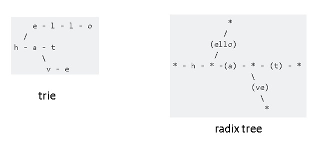
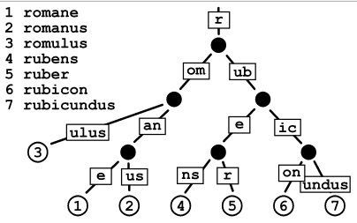
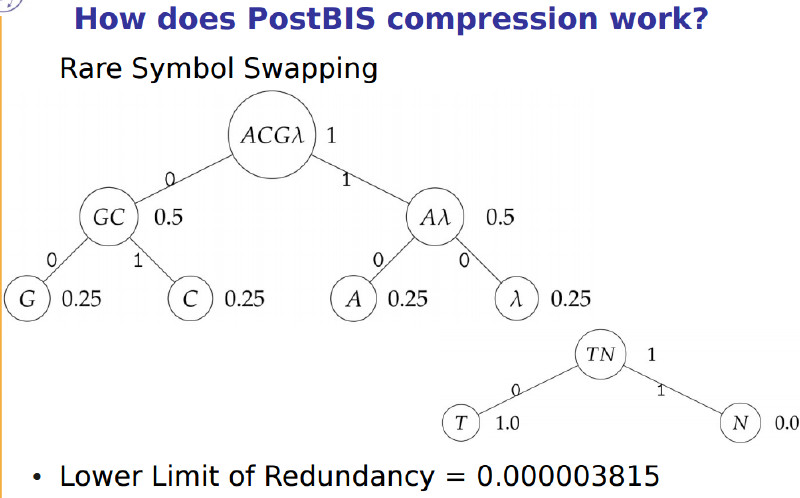
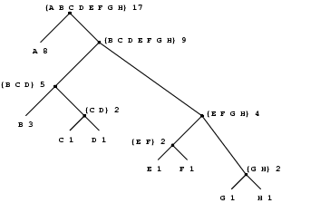
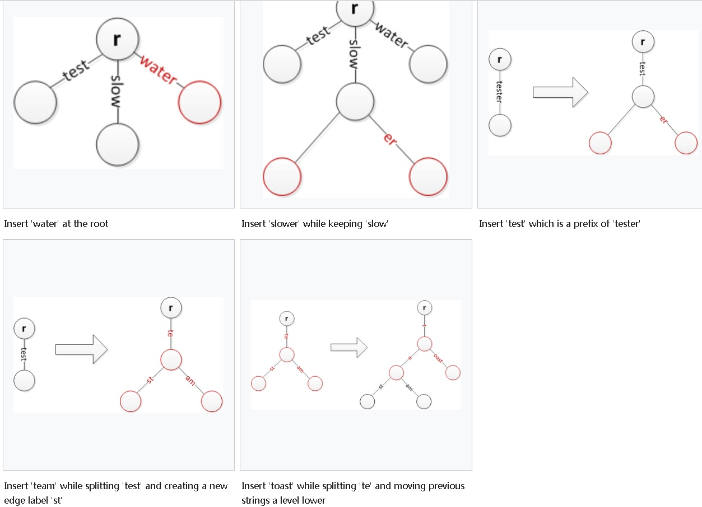

## radix tree在数据库PostgreSQL中的一些应用举例  
                              
### 作者                                 
digoal                         
                          
### 日期                                                                                             
2017-04-27                        
                             
### 标签                          
PostgreSQL , radix tree , suffix tree , trie , SP-GIST , 字符转换 , 基因 , 路由表 , 全文检索 , 关联数组   
                                                                                                
----                                                                                          
                                                                                                   
## 背景    
PostgreSQL 10.0发布了一个特性，使用radix tree来提升字符集转换的效率。  
  
https://git.postgresql.org/gitweb/?p=postgresql.git;a=commit;h=aeed17d00037950a16cc5ebad5b5592e5fa1ad0f    
    
```  
Use radix tree for character encoding conversions.    
    
Replace the mapping tables used to convert between UTF-8 and other    
character encodings with new radix tree-based maps. Looking up an entry in    
a radix tree is much faster than a binary search in the old maps. As a    
bonus, the radix tree representation is also more compact, making the    
binaries slightly smaller.    
    
The "combined" maps work the same as before, with binary search. They are    
much smaller than the main tables, so it doesn't matter so much. However,    
the "combined" maps are now stored in the same .map files as the main    
tables. This seems more clear, since they're always used together, and    
generated from the same source files.    
```  
  
既然与搜索有关，顺便也提一下PostgreSQL已经支持的索引接口如下:    
  
```  
B-Tree    
HASH    
GIN    
GiST    
SP-GiST    
BRIN    
BLOOM    
RUM    
```  
  
这些索引的原理，可以参考  
  
http://leopard.in.ua/2015/04/13/postgresql-indexes    
  
其中SP-GiST索引接口可以支持radix tree、quad-trees, k-d trees等非平衡数据结构的数据。用以支持合适场景的数据搜索需求。  
  
https://www.postgresql.org/docs/devel/static/spgist-intro.html    
    
```  
SP-GiST is an abbreviation for space-partitioned GiST.     
    
SP-GiST supports partitioned search trees,     
which facilitate development of a wide range of different non-balanced data structures,     
such as quad-trees, k-d trees, and radix trees (tries).     
    
The common feature of these structures is that they repeatedly divide the search space into     
partitions that need not be of equal size.     
    
Searches that are well matched to the partitioning rule can be very fast.    
```  
    
radix tree是什么？简单描述如下。  
    
## 一、radix tree 结构    
https://en.wikipedia.org/wiki/Radix_tree    
    
    
    
radix tree也被称为"收缩的 prefix tree(trie)"。是一种多叉搜索树，树的叶子结点是实际的数据条目。    
  
    
  
除了根节点以外，每个子节点都有一个唯一的父节点，你可以认为父节点就是子节点的prefix，并有一个指针指向父结点。     
    
raidx tree的内部节点（除了根、叶子节点），每一个节点都有r个子节点，r=2^x，(x>=1)；也就是说r可能是2,4,8,......；  
  
每个内部结点有一个固定的、2^n指针指向子结点（每个指针称为槽slot），并有一个指针指向父结点。    
    
这种结构使得radix tree的边界，可能是1个叶子(如ulus)，也可能是若干个叶子(如e, us)。    
    
    
    
从层次上来看也是不平衡的，例如romulus就只有三层，而romane有4层。    
    
## 二、radix tree 应用    
radix tree的常见应用特征如下    
    
- 一个较小的数据集，每条记录都是比较长的字符串，这些字符串有较多的共享的prefix。    
    
例如：    
    
1\. 路由表结构，数据集不大，网络地址有大量的prefix是可以共享的（如192.168.0.0/24, 192.168.1.0/24,......)，很符合radix tree的应用特征。    
    
有一个开源项目，（Fast, robust and memory-savvy IP radix tree (Patricia trie) implementation in Java）    
    
https://github.com/openstat/ip-radix-tree    
    
2\. 关联数组（associative array）    
    
Linux 内核中radix tree使用的例子。    
    
http://www.infradead.org/~mchehab/kernel_docs/core-api/assoc_array.html    
    
https://github.com/MintCN/linux-insides-zh/blob/master/DataStructures/radix-tree.md    
    
扩展  
  
3\. 全文检索    
    
http://www.itu.dk/people/pagh/DBT09/07-text-indexing.pdf    
    
PS：PostgreSQL 全文检索、模糊查询相关的例子(gin和rtree的应用)      
    
[《PostgreSQL 全文检索接口 - RUM索引》](../201610/20161019_01.md)     
    
[《PostgreSQL 行级全文检索》](../201604/20160419_01.md)      
    
[《PostgreSQL 模糊查询最佳实践》](../201704/20170426_01.md)      
    
[《聊一聊双十一背后的技术 - 分词和搜索》](../201611/20161115_01.md)      
    
[《聊一聊双十一背后的技术 - 正则和相似度查询加速》](../201611/20161118_01.md)     
  
原理参考  
  
[《电商内容去重\内容筛选应用(实时识别转载\盗图\侵权?) - 文本、图片集、商品集、数组相似判定的优化和索引技术》](../201701/20170112_02.md)    
    
[《PostgreSQL 模糊查询最佳实践》](../201704/20170426_01.md)    
    
4\. 基因搜索    
    
基因数据具有非常长的字符串，而且有很多是共享的片段，也特别适合radix tree。    
    
    
    
PS：PostgreSQL 基因类型的例子(huffman tree的应用)   
    
[《如何通过PostgreSQL基因配对，产生优良下一代》](../201606/20160621_01.md)     
    
https://colab.mpi-bremen.de/wiki/display/pbis/PostBIS    
  
postbis-src/sequence/code_set_creation.c  
  
  
  
参考  
  
https://www.siggraph.org/education/materials/HyperGraph/video/mpeg/mpegfaq/huffman_tutorial.html  
  
https://en.wikipedia.org/wiki/Huffman_coding  
  
https://mitpress.mit.edu/sicp/full-text/sicp/book/node41.html  
    
## 三、radix tree 数据操作    
### 搜索  
  
范例(取自wiki)  
  
```  
function lookup(string x)  
{  
  // Begin at the root with no elements found  
  Node traverseNode := root;  
  int elementsFound := 0;  
    
  // Traverse until a leaf is found or it is not possible to continue  
  while (traverseNode != null && !traverseNode.isLeaf() && elementsFound < x.length)  
  {  
    // Get the next edge to explore based on the elements not yet found in x  
    Edge nextEdge := select edge from traverseNode.edges where edge.label is a prefix of x.suffix(elementsFound)  
      // x.suffix(elementsFound) returns the last (x.length - elementsFound) elements of x  
    
    // Was an edge found?  
    if (nextEdge != null)  
    {  
      // Set the next node to explore  
      traverseNode := nextEdge.targetNode;  
      
      // Increment elements found based on the label stored at the edge  
      elementsFound += nextEdge.label.length;  
    }  
    else  
    {  
      // Terminate loop  
      traverseNode := null;  
    }  
  }  
    
  // A match is found if we arrive at a leaf node and have used up exactly x.length elements  
  return (traverseNode != null && traverseNode.isLeaf() && elementsFound == x.length);  
}  
```  
  
### 插入    
    
插入时，首先搜索(直到最深的共享的prefix)，分为多种情况，可能直接插入到root下面，也可能插入到最后一个共享的prefix下面，也可能进行分裂，。。。。    
    
一些例子如下：    
    
    
    
### 删除    
删除操作，首先进行定位，定位到之后，分为两种情况：    
    
如果是leaf node，则直接删除；    
    
如果是internal node（说明你要删除的数据下面还有节点，那么将其他节点补齐缺的prefix并挂到你的父节点下面，然后你就变成了leaf node，然后删除）。    
    
### 其他搜索  
1\. 搜索包含指定prefix(前缀)的所有数据。  
  
2\. 搜索指定字符串的前一个字符串。（比指定字符串更小的最大字符串）。  
  
3\. 搜索指定字符串的下一个字符串。（比指定字符串更大的最小字符串）。  
    
## 四、如何开发PostgreSQL SP-GiST索引    
    
https://www.postgresql.org/docs/devel/static/indexam.html    
    
https://www.postgresql.org/docs/devel/static/spgist.html    
    
https://www.postgresql.org/docs/devel/static/pgtrgm.html    
    
样板代码    
    
postgresql-src/contrib/pg_trgm/trgm_gist.c    
    
postgresql-src/src/backend/access/spgist/spgtextproc.c    
    
## PostgreSQL 索引原理    
这里有讲到，B-tree, R-tree, hash, bitmap, GIN, GIST, BRIN 索引的原理。    
    
http://leopard.in.ua/2015/04/13/postgresql-indexes    
  
## 小结
PostgreSQL的可扩展性，包容的BSD-Like许可，使得PG在很多垂直行业有许多和业务结合很紧密的应用。例如本文提到生命科学(基因)场景，危化品管理（化学RDkit插件），全文检索，图搜索，流计算，时序数据、GIS数据的处理等等场景，我们可以看到数据库和应用结合得非常紧密，从特殊数据类型的支持，到数据的检索支持，数据的操作支持，数据的服务端函数编程支持，一应俱全。  
    
## 参考                      
https://git.postgresql.org/gitweb/?p=postgresql.git;a=commit;h=aeed17d00037950a16cc5ebad5b5592e5fa1ad0f    
    
https://www.postgresql.org/docs/devel/static/spgist-intro.html    
    
https://en.wikipedia.org/wiki/Radix_tree    
    
https://en.wikipedia.org/wiki/Trie    
    
http://blog.csdn.net/joker0910/article/details/8250085    
    
https://github.com/MintCN/linux-insides-zh/blob/master/DataStructures/radix-tree.md    
  
https://pdfs.semanticscholar.org/6abf/5107efc723c655956f027b4a67565b048799.pdf  
  
https://github.com/npgall/concurrent-trees  
  
https://github.com/armon/libart  
  
  
<a rel="nofollow" href="http://info.flagcounter.com/h9V1"  ></a>  
  
  
  
  
  
  
## [digoal's 大量PostgreSQL文章入口](https://github.com/digoal/blog/blob/master/README.md "22709685feb7cab07d30f30387f0a9ae")
  
