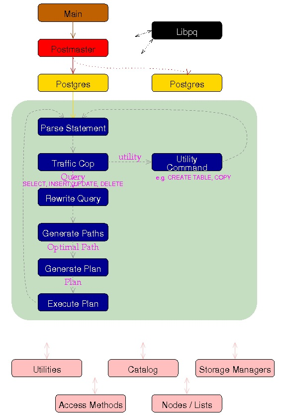
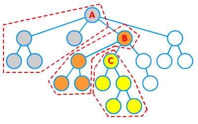

## 数据库优化器原理(含动态规划、机器学习建模优化器aqo) - 如何治疗选择综合症  
                          
### 作者                          
digoal                          
                          
### 日期                          
2017-05-07                         
                          
### 标签                          
PostgreSQL , 单列索引 , 复合索引 , 优化器 , 成本因子     
                          
----                          
                          
## 背景      
### RBO -> CBO -> 动态优化  
经常听到这样的声音：“查询慢？加个索引吧。”，虽然话不专业，但是体现了早期基于RBO（基于规则）的优化器思维。    
    
通常对业务不熟悉，或者对数据库不熟悉时，可能会凭自觉做出这样的判断。    
    
RBO思维存在较大的问题，所以导致了CBO（基于成本）的出现。    
    
再往后，(生成执行计划->执行这样的)静态CBO又要落伍了，紧接着会是动态的执行计划(边执行->边生成下一阶段的执行计划)。    
    
动态执行计划好似导航软件的躲避拥堵功能，阶段性的给出最佳的线路。    
    
PostgreSQL pro动态执行计划roadmap     
    
https://postgrespro.com/roadmap/    
    
https://postgrespro.com/roadmap/56513    
  
aqo(基于机器学习的优化器)插件  
  
https://postgrespro.com/docs/postgresproee/9.6/aqo.html  
    
https://postgrespro.com/docs/enterprise/10/aqo  
  
```    
1. Machine learning    
    
Query planner selects “cheapest” query plan based on its cost estimation.      
    
But it’s done with  many rough assumptions.      
    
This is why the estimated cost could be inadequate to real execution cost.      
    
One possibility is to improve the cost estimate mechanism itself by adding features     
like multivariate statistics.      
    
Another possibility is to use query execution feedback:     
see how estimated parameter values differ from actual parameter values.      
    
We can apply machine learning techniques  to improve the cost estimates using this feedback,     
so DBMS would learn on its own mistakes.    
    
We’ve already done this in a simple case, and further work is planned in the following directions:    
    
1.1 Extend implemented model to cover more use cases,    
    
1.2 Provide the infrastructure necessary to make our machine learning an extension.    
    
    
2. Execution-time planning    
    
Currently, query planning strictly precedes query execution.      
    
Sometimes it appears to be a serious limitation.      
    
When one part of a plan is already executed it could be possible to significantly improve     
the rest of the plan on the basis of gathered statistics.      
    
We can see two cases when this approach could be applied:    
    
2.1 Online reordering of filter expressions.      
    
During sequential scan of large table it’s important to do the cheapest 
and the most selective checks first.      
    
However estimated selectivity and cost of filtering are inaccurate,     
and thus the order of applying filters based on estimates can  be not optimal.     
    
But filter expressions could be reordered online on the base of statistics of their previous execution.    
    
2.2 Some queries could be divided into sequence of steps when subsequent steps could be     
replanned on the base of results of previous steps.      
    
For instance, suppose that step 1 is a scan of table A, and step 2 is a join of tables A and B.      
    
Depending on row count and data distribution from the first step we could choose     
different join algorithm on the second step.    
```    
    
我们回到CBO，既然是基于成本的优化，那么成本是如何算出来的呢？    
    
数据库收到用户的SQL请求后，会经过parser, rewrite, 产生paths, 产生最优plan, execute plan, 返回结果。    
    
 - 源码参考    
    
 - https://www.postgresql.org/developer/backend/    
    
    
    
产生paths的功能类似下图：达到目的有多少种方法；或者去往某个目的地，有多少种走法；又或者解题有多少种解法。    
    
    
    
```    
Creates path from parser output This takes the parser query output,     
and generates all possible methods of executing the request.     
    
It examines table join order, where clause restrictions,     
and optimizer table statistics to evaluate each possible execution method,     
and assigns a cost to each.    
```    
    
产生最优plan，(从多个解法中，选择成本最低的path)，生成plan。    
    
```    
Optimizes path output This takes the optimizer/path output,     
chooses the path with the least cost, and creates a plan for the executor.    
```    
    
我们看上面那张图，每一个node(小圆圈)是一次运算，运算完将数据输送给上层的node，到达顶端时计算结束返回结果给用户。    
    
每个path的成本，取决于该path每个node的成本总和。    
    
接下来引出今日话题，当优化器可以选择不同的索引解决同一个SQL的问题时，该选哪个呢？    
    
例子    
    
```    
测试表与数据    
postgres=# create table multi_col(c1 int, c2 int, c3 timestamp, c4 text);    
CREATE TABLE    
    
postgres=# insert into multi_col select random()*10, random()*10, 
now()+(id||'sec')::interval , md5(random()::text) from generate_series(1,10000000) t(id);    
INSERT 0 10000000    
    
2个索引    
create index idx1 on multi_col(c3);    
    
create index idx1 on multi_col(c3,c2,c1);    
    
SQL如下    
select * from multi_col where c3 between '2017-05-06 10:54:38.112188' and '2017-05-28 10:54:38.112188' and c2=1;    
    
select * from multi_col where c3 between '2017-05-06 10:54:38.112188' and '2017-05-28 10:54:38.112188';    
    
select * from multi_col where c3 between '2017-05-06 10:54:38.112188' and '2017-05-28 10:54:38.112188' and c1=1;    
    
它们如何选择索引？    
    
索引大小    
 public | idx1                           | index | postgres | multi_col              | 214 MB  |     
 public | idx2                           | index | postgres | multi_col              | 301 MB  |     
    
表大小    
                      List of relations    
 Schema |   Name    | Type  |  Owner   |  Size  | Description     
--------+-----------+-------+----------+--------+-------------    
 public | multi_col | table | postgres | 806 MB |     
(1 row)    
```    
    
接下来，看完本文，不仅仅可以解答今日问题，其他优化器相关的问题也迎刃而解。    
    
## 优化器如何治疗选择综合症    
### node成本如何计算    
前面说了，CBO是基于成本的优化，当一条SQL可以使用多个索引，或者可以选择多种访问路径时，该如何选择呢？    
    
这是优化器经常需要面对的问题。特别是PostgreSQL支持的访问方法很多，选择更多。    
    
- 有哪些node可以参考 src/backend/commands/explain.c    
    
手册中有详细的成本计算方法的例子    
    
Chapter 67. How the Planner Uses Statistics    
    
https://www.postgresql.org/docs/9.6/static/planner-stats-details.html    
    
拆解后，node成本的计算实际上依赖几个东西：    
    
1\. 成本因子，详见    
    
https://www.postgresql.org/docs/9.6/static/runtime-config-query.html#RUNTIME-CONFIG-QUERY-CONSTANTS    
    
2\. 统计信息（记录数、PAGE数、列统计信息、线性相关性、高频值、高频值的比例等），详见    
    
pg_stats统计视图。    
    
3\. 算法。每种NODE的算法都不一样，详见    
    
src/backend/optimizer/path/costsize.c    
    
```    
 * costsize.c    
 *        Routines to compute (and set) relation sizes and path costs    
 *    
 * Path costs are measured in arbitrary units established by these basic    
 * parameters:    
    
以下是一部分成本因子，在计算成本时会用到。    
    
 *      seq_page_cost           Cost of a sequential page fetch    
 *      random_page_cost        Cost of a non-sequential page fetch    
 *      cpu_tuple_cost          Cost of typical CPU time to process a tuple    
 *      cpu_index_tuple_cost  Cost of typical CPU time to process an index tuple    
 *      cpu_operator_cost       Cost of CPU time to execute an operator or function    
 *      parallel_tuple_cost Cost of CPU time to pass a tuple from worker to master backend    
 *      parallel_setup_cost Cost of setting up shared memory for parallelism    
```    
    
### 如何改变node的成本计算结果    
通过改变统计信息、成本因子、算法，可以改变NODE的成本计算结果。    
    
1\. 统计信息通过analyze收集，PostgreSQL支持列级设置柱状图bucket大小。默认是100，最大可以设置到10000。    
    
bucket越大，统计信息越准确，但是统计耗时越长。    
    
```    
postgres=# alter table multi_col alter column c1 set statistics 10000;    
ALTER TABLE    
postgres=# analyze multi_col ;    
```    
    
修改统计信息，会直接影响NODE的成本计算结果。    
    
2\. 修改成本因子，可以直接影响NODE的成本计算结果。    
    
例如全表扫描NODE，修改seq_page_cost会影响全表扫描NODE单个PAGE的扫描成本。    
    
```    
postgres=# show seq_page_cost ;    
 seq_page_cost     
---------------    
 1    
(1 row)    
postgres=# explain select count(*) from multi_col ;    
                                QUERY PLAN                                     
---------------------------------------------------------------------------    
 Aggregate  (cost=228093.00..228093.01 rows=1 width=8)    
   ->  Seq Scan on multi_col  (cost=0.00..203093.00 rows=10000000 width=0)    
(2 rows)    
    
postgres=# set seq_page_cost =90;    
SET    
postgres=# explain select count(*) from multi_col ;    
                                          QUERY PLAN                                              
----------------------------------------------------------------------------------------------    
 Aggregate  (cost=5477642.68..5477642.69 rows=1 width=8)    
   ->  Index Only Scan using idx2 on multi_col  (cost=0.43..5452642.68 rows=10000000 width=0)    
(2 rows)    
```    
    
3\. 修改算法，也会导致成本计算结果的变化，需要动到PostgreSQL内核costsize.c，或者使用PostgreSQL内核提供的HOOK修改成本的计算结果。    
    
### 如何让优化器选择你想要的path    
有三种方法，可以让优化器最终选哪个path生成plan。    
    
#### 1 修改成本因子    
改成本因子，实际上是改node成本的计算结果。从而让优化器改变最终的选择。    
    
```    
seq_page_cost (floating point)  -- 全表扫描，扫描单个数据块的成本    
    
random_page_cost (floating point)  -- 离散扫描(索引扫描)，扫描单个数据块的成本    
    
parallel_setup_cost (floating point)	-- 多核并行的初始启动成本（fork worker, alloc shared memory的成本）。    
    
parallel_tuple_cost (floating point)   --  并行worker进程将每条tuple输送给其他进程的成本。    
    
min_parallel_relation_size (integer)   --  最小的对象大小，只有超过这个阈值大小的对象才会考虑并行计算，否则不产生并行计算path。    
    
effective_cache_size (integer)    -- 告诉优化器操作系统有多少缓存可以被数据库使用，越大，越倾向使用索引扫描。    
    
cpu_tuple_cost (floating point)   -- 每条记录的CPU成本，比如某个NODE需要扫描10000条记录，那么需要乘以这个系数得到SUM(CPU TUPLE COST)。    
Sets the planner's estimate of the cost of processing each row during a query.     
The default is 0.01.    
    
cpu_index_tuple_cost (floating point)  -- 索引扫描时，每条索引记录被扫描到时，消耗的CPU资源。    
Sets the planner's estimate of the cost of processing each index entry during an index scan.     
The default is 0.005.    
    
cpu_operator_cost (floating point)  -- SQL中的每个操作符、函数被调用时，每调用一次需要多少成本。调用多少次取决于函数或操作符的稳定性，稳定性参考本文末尾部分。    
Sets the planner's estimate of the cost of processing each operator or function executed during a query.     
The default is 0.0025.    
```    
    
要生成准确的成本，需要三个因素都准确，1. 成本因子，2. 统计信息，3. 算法。    
    
其中成本因子的校准，可以参考如下文章    
    
[《优化器成本因子校对 - PostgreSQL explain cost constants alignment to timestamp》](../201311/20131126_03.md)      
    
通过修改成本因子，可以达到修正对应NODE成本的目的。    
    
##### 例子，用成本因子治疗文章开头的例子     
测试表  
  
```  
postgres=# \d multi_col   
                       Table "public.multi_col"  
 Column |            Type             | Collation | Nullable | Default   
--------+-----------------------------+-----------+----------+---------  
 c1     | integer                     |           |          |   
 c2     | integer                     |           |          |   
 c3     | timestamp without time zone |           |          |   
 c4     | text                        |           |          |   
Indexes:  
    "idx1" btree (c3 NULLS FIRST)  
    "idx2" btree (c3, c2, c1)  
```  
  
测试SQL1  
  
```  
postgres=# explain (analyze,verbose,timing,costs,buffers) select * from multi_col 
where c3 between '2017-05-06 10:54:38.112188' and '2017-05-28 10:54:38.112188' and c2=1;   
                                                                                 QUERY PLAN                                                                                    
-----------------------------------------------------------------------------------------------------------------------------------------------------------------------------  
 Index Scan using idx1 on public.multi_col  (cost=0.43..66634.87 rows=187605 width=49) (actual time=0.028..391.223 rows=187767 loops=1)  
   Output: c1, c2, c3, c4  
   Index Cond: ((multi_col.c3 >= '2017-05-06 10:54:38.112188'::timestamp without time zone) AND (multi_col.c3 <= '2017-05-28 10:54:38.112188'::timestamp without time zone))  
   Filter: (multi_col.c2 = 1)    
   -- 使用IDX1需要filter来过滤c2=1这个条件，而使用IDX2不需要这个FILTER
   -- filter需要消耗cpu_tuple_cost，cpu_index_tuple_cost。  
     
   -- 如果使用idx2，可以去掉Filter部分产生的 cpu_tuple_cost的开销。  
   -- 那么怎么让优化器选择IDX2呢？  
   Rows Removed by Filter: 1690517  
   Buffers: shared hit=24498  
 Planning time: 0.161 ms  
 Execution time: 402.656 ms  
(8 rows)  
```  
  
如果要让以上SQL使用IDX2(使用IDX2)，我们只需要调大cpu_tuple_cost的开销即可(因为这部分开销是IDX1产生的，而IDX2不会产生这部分开销)。  
  
```  
当前设置  
postgres=# show cpu_tuple_cost;  
 cpu_tuple_cost   
----------------  
 0.01  
(1 row)  
  
设大  
postgres=# set cpu_tuple_cost=0.1;  
SET  
  
优化器选择了IDX2  
postgres=# explain (analyze,verbose,timing,costs,buffers) select * from multi_col 
where c3 between '2017-05-06 10:54:38.112188' and '2017-05-28 10:54:38.112188' and c2=1;   
                                                                                             QUERY PLAN                                                                                               
----------------------------------------------------------------------------------------------------------------------------------------------------------------------------------------------------  
 Index Scan using idx2 on public.multi_col  (cost=0.43..93471.13 rows=187605 width=49) (actual time=0.021..136.080 rows=187767 loops=1)  
   Output: c1, c2, c3, c4  
   Index Cond: ((multi_col.c3 >= '2017-05-06 10:54:38.112188'::timestamp without time zone) AND (multi_col.c3 <= '2017-05-28 10:54:38.112188'::timestamp without time zone) AND (multi_col.c2 = 1))  
   Buffers: shared hit=26562  
 Planning time: 0.150 ms  
 Execution time: 147.418 ms  
(6 rows)  
```  
  
在设大cpu_tuple_cost之前，为什么数据库选择了IDX1呢，到底什么导致了IDX2的成本高于IDX1了？   
  
我们看到IDX2比IDX1略大（PAGE数更多），所以离散扫描的成本算进来，导致总成本比IDX2更低了。  
  
例子  
  
```
postgres=# show random_page_cost ;
 random_page_cost 
------------------
 1
(1 row)

回调cpu_tuple_cost，让数据库继续选择idx1。
postgres=# set cpu_tuple_cost=0.01;
SET
postgres=# explain (analyze,verbose,timing,costs,buffers) select * from multi_col where c3 between '2017-05-06 10:54:38.112188' and '2017-05-28 10:54:38.112188' and c2=1; 
                                                                                 QUERY PLAN                                                                                  
-----------------------------------------------------------------------------------------------------------------------------------------------------------------------------
 Index Scan using idx1 on public.multi_col  (cost=0.43..66634.87 rows=187605 width=49) (actual time=0.046..331.644 rows=187767 loops=1)
   Output: c1, c2, c3, c4
   Index Cond: ((multi_col.c3 >= '2017-05-06 10:54:38.112188'::timestamp without time zone) AND (multi_col.c3 <= '2017-05-28 10:54:38.112188'::timestamp without time zone))
   Filter: (multi_col.c2 = 1)
   Rows Removed by Filter: 1690517
   Buffers: shared hit=24498
 Planning time: 0.220 ms
 Execution time: 343.478 ms
(8 rows)

降低random_page_cost，这会又选择IDX2了。

postgres=# set random_page_cost =0.1;
SET
postgres=# explain (analyze,verbose,timing,costs,buffers) select * from multi_col where c3 between '2017-05-06 10:54:38.112188' and '2017-05-28 10:54:38.112188' and c2=1; 
                                                                                             QUERY PLAN                                                                                             
----------------------------------------------------------------------------------------------------------------------------------------------------------------------------------------------------
 Index Scan using idx2 on public.multi_col  (cost=0.43..31412.31 rows=187605 width=49) (actual time=0.022..136.669 rows=187767 loops=1)
   Output: c1, c2, c3, c4
   Index Cond: ((multi_col.c3 >= '2017-05-06 10:54:38.112188'::timestamp without time zone) AND (multi_col.c3 <= '2017-05-28 10:54:38.112188'::timestamp without time zone) AND (multi_col.c2 = 1))
   Buffers: shared hit=26562
 Planning time: 0.147 ms
 Execution time: 148.052 ms
(6 rows)
```
    
#### 2 修改开关    
通过开关，可以让优化器避免选择某些路径，这些路径不会被生成，也不会计算成本，最终也不会被选择。    
    
PostgreSQL支持的开关如下    
    
https://www.postgresql.org/docs/9.6/static/runtime-config-query.html#RUNTIME-CONFIG-QUERY-ENABLE    
    
```    
enable_bitmapscan (boolean)  -- 是否允许bitmapscan    
    
enable_hashagg (boolean)  -- 是否允许hash聚合    
    
enable_hashjoin (boolean)  -- 是否允许HASH JOIN    
    
enable_indexscan (boolean)  -- 是否允许索引扫描    
    
enable_indexonlyscan (boolean)  -- 是否允许index only扫描    
    
enable_material (boolean)  -- 是否允许物化(nestloop内表物化)    
    
enable_mergejoin (boolean)  -- 是否允许归并JOIN    
    
enable_nestloop (boolean)  -- 是否允许嵌套循环    
    
enable_seqscan (boolean)  -- 是否允许全表扫描    
    
enable_sort (boolean)   -- 是否允许显示排序（如果关闭的话，告诉优化器能走索引时会尽量走索引排序）    
    
enable_tidscan (boolean)  -- 是否允许使用物理行号扫描    
```    
    
控制是否提升子查询    
    
```    
from_collapse_limit (integer)  -- 当设置为1时，子查询将不会被提升，而是对子查询单独生成PATH    
    
如果N大于1，则允许提升做多N个子查询。    
```    
    
控制显示的JOIN（FULL JOIN除外）是否使用用户提供的JOIN顺序。    
    
```    
join_collapse_limit (integer)  -- 设置为1时，显示的JOIN（FULL JOIN除外）使用用户提供的JOIN顺序    
    
当大于1时，优化器会对显示的JOIN（FULL JOIN除外）的JOIN顺序进行重排（重排对象数上限=join_collapse_limit），以获得更好的执行计划。    
```    
    
其他开关    
    
```    
force_parallel_mode (enum)  -- 强制并行    
    
cursor_tuple_fraction (floating point)  -- 针对游标查询的优化，    
设置越小，说明倾向于快速返回第一条记录。    
设置越大，说明倾向快速返回所有值（总成本趋于更小）。    
```    
    
通过设置这些开关，可以让优化器使用或者不使用某些path，从而控制最终的执行计划。    
    
例如把所有的索引扫描，BITMAP SCAN都关掉，会变成全表扫描。    
    
#### 3 hint    
通过hint插件（实际上就是HOOK做的），可以强制优化器使用你设定的路径。    
    
比如告诉优化器，请使用HASH JOIN，或者使用某个索引。    
    
HINT的使用例子如下    
    
[《关键时刻HINT出彩 - PG优化器的参数优化、执行计划固化CASE》](../201607/20160723_02.md)      
    
[《PostgreSQL 特性分析 Plan Hint》](../201605/20160523_02.md)      
    
[《阿里云 PostgreSQL pg_hint_plan插件的用法》](../201604/20160401_01.md)      
    
[《PostgreSQL SQL HINT的使用(pg_hint_plan)》](../201602/20160203_01.md)      
    
## 其他知识    
    
### 1 遗传算法    
默认情况下，数据库多表JOIN时，会使用穷举法，将所有的JOIN顺序排列出来，生成非常多的path。JOIN的表越多，path就越多，导致执行计划花费较多的时间。    
    
如果想避免穷举法带来多表JOIN执行计划花费过多，    
    
一种方法是使用前面提到的显示JOIN以及设置join_collapse_limit，from_collapse_limit=1。    
    
另一种方法是使用遗传算法，当FROM中的JOIN对象大于阈值，将使用遗传算法。    
    
遗传算法请参考    
    
https://www.postgresql.org/docs/9.6/static/runtime-config-query.html#GUC-GEQO-THRESHOLD    
    
```    
geqo_threshold (integer)    
    
Use genetic query optimization to plan queries with at least this many FROM items involved.     
    
(Note that a FULL OUTER JOIN construct counts as only one FROM item.) The default is 12.     
    
For simpler queries it is usually best to use the regular, exhaustive-search planner,     
but for queries with many tables the exhaustive search takes too long,     
often longer than the penalty of executing a suboptimal plan.     
    
Thus, a threshold on the size of the query is a convenient way to manage use of GEQO.    
```    
    
### 2 10.0 有什么高招？    
1\. 10.0对优化器有一些改造，比如自定义统计维度，比如JOIN循环的优化。    
    
[《PostgreSQL 10.0 preview 功能增强 - 自由定义统计信息维度》](../201703/20170330_05.md)      
  
https://www.postgresql.org/docs/devel/static/sql-createstatistics.html  
  
自定义列统计信息例子  
  
```  
postgres=# CREATE STATISTICS s1 on (c3,c2,c1) from multi_col ;  
  
postgres=# \d multi_col   
                       Table "public.multi_col"  
 Column |            Type             | Collation | Nullable | Default   
--------+-----------------------------+-----------+----------+---------  
 c1     | integer                     |           |          |   
 c2     | integer                     |           |          |   
 c3     | timestamp without time zone |           |          |   
 c4     | text                        |           |          |   
Indexes:  
    "idx1" btree (c3 NULLS FIRST)  
    "idx2" btree (c3, c2, c1)  
Statistics:  
    "public.s1" WITH (ndistinct, dependencies) ON (c1, c2, c3)  
  
postgres=# select * from pg_statistic_ext ;  
-[ RECORD 1 ]---+--------------------------------------------------------------------------------------------------------------  
starelid        | 22037  
staname         | s1  
stanamespace    | 17307  
staowner        | 10  
stakeys         | 1 2 3  
staenabled      | {d,f}  
standistinct    | [{(b 1 2), 121.000000}, {(b 1 3), 10000000.000000}, {(b 2 3), 10000000.000000}, {(b 1 2 3), 10000000.000000}]  
stadependencies | [{3 => 1 : 1.000000}, {3 => 2 : 1.000000}, {1, 3 => 2 : 1.000000}, {2, 3 => 1 : 1.000000}]  
  
postgres=# select * from pg_stats_ext;  
-[ RECORD 1 ]---------  
schemaname | public  
tablename  | multi_col  
staname    | s1  
attnums    | 1 2 3  
ndistbytes | 78  
depsbytes  | 72  
```  
    
2\. [《PostgreSQL 10.0 preview 性能增强 - hash,nestloop join优化(聪明的优化器是这样的)》](../201704/20170421_03.md)      
    
3\. 更多详见10.0的release note  
  
https://www.postgresql.org/docs/devel/static/release-10.html    
    
E.1.3.1.4. Optimizer    
    
- Add multi-column optimizer statistics to compute the correlation ratio and number of distinct values (Tomas Vondra, David Rowley, Álvaro Herrera)    
    
New commands are CREATE, ALTER, and DROP STATISTICS. This is helpful in estimating query memory usage and when combining the statistics from individual columns.    
    
- Improve planner matching of boolean indexes (Tom Lane)    
    
- Improve performance of queries referencing row-level security restrictions (Tom Lane)    
    
- The optimizer now has more flexibility in reordering executor behavior.    
    
## 参考    
    
[《索引顺序扫描引发的堆扫描IO放大背后的统计学原理与解决办法》](../201404/20140426_01.md)    
    
[《优化器成本因子校对 - PostgreSQL explain cost constants alignment to timestamp》](../201311/20131126_03.md)      
    
[《PostgreSQL 嵌套循环成本估算方法 - nestloop loop cost & cost_material run_cost》](../201403/20140316_01.md)      
  
<a rel="nofollow" href="http://info.flagcounter.com/h9V1"  ></a>  
  
  
  
  
  
  
## [digoal's 大量PostgreSQL文章入口](https://github.com/digoal/blog/blob/master/README.md "22709685feb7cab07d30f30387f0a9ae")
  
