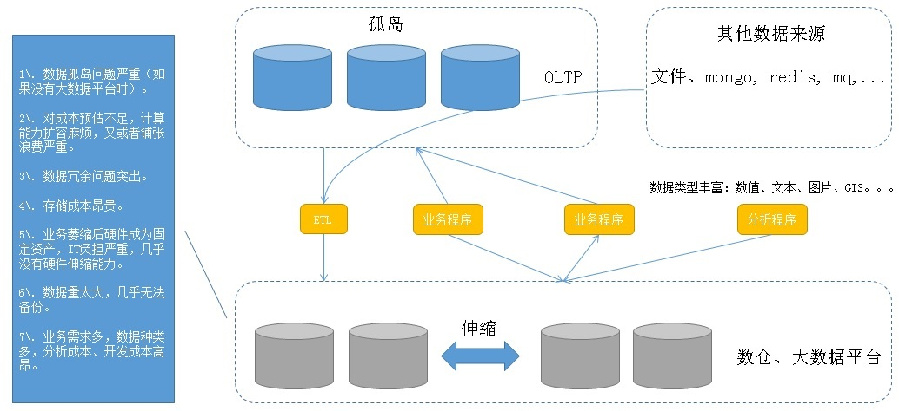
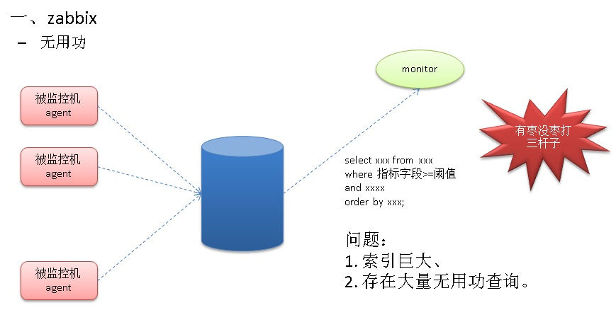
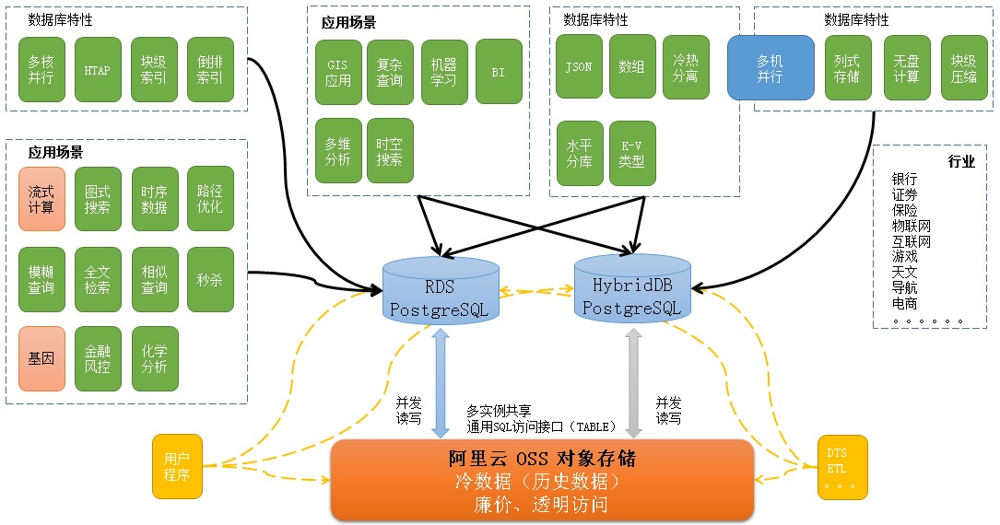
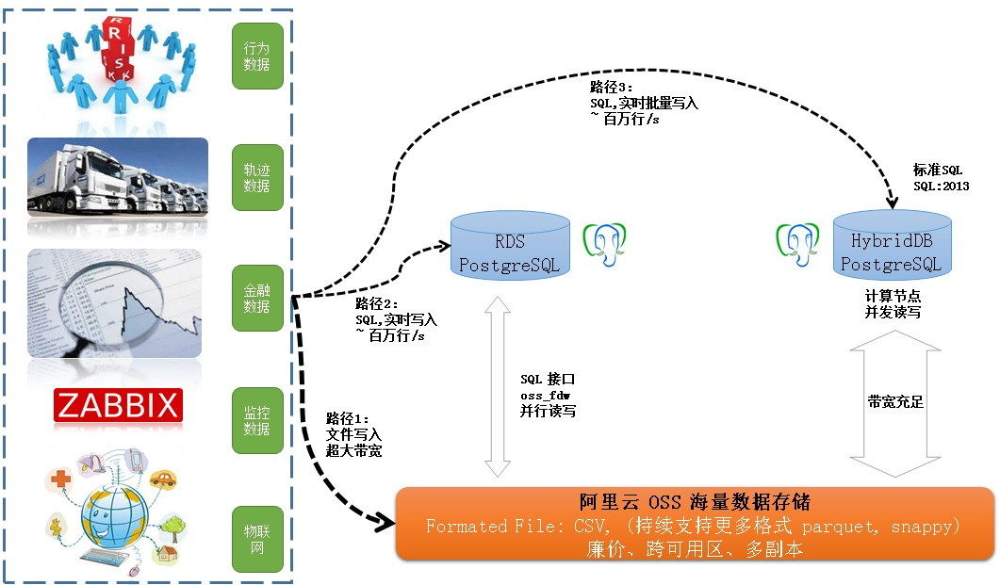
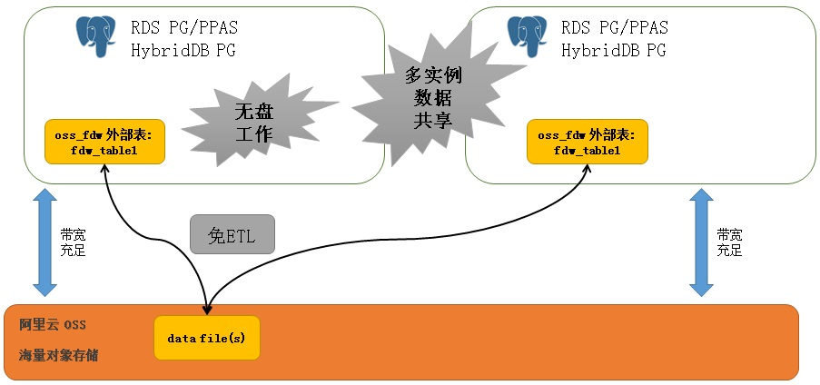
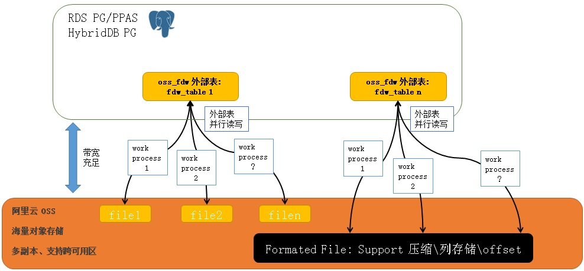
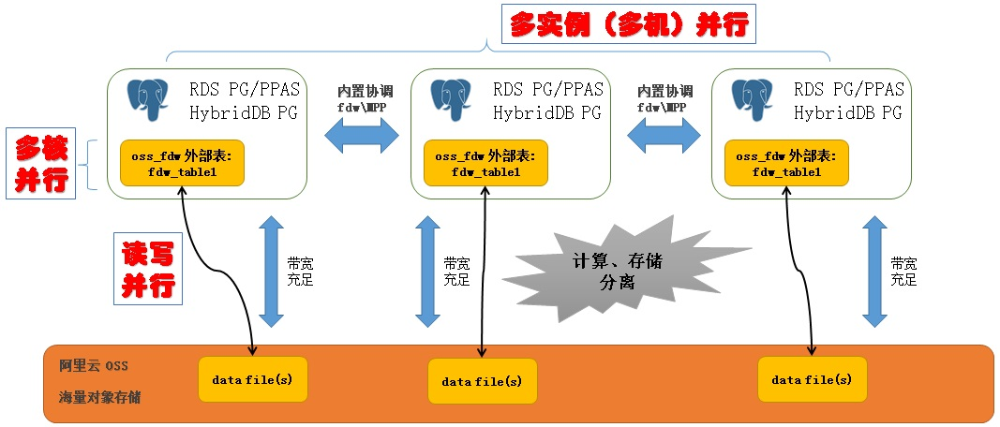
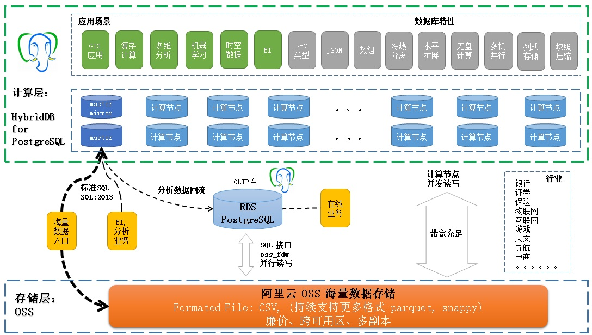
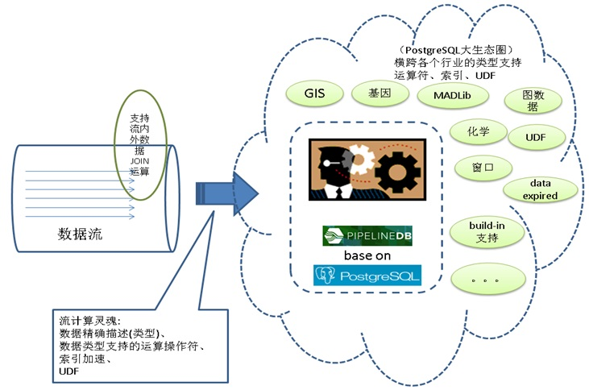
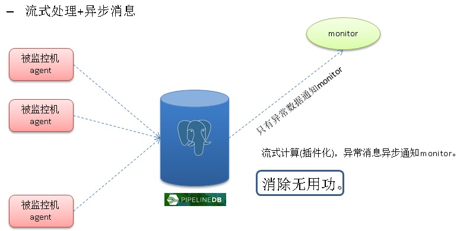

## 海量数据 "写入、共享、存储、计算" 最佳实践  
     
### 作者    
digoal    
    
### 日期                    
2017-05-09                   
                    
### 标签                    
PostgreSQL , 冷热分离 , 数据共享 , 打破孤岛 , 无盘工作 , 存储计算分离 , 行为数据 , 轨迹数据 , 金融数据 , 监控数据 , 物联网 , GIS , 范围 , 数组 , 图片       
    
----    
    
## 背景  
数据是为业务服务的，业务方为了更加透彻的掌握业务本身或者使用该业务的群体，往往会收集，或者让应用埋点，收集更多的日志。  
  
随着用户量、用户活跃度的增长，时间的积累等，数据产生的速度越来越快，数据堆积的量越来越大，数据的维度越来越多，数据类型越来越多，数据孤岛也越来越多。  
  
日积月累，给企业IT带来诸多负担，IT成本不断增加，收益确不见得有多高。  
  
  
  
上图描绘了企业中可能存在的问题：  
  
1\. 数据孤岛问题严重（如果没有大数据平台时）。  
  
2\. 对成本预估不足，计算能力扩容麻烦，又或者铺张浪费严重。  
  
3\. 数据冗余问题突出。  
  
4\. 存储成本昂贵。  
  
5\. 业务萎缩后硬件成为固定资产，IT负担严重，几乎没有硬件伸缩能力。  
  
6\. 数据量太大，几乎无法备份。  
  
7\. 业务需求多，数据种类多，分析成本、开发成本高昂。  
  
本文将针对这个场景，给出一个比较合理的方案，灵活使用，可以减轻企业IT成本，陪伴企业高速成长。  
  
## 行业场景  
### 1\. 物流  
  
一个包裹，从揽件、发货、运输、中转、配送到签收整个流程中会产生非常多的跟踪数据，每到一个节点，都会扫描一次记录包裹的状态信息。  
  
运输过程中，车辆与包裹关联，车辆本身采集的轨迹、油耗、车辆状态、司机状态等信息。  
  
配送过程，快递员的位置信息、包裹的配送信息都会被跟踪，也会产生大量的记录。  
  
一个包裹在后台可能会产生上百条跟踪记录。  
  
运输的车辆，一天可能产生上万的轨迹记录。  
  
配送小哥，一天也可能产生上万条轨迹记录。  
  
我曾经分享过一个物流配送动态规划的话题。有兴趣的童鞋也可以参考  
  
[《聊一聊双十一背后的技术 - 物流、动态路径规划》](../201611/20161114_01.md)    
  
物流行业产生的行为数据量已经达到了海量级别。  
  
怎样才能有效的对这些数据进行处理呢？  
  
比如：  
  
实时按位置获取附近的快递员。  
  
实时统计包裹的流量，快递员的调度，车辆的调度，仓库的选址等等一系列的需求。  
  
### 2\. 金融  
  
金融行业也是数据的生产大户，用户的交易，企业的交易，证券数据等等。  
  
数据量大，要求实时计算，要求有比较丰富的统计学分析函数等。  
  
我曾经分享过一个关于模拟证券交易的系统需求分析。有兴趣的童鞋也可以参考  
  
[《PostgreSQL 证券行业数据库需求分析与应用》](../201704/20170417_01.md)    
  
### 3\. 物联网  
  
物联网产生的数据有时序属性，有流计算需求（例如到达阈值触发），有事后分析需求。  
  
数据量庞大，有数据压缩需求。  
  
我刚好也写过一些物联网应用的数据库特性分析，这些特性可以帮助物联网实现数据的压缩、流计算等需求。  
  
[《流计算风云再起 - PostgreSQL携PipelineDB力挺IoT》](../201612/20161220_01.md)    
  
[《旋转门数据压缩算法在PostgreSQL中的实现 - 流式压缩在物联网、监控、传感器等场景的应用》](../201608/20160813_01.md)    
  
[《PostgreSQL 物联网黑科技 - 瘦身几百倍的索引(BRIN index)》](../201604/20160414_01.md)    
  
[《一个简单算法可以帮助物联网,金融 用户 节约98%的数据存储成本》](../201604/20160404_01.md)    
  
[《"物联网"流式处理应用 - 用PostgreSQL实时处理(万亿每天)》](../201512/20151215_01.md)    
  
[《PostgreSQL 黑科技 range 类型及 gist index 助力物联网(IoT)》](../201205/20120517_01.md)    
  
物联网还有一个特性，传感器上报的数据往往包括数字范围（例如温度范围）、地理位置、图片等信息，如何高效的存储，查询这些类型的数据呢？  
  
### 4\. 监控  
  
监控行业，例如对业务状态的监控，对服务器状态的监控，对网络、存储等硬件状态的监控等。  
  
监控行业具有比较强的业务背景，不同的垂直行业，对监控的需求也不一样，处理的数据类型也不一样。  
  
例如某些行业可能需要对位置进行监控，如公车的轨迹，出了位置电子围栏，发出告警。换了司机驾驶，发出警告。等等。  
  
  
  
### 5\. 公安  
  
公安的数据来自多个领域，例如 通讯记录、出行记录、消费记录、摄像头拍摄、社交、购物记录 等等。  
  
公安的数据量更加庞大，一个比较典型的场景是风险控制、抓捕嫌犯。涉及基于地理位置、时间维度的人物关系分析（图式搜索）。  
  
如何才能满足这样的需求呢？  
  
### 6\. 其他行业  
  
其他不再列举。  
  
## 行业痛点  
如何解决数据孤岛，打通数据共享渠道？  
  
如何高效率的写入日志、行为轨迹、金融数据、轨迹数据等？  
  
如何高效的实时处理数据，根据阈值告警通知，实时分析等？  
  
如何解决大数据的容灾、备份问题？  
  
如何解决大数据的压缩和效率问题？  
  
如何解决数据多维度、类型多，计算复杂的问题？  
  
如何解决企业IT架构弹性伸缩的问题？  
  
总结起来几个关键字：  
  
写入、共享、存储、计算。  
  
## 方案  
用到三个组件：  
  
  
  
#### 1\. RDS PostgreSQL  
  
支持时序数据、块级索引、倒排索引、多核并行、JSON、数组存储、OSS_FDW外部读写等特性。  
  
解决OLTP，GIS应用、复杂查询、时空数据处理、多维分析、冷热数据分离的问题。  
  
#### 2\. HybridDB PostgreSQL   
  
支持列存储、水平扩展、块级压缩、丰富的数据类型、机器学习库、PLPYTHON、PLJAVA、PLR编程、OSS_FDW外部读写等特性。  
  
解决海量数据的计算问题。  
  
#### 3\. OSS 对象存储  
  
多个RDS实例之间，可以通过OSS_FDW共享数据。  
  
OSS多副本、跨域复制。  
  
解决数据孤岛、海量数据存储、跨机房容灾、海量数据备份等问题。  
  
### 1 写入  
  
  
  
数据写入分为3条路径：  
  
1\. 在线实时写入，可以走RDS SQL接口，单个实例能达到 百万行/s 以上的写入速度。  
  
2\. 批量准实时写入，可以走HybridDB SQL接口，单个实例能达到 百万行/s 以上的写入速度。  
  
3\. 批量准实时写入，比如写文件，可以走OSS写入接口，带宽弹性伸缩。  
  
### 2 共享  
多个RDS实例之间，可以通过OSS_FDW共享数据。  
  
例如A业务和B业务，使用了两个RDS数据库实例，但是它们有部分需求需要共享数据，传统的方法需要用到ETL，而现在，使用OSS_FDW就可以实现多实例的数据共享，而且效率非常高。  
  
  
  
通过RDS PostgreSQL OSS_FDW的并行读写功能（同一张表的文件，可以开多个worker process进程并行读写），共享数据的读写效率非常高。  
  
  
  
并行体现三个方面：OSS读写并行、RDS PostgreSQL多核计算并行、RDS PG或HybridDB的多机并行。  
  
  
  
### 3 存储  
  
对于实时数据，使用RDS PostgreSQL, HybridDB的本地数据存储。对于需要分析、需要共享的数据，使用OSS进行存储。  
  
OSS相比计算资源的存储更加的廉价，在确保灵活性的同时，降低了企业的IT成本。  
  
通过OSS对象存储，解决了企业的数据冗余、成本高等问题，满足了数据的备份、容灾等需求。  
  
### 4 计算  
  
  
  
通过RDS PostgreSQL, HybridDB, OSS的三个基本组件，实现了计算资源、存储资源的分离。  
  
因为计算节点的数据量少了（大部分数据都存在OSS了），计算节点的扩容、缩容、容灾、备份都更加方便。  
  
#### 计算本身分为以下几种  
  
1\. 流式计算  
  
流式计算分为两种，一种是实时统计，另一种是设置阈值进行实时的告警。  
  
通过pipelinedb(base on postgresql)可以实现这两类流计算。  
  
好处：  
  
SQL标准接口，丰富的内置函数支持复杂的流计算需求，丰富的数据类型（包括GIS,JSON等）支持更多的流计算业务场景，异步消息通知机制支持第二类流计算需求。  
  
pipelinedb正在进行插件化改造，以后可以作为PostgreSQL的插件使用。  
  
https://github.com/pipelinedb/pipelinedb/issues?q=is%3Aissue+is%3Aopen+label%3A%22extension+refactor%22  
  
  
  
例如在监控领域，使用流计算的异步消息机制，可以避免传统主动问询监控的无用功问题。  
  
  
  
2\. 实时交互业务  
  
传统的OLTP需求，使用RDS PostgreSQL可以满足。  
  
PostgreSQL的特性包括：GIS、JSON、数组、冷热分离、水平分库、K-V类型、多核并行、块级索引、倒排索引等。  
  
PostgreSQL支持的场景包括：流计算、图式搜索、时序数据、路径规划、模糊查询、全文检索、相似查询、秒杀、基因、金融、化学、GIS应用、复杂查询、BI、多维分析、时空数据搜索等。  
  
覆盖银行、保险、证券、物联网、互联网、游戏、天文、出行、电商、传统企业等行业。  
  
3\. 准实时分析  
  
结合OSS对象存储，RDS PostgreSQL和HybridDB都可以实现准实时的分析。  
  
同一份OSS的数据，也可以在多个实例之间进行共享，同时访问。  
  
4\. 离线分析、挖掘  
  
结合OSS对象存储，RDS PostgreSQL和HybridDB都可以实现对离线数据的分析和挖掘。  
  
RDS PostgreSQL 支持单机多核并行，HybridDB for PostgreSQL支持多机并行。用户可以根据计算量进行选择。  
  
#### 计算需要具备的能力  
计算的灵魂是类型的支持、以及类型的处理。  
  
1\. PostgreSQL内置了丰富的类型支持，包括（数字、字符串、时间、布尔、枚举、数组、范围、GIS、全文检索、bytea、大对象、几何、比特、XML、UUID、JSON、复合类型等），同时支持用户自定义的类型。可以支持几乎所有的业务场景  
  
2\. 操作符，为了满足对数据的处理需求，PG对每一种支持的类型，都支持非常丰富的操作，  
  
3\. 内置函数，PG内置了丰富的统计学函数、三角函数、GIS处理函数，MADlib机器学习函数等。  
  
4\. 自定义计算逻辑，用户可以通过C, python, java, R等语言，定义数据的处理函数。扩展PostgreSQL, HybridDB for PostgreSQL的数据处理能力。  
  
5\. 聚合函数，内置了丰富的聚合函数，支持数据的统计。  
  
6\. 窗口查询功能的支持。  
  
7\. 递归查询的支持。  
  
8\. 多维分析语法的支持。  
  
## 方案小结  
### 1 RDS PostgreSQL 优势  
主要体现在这几个方面  
  
1\. 性能  
  
RDS PostgreSQL主要处理在线事务以及少量的准实时分析。  
  
PG OLTP的性能可以参考这篇文档，性能区间属于商业数据库水准。  
  
[《数据库界的华山论剑 tpc.org》](../201701/20170125_01.md)    
  
PG 的OLAP分析能力，可以参考这篇文档，其多核并行，JIT，算子复用等特性，使得PG的OLAP能力相比其他RDBMS数据库有质的提升。  
  
[《分析加速引擎黑科技 - LLVM、列存、多核并行、算子复用 大联姻 - 一起来开启PostgreSQL的百宝箱》](../201612/20161216_01.md)    
  
PostgreSQL 10 在HTAP方面还有更多的增强。  
  
2\. 功能  
  
功能也是PostgreSQL的强项，在上一章《计算需要具备的能力》有详细介绍。  
  
3\. 扩展能力  
  
计算能力扩展，通过增加CPU，可以扩展复杂计算的性能。  
  
存储能力扩展，通过OSS存储以及oss_fdw插件，可以扩展RDS PG的存储能力，打破存储极限。  
  
4\. 成本  
  
存储成本：由于大部分需要分离的数据都存储到OSS了，用户不再需要考虑这部分的容灾、备份问题。相比存储在数据库中，存储成本大幅降低。  
  
开发成本：RDS PG, HybridDB PG都支持丰富的SQL标准接口，访问OSS中的数据（通过TABLE接口），使用的也是SQL标准接口。节省了大量的开发成本，  
  
维护成本：使用云服务，运维成本几乎为0。  
  
5\. 覆盖行业  
  
覆盖了银行、保险、证券、物联网、互联网、游戏、天文、出行、电商、传统企业等行业。  
  
### 2 HybridDB PostgreSQL 优势  
1\. 性能  
  
HybridDB PostgreSQL为MPP架构，计算能力出众。  
  
2\. 功能  
  
在上一章《计算需要具备的能力》有详细介绍。  
  
3\. 扩展能力  
  
计算能力扩展，通过增加计算节点数，可以扩展复杂计算的性能。  
  
存储能力扩展，通过OSS存储以及oss_fdw插件，可以扩展RDS PG的存储能力，打破存储极限。  
  
4\. 成本  
  
存储成本：由于大部分需要分离的数据都存储到OSS了，用户不再需要考虑这部分的容灾、备份问题。相比存储在数据库中，存储成本大幅降低。  
  
开发成本：RDS PG, HybridDB PG都支持丰富的SQL标准接口，访问OSS中的数据（通过TABLE接口），使用的也是SQL标准接口。节省了大量的开发成本，  
  
维护成本：使用云服务，运维成本几乎为0。  
  
5\. 覆盖行业  
  
覆盖了银行、保险、证券、物联网、互联网、游戏、天文、出行、电商、传统企业等行业。  
  
### 典型用法  
  
  
  
  
## 参考  
[《RDS PostgreSQL : 使用 oss_fdw 读写OSS对象存储》](https://help.aliyun.com/document_detail/44461.html)  
  
[《HybridDB PostgreSQL : 使用 oss_fdw 读写OSS对象存储》](https://help.aliyun.com/document_detail/35457.html)  
  
  
  
  
  
  
  
  
  
  
## [digoal's 大量PostgreSQL文章入口](https://github.com/digoal/blog/blob/master/README.md "22709685feb7cab07d30f30387f0a9ae")
  
