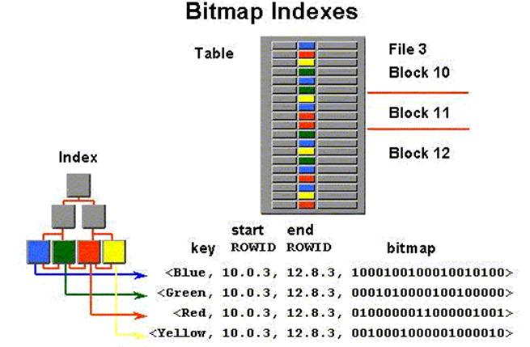

## Greenplum 最佳实践 - 什么时候选择bitmap索引      
##### [TAG 11](../class/11.md)
               
### 作者              
digoal              
              
### 日期                              
2017-05-12                             
                              
### 标签                              
PostgreSQL , Greenplum , bitmap index          
              
----              
              
## 背景            
PostgreSQL 目前支持8种索引接口，包括B-Tree, hash, gin, gist, sp-gist, brin, rum, bloom。      
      
Greenplum 目前支持B-Tree, GiST, bitmap三种索引接口。      
      
用户可以根据不同的数据类型，不同的请求类型，使用不同的索引接口建立相应的索引。例如对于数组，全文检索类型，可以使用GIN索引，对于地理位置数据，范围数据类型，图像特征值数据，几何类数据等，可以选择GiST索引。      
      
PG的八种索引的介绍，可以参考bruce写的index internal、源码以及如下文档      
      
http://leopard.in.ua/2015/04/13/postgresql-indexes#.WRHHH_mGOiQ      
      
## bitmap index 原理      
如图所示，bitmap索引将每个被索引的VALUE作为KEY，使用每个BIT表示一行，当这行中包含这个VALUE时，设置为1，否则设置为0。      
      
       
      
如何从bitmap 索引检索数据，并查找到对应HEAP表的记录呢？      
      
必须要有一个mapping 转换功能（函数），才能将BIT位翻译为行号。例如第一个BIT代表第一行，。。。以此类推。（当然了，mapping函数没有这么简单，还有很多优化技巧）      
      
bitmap 的优化技术举例，比如      
      
1\. 压缩      
      
例如连续的0或1可以被压缩，具体可以参考WIKI里面关于BITMAP的压缩算法，算法也是比较多的。      
      
2\. 分段或分段压缩      
      
例如，每个数据块作为一个分段，每个分段内，记录这个数据块中的VALU对应的BIT信息。      
      
3\. 排序      
      
排序是为了更好的进行压缩，例如堆表按被索引的列进行排序后，每个VALUE对应的行号就都是连续的了，压缩比很高。      
      
另外用户也可以参考一下roaring bitmap这个位图库，应用非常广泛，效果也很不错。      
      
https://github.com/zeromax007/gpdb-roaringbitmap      
      
https://github.com/RoaringBitmap/CRoaring      
      
## bitmap index 适合什么场景      
从bitmap index的结构我们了解到，被索引的列上面，每一个value都分别对应一个BIT串，BIT串的长度是记录数，每个BIT代表一行，1表示该行存在这个值，0表示该行不存在这个值。      
      
因此bitmap index索引的列，不能有太多的VALUE，最好是100到10万个VALUE，也就是说，这样的表的BITMAP索引有100到10万条BIT串。      
      
当我们对这个表的这个字段进行类似这样的查询时，效率就非常高。      
      
```      
select * from table where col = a and col = b and col2=xxx;        
-- a,b的bit串进行BITAND的操作，然后再和col2=xxx的BIT进行BITAND操作，返回BIT位为1的，使用bitmap function返回行号，取记录。      
      
select count(*) from table where col = a and col = b and col2=xxx;        
-- a,b的bit串进行BITAND的操作，然后再和col2=xxx的BIT进行BITAND操作，返回BIT位为1的，使用bitmap function返回行号，取记录，算count(*)。      
```      
      
1\. 适合有少量不重复值的列 。      
      
2\. 适合多个条件的查询，条件越多，bit and,or 的操作过滤掉的数据就越多，返回结果集越少。      
      
## bitmap index 不适合什么场景      
由于每个VALUE都要记录每行的BIT位，所以如果有1亿条记录，那么每个VALUE的BIT串长度就是1亿。如果有100万个不同的VALUE，那么BITMAP INDEX就有100万个长度为1亿的bit串。      
      
1\. 不适合有太多不重复值的表字段。      
      
2\. 同样，也不适合有太少不重复值的列，例如男女。这样的列，除非可以和其他列组合赛选出很少量的结果集，否则返回的结果集是非常庞大的，也是不适合的。      
      
3\. 不适合频繁的更新，因为更新可能带来行迁移，以及VALUE的变化。如果是行迁移，需要更新整个bitmap串。如果是VALUE变化，则需要修改整个与变化相关的VALUE的BIT串。      
      
## greenplum bitmap index手册    
### About Bitmap Indexes    
Greenplum Database provides the Bitmap index type.   
Bitmap indexes are best suited to data warehousing applications and decision support systems with large amounts of data, many ad hoc queries, and few data modification (DML) transactions.    
    
An index provides pointers to the rows in a table that contain a given key value.   
A regular index stores a list of tuple IDs for each key corresponding to the rows with that key value.   
Bitmap indexes store a bitmap for each key value. Regular indexes can be several times larger than the data in the table,   
but bitmap indexes provide the same functionality as a regular index and use a fraction of the size of the indexed data.    
    
Each bit in the bitmap corresponds to a possible tuple ID. If the bit is set, the row with the corresponding tuple ID contains the key value.   
A mapping function converts the bit position to a tuple ID. Bitmaps are compressed for storage.   
If the number of distinct key values is small, bitmap indexes are much smaller, compress better,   
and save considerable space compared with a regular index.   
The size of a bitmap index is proportional to the number of rows in the table times the number of distinct values in the indexed column.    
    
Bitmap indexes are most effective for queries that contain multiple conditions in the WHERE clause.   
Rows that satisfy some, but not all, conditions are filtered out before the table is accessed.   
This improves response time, often dramatically.    
    
### When to Use Bitmap Indexes    
Bitmap indexes are best suited to data warehousing applications where users query the data rather than update it.   
Bitmap indexes perform best for columns that have between 100 and 100,000 distinct values and when the indexed column is often queried in conjunction with other indexed columns.   
Columns with fewer than 100 distinct values, such as a gender column with two distinct values (male and female),   
usually do not benefit much from any type of index.   
On a column with more than 100,000 distinct values, the performance and space efficiency of a bitmap index decline.    
    
Bitmap indexes can improve query performance for ad hoc queries.   
AND and OR conditions in the WHERE clause of a query can be resolved quickly by performing the corresponding Boolean operations directly on the bitmaps before converting the resulting bitmap to tuple ids.   
If the resulting number of rows is small, the query can be answered quickly without resorting to a full table scan.    
    
### When Not to Use Bitmap Indexes    
Do not use bitmap indexes for unique columns or columns with high cardinality data,   
such as customer names or phone numbers.   
The performance gains and disk space advantages of bitmap indexes start to diminish on columns with 100,000 or more unique values,   
regardless of the number of rows in the table.    
    
Bitmap indexes are not suitable for OLTP applications with large numbers of concurrent transactions modifying the data.    
    
Use bitmap indexes sparingly. Test and compare query performance with and without an index.   
Add an index only if query performance improves with indexed columns.    
    
## greenplum中如何创建bitmap index    
```    
CREATE INDEX title_bmp_idx ON films USING bitmap (title);    
```    
    
## bitmap 在PG数据库中的应用      
      
在PostgreSQL中虽然没有bitmap索引，但是多个条件的查询，支持自动生成BIT，并通过BitmapAnd, BitmapOr操作，计算并合并结果。      
      
PostgreSQL is not provide persistent bitmap index.       
      
But it can be used in database to combine multiple indexes.       
      
PostgreSQL scans each needed index and prepares a bitmap in memory giving the       
locations of table rows that are reported as matching that index’s conditions.       
      
The bitmaps are then ANDed and ORed together as needed by the query.       
      
Finally, the actual table rows are visited and returned.      
      
## bitmap 的其他应用      
bitmap在阿里云RDS PG中进行了扩展，支持更多的BIT操作，用户可以通过varbit来维护自己业务数据相关的BIT索引（字段），例如用户画像系统，铁路售票系统，门禁广告系统等。      
      
[《阿里云RDS for PostgreSQL varbitx插件与实时画像应用场景介绍》](../201705/20170502_01.md)        
      
[《基于 阿里云 RDS PostgreSQL 打造实时用户画像推荐系统》](../201610/20161021_01.md)        
      
[《PostgreSQL 与 12306 抢火车票的思考》](../201611/20161124_02.md)        
      
[《门禁广告销售系统需求剖析 与 PostgreSQL数据库实现》](../201611/20161124_01.md)        
      
另外，roaring bitmap也可以作为一种数据类型，植入到PG中。      
      
https://github.com/zeromax007/gpdb-roaringbitmap      
        
## 参考        
https://gpdb.docs.pivotal.io/4390/admin_guide/ddl/ddl-index.html#topic93      
      
http://leopard.in.ua/2015/04/13/postgresql-indexes#.WRHHH_mGOiQ      
      
[《阿里云RDS for PostgreSQL varbitx插件与实时画像应用场景介绍》](../201705/20170502_01.md)        
      
[《基于 阿里云 RDS PostgreSQL 打造实时用户画像推荐系统》](../201610/20161021_01.md)        
      
https://github.com/zeromax007/gpdb-roaringbitmap      
      
  
<a rel="nofollow" href="http://info.flagcounter.com/h9V1"  ></a>  
  
  
  
  
  
  
## [digoal's 大量PostgreSQL文章入口](https://github.com/digoal/blog/blob/master/README.md "22709685feb7cab07d30f30387f0a9ae")
  
