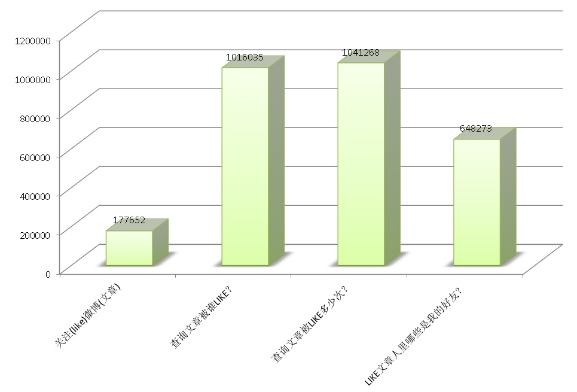

## 三体高可用PCC大赛 - facebook\微博 like场景 - 数据库设计与性能压测    
                   
### 作者                  
digoal                  
                  
### 日期                                  
2017-05-12                                 
                                  
### 标签                                  
PostgreSQL , pipelinedb , facebook , 微博 , 流式统计      
                  
----                  
                  
## 背景            
高可用架构的一个PCC大赛，看了一下比赛规则，发现PostgreSQL很适合做这个场景，原样复刻，使用PG实现以及性能表现到底如何？      
    
比赛内容介绍如下    
    
https://github.com/archnotes/PCC    
    
### 实现类似 facebook 中的 like 功能，需要：    
    
- 可以对一个对象（一条feed、文章、或者url）进行 like 操作，禁止 like 两次，第二次 like 返回错误码    
    
- 有 isLike 接口，返回参数指定的对象有没有被当前用户 like 过    
    
- 需要看到一个对象的 like 计数    
    
- 可以看到一个对象的 like 用户列表（类似 QQ 空间）；    
    
- 上述列表加分项：Like优先显示我的好友列表(social list)。    
    
- 数据量：每天新增的 like 对象数为 1 千万，每秒 like 计数器查询量为 30 万次 / 秒。    
    
### 数据量    
    
- 用户数量级1亿，好友数量级1~1万，单个对象的Like数量1-100万    
    
- 提供比赛数据集（纯文本格式），需要参赛人员自行导入到自己数据库    
    
### 测试数据集格式定义    
    
测试数据下载：https://github.com/archnotes/PCC/tree/master/data （非压测数据）    
    
#### 用户数据格式    
    
uid为uint64，1亿条    
    
```    
1,Tom    
2,Jerry    
```    
    
#### 用户好友数据格式    
    
uid, friend_id为uint64，只存在双向好友关系，1亿个用户*1000,好友关系通常是一个长尾分布，90% 100个以下，8%长尾分布300-1000,2% 1000-10000    
    
```    
1,2    
```    
    
#### 对象Like列表数据格式    
    
oid,uid为uint64，2亿个objects, 每个1-100w    
    
```    
101:[1,2,3,4,5]    
```    
    
## 数据库设计    
人与人的关系为关注，或者相互关注的关系。    
    
人与对象为喜欢或者不喜欢的关系。    
    
    
    
在设计时，分明细数据和统计数据，统计数据为了更快速的查询关系，被关注数。    
    
明细可以记录在日志，也可以记录在数据库中。统计数据（关系，计数，被LIKE等），以流处理的方式写入数据库。    
    
    
    
### 关系设计    
#### 结构设计    
    
```    
create table user_like(uid int8 primary key, like_who int8[]);   -- 关注谁？    
    
create table user_liked(uid int8 primary key, who_like int8[]);  -- 被谁关注了？本场景未涉及（如果需要的话，建立反向关系表）。    
    
create table obj(id int8 primary key, who_like int8[], like_cnt int8);   -- 对象被谁关注，总共被多少人关注，like_cnt 峰值每秒被查询30万次    
    
create table user_like_obj(uid int8 primary key, ids int8[]);   -- 用户like了哪些对象，本场景未涉及（如果需要的话，建立反向关系表）。    
```    
    
#### 查询实现    
    
1\. 人关注了哪些人，    
    
```    
select like_who from user_like where uid=?;    
```    
    
2\. 人被哪些人关注，本场景未涉及（如果需要的话，建立反向关系表）。    
    
```    
select who_like from user_liked where uid=?;    
```    
    
3\. 人LIKE了哪些对象，本场景未涉及（如果需要的话，建立反向关系表）。    
    
```    
select ids from user_like_obj where uid=?;    
```    
    
4\. 对象被哪些人LIKE，    
    
```    
select who_like from obj where id=?;    
```    
    
5\. 对象被LIKE了多少次    
    
```    
select like_cnt from obj where id=?;    
```    
    
6\. LIKE某对象的用户中，哪些是我的好友？    
    
```    
CREATE FUNCTION array_intersect(anyarray, anyarray)    
  RETURNS anyarray    
  language sql    
as $FUNCTION$    
    SELECT ARRAY(    
        SELECT UNNEST($1)    
        INTERSECT    
        SELECT UNNEST($2)    
    );    
$FUNCTION$;    
    
select array_intersect(t1.who_like, t2.like_who) from     
(    
select who_like from obj where id=?    
) t1    
,    
(    
select array[like_who] as like_who from user_like where uid=?    
) t2;    
```    
    
## DEMO    
建立流，关注的行为将写入流，同时写入明细（可选）。    
    
```    
create STREAM user_like(uid int8, like_who int8);   -- 关注谁？    
    
create STREAM obj(id int8, who_like int8);   -- 对象被谁关注？    
```    
    
建立持续视图，根据关注行为实时统计。    
    
```    
create CONTINUOUS VIEW cv_user_like as select uid, array_agg(like_who) as like_who from user_like group by uid;   -- 关注谁？    
create unique index idx1_cv_user_like on cv_user_like(uid);    
    
create CONTINUOUS VIEW cv_obj as select id, array_agg(who_like) as who_like, count(*) as like_cnt from obj group by id;  -- 对象被谁关注，总共被多少人关注，like_cnt 峰值每秒被查询30万次    
create unique index idx1_cv_obj on cv_obj(id);    
```    
    
激活流计算    
    
```    
pipeline=# activate ;    
ACTIVATE    
```    
    
关注（LIKE）操作函数，判断是否已关注，如果已关注，返回异常，否则关注。(这个也可以写在程序中，但是需要与数据库交互多次，差评)    
  
函数可以根据实际需求进行调整，比如需要返回被LIKE后的数组，查询一下continue view即可。  
    
```    
create or replace function f_user_like(i_uid int8, i_like_who int8) returns void as     
$$    
declare    
begin    
  perform 1 from cv_user_like where uid=i_uid and like_who @> array[i_like_who];  -- 未关注则关注   
  if not found then    
    insert into user_like values (i_uid, i_like_who);    
  end if;  
end;    
$$ language plpgsql strict;    
    
create or replace function f_obj(i_id int8, i_who_like int8) returns void as     
$$    
declare    
begin    
  perform 1 from cv_obj where id=i_id and who_like @> array[i_who_like];    
  if not found then    
    insert into obj values (i_id, i_who_like);    
  end if;    
end;    
$$ language plpgsql strict;    
```    
    
测试    
    
```    
1喜欢1号文章    
pipeline=# select f_obj(1,1);    
 f_obj     
-------    
     
(1 row)    
    
1喜欢1号文章    
pipeline=# select f_obj(1,1);    
 f_obj     
-------    
     
(1 row)    
    
1号文章被谁喜欢    
pipeline=# select * from cv_obj;    
 id | who_like | like_cnt     
----+----------+----------    
  1 | {1}      |        1    
(1 row)    
    
2喜欢1号文章    
pipeline=# select f_obj(1,2);    
 f_obj     
-------    
     
(1 row)    
    
1号文章被谁喜欢    
pipeline=# select * from cv_obj;    
 id | who_like | like_cnt     
----+----------+----------    
  1 | {1,2}    |        2    
(1 row)    
    
100喜欢1号文章    
pipeline=# select f_obj(1,100);    
 f_obj     
-------    
     
(1 row)    
    
1号文章被谁喜欢    
pipeline=# select * from cv_obj;    
 id | who_like  | like_cnt     
----+-----------+----------    
  1 | {1,2,100} |        3    
(1 row)    
```    
    
## 压测1    
    
1\. 用户ID范围    
    
1-1亿    
    
2\. 文章ID范围    
    
1-2亿    
    
3\. 热点文章ID范围    
    
总共2亿文章，使用高斯分布进行LIKE，分布在以钟鼎为中心的2.0/xx这个区间内的文章ID，覆盖了95%的出现概率。分布在1.0/xx这个区间的文章ID覆盖了67%的出现概率。   
  
横坐标越靠近鈡的顶端的值（即文章ID=1亿），产生的概率越高。    
   
xx越小，鈡越尖，也就是说热点文章越少。  
    
原理参考    
    
[《生成泊松、高斯、指数、随机分布数据 - PostgreSQL pg_bench 》](.../201506/20150618_01.md)     
   
  
    
4\. 随机用户喜欢随机文章    
    
5\. 随机用户喜欢热点文章    
    
### 首先根据以上要求生成基础数据    
压测脚本，LIKE文章，使用高斯分布产生文章ID，经过长时间的压测，文章被LIKE的次数呈现高斯分布，钟鼎的文章被LIKE的次数最多。        
  
xx设置为10.0，表示以钟鼎为中心的20%这个区间内的文章ID，覆盖了95%的出现概率。分布在10%这个区间的文章ID覆盖了67%的出现概率。  
  
xx越大，钟鼎的文章ID概率越高。    
    
```    
vi test.sql    
\setrandom uid 1 100000000    
\setrandom id 1 200000000 gaussian 10.0  
select f_obj(:id,:uid);    
```    
    
256个连接进行压测，测试结果，每秒产生17.7万次LIKE请求。     
    
```    
pgbench -M prepared -n -r -P 1 -f ./test.sql -c 256 -j 256 -T 120    
    
transaction type: Custom query
scaling factor: 1
query mode: prepared
number of clients: 256
number of threads: 256
duration: 120 s
number of transactions actually processed: 21331348
latency average: 1.438 ms
latency stddev: 0.591 ms
tps = 177652.080934 (including connections establishing)
tps = 177665.827969 (excluding connections establishing)
statement latencies in milliseconds:
        0.002267        \setrandom uid 1 100000000  
        0.002384        \setrandom id 1 200000000 gaussian 10.0
        1.433405        select f_obj(:id,:uid);  
```    
    
阶段性压测后文章数    
    
```    
pipeline=# select count(*) from cv_obj;
  count   
----------
 86842876
(1 row) 
    
-- 查询钟鼎附近的词被LIKE的次数  
  
pipeline=# select like_cnt from cv_obj where id=100000000;
 like_cnt 
----------
    18317
(1 row)

pipeline=# select like_cnt from cv_obj where id=100000001;
 like_cnt 
----------
    18410
(1 row)

pipeline=# select like_cnt from cv_obj where id=100000002;
 like_cnt 
----------
    18566
(1 row)

pipeline=# select like_cnt from cv_obj where id=100000000-1;
 like_cnt 
----------
    18380
(1 row)

pipeline=# select like_cnt from cv_obj where id=100000000-2;
 like_cnt 
----------
    18399
(1 row)
  
鈡的底部边缘被LIKE就很少  
pipeline=# select * from cv_obj where id>199999990;  
    id     |  who_like  | like_cnt   
-----------+------------+----------  
 199999991 | {89433428} |        1  
(1 row)  
```    
    
符合预期，继续压测。(或者我们也可以选择指数分布进行测试)      
    
暂时没有进行优化的情况下，CPU使用情况如下    
    
```    
Cpu(s): 35.2%us, 17.4%sy, 13.8%ni, 33.2%id,  0.3%wa,  0.0%hi,  0.1%si,  0.0%st    
    
主机上其他不相干进程的开销    
  PID USER      PR  NI  VIRT  RES  SHR S %CPU %MEM    TIME+  COMMAND                                                                                                                                                                             
16725 digoal    20   0 18.4g  11m  948 S 320.6  0.0   1:15.63 pgbench -M prepared -n -r -P 1 -f ./test.sql -c 256 -j 256 -T 120                                                                                                                  
18411 root      20   0  445m  58m 7048 R 98.8  0.0   0:03.25                                                            
18434 root      20   0  445m  58m 7040 R 87.5  0.0   0:02.71     
```    
    
持续压测like，产生2亿文章的LIKE数据，然后进入测试2。    
    
### 生成用户关系数据    
1\. 用户ID范围    
    
1-1亿    
    
2\. 用户好友分布    
    
90% 100个以下，8%长尾分布300-1000, 2% 1000-10000    
    
```    
关系表    
create table user_like_agg(uid int8 primary key, like_who int8[]);    
    
产生指定元素个数范围的数组    
create or replace function gen_uids(c1 int, c2 int) returns int8[] as    
$$     
select array(select (random()*100000000)::int8 from generate_series(1, c1+(random()*(c2-c1))::int));    
$$ language sql strict;    
    
序列    
create sequence seq cache 100;    
```    
    
产生90%的用户关系    
    
```    
vi gen90.sql    
insert into user_like_agg select nextval('seq'), gen_uids(1,100);    
    
pgbench -M prepared -n -r -P 1 -f ./gen90.sql -c 100 -j 100 -t 900000    
```    
    
产生8%的用户关系    
    
```    
vi gen8.sql    
insert into user_like_agg select nextval('seq'), gen_uids(300,1000);    
    
pgbench -M prepared -n -r -P 1 -f ./gen8.sql -c 100 -j 100 -t 80000    
```    
    
产生2%的用户关系    
    
```    
vi gen2.sql    
insert into user_like_agg select nextval('seq'), gen_uids(1000,10000);    
    
pgbench -M prepared -n -r -P 1 -f ./gen2.sql -c 100 -j 100 -t 20000    
```    
    
最终生成1亿用户，占用123GB空间，2.7GB索引。    
    
```    
pipeline=#     
pipeline=# \dt+ user_like_agg     
                        List of relations    
 Schema |     Name      | Type  |  Owner   |  Size  | Description     
--------+---------------+-------+----------+--------+-------------    
 public | user_like_agg | table | postgres | 123 GB |     
(1 row)    
    
pipeline=# \di+ user_like_agg_pkey     
                                   List of relations    
 Schema |        Name        | Type  |  Owner   |     Table     |  Size   | Description     
--------+--------------------+-------+----------+---------------+---------+-------------    
 public | user_like_agg_pkey | index | postgres | user_like_agg | 2706 MB |     
(1 row)    
    
pipeline=# select count(*) from user_like_agg ;    
   count       
-----------    
 100000000    
(1 row)    
```    
    
## 压测2    
1\. 查询文章被谁like？    
    
2\. 查询文章被like了多少次？    
    
3\. 查询LIKE某文章的用户中，哪些是我的好友？    
    
压测脚本1, 查询文章被谁like？   
    
```    
vi test1.sql    
\setrandom id 1 200000000    
select who_like from cv_obj where id=:id;    
    
pgbench -M prepared -n -r -P 1 -f ./test1.sql -c 128 -j 128 -T 120    
```    
    
压测脚本2, 查询文章被like了多少次？     
  
```
vi test2.sql    
\setrandom id 1 200000000    
select like_cnt from cv_obj where id=:id;    
    
pgbench -M prepared -n -r -P 1 -f ./test2.sql -c 128 -j 128 -T 120    
```
  
压测脚本3, 查询LIKE某文章的用户中，哪些是我的好友？    
    
```    
vi test3.sql    
\setrandom id 1 200000000    
\setrandom uid 1 100000000    
select array_intersect(t1.who_like, t2.like_who) from (select who_like from cv_obj where id=:id) t1,(select array[like_who] as like_who from user_like_agg where uid=:uid) t2;    
    
pgbench -M prepared -n -r -P 1 -f ./test3.sql -c 128 -j 128 -T 120    
```    
    
压测结果1，查询文章被谁like？ 达到 101万/s 并不意外。    
    
```    
transaction type: Custom query
scaling factor: 1
query mode: prepared
number of clients: 128
number of threads: 128
duration: 120 s
number of transactions actually processed: 121935264
latency average: 0.125 ms
latency stddev: 0.203 ms
tps = 1016035.198013 (including connections establishing)
tps = 1016243.580731 (excluding connections establishing)
statement latencies in milliseconds:
        0.001589        \setrandom id 1 1000000000
        0.123249        select who_like  from cv_obj where id=:id;
```    
    
压测结果2，查询文章被like了多少次？  104万/s。    
    
```    
transaction type: Custom query
scaling factor: 1
query mode: prepared
number of clients: 128
number of threads: 128
duration: 120 s
number of transactions actually processed: 124966713
latency average: 0.122 ms
latency stddev: 0.204 ms
tps = 1041268.730790 (including connections establishing)
tps = 1041479.852625 (excluding connections establishing)
statement latencies in milliseconds:
        0.001708        \setrandom id 1 1000000000
        0.120069        select like_cnt from cv_obj where id=:id;
```    
  
压测结果3，查询LIKE某文的用户中，哪些是我的好友？  64.8万/s。    
    
```    
transaction type: Custom query
scaling factor: 1
query mode: prepared
number of clients: 128
number of threads: 128
duration: 120 s
number of transactions actually processed: 77802915
latency average: 0.196 ms
latency stddev: 1.649 ms
tps = 648273.025370 (including connections establishing)
tps = 648368.477278 (excluding connections establishing)
statement latencies in milliseconds:
        0.001719        \setrandom id 1 1000000000
        0.000695        \setrandom uid 1 100000000
        0.193728        select array_intersect(t1.who_like, t2.like_who) from (select who_like from cv_obj where id=:id) t1,(select array[like_who] as like_who from user_like_agg where uid=:uid) t2;
```    
    
## 优化思路
1\. 数组越长，一条记录占用的空间会越大，使用TOAST切片存储，可以有效的提高查询非数组字段的效率。   
  
```
例如

alter table cv_obj alter column who_like set (storage=extended);
```
  
2\. profiling，针对性的优化。   
    
## 小结    
微博、facebook最常用的操作：    
    
1\. 关注人或者喜欢某条消息、微博等。    
    
这个属于写操作，要求写入快，并且要求写入（LIKE或关注）后立即反映出来。    
    
2\. 查询好友列表    
    
为了查询快速，最快的方法是PK查询，但是一个人可能关注很多人，如果是查询多条记录，很显然会比较慢。    
    
因此考虑使用数组存储好友列表。    
    
但是，使用数组存储列表，又需要考虑写入速度的问题。    
    
所以使用流计算聚合是最好的，因为PG有流计算插件，可以在数据库中完成流计算。    
    
3\. 查询被关注的好友列表    
    
反向好友关系，同样要求查询快速，使用正向关系一样的方法。    
    
4\. 查询文章（微博）被关注的次数，被关注人，被关注的人里有哪些是我的好友。    
    
首先被关注的次数，实际上就是个计数器。为了提高查询速度，它必须是一个VALUE而不是查询时使用COUNT(*)进行聚合。    
    
查询文章（微博）被关注的人，为了提高查询速度，同样考虑使用数组存储。使用PG内置的流计算进行聚合。    
    
被关注的人里面有哪些是我的好友，这个问题就很简单了，好友关系与文章（微博）被关注人的两个数组求交集即可。    
    
使用PG的流计算解决了实时写入，实时聚合的问题。    
    
同时由于数据实时被聚合，所以几个查询需求就显得非常轻松。    
    
测试得到的性能指标（未优化）：    
    
1\. 关注微博（文章）    
    
17.7万/s，预计可以优化到30万。    
    
2\. 查询文章被谁like？  
    
101.6万/s    
  
3\. 查询文章被like了多少次？   
    
104.1万/s    
    
4\. 查询LIKE某文章的用户中，哪些是我的好友？    
    
64.8万/s    
    
    
      
5\. 机器:    
    
（10W左右价位的X86，12*8TB SATA盘，1块SSD作为BCACHE）    
    
数据库内置流计算功能，是一件不错的事情。    
    
## 参考    
    
[《facebook linkbench 测试PostgreSQL社交关系图谱场景性能》](../201609/20160911_01.md)      
    
[《流计算风云再起 - PostgreSQL携PipelineDB力挺IoT》](../201612/20161220_01.md)      
    
[《PostgreSQL on Linux 最佳部署手册》](../201611/20161121_01.md)      
      
[《生成泊松、高斯、指数、随机分布数据 - PostgreSQL pg_bench 》](.../201506/20150618_01.md)   
  
<a rel="nofollow" href="http://info.flagcounter.com/h9V1"  ></a>  
  
  
  
  
  
  
## [digoal's 大量PostgreSQL文章入口](https://github.com/digoal/blog/blob/master/README.md "22709685feb7cab07d30f30387f0a9ae")
  
