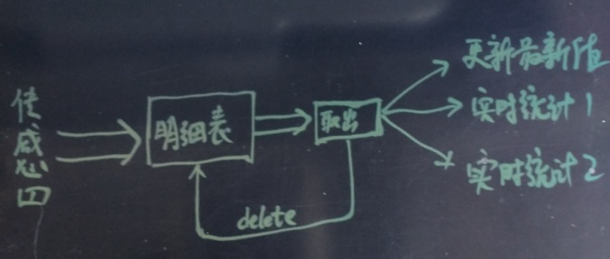
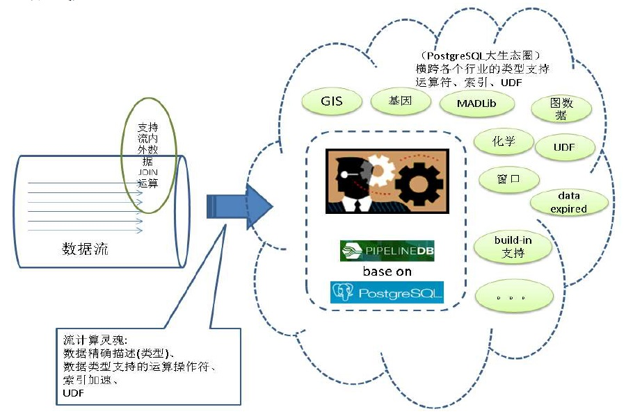
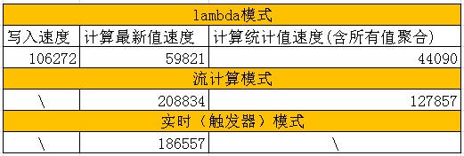

## (流式、lambda、触发器)实时处理大比拼 - 物联网(IoT)\金融,时序处理最佳实践  
##### [TAG 18](../class/18.md)
                                              
### 作者                                                                                           
digoal                                         
                                                
### 日期                                           
2017-05-18                                       
                                            
### 标签                                         
PostgreSQL , 物联网 , 传感器 , lambda , 调度 , 实时 , 流式更新 , UPSERT , insert on conflict do update                      
                                              
----                                        
                                                 
## 背景          
越来越多的数据要求实时的分析、聚合、展示最新值、展示异常值、实时的搜索。    
    
例如 金融数据、物联网传感器的数据、网络游戏的在线数据等等。    
    
    
    
关于实时搜索，可以参考这篇最佳实践：    
      
[《行为、审计日志 实时索引/实时搜索 - 最佳实践》](../201705/20170516_01.md)      
    
关于海量数据的"写入、共享、存储、计算"，以及离线分析，则可以参考这篇最佳实践：    
    
[《海量数据 "写入、共享、存储、计算" - 最佳实践》](../201705/20170509_02.md)      
    
关于实时分析、实时更新、实时聚合、实时展示最新值、异常值，是本文的主要内容。    
    
提起实时分析，不得不说流式计算，用户可以参考本文：    
    
[《流计算风云再起 - PostgreSQL携PipelineDB力挺IoT》](../201612/20161220_01.md)      
    
pipelinedb是一个SQL接口的流计算数据库，正在进行插件化的改造，未来可以作为PostgreSQL数据库的插件使用。    
    
本文将以传感器数据的实时写入、实时更新最新值、实时统计为例，分析三种不同的方案（流式、lambda式、同步实时）的优缺点。    
    
## 场景设计    
有一百万个传感器，每个传感器定期上报数据，用户需求：    
    
1\. 实时的查看传感器的最新值，    
    
2\. 实时按时间段查看传感器历史数据的统计值。    
    
3\. 实时查看传感器的历史明细数据。    
    
4\. 实时按其他维度查看传感器历史数据的统计值。    
    
由于数据量可能非常庞大（100TB级），为了实现这4个需求，要求统计数据需要实时或准实时的被计算出来。    
    
### 表结构设计    
#### 明细数据    
    
```    
create table sensor_data(    
  pk serial8 primary key, -- 主键    
  ts timestamp,  -- 时间戳    
  sid int,  -- 传感器ID    
  val numeric(10,2)  -- 数据    
);    
```    
    
### 实时聚合设计    
    
1\. 每个传感器最后的value    
    
```    
create table sensor_lastdata(    
  sid int primary key,  -- 传感器ID，主键    
  last_ts timestamp,  -- 时间戳    
  last_val numeric(10,2)  -- 值    
);    
```    
    
2\. 每个传感器每个时段（例如小时）的所有值，总和，记录数，最大值，最小值，平均值，方差。    
    
```    
create table sensor_aggdata(    
  sid int,  -- 传感器ID    
  ts_group varchar(10),  -- 时间维度分组，例如小时(yyyymmddhh24)    
  sum_val numeric,  -- 和    
  min_val numeric(10,2),  -- 最小值    
  max_val numeric(10,2),  -- 最大值    
  avg_val numeric(10,2),  -- 平均值    
  count_val int,  -- 计数    
  all_vals numeric(10,2)[],  -- 明细值    
  unique (sid,ts_group)  -- 唯一约束    
);    
```    
    
3\. 按地域或其他维度，实时统计传感器上报的数据    
    
略    
    
## 如何从明细数据取传感器的最新值    
    
取出每个传感器ID的最新值。使用SQL来取，有两种方法，一种是聚合，另一种是窗口函数。    
    
插入一批测试数据    
    
```    
postgres=#  insert into sensor_data(ts,sid,val) select clock_timestamp(), random()*100, random()*10000 from generate_series(1,100000);    
```    
    
方法1，聚合。    
    
按SID分组，将VAL聚合为数组（按PK逆序排序），取数组的第一个VALUE。    
    
参考用法：https://www.postgresql.org/docs/9.6/static/functions-aggregate.html    
    
```    
postgres=#  select sid, (array_agg(ts order by pk desc))[1] as last_ts, (array_agg(val order by pk desc))[1] as last_val from sensor_data group by sid;    
 sid |          last_ts           | last_val     
-----+----------------------------+----------    
   0 | 2017-05-18 14:09:10.625812 |  6480.54    
   1 | 2017-05-18 14:09:10.627607 |  9644.29    
   2 | 2017-05-18 14:09:10.627951 |  3995.04    
   3 | 2017-05-18 14:09:10.627466 |   840.80    
   4 | 2017-05-18 14:09:10.627703 |  1500.59    
   5 | 2017-05-18 14:09:10.627813 |  3109.42    
   6 | 2017-05-18 14:09:10.62754  |  4131.31    
   7 | 2017-05-18 14:09:10.627851 |  9333.88    
......    
```    
    
方法2，窗口。    
    
```    
postgres=# select sid,ts,val from (select sid,ts,val,row_number() over(partition by sid order by pk desc) as rn from sensor_data) t where rn=1;    
 sid |             ts             |   val       
-----+----------------------------+---------    
   0 | 2017-05-18 14:09:10.625812 | 6480.54    
   1 | 2017-05-18 14:09:10.627607 | 9644.29    
   2 | 2017-05-18 14:09:10.627951 | 3995.04    
   3 | 2017-05-18 14:09:10.627466 |  840.80    
   4 | 2017-05-18 14:09:10.627703 | 1500.59    
   5 | 2017-05-18 14:09:10.627813 | 3109.42    
   6 | 2017-05-18 14:09:10.62754  | 4131.31    
   7 | 2017-05-18 14:09:10.627851 | 9333.88    
......    
```    
    
这两种方法哪种好一点呢？请看执行计划    
    
```    
postgres=# set work_mem ='16MB';    
SET    
postgres=# explain (analyze,verbose,timing,costs,buffers) select sid, (array_agg(ts order by pk desc))[1] as last_ts, (array_agg(val order by pk desc))[1] as last_val from sensor_data group by sid;    
                                                             QUERY PLAN                                                                 
------------------------------------------------------------------------------------------------------------------------------------    
 GroupAggregate  (cost=7117.15..7823.57 rows=101 width=44) (actual time=29.628..88.095 rows=101 loops=1)    
   Output: sid, (array_agg(ts ORDER BY pk DESC))[1], (array_agg(val ORDER BY pk DESC))[1]    
   Group Key: sensor_data.sid    
   Buffers: shared hit=736    
   ->  Sort  (cost=7117.15..7293.38 rows=70490 width=26) (actual time=29.273..36.249 rows=70490 loops=1)    
         Output: sid, ts, pk, val    
         Sort Key: sensor_data.sid    
         Sort Method: quicksort  Memory: 8580kB    
         Buffers: shared hit=736    
         ->  Seq Scan on public.sensor_data  (cost=0.00..1440.90 rows=70490 width=26) (actual time=0.243..9.768 rows=70490 loops=1)    
               Output: sid, ts, pk, val    
               Buffers: shared hit=736    
 Planning time: 0.077 ms    
 Execution time: 88.489 ms    
(14 rows)    
    
postgres=# explain (analyze,verbose,timing,costs,buffers) select sid,ts,val from (select sid,ts,val,row_number() over(partition by sid order by pk desc) as rn from sensor_data) t where rn=1;    
                                                                QUERY PLAN                                                                    
------------------------------------------------------------------------------------------------------------------------------------------    
 Subquery Scan on t  (cost=7117.15..9408.08 rows=352 width=18) (actual time=46.074..81.377 rows=101 loops=1)    
   Output: t.sid, t.ts, t.val    
   Filter: (t.rn = 1)    
   Rows Removed by Filter: 70389    
   Buffers: shared hit=736    
   ->  WindowAgg  (cost=7117.15..8526.95 rows=70490 width=34) (actual time=46.072..76.115 rows=70490 loops=1)    
         Output: sensor_data.sid, sensor_data.ts, sensor_data.val, row_number() OVER (?), sensor_data.pk    
         Buffers: shared hit=736    
         ->  Sort  (cost=7117.15..7293.38 rows=70490 width=26) (actual time=46.065..51.742 rows=70490 loops=1)    
               Output: sensor_data.sid, sensor_data.pk, sensor_data.ts, sensor_data.val    
               Sort Key: sensor_data.sid, sensor_data.pk DESC    
               Sort Method: quicksort  Memory: 8580kB    
               Buffers: shared hit=736    
               ->  Seq Scan on public.sensor_data  (cost=0.00..1440.90 rows=70490 width=26) (actual time=0.245..9.863 rows=70490 loops=1)    
                     Output: sensor_data.sid, sensor_data.pk, sensor_data.ts, sensor_data.val    
                     Buffers: shared hit=736    
 Planning time: 0.100 ms    
 Execution time: 82.480 ms    
(18 rows)    
```    
    
## 实时更新、统计 - 设计与压测    
    
### 1. lambda    
lambda方式，传感器数据写入明细表，以任务调度的方式，从明细表取出数据并删除，将取出的数据进行增量统计，合并到统计结果中。    
    
    
    
统计维度可能较多，为了并行，剥离数据获取和删除部分的功能。    
    
批量获取并删除明细数据，按pk排序，批量获取若干条。    
    
函数如下：    
    
```    
create or replace function get_sensor_data(i_limit int) returns sensor_data[] as $$    
declare    
  arr_pk int8[];    
  arr_sensor_data sensor_data[];    
begin    
  select array_agg(t.sensor_data), array_agg((t.sensor_data).pk)    
    into arr_sensor_data, arr_pk    
    from (select sensor_data from sensor_data order by pk limit i_limit for update skip locked) t ;    
  delete from sensor_data WHERE pk = any (arr_pk);    
  return arr_sensor_data;    
end;    
$$ language plpgsql strict;    
```    
    
明细数据获取到之后，继续下一步的动作。    
    
存在则更新，不存在则插入，采用PostgreSQL的insert on conflict语法。    
    
1\. 实时更新传感器的最新值    
    
```    
insert into sensor_lastdata    
  select sid, (array_agg(ts order by pk desc))[1] as last_ts, (array_agg(val order by pk desc))[1] as last_val from     
    unnest(get_sensor_data(1000))     
  group by sid    
on conflict (sid) do update set last_ts=excluded.last_ts,last_val=excluded.last_val;    
```    
    
2\. 批量增量统计传感器的值    
    
统计值的合并方法请关注SQL内容，明细数据按SID聚合为数组按PK顺序存放。    
    
```    
insert into sensor_aggdata (sid,ts_group,sum_val,min_val,max_val,avg_val,count_val,all_vals)    
select sid,to_char(ts,'yyyymmddhh24'),sum(val),min(val),max(val),avg(val),count(val),array_agg(val order by pk) from unnest(get_sensor_data(1000))     
  group by sid,to_char(ts,'yyyymmddhh24')    
  on conflict (sid,ts_group) do update set     
    sum_val=sensor_aggdata.sum_val+excluded.sum_val,    
    min_val=least(sensor_aggdata.min_val, excluded.min_val),    
    max_val=greatest(sensor_aggdata.max_val, excluded.max_val),    
    avg_val=(sensor_aggdata.sum_val+excluded.sum_val)/(sensor_aggdata.count_val+excluded.count_val),    
    count_val=sensor_aggdata.count_val+excluded.count_val,    
    all_vals=array_cat(sensor_aggdata.all_vals, excluded.all_vals);    
```    
    
#### 压测    
    
```    
create table sensor_data(    
  pk serial8 primary key, -- 主键    
  ts timestamp,  -- 时间戳    
  sid int,  -- 传感器ID    
  val numeric(10,2)  -- 数据    
);    
    
create table sensor_lastdata(    
  sid int primary key,  -- 传感器ID，主键    
  last_ts timestamp,  -- 时间戳    
  last_val numeric(10,2)  -- 值    
);    
    
create table sensor_aggdata(    
  sid int,  -- 传感器ID    
  ts_group varchar(10),  -- 时间维度分组，例如小时(yyyymmddhh24)    
  sum_val numeric,  -- 和    
  min_val numeric(10,2),  -- 最小值    
  max_val numeric(10,2),  -- 最大值    
  avg_val numeric(10,2),  -- 平均值    
  count_val int,  -- 计数    
  all_vals numeric(10,2)[],  -- 明细值    
  unique (sid,ts_group)  -- 唯一约束    
);    
```    
    
##### 压测1，实时写入，并实时更新传感器的最新值    
    
```    
vi ins.sql    
\set sid random(1,1000000)    
insert into sensor_data(ts,sid,val) values (clock_timestamp(), :sid, random()*1000);    
```    
    
每次合并5万条    
    
```    
vi lambda1.sql    
insert into sensor_lastdata select sid, (array_agg(ts order by pk desc))[1] as last_ts, (array_agg(val order by pk desc))[1] as last_val from unnest(get_sensor_data(50000)) group by sid on conflict (sid) do update set last_ts=excluded.last_ts,last_val=excluded.last_val;    
```    
    
写入约10万条/s。    
    
```    
pgbench -M prepared -n -r -P 1 -f ./ins.sql -c 64 -j 64 -T 120    
    
transaction type: ./ins.sql    
scaling factor: 1    
query mode: prepared    
number of clients: 64    
number of threads: 64    
duration: 120 s    
number of transactions actually processed: 12742596    
latency average = 0.603 ms    
latency stddev = 2.163 ms    
tps = 106184.095420 (including connections establishing)    
tps = 106188.650794 (excluding connections establishing)    
script statistics:    
 - statement latencies in milliseconds:    
         0.001  \set sid random(1,1000000)    
         0.602  insert into sensor_data(ts,sid,val) values (clock_timestamp(), :sid, random()*1000);    
```    
    
增量消费，并更新最新值约5万条/s。    
    
```    
pgbench -M prepared -n -r -P 1 -f ./lambda1.sql -c 1 -j 1 -T 1200    
    
progress: 236.0 s, 1.0 tps, lat 649.196 ms stddev 0.000    
progress: 237.0 s, 2.0 tps, lat 868.952 ms stddev 6.024    
progress: 238.0 s, 1.0 tps, lat 728.553 ms stddev 0.000    
progress: 239.0 s, 258.1 tps, lat 5.335 ms stddev 44.167    
progress: 240.0 s, 850.9 tps, lat 0.983 ms stddev 14.506    
progress: 241.0 s, 7962.2 tps, lat 0.146 ms stddev 3.672    
progress: 242.0 s, 13488.1 tps, lat 0.074 ms stddev 0.006    
    
postgres=# select count(*) from sensor_data;    
 count     
-------    
     0    
(1 row)    
    
postgres=# select * from sensor_lastdata  limit 10;    
 sid  |          last_ts           | last_val     
------+----------------------------+----------    
  672 | 2017-05-18 16:33:43.569255 |   196.01    
  178 | 2017-05-18 16:33:31.23651  |   593.16    
  686 | 2017-05-18 16:33:38.792138 |   762.95    
 4906 | 2017-05-18 16:33:43.498217 |   150.13    
  544 | 2017-05-18 16:33:45.338635 |   410.31    
  165 | 2017-05-18 16:33:28.393902 |   678.75    
  625 | 2017-05-18 16:33:37.077898 |   229.06    
 1316 | 2017-05-18 16:33:45.218268 |    27.55    
 3091 | 2017-05-18 16:33:33.320828 |   697.75    
  340 | 2017-05-18 16:33:31.567852 |    24.18    
(10 rows)    
```    
    
每批统计10万时，性能可以略微提升    
    
```    
progress: 211.0 s, 1.0 tps, lat 1428.401 ms stddev 0.000    
progress: 212.0 s, 0.0 tps, lat -nan ms stddev -nan    
progress: 213.0 s, 1.0 tps, lat 1375.766 ms stddev 0.000    
progress: 214.0 s, 2665.9 tps, lat 0.699 ms stddev 23.234    
progress: 215.0 s, 8963.1 tps, lat 0.083 ms stddev 0.008    
progress: 216.0 s, 1699.4 tps, lat 0.741 ms stddev 12.434    
progress: 217.0 s, 13247.9 tps, lat 0.075 ms stddev 0.006    
```    
    
##### 压测2，实时写入，并批量增量统计传感器的值    
    
每次合并10万条    
    
```    
vi lambda2.sql    
insert into sensor_aggdata (sid,ts_group,sum_val,min_val,max_val,avg_val,count_val,all_vals) select sid,to_char(ts,'yyyymmddhh24'),sum(val),min(val),max(val),avg(val),count(val),array_agg(val order by pk) from unnest(get_sensor_data(100000))   group by sid,to_char(ts,'yyyymmddhh24')  on conflict (sid,ts_group) do update set     sum_val=sensor_aggdata.sum_val+excluded.sum_val,    min_val=least(sensor_aggdata.min_val, excluded.min_val),    max_val=greatest(sensor_aggdata.max_val, excluded.max_val),    avg_val=(sensor_aggdata.sum_val+excluded.sum_val)/(sensor_aggdata.count_val+excluded.count_val),    count_val=sensor_aggdata.count_val+excluded.count_val,    all_vals=array_cat(sensor_aggdata.all_vals, excluded.all_vals);    
```    
    
写入约10万条/s。    
    
```    
pgbench -M prepared -n -r -P 1 -f ./ins.sql -c 64 -j 64 -T 120    
    
transaction type: ./ins.sql    
scaling factor: 1    
query mode: prepared    
number of clients: 64    
number of threads: 64    
duration: 120 s    
number of transactions actually processed: 12753950    
latency average = 0.602 ms    
latency stddev = 2.733 ms    
tps = 106272.985233 (including connections establishing)    
tps = 106277.604416 (excluding connections establishing)    
script statistics:    
 - statement latencies in milliseconds:    
         0.001  \set sid random(1,1000000)    
         0.601  insert into sensor_data(ts,sid,val) values (clock_timestamp(), :sid, random()*1000);    
```    
    
增量消费，并统计约4.4万条/s。    
    
```    
pgbench -M prepared -n -r -P 1 -f ./lambda2.sql -c 1 -j 1 -T 1200    
    
progress: 287.0 s, 1.0 tps, lat 2107.584 ms stddev 0.000    
progress: 288.0 s, 0.0 tps, lat -nan ms stddev -nan    
progress: 289.0 s, 100.1 tps, lat 29.854 ms stddev 213.634    
progress: 290.0 s, 1855.0 tps, lat 0.540 ms stddev 5.677    
progress: 291.0 s, 8447.0 tps, lat 0.118 ms stddev 0.005    
    
postgres=# select * from sensor_aggdata limit 10;    
  sid   |  ts_group  | sum_val  | min_val | max_val | avg_val | count_val |                                                                      all_vals                                                                          
--------+------------+----------+---------+---------+---------+-----------+--------------------------------------------------------------------------------  
      6 | 2017051816 |  1842.71 |   42.47 |  577.09 |  307.12 |         6 | {42.47,559.47,577.09,193.62,75.74,394.32}    
      2 | 2017051816 |  5254.01 |   69.98 |  861.77 |  437.83 |        12 | {628.03,77.15,662.74,69.98,337.83,563.70,750.44,423.81,158.27,861.77,649.27,71.02}    
    226 | 2017051816 |  2756.42 |  144.00 |  680.45 |  344.55 |         8 | {350.57,144.00,194.23,352.52,680.45,302.66,420.01,311.98}    
    509 | 2017051816 |  6235.10 |   44.98 |  939.43 |  566.83 |        11 | {939.43,598.33,741.12,535.66,44.98,732.00,694.66,440.00,327.80,312.98,868.14}    
     20 | 2017051816 |  4684.00 |    7.01 |  878.64 |  425.82 |        11 | {209.70,288.67,76.35,544.31,289.33,7.01,841.21,878.64,418.05,651.01,479.72}    
 934042 | 2017051816 | 10210.41 |   46.44 |  945.59 |  486.21 |        21 | {235.86,656.24,450.73,945.59,932.06,256.10,46.44,903.74,694.43,713.79,523.25,325.82,333.67,603.01,743.63,137.48,238.60,321.65,466.50,70.49,611.33}   
    960 | 2017051816 |  3621.60 |   20.59 |  895.01 |  603.60 |         6 | {347.70,876.07,895.01,20.59,871.64,610.59}    
     81 | 2017051816 |  4209.38 |  459.06 |  949.42 |  701.56 |         6 | {716.38,949.42,706.20,459.06,613.36,764.96}    
 723065 | 2017051816 |  7176.00 |   12.37 |  983.84 |  512.57 |        14 | {869.29,715.48,323.42,595.29,983.84,700.06,716.37,741.55,137.88,12.37,334.74,951.94,46.85,46.92}    
     77 | 2017051816 |  5394.54 |   87.43 |  872.90 |  490.41 |        11 | {301.87,777.52,872.90,219.96,87.43,525.80,308.87,509.80,383.90,608.52,797.97}    
(10 rows)    
```    
    
### 2. 流式计算    
流式计算，使用PipelineDB，创建stream（即明细表），然后创建实时更新表，以及统计表。    
    
    
    
1\. 创建传感器明细数据stream。    
    
```    
create sequence seq;  -- 创建PK序列    
    
pipeline=# create stream sensor_data(    
pk int8, -- 用于排序，取最新值的PK    
ts timestamp, -- 时间戳    
sid int, -- 传感器ID    
val numeric(10,2)  -- 值    
);    
    
CREATE STREAM    
```    
    
2\. 创建实时更新传感器最新值的CONTINUOUS VIEW    
    
请使用pipelinedb独有的获取分组最新值的聚合函数       
    
```  
keyed_max ( key, value )  
  
Returns the value associated with the “highest” key.  
keyed_min ( key, value )  
  
Returns the value associated with the “lowest” key.  
```  
    
请勿使用```(array_agg(ts order by pk desc))[1]```，pipelinedb对```agg(order by)```支持不好        
    
```    
-- pipelinedb目前对agg(order by)支持不佳，测试写入时报错    
CREATE CONTINUOUS VIEW sensor_lastdata1 AS     
  select sid, (array_agg(ts order by pk desc))[1] as last_ts, (array_agg(val order by pk desc))[1] as last_val     
    from  sensor_data    
  group by sid;    
    
-- 1. 请使用这个SQL代替上面的SQL  
CREATE CONTINUOUS VIEW sensor_lastdata1 AS     
  select sid, keyed_max(pk, ts) as last_ts, keyed_max(pk, val) as last_val     
    from  sensor_data    
  group by sid;    
    
-- pipelinedb目前不支持window function，使用keyed_max, keyed_min代替。      
CREATE CONTINUOUS VIEW sensor_lastdata2 AS     
  select sid,ts as last_ts,val as last_val from sensor_data    
  where row_number() over(partition by sid order by pk desc)=1;    
    
ERROR:  subqueries in continuous views cannot contain window functions    
```    
    
3\. 创建实时统计传感器数值，以及明细聚合的CONTINUOUS VIEW    
    
```    
-- pipelinedb目前对agg(order by)支持不佳，测试写入时报错    
CREATE CONTINUOUS VIEW sensor_aggdata1 AS     
  select     
  sid,    
  to_char(ts,'yyyymmddhh24') as ts_group,    
  sum(val) as sum_val,    
  min(val) as min_val,    
  max(val) as max_val,    
  avg(val) as avg_val,    
  count(val) as count_val,    
  array_agg(val order by pk) as all_vals    
    from sensor_data    
  group by sid,to_char(ts,'yyyymmddhh24');    
    
-- 2. 请使用这个SQL代替上面的SQL  
CREATE CONTINUOUS VIEW sensor_aggdata1 AS     
  select     
  sid,    
  to_char(ts,'yyyymmddhh24') as ts_group,    
  sum(val) as sum_val,    
  min(val) as min_val,    
  max(val) as max_val,    
  avg(val) as avg_val,    
  count(val) as count_val,    
  jsonb_object_agg (pk, val) as all_vals    
    from sensor_data    
  group by sid,to_char(ts,'yyyymmddhh24');    
```    
    
4\. 激活CONTINUOUS VIEW    
    
```    
pipeline=# activate sensor_lastdata1;    
ACTIVATE    
pipeline=# activate sensor_aggdata1;    
ACTIVATE    
```    
    
#### 压测    
    
```    
vi ins.sql    
    
\set sid random(1,1000000)    
insert into sensor_data(pk,ts,sid,val) values (nextval('seq'), clock_timestamp(), :sid, random()*1000);    
```    
    
pipelinedb目前对agg(order by)支持不佳的报错，如果你没有使用替代SQL，会收到如下报错。    
    
```    
/home/digoal/pgsql10/bin/pgbench -M prepared -n -r -P 1 -f ./ins.sql -c 1 -j 1 -T 100    
    
progress: 1.0 s, 12.0 tps, lat 1.302 ms stddev 0.455    
WARNING:  a background worker crashed while processing this batch    
HINT:  Some of the tuples inserted in this batch might have been lost.    
progress: 2.0 s, 16.0 tps, lat 70.528 ms stddev 253.719    
WARNING:  a background worker crashed while processing this batch    
HINT:  Some of the tuples inserted in this batch might have been lost.    
WARNING:  a background worker crashed while processing this batch    
HINT:  Some of the tuples inserted in this batch might have been lost.    
WARNING:  a background worker crashed while processing this batch    
HINT:  Some of the tuples inserted in this batch might have been lost.    
```    
    
使用替代SQL，压测结果:      
  
1\. 聚合values，压测结果：  
  
写入速度12.7万/s。    
  
```  
/home/digoal/pgsql10/bin/pgbench -M prepared -n -r -P 1 -f ./ins.sql -c 256 -j 256 -T 100    
  
transaction type: ./ins.sql  
scaling factor: 1  
query mode: prepared  
number of clients: 256  
number of threads: 256  
duration: 100 s  
number of transactions actually processed: 12840629  
latency average = 1.994 ms  
latency stddev = 14.671 ms  
tps = 127857.131372 (including connections establishing)  
tps = 127864.890658 (excluding connections establishing)  
script statistics:  
 - statement latencies in milliseconds:  
         0.001  \set sid random(1,1000000)    
         1.997  insert into sensor_data(pk,ts,sid,val) values (nextval('seq'), clock_timestamp(), :sid, random()*1000);  
```  
  
```  
pipeline=# select * from sensor_aggdata1 limit 10;  
-[ RECORD 1 ]----------------------------------------------------------------------------------------------------------------------------------------------  
sid       | 444427  
ts_group  | 2017052410  
sum_val   | 4902.07  
min_val   | 18.69  
max_val   | 980.26  
avg_val   | 445.6427272727272727  
count_val | 11  
all_vals  | {"41971591": 731.45, "42075280": 69.63, "42629210": 980.26, "45243895": 18.69, "45524545": 320.88, "46971341": 741.88, "47036195": 357.47, "47895869": 562.16, "49805560": 136.78, "51753795": 344.00, "53039367": 638.87}  
```  
    
2\. 不聚合VALUES，压测结果：  
  
写入速度20万/s。    
  
```  
CREATE CONTINUOUS VIEW sensor_aggdata2 AS     
  select     
  sid,    
  to_char(ts,'yyyymmddhh24') as ts_group,    
  sum(val) as sum_val,    
  min(val) as min_val,    
  max(val) as max_val,    
  avg(val) as avg_val,    
  count(val) as count_val    
  -- jsonb_object_agg (pk, val) as all_vals    
    from sensor_data    
  group by sid,to_char(ts,'yyyymmddhh24');    
```  
      
```    
/home/digoal/pgsql10/bin/pgbench -M prepared -n -r -P 1 -f ./ins.sql -c 256 -j 256 -T 100    
    
transaction type: ./ins.sql    
scaling factor: 1    
query mode: prepared    
number of clients: 256    
number of threads: 256    
duration: 100 s    
number of transactions actually processed: 20940292    
latency average = 1.222 ms    
latency stddev = 0.423 ms    
tps = 208834.531839 (including connections establishing)    
tps = 208854.792937 (excluding connections establishing)    
script statistics:    
 - statement latencies in milliseconds:    
         0.001  \set sid random(1,1000000)    
         1.222  insert into sensor_data(pk,ts,sid,val) values (nextval('seq'), clock_timestamp(), :sid, random()*1000);    
    
    
pipeline=# select * from sensor_aggdata2;    
 sid  |  ts_group  |   sum_val   | min_val | max_val |       avg_val        | count_val     
------+------------+-------------+---------+---------+----------------------+-----------    
  196 | 2017051815 | 11462397.00 |    0.00 |  999.99 | 503.1780948200175593 |     22780    
  833 | 2017051815 | 11479990.49 |    0.07 |  999.99 | 498.4365443730461966 |     23032    
  700 | 2017051815 | 11205820.52 |    0.04 |  999.97 | 497.1967574762623125 |     22538    
   83 | 2017051815 | 11466423.01 |    0.01 |  999.93 | 501.3959075604530150 |     22869    
  526 | 2017051815 | 11389541.40 |    0.01 |  999.99 | 503.4496485877204615 |     22623    
  996 | 2017051815 | 11416373.92 |    0.03 |  999.99 | 502.1938996172964413 |     22733    
  262 | 2017051815 | 11458700.05 |    0.03 |  999.98 | 499.5509656465254163 |     22938    
  542 | 2017051815 | 11365373.33 |    0.00 |  999.95 | 499.6427366246098387 |     22747    
......    
```    
    
### 3. 实时    
    
实时的写入明细，同步更新最终状态。    
    
（同步统计不推荐使用，对写入的RT性能影响比较大）    
    
实时更新传感器最终状态表    
    
```    
create table sensor_lastdata(    
  sid int primary key,    
  last_ts timestamp,    
  last_val numeric(10,2)    
);    
```    
    
压测1，更新传感器实时状态    
    
```    
vi ins.sql    
    
\set sid random(1,1000000)    
insert into sensor_lastdata values (:sid, now(), random()*1000) on conflict (sid) do update set last_ts=excluded.last_ts,last_val=excluded.last_val;    
```    
    
性能，约18万/s。    
    
```    
/home/digoal/pgsql10/bin/pgbench -M prepared -n -r -P 1 -f ./ins.sql -c 128 -j 128 -T 100    
    
transaction type: ./ins.sql    
scaling factor: 1    
query mode: prepared    
number of clients: 128    
number of threads: 128    
duration: 100 s    
number of transactions actually processed: 18659587    
latency average = 0.686 ms    
latency stddev = 2.566 ms    
tps = 186557.140033 (including connections establishing)    
tps = 186565.458460 (excluding connections establishing)    
script statistics:    
 - statement latencies in milliseconds:    
         0.001  \set sid random(1,1000000)    
         0.684  insert into sensor_lastdata values (:sid, now(), random()*1000) on conflict (sid) do update set last_ts=excluded.last_ts,last_val=excluded.last_val;    
```    
    
## 三种方案对比    
    
### 性能对比    
  
    
1\. 写入明细记录的速度    
    
lambda方式：10.6万/s    
  
流计算方式(含val明细聚合)：12.78万/s    
  
流计算方式(不含val明细聚合)：20.8万/s    
    
2\. 更新最终状态速度    
    
lambda方式：5.98万/s    
    
实时方式：18.6万/s    
  
流计算方式：20.8万/s    
    
3\. 统计速度    
    
lambda方式(含val明细聚合)：4.4万/s    
    
流计算方式(含val明细聚合)：12.78万/s    
  
流计算方式(不含val明细聚合)：20.8万/s    
    
### 优劣与适用场合对比    
    
1\. lambda方式    
    
性能中规中矩，通过UDF + 增量调度，支持所有的统计模式。    
    
目前这个方案有成熟的用户案例(某大数据平台)，支持了每天数TB的数据准实时统计。    
    
同时也期待PG社区开发这样的功能：     
    
```  
delete from table order by pk limit xxx skip locked returning array_agg(ts),array_agg(val) group by sid;  
```  
    
这种QUERY将以最小的开销，从数据中删除并返回一批记录。相比本例，也许能提升一倍性能。        
    
2\. 流计算方式    
    
性能最高，使用也便利，推荐使用。  
  
将来pipelinedb插件化之后，使用起来就更加方便了。  
    
3\. 实时方式    
    
如果只是用来更新最终状态，建议使用，开发工作量最少，不需要调度。    
    
## 参考    
[《PostgreSQL upsert功能(insert on conflict do)的用法》](../201704/20170424_04.md)      
    
[《PostgreSQL 如何实现upsert与新旧数据自动分离》](../201605/20160524_02.md)    
    
[《[转载]postgresql 9.5版本之前实现upsert功能》](../201604/20160429_01.md)    
    
[《流计算风云再起 - PostgreSQL携PipelineDB力挺IoT》](../201612/20161220_01.md)      
    
[《行为、审计日志 实时索引/实时搜索 - 最佳实践》](../201705/20170516_01.md)     
    
[《海量数据 "写入、共享、存储、计算" - 最佳实践》](../201705/20170509_02.md)      
    
http://docs.pipelinedb.com/streams.html    
    
  
<a rel="nofollow" href="http://info.flagcounter.com/h9V1"  ></a>  
  
  
  
  
  
  
## [digoal's 大量PostgreSQL文章入口](https://github.com/digoal/blog/blob/master/README.md "22709685feb7cab07d30f30387f0a9ae")
  
