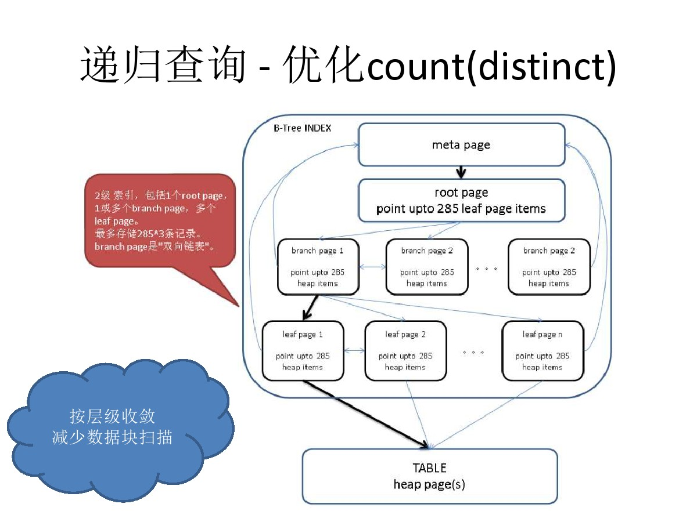

## PostgrSQL 递归SQL的几个应用 - 极客与正常人的思维
                                
### 作者                                                                             
digoal                           
                                  
### 日期                             
2017-05-19                         
                              
### 标签                           
PostgreSQL , with recursive , 递归查询 , 求差 , 求唯一值 , 求稀疏列 , 求时序数据最新值  
                                
----                          
                                   
## 背景     
  
## 递归SQL的几个应用  
递归查询，在几个场景的应用，有十全大补丸的功效。  
  
## 一、求唯一值  
### 场景  
某张表，数据量在亿级别，求某稀疏列的唯一值。  
  
```  
create table sex (sex char(1), otherinfo text);    
create index idx_sex_1 on sex(sex);    
insert into sex select 'm', generate_series(1,50000000)||'this is test';    
insert into sex select 'w', generate_series(1,50000000)||'this is test';    
```  
  
### 正常人的做法 - 蜗牛  
  
```  
select distinct col from table ;  
```  
  
蜗牛般的速度。  
  
### 极客的做法 - 0.17毫秒 
  
```  
with recursive skip as (    
  (    
    select min(t.sex) as sex from sex t where t.sex is not null    
  )    
  union all    
  (    
    select (select min(t.sex) as sex from sex t where t.sex > s.sex and t.sex is not null)     
      from skip s where s.sex is not null   
  )    
)     
select * from skip where sex is not null;   
  
Total runtime: 0.173 ms    
```  
  
飞一般的感觉。  
  
## 二、求差  
### 场景  
  
一张小表A，里面存储了一些ID，大约几百个。  
   
（比如说巡逻车辆ID，环卫车辆的ID，公交车，微公交的ID）。    
  
另外有一张日志表B，每条记录中的ID是来自前面那张小表的，但不是每个ID都出现在这张日志表中，比如说一天可能只有几十个ID会出现在这个日志表的当天的数据中。  
  
（比如车辆的行车轨迹数据，每秒上报轨迹，数据量就非常庞大）。    
  
怎么快速的找出今天没有出现的ID？  
  
（哪些巡逻车辆没有出现在这个片区，是不是偷懒了？哪些环卫车辆没有出行，哪些公交或微公交没有出行）？      
  
建表  
  
```  
create table a(id int primary key, info text);  
  
create table b(id int primary key, aid int, crt_time timestamp);  
create index b_aid on b(aid);  
```  
  
插入测试数据  
  
```  
-- a表插入1000条  
insert into a select generate_series(1,1000), md5(random()::text);  
  
-- b表插入500万条，只包含aid的500个id。  
insert into b select generate_series(1,5000000), generate_series(1,500), clock_timestamp();  
```  
  
### 正常人的做法 - 2.3秒 
  
```  
select * from a where id not in (select aid from b);   
618秒  
  
select a.id from a left join b on (a.id=b.aid) where b.* is null;  
2.3秒  
```  
  
### 极客的做法 - 11毫秒  
  
```  
select * from a where id not in   
(  
with recursive skip as (    
  (    
    select min(aid) aid from b where aid is not null    
  )    
  union all    
  (    
    select (select min(aid) aid from b where b.aid > s.aid and b.aid is not null)     
      from skip s where s.aid is not null    
  )    
)     
select aid from skip where aid is not null  
);  
  
11毫秒  
```  
  
飞一般的感觉。  
  
## 三、求时序数据最新值  
### 场景  
  
有很多传感器，不断的在上报数据，用户需要查询当前最新的，每个传感器上报的值。  
  
这种需求，可以使用窗口查询，但是如何加速，如何快速的取出批量数据？  
  
创建测试表如下，  
  
```  
create unlogged table sort_test(  
  id serial8 primary key,  -- 主键  
  c2 int,  -- 传感器ID  
  c3 int  -- 传感器值  
);    
```  
     
写入1000万传感器测试数据，10万个传感器。  
  
```  
postgres=# insert into sort_test (c2,c3) select random()*100000, random()*100 from generate_series(1,10000000);  
INSERT 0 10000000  
```  
  
### 正常人的做法 - 44秒  
  
```  
select id,c2,c3 from (select id,c2,c3,row_number() over(partition by c2 order by id desc) rn from sort_test) t where rn=1;  
  
44秒  
```  
  
### 极客的做法 - 4秒  
```
create type r as (c2 int, c3 int);
```
    
```  
postgres=# create index sort_test_1 on sort_test(c2,id desc);   
CREATE INDEX  
  
with recursive skip as (    
  (    
    select (c2,c3)::r as r from sort_test where id in (select id from sort_test where c2 is not null order by c2,id desc limit 1)   
  )    
  union all    
  (    
    select (  
      select (c2,c3)::r as r from sort_test where id in (select id from sort_test t where t.c2>(s.r).c2 and t.c2 is not null order by c2,id desc limit 1)   
    ) from skip s where (s.r).c2 is not null  
  )      
)     
select (t.r).c2, (t.r).c3 from skip t where t.* is not null;   
  
4.2秒  
```  
  
如果数据需要处理或实时展示，流式返回  
  
```  
postgres=# begin;  
BEGIN  
Time: 0.079 ms  
postgres=# declare cur cursor for with recursive skip as (    
  (    
    select (c2,c3)::r as r from sort_test where id in (select id from sort_test where c2 is not null order by c2,id desc limit 1)   
  )    
  union all    
  (    
    select (  
      select (c2,c3)::r as r from sort_test where id in (select id from sort_test t where t.c2>(s.r).c2 and t.c2 is not null order by c2,id desc limit 1)   
    ) from skip s where (s.r).c2 is not null  
  )      
)     
select (t.r).c2, (t.r).c3 from skip t where t.* is not null;   
DECLARE CURSOR  
Time: 1.240 ms  
postgres=# fetch 100 from cur;  
    r       
----------  
 (0,93)  
 (1,52)  
 (2,65)  
.....  
  (97,78)  
 (98,44)  
 (99,99)  
(100 rows)  
  
Time: 4.314 ms  
```  
  
飞一般的感觉。  
  
## 原理  
通过递归，结合索引，收敛需要扫描的数据块，极大的减少IO，CPU开销。同时在时序场景，减少SORT和GROUP的开销。   
  
  

## 递归的其他应用
[《PostgreSQL 递归查询CASE - 树型路径分组输出》](../201703/20170324_01.md)  

[《用PostgreSQL找回618秒逝去的青春 - 递归收敛优化》](../201612/20161201_01.md)  

[《distinct xx和count(distinct xx)的变态递归优化方法 - 索引收敛(skip scan)扫描》](../201611/20161128_02.md)  

[《时序数据合并场景加速分析和实现 - 复合索引，窗口分组查询加速，变态递归加速》](../201611/20161128_01.md)  

[《PostgreSQL 使用递归SQL 找出数据库对象之间的依赖关系》](../201607/20160725_01.md)  

[《PostgreSQL 递归死循环案例及解法》](../201607/20160723_01.md)  

[《PostgreSQL 递归查询一例 - 资金累加链》](../201604/20160405_01.md)  

[《PostgreSQL Oracle 兼容性之 - WITH 递归 ( connect by )》](../201512/20151221_02.md)  

[《递归优化CASE - group by & distinct tuning case : use WITH RECURSIVE and min() function》](../201210/20121009_01.md)  

[《递归优化CASE - performance tuning case :use cursor\trigger\recursive replace (group by and order by) REDUCE needed blockes scan》](../201209/20120914_01.md)  

[《PostgreSQL 树状数据存储与查询(非递归) - Use ltree extension deal tree-like data type》](../201105/20110527_01.md)  
  
  
<a rel="nofollow" href="http://info.flagcounter.com/h9V1"  ></a>  
  
  
  
  
  
  
## [digoal's 大量PostgreSQL文章入口](https://github.com/digoal/blog/blob/master/README.md "22709685feb7cab07d30f30387f0a9ae")
  
