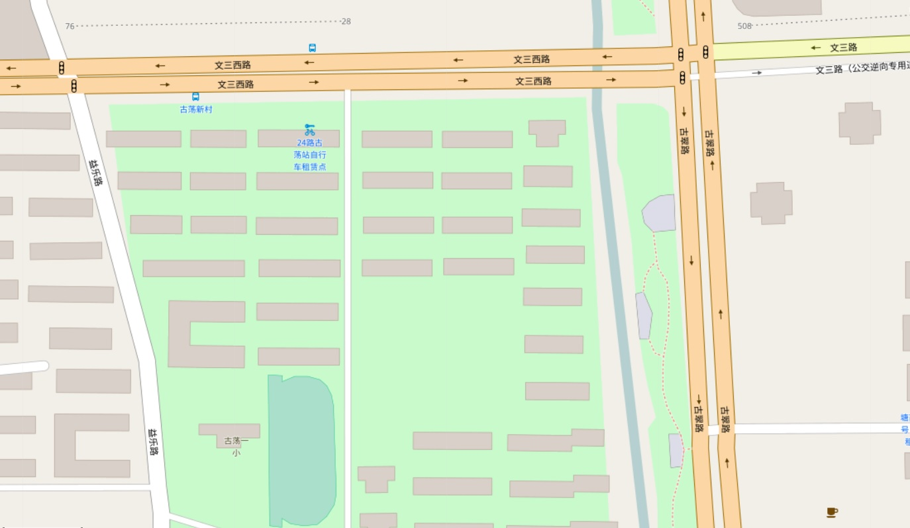
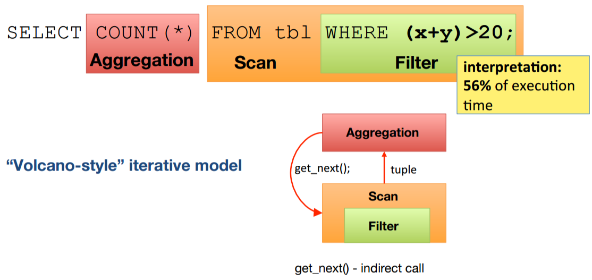
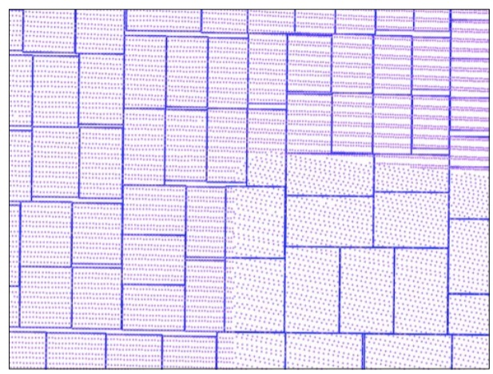
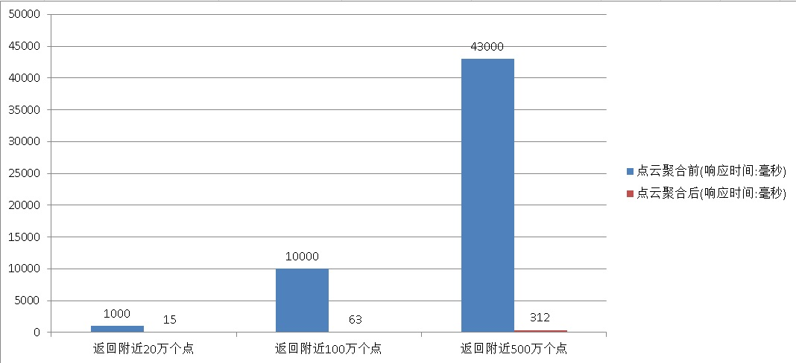
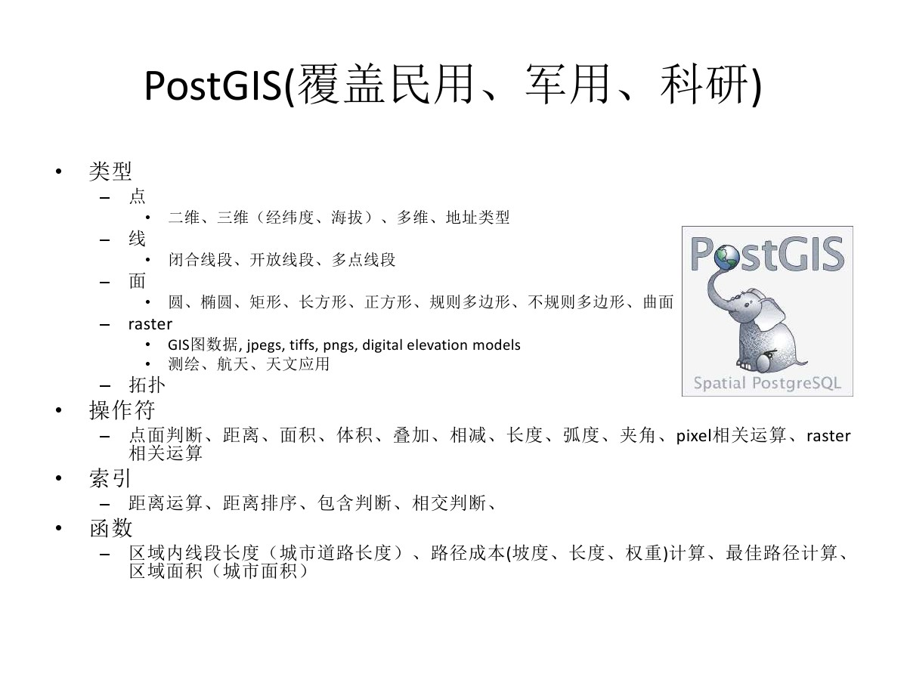
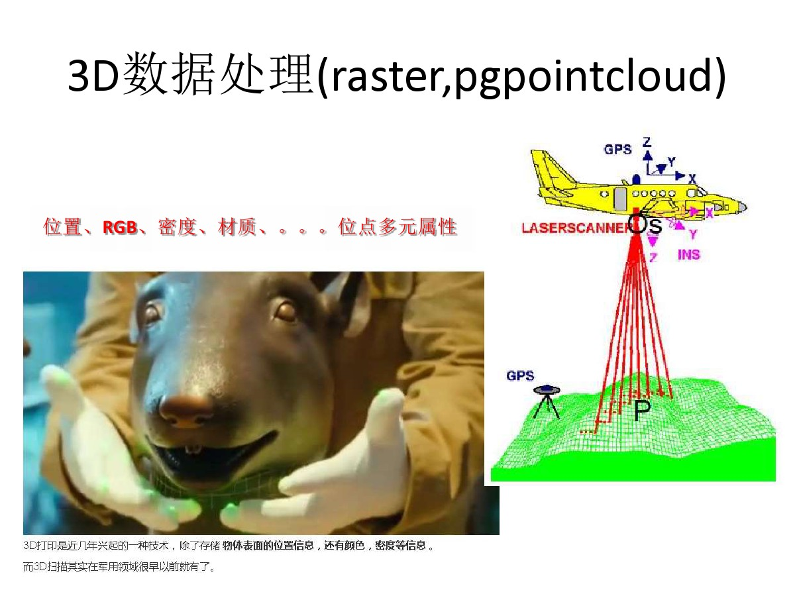
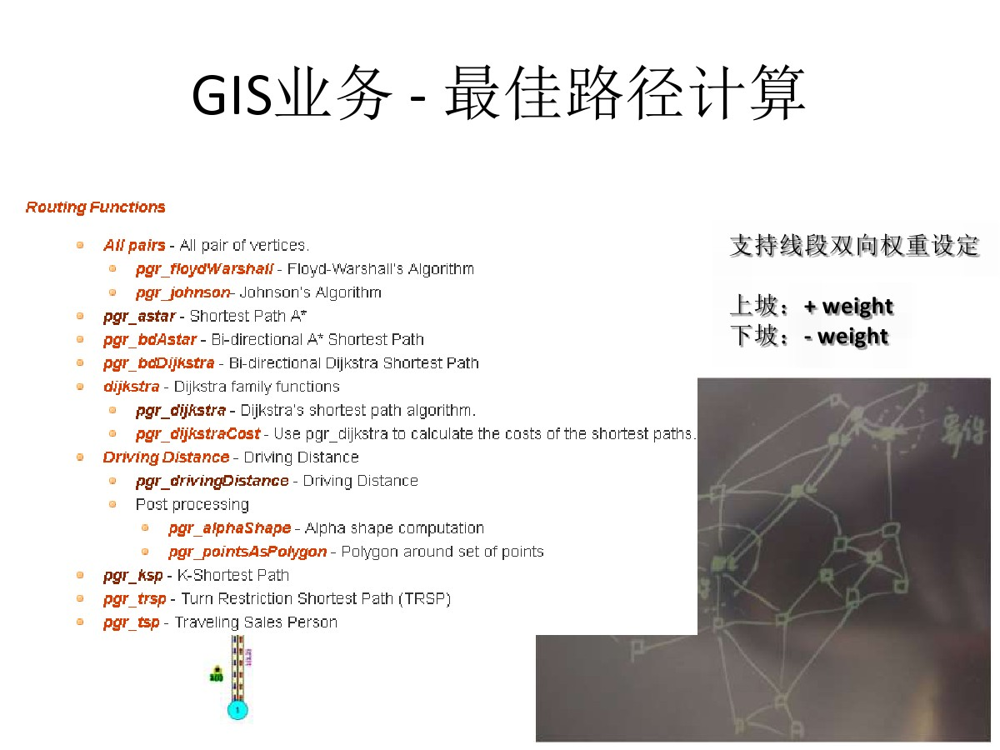
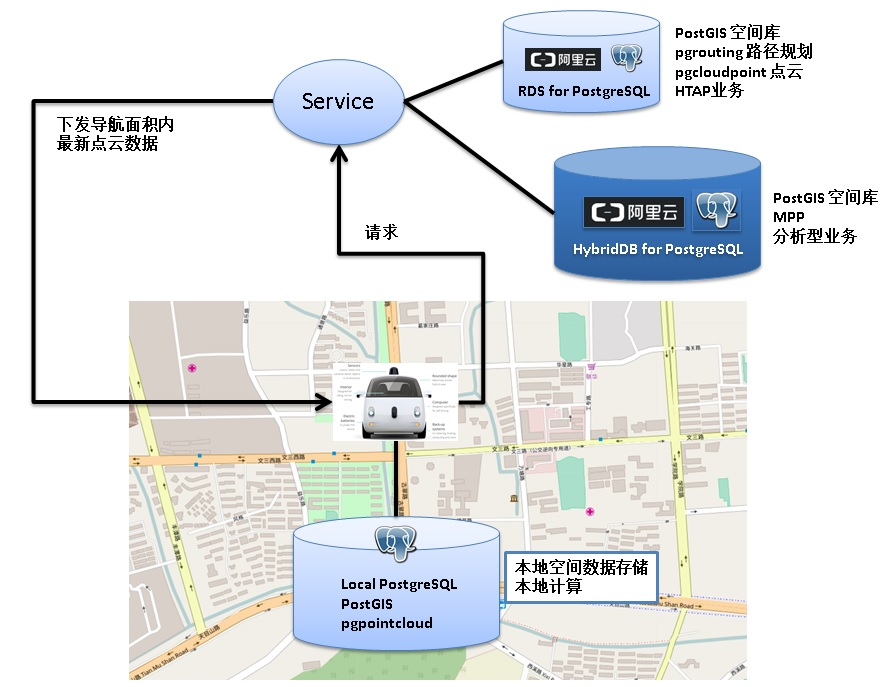

## 无人驾驶背后的技术 - PostGIS点云(pointcloud)应用 - 1
                                  
### 作者                                                                               
digoal                             
                                    
### 日期                               
2017-05-19                           
                                
### 标签                             
PostgreSQL , PostGIS , box , grid , pointcloud , pgpointcloud , point聚合 , KNN , 自动驾驶 , 自动配送 , 无人驾驶 , 机器人配送 , 物流       
                                  
----                            
                                     
## 背景       
科幻电影的场景随着技术的发展，正在一步步的从荧幕变成现实。从军用到民用，比如汽车厂商、科技公司在尝试的无人驾驶，无人飞行器。  
  
无人驾驶应用非常广泛，比如快递行业，时机成熟以后，将来可能快递员这个职业也会逐渐从社会上消失(解放快递员的双手和创造力，让更多的人参与到科技改变生活当中)。  
  
不管是无人驾驶的汽车还是飞行器，少不了导航，导航少不了位置信息，位置信息又是由无数的点组成的。点越多，精细度越高，就像照片一样，以前的手机像素和感光元件很粗糙，拍摄的照片清晰度就不如现在的手机。  
  
  
  
  
  
要达到无人驾驶的可用性，对于点的密度也是有要求的，比如，每平方米一个点的话，1平方公里就是100万个点。1米显然也是一个比较粗糙的数据，但是还好，如果只是驾驶，不需要覆盖到所有的点，只需要覆盖到道路所占面积即可。  
  
比如双向6车道，宽度25米的道路，100公里需要多少个点来描述呢？  如果每平方米一个点，需要250万个点，如果每平方米再划分10个格子，那么需要2500万个点，如果每平方米划分成100个格子，那么需要2.5亿个点。（使用PostgreSQL PostGIS可以做到更精细，使用point经纬度表示(float8,float8)，并非格子表示。有些数据库使用geohash表示，精确度受限。有兴趣的童鞋可以参考 [《geohash vs PostGIS》](../201704/20170422_01.md)  ）  
  
大概的point体量知道了之后，如何与无人驾驶结合起来呢？  
  
为了方便描述，把point点阵称为点云(pointcloud)。当设定了无人驾驶的起始点和路径，需要将涉及道路的点都载入汽车，每个点除了位置，还应该有其他属性，比如窨井盖、坑、水泥路OR沥青路、红绿灯、硬路肩等，这些属性可以使用其他字段存储。  
  
点云作为位置与属性数据与自动驾驶软件结合使用。  
  
## 一、使用什么存储点云  
PostGIS是一个非常流行的GIS数据管理插件，在天文、科研、军工、互联网应用广泛，阿里云RDS for PostgreSQL集成了PostGIS。你可以选择RDS for PostgreSQL或者自己安装PostgreSQL+PostGIS。  
  
我们可以将数据存储在PostgreSQL中，数据类型使用geometry，索引使用GiST，检索性能杠杆的。  
  
## 二、建模  
  
  
  
每条道路由若干个点组成，车辆启动时，定位，并载入附近的点，返回与道路的多边形相交的点。要做到无人驾驶，点云的分辨率（密度）要求很高，前面讲了，双向6车道，宽度25米的道路，每平方米使用100个点表示时，100公里需要2.5亿个点。  
  
如果无人驾驶的车辆运行速度为1公里每分钟(相当于时速60公里)，那么点的载入速度至少要达到250万点/分钟。  
  
我们先使用每条记录表示一个点（后面再来谈优化）。  
  
1\. 表结构（以RDS for PostgreSQL举例）  
  
```  
create extension postgis;  -- 创建postgis插件  
  
postgres=# create table cloudpoint_test(  
  id serial primary key,  -- 主键  
  loc geometry,        -- 经纬度(或point)  
  other text           -- 其他属性  
);  
CREATE TABLE  
```  
  
2\. GIST索引  
  
```  
postgres=# create index idx on cloudpoint_test using gist(loc) with (buffering=on);  
CREATE INDEX  
```  
  
## 三、点云的数据写入速度  
1\. 灌入测试数据，50个并发，灌入1亿测试数据。(随机点的边界是横竖10000，覆盖1亿个点。)  
  
```  
vi ins.sql  
  
insert into cloudpoint_test (loc,other) values (st_makepoint(random()*10000, random()*10000) , 'test');  
```  
  
2\. 灌入数据性能指标，每秒灌入约 16.6 万条记录。  
  
```  
pgbench -M prepared -n -r -P 1 -f ./ins.sql -c 50 -j 50 -t 2000000  
  
transaction type: Custom query  
scaling factor: 1  
query mode: prepared  
number of clients: 50  
number of threads: 50  
number of transactions per client: 2000000  
number of transactions actually processed: 100000000/100000000  
latency average: 0.298 ms  
latency stddev: 0.854 ms  
tps = 166737.438650 (including connections establishing)  
tps = 166739.148413 (excluding connections establishing)  
statement latencies in milliseconds:  
        0.297896        insert into cloudpoint_test (loc,other) values (st_makepoint(random()*10000, random()*10000) , 'test');  
```  
  
## 四、点云搜索设计  
为了达到最好的性能，建议参考如下文章，原理请感兴趣的童鞋打开了细读  
  
[《GIS附近查找性能优化 - PostGIS long lat geometry distance search tuning using gist knn function》](../201308/20130806_01.md)  
  
1\. 搜索point函数如下  
  
```  
create or replace function ff(geometry, float8, int) returns setof record as $$                                                          
declare  
  v_rec record;  
  v_limit int := $3;  
begin  
  set local enable_seqscan=off;   -- 强制索引, 扫描行数够就退出.  
  for v_rec in   
    select *,  
    ST_Distance ( $1, loc ) as dist   
    from cloudpoint_test   
    order by loc <-> $1           -- 按距离顺序由近到远返回  
  loop  
    if v_limit <=0 then           -- 判断返回的记录数是否达到LIMIT的记录数  
      raise notice '已经取足limit设置的 % 条数据, 但是距离 % 以内的点可能还有.', $3, $2;  
      return;  
    end if;  
    if v_rec.dist > $2 then       -- 判断距离是否大于请求的距离   
      raise notice '距离 % 以内的点已输出完毕', $2;  
      return;  
    else  
      return next v_rec;  
    end if;  
    v_limit := v_limit -1;  
  end loop;  
end;  
$$ language plpgsql strict volatile;  
```  
  
2\. 搜索SQL用法  
  
搜索距离st_makepoint(1500,1500)在100以内，按距离由近到远，返回最多10000条记录(limie 10000)。  
  
```  
postgres=# select * from ff(st_makepoint(1500,1500), 100, 10000) as t (id int, loc geometry, other text, dist float8);  
NOTICE:  已经取足limit设置的 10000 条数据, 但是距离 100 以内的点可能还有.  
    id     |                    loc                     | other |       dist          
-----------+--------------------------------------------+-------+-------------------  
  54528779 | 01010000000000EFF6307297400000010D306E9740 | test  | 0.710901366481036  
  52422694 | 01010000000080EE51B171974000003DE6256D9740 | test  | 0.829108575682196  
  20123322 | 0101000000000074AD5C6F97400000C766CE739740 | test  |   0.9648380442046  
  58784192 | 010100000000803A65F4749740008012FDD8709740 | test  |  1.25666215808279  
......
```  
  
## 五、点云的搜索速度  
1\. 搜索st_makepoint(5000,5000)附近距离1000以内的20万个点，按距离由近到远返回。  
  
1秒。  
  
```  
explain (analyze,verbose,timing,costs,buffers) select * from ff(st_makepoint(5000,5000), 1000, 200000) as t(id int, loc geometry, other text, dist float8);  
  
NOTICE:  已经取足limit设置的 200000 条数据, 但是距离 1000 以内的点可能还有.  
                                                       QUERY PLAN                                                         
------------------------------------------------------------------------------------------------------------------------  
 Function Scan on public.ff t  (cost=0.25..10.25 rows=1000 width=76) (actual time=917.748..945.838 rows=200000 loops=1)  
   Output: id, loc, other, dist  
   Function Call: ff('0101000000000000000088B340000000000088B340'::geometry, 1000::double precision, 200000)  
   Buffers: shared hit=201288, temp read=1418 written=1417  
 Planning time: 0.057 ms  
 Execution time: 959.534 ms  
(6 rows)  
```  
  
2\. 搜索st_makepoint(5000,5000)附近距离2000以内的100万个点，按距离由近到远返回。  
  
10秒。  
  
```  
explain (analyze,verbose,timing,costs,buffers) select * from ff(st_makepoint(5000,5000), 2000, 1000000) as t(id int, loc geometry, other text, dist float8);  
  
NOTICE:  已经取足limit设置的 1000000 条数据, 但是距离 2000 以内的点可能还有.  
                                                        QUERY PLAN                                                           
---------------------------------------------------------------------------------------------------------------------------  
 Function Scan on public.ff t  (cost=0.25..10.25 rows=1000 width=76) (actual time=8867.007..9006.401 rows=1000000 loops=1)  
   Output: id, loc, other, dist  
   Function Call: ff('0101000000000000000088B340000000000088B340'::geometry, 2000::double precision, 1000000)  
   Buffers: shared hit=1006220, temp read=7082 written=7081  
 Planning time: 0.059 ms  
 Execution time: 9074.267 ms  
(6 rows)  
```  
  
3\. 搜索st_makepoint(5000,5000)附近距离3000以内的500万个点，按距离由近到远返回。  
  
43秒。  
  
```  
explain (analyze,verbose,timing,costs,buffers) select * from ff(st_makepoint(5000,5000), 3000, 5000000) as t(id int, loc geometry, other text, dist float8);  
  
NOTICE:  已经取足limit设置的 5000000 条数据, 但是距离 3000 以内的点可能还有.  
                                                         QUERY PLAN                                                            
-----------------------------------------------------------------------------------------------------------------------------  
 Function Scan on public.ff t  (cost=0.25..10.25 rows=1000 width=76) (actual time=42168.038..42861.462 rows=5000000 loops=1)  
   Output: id, loc, other, dist  
   Function Call: ff('0101000000000000000088B340000000000088B340'::geometry, 3000::double precision, 5000000)  
   Buffers: shared hit=5030448, temp read=35402 written=35401  
 Planning time: 0.060 ms  
 Execution time: 43201.879 ms  
(6 rows)  
```  
  
现在看起来性能还不错对吧？但是优化是没有止境的，所以还有优化空间，有兴趣的话，可以继续请往下看。  
  
## 六、点云搜索瓶颈分析  
瓶颈分为3个方面  
  
1\. 函数回调  
  
由于需要返回的记录数非常多，PostgreSQL的返回记录回调也非常多，导致了较大开销。详见：  
  
[《分析加速引擎黑科技 - LLVM、列存、多核并行、算子复用 大联姻 - 一起来开启PostgreSQL的百宝箱》](../201612/20161216_01.md)    
  
  
  
  
  
  
  
使用perf可以观察  
  
```  
perf record -ag -p $PID  
  
perf report -ag --stdio  
```  
  
2\. 离散扫描IO放大  
  
由于点位数据可能是随机采录的，所以在堆存储层面没有顺序可言，同时搜索某个点附近的点时，也没有顺序可言，离散的IO请求导致了HEAP IO放大。原理详见：  
  
[《索引顺序扫描引发的堆扫描IO放大背后的统计学原理与解决办法》](../201404/20140426_01.md)    
  
3\. GiST索引离散度品质  
  
GiST索引构建时，也有索引条目的离散度的问题，参考：  
  
https://www.postgresql.org/docs/10.0/static/gist-implementation.html  
  
```  
Beginning in version 9.2,   
PostgreSQL supports a more efficient method to build GiST indexes based on buffering,   
which can dramatically reduce the number of random I/Os needed for non-ordered data sets.   
  
For well-ordered data sets the benefit is smaller or non-existent,   
because only a small number of pages receive new tuples at a time,   
and those pages fit in cache even if the index as whole does not.  
```  
  
以上三个问题如何优化呢？  
  
## 七、点云搜索优化  
  
### 1. get next tuple回调优化  
回调太多，返回或处理非常多记录时可能有瓶颈，有3种优化方法。  
  
#### 1 聚合  
  
前面我们精细化到了每平米100个点（100条记录），如果我们把每平米（作为一个格子），将这100条记录聚合为1条记录，那么记录的总数将下降100倍。  
  
1亿记录下降到100万，用户请求的记录数也下降100倍。  
  
  
  
聚合后的表结构设计如下  
  
```  
postgres=# create table cloudpoint_test_agg(  
  id serial primary key,        -- 主键  
  loc_box geometry,          -- 格子(闭合多边形), 表示一个范围内的点  
  loc_agg geometry[],        -- 经纬度数组(或point数组)  
  other_agg text[]           -- 其他属性数组  
);  
CREATE TABLE  
  
create index idx_cloudpoint_test_agg_1 on cloudpoint_test_agg using gist(loc_box) with (buffering=on);  
```  
  
##### 如何聚合？  
  
首先将道路多边形网格化处理，转换为相邻的六边形网格，参考如下方法：  
  
[《蜂巢的艺术与技术价值 - PostgreSQL PostGIS's hex-grid》](../201701/20170124_01.md)    
  
转换后的道路信息如下  
  
```  
create table cloudpoint_test_grid(  
  id serial primary key,    -- 六边形ID  
  loc_box geometry     -- 单个六边形  
);  
```  
  
将网格与点云数据JOIN，并聚合为聚合后的数据。  
  
```  
insert into cloudpoint_test_agg (loc_box,loc_agg,other_agg)  
  select t1.loc_box, array_agg(t2.loc) as loc_agg, array_agg(t2.other) as other_agg from   
    cloudpoint_test_grid t1 join cloudpoint_test t2  
    on (ST_Contains(t1.loc_box, t2.loc)) group by t1.loc_box;   
```  
  
例子  
  
本例使用标准正方形进行网格化，((0,0),(10000,10000)) 区域的网格化操作如下  
  
每100*100一个格子。  
  
  
  
http://postgis.net/docs/manual-2.3/ST_MakeBox2D.html  
  
```  
do language plpgsql $$  
declare  
  x int;  
  y int;  
begin  
  for x in select generate_series(0,10000,100) loop  
    for y in select generate_series(0,10000,100) loop  
      insert into cloudpoint_test_grid(loc_box) values (ST_MakeBox2D( st_makepoint(x,y), st_makepoint(x+100, y+100) ));  
    end loop;  
  end loop;  
end;  
$$;  
```  
  
```  
postgres=# select * from cloudpoint_test_grid;  
  id   |                                                                                          loc_box                                                                                             
-------+--------------------------------------------------------------------------------------------------------------------------------------------------------------------------------------------  
     1 | 010300000001000000050000000000000000000000000000000000000000000000000000000000000000005940000000000000594000000000000059400000000000005940000000000000000000000000000000000000000000000000  
     2 | 010300000001000000050000000000000000000000000000000000594000000000000000000000000000006940000000000000594000000000000069400000000000005940000000000000594000000000000000000000000000005940  
     3 | 010300000001000000050000000000000000000000000000000000694000000000000000000000000000C0724000000000000059400000000000C072400000000000005940000000000000694000000000000000000000000000006940  
     4 | 0103000000010000000500000000000000000000000000000000C07240000000000000000000000000000079400000000000005940000000000000794000000000000059400000000000C0724000000000000000000000000000C07240  
  
......  
```  
  
生成聚合数据  
  
```  
insert into cloudpoint_test_agg (loc_box,loc_agg,other_agg)  
  select t1.loc_box, array_agg(t2.loc) as loc_agg, array_agg(t2.other) as other_agg from   
    cloudpoint_test_grid t1 join cloudpoint_test t2  
    on (ST_Contains(t1.loc_box, t2.loc)) group by t1.loc_box;   
  
INSERT 0 10000  
  
select count(*) from cloudpoint_test_agg;  
10000  
```  
  
从聚合后的点云数据搜索附近点的函数如下  
  
```  
create or replace function ff1(geometry, float8, int) returns setof record as $$                                                          
declare  
  v_rec record;  
  v_limit int := $3;  
begin  
  set local enable_seqscan=off;   -- 强制索引, 扫描行数够就退出.  
  for v_rec in   
    select *,  
    ST_Distance ( $1, loc_box ) as dist   
    from cloudpoint_test_agg   
    order by loc_box <-> $1           -- 按距离顺序由近到远返回  
  loop  
    if v_limit <=0 then           -- 判断返回的记录数是否达到LIMIT的记录数  
      raise notice '已经取足limit设置的 % 条数据, 但是距离 % 以内的点可能还有.', $3, $2;  
      return;  
    end if;  
    if v_rec.dist > $2 then       -- 判断距离是否大于请求的距离   
      raise notice '距离 % 以内的点已输出完毕', $2;  
      return;  
    else  
      return next v_rec;  
    end if;  
    v_limit := v_limit - array_length(v_rec.loc_agg, 1);  -- 扣减grid内的point个数  
  end loop;  
end;  
$$ language plpgsql strict volatile;  
```  
   
##### 聚合方法2 
使用st_geohash(geometry)提取点的geohash值，根据geohash的preifx进行聚合。   
  
感兴趣的童鞋可以去了解一下geohash，相邻的POINT，GEOHASH的VALUE也是相邻的。   
  
##### 聚合后的搜索SQL例子  
  
搜索距离st_makepoint(1500,1500)在100以内，按距离由近到远，返回最多10000条记录(limie 10000)。  
  
```  
postgres=# select * from ff1(st_makepoint(1500,1500), 100, 10000) as t (id int, loc_box geometry, loc_agg geometry[], other_agg text[], dist float8);  
```  
  
##### 聚合后的速度测试  
  
1\. 搜索st_makepoint(5000,5000)附近距离1000以内的20万个点，按距离由近到远返回。  
  
15毫秒。  
  
```  
postgres=# explain (analyze,verbose,timing,costs,buffers) select * from ff1(st_makepoint(5000,5000), 1000, 200000) as t (id int, loc_box geometry, loc_agg geometry[], other_agg text[], dist float8);  
NOTICE:  已经取足limit设置的 200000 条数据, 但是距离 1000 以内的点可能还有.  
                                                     QUERY PLAN                                                       
--------------------------------------------------------------------------------------------------------------------  
 Function Scan on public.ff1 t  (cost=0.25..10.25 rows=1000 width=108) (actual time=15.642..15.643 rows=20 loops=1)  
   Output: id, loc_box, loc_agg, other_agg, dist  
   Function Call: ff1('0101000000000000000088B340000000000088B340'::geometry, 1000::double precision, 200000)  
   Buffers: shared hit=465  
 Planning time: 0.082 ms  
 Execution time: 15.670 ms  
(6 rows)  
```  
  
2\. 搜索st_makepoint(5000,5000)附近距离2000以内的100万个点，按距离由近到远返回。  
  
63毫秒。  
  
```  
postgres=# explain (analyze,verbose,timing,costs,buffers) select * from ff1(st_makepoint(5000,5000), 2000, 1000000) as t (id int, loc_box geometry, loc_agg geometry[], other_agg text[], dist float8);  
NOTICE:  已经取足limit设置的 1000000 条数据, 但是距离 2000 以内的点可能还有.  
                                                     QUERY PLAN                                                        
---------------------------------------------------------------------------------------------------------------------  
 Function Scan on public.ff1 t  (cost=0.25..10.25 rows=1000 width=108) (actual time=63.287..63.296 rows=100 loops=1)  
   Output: id, loc_box, loc_agg, other_agg, dist  
   Function Call: ff1('0101000000000000000088B340000000000088B340'::geometry, 2000::double precision, 1000000)  
   Buffers: shared hit=2143  
 Planning time: 0.057 ms  
 Execution time: 63.322 ms  
(6 rows)  
```  
  
3\. 搜索st_makepoint(5000,5000)附近距离3000以内的500万个点，按距离由近到远返回。  
  
312毫秒。  
  
```  
postgres=# explain (analyze,verbose,timing,costs,buffers) select * from ff1(st_makepoint(5000,5000), 3000, 5000000) as t (id int, loc_box geometry, loc_agg geometry[], other_agg text[], dist float8);  
NOTICE:  已经取足limit设置的 5000000 条数据, 但是距离 3000 以内的点可能还有.  
                                                      QUERY PLAN                                                         
-----------------------------------------------------------------------------------------------------------------------  
 Function Scan on public.ff1 t  (cost=0.25..10.25 rows=1000 width=108) (actual time=312.315..312.394 rows=501 loops=1)  
   Output: id, loc_box, loc_agg, other_agg, dist  
   Function Call: ff1('0101000000000000000088B340000000000088B340'::geometry, 3000::double precision, 5000000)  
   Buffers: shared hit=10729  
 Planning time: 0.077 ms  
 Execution time: 312.463 ms  
(6 rows)  
```  
  
聚合前后的性能对比图  
  
    
  
#### 2 pgpointcloud  
pgpointcloud是PostgreSQL中的一个存储点云数据(LIDAR)的插件，具有类似PostGIS raster数据的功能，同时还有更丰富的扩展功能。  
  
https://github.com/pgpointcloud/pointcloud  
  
  
  
[《LIDAR in PostgreSQL with PointCloud》](20170519_02_pdf_001.pdf)  
  
LIDAR传感器，在扫描空间时可能快速的产生上百万的点，每个点除了包含XYZ坐标值，还可能包含更多其他维度信息，例如时间、RGB值、其他属性，还有可能返回的是一批点。  
  
因此没有固定的类型来存储LIDAR传感器上报的数据，pgpointcloud使用"schema document"类型来描述LIDAR传感器上报的数据，格式与PDAL库的标准一致。  
  
每一个点包含若干维度的信息，每个维度可能是任意数据类型，类似复合类型。  
  
```  
LIDAR sensors quickly produce millions of points with large numbers of variables measured on each point.   
  
The challenge for a point cloud database extension is efficiently storing this data while allowing high fidelity access to the many variables stored.  
  
Much of the complexity in handling LIDAR comes from the need to deal with multiple variables per point.   
  
The variables captured by LIDAR sensors varies by sensor and capture process.   
  
Some data sets might contain only X/Y/Z values.   
  
Others will contain dozens of variables: X, Y, Z; intensity and return number; red, green, and blue values; return times; and many more.   
  
There is no consistency in how variables are stored:   
intensity might be stored in a 4-byte integer, or in a single byte; X/Y/Z might be doubles, or they might be scaled 4-byte integers.  
  
PostgreSQL Pointcloud deals with all this variability by using a "schema document" to describe the contents of any particular LIDAR point.   
  
Each point contains a number of dimensions, and each dimension can be of any data type,   
with scaling and/or offsets applied to move between the actual value and the value stored in the database.   
  
The schema document format used by PostgreSQL Pointcloud is the same one used by the PDAL library.  
```  
  
pgpointcloud是专为处理LIDAR数据而设计的插件，推荐使用。  
  
#### 3 LLVM（JIT）  
由于被处理的记录多，导致get next tuple的开销可能被放大，解决办法是降低回调的开销，可以使用code gen，也可以使用向量计算的方法。  
  
参考如下：  
  
[《PostgreSQL 10.0 preview 性能增强 - 推出JIT开发框架(朝着HTAP迈进)》](../201703/20170330_02.md)    
  
[《分析加速引擎黑科技 - LLVM、列存、多核并行、算子复用 大联姻 - 一起来开启PostgreSQL的百宝箱》](../201612/20161216_01.md)     
  
[《PostgreSQL 向量化执行插件(瓦片式实现) 10x提速OLAP》](../201702/20170225_01.md)    
  
性能提升参考以上文档，向量计算有10倍提升，LLVM至少有2倍提升。    
  
### 2. GiST索引优化  
gist 索引优化，目的是减少碎片。使用GiST的buffering开关即可，建索引时可以指定。  
  
```  
create index idx_cloudpoint_test_agg_1 on cloudpoint_test_agg using gist(loc_box) with (buffering=on);  
create index idx_cloudpoint_test_1 on cloudpoint_test using gist(loc) with (buffering=on);  
```  
  
### 3. 流式返回  
由于返回的记录较多，除了批量一次性返回，还有一种方法，流式的返回。  
  
流式返回有两种方法，一种是游标，另一种是异步消息。  
  
1\. 游标实现流式返回。  
  
```  
begin;  
  
declare cur1 cursor for select * from (select *, ST_Distance ( st_makepoint(5000,5000), loc ) as dist from cloudpoint_test order by st_makepoint(5000,5000) <-> loc ) t where dist < 1000;  
  
fetch 100 from cur1;  
  
fetch ...;  
  
-- 客户端接收到足够的数据，或者距离超出后，不再接收，关闭游标，退出事务。  
  
close cur1;  
  
end;  
```  
  
具体用法，参考编程语言对应的PostgreSQL驱动，例如jdbc for postgresql, libpq等。  
  
2\. 异步消息实现流式返回。  
  
会话1，监听通道  
  
```  
listen abcd;  
```  
  
会话2，发起请求，往监听通道发异步消息  
  
```  
create or replace function ff(geometry, float8, int, text) returns void as $$   
declare  
  v_rec record;  
  v_limit int := $3;  
begin  
  set local enable_seqscan=off;   -- 强制索引, 扫描行数够就退出.  
  for v_rec in   
    select *,  
    ST_Distance ( $1, loc ) as dist   
    from cloudpoint_test   
    order by loc <-> $1           -- 按距离顺序由近到远返回  
  loop  
    if v_limit <=0 then           -- 判断返回的记录数是否达到LIMIT的记录数  
      raise notice '已经取足limit设置的 % 条数据, 但是距离 % 以内的点可能还有.', $3, $2;  
      return;  
    end if;  
    if v_rec.dist > $2 then       -- 判断距离是否大于请求的距离   
      raise notice '距离 % 以内的点已输出完毕', $2;  
      return;  
    else  
      -- return next v_rec;  
      perform pg_notify ($4, v_rec::text);  
    end if;  
    v_limit := v_limit -1;  
  end loop;  
end;  
$$ language plpgsql strict volatile;  
```  
  
会话2发起搜索请求  
  
```  
postgres=# select ff(st_makepoint(5000,5000), 1000, 10, 'abcd');  
NOTICE:  已经取足limit设置的 10 条数据, 但是距离 1000 以内的点可能还有.  
 ff   
----  
   
(1 row)  
```  
  
会话1将异步收到通道发来的消息  
  
```  
Asynchronous notification "abcd" with payload "(38434407,01010000000060763E6E87B34000C0028CC587B340,test,0.613437682476958)" received from server process with PID 36946.  
Asynchronous notification "abcd" with payload "(41792090,0101000000006008B91F88B3400000D5D13B87B340,test,0.776283650707887)" received from server process with PID 36946.  
Asynchronous notification "abcd" with payload "(90599062,0101000000002057B2A888B34000C093516E88B340,test,0.787366330405518)" received from server process with PID 36946.  
Asynchronous notification "abcd" with payload "(69482516,01010000000000A574AE88B34000601AEBA888B340,test,0.948568992176712)" received from server process with PID 36946.  
Asynchronous notification "abcd" with payload "(12426846,0101000000006075D49188B34000E0E8E70487B340,test,1.13425697837729)" received from server process with PID 36946.  
Asynchronous notification "abcd" with payload "(98299759,0101000000004054059388B340006014ED1089B340,test,1.21096126708341)" received from server process with PID 36946.  
Asynchronous notification "abcd" with payload "(31175773,010100000000C03179EE88B34000A03E0C1B87B340,test,1.29136079279649)" received from server process with PID 36946.  
Asynchronous notification "abcd" with payload "(11651191,01010000000080C6634C87B34000E0A4852689B340,test,1.34753214416354)" received from server process with PID 36946.  
Asynchronous notification "abcd" with payload "(50248773,010100000000C064B3A686B34000809FA0F487B340,test,1.34955653568245)" received from server process with PID 36946.  
Asynchronous notification "abcd" with payload "(28170573,010100000000608F958B86B34000C051C1F587B340,test,1.45529948415963)" received from server process with PID 36946.  
```  
  
具体用法，参考编程语言对应的PostgreSQL驱动，例如jdbc for postgresql, libpq等。  
  
### 4. HEAP离散IO放大优化  
  
在生成点云数据时，按地理位置信息的顺序进行数据的录入堆表，那么在搜索范围数据时，可以缩小需要访问的堆表数据块。  
  
就好像玩乐高积木一样，我们可以购买一些小的分隔盒，把不同形状的小零件放入不同的分隔盒，当需要找某个形状的零件时，定位到小的盒子后，一直从这个小盒子里拿就好了。而不需要到其他的小盒子里拿。  
  
这既是数据整理的魅力，将数据按查询需求归类存放，减少索引查询时HEAP IO的开销。  
  
## 八、PostgreSQL在GIS领域的其他应用
PostGIS是PostgreSQL的空间数据管理插件，可以管理诸如地理位置，多维数据，栅格数据，拓扑等数据。对数据进行空间计算，叠加计算，点面查询等空间数据相关的运算。    
  
  
  
  
  
  
  
  
  
[《视觉挖掘与PostGIS空间数据库的完美邂逅 - 广告营销\圈人》](201703/20170328_04.md)  

[《(AR虚拟现实)红包 技术思考 - GIS与图像识别的完美结合》](201701/20170113_01.md)  

[《多点最优路径规划 - (商旅问题,拼车,餐饮配送,包裹配送,包裹取件,回程单)》](201704/20170409_01.md)  

[《聊一聊双十一背后的技术 - 物流、动态路径规划》](201611/20161114_01.md)  
  
## 九、小结  
无人驾驶、物流配送机器人等业务的兴起，给传统的GIS数据库带来了不小的挑战：   
  
1\. 首先是数据量方面，一条6车道的道路，每平方米打100个点的话，100公里的道路，需要2.5亿个点。  
  
2\. 其次是数据属性，不仅仅要存储经纬度，海拔（XYZ），还需要存储点的材质、密度、颜色、时间等属性。不仅仅要存储单点，还要能存储点阵，线段等等。  
  
3\. 最后的数据的写入、大批量数据的交互查询需求，要求实时响应。打点时要求快速的写入，定位、自动驾驶时需要快速的获取周边的海量POINTs。  
  
PostgreSQL, PostGIS, pg-grid, pgpointcloud很好的满足了这三个方面的需求。  
  
在优化代码前，获取附近20万个点，需1秒。需要获取更大数据量时，通过pgpointcloud、网格化聚合等优化手段来提速，获取附近20万个点仅需15毫秒; 获取附近500万个点，仅需312毫秒。  
  
  
  
性能优化永远是没有止境的话题，加油小伙伴们，加油PostgreSQL，PostGIS, pgpointcloud。  
  
## 十、阿里云RDS PostgreSQL,HybridDB PostgreSQL的经典用法
### RDS PostgreSQL
负责OLTP和T+0的OLAP业务，主要体现在这几个方面  
  
1\. 性能  
  
RDS PostgreSQL主要处理在线事务以及少量的准实时分析。  
  
PG OLTP的性能可以参考这篇文档，性能区间属于商业数据库水准。  
  
[《数据库界的华山论剑 tpc.org》](../201701/20170125_01.md)    
  
PG 的OLAP分析能力，可以参考这篇文档，其多核并行，JIT，算子复用等特性，使得PG的OLAP能力相比其他RDBMS数据库有质的提升。  
  
[《分析加速引擎黑科技 - LLVM、列存、多核并行、算子复用 大联姻 - 一起来开启PostgreSQL的百宝箱》](../201612/20161216_01.md)    
  
PostgreSQL 10 在HTAP方面还有更多的增强，将于近期推出公测。  
  
2\. 功能  
  
功能是PostgreSQL的强项，详见[《PostgreSQL前世今生》](../201609/20160929_02.md)。  
  
3\. 扩展能力  
  
计算能力扩展，通过增加CPU，可以扩展复杂计算的性能。  
  
存储能力扩展，通过OSS存储以及oss_fdw插件，可以扩展RDS PG的存储能力，打破存储极限。  
  
4\. 成本  
  
存储成本：由于大部分需要分离的数据都存储到OSS了，用户不再需要考虑这部分的容灾、备份问题。相比存储在数据库中，存储成本大幅降低。  
  
开发成本：RDS PG, HybridDB PG都支持丰富的SQL标准接口，访问OSS中的数据（通过TABLE接口），使用的也是SQL标准接口。节省了大量的开发成本，  
  
维护成本：使用云服务，运维成本几乎为0。  
  
5\. 覆盖行业  
  
覆盖了银行、保险、证券、物联网、互联网、游戏、天文、出行、电商、传统企业等行业。  
  
### HybridDB for PostgreSQL
1\. 性能  
  
HybridDB PostgreSQL为MPP架构，OLAP方面的计算能力很强，云端已有大量 100TB 以上的用户在使用。  
  
2\. 功能  
  
与PostgreSQL一脉相承，基本和PostgreSQL的功能贴近。  
  
3\. 扩展能力  
  
计算能力扩展，通过增加计算节点数，可以扩展复杂计算的性能。  
  
存储能力扩展，通过OSS存储以及oss_fdw插件，可以扩展RDS PG的存储能力，打破存储极限。  
  
4\. 成本  
  
存储成本：由于大部分需要分离的数据都存储到OSS了，用户不再需要考虑这部分的容灾、备份问题。相比存储在数据库中，存储成本大幅降低。  
  
开发成本：RDS PG, HybridDB PG都支持丰富的SQL标准接口，访问OSS中的数据（通过TABLE接口），使用的也是SQL标准接口。节省了大量的开发成本，  
  
维护成本：使用云服务，运维成本几乎为0。  
  
5\. 覆盖行业  
  
覆盖了银行、保险、证券、物联网、互联网、游戏、天文、出行、电商、传统企业等行业。  
  
### 典型用户用法  
技术栈与云端应用：   
  
  
  
  
  
云端存储与计算分离用法：  
  
[《RDS PostgreSQL : 使用 oss_fdw 读写OSS对象存储》](https://help.aliyun.com/document_detail/44461.html)  
  
[《HybridDB PostgreSQL : 使用 oss_fdw 读写OSS对象存储》](https://help.aliyun.com/document_detail/35457.html)  
  
## 十一、参考  
http://pointclouds.org/  
  
http://s3.cleverelephant.ca/foss4gna2013-pointcloud.pdf  
  
http://postgis.net/documentation/  
  
[《GIS附近查找性能优化 - PostGIS long lat geometry distance search tuning using gist knn function》](../201308/20130806_01.md)  
  
[《分析加速引擎黑科技 - LLVM、列存、多核并行、算子复用 大联姻 - 一起来开启PostgreSQL的百宝箱》](../201612/20161216_01.md)    
  
[《索引顺序扫描引发的堆扫描IO放大背后的统计学原理与解决办法 - PostgreSQL index scan enlarge heap page scans when index and column correlation small.》](../201404/20140426_01.md)    
  
[《蜂巢的艺术与技术价值 - PostgreSQL PostGIS's hex-grid》](../201701/20170124_01.md)    
  
[《PostgreSQL 百亿地理位置数据 近邻查询性能》](../201601/20160119_01.md)    
  
https://www.openstreetmap.org/#map=5/51.500/-0.100  
  
https://www.postgresql.org/docs/9.6/static/sql-notify.html  
  
https://www.postgresql.org/docs/9.6/static/libpq.html  
  
https://jdbc.postgresql.org/  
  
http://postgis.net/docs/manual-2.3/ST_MakeBox2D.html   
  
https://www.openstreetmap.org/   
  
http://opensourcegis.org/  
  
<a rel="nofollow" href="http://info.flagcounter.com/h9V1"  ></a>  
  
  
  
  
  
  
## [digoal's 大量PostgreSQL文章入口](https://github.com/digoal/blog/blob/master/README.md "22709685feb7cab07d30f30387f0a9ae")
  
