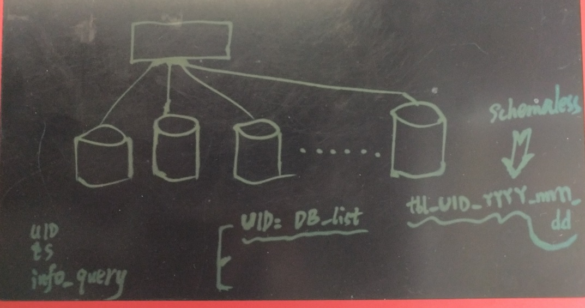
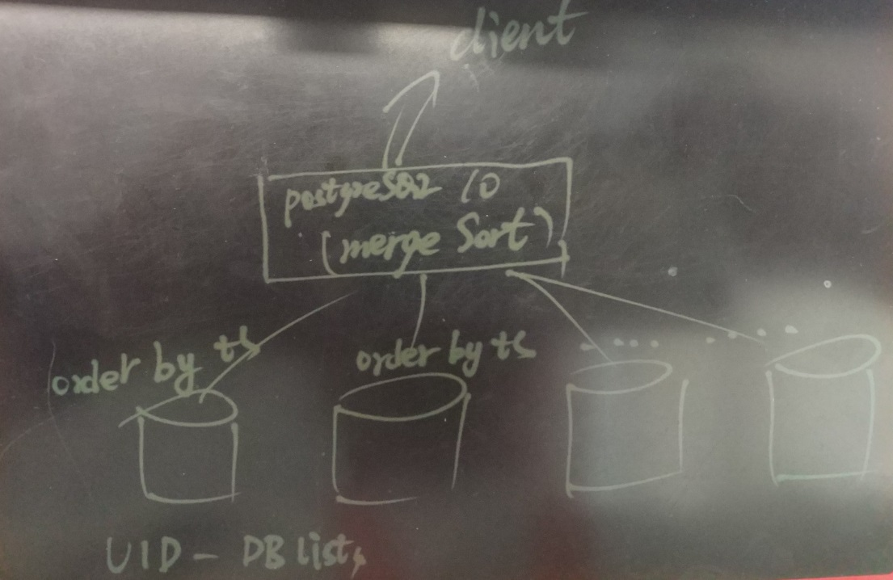

## 行为、审计日志 (实时索引/实时搜索)建模 - 最佳实践 2    
  
### 作者  
digoal  
  
### 日期  
2017-05-16  
  
### 标签  
PostgreSQL , ES , 搜索引擎 , 全文检索 , 日志分析 , 倒排索引 , 优化 , 分区 , 分片 , 审计日志 , 行为日志 , schemaless  
  
----  
  
## 背景  
在很多系统中会记录用户的行为日志，行为日志包括浏览行为、社交行为、操作行为等。            
            
典型的应用例如：数据库的SQL审计、企业内部的堡垒机（行为审计）等。        
  
前面写了一篇最佳实践，通过PostgreSQL来存储审计日志，同时对审计日志需要检索的字段建立全文索引。  
  
SSD机器可以达到7万/s的写入（换算成全文索引条目，约280万/s的条目建立速度）。达到这个性能指标时，CPU，磁盘IO全部吃满。  
  
全文如下：  
  
[《行为、审计日志 (实时索引/实时搜索)建模 - 最佳实践 1》](../201705/20170516_01.md)    
  
除了使用全文索引，还有其他方法呢？  
  
本文将采用另一个角度来解决审计日志的检索和高速写入问题。  
  
审计日志带三个维度的查询条件，一个是UID，一个是时间范围，最后是词条匹配。  
  
1\. UID表示客户ID，用来区分不同用户产生的行为数据。  
  
2\. TS字段，表示日志是什么时间点产生的。  
  
3\. 行为数据字段，表示用户的行为。  
  
优化思路：  
  
1\. 将UID作为表名的一部分，每个UID一张表。  
  
（好处：省一个字段，节约空间。同时在数据组织时不会混淆不同用户的数据，查询时消除了IO放大的问题，提升了查询效率。）  
  
（缺点：每个UID一张表，表可能很多，元数据会变大。变更结构时，可能需要涉及较多表。）  
  
2\. TS字段，采用BRIN块级索引，因为每个用户产生的行为数据，都是时间顺序的，所以堆存储与值顺序有非常强的线性相关性。  
  
3\. 将数据打散存放，使用元数据记录UID对应的DB list，随机写入对应的DBs，查询时按TS范围查询，查询所有的DBs汇聚（应用层负责merge sort）后返回（行为字段不使用索引）。  
  
  
  
PostgreSQL 10内置了merge sort的功能，所以你如果需要一个中间层来实现merge sort的话，PG也是个不错的选择。  
  
只需要将所有的数据源配置为fdw子表即可。  
  
例如  
  
```  
postgres=# explain select * from bptest where ts between now()-interval '20 min' and now()-interval '10 min' order by ts;  
                                                     QUERY PLAN                                                        
---------------------------------------------------------------------------------------------------------------------  
 Merge Append  (cost=34.00..634325.20 rows=4808182 width=524)  
   Sort Key: bptest.ts  
   ->  Index Scan using idx_bptest_ts on bptest  (cost=0.14..3.15 rows=1 width=40)  
         Index Cond: ((ts >= (now() - '00:20:00'::interval)) AND (ts <= (now() - '00:10:00'::interval)))  
   ->  Index Scan using bptest_32_20170522_ts_idx on bptest_32_20170522  (cost=0.30..4802.19 rows=49918 width=524)  
         Index Cond: ((ts >= (now() - '00:20:00'::interval)) AND (ts <= (now() - '00:10:00'::interval)))  
   ->  Index Scan using bptest_64_20170522_ts_idx on bptest_64_20170522  (cost=0.30..4114.22 rows=42820 width=524)  
         Index Cond: ((ts >= (now() - '00:20:00'::interval)) AND (ts <= (now() - '00:10:00'::interval)))  
   ->  Index Scan using bptest_34_20170522_ts_idx on bptest_34_20170522  (cost=0.30..3984.00 rows=41459 width=524)  
         Index Cond: ((ts >= (now() - '00:20:00'::interval)) AND (ts <= (now() - '00:10:00'::interval)))  
   ->  Index Scan using bptest_37_20170522_ts_idx on bptest_37_20170522  (cost=0.30..4898.77 rows=50972 width=524)  
         Index Cond: ((ts >= (now() - '00:20:00'::interval)) AND (ts <= (now() - '00:10:00'::interval)))  
   ->  Index Scan using bptest_31_20170522_ts_idx on bptest_31_20170522  (cost=0.30..4682.19 rows=48668 width=524)  
   .....................  
```  
  
## 设计  
方案1：  
  
GIN索引 BUILD全文索引的方式，6万tps时，基本榨干了CPU和IO资源。BCACHE GC或轻微的IO抖动，会导致比较严重的性能变化。  
  
方案1详见  [《行为、审计日志 (实时索引/实时搜索)建模 - 最佳实践 1》](../201705/20170516_01.md)    
    
方案2：  
  
通过uid+ts_prefix分区，确保一个用户的数据在一份堆存储中，减少检索时的IO开销。  
  
ts字段具备时序属性，通过brin块级索引降低索引大小。  
  
当数据量达到一定程度时，自动触发PG10并行查询特性，提升查询性能。  
  
由于UID数据已经分片，查询时会输入TS和文本匹配两个变量，数据分配到每个节点已经不多，使用模糊查询代替全文检索，加上PG10的多核并行，完全可以满足查询响应时延需求。  
  
### 元数据表结构  
create table db_meta   
(  
  dbid int primary key,  -- 每个数据库节点一条记录，表示一个数据库分片  
  groupid int,           -- 每个分片属于一个分组  
  conn_info text         -- 连接信息(URL)  
);  
  
create table uid_mapping  
(  
  uid int primary key,  -- 客户唯一标示  
  dbgroupid int         -- 数据库分组，表示这个用户的数据随机写入这个分组的所有分片中。  
);  
  
行为数据保留一段时间后清除。  
  
如果用户觉得这样设计比较麻烦，可以将所有的数据库作为一个大池，所有用户都随机写入这个大池。  
  
这种设计就好像greenplum和hawq的设计理念。greenplum是大池思想，hawq是分而治之思想。  
  
### 行为数据表结构  
  
主表结构：  
  
```  
create table bptest  
(  
  ts timestamptz,   -- 行为发生时间  
  content text    -- 行为内容  
);        
```  
  
每个用户的表名为```bptest_$uid_$yyyymmdd```。  
  
结构和索引与主表保持一致。  
  
### 行为数据索引  
ts字段的存储顺序与值的顺序有非常强的线性相关性，采用块级索引。  
  
BRIN索引相比btree索引节省几百倍空间，同时提升写入性能。  
  
```  
create index idx_bptest_ts on bptest using brin(ts);  -- TS字段块级索引  
```  
  
### 数据分片设计  
每个分片属于一个组，每个UID的数据随机的写入一个指定组的所有分片。  
  
如果用户觉得这样设计比较麻烦，可以将所有的数据库作为一个大池，所有用户都随机写入这个大池。  
  
就好像greenplum和hawq的设计理念。greenplum是大池思想，hawq是分而治之思想。  
  
### 数据汇聚设计  
当需要查询某个UID的行为数据时，并行查询所有分片的数据，按ts字段merge sort并返回。  
  
merge sort可以放在数据库中实现，也可以在应用层实现。  
  
### 数据merge sort设计（建议业务层实现，以提升性能）  
如果merge sort放在数据库层实现，可以使用PostgreSQL 10的postgres_fdw，每个UID的每个分片对应一张FDW TABLE，挂在UID对应的父表中。  
  
当查询父表时，按TS排序，会使用merge sort。  
  
merge sort功能详见：  
  
[《PostgreSQL 10.0 preview 性能增强 - mergesort(Gather merge)》](../201703/20170313_09.md)    
  
  
  
排序下推功能详见：  
  
[《PostgreSQL 10.0 preview sharding增强 - pushdown 增强》](../201703/20170312_20.md)    
  
  
  
如果在应用层实现，方法与之类似，并行的查询UID对应的所有分片，每个分片都是有order by返回，在应用层使用merge sort的方法返回给客户端。  
  
### 数据写入schema less设计（建议业务层实现，以提高性能）  
由于每个UID对应若干张表```bptest_$uid_$yyyymmdd```，我们可以在数据库端设计类似mongo的schemaless写入风格：  
  
有表时则插入，没有表时则创建后再插入。  
  
实现方法详见  
  
[《PostgreSQL schemaless 的实现(类mongodb collection)》](../201705/20170511_01.md)     
  
创建一个自动建表的函数，用于自动创建目标表。    
    
```    
create or replace function create_schemaless(target name) returns void as $$    
declare    
begin    
  execute format('create table if not exists %I (like bptest including all)', target);    
exception when others then    
  return;    
end;    
$$ language plpgsql strict;    
```    
    
创建一个插入数据的函数，使用动态SQL，如果遇到表不存在的错误，则调用建表函数进行建表。    
    
```    
create or replace function ins_schemaless(uid int, ts timestamptz, content text) returns void as $$    
declare   
  target name := 'bptest_'||uid||'_'||to_char(ts,'yyyymmdd');  
begin    
  execute format('insert into %I values (%L, %L)', target, ts, content);    
  exception     
    WHEN SQLSTATE '42P01' THEN     
    perform create_schemaless(target);    
    execute format('insert into %I values (%L, %L)', target, ts, content);     
end;    
$$ language plpgsql strict;    
```    
  
数据库端的schemaless会牺牲一部分性能，因为无法使用绑定变量。  
  
建议业务层实现schemaless(自动拼接表名，自动建表)，以提高性能。  
  
### 历史数据处理设计  
历史数据，可以清除，直接DROP分表即可(bptest_$uid_$yyyymmdd)。  
  
如果有保留数据的需求，可以通过阿里云RDS PostgreSQL的OSS_FDW接口将数据写入OSS对象存储永久保存，要读取时，通过FDW读取。  
  
云端存储与计算分离用法：    
    
[《RDS PostgreSQL : 使用 oss_fdw 读写OSS对象存储》](https://help.aliyun.com/document_detail/44461.html)    
    
[《HybridDB PostgreSQL : 使用 oss_fdw 读写OSS对象存储》](https://help.aliyun.com/document_detail/35457.html)    
  
### 分析需求  
如果有审计日志的分析需求，可以将RDS PostgreSQL数据写入OSS，通过HybridDB for PostgreSQL进行分析。  
  
## 性能测试  
  
### 环境准备  
与上文  [《行为、审计日志 (实时索引/实时搜索)建模 - 最佳实践》](../201705/20170516_01.md)  一样，使用同样的服务器，依旧是12个实例。  
  
1\. 环境变量配置  
  
```  
vi env_pg10.sh   
export PS1="$USER@`/bin/hostname -s`-> "  
export PGPORT=$(($1+1920))  
export PGDATA=/disk$1/digoal/pgdata/pg_root$(($1+1920))  
export LANG=en_US.utf8  
export PGHOME=/home/digoal/pgsql10_8k  
export LD_LIBRARY_PATH=$PGHOME/lib:/lib64:/usr/lib64:/usr/local/lib64:/lib:/usr/lib:/usr/local/lib:$LD_LIBRARY_PATH  
export LD_RUN_PATH=$LD_LIBRARY_PATH  
export DATE=`date +"%Y%m%d%H%M"`  
export PATH=$PGHOME/bin:$PATH:.  
export MANPATH=$PGHOME/share/man:$MANPATH  
export PGHOST=127.0.0.1  
export PGUSER=postgres  
export PGDATABASE=postgres  
alias rm='rm -i'  
alias ll='ls -lh'  
unalias vi  
```  
  
  
2\. 初始化SQL   
  
```  
vi init.sql  
  
-- 清除环境  
drop table bptest cascade;  
  
-- 初始父表  
create table bptest  
(  
  ts timestamptz,   -- 行为发生时间  
  content text    -- 行为内容  
);   
  
-- 建立索引  
-- create index idx_bptest_ts on bptest using brin(ts) with(pages_per_range=1);  -- TS字段块级索引，如果不需要按ts排序输出结果，建议使用brin索引  
create index idx_bptest_ts on bptest using btree(ts) ;  -- 如果需要按ts sort输出结果，建议使用btree  
  
-- schemaless相关，自动建表函数  
create or replace function create_schemaless(target name) returns void as $$    
declare    
begin    
  execute format('create table if not exists %I (like bptest including all) inherits(bptest)', target);    
  -- 这里可以设置列的statistic  
exception when others then    
  return;    
end;    
$$ language plpgsql strict;    
  
-- 数据写入函数  
create or replace function ins_schemaless(uid int, ts timestamptz, content text) returns void as $$    
declare   
  target name := 'bptest_'||uid||'_'||to_char(ts,'yyyymmdd');  
begin    
  execute format('insert into %I values (%L, %L)', target, ts, content);    
  exception     
    WHEN SQLSTATE '42P01' THEN     
    perform create_schemaless(target);    
    execute format('insert into %I values (%L, %L)', target, ts, content);     
end;    
$$ language plpgsql strict;    
  
-- 产生随机字符串的函数, 本例的CPU消耗大量来自这个函数  
CREATE OR REPLACE FUNCTION public.gen_rand_str(integer)  
 RETURNS text  
 LANGUAGE sql  
 STRICT  
AS $function$  
  select string_agg(a[(random()*6)::int+1],'') from generate_series(1,$1), (select array['a','b','c','d','e','f',' ']) t(a);  
$function$;  
  
-- 分页评估函数, 用于评估返回多少条记录，尽量避免使用count(*)估算精确值  
CREATE FUNCTION count_estimate(query text) RETURNS INTEGER AS    
$func$    
DECLARE    
    rec   record;    
    ROWS  INTEGER;    
BEGIN    
    FOR rec IN EXECUTE 'EXPLAIN ' || query LOOP    
        ROWS := SUBSTRING(rec."QUERY PLAN" FROM ' rows=([[:digit:]]+)');    
        EXIT WHEN ROWS IS NOT NULL;    
    END LOOP;    
    RETURN ROWS;    
END    
$func$ LANGUAGE plpgsql;    

-- 随机查询性能评估函数
CREATE or replace FUNCTION rand_query(
v_uid int, -- 客户ID
v_epoch int, -- 搜索开始时间
v_randts int,  -- 搜索interval seconds
v_randlog text,  -- 搜索query条件
v_cnt int  -- 返回若干行
) RETURNS void AS    
$func$    
DECLARE  
  tbl name := 'bptest_'||v_uid||'_'||to_char(('1970-01-01'::date+(v_epoch||' sec')::interval),'yyyymmdd');  
  sql text;
  cnt int;
BEGIN  
  -- 分页评估
  sql := format('select * from %I where ts between %L and %L and content ~ %L order by ts', tbl, '1970-01-01'::date+(v_epoch||' sec')::interval, '1970-01-01'::date+((v_epoch+v_randts)||' sec')::interval, v_randlog);

  select count_estimate(sql) into cnt;

  raise notice 'cnt: %', cnt;

  -- 如果页数较少时，使用count(*)返回精确页数

  -- 返回若干记录
  sql := format('select * from %I where ts between %L and %L and content ~ %L order by ts limit %L', tbl, '1970-01-01'::date+(v_epoch||' sec')::interval, '1970-01-01'::date+((v_epoch+v_randts)||' sec')::interval, v_randlog, v_cnt);

  execute sql;

  -- 用户可以将函数内代码转移到程序端，使用游标获取数据，确保每一页的感受一致
  
  -- 当用户需要返回最后一页时，使用逆序，重新拼接SQL (order by origin_time desc)。

  exception when others then
    return;
END    
$func$ LANGUAGE plpgsql;
```  
  
初始化每个数据库实例  
  
```  
psql -f ./init.sql -p 1921  
...  
psql -f ./init.sql -p 1932  
```  
  
### 写入压测 1 
12个库，100个UID。  
  
每个UID每个库写入1000万记录，每个UID总共写入1.2亿，所有UID总共写入120亿记录。  
  
使用gen_rand_str生成指定长度的随机字符串（gen_rand_str存在大量的CPU开销，压测2使用其他随机值产生的方法）。  
  
```  
vi test.sql  
  
  
\set uid random(1,100)  
select ins_schemaless(:uid, now(), gen_rand_str(512));  
```  
  
测试脚本  
  
```  
vi test.sh  
  
  
for ((i=1;i<13;i++))  
do  
  . /home/digoal/env_pg10.sh ${i}  
  nohup pgbench -M prepared -n -r -P 3 -f ./test.sql -c 3 -j 3 -t 100000000 >/tmp/bptest_${i}.log 2>&1 &  
done  
```  
  
#### 测试结果  
写入性能:   
  
1\. 使用brin索引时 9.47万/s  
  
2\. 使用btree索引时 7.9万/s  
  
3\. 服务器资源开销：  
  
```  
CPU：  
  
Cpu(s): 90.7%us,  7.1%sy,  0.1%ni,  0.4%id,  0.1%wa,  0.0%hi,  1.6%si,  0.0%st  
  
IOUITL：  
  
SSD: 50 %    
```  
  
#### 瓶颈分析  
1\. 大部分CPU开销在产生随机串的函数中，所以实际场景，CPU的消耗会小很多。  
  
如下  
  
```  
perf top -ag  
  
            60953.00  6.0% ExecInterpExpr                          /home/digoal/pgsql10_8k/bin/postgres  
            33647.00  3.3% AllocSetAlloc                           /home/digoal/pgsql10_8k/bin/postgres  
            27560.00  2.7% advance_aggregates                      /home/digoal/pgsql10_8k/bin/postgres  
            22894.00  2.3% base_yyparse                            /home/digoal/pgsql10_8k/bin/postgres  
            21976.00  2.2% SearchCatCache                          /home/digoal/pgsql10_8k/bin/postgres  
            21768.00  2.2% array_seek                              /home/digoal/pgsql10_8k/bin/postgres  
            20957.00  2.1% appendBinaryStringInfo                  /home/digoal/pgsql10_8k/bin/postgres  
            19912.00  2.0% memcpy                                  /lib64/libc-2.12.so                     
            17058.00  1.7% array_get_element                       /home/digoal/pgsql10_8k/bin/postgres  
            14916.00  1.5% heap_form_minimal_tuple                 /home/digoal/pgsql10_8k/bin/postgres  
            13617.00  1.3% heap_fill_tuple                         /home/digoal/pgsql10_8k/bin/postgres  
            12201.00  1.2% __rint                                  /lib64/libm-2.12.so                     
            10938.00  1.1% palloc0                                 /home/digoal/pgsql10_8k/bin/postgres  
            10683.00  1.1% MemoryContextAllocZeroAligned           /home/digoal/pgsql10_8k/bin/postgres  
            10591.00  1.0% ExecStoreMinimalTuple                   /home/digoal/pgsql10_8k/bin/postgres  
            10292.00  1.0% string_agg_transfn                      /home/digoal/pgsql10_8k/bin/postgres  
            10202.00  1.0% advance_transition_function             /home/digoal/pgsql10_8k/bin/postgres  
             9973.00  1.0% core_yylex                              /home/digoal/pgsql10_8k/bin/postgres  
```  
  
2\. bcache问题  
  
bcache垃圾回收时，对IO的影响非常严重。  
  
```  
  PID USER      PR  NI  VIRT  RES  SHR S %CPU %MEM    TIME+  COMMAND    
40207 root      20   0     0    0    0 R 100.0  0.0  34:47.86 [bch_gc-0b34a79a]  
```  
  
await已经到秒级  
  
```  
Device:         rrqm/s   wrqm/s     r/s     w/s   rsec/s   wsec/s avgrq-sz avgqu-sz   await  svctm  %util  
bcache11          0.00     0.00    0.00    0.00     0.00     0.00     0.00     0.00    0.00   0.00   0.00  
bcache10          0.00  6054.00    1.00  105.00     8.00 48640.00   458.94    17.19  157.73   9.43 100.00  
bcache9           0.00  2431.00    0.00  100.00     0.00 29408.00   294.08     4.22  102.87   9.86  98.60  
bcache8           0.00  4013.00    0.00   85.00     0.00 37352.00   439.44    10.04  174.19  11.76 100.00  
bcache7           0.00  1661.00    0.00   58.00     0.00 12952.00   223.31     2.34   53.47  17.02  98.70  
bcache6           0.00     0.00    0.00    0.00     0.00     0.00     0.00     0.00    0.00   0.00   0.00  
bcache5           0.00    48.00    0.00   71.00     0.00 44896.00   632.34   183.24 2124.06  14.08 100.00  
bcache4           0.00  6506.00    0.00  211.00     0.00 56312.00   266.88    74.89  488.20   4.74 100.00  
bcache3           0.00     0.00    0.00    0.00     0.00     0.00     0.00     0.00    0.00   0.00   0.00  
bcache2           0.00  5502.00    0.00  103.00     0.00 44168.00   428.82   144.85  709.10   9.71 100.00  
bcache1           0.00 12302.00    0.00   34.00     0.00 13464.00   396.00    84.11  877.03  29.41 100.00  
bcache0           0.00 15148.00    0.00  260.00     0.00 42504.00   163.48    47.39  155.56   3.85 100.00  
```  
  
3\. 配置了smooth checkpoint后，checkpoint已经没有问题, sync时间非常短暂。  
  
```  
2017-05-23 10:49:55.749 CST,,,25095,,59239d76.6207,9,,2017-05-23 10:24:54 CST,,0,LOG,00000,"checkpoint starting: time",,,,,,,,"LogCheckpointStart, xlog.c:8369",""  
2017-05-23 10:50:25.434 CST,,,25095,,59239d76.6207,10,,2017-05-23 10:24:54 CST,,0,LOG,00000,"checkpoint complete: wrote 233036 buffers (5.6%); 0 WAL file(s) added, 0 removed, 131 recycled; write=29.250 s, sync=0.018 s, total=29.685 s; sync files=300, longest=0.004 s, average=0.000 s; distance=2145650 kB, estimate=2145650 kB",,,,,,,,"LogCheckpointEnd, xlog.c:8451",""  
2017-05-23 10:54:55.529 CST,,,25095,,59239d76.6207,11,,2017-05-23 10:24:54 CST,,0,LOG,00000,"checkpoint starting: time",,,,,,,,"LogCheckpointStart, xlog.c:8369",""  
2017-05-23 10:57:59.222 CST,,,25095,,59239d76.6207,12,,2017-05-23 10:24:54 CST,,0,LOG,00000,"checkpoint complete: wrote 191434 buffers (4.6%); 0 WAL file(s) added, 0 removed, 131 recycled; write=118.012 s, sync=59.816 s, total=183.693 s; sync files=300, longest=16.126 s, average=0.199 s; distance=1752021 kB, estimate=2106288 kB",,,,,,,,"LogCheckpointEnd, xlog.c:8451",""  
2017-05-23 10:59:55.328 CST,,,25095,,59239d76.6207,13,,2017-05-23 10:24:54 CST,,0,LOG,00000,"checkpoint starting: time",,,,,,,,"LogCheckpointStart, xlog.c:8369",""  
2017-05-23 11:00:25.350 CST,,,25095,,59239d76.6207,14,,2017-05-23 10:24:54 CST,,0,LOG,00000,"checkpoint complete: wrote 176278 buffers (4.2%); 0 WAL file(s) added, 0 removed, 107 recycled; write=29.688 s, sync=0.009 s, total=30.021 s; sync files=300, longest=0.003 s, average=0.000 s; distance=1630757 kB, estimate=2058734 kB",,,,,,,,"LogCheckpointEnd, xlog.c:8451",""  
2017-05-23 11:04:55.467 CST,,,25095,,59239d76.6207,15,,2017-05-23 10:24:54 CST,,0,LOG,00000,"checkpoint starting: time",,,,,,,,"LogCheckpointStart, xlog.c:8369",""  
2017-05-23 11:05:25.381 CST,,,25095,,59239d76.6207,16,,2017-05-23 10:24:54 CST,,0,LOG,00000,"checkpoint complete: wrote 232981 buffers (5.6%); 0 WAL file(s) added, 0 removed, 99 recycled; write=29.555 s, sync=0.013 s, total=29.914 s; sync files=300, longest=0.006 s, average=0.000 s; distance=2142180 kB, estimate=2142180 kB",,,,,,,,"LogCheckpointEnd, xlog.c:8451",""  
2017-05-23 11:06:44.503 CST,,,36368,"127.0.0.1:44645",5923a744.8e10,1,"",2017-05-23 11:06:44 CST,,0,LOG,00000,"connection received: host=127.0.0.1 port=44645",,,,,,,,"BackendInitialize, postmaster.c:4178",""  
2017-05-23 11:06:44.504 CST,"postgres","postgres",36368,"127.0.0.1:44645",5923a744.8e10,2,"authentication",2017-05-23 11:06:44 CST,13/223,0,LOG,00000,"connection authorized: user=postgres database=postgres",,,,,,,,"PerformAuthentication, postinit.c:272",""  
2017-05-23 11:09:55.512 CST,,,25095,,59239d76.6207,17,,2017-05-23 10:24:54 CST,,0,LOG,00000,"checkpoint starting: time",,,,,,,,"LogCheckpointStart, xlog.c:8369",""  
2017-05-23 11:09:56.221 CST,"postgres","postgres",36368,"127.0.0.1:44645",5923a744.8e10,3,"idle",2017-05-23 11:06:44 CST,,0,LOG,00000,"disconnection: session time: 0:03:11.717 user=postgres database=postgres host=127.0.0.1 port=44645",,,,,,,,"log_disconnections, postgres.c:4500","psql"  
2017-05-23 11:10:25.512 CST,,,25095,,59239d76.6207,18,,2017-05-23 10:24:54 CST,,0,LOG,00000,"checkpoint complete: wrote 232090 buffers (5.5%); 0 WAL file(s) added, 0 removed, 131 recycled; write=29.489 s, sync=0.141 s, total=29.999 s; sync files=300, longest=0.033 s, average=0.000 s; distance=2136269 kB, estimate=2141589 kB",,,,,,,,"LogCheckpointEnd, xlog.c:8451",""  
```  
  
### 写入压测 2
使用另一种方法生成随机字符串  

```
postgres=# select length(concat_ws('',random(),random(),random(),random(),random(),random(),random(),random(),random(),random(),random(),random(),random(),random(),random(),random(),random(),random(),random(),random(),random(),random(),random(),random(),random(),random(),random(),random(),random(),random()));
 length 
--------
    512
(1 row)
```

```  
vi test.sql  
  
  
\set uid random(1,100)  
select ins_schemaless(:uid, now(), concat_ws('',random(),random(),random(),random(),random(),random(),random(),random(),random(),random(),random(),random(),random(),random(),random(),random(),random(),random(),random(),random(),random(),random(),random(),random(),random(),random(),random(),random(),random(),random()));  
```  
  
测试脚本  
  
```  
vi test.sh  
  
  
for ((i=1;i<13;i++))  
do  
  . /home/digoal/env_pg10.sh ${i}  
  nohup pgbench -M prepared -n -r -P 3 -f ./test.sql -c 10 -j 10 -t 100000000 >/tmp/bptest_${i}.log 2>&1 &  
done  
```  
  
#### 测试结果  
写入性能:    
  
1\. 使用btree索引时 24万/s  
  
2\. 服务器资源开销：  
  
```  
CPU：  
  
Cpu(s): 76.7%us, 14.6%sy,  0.1%ni,  2.3%id,  2.1%wa,  0.0%hi,  4.1%si,  0.0%st
  
IOUITL：  
  
SSD: 67 %    
```  
  
### 查询压测  
单节点2100万记录。  
  
```  
postgres=# select count(*) from bptest_1_20170522;  
  count     
----------  
 21106948  
(1 row)  
Time: 1776.889 ms (00:01.777)  
```  
  
查询需求：  
  
1\. 范围查询，排序输出  
  
返回462万记录，2.5秒。  
  
```  
postgres=# explain (analyze,verbose,timing,costs,buffers) select * from bptest_1_20170522 where ts between '2017-05-22 19:04:19.05347+08' and '2017-05-22 20:04:19.05347+08' order by ts;  
                                                                                        QUERY PLAN                                                                                           
-------------------------------------------------------------------------------------------------------------------------------------------------------------------------------------------  
 Index Scan using bptest_1_20170522_ts_idx on public.bptest_1_20170522  (cost=0.44..2373942.95 rows=4631011 width=524) (actual time=0.015..2326.653 rows=4622534 loops=1)  
   Output: ts, content  
   Index Cond: ((bptest_1_20170522.ts >= '2017-05-22 19:04:19.05347+08'::timestamp with time zone) AND (bptest_1_20170522.ts <= '2017-05-22 20:04:19.05347+08'::timestamp with time zone))  
   Buffers: shared hit=4639344  
 Planning time: 0.207 ms  
 Execution time: 2578.147 ms  
(6 rows)  
Time: 2578.789 ms (00:02.579)  
```  
  
2\. 范围+全文检索查询，排序输出  
  
一次性返回2941196万记录，8.5秒。  
  
```  
postgres=# explain (analyze,verbose,timing,costs,buffers) select * from bptest_1_20170522    
where ts between '2017-05-22 19:04:19.05347+08' and '2017-05-22 20:04:19.05347+08'   
and content ~ 'abc' and content ~ 'bcd'   
order by ts;  
                                                     QUERY PLAN                                                                                                    
--------------------------------------------------------------------------------------------------------------------------  
 Gather Merge  (cost=1890834.11..1933136.32 rows=2870936 width=524) (actual time=6601.842..8136.187 rows=2941196 loops=1)  
   Output: ts, content  
   Workers Planned: 4  
   Workers Launched: 4  
   Buffers: shared hit=84046, temp read=102440 written=102588  
   ->  Sort  (cost=1890834.06..1892628.39 rows=717734 width=524) (actual time=6584.684..6804.063 rows=588239 loops=5)  
         Output: ts, content  
         Sort Key: bptest_1_20170522.ts  
         Sort Method: external merge  Disk: 313080kB  
         Buffers: shared hit=347169, temp read=501609 written=502338  
         Worker 0: actual time=6582.649..6803.139 rows=588224 loops=1  
           Buffers: shared hit=66037, temp read=100242 written=100388  
         Worker 1: actual time=6590.768..6813.019 rows=587934 loops=1  
           Buffers: shared hit=66168, temp read=100191 written=100337  
         Worker 2: actual time=6579.297..6799.509 rows=587915 loops=1  
           Buffers: shared hit=66014, temp read=100172 written=100318  
         Worker 3: actual time=6569.191..6785.155 rows=578030 loops=1  
           Buffers: shared hit=64904, temp read=98564 written=98707  
         ->  Parallel Bitmap Heap Scan on public.bptest_1_20170522  (cost=72481.78..1603389.84 rows=717734 width=524) (actual time=338.604..5182.340 rows=588239 loops=5)  
               Output: ts, content  
               Recheck Cond: ((bptest_1_20170522.ts >= '2017-05-22 19:04:19.05347+08'::timestamp with time zone) AND (bptest_1_20170522.ts <= '2017-05-22 20:04:19.05347+08'::timestamp with time zone))  
               Rows Removed by Index Recheck: 19  
               Filter: ((bptest_1_20170522.content ~ 'abc'::text) AND (bptest_1_20170522.content ~ 'bcd'::text))  
               Rows Removed by Filter: 336268  
               Heap Blocks: exact=7063 lossy=60173  
               Buffers: shared hit=347141  
               Worker 0: actual time=336.885..5215.415 rows=588224 loops=1  
                 Buffers: shared hit=66030  
               Worker 1: actual time=337.105..5239.414 rows=587934 loops=1  
                 Buffers: shared hit=66161  
               Worker 2: actual time=337.128..5213.433 rows=587915 loops=1  
                 Buffers: shared hit=66007  
               Worker 3: actual time=337.078..5129.862 rows=578030 loops=1  
                 Buffers: shared hit=64897  
               ->  Bitmap Index Scan on bptest_1_20170522_ts_idx  (cost=0.00..71764.05 rows=4631011 width=0) (actual time=336.215..336.215 rows=4622534 loops=1)  
                     Index Cond: ((bptest_1_20170522.ts >= '2017-05-22 19:04:19.05347+08'::timestamp with time zone) AND (bptest_1_20170522.ts <= '2017-05-22 20:04:19.05347+08'::timestamp with time zone))  
                     Buffers: shared hit=16810  
 Planning time: 1.996 ms  
 Execution time: 8560.577 ms  
(39 rows)  
Time: 8563.154 ms (00:08.563)  
```  
  
3\. 分页数评估  
  
如果业务允许，建议使用评估值，评估值的准确性取决于统计信息的准确性，使用```alter table 表名 alter column 列名 SET STATISTICS 1000```可以调整列的统计精准度，默认为100。  
  
[《论count与offset使用不当的罪名 和 分页的优化》](../201605/20160506_01.md)    
  
评估记录数与实际记录数对比如下，足够精确：  
  
```  
postgres=# \timing  
Timing is on.  
  
-- 评估记录数  
postgres=# select count_estimate($$select * from bptest_1_20170522 where ts between '2017-05-22 19:04:19.05347+08' and '2017-05-22 20:04:19.05347+08'$$);  
 count_estimate   
----------------  
        4631011  
(1 row)  
Time: 0.733 ms  
  
-- 实际记录数  
postgres=# select count(*) from bptest_1_20170522 where ts between '2017-05-22 19:04:19.05347+08' and '2017-05-22 20:04:19.05347+08';  
  count    
---------  
 4622534  
(1 row)  
Time: 1389.424 ms (00:01.389)  
  
-- 评估记录数  
postgres=# select count_estimate($$select * from bptest_1_20170522    
where ts between '2017-05-22 19:04:19.05347+08' and '2017-05-22 20:04:19.05347+08'   
and content ~ 'abc' and content ~ 'bcd' and content ~ 'cdef'$$);  
 count_estimate   
----------------  
         914755  
(1 row)  
Time: 3.713 ms  
  
-- 实际记录数  
postgres=# select count(*) from bptest_1_20170522    
where ts between '2017-05-22 19:04:19.05347+08' and '2017-05-22 20:04:19.05347+08'   
and content ~ 'abc' and content ~ 'bcd' and content ~ 'cdef';  
 count    
--------  
 962780  
(1 row)  
Time: 7756.863 ms (00:07.757)  
```  
  
4\. 分页查询返回  
  
流式返回，返回10行仅需0.562毫秒。  
  
```  
postgres=# begin;  
BEGIN  
Time: 0.170 ms  
postgres=# declare cur cursor for select * from bptest_1_20170522    
postgres-# where ts between '2017-05-22 19:04:19.05347+08' and '2017-05-22 20:04:19.05347+08'   
postgres-# and content ~ 'abc' and content ~ 'bcd'   
postgres-# order by ts;  
DECLARE CURSOR  
  
postgres=# fetch 10 from cur;  
 .........................  
(10 rows)  
Time: 0.562 ms  
  
下一页，fetch继续获取  
```  
  
如果要回翻，使用SCROLL游标  
  
```  
postgres=# begin;  
BEGIN  
Time: 0.114 ms  
postgres=# declare cur SCROLL cursor for select * from bptest_1_20170522    
where ts between '2017-05-22 19:04:19.05347+08' and '2017-05-22 20:04:19.05347+08'   
and content ~ 'abc' and content ~ 'bcd'   
order by ts;  
DECLARE CURSOR  
Time: 2.362 ms  
  
回翻  
postgres=# fetch BACKWARD 10 from cur;  
前翻  
postgres=# fetch FORWARD 10 from cur;  
```  
    
#### 查询压测
```
vi sel.sql

\set uid random(1,100)  
\set epoch 使用extract(epoch from min(实际数据时间))
\set tsinterval random(1800,86400)
\set cnt random(1000,10000)
select rand_query(:uid, :epoch, :tsinterval, substring(text(random()),3,6), :cnt);
```
  
```
vi sel.sh  

for ((i=1;i<13;i++))  
do  
  . /home/digoal/env_pg10.sh ${i}  
  nohup pgbench -M prepared -n -r -P 3 -f ./sel.sql -c 2 -j 2 -t 1000 >/tmp/bptest_sel_${i}.log 2>&1 &  
done
```
  
查询与插入同时压测时的资源使用    
  
```
Cpu(s): 84.3%us,  7.8%sy,  0.2%ni,  5.5%id,  0.7%wa,  0.0%hi,  1.4%si,  0.0%st

SSD UTIL: 67%

机械盘 UTIL: 8%
```
  
性能指标  
  
```
写入qps：10万/s

查询qps：1.5/s
```
  
## 扩展方案 - PG + ES
ES对审计日志的字段进行全文检索，由于数据是追加写入（没有更新），可以使用行号和审计日志进行关联。在ES中建立 审计日志+行号（全文索引）。   
  
注意，ES建的索引必须能区分出PG中对应的表名，否则不同的表，行号是会重复的。  
  
如果ES中不能区分表名，那么建议使用 审计日志+全局唯一ID的全文索引，这样才能和数据关联起来。   
    
### 按行号拖数据，BUILD ES全文索引
从PG将数据拖到ES，使用行号拖，可以省掉一个PK字段以及索引，极大的提升PG的数据写入性能。   
  
使用行号拖数据，需要支持按数据块查询。  
  
```  
-- 一次拖一万条

create or replace function gen_tids(blkid int) returns tid[] as $$  
declare
  res tid[] := '{}'::tid[];  
begin
  for x in blkid..(blkid+199) loop  
    select array_cat(res, array(  
      SELECT ('('||x||',' || s.i || ')')::tid  
      FROM generate_series(0, 50) AS s(i)  
    )
    ) into res;  
  end loop;  
return res;  
end;
$$ language plpgsql strict immutable;  
```
    
同时需要注意空洞（漏建索引）的问题，比如   
  
不要查最后一个数据块，除非这个表不再写入，否则可能导致查询空洞。  
  
并行写入PG时，可能导致某个数据块的部分数据还没有提交，而拖数据的程序如果读到这个数据块的时候，下一次跳过这个数据块，会导致空洞。            
      
拖数据测试脚本  
  
```
一次请求拖1万条

#!/bin/bash

for ((i=1;i<13;i++))  
do  
  . /home/dege.zzz/env_pg10.sh ${i}  
  for ((i=1;i<=1000000;i=i+200))
  do
  echo "start: `date` $((50*$i-50))"
  psql -c "explain (analyze,verbose,timing,costs,buffers) select * from rds_logs_1_20170607 where ctid = any (gen_tids($i));" >/dev/null
  echo "end:   `date` "
  done
done
```
  
为了提高拖数据的性能，拖数据和写数据尽量保持一个速度水平，这样写入的数据还没有被刷到磁盘，可以在缓存中命中，拖数据的效率更高。  
  
原理详见  
  
[《块级扫描在IoT(物联网)极限写和消费读并存场景的应用》](../201706/20170607_01.md)  
    
## 小结   
### 性能指标  
1\. 数据量：  
  
单个UID，单节点，一天2100万记录(12GB, 索引600MB)。（100个节点/分片，单个用户一天约21亿数据量）  
  
2\.1 写入性能（gen_rand_str）  
  
使用brin索引时 9.47万/s  
  
使用btree索引时 7.9万/s  
  
2\.2 写入性能（random()）  
  
使用btree索引时 24万/s  
  
3\. 范围查询，排序输出  
  
返回462万记录，2.5秒。  
  
4\. 范围+全文检索查询，排序输出  
  
返回294万记录，8.5秒。  
  
5\. 分页数评估  
  
精确度：+- 5% 左右  
  
响应速度：1毫秒左右。  
  
6\. 精确分页数  
  
与实际数据量、条件有关。1秒以上  
  
7\. 分页查询  
  
范围+全文检索查询，排序输出： 每获取1000条记录约11毫秒。  
  
（与命中率有关），极端情况为处理所有记录，只有最后一条记录满足条件。  
  
### 随机分布与可用性、数据倾斜问题  
使用jdbc或libpq时，一个连接可以设置多个实例，将从先到后，自动选择一个可读写的实例。（相当于客户端自动failover）。  
  
配置示例，假设有4个数据库实例，可以配置4个数据源如下：  
  
```  
db1: host1:port1,host2:port2,host3:port3,host4:port4  
  
db2: host2,port2,host3:port3,host4:port4,host1:port1  
  
db3: host3:port3,host4:port4,host1:port1,host2,port2  
  
db4: host4:port4,host1:port1,host2:port2,host3:port3  
```  
  
当任意一个实例出现问题时，每个数据源还是能获取到下一个可用的连接，不会堵塞写入。  
  
当实例修复后，依旧使用首选实例。  
  
使用这种方法，可以最大化的提高可用性，无需备库。  
  
另外异常的实例活了之后，就会继续被首选，无需担心倾斜问题，因为不保留历史。时间会抹平倾斜问题。  
  
## 参考    
[《行为、审计日志 (实时索引/实时搜索)建模 - 最佳实践》](../201705/20170516_01.md)    
  
[《PostgreSQL schemaless 的实现(类mongodb collection)》](../201705/20170511_01.md)     
  
[《PostgreSQL 最佳实践 - 水平分库(基于plproxy)》](../201608/20160824_02.md)    
  
[《阿里云ApsaraDB RDS for PostgreSQL 最佳实践 - 2 教你RDS PG的水平分库》](../201512/20151220_02.md)    
  
[《PostgreSQL 10.0 preview 性能增强 - mergesort(Gather merge)》](../201703/20170313_09.md)    
  
[《PostgreSQL 10.0 preview sharding增强 - 支持Append节点并行》](../201703/20170312_11.md)    
  
[《PostgreSQL 10.0 preview sharding增强 - pushdown 增强》](../201703/20170312_20.md)    
  
[《PostgreSQL 10.0 preview sharding增强 - postgres_fdw 多节点异步并行执行》](../201703/20170312_07.md)    
  
[《PostgreSQL 9.6 sharding based on FDW & pg_pathman》](../201610/20161027_01.md)    
  
[《PostgreSQL 9.6 单元化,sharding (based on postgres_fdw) - 内核层支持前传》](../201610/20161004_01.md)    
  
[《PostgreSQL 9.6 sharding + 单元化 (based on postgres_fdw) 最佳实践 - 通用水平分库场景设计与实践》](../201610/20161005_01.md)    
  
[《PostgreSQL 物联网黑科技 - 瘦身几百倍的索引(BRIN index)》](../201604/20160414_01.md)    
  
[《论count与offset使用不当的罪名 和 分页的优化》](../201605/20160506_01.md)    
  
[《RDS PostgreSQL : 使用 oss_fdw 读写OSS对象存储》](https://help.aliyun.com/document_detail/44461.html)    
    
[《HybridDB PostgreSQL : 使用 oss_fdw 读写OSS对象存储》](https://help.aliyun.com/document_detail/35457.html)    
  
[《PostgreSQL 10.0 preview 功能增强 - libpq支持多主机连接(failover,LB)让数据库HA和应用配合更紧密》](../201704/20170420_01.md)   
  
<a rel="nofollow" href="http://info.flagcounter.com/h9V1"  ></a>  
  
  
  
  
  
  
## [digoal's 大量PostgreSQL文章入口](https://github.com/digoal/blog/blob/master/README.md "22709685feb7cab07d30f30387f0a9ae")
  
