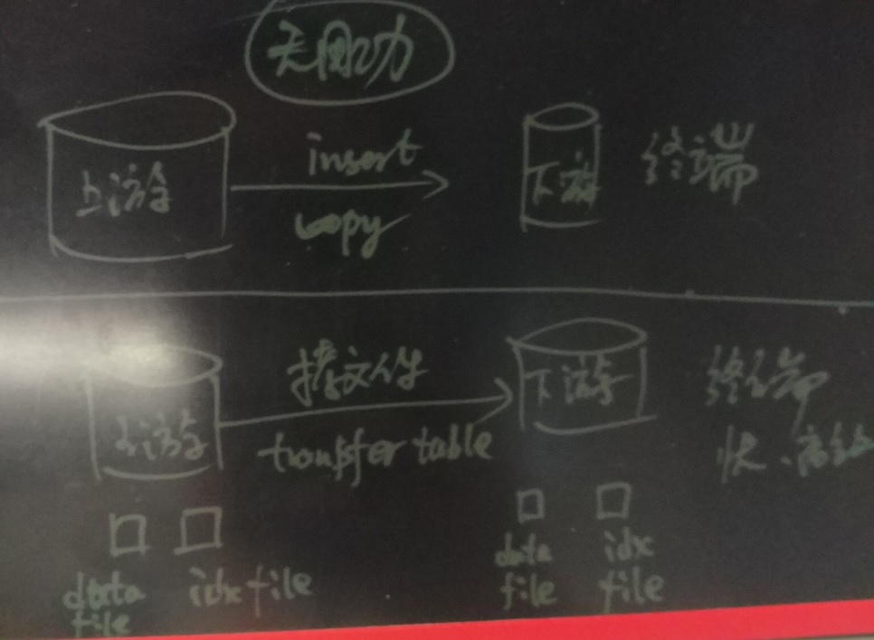
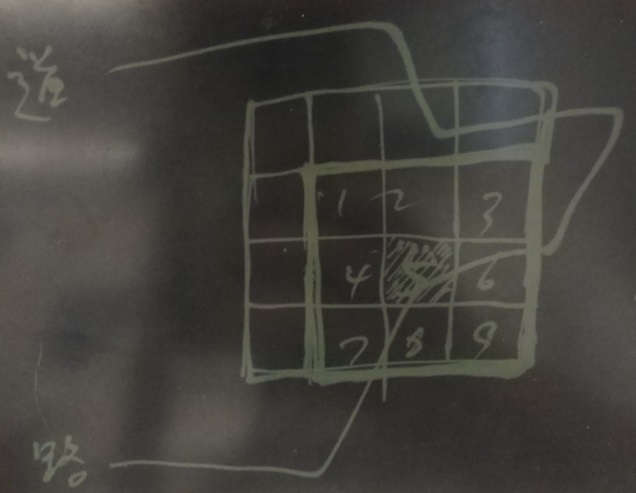
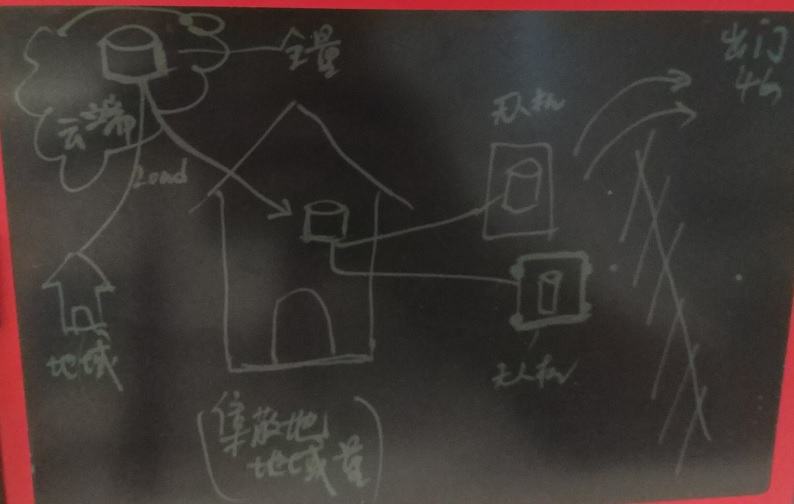

## 无人驾驶背后的技术 - PostGIS点云(pointcloud)应用 - 2 
                                    
### 作者                                                                                 
digoal                               
                                      
### 日期                                 
2017-05-23                             
                                  
### 标签                               
PostgreSQL , PostGIS , box , grid , pointcloud , pgpointcloud , point聚合 , KNN , 自动驾驶 , 自动配送 , 无人驾驶 , 机器人配送 , 物流 , 无用功         
                                    
----                              
                                       
## 背景         
无人驾驶、配送机器人的业务背景，方案设计请参考：  
  
[《无人驾驶背后的技术 - PostGIS点云(pointcloud)应用》](../201705/20170519_02.md)    
  
本文针对以上文章，补充一些新鲜内容。  
  
## 一、transfer table消除索引build、格式检查等无用功  
在服务端存储了所有的pointcloud数据，而终端（如无人车）仅仅需要车辆需要行经的位置（既定线路、活动范围、行政区）的points数据。  
  
终端的数据是从服务端下发而来。  
  
假设服务端的数据已经按行政区或GEOHASH CODE range划分，建立了对应的分区表，并且已经构建了GiST索引。  
  
这些表的数据从服务端LOAD（通过insert\copy的方式）到终端（无人车）时，正常情况下无人车还需要再构建一次GiST索引。重复构建索引属于无用功，是浪费资源的做法。  
  
而如果使用transfer table的方法，直接LOAD贝数据文件，索引文件，构建数据库catalog元数据，可消除终端数据insert、COPY方式引入的重复劳动（BUILD索引、检查数据格式等）。实现快速导入，还能节能减排。  
  
  
  
使用table transfer节能减排。关键的因素，数据的分区需要足够细致，这样的话导出到终端不会造成数据冗余。（例如终端要的是杭州市西湖区的点云数据，而服务端是按市级行政区分区的，那么使用table transfer需要拷贝整个杭州市的数据文件到终端（无人车），那就很不好。）  
  
pgtransfer是一个插件，用法如下  
  
https://postgrespro.com/docs/postgresproee/9.6/pgtransfer.html  
  
## 二、大量数据优化之 - 线性存储与BRIN索引  
GiST是空间聚集索引，支持的数据类型包括地理位置类型等。支持按距离排序，按距离搜索数据等，GiST精确度非常高。  
  
geohash是一种编码，将地球上的经纬度从坐标转换为一串字符串， 对于相邻的位置，geohash的字符串也是相似的，相邻的位置geohash值拥有相同的prefix。  
  
详见：  
  
[《geohash vs PostGIS》](../201704/20170422_01.md)    
  
PostGIS提供的st_geohash函数可以将geometry类型转换为一串geohash字符串。  
  
https://postgis.net/docs/ST_GeoHash.html  
  
### GiST索引的优劣  
1\. 当需要按某个点，搜索附近的点，并按顺序输出记录时，GiST索引的效率非常的高。（当需要按空间顺序返回大量记录时，GiST索引不占优势。）  
  
2\. 当位置数据量非常大时，由于GiST索引需要计算空间聚集，建立索引的速度会比较慢。（如果数据是并发插入的，可以调动所有的CPU资源构建索引，性能不错，例如32核可以达到17万/s的写入速度(含GiST索引)。）  
  
3\. GiST索引包含了空间数据的VALUE，占用的空间比较大（相比接下来的BRIN索引）。  
  
4\. 如果数据在空间维度上乱序存储，使用GiST索引返回大量相邻数据时，会导致heap IO放大。原理如下  
  
[《索引顺序扫描引发的堆扫描IO放大背后的统计学原理与解决办法 - PostgreSQL index scan enlarge heap page scans when index and column correlation small.》](../201404/20140426_01.md)  
  
5\. 使用geohash btree索引对HEAP表进行cluster，可以降低gist索引按距离搜索大量数据的HEAP离散IO。   
  
### geohash的优劣  
geohash是一串字符串，相邻的位置，字符串也有顺序相似性。  
  
geohash类型的精度和编码长度息息相关，不像geometry类型是绝对精准的值。所以如果用户需要完全精准的POINT，建议使用geometry。    
  
使用geohash按距离搜索数据时，可能得到不准确的数据(通常会多一些数据)，需要进行二次计算，才能得到严格的准确数据。   
    
如果将数据按geohash排序存储（堆存储本身是无序的，但是可以使用cluster语法，按某个索引排序存储），那么数据将变成空间有序存储的模式，有序存储有一个好处，不同的数据块存储的数据的BOUND非常清晰。  
  
当数据有序存储时，可以使用块级索引(BRIN)，按geohash搜索一个范围的数据时，从brin返回包含这个范围的数据块，然后从这些数据块中获取数据，效率非常高。（获取少量数据的效率不如GiST，但是获取大量数据的效率与GiST相当）  
  
[《PostgreSQL 物联网黑科技 - 瘦身几百倍的索引(BRIN index)》](../201604/20160414_01.md)    
  
BRIN索引存储的是每个数据块（或者连续的数据块）的元信息（min,max,avg,count,nulls count等)。适合有序存储（VALUE与行号线性相关性好）的数据。  
  
作为点云数据索引的案例如下：  
  
https://2016.foss4g-na.org/sites/default/files/slides/gbroccolo_FOSS4GNA2016_pointcloud_0.pdf  
  
[《Manage LiDAR data with PostgreSQL》](20170523_01_pdf_001.pdf)    
  
### GiST和BRIN选哪个？  
1\. 如果大量的需求是返回少量数据，并且有KNN搜索，距离排序输出的需求。建议使用GiST，效率极其高。比如轨迹系统，比拼REDIS性能还要高400%：    
  
[《PostgreSQL 物流轨迹系统数据库需求分析与设计 - 包裹侠实时跟踪与召回》](../201704/20170418_01.md)  
  
2\. 如果大量的需求是返回大量点数据（例如100万以上），那么建议将数据按geohash堆顺序存储，减少IO放大，并使用BRIN索引减少索引的BUILD时间和索引的空间占用。  
  
https://postgis.net/docs/using_postgis_dbmanagement.html#brin_indexes  
  
### geohash的分区作用  
通常用户存储地理信息，会使用geometry字段，然而geometry类型分区表不好实现。  
  
一个比较理想的方法是使用geohash来进行范围分区(因为相邻位置的geohash也相似)。  
  
在PostgreSQL中，有两种方法实现分区：一种是实体字段，一种是表达式分区。如果你使用的是Greenplum，只支持实体字段分区。  
  
```  
create table test(id int, loc geometry, loc_geohash text);  -- loc_geohash=st_geohash(loc)，按loc_geohash进行范围分区  
  
或  
  
create table test(id int, loc geometry);  -- 按表达式st_geohash(loc)进行范围分区。  
```  
  
## 三、大量数据优化之 - 聚合与prefix搜索  
数据聚合对大批量数据的查询有非常好的性能提升效果。  
  
在第一篇文章中已经介绍了，数据聚合后，查询500万个点，响应时间从43秒降到了312毫秒。  
  
[《无人驾驶背后的技术 - PostGIS点云(pointcloud)应用》](../201705/20170519_02.md)    
  
聚合的方法也很多：  
  
1\. 使用网格聚合，前一篇文章已有介绍。  
  
2\. 另一种方法是使用geohash prefix聚合，也较为通用。  
  
https://postgis.net/docs/ST_GeoHash.html  
  
## 四、获取道路覆盖点云 - 道路与格子  
终端（无人车）在规划好路线后，需要下载道路覆盖到的点云数据，在PostGIS中属于两个集合类型，求overlap。  
  
  
  
比如  
  
1\. 点云表：点云的数据是按geohash或网格聚合的数据，比如每个格子代表一平米的区域。  
  
2\. 道路：道路覆盖的区域，是一个多边形。  
  
在点云表中取出与多边形overlap的数据即可，这个操作可以使用GiST索引，效率非常高。  
  
https://postgis.net/docs/ST_Geometry_Overabove.html  
  
https://postgis.net/docs/reference.html  
  
## 五、量产无人车 - 点云数据流式克隆 
终端需要存储运行区域的片区点云数据，通常在一个片区运行的无人车会有很多辆，每辆无人车的数据是一样的。  
  
那么如何给无人车灌点云数据呢？如何更新增量点云数据呢？  
  
一个比较好的办法，每个片区有片区的本地数据库，本地数据库的内容来自云端（全量库）。  
  
当点云数据有更新时，首先更新云端的数据，云端的数据在下推到每个片区的片区数据库。  
  
无人车的数据则来自片区数据库，为了保证数据可以增量流式更新，可以使用PostgreSQL的流式复制，无人车作为备库，流式追踪片区数据库的REDO增量，保证数据是最新的。  
  
  
  
只要无人车能连通片区网络，那么就可以流式增量的同步片区数据。  
  
如果无人车的数据只有只读需求，那么建议使用物理流复制（效率最高），如果无人车的数据除了只读，还有写的需求，可以使用PG 10的逻辑订阅(同步效率低于物理流复制，但是更新量不大的话，可以接受)。  
  
[《PostgreSQL 逻辑订阅 - 给业务架构带来了什么希望？》](../201704/20170413_01.md)    
  
[《PostgreSQL 10.0 preview 功能增强 - 备库支持逻辑订阅,订阅支持主备漂移了》](../201703/20170330_01.md)    
  
[《PostgreSQL 10.0 preview 功能增强 - 逻辑复制支持并行COPY初始化数据》](../201703/20170328_01.md)    
  
[《PostgreSQL 10.0 preview 逻辑复制 - 原理与最佳实践》](../201702/20170227_01.md)    
  
## 参考  
  
[《无人驾驶背后的技术 - PostGIS点云(pointcloud)应用》](../201705/20170519_02.md)    
  
  
<a rel="nofollow" href="http://info.flagcounter.com/h9V1"  ></a>  
  
  
  
  
  
  
## [digoal's 大量PostgreSQL文章入口](https://github.com/digoal/blog/blob/master/README.md "22709685feb7cab07d30f30387f0a9ae")
  
