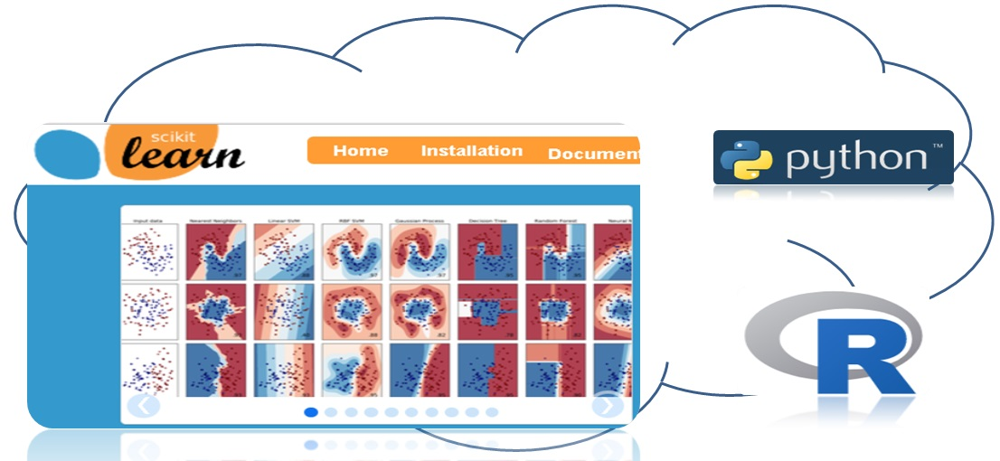
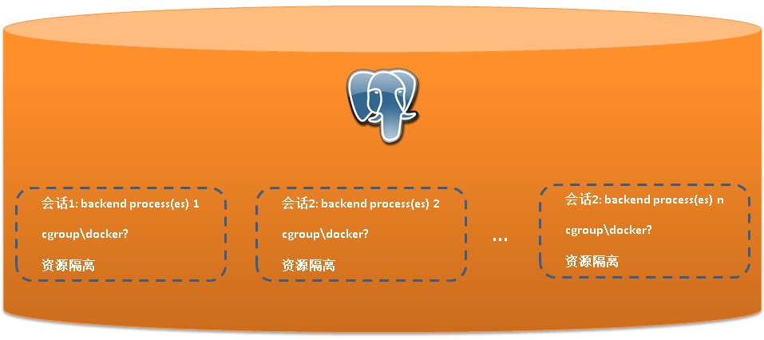
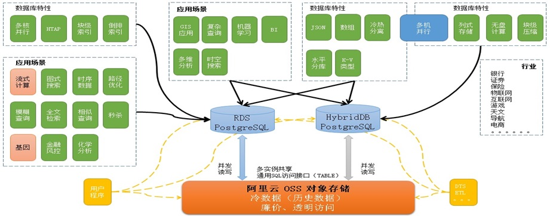

## 数据库的未来 - HTAP，软件、硬件、云生态的融合   
                                            
### 作者        
digoal        
         
### 日期        
2017-05-26         
               
### 标签        
PostgreSQL , GPU , FPGA , CPU , TPU , PL/language , 科研 , 嵌入式计算 , UDF , CUDA , 数据库嵌入式编程 , 流式计算 , 科学计算 , 软硬一体 , PostGIS , 点云 , 开发者生态 , python library , CRAN , R           
        
----        
           
## 背景       
数据库经过了几十年的发展，未来的路怎么走？从硬件、软件技术的发展，结合业务的需求出发我们可以从中看出一些端倪。       
     
## 一、数据类型多样化  
随着技术的普及，越来越多以前需要很高的成本才能获取的数据，现在触手可及。     
     
1\. 点云（点的位置坐标+RGB+其他属性），以前只有军用领域在使用，比如《普罗米修斯》这部电影，通过一些小的飞行器（点云传感器设备）飞入未知的通道后，传回获取的点云数据，从而构建通道的全系影像。         
     
     
      
现在民用领域，也有很多点云的类似应用。例如：扫地机器人，无人车，消防（探测房屋结构），VR（通过点云数据构建全息影像）等等。          
      
         
      
2\. 气象数据 （位置、日照、温度、雨量、风量等），气象数据往往是栅格类型的数据，一个栅格包含了一片区域的日照、温度、雨量、风量等数据，栅格可以切分和聚合。      
      
气象数据的有非常多的用途，例如：      
      
光伏电厂的选址，需要分析某区域某个时间段，日照数据统计。      
     
多个栅格的数据聚合，或者一个栅格数据的部分截取等。比如一个包含了浙江省的栅格数据，如果只需要杭州市区的数据，那么可以在读取时将杭州的区域切分出来。      
      
在时间维度上分析，在地理位置维度上分析，在其他属性维度分析，多个维度的分析。      
      
生成时序动态图等。      
      
历史栅格数据不断的积累，不停的上传新的数据使得历史数据越来越多。      
      
         
      
3\. 地震数据（高频波，傅立叶变换），地震数据是一些包含了地理位置属性的XYZ三个方向的高频波形数据，收到数据后，需要对其进行快速的数据转换，预测和告警。      
      
同时还需要对历史的数据进行挖掘。      
      
          
      
4\. 天文数据（寻天，星系，轨迹比对），从古至今，人类一直没有停止对外太空的探索，天文台就是一个最为直接的探索外太空的设备。      
      
有一个项目叫“寻天”，每天这些望远镜需要对天球坐标进行全方位的拍摄，拍摄的数据以栅格类型存入数据库，以备后续的分析。比如寻址超新星，寻找类太阳系等。其中寻找类太阳系就需要对单个栅格的多个历史数据进行比对，通过行星运行轨迹对光线造成的细微影响找出类太阳系的星体。      
      
涉及到大量的时间、空间维度的运算。      
      
          
      
5\. 室内定位（孤立坐标系、相对坐标系），实际上现在室内定位也非常的成熟了，例如你站在某个商场中，商场有若干个WIFI热点，只要你的手机开启了WIFI，那么通过3个WIFI热点与你的手机之间的信号强弱，就可以定位到你的位置。除了通过WIFI进行定位，还有磁场、声波、视觉等定位方法。定位后，数据以坐标+误差范围的形式存入数据库，这个坐标是相对坐标。      
      
室内定位有什么商业用途呢？例如可以获取某个时间点的人群分布，哪个商场或者站台附近聚集了人群，进行营销效果的挖掘。      
      
又比如，在时间+空间维度上，统计分析人流量，平均的驻留时间等。      
      
         
      
6\. 室外定位（定位方法：GPS、基站信号强弱等），人群踩踏事件预测，非法聚众预测，事件预测，某个位置的人群驻足时间（广告效应报告）等。      
      
         
      
7\. 生物类型、化学类型、图像特征类型、IOT的发展衍生了更多的数据类型。    
     
    
    
8\. 其他，民用，军用      
      
还有那些喜闻乐见的应用，o2o, 地图, 导航, 位置交友, 都带有很强的时间、空间、业务数据属性。      
      
面向这么多的军用转民用技术，民用的软件技术有没有准备好？数据库有没有准备好接招呢？      
      
## 二、查询维度多样化 - 时间、空间、业务等维度 - 存储与计算的挑战      
      
1\. 业务数据类型越来越丰富，例如大多数业务基本上都会包含空间数据。      
      
2\. 大多数的数据具备时序属性，例如金融数据、物联网传感数据、气象数据、天文数据、地震监测数据等。      
      
3\. 数据查询维度（筛选条件）越来越多，（时间、空间、业务维度等），例如      
      
在2017-01-01 ~ 2017-02-01这个月，某个点附近方圆30公里发生的事件。      
      
在某个时间段，所有区域发生的事件。      
      
在某个时间段，某个区域，某些用户发生的事件。      
      
4\. 数据的计算需求越来越复杂，参与计算的数据量越来越庞大，计算离数据太远导致传输效率浪费。      
      
越来越多计算下推的需求。      
      
5\. 业务对数据计算的时效性越来越高，越来越多的计算被前置（如流计算，数据清洗等）。      
      
6\. 业务对数据深度学习的需求越来越多，而计算与数据的距离使得效率低下。      
      
传统的存储与计算分离，使得整体的计算效率偏低。越来越多的计算前置、计算下推需求，来提升存储计算分离这种架构下的效率。      
      
## 三、数据库的认知  
由于数据库发展缓慢，并没有跟上业务对数据库的需求，大多数的处理逻辑、运算都通过应用程序来解决，甚至“没有什么问题是加一层不能解决的”使得数据离计算越来越远，路径的增加使得效率越来越低下。  
  
这也使得大多数的人对数据库的认知变成这样的：  
  
1、传统数据库  
  
就是支持SQL接口的数据存储。  
  
存储和计算分离，让大多数计算在应用层实现。  
  
2、因为数据库的处理能力弱，设计时产生妥协  
  
对业务分层，例如加入消息队列、流计算、K-V缓存 等等，减轻数据库负担。  
  
3、能耗比降低  
  
分层越多，应用离数据越远，路径越长、能耗比越低。  
  
4、传统数据库挑战  
  
数据类型、内置的函数、类型的操作符、支持更多类型的索引  
  
支持更大数据量的存储和计算  
  
可编程能力，数据库只有SQL接口是不够的，SQL的功能有限  
  
硬件的利用能力，有多少硬件资源，就能用多少硬件资源，绝不手软。  
  
软件生态的对接，开发者构筑了强大的软件生态，如何更好的对接？  
  
## 四、HTAP 的挑战  
综合前面的分析，业务对数据库的需求分为这几个层面：    
    
### 1、资源的有效利用  
  
当用户需要时（例如半夜跑报表），数据库可以利用一切可以利用的资源(CPU多核\GPU、磁盘吞吐、网络吞吐等)，快速的帮用户完成请求。  
  
    
  
### 2、资源的控制和隔离  
  
如果满足了条件1，那么就会引发第二个问题，资源的隔离，例如A用户正在跑报表，它把所有资源都用掉了，而有一些需要实时响应的业务可能因此受到影响。  
  
类似Linux的CPU公平调度中的realtime 和 普通的进程，realtime进程在QoS时可以优先获得CPU时间片，不受大量资源使用的干扰。  
  
    
  
### 3、能耗比  
  
这个很好理解，提高能耗比是高精尖的活。例如CPU向量计算指令的利用，光这一项就有可能提升10倍的数据分析效率。  
  
    
  
### 4、天花板  
  
不管怎么优化，怎么扩容，单机一定是有天花板的。所以除了发挥单机能力，还需要具备水平扩展能力。  
  
    
  
### 5、软件生态  
  
开发者辛辛苦苦积累的LIB库，例如python的科学计算library，R的CRAN等。  
  
数据库用的是SQL语言，没有办法与这些library对接。如何突破SQL的限制，对接开发者的生态，让开发者用起来更爽。  
  
    
  
每个行业都有各自的特点，每个行业都有对行业理解深厚的ISV（地头蛇），每个行业都有各自的积累（开发框架、Lib库等）。      
      
例如      
      
在科学计算这个领域，有很多的python, R, go, julia语言相关的第三方库。这些行业第三方库是开发人员、科研人员对行业的理解与积累。（这些科学计算Lib库可能被广泛应用于气象预测、地震预测、金融等众多行业。）      
      
如果这些Lib库可以与数据紧密的结合，大大的拉近了计算与数据的距离，直接提升计算效率并且降低了成本，开发人员一定会很高兴。      
      
[<Python常用科学计算相关外部库>](http://gohom.win/2015/08/10/python-good-lib/)      
      
      
      
以往是这样算（数据从数据库拉取到应用程序，应用程序再对其进行计算）：      
      
         
      
现在是这样算（使用科学计算相关的Lib库，就在数据库里面算）：      
      
         
      
数据库与程序开发语言、以及对应的LIB库打通，是一件很美妙的事情。     
  
除了开发者生态，还有一个不容忽视的生态圈，云生态，也是未来数据库需要对接的生态。让数据库和云上数据可以无缝融合，是非常关键的。  
  
例如阿里云RDS PG与OSS对象存储，就实现了无缝融合，用户可以在数据库中直接读写OSS，将OSS作为无限容量的存储来使用，将历史数据存储到OSS，未来要分析时还可以直接进行读写。  
  
### 6、硬件生态  
  
以往大多数的软件都是围绕CPU在设计，但是现在已经迈入了计算密集型的时代，CPU正在逐渐的丧失市场核心的位置，GPU、FPGA、TPU等处理器正在逐渐的成为核心。  
  
这些处理器都有对应的SDK，也会有对应的编程语言。  
  
未来数据库如何与这类硬件更好的整合，利用它们的计算能力，是非常重要的。  
  
    
  
    
  
    
  
    
  
通常我们理解的计算单元就是CPU，然而随着技术的发展，越来越多专业的硬件，例如显卡计算单元GPU，例如可烧录，可编程的FPGA，还有随着AI火起来的面向机器学习的定制芯片TPU。      
      
[谷歌硬件工程师揭秘，TPU为何会比CPU、GPU快30倍？](https://www.leiphone.com/news/201704/55UjF0lafhIZVGJR.html)      
      
[老黄呕心之作，英伟达能凭借Tesla V100技压群雄吗？](https://www.leiphone.com/news/201705/ZTztMk9I6t8lVP2U.html?ulu-rcmd=0_5021df_art_0_a3ba8a6ccd22402199137fed4a3f604a)      
      
[深入理解 CPU 和异构计算芯片 GPU/FPGA/ASIC 1](https://www.qcloud.com/community/article/323436001490098149)      
      
[深入理解 CPU 和异构计算芯片 GPU/FPGA/ASIC 2](https://www.qcloud.com/community/article/35505001490098107)      
      
那么数据库能否跟上这波硬件发展的浪潮呢，或者说如何抓住硬件发展的红利呢？      
  
## 五、PostgreSQL HTAP之路  
### 1、资源的有效利用  
1、支持CPU多核并行  
  
2、支持流式计算  
  
3、精细锁粒度，提高并发处理能力  
  
### 2、资源的控制和隔离  
  
1、PG有一个参数可以控制全局并行度资源，控制并行查询的CPU的使用率，例如服务器有128核，分配给并行计算的限制到96。确保预留足够TP资源。  
  
2、PG可以在进程级进行资源控制(iops,cpu,mem,network,...)    
    
PostgreSQL是进程模型，这方面可以结合docker, cgroup等手段实现资源的控制。        
      
      
  
### 3、能耗比  
  
1、代码优化，可以提高执行效率，从而提高能耗比。例如算子复用。  
  
2、LLVM -> 3~5x faster  
  
PG 10已将JIT框架整合到内核中，未来会支持更多的算子。  
  
3、向量计算 -> 10x+ faster  
  
目前通过VOPS插件可以支持向量计算，利用CPU的向量计算指令，达到批处理的目的，大幅度提升OLAP性能。  
  
4、列式存储 -> 压缩，更好的支持LLVM，向量计算  
  
通过瓦片式存储实现列存，或者通过FDW实现列存，例如cstore。  
  
5、流式计算 -> smooth化，减少怠速开销  
  
服务器即使不做任何运算，也要耗电，就像汽油发动机一样，怠速时，也会费油。PostgreSQL通过pipelinedb插件，实现流计算，可以有效的利用怠速的自有，从而实现高效的计算。  
  
### 4、天花板  
1、垂直扩展  
  
CPU、GPU、FPGA 。。。  
  
RDMA、BLOCKDEVICE、NETWORK  
  
2、水平扩展  
  
sharding - inherit, fdw, partition, proxy,...   
  
MPP - citus, xl, GPDB  
  
垂直扩展和水平扩展都有成熟的解决方案。  
  
### 5、软件生态  
  
1、打破SQL语言局限性，对接行业Lib生态 - 提升开发、执行效率，降低成本      
  
PostgreSQL的PL框架实现了这一点，目前已支持plcuda, plpython, plr, pljava, plperl, pltcl, C等非常多的内置编程语言，（通过接口，还可以支持更多的地球编程语言）。      
      
PLpythonu用法举例      
      
```    
这个UDF用于获取文件系统的使用情况      
    
create or replace function get_fs_info() returns void as $$    
import os      
import statvfs    
phydevs = []      
f = open("/proc/filesystems", "r")      
for line in f:      
  if not line.startswith("nodev"):      
    phydevs.append(line.strip())      
  retlist = []      
f = open('/etc/mtab', "r")      
for line in f:      
  if line.startswith('none'):      
    continue      
  fields = line.split()      
  device = fields[0]      
  mountpoint = fields[1]      
  fstype = fields[2]      
  if fstype not in phydevs:      
    continue      
  if device == 'none':      
    device = ''      
  vfs=os.statvfs(mountpoint)    
  available=vfs[statvfs.F_BAVAIL]*vfs[statvfs.F_BSIZE]/(1024*1024*1024)    
  capacity=vfs[statvfs.F_BLOCKS]*vfs[statvfs.F_BSIZE]/(1024*1024*1024)    
  used=capacity-available    
  plpy.notice('mountpoint',mountpoint,'capacityGB',capacity,'usedGB',used,'availableGB',available)    
$$ language plpythonu;    
```    
      
使用pl编程后，数据与计算水乳交融，效率大增。      
      
      
      
      
      
      
     
2、打破数据孤岛，对接云生态。  
  
云端有很多非常便捷的服务，例如搜索、MQ、SLS、CACHE、对象存储、quickBI、消息服务、订阅...。让数据库和云上数据可以无缝融合，是非常关键的。  
  
阿里云RDS PostgreSQL与OSS对象存储，实现了无缝融合，用户可以在数据库中直接读写OSS，将OSS作为无限容量的存储来使用，将历史数据存储到OSS，未来要分析时还可以直接进行读写。  
  
   
  
3、开放接口  
  
开放类型、操作符、函数接口，开放索引接口，开放数据扫描接口，...   
  
支持多样化的数据类型（包括存取、搜索、处理、UDF等多方面），再也不用担心有不支持的类型了。  
  
4、开放SQL流计算接口  
  
有效利用服务器的怠速开销。  
  
### 6、硬件生态  
  
1、CPU      
      
CPU的发展趋于缓慢，可以挖掘的潜能主要包括 :       
      
扩展指令集，（如向量计算指令，已被PostgreSQL利用来加速OLAP数据分析场景，约有10倍的性能提升），例如      
      
[《PostgreSQL 向量化执行插件(瓦片式实现) 10x提速OLAP》](../201702/20170225_01.md)        
      
增加CPU计算单元，（例如PostgreSQL已支持多核并行计算，提升OLAP数据分析场景的性能，多核并行，一条SQL可以充分利用多个CPU核，缩短单条SQL的响应时间，特别适合OLAP业务），例如      
      
[《分析加速引擎黑科技 - LLVM、列存、多核并行、算子复用 大联姻 - 一起来开启PostgreSQL的百宝箱》](../201612/20161216_01.md)        
  
2、对接新硬件生态（GPU、FPGA、TPU、...）  
  
2\.1 GPU      
      
GPU与CPU的对比如下，GPU在核心数、FFLOPS、内存带宽方面，相比CPU有非常明显的优势。      
      
         
      
PostgreSQL通过pl/cuda语言接口，用户可以在数据库中直接使用GPU的计算能力。      
      
         
      
pl/cuda用法参考：      
      
https://github.com/pg-strom/devel      
  
pg-strom的作者Kaigai也从NTT出来，加盟了以GPU为核心的Hetero-DB(Next Generation High-Performance Database Systems)。  
  
http://hgpu.org/?p=14236  
  
pg-strom插件，使用开放的扫描接口，利用GPU提升多表JOIN的性能。  
  
http://strom.kaigai.gr.jp/manual.html  
  
  
      
2\.2 FPGA      
      
FPGA作为一种高性能、低功耗的可编程芯片，可以根据客户定制来做针对性的算法设计。所以在处理海量数据的时候，FPGA 相比于CPU 和GPU，优势在于：FPGA计算效率更高，FPGA更接近IO。      
      
FPGA不采用指令和软件，是软硬件合一的器件。对FPGA进行编程要使用硬件描述语言，硬件描述语言描述的逻辑可以直接被编译为晶体管电路的组合。所以FPGA实际上直接用晶体管电路实现用户的算法，没有通过指令系统的翻译。      
      
FPGA的英文缩写名翻译过来，全称是现场可编程逻辑门阵列，这个名称已经揭示了FPGA的功能，它就是一堆逻辑门电路的组合，可以编程，还可以重复编程。      
      
PostgreSQL 社区，xilinx都有这方面的结合产品。      
      
https://www.pgcon.org/2015/schedule/track/Hacking/799.en.html      
      
2\.3 TPU      
      
在Google I/O 2016的主题演讲进入尾声时，Google的CEO皮采提到了一项他们这段时间在AI和机器学习上取得的成果，一款叫做Tensor Processing Unit（张量处理单元）的处理器，简称TPU。在大会上皮采只是介绍了这款TPU的一些性能指标，并在随后的博客中公布了一些使用场景：      
      
Google一直坚信伟大的软件将在伟大的硬件的帮助下更加大放异彩，所以Google便在想，我们可不可以做出一款专用机机器学习算法的专用芯片，TPU便诞生了。       
      
TPU的灵感来源于Google开源深度学习框架TensorFlow，所以目前TPU还是只在Google内部使用的一种芯片。      
      
https://www.leiphone.com/news/201605/xAiOZEWgoTn7MxEx.html      
  
2\.4 UDF  
  
硬件总有SDK，SDK总有对应的开发语言，通过PL/$LANGAGE接口，PostgreSQL可以通过UDF的方式利用这些硬件的能力。  
  
pl$language  
  
plCUDA  
  
C  
    
PostgreSQL以其扩展接口(pl/language, customscan, operator, type, index扩展)，可以非常方便的对接以上各种硬件计算单元，让数据和计算紧密的结合，提高能效比。      
      
通过利用指令集、多核计算对接CPU，通过PL/CUDA，customscan对接GPU，通过customscan对接FPGA，等等，一切都是为了提升计算能力。      
  
PostgreSQL 通过 CPU多核并行、向量计算、JIT、GPU、FPGA等手段扩展单体计算能力。通过sharding、MPP等手段横向扩展。消灭瓶颈。    
    
## 六、回顾数据库的发展      
关系数据库发展了几十年，最核心的功能，依旧是支持可靠的数据存取、支持SQL接口。      
      
随着社会的进步，数据库正在添加越来越多的功能，比如GIS就是其中之一。      
      
为什么要将GIS功能添加到数据库中呢？在应用层实现不好吗？      
      
这个问题很有意思，在应用层实现当然是可以的，但不是最好的。      
      
举个例子，我们存储了一批用户、商铺的位置数据，要求某个用户周边的其他商铺，如果要在应用层实现这个功能，需要将位置数据都下载到程序端，然后计算距离，并输出周边的商铺。而用户请求的并发可能较高，请求的位置可能都不一样。在应用层实现这个功能，效率非常低下，因为每一次请求，都需要将数据载入应用层，同时需要计算每条记录的距离。印证了一句古话“远水解不了近渴”。      
      
在数据库层实现GIS这个功能遵循了两个宗旨：      
      
1\. 数据和计算在一起，每次请求不再需要move data，提升了整体效率。      
      
2\. 让数据库支持GIS类型和GIS索引，让每一次距离查询都可以通过索引检索，提升查询效率。      
   
可以看出，数据库的发展实际上也是遵循了以上原则，在保证数据库不会成为瓶颈的前提下，让整体的效率得以提升。      
      
### 1 PostgreSQL 哪些手段解决瓶颈问题？      
1\. 提升计算能力      
      
充分利用硬件的能力提升计算能力。例如结合 CPU指令、CPU多核协作、GPU、FPGA。。。      
      
2\. 提升开发效率      
      
SQL标准的兼容性越好，开发用起来越爽。      
      
支持的类型、function、索引越丰富，开发用起来越爽。      
      
支持的编程接口越丰富，开发人员越爽，例如通过plpython对接PyPI，通过plR对接CRAN，通过plcuda对接GPU开发生态。      
      
支持的开发框架越多，开发人员越爽。      
      
3\. 提升扩展能力      
      
分为两个部分的扩展，一部分是计算能力的扩展，另一部分是开发能力的扩展。      
      
扩展计算能力：      
      
通过sharding，水平扩展节点，扩展整体性能。      
      
通过MPP插件，扩展跨库计算能力。      
      
扩展开发能力：      
      
通过扩展接口（类型、索引、PL语言、UDF、解析器、执行器），支持更多的数据类型、索引类型、编程语言等。GIS就是其中一个例子，扩展了GIS类型、索引、UDF等等。      
      
3\.1 如何扩展数据类型？       
      
https://www.postgresql.org/docs/10/static/xtypes.html      
        
3\.2 如何扩展索引？        
      
https://www.postgresql.org/docs/10/static/xindex.html    
      
https://www.postgresql.org/docs/10/static/gist.html    
    
https://www.postgresql.org/docs/10/static/spgist.html    
    
https://www.postgresql.org/docs/10/static/gin.html    
    
https://www.postgresql.org/docs/10/static/brin.html    
      
3\.3 如何嫁接编程语言？      
    
https://www.postgresql.org/docs/10/static/plhandler.html    
      
3\.4 如何扩展操作符？       
    
https://www.postgresql.org/docs/10/static/xoper.html    
      
3\.5 如何扩展UDF？       
    
https://www.postgresql.org/docs/10/static/xfunc.html    
      
3\.6 如何扩展外部数据接口？    
    
https://www.postgresql.org/docs/10/static/fdwhandler.html    
    
3\.7 如何扩展聚合UDF？    
    
https://www.postgresql.org/docs/10/static/xaggr.html    
      
### 2 PostgreSQL 如何提升业务整体效率？      
1\. 计算与数据在一起，减少move data。      
      
前面举的GIS的例子说明了一个问题，频繁的移动数据使得程序的效率低下，如果将计算与数据结合起来，可以大幅的提升效率。      
      
### 3 PostgreSQL 如何融合行业Lib生态      
      
1\. 计算与数据在一起，减少move data。      
      
PostgreSQL内置了许多函数、数据类型、索引类型（已超越ORACLE支持的范畴），可以满足大多数的业务场景需求。      
      
如果内存的数据类型不能满足业务需求，可以通过类型扩展接口，扩展数据类型以及类型配套的操作符、函数、索引等。      
      
如果内置的函数、操作符无法满足业务对数据处理的需求时，用户可以通过plpython, plr, plcuda, pljava, plperl, pltcl等数据库过程语言，不仅扩展了编程能力，同时还对接了编程语言生态。      
      
例如PyPI, CRAN等库，在数据库中完成对数据的一站式处理。      
      
这个章节描写了如何扩展PostgreSQL：类型、函数、操作符、索引、聚合等。      
      
https://www.postgresql.org/docs/10/static/extend.html      
      
2\. SQL接口流计算      
      
pipelinedb是基于PostgreSQL的一个流计算数据库，1.0版本将支持插件化，PostgreSQL用户可以通过安装插件的方式，支持流计算的功能。      
      
SQL流计算有诸多好处，数据库的SQL接口非常成熟，支持非常成熟的统计分析函数，统计分析语法。建立流的过程非常简单。      
      
[《(流式、lambda、触发器)实时处理大比拼 - 物联网(IoT)\金融,时序处理最佳实践》](../201705/20170518_01.md)        
      
[《流计算风云再起 - PostgreSQL携PipelineDB力挺IoT》](../201612/20161220_01.md)        
      
SQL接口的流计算，使用便捷，开发成本低，启动成本低，扩展能力强，效率高。      
      
除此之外，PostgreSQL还整合了CPU\GPU\FPGA等计算能力，整合了PL编程接口，流式处理的能力更加的强大。      
        
比如气象类应用，大量的用到了GIS + 科学计算（plpython）+ 流式计算 + GPU （pl cuda）的处理能力。使用PostgreSQL就非常的恰当。        
        
[《PostgreSQL 支持CUDA编程 pl/cuda》](20170526_01_pdf_001.pdf)      
      
[《PostgreSQL 点云应用》](20170526_01_pdf_002.pdf)      
      
## 七、小结      
对企业来说，数据和计算是两个不可分割的部分。      
      
经历了几十年的发展，数据库在数据的可靠存取、业务连续性方面成就卓越，企业也非常相信数据库这方面的能力，通常会将数据都存入数据库中。      
      
同时企业对数据的计算需求也在膨胀，从最初的简单计算，到现在越来越复杂的计算需求。计算的需求分为两个部分，1、运算能力，2、编程能力。         
      
1\. 数据库在运算方面的能力也在逐渐提高，但是在兼顾数据可靠性的前提下，弹性提升运算能力没有想象中容易，大多数的关系数据库仅仅依赖 CPU\硬盘 等本地硬件能力的提升，运算能力提升非常有限，企业也不能等待数据库在这方面的提升。      
      
2\. 数据库在编程能力方面，有几种提升手段，一种是扩展SQL语法，支持更多的数据类型、函数、索引等。另一种是语言的支持，通常数据库会内置存储过程语言，例如Oracle的PL/SQL，PostgreSQL的plpgsql，但是这些语言的编程能力有限。      
      
所以市场中衍生出适合各种场景的数据库或框架，以牺牲"并发能力、数据可靠性、一致性、易用性、事务、功能等"的某些部分为代价。例如 时序数据库、流计算数据库、NOSQL、大数据框架、分布式数据库 等等。      
      
那么关系数据库到底还能不能提升计算能力呢？      
      
实际上还是和数据库本身的框架有关，PostgreSQL的框架特别有意思，开放了众多的接口，在保证数据库核心功能不妥协的前提下，允许对其进行扩展。包括：      
      
数据库服务端编程语言(PLpython, java, perl, R, ...)、类型、函数、操作符、索引、聚合、外部存储、customScan等。      
      
## 八、数据库的未来 - HTAP，软件、硬件、云生态的融合      
Hybrid Transactional/Analytical Processing (HTAP)是gartner提出的一个新名词，代表一种既能处理在线事务，又能处理分析型请求的混合数据库。      
      
https://en.wikipedia.org/wiki/Hybrid_Transactional/Analytical_Processing_(HTAP)      
      
         
      
比如在物联网的边缘计算场景，就非常的适合，成本低，效率高，一体成型。       
      
    
      
要实现HTAP，必须打通数据、计算的任督二脉。PostgreSQL在这方面具有天然的优势，从这几年的发展也能看出端倪。      
      
1\. 通过PL(数据库内置编程语言(PLpython, java, perl, R, ...))对接行业生态，让开发者积累的Lib得以传承。      
      
2\. 通过扩展接口对接硬件生态，让CPU,GPU,FPGA,TPU,ASIC等参与垂直的专业计算，提升效率，打破传统的CPU ONLY的模式。      
      
3\. 通过流实现计算前置，解决数据的实时计算需求。      
      
4\. 通过FDW接口，存储接口将计算下推，让更多具备运算能力的单元参与运算，避免集中式运算的局面。提升大数据量的处理能力。      
      
其中的代表包括postgres_fdw, 阿里云的oss_fdw。      
      
5\. 通过sharding技术实现数据库的水平扩展。      
      
6\. 通过MPP提升大规模计算协作能力。      
      
7\. BSD-like许可，已经有非常多的企业以PostgreSQL为基础打造了更多的衍生产生，免去重复造轮子的过程。     
      
8\. 扩展类型、函数、操作符、索引接口，对接垂直行业生态。      
      
PostGIS, 基因类型, 化学类型, 图像特征类型, 全文检索等插件，就是非常典型的例子。支持更多的垂直行业应用。          
      
9\. 当数据库可以无限扩展，具备强大的计算能力时，它已然不是一个传统的只能存取数据的数据库，而是一个提供了编程能力、计算能力、扩展能力的数据平台(或数据工厂)，提升数据的使用效率、节约成本。      
      
10\. 即使数据库可以无限扩展，还有一点需要注意，资源的控制。特别是开放了pl之后，用户写的代码可能把资源用尽。一个比较有效的资源调度：当系统有足够的空闲资源时放开用，当系统资源不足时，按权重调度分配资源的使用。       
     
11、通过开放的接口，与云端无缝的融合。     
  
      
     
      
       
## 九、参考        
http://postgis.net/docs/manual-dev/      
      
https://2016.foss4g-na.org/sites/default/files/slides/gbroccolo_FOSS4GNA2016_pointcloud_0.pdf      
      
https://www.slideshare.net/kaigai/pgconfsv2016-plcuda/      
      
https://github.com/pg-strom/devel      
      
http://www.pgconfsv.com/program/schedule      
      
http://kaigai.hatenablog.com/entry/2016/11/17/070708      
      
http://www.pgconfsv.com/plcuda-fusion-hpc-grade-power-database-analytics-0      
      
http://www.pgconf.asia/JP/wp-content/uploads/2016/12/20161203_PGconf.ASIA_PLCUDA.pdf      
      
http://gohom.win/2015/08/10/python-good-lib/      
      
[《PostgreSQL 数据库扩展语言编程 之 plpgsql - 1》](../201701/20170110_01.md)       
      
http://it.sohu.com/20170525/n494441009.shtml      
      
https://www.leiphone.com/news/201704/55UjF0lafhIZVGJR.html      
      
  
<a rel="nofollow" href="http://info.flagcounter.com/h9V1"  ></a>  
  
  
  
  
  
  
## [digoal's 大量PostgreSQL文章入口](https://github.com/digoal/blog/blob/master/README.md "22709685feb7cab07d30f30387f0a9ae")
  
