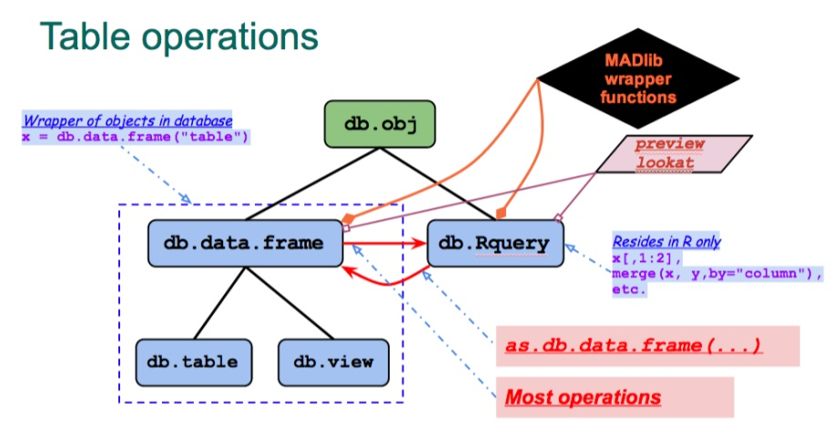
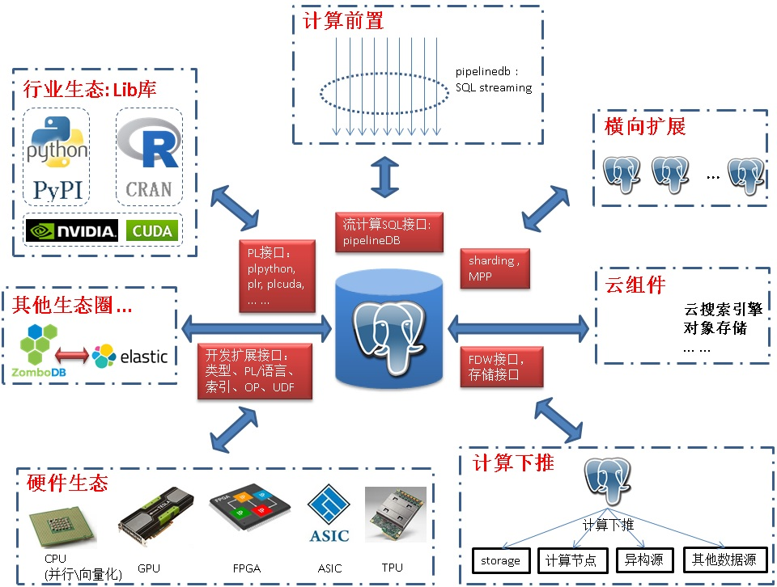

## AI(OtterTune)引波澜 - AI会洗牌数据库行业吗? DBA如何转变思想
                                                
### 作者            
digoal            
             
### 日期            
2017-06-05            
                   
### 标签            
PostgreSQL , 机器学习 , AI , 自动优化 , DBA , 科学计算    
            
----            
               
## 背景    
最近AI的新闻特别多，席卷了围棋圈之后，成为了技术圈和媒体热捧的话题。  
  
今天又一个产品借AI上头条了 - OtterTune ，一个数据库参数调优的产品，借助机器学习的技术，生成最优的数据库参数。  
  
下面是这个产品的论文  
  
[《Automatic Database Management System Tuning Through Large-scale Machine Learning》](20170605_01_pdf_001.pdf)  
  
http://db.cs.cmu.edu/papers/2017/tuning-sigmod2017.pdf  
  
OtterTune 的源码在此：  
  
https://github.com/cmu-db/ottertune  
  
虽然OtterTune只是一个结合了机器学习(建模、调参数、获取系统反应、学习、产生最优参数；典型的临床学)，可用于参数优化的小软件(实际上DBA的工作远不止这些)，但是已经代表了一个方向，未来越来越多的活（枯燥的活）可能会被AI取代。   
  
  
  
那么如何看待OtterTune呢？DBA真的要失业了吗？  
  
## 混沌初开（因果学） VS 临床（经验学）  
《易经》：“易有太极，是生两仪，两仪生四象，四象生八卦。”  
  
孔颖达疏：“太极谓天地未分之前，元气混而为一，即是太初、太一也。”  
  
  
  
引用上面这段，主要说明凡事有因果，从因可以推理出果。  
  
反观临床学，临床医学（Clinical medicine）根据病人的临床表现，从整体出发结合研究疾病的病因、发病机理和病理过程，进而确定诊断，通过预防和治疗以最大程度上减弱疾病、减轻病人痛苦、恢复病人健康、保护劳动力。  
  
临床学是经验的积累，需要总结非常多的案例，观察人体对药物反应，总结经验，提炼成学术。是一种反复试错总结的过程。  
  
OtterTune更像临床学，因为一开始它也不知道哪个参数这样设置会怎么样，那样设置又会怎么样？是在无法知道因果的情况下的一种经验科学。只有在积累了足够多的经验时，才能发挥更好的效果。  
  
人类在经验科学方面的发展是比较缓慢(相比AI)，因为人类大脑对数据的处理能力远不能和计算机相比。计算机的出现推动了经验科学的发展。  
  
一些靠经验吃饭的工作，往往是越老越吃香，不过将来也是最容易被AI替代的。可以考虑转行，或者考虑在转行前把经验转化为产品。   
   
## 人类DBA vs 机器DBA vs 云数据库  
DBA的工作有哪些？DBA的工作实际上都是围绕数据库展开，包含但不限于这些工作：  
  
1\. 数据库、主机、操作系统、交换机、存储选型，预算，架构设计，部署，参数优化；  
  
2\. 数据库备份、恢复、容灾、HA、新老硬件更替；  
  
3\. 数据库SQL审计、SQL优化、异常问题诊断、性能优化、巡检、健康诊断；  
  
4\. 数据库扩容、缩容、迁移；  
  
5\. 数据库版本升级、补丁修复；  
  
6\. 数据库开发规范、管理规范的指定和执行；  
  
7\. 数据库监控、专家、审核系统的开发与建立；  
  
8\. 数据库代码覆盖率测试、功能测试、建模、压测、profiling；  
  
9\. 数据库读写分离、sharding、MPP系统的构建；  
  
10\. 数据库开发、管理、设计、规范培训；  
  
11\. 数据库在垂直行业应用的架构设计（例如OLAP、GIS、时序、流计算、图式搜索、文本搜索、图搜索、化学、基因、等）；  
  
12\. 异构数据、同构数据源的数据同步、ETL；  
  
13\. 数据库与其他系统的联动；  
  
14\. 数据库云产品化、DOCKER化、虚拟化等相关的工作；  
  
15\. 数据库内核的研究、BUG上报、结合业务提出对内核的功能、性能提升等需求；  
  
16\. 关注不同数据库产品的roadmap、优缺点、适应场景、不适应场景；  
  
17\. 关注数据库行业的发展，进行预研性研究，储备技术；  
  
18\. 与技术社区保持紧密联系，从参与、了解同行、到分享，从商业产品到开源社区；  
  
19\. 技术为业务服务，从本质触发，深入行业，了解业务、行业的发展，抓住核心点，更好的服务于业务。  
  
可以看到DBA的工作还是有蛮多的，一个好的人类DBA从理论基础（因果学）到实际工作经验（临床学），都有非常多的积累。绝对不是一个OtterTune工具可以取代的。OtterTune也只是针对TPC-C，tpc-h场景进行了大量的模拟测试，针对性的输出最优参数而已。  
  
AI要完全取代这些工作，还有非常漫长的过程。就好像现在很多汽车支持的辅助驾驶，也算是AI应用的一种初级阶段，目前辅助驾驶还有很多限制条件，比如必须要有车道线，可能到乡道就不支持了，需要人工介入。目前OtterTune是一个辅助DBA的工具，还没有达到取代DBA的程度。  
  
未来很长一段时间，AI和人类应该是相辅相成的灰色地带。  
  
相比而言，云产品（例如RDS）才真正在逐渐替代大部分DBA的工作。  
  
云厂商不仅提供数据库产品，用户不需要关心架构、部署、备份、容灾、HA、版本升级、读写分离、sharding、内核BUG等问题。同时还提供了增值的服务，比如专家诊断系统（实际上就包含了OtterTune的功能）。更重要的是云厂商提供的数据库还可以和云上的其他产品紧密结合，例如阿里云PostgreSQL，HybridDB for PostgreSQL，可以与阿里云的OSS结合，进行数据的共享，备份，冷热分离。还可以与云BI系统进行联动，用户省去了部署这么多系统的麻烦。  
  
## scikit-learn  
scikit-learn是OtterTune工具用到的一个python机器学习开发库。它支持一些常见机器学习算法，OtterTune用到了降维和群集类的算法。  
  
http://scikit-learn.org/stable/index.html#  
  
#### Classification  
  
Identifying to which category an object belongs to.  
  
Applications: Spam detection, Image recognition.  
  
Algorithms: SVM, nearest neighbors, random forest, ...  
  
#### Regression  
  
Predicting a continuous-valued attribute associated with an object.  
  
Applications: Drug response, Stock prices.  
  
Algorithms: SVR, ridge regression, Lasso, ...  
  
#### Clustering  
  
Automatic grouping of similar objects into sets.  
  
Applications: Customer segmentation, Grouping experiment outcomes  
  
Algorithms: k-Means, spectral clustering, mean-shift, ...  
  
#### Dimensionality reduction  
  
Reducing the number of random variables to consider.  
  
Applications: Visualization, Increased efficiency  
  
Algorithms: PCA, feature selection, non-negative matrix factorization.  
  
#### Model selection  
  
Comparing, validating and choosing parameters and models.  
  
Goal: Improved accuracy via parameter tuning  
  
Modules: grid search, cross validation, metrics.  
  
#### Preprocessing  
  
Feature extraction and normalization.  
  
Application: Transforming input data such as text for use with machine learning algorithms.  
  
Modules: preprocessing, feature extraction.  
  
PostgreSQL可以与机器学习很好的结合，给数据插上机器学习的翅膀。  
  
## 机器学习在PostgreSQL中的应用  
PostgreSQL有多重接口可以与机器学习结合。  
  
### PL接口  
PostgreSQL支持plpython存储过程语言，用户可以直接在PostgreSQL中编写python代码，让数据和代码紧密的结合，提升计算效率。  
  
同时支持plcuda, plR等接口。  
  
下面这篇文章详细描述了PostgreSQL在计算与数据存储方面的多重融合方法。计算与数据融合，减少了数据传输的部分，提升了运行效率。大家想一想未来数据爆炸，如果计算还是和存储分离，会是一个什么景象？不具备计算能力的存储不是好存储。  
  
[《数据库任督二脉 - 数据与计算的生态融合》](../201705/20170526_01.md)    
  
### madlib库与pivotalR  
Madlib库是一个SQL接口的开源的机器学习库，将机器学习的通用算法转换成了SQL UDF，通过调用函数可以支持通用的学习算法，将数据库和机器学习很好的融合在一起，支持PostgreSQL, Greenplum。架构如下：    
  
  
  
  
  
pivotalR则是R的一个机器学习包，通过这个包可以在R的代码中连接PostgreSQL、Greenplum数据库，调用pivotalR的R function，会自动连接数据库，并转成调用madlib的SQL，在数据库中执行SQL，返回结果给R端。这样的话数据不需要加载到R端，而是在数据库层面完成计算。如果数据库是Greenplum，则是并行的计算。  
  
    
  
   
  
在这篇文章中有详细的描述，如何在PostgreSQL中玩AI。  
  
[《想挑战AlphaGO吗？先和PostgreSQL玩一玩?? PostgreSQL与人工智能(AI)》](../201701/20170106_01.md)  
  
### rdkit  
Rdkit是一个化学垂直行业的数据处理函数库、以及化学行业的机器学习库的包。  
  
rdkit的数据存储选用的就是PostgreSQL，因为PG支持类型、索引、函数、OP的扩展，化学行业选择它就像GIS行业选择它一样，看中它的扩展性，在PostgreSQL实现了一套化学行业的数据类型、索引类型、操作符、函数、聚合函数、机器学习函数等。  
  
rdkit还能与scikit-learn库结合使用，例如下面是一个随机森林的例子  
  
```  
from rdkit.Chem.Draw import SimilarityMaps  
  
# helper function  
def getProba(fp, predictionFunction):  
  return predictionFunction((fp,))[0][1]  
  
m5 = Chem.MolFromSmiles('c1ccccc1O')  
fig, maxweight = SimilarityMaps.GetSimilarityMapForModel(m5, SimilarityMaps.GetMorganFingerprint, lambda x: getProba(x, rf.predict_proba))  
```  
  
  
  
### 机器学习在PostgreSQL里的其他应用  
在PostgreSQL社区，也不乏看到机器学习的例子，例如  
  
1\. zson数据类型，是一个兼容jsonb的数据类型，zson通过对jsonb的数据进行训练，得到字典，将JSONB中的内容翻译成字典存储，优化数据存储的压缩比，提高存储效率，同时降低buffer的使用。  
  
[《JSONB 压缩版本 ZSON》](../201706/20170604_01.md)   
  
2\. aqo，通过机器学习，动态调整SQL语句的执行计划。  
  
[《数据库优化器原理 - 如何治疗选择综合症》](../201705/20170507_01.md)  
  
## 人类 vs 机器  
当AI真的发展到可以取代大多数人类的工作的时候，人们干什么去呢？比如多陪陪家人，感受大自然，从事一些自己感兴趣的事情，修生养息，天人合一。  
  
毛主席说：幸福不会从天降。在此前，我们还是来谈一下如何搞AI，把经验转化为产品的事情，个人认为人类有一种把种留下的情结，从古至今各行各业的宗师，如太极宗师。AI只是人类把种留下的另一种表现形式。拥抱AI吧，把种留下。  
  
转行搞AI，个人认为：   
  
至少要懂得一门相关的编程语言，例如R,PYTHON；  至少需要有一定的数学、统计学背景；  至少需要对垂直行业有深刻的认识；  最后就是选择一个合适的平台；  
   
看完这篇文档，你应该知道该如何选择。   
  
[《数据库任督二脉 - 数据与计算的生态融合》](../201705/20170526_01.md)    
    
除此之外，你也可以选择搞云产品，前面提到威胁DBA的目前来看并不是AI，而是云产品，何不投入搞云呢？    
    
PostgreSQL是一个比较值得搞的产品，可以将计算与数据很好的融合，打通任督二脉。   
  
  
    
人工智能相关的电影，推荐可以看一下，AI想追求的确是我们所拥有的习以为常的。    
     
《AI》    
    
21世纪中期，由于气候变暖，南北两极冰盖的融化，地球上很多城市都被淹没在了一片汪洋之中。此时，人类的科学技术已经达到了相当高的水平，人工智能机器人就是人类发明出来的用以应对恶劣自然环境的科技手段之一。先进的人工智能机器人不但拥有可以乱真的人类外表，而且还能像人类一样感知自己的存在。大卫（海利乔奥斯蒙特）就是这样一个有思想、有感情的小机器人，他被一对人类父母所收养，有一个哥哥和一个贴身的伙伴机器泰德熊。但这些并不能让大卫满足，他一直渴望着自己终有一天不再仅仅是个机器人。抱着对这个愿望的执着，11岁的大卫踏上了漫长的心路历程，跟随在他身边的，还有另一个善良的机器人乔（裘德洛）。谁也不知道他们能否完成自己的心愿，脱胎换骨成为真正的人，等待他们的只有凶吉难料的对复杂人性的追寻。   
    
《木偶奇遇记》    
    
孤独的木匠爷爷这晚亲手制作了一个木偶男孩——皮诺曹。可能上天眷顾爷爷，午夜，蓝仙女显灵了，她让这个木偶男孩具有了意识，能像其他男孩那样跑跑跳跳了。获得了生命的皮诺曹兴奋不已，很快和屋子里的小动物交上了朋友。早上爷爷起来见到皮诺曹惊讶不已，他十分感激上天赐给他的礼物。 然而，皮诺曹很快就发现了自己和其他男孩子还是不一样，他没有肉体，不会疼痛，只有冰冷了木制躯体。他开始不满足于现状，梦想着找到蓝仙女让她将自己彻底变为一个真正的男孩子。于是，他踏上了旅程。  
    
## 参考  
1\. Ottertune工具  
  
https://github.com/cmu-db/ottertune  
  
http://db.cs.cmu.edu/papers/2017/tuning-sigmod2017.pdf  
  
2\. python科学计算口袋书  
  
https://github.com/jakevdp/PythonDataScienceHandbook  
  
3\. scikit-learn 机器学习包  
  
http://scikit-learn.org/stable/index.html#  
  
4\. rdkit 化学行业机器学习包  
  
http://www.rdkit.org/docs/Cookbook.html#using-scikit-learn-with-rdkit  
  
5\. PostgreSQL scikit-learn融合包  
  
https://github.com/mkraemer67/plugml  
  
6\. SQL接口机器学习包 - Madlib  
  
http://madlib.incubator.apache.org/  
  
7\. python其他科学计算相关包  
  
https://github.com/rasbt/pattern_classification/blob/master/resources/python_data_libraries.md  
  
https://www.scipy.org/about.html  
  
https://www.scipy.org/  
  
https://wiki.python.org/moin/NumericAndScientific  
  
<a rel="nofollow" href="http://info.flagcounter.com/h9V1"  ></a>  
  
  
  
  
  
  
## [digoal's 大量PostgreSQL文章入口](https://github.com/digoal/blog/blob/master/README.md "22709685feb7cab07d30f30387f0a9ae")
  
