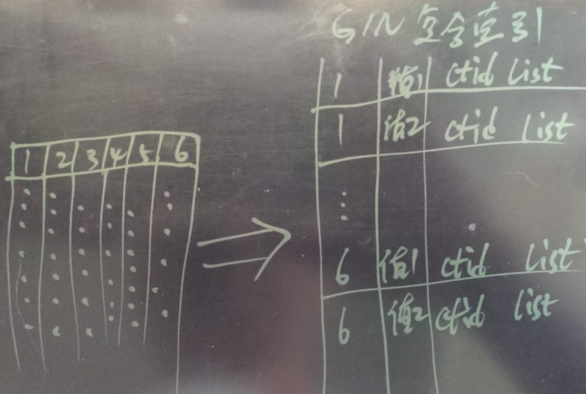
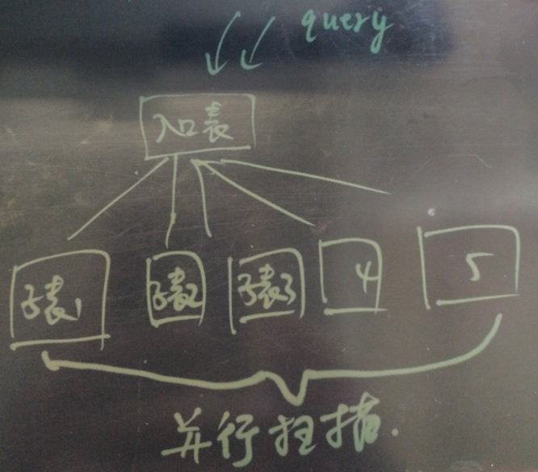
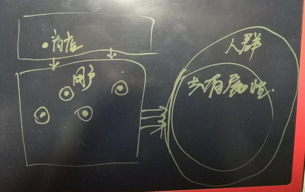
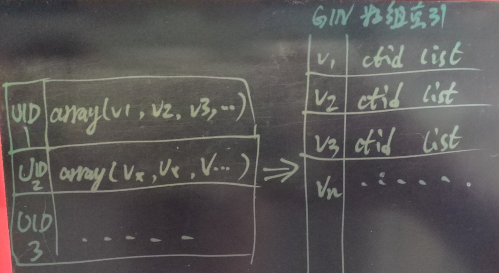
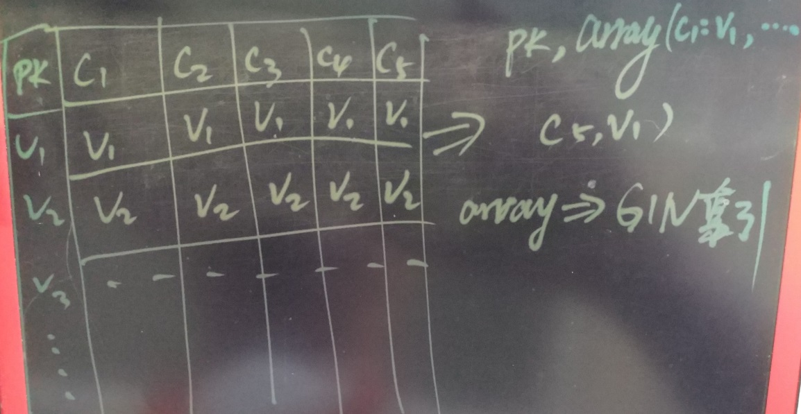

## 多字段，任意组合条件查询(无需建模) - 毫秒级实时圈人 最佳实践  
    
### 作者    
digoal    
    
### 日期    
2017-06-07    
    
### 标签    
PostgreSQL , 数组 , GIN索引 , 任意字段组合查询 , 圈人 , ToB分析型业务 , 建模    
    
----    
    
## 背景    
你也许在一家ToB的数据分析公司，你可能设计了一张表（包括用户标识，及若干已经统计好的的属性值），你也许收集了一些用户的数据，你也许要为客户提供报表，你也许需要为客户提供任意属性值的组合查询，并快速的返回结果给用户。  
  
这些需求应该是非常常见的ToB的数据平台公司的形态，头痛的问题无法建模，因为B端的需求无法捉摸，任意组合查询、要求实时响应。  
  
你的客户数据也许有几十亿上百亿，客户数据也许有几百个属性，用户可能需要的是任意属性组合的结果。  
  
如果要快速响应，你的第一反应是不是对查询条件建立索引呢？  
  
比如   
  
```  
where col1=? and col2=? and col3<>? or col4=?;  
```  
  
这样的SQL，你准备怎么做到实时响应呢？(col1,col2)建立索引，col4建立索引，这样是吗？  
  
但是用户下次的请求肯又换条件了  
  
```  
where col3=1 or col100=?  
```  
  
是不是又要建col3, col100的索引呢？  
  
你会发现根本没有办法优化，因为对应查询的索引组合可能是成千上万的。  
  
## PostgreSQL 对付任意字段检索的黑科技  
我在之前写过一些关于任意字段查询的实践文章，广泛应用于广告营销平台的圈人，ToB的圈人，前端页面的任意组合筛选等场景。  
  
## 方法1，GIN复合索引  
对需要参与查询的字段，建立GIN的复合索引。
  
  
  
CASE如下：  
    
[《任意组合字段等效查询, 探探PostgreSQL多列展开式B树 (GIN)》](../201702/20170205_01.md)    
  
这个场景针对任意字段匹配的场景，PostgreSQL对于多个查询条件，内部会使用索引+bitmapAnd或bitmapOr来筛选BLOCK，得到中间结果。  
  
```  
+---------------------------------------------+    
|100000000001000000010000000000000111100000000| bitmap 1    
|000001000001000100010000000001000010000000010| bitmap 2    
 &&&&&&&&&&&&&&&&&&&&&&&&&&&&&&&&&&&&&&&&&&&&&    
|000000000001000000010000000000000010000000000| Combined bitmap    
+-----------+-------+--------------+----------+    
            |       |              |    
            v       v              v    
Used to scan the heap only for matching pages:    
+---------------------------------------------+    
|___________X_______X______________X__________|    
+---------------------------------------------+    
```  
  
这种方法为什么快呢？    
  
原因是GIN索引实现了内部bitmapAnd or bitmapOr，实际上等效于对每个字段建立单独的B-Tree索引（PostgreSQL对多个B-Tree索引也支持bitmapAnd, bitmapOr的合并）。  
  
bitmapand,or原理如下：  
  
[《PostgreSQL bitmapAnd, bitmapOr, bitmap index scan, bitmap heap scan》](../201702/20170221_02.md)    
  
GIN的复合索引这种方法可以满足以上需求，但是，当数据量非常庞大或者列非常多时，GIN索引会比较大。  
  
### 方法1 优化技巧  
建议可以拆成多张表（例如随机拆分，或者按强制条件拆分）。降低GIN索引的大小，同时还可以利用PostgreSQL 10的多表并行特性，提升查询性能。  
  
#### PostgreSQL并行计算特性  
PostgreSQL支持单表多核并行，也支持多表的并行查询  
  
单表并行，指一条SQL，在处理单张表的数据时，可以使用多个CPU进行运算。  
  
多表并行，指的是一条SQL涉及到多张表的处理（例如APPEND SCAN）时，可以并行的处理多个表的SCAN。  
  
多表并行是在PG 10版本加入的，PostgreSQL 10 append scan 并行  
  
[《PostgreSQL 10.0 preview sharding增强 - 支持Append节点并行》](../201703/20170312_11.md)    
  
  
  
## 方法2，行级全文检索  
将整行记录转换为一个大大的字符串，然后对整行记录建立全文索引（PostgreSQL内置了全文索引的功能），搜索时即覆盖了任意字段任意匹配的场景。  
  
[《PostgreSQL 如何高效解决 按任意字段分词检索的问题 - case 1》](../201607/20160725_05.md)    
  
此方法适用于不限定列，但是限定查询条件的场景。  
  
比如搜索 迪奥香水 ， 可以在表的任意字段匹配，（例如 店铺名字、商品名字、用户名字）。  
  
## 方法3，bloom过滤  
bloom方法过滤的效果有限，目前算是一种预览特性，建议观察使用。  
  
[《PostgreSQL 9.6 黑科技 bloom 算法索引，一个索引支撑任意列组合查询》](../201605/20160523_01.md)    
  
## 方法4，数组化（同类应用 1 - 电商圈人）  
每个用户对应若干个标签，商家根据标签的组合筛选人群。这是广告商的惯用手法。  
  
主要利用了PostgreSQL的数组类型、倒排索引，性能也是杠杠的。   
    
[《万亿级营销(圈人)潇洒的迈入毫秒时代 - 万亿user_tags级实时推荐系统数据库设计》](../201612/20161225_01.md)    
  
  
  
  
  
这种方法为什么快呢？  
  
它采用了ARRAY元素倒排的方法，在查询时，对查询条件进行块级BITMAP筛选，筛选后的数据落到少量的数据块，再进行recheck选出最终结果。  
  
  
  
### 本案例（多字段，任意组合条件 毫秒级实时圈人） 方法4 实践  
实际上文章开头提到的场景，和电商圈人非常相似，所以也能使用电商圈人的方法。  
  
怎么实现呢？  
  
#### 1 多个字段转换为数组  
首先，将多个字段，转换为一个数组字段。  
  
  
  
例如  
  
```
create table test(uid int8 primary key, tag1 int, tag2 text, tag3 int, tag4 text, tag5 timestamp, tag6 date, ...);  
```
  
转换为  
  
```
create table test(uid int8 primary key, tag text[]);  
```
  
例子  
  
```
1, 1, 'man', 1023, 'football', '2017-01-01 10:00:00', '1989-09-01'  
```
  
转换为  
  
```
1, array['tag1:1', 'tag2:man', 'tag3:1023', 'tag4:football', 'tag5:...', tag6:...']  
```
  
#### 2 阶梯化（可选）  
如果查询中包含 =， <> 以外的查询（如某些字段为年龄、销售额、收入等，那么可能有大于，小于的范围查询需求），那么我们需要阶梯化对应TAG的VALUE，阶梯化的方法请参考  
  
[《恭迎万亿级营销(圈人)潇洒的迈入毫秒时代 - 万亿user_tags级实时推荐系统数据库设计》](../201612/20161225_01.md)    
  
#### 3 拆表（可选）  
拆表的目的是并行，保持每个表的体量。  
  
拆表的方法很多，可以随机，可以按UID进行哈希。  
  
拆表后，扫描所有的分区表，聚合结果即可。  
  
拆表可以是本地拆分、也可以是跨库拆分。本地拆分，实际上就是分区表。跨库拆分则涉及到数据分发、聚合的过程。  
  
跨库分发和聚合的方法也很多：例如postgres_fdw+pg_pathman, plproxy, 程序实现等方法。请参考如下文档  
  
[《PostgreSQL 9.6 sharding based on FDW & pg_pathman》](../201610/20161027_01.md)    
  
[《PostgreSQL 最佳实践 - 水平分库(基于plproxy)》](../201608/20160824_02.md)    
  
[《阿里云ApsaraDB RDS for PostgreSQL 最佳实践 - 2 教你RDS PG的水平分库》](../201512/20151220_02.md)    
  
[《阿里云ApsaraDB RDS for PostgreSQL 最佳实践 - 3 水平分库 vs 单机 性能》](../201512/20151220_03.md)    
  
[《阿里云ApsaraDB RDS for PostgreSQL 最佳实践 - 4 水平分库 之 节点扩展》](../201512/20151220_04.md)    
  
#### 4 建立数组GIN索引  
对数组字段建立GIN索引，建立GIN索引实际上就是倒排索引，数组元素作为KEY，行号作为VALUE的B树。  
  
例如搜索包含某个TAG的用户，从GIN索引得到HEAP表行号，然后获取记录即可，速度非常快。  
  
多个TAG组合查询时，内部进行BITMAP and/or的合并，过滤到数据块级别，然后通过数据块获取记录，通过查询条件FILTER，得到最终结果，速度也非常快。  
  
关于GIN，多个TAG组合查询的原理，可以参考这篇文档。  
  
[《电商内容去重\内容筛选应用(实时识别转载\盗图\侵权?) - 文本、图片集、商品集、数组相似判定的优化和索引技术》](../201701/20170112_02.md)    
  
#### 5 圈人 <=> 数组组合查询  
将多个字段数组化后，圈人就变成了数组的操作，例如  
  
```  
where tag1=? and tag2=? or tag3=?  
```  
  
转换为数组操作如下：  
  
```  
where arraycol @> array[tag1:?, tag2:?] or arraycol && [tag3:?]  
```  
  
数组查询会走GIN索引扫描，速度快得惊人。  
  
## 方法5，bitmap化（同类应用 2 - 圈人(基于阿里云 RDS PostgreSQL varbitx)）  
这个用到的是bit的方法，当所有属性的VALUE可以被穷举时，例如可以穷举到100万或者多少，那么我们可以使用这样的方法来优化圈人的应用。  
  
BIT相比数组的方法，BIT空间下降25倍左右，性能稳定。  
  
但是BIT方法要求数据的写入是合并式的，最好使用UDF完成，实际案例如下（包含数据合并的DEMO代码）。  
  
[《阿里云RDS for PostgreSQL varbitx插件与实时画像应用场景介绍》](../201705/20170502_01.md)    
  
[《基于 阿里云 RDS PostgreSQL 打造实时用户画像推荐系统》](../201610/20161021_01.md)    
  
varbitx这种方法与bitmap数据库pilosa如出一辙，但是PG有更强大的功能背景，推荐使用PG。  
  
https://www.pilosa.com/docs/introduction/  
  
## 方法6，独立索引
PostgreSQL BitmapAnd, BitmapOr的合并动作，在使用多个字段的独立索引时，也会触发。所以查询效率依旧是非常高效的。   
   
例子,  31个字段，1亿条记录，每个字段随机插入，每个字段的取值范围从1000逐级提升到100万。     
    
```
postgres=# create table test(
id serial8 primary key, 
c1 int, c2 int, c3 int, c4 int, c5 int, 
c6 int, c7 int, c8 int, c9 int, c10 int, 
c11 int, c12 int, c13 int, c14 int, c15 int, 
c16 int, c17 int, c18 int, c19 int, c20 int, 
c21 int, c22 int, c23 int, c24 int, c25 int, 
c26 int, c27 int, c28 int, c29 int, c30 int
);

create index idx_test_1 on test(c1);
create index idx_test_2 on test(c2);
create index idx_test_3 on test(c3);
create index idx_test_4 on test(c4);
create index idx_test_5 on test(c5);
create index idx_test_6 on test(c6);
create index idx_test_7 on test(c7);
create index idx_test_8 on test(c8);
create index idx_test_9 on test(c9);
create index idx_test_10 on test(c10);
create index idx_test_11 on test(c11);
create index idx_test_12 on test(c12);
create index idx_test_13 on test(c13);
create index idx_test_14 on test(c14);
create index idx_test_15 on test(c15);
create index idx_test_16 on test(c16);
create index idx_test_17 on test(c17);
create index idx_test_18 on test(c18);
create index idx_test_19 on test(c19);
create index idx_test_20 on test(c20);
create index idx_test_21 on test(c21);
create index idx_test_22 on test(c22);
create index idx_test_23 on test(c23);
create index idx_test_24 on test(c24);
create index idx_test_25 on test(c25);
create index idx_test_26 on test(c26);
create index idx_test_27 on test(c27);
create index idx_test_28 on test(c28);
create index idx_test_29 on test(c29);
create index idx_test_30 on test(c30);

postgres=# alter sequence test_id_seq cache 10000;
```
  
写入1亿测试数据  
  
```
vi ins.sql
insert into test (c1,c2,c3,c4,c5,c6,c7,c8,c9,c10,c11,c12,c13,c14,c15,c16,c17,c18,c19,c20,c21,c22,c23,c24,c25,c26,c27,c28,c29,c30) select random()*1000,random()*2000,random()*3000,random()*4000,random()*5000,random()*6000,random()*7000,random()*8000,random()*9000,random()*10000,random()*10000,random()*20000,random()*30000,random()*40000,random()*50000,random()*60000,random()*70000,random()*80000,random()*90000,random()*100000,random()*100000,random()*200000,random()*300000,random()*400000,random()*500000,random()*600000,random()*700000,random()*800000,random()*900000,random()*1000000 from generate_series(1,1000);

pgbench -M prepared -n -r -P 1 -f ./ins.sql -c 50 -j 50 -t 2000


postgres=# select count(*) from test;
   count   
-----------
 100000000
(1 row)
```
    
测试任意组合查询，内部bitmap合并，性能杠杠的     
    
```
postgres=# explain (analyze,verbose,timing,costs,buffers) select * from test where c1=1 and c2=1 and c3=1 or (c10=1 and c11=1 or c12=1) and c14 between 1 and 1000000;
                                                                                 QUERY PLAN                                                                                 
----------------------------------------------------------------------------------------------------------------------------------------------------------------------------
 Bitmap Heap Scan on public.test  (cost=1238.80..8607.84 rows=4887 width=128) (actual time=21.869..30.420 rows=4906 loops=1)
   Output: id, c1, c2, c3, c4, c5, c6, c7, c8, c9, c10, c11, c12, c13, c14, c15, c16, c17, c18, c19, c20, c21, c22, c23, c24, c25, c26, c27, c28, c29, c30
   Recheck Cond: (((test.c3 = 1) AND (test.c2 = 1)) OR (((test.c10 = 1) AND (test.c11 = 1)) OR (test.c12 = 1)))
   Filter: (((test.c1 = 1) AND (test.c2 = 1) AND (test.c3 = 1)) OR ((((test.c10 = 1) AND (test.c11 = 1)) OR (test.c12 = 1)) AND (test.c14 >= 1) AND (test.c14 <= 1000000)))
   Rows Removed by Filter: 16
   Heap Blocks: exact=4915
   Buffers: shared hit=5230
   ->  BitmapOr  (cost=1238.80..1238.80 rows=4903 width=0) (actual time=20.931..20.931 rows=0 loops=1)
         Buffers: shared hit=315
         ->  BitmapAnd  (cost=947.23..947.23 rows=16 width=0) (actual time=17.602..17.602 rows=0 loops=1)
               Buffers: shared hit=235
               ->  Bitmap Index Scan on idx_test_3  (cost=0.00..379.09 rows=32470 width=0) (actual time=7.965..7.965 rows=33036 loops=1)
                     Index Cond: (test.c3 = 1)
                     Buffers: shared hit=94
               ->  Bitmap Index Scan on idx_test_2  (cost=0.00..565.45 rows=48517 width=0) (actual time=7.826..7.826 rows=50054 loops=1)
                     Index Cond: (test.c2 = 1)
                     Buffers: shared hit=141
         ->  BitmapOr  (cost=291.32..291.32 rows=4887 width=0) (actual time=3.076..3.076 rows=0 loops=1)
               Buffers: shared hit=80
               ->  BitmapAnd  (cost=231.88..231.88 rows=1 width=0) (actual time=2.769..2.769 rows=0 loops=1)
                     Buffers: shared hit=62
                     ->  Bitmap Index Scan on idx_test_10  (cost=0.00..114.46 rows=9786 width=0) (actual time=1.104..1.104 rows=10085 loops=1)
                           Index Cond: (test.c10 = 1)
                           Buffers: shared hit=31
                     ->  Bitmap Index Scan on idx_test_11  (cost=0.00..114.72 rows=9821 width=0) (actual time=1.178..1.178 rows=9883 loops=1)
                           Index Cond: (test.c11 = 1)
                           Buffers: shared hit=31
               ->  Bitmap Index Scan on idx_test_12  (cost=0.00..58.22 rows=4887 width=0) (actual time=0.307..0.307 rows=4904 loops=1)
                     Index Cond: (test.c12 = 1)
                     Buffers: shared hit=18
 Planning time: 0.460 ms
 Execution time: 31.546 ms
(32 rows)
```
    
如果用户有必要查询条件，例如企业ID，那么可以按企业ID哈希分区，查询时落到对应分区，从而避免查询所有分区。    
   
例如  
  
```
create table tbl (  -- 主表
...
);

create table tbl_0 (  -- 分区表
crop_id int,   -- 分区 mod(corp_id, 128)=0
....
);

....

alter table tbl_0 inherit tbl;   -- 设置表继承关系
```
   
对每列建立独立索引，空间上会有一定的增加，最多膨胀到约为单表空间的3倍（字段值+行号 占用的空间）。    
   
不适合要求 实时、高并发、频繁、大量数据写入、更新、删除的场景（数据写入、更新、删除较少时可以）。（因为索引引入了额外的开销，会导致性能下降）。(本例31个字段，31个索引，性能可能下降到 2万条/s。)      
     
## 数组消除法 - JOIN优化 
当我们有一些表有一对多的关联查询时，可以对多方表增加一个数组字段，用来维护两者的关联关系，从而避免JOIN。   
   
场景映射，A表存储了企业以及企业的用户信息，B表存储的是用户的个人信息； A和B通过USERID进行一对多的关联（原因是一个用户可能挂靠在多个企业下面）。   
   
业务方可能要查出某个企业中，一些特定用户（特定的条件在B表体现），这样就出现了一对多的JOIN。   
    
例子   
   
```
create table a(corp_id int, uid int, ....);

create table b(uid int, ....);

select b.* from a join b on (a.uid=b.uid and a.corp_id=? and b.xxx=xxx);  
```
    
这种查询看似很正常对吧，但是，当用户使用了分片存储，或者其他情况下，限制了A,B的JOIN，那么该如何处理呢？      
   
通常业务方需要将A表某个企业的记录都取出，然后再把UID传入到A表，进行过滤。   
   
```
-- 1步
select * from a where corp_id=?

-- 2步
select * from b where b.xxx=xxx and b.uid in (.......)
```
  
非常繁琐，在PostgreSQL中可以很好的解决这个问题。   
  
方法1，本身PostgreSQL在sharding方面，就没有限制跨库的JOIN，但是建议按JOIN字段来做分片。（如果不按JOIN字段来分片，那么PG内部会实现条件下推，数据拽取和JOIN，对业务透明）。   
  
方法2，对B表新增一个数组字段，存储corp_ids，那么就避免了JOIN。   
   
```
create table a(corp_id int, uid int, ....);

create table b(uid int, corp_id int[], ....);  -- 新增crop_id int[]数组字段，维护用户与企业的关系

-- 建立数组GIN索引
create idx on b using gin (crop_id);

-- 查询某个企业内，复合特定条件的用户，使用数组相交的方法
select * from b where corp_id && array[?] and xxx=xxx;  
```
   
## 小结  
在PostgreSQL中，圈人业务场景的优化方法非常多，得益于PostgreSQL强大的功能。下面小结一下每一种方法，  
  
1\. gin 复合索引，对需要参与查询的列，构建GIN复合索引即可。PostgreSQL内部会对GIN的多个条件使用bitmapAnd, bitmapOr进行合并。  
  
这种方法的使用最为简便，但是当数据量或列非常多时，GIN索引会很大，GIN索引很大带来一个问题，建立索引的速度较慢，将来维护索引的速度也较慢。  
  
使用这种方法，建议对表进行本地分区、或者垮库分区，将单表的数据量降低。(多列展开后的记录数建议在1亿左右，例如10列，则单表记录数控制在1000万)（经验值，随着硬件发展，以后可能更多）  
  
同时GIN建议使用fastupdate和延迟合并的特性，加速插入、删除、更新操作。  
  
2\. 独立B-tree索引，需要参与查询的列，每列单独建立B-Tree索引(或者对应类型的其他索引例如brin, gin, gist, sp-gist, hash)，PostgreSQL内部会对多个索引查询的结果使用bitmapAnd, bitmapOr进行合并。  
  
这种方法使用也非常便捷，使用这种方法，建议对表进行本地分区、或者垮库分区，将单表的数据量降低。单表记录数建议控制在1亿左右（经验值，随着硬件发展，以后可能更多）。  
      
3\. 数组化+GIN，类似与电商的圈人场景，查询时使用数组的包含，相交操作符，实现索引检索。  
  
这种方法特别适合于已经构建好标签（使用PostgreSQL数组）的场景，直接使用数组索引、数组的操作即可实现圈人。  
  
万亿user_tags级，毫秒响应。  
  
[《恭迎万亿级营销(圈人)潇洒的迈入毫秒时代 - 万亿user_tags级实时推荐系统数据库设计》](../201612/20161225_01.md)    
  
4\. bit化，当标签可以穷举时，可以将标签作为KEY，将USERID作为bit进行存储，使用BIT的方法相比ARRAY，空间需求下降25倍，效率可以保持平稳。  
  
这种方法将用户和标签做了一次倒转，好处很明显，支持任意组合的高效圈人。但是比较烧脑，也需要更多的开发工作量（这部分已经有UDF DEMO）。  
  
### 建议 
  
1\. 省钱、高效、不怕烧脑  
  
bit化。  
  
2\. 有钱、高效、能折腾  
  
数组化+GIN  
  
3\. 有钱、高效、不能折腾  
  
独立B-Tree， GIN复合索引  
  
<a rel="nofollow" href="http://info.flagcounter.com/h9V1"  ></a>  
  
  
  
  
  
  
## [digoal's 大量PostgreSQL文章入口](https://github.com/digoal/blog/blob/master/README.md "22709685feb7cab07d30f30387f0a9ae")
  
