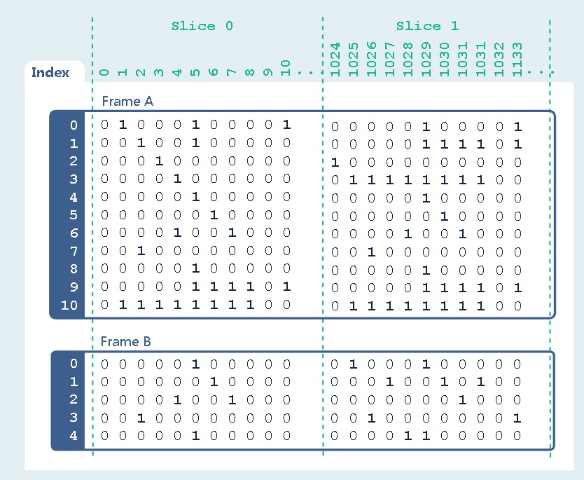
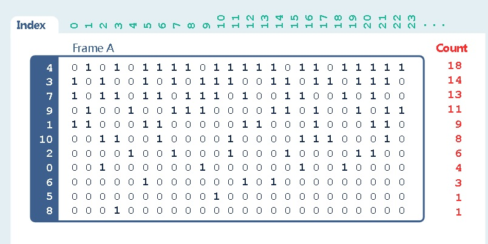
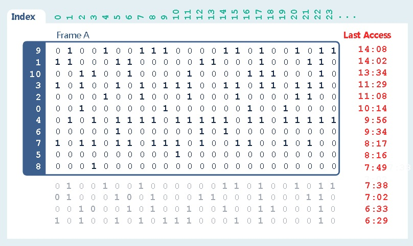
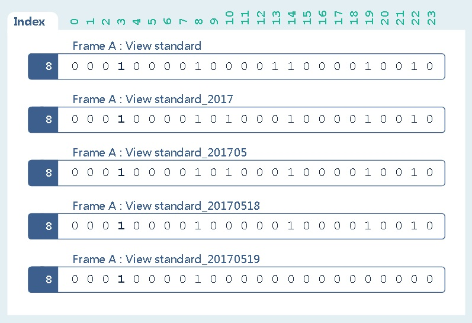
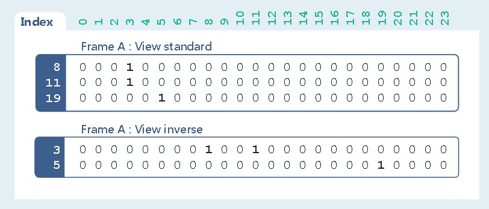

## PostgreSQL (varbit, roaring bitmap) VS pilosa(bitmap库)   
      
### 作者      
digoal      
      
### 日期      
2017-06-12      
      
### 标签      
PostgreSQL , varbit , varbitx , roaring bitmap , pilosa , bitmap , 12306 , 实时画像 , 门禁广告售票系统       
      
----      
      
## 背景    
Pilosa is an open source, distributed bitmap index that dramatically accelerates queries across multiple, massive data sets.  
  
Pilosa abstracts the index from data storage and optimizes it for massive scale.  
  
## pilosa 是什么  
https://www.pilosa.com/about/  
  
pilosa 是一群开发人员为了解决一些科学计算相关的场景而设计的一个in memory bitmap数据管理软件，可以加速一些特定的查询。例如（哪个属性是热门属性，某个属性包含了哪些对象，哪些属性通常会集体出现。）。  
  
pilosa通常用在数据分析和统计领域，例如前面提到的根据属性组合求结果集，与阿里云RDS PostgreSQL varbitx提供的功能非常类似。  
  
阿里云RDS PostgreSQL varbitx已用于多个业务场景：  
  
[《阿里云RDS for PostgreSQL varbitx插件与实时画像应用场景介绍》](../201705/20170502_01.md)    
  
[《基于阿里云 RDS PostgreSQL 打造实时用户画像推荐系统》](../201610/20161021_01.md)    
  
[《阿里云RDS for PostgreSQL varbitx插件门禁广告销售系统需求剖析和实践》](../201611/20161124_01.md)    
  
## pilosa 数据结构  
https://www.pilosa.com/docs/data-model/  
  
pilosa的结构为行列布尔逻辑值BIT矩阵，行和列的含义存储在BoltDB的数据结构中。  
  
  
  
例如一张这样的表  
  
create table tbl (c1 int, c2 text, c3 numeric, c4 timestamp);  
insert into tbl values (1,'abc',4.0, now());  
insert into tbl values (1,'ab12c',1.0, now());  
  
转换为pilosa的结构，首先要对VALUE进行属性化转换，转换过程就是建立k-v的过程。属性即K-V。  
  
例如，以上数据可以转换为以下属性。  
  
```  
c1:1  
  
c2:abc  
  
c2:ab12c  
  
c3:1.0-4.0  
  
c4:'2017-01-01 00:00:00'-now()  
```  
  
属性建立后，转换为pilosa存储结构  
  
```  
1 (c1:1) -> 11  
2 (c2:abc) -> 10  
3 (c2:ab12c) -> 01  
4 (c3:1.0-4.0) -> 11  
5 (c4:'2017-01-01 00:00:00'-now()) -> 11  
```  
  
为了便于使用，pilosa还将数据结构进行了拆分。  
  
1、索引(index)，索引是指在对原始数据进行属性化转换后，得到的bitmap数据。  
  
可以对原始数据建立多个不同的属性转化，例如c1:1, c2:abc,ab12c, c3:1, c3:4, ...是一种，前面的例子又是另一种。不同的转换规则，建立不同的索引。  
  
不能跨索引查询，只能在一个索引内查询。（因为跨索引的BITMAP可能没法对上号）  
  
2、帧(frame)  
  
为了便于查询，可以将一个索引，根据查询目标的不同，划分为多个帧。  
  
例如ranked帧，按bitcount从大到小排列，便于查询基于行的属性TOPN。  
  
  
  
例如LRU帧，将最近访问的行排在前面，便于查询活跃的行。  
  
  
  
3、时间窗口(Time Quantum)  
  
可以设置index的时间窗口，设置时间窗口后，会根据数据的时间自动创建对应的时间视图和对应的BITMAP VALUE。(if the time quantum is set to YMD, Range queries down to the granularity of a day are supported.)  
  
  
  
4、属性(Attribute)，前面讲了，属性就是K-V，是为了得到bitmap，提前对原始数据所做的转换。  
  
5、分片(slice)，为了提高计算速度，将单行切分为多个分片，例如一行有1024个BIT，切成两个分片，分别对应512个BIT。  
  
在计算时，每个分片是并行独立计算，最后合并结果的。  
  
6、视图(View)，视图是pilosa内部，自动维护的一个对外可见的逻辑视野，默认会创建一个与数据写入一致的标准视图。（行，列与数据写入时一致）  
  
6\.1、反转(inverse)视图bitmap，例如  
  
```  
SetBit(frame="A", rowID=8, columnID=3)  
SetBit(frame="A", rowID=11, columnID=3)  
SetBit(frame="A", rowID=19, columnID=5)  
```  
  
反转视图和标准视图如下  
  
  
  
6\.2、时间窗口视图(Time Quantums)  
  
当用户设置了索引的时间窗口属性时，会自动生成对应的时间窗口视图  
  
```  
SetBit(frame="A", rowID=8, columnID=3, timestamp="2017-05-18T00:00")  
SetBit(frame="A", rowID=8, columnID=3, timestamp="2017-05-19T00:00")  
```  
  
  
  
以上是pilosa的数据模型，有利于统计类的查询。  
  
## pilosa 用户案例  
https://www.pilosa.com/use-cases/  
  
化学相似性分析  
  
交通数据分析  
  
网络流量分析  
  
## pilosa与传统数据库的关系  
https://www.pilosa.com/docs/faq/  
  
pilosa是一个用于加速统计类查询的in memory索引数据结构，允许用户自定义属性，建立bitmap，时间窗口视图等。同时内置了帧、切片等特性，加速查询。  
  
pilosa不是数据库，也不能代替数据库，把它当成分析类SQL的加速引擎是可以的。  
  
用户可以异步的方式，将数据导入pilosa，加速查询。  
  
pilosa支持GO,python,java客户端驱动，或者调用pilosa API。  
  
## PostgreSQL 比特流类型  
PostgreSQL 支持varbit类型，同时包含了一些bit的操作符，例如位移、与、或、异或、获取位置BIT等。  
  
### 阿里云RDS PostgreSQL varbitx  
阿里云rds PostgreSQL varbitx是varbit类型的扩展包，支持更多的BIT操作，例如SET BIT，批量SET，按数组提供的位置SET，求BIT COUNT，求指定位置范围的BIT COUNT，求特定数组提供的位置的BIT COUNT等。  
  
详细介绍如下  
  
[《阿里云RDS for PostgreSQL varbitx插件与实时画像应用场景介绍》](../201705/20170502_01.md)    
  
## PG varbit 应用  
例如实时数据分析（与pilosa类似），基于varbit的人物画像，按标签圈人。门禁广告销售系统等。  
  
## 小结  
pilosa是一套golang编写的bitmap库，通过PostgreSQL plgo应该可以将其嫁接到PostgreSQL中，作为一个插件库来使用。  
  
https://github.com/microo8/plgo  
  
https://github.com/dbudworth/gopgfuncs  
  
## 参考  
  
https://github.com/zeromax007/gpdb-roaringbitmap  
  
[《阿里云RDS for PostgreSQL varbitx插件与实时画像应用场景介绍》](../201705/20170502_01.md)    
  
[《PostgreSQL bitmapAnd, bitmapOr, bitmap index scan, bitmap heap scan》](../201702/20170221_02.md)    
  
[《基于 阿里云 RDS PostgreSQL 打造实时用户画像推荐系统》](../201610/20161021_01.md)    
  
[《PostgreSQL 与 12306 抢火车票的思考》](../201611/20161124_02.md)    
  
[《门禁广告销售系统需求剖析 与 PostgreSQL数据库实现》](../201611/20161124_01.md)    
  
https://www.pilosa.com/  
  
[《PostgreSQL 9.6 sharding based on FDW & pg_pathman》](../201610/20161027_01.md)    
  
  
  
<a rel="nofollow" href="http://info.flagcounter.com/h9V1"  ></a>  
  
  
  
  
  
  
## [digoal's 大量PostgreSQL文章入口](https://github.com/digoal/blog/blob/master/README.md "22709685feb7cab07d30f30387f0a9ae")
  
