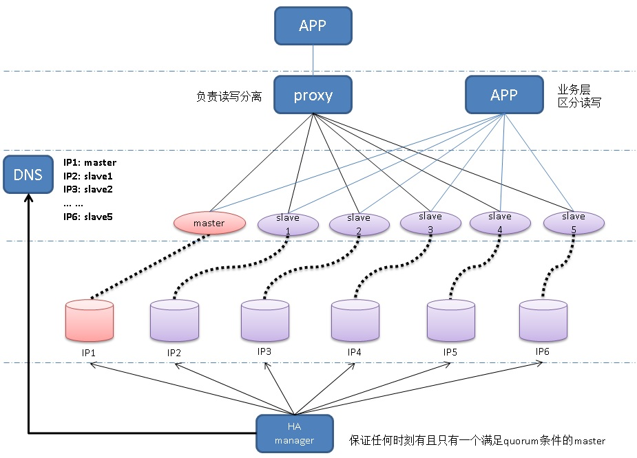
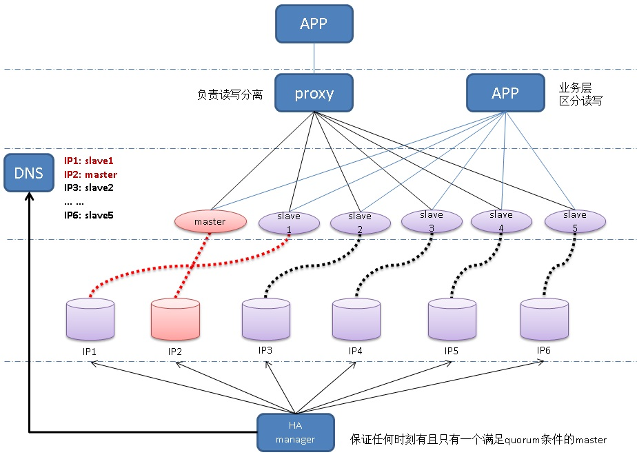
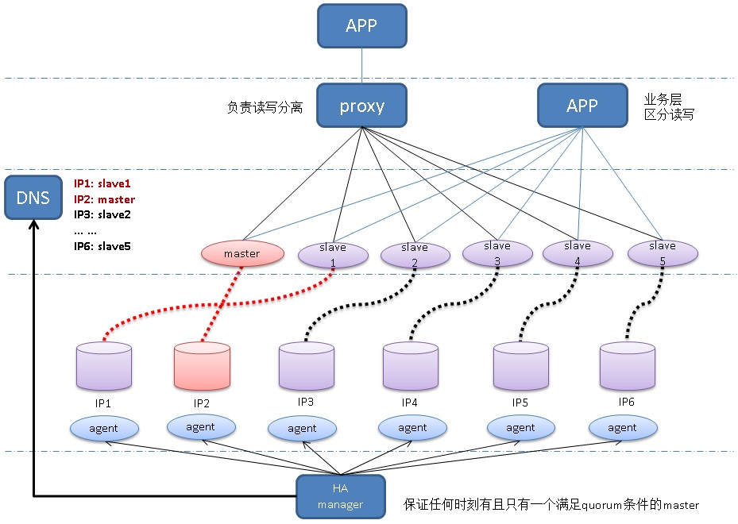

## PG多节点(quorum based), 0丢失 HA(failover,switchover)方案     
                                                      
### 作者                  
digoal                  
                   
### 日期                  
2017-06-12                  
                         
### 标签                  
PostgreSQL , 同步复制 , quorum based      
                  
----                  
                     
## 背景          
PostgreSQL 10加入了quorum based的同步复制功能，用户可以配置若干standby节点，并配置需要将WAL发送多少份才返回给客户端事务结束的消息。    
    
```    
ANY num_sync ( standby_name [, ...] )    
```    
    
原理详见    
    
https://www.postgresql.org/docs/10/static/runtime-config-replication.html#runtime-config-replication-master    
    
https://www.postgresql.org/docs/10/static/warm-standby.html#synchronous-replication    
    
例子    
    
```    
s1,s2,s3为standby recovery.conf配置的application_name, 即standby的唯一标示    
    
下面配置表示WAL需要复制到s1,s2,s3中的任意2个副本。    
    
synchronous_standby_names = 'ANY 2 (s1, s2, s3)'    
    
下面配置表示WAL需要复制到任意standby的任意2个副本。    
synchronous_standby_names = 'ANY 2 (*)'    
```    
    
PostgreSQL的quorum base配置比较灵活，用户可以根据地域、延迟、保护级别等需求来配置synchronous_standby_names。    
    
例如    
    
master有4个standby分别是s1,s2,s3,s4，s1在同机房, s2,s3在某个同城45公里以内的机房, s4在其他城市。    
    
那么可以这么配置    
    
```    
下面配置表示WAL至少在一个其他机房有一份拷贝，防止整个机房的故障。    
    
synchronous_standby_names = 'ANY 2 (s1,s2,s4)'    
```    
    
未来甚至有更灵活的配置(畅想)      
    
```    
下面配置表示s2,s3只算一次，但是它们任意一个feedback都算数。不失可靠性的情况下，提高可用性。    
    
synchronous_standby_names = 'ANY 2 (s1,[s2,s3],s4)'    
```    
      
但是问题来了，当master出现故障时，如何failover，如何switchover呢？    
    
## 架构    
    
    
1、每个数据库实例对应一个静态IP，PostgreSQL master - slave搭建好时就固定下来。    
    
2、每个数据库实例对应一个角色，master或slave。    
    
3、每个角色对应一个域名，当实例为master角色时，对应的域名为master，当角色为slave时，对应slave的域名。    
    
4、集群初次创建好之后，将IP和域名的对应关系写入DNS。    
    
5、HA管理软件，使用master域名从DNS得到静态IP，连接到静态IP，并探测master是否正常。发生异常时，进入failover流程。(后面讲failover流程)    
    
6、最终应用、PROXY，通过域名连接数据库。    
    
例如，这是tom lane所在的crunchydata公司开源的一个PostgreSQL proxy，用golang写的，不做SQL解析，仅仅通过SQL HINT做简单的路由，够用。效率比较高。    
    
https://github.com/CrunchyData/crunchy-proxy    
    
如果使用客户端连接多实例的话，可以参考如下文章    
    
[《PostgreSQL 10.0 preview 功能增强 - libpq支持多主机连接(failover,LB)让数据库HA和应用配合更紧密》](../201704/20170420_01.md)      
    
7、failover结束后，master角色更替，ha管理软件通知DNS修改解析信息。    
    
    
    
8、即使应用程序、PROXY因为DNS缓存，有可能在DNS TTL失效前，短暂的连接到错误的MASTER，也没有关系，因为master配置了quorum based sync replication，所以failover结束后，（即使old master突然好了）写请求下去是不会响应的。    
    
读请求则可能受到影响，可能读到old master的data。(短暂影响)    
    
## 配置    
    
1、初始配置    
    
初始配置，将master, slave配置好，以前面的图为例，master配置复制到3个副本。    
    
slave配置，连接master域名，application_name配置为master ID+slave ID。    
    
例子(关键配置)    
    
DNS    
    
```    
N1 : 192.168.1.100 : master    
N2 : 192.168.1.101 : slave1    
N3 : 192.168.1.102 : slave2    
N4 : 192.168.1.103 : slave3    
N5 : 192.168.1.104 : slave4    
N6 : 192.168.1.105 : slave5    
```    
    
master(N1) postgresql.conf    
    
```    
synchronous_standby_names = 'ANY 3 (N1_N2, N1_N3, N1_N4, N1_N5, N1_N6)'    
```    
    
slave recovery.conf    
    
```    
N2:    
primary_conninfo = 'host=master port=xx user=xx password=xx application_name=N1_N2'    
N3:    
primary_conninfo = 'host=master port=xx user=xx password=xx application_name=N1_N3'    
N4:    
primary_conninfo = 'host=master port=xx user=xx password=xx application_name=N1_N4'    
N5:    
primary_conninfo = 'host=master port=xx user=xx password=xx application_name=N1_N5'    
N6:    
primary_conninfo = 'host=master port=xx user=xx password=xx application_name=N1_N6'    
```    
    
2、DNS配置    
    
TTL设置(尽量缩短客户端的dns cache时间, 例如10秒)，域名映射配置。    
    
```    
192.168.1.100 : master    
192.168.1.101 : slave1    
192.168.1.102 : slave2    
192.168.1.103 : slave3    
192.168.1.104 : slave4    
192.168.1.105 : slave5    
```    
    
3、ha管理软件配置    
    
可以使用一个单独的数据库来存储，或者使用文件配置。    
    
3\.1 IP，数据库监听端口和ID的关系（端口必须固定、相等）    
    
```    
N1 : 192.168.1.100 , 1921    
N2 : 192.168.1.101 , 1921    
N3 : 192.168.1.102 , 1921    
N4 : 192.168.1.103 , 1921    
N5 : 192.168.1.104 , 1921    
N6 : 192.168.1.105 , 1921    
```    
    
3\.2 角色与域名的关系    
    
```    
master : master    
slave : slave1    
slave : slave2    
slave : slave3    
slave : slave4    
slave : slave5    
```    
    
3\.3 数据库用户密码    
    
```    
user : xx    
    
pwd : xx    
```    
    
3\.4 重试间隔，重试次数。    
    
3\.5 quorum数 = 3 # (取自master postgresql.conf的配置synchronous_standby_names = 'ANY 3 (N1_N2, N1_N3, N1_N4, N1_N5, N1_N6)')。    
    
3\.6 总节点数(包括master) = 6      
    
## failover流程    
1、请求解析，从master角色的域名"master"，得到IP。    
    
2、探测IP，数据库监听端口连通性。（异常时，注意重试次数、超时）    
    
异常时，重试若干次(设置好重试间隔、重试次数)，重试若干次均不可用，则进入failover流程。一旦重启期间可用，则退出failover。    
    
3、探测数据库是否可以正常登录。（异常时，注意重试次数、超时）    
    
异常时，重试若干次(设置好重试间隔、重试次数)，重试若干次均不可用，则进入failover流程。一旦重启期间可用，则退出failover。    
    
4、登录数据库，探测数据库可用性，(数据库alive检测，封装成数据库函数，返回true or false表示数据库是否可用）。（异常时，注意重试次数、超时）    
    
返回false，或者返回异常，则数据库不可用。    
    
异常时，重试若干次(设置好重试间隔、重试次数)，重试若干次均不可用，则进入failover流程。一旦重启期间可用，则退出failover。    
    
### 孤立slave    
孤立slave的意思是让slave进入孤立状态，能接收读请求，但是wal receiver进程不工作，也不发feedback给master，和master脱离关系。    
    
孤立必须具备持久性，例如，重启后依旧处于孤立状态。    
    
### 实例操作方法    
failover过程中，会涉及实例的操作，可以通过多种方式实现    
    
1、通过数据库UDF实现数据库实例的文件、脚本等操作。    
    
2、通过在数据库主机部署agent软件实现数据库实例的文件、脚本等操作。    
    
推荐使用agent。    
    
    
    
### failover    
1、使用配置，获取slave角色对应的域名，获取域名对应的IP。后面连接SLAVE的操作，均使用IP。    
    
ip - node name 已有映射关系。      
    
2、孤立若干个slave，若干是如何计算的呢？    
    
公式    
    
```    
若干 = 总节点数(包括master) - quorum数 = 6-3 = 3    
```    
    
3、孤立若干个slave后，如果还有未孤立的slave，则继续孤立。    
    
第2步的slave即使孤立不成功，也继续。(假设N2也异常)    
    
4、从已孤立的SLAVE中，选择一个LSN最大的slave(我们这里假设为N3)，作为new master，修改postgresql.conf。    
    
```    
synchronous_standby_names = 'ANY 3 (N3_N1, N3_N2, N3_N4, N3_N5, N3_N6)'    
```    
    
5、重命名new master的recovery.conf    
    
```    
rename recovery.conf to recovery.done    
```    
    
6、修改其他已孤立的slave - recovery.conf    
    
```    
N4:    
primary_conninfo = 'host=master port=xx user=xx password=xx application_name=N3_N4'    
N5:    
primary_conninfo = 'host=master port=xx user=xx password=xx application_name=N3_N5'    
N6:    
primary_conninfo = 'host=master port=xx user=xx password=xx application_name=N3_N6'    
```    
    
7、通知dns修改域名映射    
    
```    
-- 对调old master和new master    
    
192.168.1.102 : master     
192.168.1.101 : slave1    
192.168.1.102 : slave2    
192.168.1.100 : slave3    
192.168.1.104 : slave4    
192.168.1.105 : slave5    
```    
    
8、重启孤立实例。    
    
9、解除孤立。    
    
10、激活new master。    
    
11、结束failover流程。    
    
#### 注意事项    
任何步骤失败，解除孤立，从头再来。    
    
## 修复异常节点    
### 实例回退修复    
通常不需要修复，因为不可能出现数据丢失的情况，对于用户视角已结束的事务，new master的wal内容和old master一定是一样的。    
    
https://www.postgresql.org/docs/10/static/app-pgrewind.html    
    
但是一些未结束事务(或者用户视角没有收到结束ACK的事务，虽然这些事务可能在OLD MASTER本地已持久化)，可能会在old master，导致old master有更多的WAL(从业务视角来看，并无差异，因为事务ACK没有返回给客户)，所以old master可能需要rewind。参考pg_rewind的方法。    
    
1、配置recovery.conf    
    
old master:    
    
```    
primary_conninfo = 'host=master port=xx user=xx password=xx application_name=N3_N1'    
```    
    
N2(异常slave):    
    
```    
primary_conninfo = 'host=master port=xx user=xx password=xx application_name=N3_N2'    
```    
    
2、配置old master postgresql.conf    
    
```    
注释    
    
# synchronous_standby_names = ..........    
```    
    
重启或启动修复实例    
    
## 如果不使用仲裁节点，而是让数据库自行选举的话可以考虑Raft协议  
     
参考  
  
[《阿里云RDS金融数据库(三节点版) - 背景篇》](../201707/20170709_02.md)    
  
[《阿里云RDS金融数据库(三节点版) - 理论篇》](../201707/20170710_01.md)    
  
### 什么是正确的新主？    
在被锁定（不接收主库的WAL）的超过半数的节点里面，WAL最大的。      
     
锁定的目的是防止选举过程中的波动，确保被选出的WAL一定是最大的。  
  
锁定多数节点的目的是保证客户端视角的0事务丢失（因为对于主库来说，必须要等待WAL已拷贝到多数副本才返回客户端事务提交成功的ACK，客户端未收到ACK前，客户端视角的事务状态为UNKNOWN）。  
     
### 如何选出新主？  
  
1、一个备库(Follower)在随机超时（150~300ms）内没有收到其他任何节点的投票或心跳包，然后转换为候选人(Candidate)，然后将自己进入WAL稳定态（即不接收任何来源的WAL），然后current TermID ++，然后投票给自己，向所有人发出选举请求（并携带WAL的最大位置信息，log Term ID, current Term ID），然后重置随机超时时间。    
     
2、其他的备库，在收到选举投票的请求后，将自己进入WAL稳定态（即不接收任何来源的WAL），然后判断如果“(请求者log Term ID > 自己的log Term ID) 或 (请求者current TermID > 自己的current TermID 并且 请求者WAL >= 自己的WAL 并且 请求者log Term ID = 自己的log Term ID)”投给他(否则不投)。投票后将自己的current Term ID设置为请求者的current Term ID。投票后重置自己的选举超时时间。（不投则继续等待之前的随机超时）  
     
3、当获得了多数人的投票（包括你自己）时，你就转换为新主，将log Term ID改为current Term ID，将log leader修改为自己的ID。重置随机超时时间，发送消息宣告消息包（内容current Term ID）给所有角色通知他们持久化log Term ID，超时则重新选举。    
  
如果在4的所有节点完成调整之前，当选者挂了，不会影响继续选举。  
     
4、收到宣告心跳包之前，Follower还可以给其他人投票，只要2的满足条件。    
  
收到宣告(心跳)的节点，判断（收到的心跳包中的current Term ID == 自己的current Term ID）是否成立，如果成立，则将log Term ID修改为新主宣告的current Term ID，将log leader修改为新主ID，然后联系新主，执行pg_rewind，配置recovery.conf，作为新主的备库角色启动数据库。     
      
注意这里的pg_rewind必须是原子操作，要么就变成和NEW LEADER一样，要么就是原样，不能有中间状态。     
      
这样才能满足Raft协议不丢数据的需求。  
      
5、新主每隔heart timeout后，发送统治心跳。    
      
6、Follower收到统治心跳后，重置随机选举超时时间。    
     
7、以上循环往复。     
     
说明：  
  
1、current Term ID，每次发起选举都会自增。  
  
2、log Term ID，日志中持久化的TermID，用于选主的判定。  
  
3、log leader，日志中持久化的主ID。  
  
4、成员ID，每个成员都有一个唯一ID，每个成员ID对应了各自的属性（角色，IP，端口，用户名等连接串信息）。  
  
5、pg_rewind，PostgreSQL的块级回溯命令，依据主进行回溯，可以达到一致状态。  
  
6、heart timeout，选主成功后，维持统治的心跳用的。  
  
7、随机选举超时时间，150~300毫秒。这个时间段内没有收到心跳或者选举请求，就开始选举。否则在心跳或投票后重置这个时间。  
  
### 复活节点如何跟随统治  
复活的节点，也是根据以上规则来跟随新的主库。  
  
### 为什么不需要担心多写(多Leader)  
因为一个Follower只有一个主，在发生网络脑裂，出现多LEADER，出现多写时，一定只有一个Leader能获得多数WAL副本，正常的提供写服务。另一个LEADER即使用户提交事务，也不能成功，会HANG住，不会有ACK返回给客户端。  
  
根据选主的规则，恢复后，老的LEADER在没有跟上NEW LEADER之前，也不可能当选成为NEW LEADER。  
  
### UNKNOWN 事务的处理  
unknown事务，就是客户端没有收到commit ACK的事务。不知道是成功还是失败。  
  
多节点与单节点都可能出现UNKNOWN事务，效果、形态一致。  
  
如何处理unknown事务呢？  
  
unknown事务分为以下几种情况.  
  
rollback, commit , rollback ps, commit ps 几种情况的unknown处理方法：  
  
1、两阶段解决unknown状态问题  
  
prepare 阶段unknown, 切换leader后，客户端检查prepare状态，如果没有ps则整个事务重新发起，因为数据库有事务原子性。如果ps存在则直接提交或回滚ps。  
  
commit or rollback ps阶段unknown, 切换后检查ps状态，存在则重试commit or rollback ps.不存在则说明已经提交成功。无须处理。  
  
2、非两阶段事务，rollback unknown无须处理，因为不管怎样都会回滚掉。要么完全没发生，要么成功rollback，要么数据库处理事务的异常rollback.这是数据库原子性保障的。  
  
3、非两阶段事务的unknown commit处理，极度严谨的场景，可以设计事务状态可回溯，例如记录事务号或唯一流水号，事务号在数据库中是一个唯一的流水，可以根据事务号查询它的状态，比如postgresql.但是并不是所有数据库都有这种接口，比如非物理流式复制的数据库，则可以在事务中增加全局唯一流水号来查看事务是否提交。这里利用了事务的原子特性，既要么全成功要么全失败。可以举个使用例子。  
  
### 为什么需要pg_rewind  
虽然我们选出的是多数派中WAL最大的节点作为NEW LEADER，但是由于WAL是先产生和复制，后返回给客户端ACK的，因此死掉或被隔离的节点，WAL可能比NEW LEADER还多（只是这些事务没有返回客户端ACK而已，产生依旧还是会产生的，可以认为是无用功，或者认为是UNKNOWN 事务）。  
  
因此需要通过pg_rewind，修正块级一致跟随NEW主库。  
     
## 小结    
1、建议使用虚拟IP，否则管理软件还需要维护一套IP变更的方法。    
    
2、当节点数不为6，或者quorum数不等于3时，都可以支持，使用前面提到的孤立公式即可。    
  
3、主库增加冻结功能（当与超过 sync standbys - ANY N + 1 个 sync standbys 断开连接，连续时间超过N秒时，冻结主库的写操作，变为只读节点）。   
  
4、proxy只读请求的负载均衡策略，识别VIP当前所在主机，以主机为单位进行负载均衡，而不是VIP。  这样不会导致当多个VIP跑在同一个HOST上时（例如有的HOST挂了，会导致多个VIP可能跑在一个HOST上），出现负载不均衡的情况。  
    
## 参考    
https://www.postgresql.org/docs/10/static/runtime-config-replication.html#runtime-config-replication-master    
    
https://www.postgresql.org/docs/10/static/app-pgrewind.html    
    
http://dalibo.github.io/PAF/administration.html    
    
https://github.com/digoal/PostgreSQL_HA_with_primary_standby_2vip    
     
  
<a rel="nofollow" href="http://info.flagcounter.com/h9V1"  ></a>  
  
  
  
  
  
  
## [digoal's 大量PostgreSQL文章入口](https://github.com/digoal/blog/blob/master/README.md "22709685feb7cab07d30f30387f0a9ae")
  
