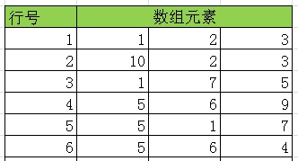
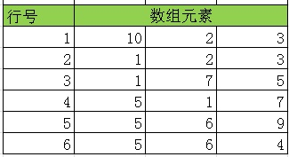

## 索引扫描优化之 - GIN数据重组优化(按元素聚合) 想象在玩多阶魔方
        
### 作者        
digoal        
        
### 日期        
2017-06-12        
        
### 标签        
PostgreSQL , 元素分布 , 减少HEAP IO , 数据聚集重组             
        
----        
        
## 背景   
前一篇文章介绍了一个场景，利用多列索引，多种索引接口（GIN\BTREE\BRIN...）以及PostgreSQL内置的bitmapAnd, bitmapOr等手段，提升广告营销实时搜索性能，同时兼顾开发工作量。  
  
[《懒人推动社会进步 - 多列聚合, gin与数据分布(选择性)》](../201706/20170612_04.md)    
  
其中在讲到GIN索引的优化时，留了一个悬念，到底如何通过调整数据分布，降低GIN索引扫描的IO放大，提高扫描效率？  
  
```
3、gin数据分布优化  
  
如果是普通类型，则线性相关越好，扫描或返回多条数据的效率越高。  
  
如果是多值类型（如数组、全文检索、TOKENs），则元素越集中（元素聚类分析，横坐标为行号，纵坐标为元素值，数据分布越集中），效率越高。  
  
元素集中通常不好实现，但是我们可以有集中方法来聚集数据，  
  
1. 根据元素的出现频率进行排序重组，当用户搜索高频词时，扫描的块更少，减少IO放大。   
  
2. 根据（被搜索元素的次数*命中条数）的值进行排序，按排在最前的元素进行聚集，逐级聚集。      
  
(以上方法可能比较烧脑，下次发一篇文档专门讲GIN的数据重组优化)   
```
  
聚集有什么用呢？如何聚集呢？   
  
## 数据分布例子  
例子  
   
假设有6条记录，每条记录存储了一些VALUE（数组），6条记录方便演示。  
  
    
  
图形化如下  
  
  
  
当搜索包含2的数据时，需要扫描第1,2条记录。  
  
当搜索包含1的数据时，需要扫描第1,3,5条记录。（1,3,5离散分布，即现实中包含1的数据，很可能在不同数据块中，那么需要扫描更多的数据块）。  
  
接下来做一个简单的存储调整，将数据进行重排。  
  
    
  
图形化如下  
  
  
  
很显然，现在没有离散的数据了，对同一个元素来说，更加的紧密相连，例如搜索包含1的数据时，他们是相邻的记录（现实中极有可能在同一个数据块中）。  
  
说到数据重分布，就涉及到聚集的问题了，如何让同一个元素，尽量的靠在一起呢？  
  
你需要了解一些数据科学计算的知识，可以参考一下:  
  
[《数据库任督二脉 - 数据与计算的生态融合》](../201705/20170526_01.md)    
  
真实情况下，几乎不可能做到每一个元素的行都是紧密相邻的，就像玩“不可复原的（有BUG的）”多阶魔方。你怎么转，都不可能做到面面俱到。   
  
  
   
我们只能通过科学计算，尽可能的找到最终态较好的数据分布状态。     
   
[《K-Means 数据聚集算法》](../201508/20150817_01.md)  
  
<a rel="nofollow" href="http://info.flagcounter.com/h9V1"  ></a>  
  
  
  
  
  
  
## [digoal's 大量PostgreSQL文章入口](https://github.com/digoal/blog/blob/master/README.md "22709685feb7cab07d30f30387f0a9ae")
  
