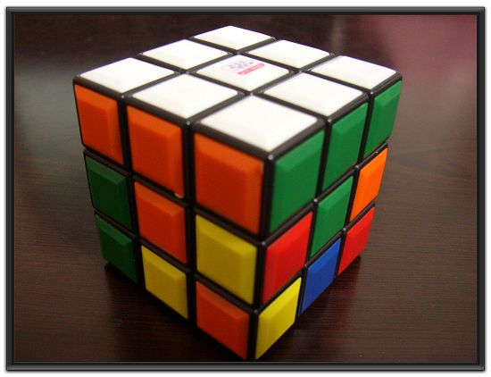

## 从一维编排到多维编排，从平面存储到3D存储 - 数据存储优化之路  
      
### 作者      
digoal      
      
### 日期      
2017-06-14      
      
### 标签      
PostgreSQL , cluster , 预排 , 一维数据 , 多维数据 , 视觉编排 , 数据编排 , IO优化    
      
----      
      
## 背景      
中华文化源远流长，比如这句古语“远水不救近火，远亲不如近邻”，在数据库的优化中亦有体现。接下来我们来揭示这个道理。  
  
大多数数据库的存储为块存储，一个块里面可能涉及到多条记录，当用户输入查询条件进行数据检索时，即使返回的结果集较小，也可能需要扫描多个数据块，因为你不知道你要的记录落在哪些数据块里面。  
  
例子  
  
随机写入一批数据  
  
```  
create table tbl(id int, info text default repeat(random()::text,10), crt_time timestamp default now());  
insert into tbl (id) select random()*10000 from generate_series(1,1000000);  
```  
  
查询ID<100的记录，这些记录落在哪些数据块里面？  
  
```  
postgres=# select ctid from tbl where id<100;  
    ctid      
------------  
 (4,10)  
 (6,32)  
 (7,33)  
 (17,14)  
 (22,15)  
 (22,16)  
 (25,2)  
 (29,21)  
 (41,13)  
 (42,27)  
 (43,27)  
 (54,11)  
 (54,33)  
 (56,1)  
 (60,13)  
。。。。。。  
```  
  
可以看到，数据散落在不同的数据块里面。也就是说访问了很多数据块。  
  
很多用户遇到了类似的问题，我做了一些总结和优化之道，请参考下面的文章。  
  
[《索引顺序扫描引发的堆扫描IO放大背后的统计学原理与解决办法》](../201404/20140426_01.md)    
  
[《懒人推动社会进步 - 多列聚合, gin与数据分布(选择性)》](../201706/20170612_04.md)    
  
[《索引扫描优化之 - GIN数据重组优化(按元素聚合) 想象在玩多阶魔方》](../201706/20170612_05.md)    
  
以上文章提到了优化的方法：数据重新编排存储。让数据尽量的根据搜索条件进行聚集，减少扫描成本。  
  
## 数据存储优化 - 编排  
数据存储编排的目的很简单，让数据尽量的根据搜索条件进行聚集，减少扫描成本。  
  
但是数据种类不一样，编排优化也不太一样。前面提到的例子针对的都是一维的数据，一维数据的操作很简单，=, >, <, >=, <=, in等。  
  
如果数据类型不是一维类型，而是多值类型或者异构类型呢？例如数组、空间类型、全文检索类型等。数据的编排还有这么简单吗？  
  
### 一维数据编排  
一维类型的编排，按搜索列排序是最简单有效的编排方法。业界也叫预排序，PostgreSQL术语叫cluster，通过cluster命令即可完成编排。  
  
https://www.postgresql.org/docs/9.6/static/sql-cluster.html  
  
### 多维数据编排  
一位编排比较简单，但是多维编排会更加复杂。我通过一个游戏来说明编排的目的。  
  
我们来玩一个游戏，假设全球有10000个国家，每个国家挑选若干人（每个国家挑选的人数可以不一样，例如A国家挑选了1000人，B国家挑选了10人，假设总共挑选了100万人）进行混合分组，每个分组包含了若干不同国家的人（每个分组每个国家仅限1人）。下面进行排队，横坐标为分组ID，纵坐标为国家ID。接下来要进行搬运游戏，从左导游，每个国家的人，需要将它手里的球搬运给右边的相同国家的人，如果他们相邻，则不计成本。如果他们之间隔了其他分组，则计算成本（相隔的分组个数）。最终计算每个国家的搬运成本，某些国家的搬运成本，或者所有国家相加的总搬运成本。   
  
如何降低总成本，如何降低某些国家的成本，如何降低某个国家的成本？  
  
例如第一种排列方式，1号国家的搬运成本为2， 6号，7号国家的搬运成本为1，其他国家的搬运成本为0。  
  
  
  
第二种排列方式如下，所有国家的搬运成本都为0。  
  
  
  
这就是数组类型编排要取得的目的，由于数组类型通常是按数组的元素进行检索的，因此我们需要根据元素来进行编排。数组类型的编排方式同样适用于全文检索类型，TOKEN类型。  
  
其他类型的编排则根据数据类型来定，例如空间类型，可以根据GEOHASH的值进行排序编排。  
  
下面我们讲一下数组类型编排的实现过程。  
  
### 生成测试数据  
生成随机数组的方法  
  
```  
postgres=# create or replace function gen_array(range int, cnt int) returns int[] as $$  
select array(select (random()*range)::int from generate_series(1,cnt) group by 1);  
$$ language sql strict volatile;  
CREATE FUNCTION  
  
postgres=# select gen_array(10,5);  
 gen_array   
-----------  
 {9,1,5,8}  
(1 row)  
  
postgres=# select gen_array(10, 20);  
       gen_array          
------------------------  
 {9,3,1,4,5,2,7,6,8,10}  
(1 row)  
  
postgres=# select gen_array(100,10) from generate_series(1,100);  
            gen_array               
----------------------------------  
 {9,16,51,72,31,27,20,63,41,65}  
 {88,1,59,39,87,28,24,32,21}  
 {69,78,34,11,84,79,97,80,85,56}  
 {3,90,42,81,83,41,76,99,65,25}  
 {14,4,42,50,37,13,72,75,29,74}  
 {23,92,53,74,77,71,93,82}  
 {1,16,81,51,79,76,62,94,77}  
 {48,64,18,35,43,36,54,41,29,98}  
 {100,84,28,99,80,8,85,77,10,33}  
 {96,31,39,7,87,53,36,54,30,77}  
 {70,49,90,91,13,40,31,54,97,94}  
 {58,55,35,75,29,6,65,56,98}  
......  
```  
  
建立测试表，写入随机数组  
  
```  
postgres=# create table tbl2(id int, arr int[]);  
CREATE TABLE  
  
postgres=# insert into tbl2 select id, gen_array(10,10) from generate_series(1,10) t(id);  
INSERT 0 10  
  
postgres=# select * from tbl2 limit 10;  
 id |         arr           
----+---------------------  
  1 | {1,5,2,6,8}  
  2 | {1,4,5,2,7,6,8,0}  
  3 | {9,1,5,2,7,6,8}  
  4 | {3,1,4,5,2,7,6}  
  5 | {9,1,5,2,7,8,10}  
  6 | {9,3,1,2,7,6,8}  
  7 | {9,3,1,5,2,7,8}  
  8 | {3,1,4,5,2,6,10}  
  9 | {9,3,1,4,5,2,7,6,8}  
 10 | {3,1,5,7,6,10,0}  
(10 rows)  
```  
  
10条记录，有多少种排列组合的可能呢？  
  
PostgreSQL有排列组合函数可以支持，如下。  
  
```  
postgres=# \df *.*fac*  
                             List of functions  
   Schema   |    Name     | Result data type | Argument data types |  Type    
------------+-------------+------------------+---------------------+--------  
 pg_catalog | factorial   | numeric          | bigint              | normal  
 pg_catalog | numeric_fac | numeric          | bigint              | normal  
(2 rows)  
  
postgres=# select factorial(10);  
 factorial   
-----------  
   3628800  
(1 row)  
  
postgres=# select numeric_fac(10);  
 numeric_fac   
-------------  
     3628800  
(1 row)  
  
postgres=# select 10*9*8*7*6*5*4*3*2;  
 ?column?   
----------  
  3628800  
(1 row)  
  
postgres=# select 10!;  
 ?column?   
----------  
  3628800  
(1 row)  
  
postgres=# \do+ !  
                                      List of operators  
   Schema   | Name | Left arg type | Right arg type | Result type |  Function   | Description   
------------+------+---------------+----------------+-------------+-------------+-------------  
 pg_catalog | !    | bigint        |                | numeric     | numeric_fac | factorial  
(1 row)  
```  
  
### 排列组合  
排列组合，指行的排列顺序。下面两篇文档中也涉及排列组合的例子。  
  
[《PostgreSQL n阶乘计算, 排列组合计算 - 如何计算可变参数中有没有重复参数》](../201604/20160402_01.md)    
  
[《为什么啤酒和纸尿裤最搭 - 用HybridDB/PostgreSQL查询商品营销最佳组合》](../201704/20170410_02.md)    
  
  
  
通过行号的顺序，得到排列组合，验证通过。  
  
```  
postgres=#  WITH RECURSIVE cte AS (  
     SELECT array[ctid] AS combo, ctid, 1 AS ct   
     FROM tbl2  
   UNION ALL   
     SELECT array_append(cte.combo, t.ctid), t.ctid, ct + 1   
     FROM cte, tbl2 t  
     WHERE ct <= 10  -- 10是 tbl2的count(*)，即自关联10次，得到所有排列组合  
       AND array_position(cte.combo, t.ctid) is null  -- 元素去重  
)   
SELECT count(combo) FROM cte where ct=10;  -- 10是 tbl2的count(*)  
  
  count    
---------  
 3628800  
(1 row)  
```  
  
排列组合示例：  
  
```  
postgres=#  WITH RECURSIVE cte AS (    
     SELECT array[ctid] AS combo, ctid, 1 AS ct   
     FROM tbl2  
   UNION ALL   
     SELECT array_append(cte.combo, t.ctid), t.ctid, ct + 1   
     FROM cte, tbl2 t  
     WHERE ct <= (select count(*) from tbl2)   
       AND array_position(cte.combo, t.ctid) is null  
)   
SELECT combo FROM cte where ct=10 limit 10;  
                                       combo                                          
------------------------------------------------------------------------------------  
 {"(0,1)","(0,2)","(0,3)","(0,4)","(0,5)","(0,6)","(0,7)","(0,8)","(0,9)","(0,10)"}  
 {"(0,1)","(0,2)","(0,3)","(0,4)","(0,5)","(0,6)","(0,7)","(0,8)","(0,10)","(0,9)"}  
 {"(0,1)","(0,2)","(0,3)","(0,4)","(0,5)","(0,6)","(0,7)","(0,9)","(0,8)","(0,10)"}  
 {"(0,1)","(0,2)","(0,3)","(0,4)","(0,5)","(0,6)","(0,7)","(0,9)","(0,10)","(0,8)"}  
 {"(0,1)","(0,2)","(0,3)","(0,4)","(0,5)","(0,6)","(0,7)","(0,10)","(0,8)","(0,9)"}  
 {"(0,1)","(0,2)","(0,3)","(0,4)","(0,5)","(0,6)","(0,7)","(0,10)","(0,9)","(0,8)"}  
 {"(0,1)","(0,2)","(0,3)","(0,4)","(0,5)","(0,6)","(0,8)","(0,7)","(0,9)","(0,10)"}  
 {"(0,1)","(0,2)","(0,3)","(0,4)","(0,5)","(0,6)","(0,8)","(0,7)","(0,10)","(0,9)"}  
 {"(0,1)","(0,2)","(0,3)","(0,4)","(0,5)","(0,6)","(0,8)","(0,9)","(0,7)","(0,10)"}  
 {"(0,1)","(0,2)","(0,3)","(0,4)","(0,5)","(0,6)","(0,8)","(0,9)","(0,10)","(0,7)"}  
(10 rows)  
```  
  
### 统计每一种排列组合，各个元素的检索成本  
  
计算每一种排列组合，对应数组元素的聚合度（越靠近0(越小)，越聚合）  
  
根据前面的聚合度算法，使用如下函数实现。  
  
```  
create or replace function cal_affinity(OUT o_combo tid[], OUT affinity int8) returns setof record as $$  
declare  
  ccc int8;     -- tbl2总共多少条记录  
  v_tid tid[];  -- 行号组合  
  vv_tid tid;   -- 行号  
  i1 int := 1;  -- 正处于第几行  
  i2 int[];     -- 与tbl2.arr同类型的数组，存储所有元素  
  i3 int[];     -- 上一次元素出现在第几行，下标=i2 中元素的位置  
  i4 int[];     -- 每个元素的聚合度累计值  
  v_i4 int;     -- 每个元素单独的聚合度  
  sum_i4 int8;  -- i4的sum  
  x int;        -- 第几个循环  
  v_arr int[];  -- tbl2 数组  
  i_arr int;    -- tbl2 数组元素  
begin  
  select count(*) into ccc from tbl2;  
  select array(select distinct(unnest(arr)) from tbl2) into i2;  
  
-- 排列组合循环  
for v_tid in   
  WITH RECURSIVE cte AS (    
       SELECT array[ctid] AS combo, ctid, 1 AS ct   
       FROM tbl2  
     UNION ALL   
       SELECT array_append(cte.combo, t.ctid), t.ctid, ct + 1   
       FROM cte, tbl2 t  
       WHERE ct <= ccc  
         AND array_position(cte.combo, t.ctid) is null  
  )   
  SELECT combo FROM cte where ct=ccc limit 10   --  只计算10种组合  
  -- 3628800种组合实在太多了，我挑选一些进行计算，验证聚合度结果。  
loop  
    
  -- 按行号循环  
  foreach vv_tid in array v_tid   
  loop  
      
    -- 生成tbl2当前行的数组  
    select arr into v_arr from tbl2 where ctid=vv_tid;  
  
    -- 按tbl2数组元素循环，计算每个元素的聚合度累加  
    foreach i_arr in array v_arr  
    loop  
      -- 获取元素下标 array_position(i2, i_arr)  
      -- i1=1，处于第一行  
  
      -- 计算聚合度，真实场景应该改成数据块是否相邻，而不是行号  
      if i1=1 then  
	-- 第一行  
	i4[array_position(i2, i_arr)] := 0;  
      else  
        -- 不是第一行  
	if i4[array_position(i2, i_arr)] is null then  
          -- 该元素第一次出现  
	  i4[array_position(i2, i_arr)] := 0;  
	else  
	  -- 该元素不是第一次出现  
	  i4[array_position(i2, i_arr)] := i4[array_position(i2, i_arr)] + greatest((i1 - i3[array_position(i2, i_arr)] - 1), 0);  -- 防止单行元素重复计算错误  
	end if;  
      end if;  
        
      -- 元素最后一次出现在第几行  
      i3[array_position(i2, i_arr)] := i1;  
    end loop;  
  
    -- 行号+1  
    i1 := i1 + 1;  
  end loop;  
  
  -- 输出该排列组合的所有元素的聚合度，总聚合度  
  select sum(unnest) into sum_i4 from (select unnest(i4)) t;  
  raise notice 'combo: %, sum(affinity): %', v_tid, sum_i4;  
  x := 1;  
  foreach v_i4 in array i4  
  loop  
    raise notice 'elements: %, affinity: %', i2[x], v_i4;  
    x := x+1;  
  end loop;  
    
  -- 初始化变量  
  i1 := 1;  
  i3 := '{}';  
  i4 := '{}';  
end loop;  
-- 行号循环  
end;  
$$ language plpgsql strict;  
```  
  
调用函数计算聚合度  
  
```  
select * from cal_affinity();  
  
NOTICE:  combo: {"(0,1)","(0,2)","(0,3)","(0,4)","(0,5)","(0,6)","(0,7)","(0,8)","(0,9)","(0,10)"}, sum(affinity): 23  
NOTICE:  elements: 7, affinity: 1  
NOTICE:  elements: 9, affinity: 2  
NOTICE:  elements: 3, affinity: 1  
NOTICE:  elements: 1, affinity: 0  
NOTICE:  elements: 4, affinity: 4  
NOTICE:  elements: 6, affinity: 2  
NOTICE:  elements: 8, affinity: 2  
NOTICE:  elements: 5, affinity: 1  
NOTICE:  elements: 2, affinity: 0  
NOTICE:  elements: 10, affinity: 3  
NOTICE:  elements: 0, affinity: 7  
NOTICE:  combo: {"(0,1)","(0,2)","(0,3)","(0,4)","(0,5)","(0,6)","(0,7)","(0,8)","(0,10)","(0,9)"}, sum(affinity): 25  
NOTICE:  elements: 7, affinity: 1  
NOTICE:  elements: 9, affinity: 3  
NOTICE:  elements: 3, affinity: 1  
NOTICE:  elements: 1, affinity: 0  
NOTICE:  elements: 4, affinity: 5  
NOTICE:  elements: 6, affinity: 2  
NOTICE:  elements: 8, affinity: 3  
NOTICE:  elements: 5, affinity: 1  
NOTICE:  elements: 2, affinity: 1  
NOTICE:  elements: 10, affinity: 2  
NOTICE:  elements: 0, affinity: 6  
  
.....  
  
```  
  
选择sum(affinity)最小的combo，就是最优的排列组合。将数据按这个顺序调整，即可最大的优化性能。  
  
## 存储  
数据编排是存储层面的优化，所以存储本身的属性也决定了应该如何进行数据编排。  
  
### 平面存储  
平面存储，数据按顺序在一个或多个平面上存储，当从数据库中顺序搜索一批数据时，在物理存储层面也可能是相邻的介质。  
  
所以前面提到的编排优化是非常有效的。  
  
### SSD、3D存储  
硬件特性是SSD或者3D存储结构时，当从数据库中顺序搜索一批数据时，在物理存储层面也可能是相邻的介质，也可能不是，这个需要根据硬件厂商的写特性。  
  
前面的编排对硬件的优化效果可能就没那么好。编排算法应该充分考虑硬件的数据访问特性，才能达到最好的优化效果。  
  
但是对内存的优化效果一定是有的。  
  
## GPU - 视觉编排  
从前面的例子来看，数据编排的方法会耗费大量的计算量，10条记录就可能有300多万种排列组合，使用CPU运算，计算每种组合的聚合度并不是最好的选择。  
  
对于此类编排聚合度的计算，视觉处理可能是更好的方法。  
  
  
  
## 小结  
1、数据编排的目的和好处：让数据更加紧凑，降低访问成本，节约内存。  
  
2、编排应该考虑到多个方面：  
  
数据的访问需求，比如是顺序访问，还是随机访问，是访问等值数据，还是访问范文数据，是访问标量，还是访问多值类型、异构类型等。优化是需要针对访问需求的。  
  
数据存储的硬件特性，硬件是如何处理数据存储和搜索的。也决定了应该如何优化。  
  
内存的硬件特性，同上。  
  
软硬件一体化。  
  
3、PostgreSQL不仅支持简单的标量类型，还支持复杂的多值类型，例如array, range, json, hstore, gis, xml等。在数据编排优化层面更加的复杂。   
  
一维类型的编排就好像只需要完成魔方的一面   
  
  
  
多维类型的编排需要完成所有面    
   
  
  
随着多维类型元素的增加，记录数的增加，编排难度也会呈指数上升   
  
  
    
多维数据的编排，运算量非常庞大，使用GPU处理可能是一种更好的方法。  
  
PostgreSQL UDF支持pl/cuda编程，可以很好的与GPU进行结合，提高计算能力。  
  
还有一种方法是K-MEAN编排,更加科学。    
  
[《K-Means 数据聚集算法》](../201508/20150817_01.md)  
  
<a rel="nofollow" href="http://info.flagcounter.com/h9V1"  ></a>  
  
  
  
  
  
  
## [digoal's 大量PostgreSQL文章入口](https://github.com/digoal/blog/blob/master/README.md "22709685feb7cab07d30f30387f0a9ae")
  
