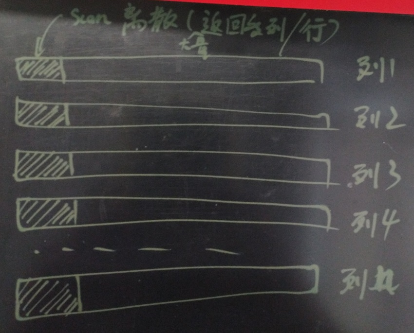
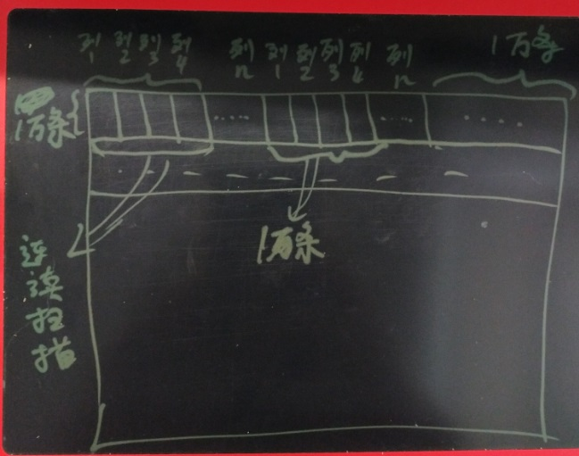

## 列存优化(shard,大小块,归整,块级索引,bitmap scan) - (大量数据实时读写)任意列搜索  
        
### 作者        
digoal        
        
### 日期        
2017-06-14        
        
### 标签        
PostgreSQL , 列存储 , shard , 切片 , 大块 , 小块 , sort , 块级索引 , bitmap scan , 索引延迟 , 归整          
        
----        
        
## 背景   
数据分析系统，决策系统的数据量通常非常庞大，属性（列）非常多，可能涉及到任意列的组合条件查询，筛选结果、聚合结果、多维分析等。  
  
这种场景如何优化能满足实时的响应需求呢？  
  
PostgreSQL中有一些技术，可以满足此类场景。  
  
1\. 内置bitmapAnd bitmapOr，使用任意字段的索引搜索时，可以快速跳过不满足条件的块，快速的得到组合结果。  
  
实测10亿数据，31个字段任意搜索，约几百毫秒的响应时间。  
  
案例如下：  
  
[《多字段，任意组合条件查询(无需建模) - 毫秒级实时圈人 最佳实践》](../201706/20170607_02.md)    
  
还有这种方法，要求每个字段都建立索引，对数据写入会有性能影响（特别是与堆存储线性相关性很差的字段，索引分裂会比较严重，导致IO巨大）。  
  
对于数据量非常庞大的场景，建议对表进行分区，可以建立多级分区。  
  
例如UID为一级HASH分区，时间戳为二级范围分区。这样可以控制每个表的大小，通过时间分区我们可以将历史数据静态化，不影响新录入数据的索引。从而提升整体性能。  
  
2\. PostgreSQL支持多种索引接口，针对不同的数据类型，数据的存储风格。在前面的案例中也有介绍。  
  
因此并不是btree一路用到底，对于不同的类型有不同的搜索需求，比如范围类型，数组类型，全文检索类型，通常会根据包含、相交来进行查询。而对于空间数据，通常会根据相交，距离等进行查询。对于一维类型通常会根据=，或者范围进行查询。  
  
这些数据类型都能找到合适的索引来加速扫描，结合bitmapAnd, bitmapOr，实现实时的任意字段搜索。  
  
3\. bitmap 索引(greenplum)  
  
对于选择性较差的列，例如1亿记录，只有1000个唯一值，这种情况下，使用bitmap index就可以达到非常好的效果。  
  
案例如下  
  
[《Greenplum 最佳实践 - 什么时候选择bitmap索引》](../201705/20170512_01.md)    
  
[《PostgreSQL (varbit, roaring bitmap) VS pilosa(bitmap库)》](../201706/20170612_01.md)    
  
4\. 列存储, cstore(orc)格式  
  
https://orc.apache.org/  
  
https://github.com/citusdata/cstore_fdw  
  
如果单机已经做了很多优化，例如使用分区表，但是由于实时写入的数据量依旧很庞大，数据录入由于索引过多遇到瓶颈了，还有什么优化手段呢？  
  
## 一、海量数据 - 实时任意字段查询，实时写入 矛盾优化  
要做到实时的海量写入，又要实时的查询，确实是一个比较矛盾的问题。  
  
因为要实时写入，就要尽量少的索引，而要实时查询，就要索引的支持。  
  
那么到底怎么解决这个矛盾问题呢？  
  
1、索引延迟合并  
  
在PostgreSQL中有一个GIN索引，这个索引是针对多值类型的索引，例如数组。  
  
当用户在写入一条记录时，（一个数组往往涉及多个元素），索引的条目可能会设置到多个，因此每写一条记录，IO是巨大的，因此GIN有一个加速数据写入、更新、删除的特性，fastupdate。  
  
这个特性也比较好理解，实际上就是延迟合并，比如累计1000条记录后，合并一次到索引的条目中。从而大幅提升写入性能。  
  
那么我们也可以使用类似的技术来优化以上场景，只是需要对所有的索引接口都做类似的fastupdate功能。  
  
2、lambda批量操作  
  
我们可以将数据分为两个部分，一个部分是实时写入部分，另一部分是数据的合并部分。  
  
数据实时的写入部分（不需要索引），实时写入后，再批量对其建立索引。  
  
也就是先写入，到达分区边界后，写入新的分区，而前一个分区则开始建立索引。PG支持对一张表并行的创建多个索引。  
  
例如  
  
```  
每个小时一个分区。  
  
12:00-13:00，数据写入12:00到13:00的分区，在12:00时，可以对11:00-12:00的分区建立索引。  
  
因此实时的数据都是写入没有索引的表，写入吞吐可以做到500万行/s左右。  
  
批量创建索引的速度是非常快的，通常可以跟上节奏。  
```  
  
另外有两个类似的场景，有兴趣的话也可以参考一下，与本例的用法不一样。  
  
[《块级(ctid)扫描在IoT(物联网)极限写和消费读并存场景的应用》](../201706/20170607_01.md)    
  
[《海量数据 "写入、共享、存储、计算" 最佳实践》](../201705/20170509_02.md)    
  
3、分布式  
  
当单机的容量、写入性能、查询性能可能成为瓶颈时，可以创建多个实例。  
  
多个实例有许多方法可以融合起来。  
  
例如  
  
3\.1 postgres_fdw + inherit  
  
https://www.postgresql.org/docs/9.6/static/tutorial-inheritance.html  
  
https://www.postgresql.org/docs/10/static/postgres-fdw.html  
  
[《PostgreSQL 9.6 单元化,sharding (based on postgres_fdw) - 内核层支持前传》](../201610/20161004_01.md)    
  
[《PostgreSQL 9.6 sharding + 单元化 (based on postgres_fdw) 最佳实践 - 通用水平分库场景设计与实践》](../201610/20161005_01.md)    
  
3\.2 postgres_fdw + pg_pathman  
  
https://github.com/postgrespro/pg_pathman  
  
https://www.postgresql.org/docs/10/static/postgres-fdw.html  
  
[《PostgreSQL 9.5+ 高效分区表实现 - pg_pathman》](../201610/20161024_01.md)    
  
[《PostgreSQL 9.6 sharding based on FDW & pg_pathman》](../201610/20161027_01.md)    
  
3\.3 plproxy  
  
https://plproxy.github.io/  
  
https://github.com/plproxy/plproxy  
  
[《PostgreSQL 最佳实践 - 水平分库(基于plproxy)》](../201608/20160824_02.md)    
  
[《阿里云ApsaraDB RDS for PostgreSQL 最佳实践 - 2 教你RDS PG的水平分库》](../201512/20151220_02.md)    
  
[《阿里云ApsaraDB RDS for PostgreSQL 最佳实践 - 3 水平分库 vs 单机 性能》](../201512/20151220_03.md)    
  
[《阿里云ApsaraDB RDS for PostgreSQL 最佳实践 - 4 水平分库 之 节点扩展》](../201512/20151220_04.md)    
  
3\.4 citusdata extension  
  
https://github.com/citusdata/citus  
  
4、干掉索引，列存储优化  
  
列存储除了可以降低单列统计，少量列统计的IO扫描成本，同时还可以提高压缩比。  
  
列存储的方法是本文的重点，实际上可以不需要索引，使用列存，对列存的存储进行优化和规则，使得访问数据就如有索引一样高效。  
  
列存的优化手段是编排，可以参考如下文章。  
  
[《从一维编排到多维编排，从平面存储到3D存储 - 数据存储优化之路》](../201706/20170614_01.md)    
  
## 二、列存储编排优化  
单列编排比较好实现，多列编排则需要建立列和列之间的映射关系。例如使用一个中间VALUE（PK）进行关联，这样会增加一个成本。  
  
例如  
  
```  
PK（没有的话使用隐含PK）  
pk_val1  
pk_val2  
pk_val3  
  
column a  
a_val1, pk?  
a_val2, pk?  
a_val3, pk?  
  
column b  
b_val1, pk?  
b_val2, pk?  
b_val3, pk?  
  
column c  
c_val1, pk?  
c_val2, pk?  
c_val3, pk?  
```  
  
bitmapAnd, bitmapOr结合  
  
```  
where column a ?  
and column b ?  
or column c ?  
```  
  
bitmap扫描方法如下，只是替换成PK。  
  
bitmap扫描本身的优化，可以将跳过越多的排在前面，其他的bitmap可以直接跳过该部分，减少bitmap本身的扫描。   
  
gin索引也有类似的优化思想   
  
[《PostgreSQL GIN multi-key search 优化》](../201702/20170203_01.md)    
  
```  
Heap, one square = one page:    
+---------------------------------------------+    
|c____u_____X___u___X_________u___cXcc______u_|    
+---------------------------------------------+    
Rows marked c match customers pkey condition.    
Rows marked u match username condition.    
Rows marked X match both conditions.    
    
    
Bitmap scan from customers_pkey:    
+---------------------------------------------+    
|100000000001000000010000000000000111100000000| bitmap 1    
+---------------------------------------------+    
One bit per heap page, in the same order as the heap    
Bits 1 when condition matches, 0 if not    
    
Bitmap scan from ix_cust_username:    
+---------------------------------------------+    
|000001000001000100010000000001000010000000010| bitmap 2    
+---------------------------------------------+    
Once the bitmaps are created a bitwise AND is performed on them:    
    
+---------------------------------------------+    
|100000000001000000010000000000000111100000000| bitmap 1    
|000001000001000100010000000001000010000000010| bitmap 2    
 &&&&&&&&&&&&&&&&&&&&&&&&&&&&&&&&&&&&&&&&&&&&&    
|000000000001000000010000000000000010000000000| Combined bitmap    
+-----------+-------+--------------+----------+    
            |       |              |    
            v       v              v    
Used to scan the heap only for matching pages:    
+---------------------------------------------+    
|___________X_______X______________X__________|    
+---------------------------------------------+    
The bitmap heap scan then seeks to the start of each page and reads the page:    
    
+---------------------------------------------+    
|___________X_______X______________X__________|    
+---------------------------------------------+    
seek------->^seek-->^seek--------->^    
            |       |              |    
            ------------------------    
            only these pages read    
and each read page is then re-checked against the condition since there can be >1 row per page and not all necessarily match the condition.    
```  
  
编排的工作量和索引类似，也会涉及到块的调整，因此也会导致写延时，为了降低写延迟，同样需要类似的优化，延迟编排、分片等。  
  
### 延迟编排  
为了达到最大的写入吞吐，写入时数据为无序状态。  
  
### 分片优化  
对写入的数据，按每列的存储分片进行整理，例如每个存储分片32MB。  
  
整理的目标是使得这32MB的分片的字段按顺序存储（对于不同的类型，整理规则可调整，例如按顺序，按GEOHASH值顺序，按聚集等）。  
  
整理好之后，生成每个分片内的元信息，例如每8K一个单位，保存这个单位的数据边界（最大最小值），数据的平均值，COUNT，方差等。  
  
在搜索数据时，由于每个分片存储了每8K的边界信息，所以根据列条件，可以快速的过滤不满足条件的8K单位（不需要扫描它们）。从而达到和索引一样的效果。  
  
（分片元信息类似BRIN索引：[《PostgreSQL 聚集存储 与 BRIN索引 - 高并发行为、轨迹类大吞吐数据查询场景解说》](../201702/20170219_01.md)  ）。  
  
### 分片合并归整  
直到前面的优化手段，只是做到了分片内的数据归整，分片和分片直接，是有可能存在数据的交集的。  
  
例如：  
  
第一个分片包含cola : 1-1000的数据，第二个分片可能包含cola : 2-2000的数据，这两个分片是有交集的，如果搜索的数据是落在交集中的 ，那么这两个分片都需要扫描。  
  
分片合并归整的目的就是要尽量的减少分片之间的数据边界模糊问题，让分片的边界更加的清晰。  
  
例如对于分区表，有32GB数据，每个分片32MB，那么当数据写完后，可以对整个分区做归整，使得每个分片的边界清晰。  
  
  
  
这个操作类似于PostgreSQL的cluster功能。   
  
## 三、行列混合编排  
列存储非常适合对列进行统计分析，返回少量聚合结果的业务场景。  
  
但是列存储也可能带来另一个负面影响，例如用户可能要返回多列，或者整行数据。由于列存储每列的存储都是独立的，当需要返回一整行记录时，需要扫描更多的数据块。当返回的记录数多时，可能会放大这个负面影响。  
  
行列混合存储就出现了，行列混合存储的思想类似与shard的思想。（在分布式数据库中，建表时，将表按规则切分成若干的shard，然后再将shard存储到不同的数据节点(shard数往往大于节点数)，当扩容时，move shard即可，而不需要改变数据在shard层面的分布规则。  例如某个分布式数据库由4个数据节点组成，建表时，可以分成4096个shard，那么在扩容时，移动shard就可以完成扩容。而不需要改变数据的路由规则，它们只需要按原来的方法路由到对应的shard即可。）  
  
在行列混合存储的应用中，也有类似shard的思想，例如将记录数切片，每一批数据的列存储放到一个单独的数据文件中。  
  
这么做的好处是，当用户需要访问这批数据时，访问的是连续的数据块，而不是离散的数据库，从而提升返回大量数据的性能。（当然，这里指的是返回相邻的大量数据）。  
  
  
  
  
  
## 小结  
大量数据实时读写，实时任意列搜索的场景，优化的手段非常多。  
  
本文详解介绍了列存储的优化方法。  
  
包括分片延迟编排，分片归整，行列混合等。  
  
分片延迟编排，在保证数据高速写入的前提下，可以实现数据在分片内的顺序，8K单位的元数据。减少数据搜索时的扫描成本。   
  
分片归整，指更大范围的分片编排，进一步提升整体的边界清晰度，从而再一次减少数据搜索时的扫描成本。  
  
行列混合存储，当需要返回大量的连续整行记录时，可以大幅降低扫描的数据块的离散度。   
     
  
<a rel="nofollow" href="http://info.flagcounter.com/h9V1"  ></a>  
  
  
  
  
  
  
## [digoal's 大量PostgreSQL文章入口](https://github.com/digoal/blog/blob/master/README.md "22709685feb7cab07d30f30387f0a9ae")
  
