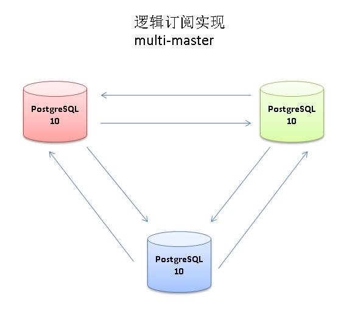

## 使用PostgreSQL逻辑订阅实现multi-master     
                
### 作者                
digoal                
                
### 日期                
2017-06-20               
                
### 标签                
PostgreSQL , multi master , 逻辑订阅          
                
----                
                
## 背景            
很多业务要求多活，但是多活中最难搞定的实际上是数据库，大多数业务通过分流，例如将数据根据UID切分到不同的IDC，同一个UID的数据永远只会写到一个IDC中，然后通过数据复制技术，将对应的数据复制到其他的IDC。    
    
这种形态的多活是比较安全的，即同一条记录不会被多个IDC执行DML。如果同一条记录涉及到多个IDC的DML，那么数据库的一致性会受到极大挑战，比如同一条记录被多个IDC更新，到底以哪个为准？    
    
同时多活还要解决另一个问题，数据的循环问题，例如A写入一条数据，需要复制到B，B写入的数据也要复制给A。如果没有手段防止循环的话，一条记录就可以把多活数据库弄趴下。    
    
multi-master的两个重大课题是解决冲突以及死循环的问题。    
    
PostgreSQL 10引入了逻辑订阅的功能，可以轻松的实现单向复制，同时为双向复制(multi-master)提供了天然的支持，本文将介绍如何利用逻辑订阅实现multi-master。    
    
    
    
## 冲突的产生  
例如某个表的PK字段为pk, A,B,C三个节点，都更新了同一条pk，到底以谁为准呢？  
  
又或者A,B,C都写入了同一个pk值的一条记录，到底以谁的为准呢？  
  
## 解决冲突    
解决冲突的方法很多，例如以某个字段的值来判断（例如时间字段，以最大或最小为准）。    
    
针对不同的操作，解法不一。    
    
1、INSERT和UPDATE    
    
建议业务层面保证PK不冲突。如果业务层面无法保证不冲突，则可以这样实现conflict handler：  
  
对需要实现multi-master的表，新增3个字段，分别为：  
  
NODE ID，事务时间、语句时间 。 然后我们就可以实现这些conflict handler方法。  
  
```  
1、以某个字段(事务时间、语句时间、或者某个用户选择的字段)的最大、最小值为准，  
  
2、以某个节点为准，比如1号节点为上级单位的节点，当发生冲突是，底下的节点都服从他。  
  
3、使用自定义handler。  
  
即复制过程中，如果出现冲突，自动调用对应的handler对应的function来处理。    
    
pglogical, bdr, xDB 都有类似的机制。    
  
本文使用触发器来实现自定义handler。  
```  
  
可以通过HOOK实现，在内核中INSERT、UPDATE阶段应用以上规则。  
  
也可以使用触发器来实现，本文的例子就是使用触发器来实现的。    
    
2、DELETE     
    
无冲突    
    
#### PS    
目前PG 10在遇到冲突（比如INSERT遇到PK异常，或者任何其他异常），会终止WAL apply，此时需要人为介入，例如SKIP对应的WAL。    
  
使用本文的冲突handler后，可以规避此问题。否则我们需要这样来处理冲突：  
    
1\. 通过修改订阅端的数据，解决冲突。例如insert违反了唯一约束时，可以删除订阅端造成唯一约束冲突的记录先DELETE掉。然后使用ALTER SUBSCRIPTION name ENABLE让订阅继续。      
    
如果是双向复制（multi-master）则不建议使用方法1。      
      
2\. 在订阅端调用pg_replication_origin_advance(node_name text, pos pg_lsn)函数，node_name就是subscription name，pos指重新开始的LSN，从而跳过有冲突的事务。      
      
```      
pg_replication_origin_advance(node_name text, pos pg_lsn)             
      
Set replication progress for the given node to the given position.       
      
This primarily is useful for setting up the initial position or a new position after configuration changes and similar.       
      
Be aware that careless use of this function can lead to inconsistently replicated data.      
```      
      
当前的lsn通过pg_replication_origin_status.remote_lsn查看。      
      
https://www.postgresql.org/docs/devel/static/view-pg-replication-origin-status.html      
    
## 死循环的产生  
例如A写入了一条记录，产生一笔WAL，B通过这笔WAL将这条记录复制到了B，B又会产生一笔WAL，这笔WAL又会被复制到A，然后A通过这笔WAL又会写入一条记录，然后又会产生WAL，循环往复。  
  
## 解决死循环    
如果不解决死循环的问题，multi-master的某个节点插入一条记录，这条记录复制到另一个节点后，还会回流到某节点，无限循环。    
    
解决死循环的问题方法比较简单，    
    
1、对需要双向复制的表，添加一个字段（无默认值），表示这条记录是来自PEER节点，还是本地插入、更新、删除的。    
    
为了方便溯源，也可以加一个gtid字段用来分辨记录是来自哪个节点的。(在触发器中体现)    
    
2、对需要双向复制的表，添加一个触发器函数，触发器中需要以下逻辑：    
    
```    
insert or update    
    
  if pid <> replic pid then        -- 本地发起的insert    
    NEW.islocal = true          
  else                             -- 对端节点发起的insert    
    if NEW.islocal = false then    -- 对端也是别人那里复制过来的    
      return NULL;    
    else                           -- 对端是自己产生的    
      NEW.islocal = false          -- 置为对端发来的    
    end if;    
  end if;    
    
  return NEW;    
      
```    
    
## 示例    
### 环境    
3个PostgreSQL 10实例。分别对应端口    
    
```    
1922    
    
1923    
    
1924    
```    
    
### multi-master 实施步骤    
    
1、创建测试表    
  
测试表的原始字段如下  
  
```  
create table mm(    
  id int primary key,   -- 需要多向复制的表，建议必须有PK，对于multi-master，建议使用序列start val错开。    
  info text,            -- 原始表结构内的字段    
  mod_time timestamp    -- 原始表结构内的字段    
);  
```  
    
为了解决冲突和死循环的问题，我们添加了若干字段  
  
```    
create table mm(    
  id int primary key,   -- 需要多向复制的表，建议必须有PK，对于multi-master，建议使用序列start val错开。    
  info text,            -- 原始表结构内的字段    
  mod_time timestamp,   -- 原始表结构内的字段    
  -- 新增如下字段  
  mm_islocal boolean,      -- 表示这条记录是本地发生的，还是复制过来的，本地为true，peer为false   
  mm_nodeid int2,          -- 表示这条记录是哪个节点(insert,update,delete)的。  
  mm_last_xacttime timestamp,  -- 表示这条记录被(insert,update)的事务时间, now()  
  mm_last_stattime timestamp   -- 表示这条记录被(insert,update)的语句时间, clock_timestamp()  
);    
```  
    
PS，写入的冲突，业务层是有办法规避的，例如  
  
使用序列start val错开PK    
  
```  
create table mm(    
  id int primary key default nextval('seq'::regclass),   -- 需要多向复制的表，建议必须有PK，对于multi-master，建议使用序列start val错开。    
  info text,            -- 原始表结构内的字段    
  mod_time timestamp,   -- 原始表结构内的字段    
  -- 新增如下字段  
  mm_islocal boolean,      -- 表示这条记录是本地发生的，还是复制过来的，本地为true，peer为false   
  mm_nodeid int2,          -- 表示这条记录是哪个节点(insert,update,delete)的。  
  mm_last_xacttime timestamp,  -- 表示这条记录被(insert,update)的事务时间, now()  
  mm_last_stattime timestamp   -- 表示这条记录被(insert,update)的语句时间, clock_timestamp()  
);    
    
    
1922    
create sequence seq increment by 16 start with 1;    
    
    
1923    
create sequence seq increment by 16 start with 2;    
    
    
1924    
create sequence seq increment by 16 start with 3;    
```    
    
2、创建触发器函数，解决死循环、冲突问题    
  
为了实现不同的conflict handler，我们需要给触发器函数输入参数，设计如下  
  
```  
参数0，当前节点号  
  
参数1：使用什么作为conflict的解决标志，取值范围(nodeid, last_xacttime, last_stattime, udf)  
  
参数2：对应的解决办法，不同的标志，对应不同的办法(nodeid(1,2,3), last_xact,stattime(first,last), udf(自己定义)...)  
```  
    
```    
create or replace function tg() returns trigger as $$    
declare    
  replica_pids int[];    
begin    
  select array(select pid from pg_stat_activity where application_name ~ 'logical replication worker') into replica_pids;    
    
  -- 解决死循环  
  
  if array_position(replica_pids, pg_backend_pid()) is null then          -- 本地发起的insert或update    
    NEW.mm_islocal = true ;    
    NEW.mm_nodeid = TG_ARGV[0];  
    NEW.mm_last_xacttime = now();  
    NEW.mm_last_stattime = clock_timestamp();  
  else                                                                    -- 不是本地节点发起的insert或update    
    if NEW.mm_islocal = false then                                           -- 判断是否来自peer节点的本地insert\update  
      return null;                                                        -- 否，跳过    
    else    
      NEW.mm_islocal = false;         -- 是，继续，并标记为非本地发起的  
    end if;    
  end if;    
  
  -- 顺利过关，说明没有发生循环。  
  
  -- 解决冲突  
  -- tg_argv[0]: nodeid  
  -- tg_argv[1]: nodeid, last_xacttime, last_stattime, mod_time  
  -- tg_argv[2]: nodeid(1,2,3), last_xacttime(first,last), last_stattime(first,last), mod_time(first,last)  
  -- tg_argv[3]: nodeid(1,2,3), 当tg_argv[1] <> nodeid并且old,new字段值一样时，使用哪个节点优先  
  
  case TG_OP  
  when 'INSERT' then  
    --    insert冲突需要用hook解决，替换为insert on conflict  
    --    所以本文建议，采用serial的start val和increment by 来解决pk冲突的问题  
    RETURN NEW;  
  when 'UPDATE' then  
    case TG_ARGV[1]  
    when 'nodeid' then  
      if OLD.mm_nodeid::text = TG_ARGV[2] and NEW.mm_nodeid <> OLD.mm_nodeid then   
        return NULL;  
      end if;  
    when 'last_xacttime' then  
      case TG_ARGV[2]  
      when 'first' then  
        if OLD.mm_last_xacttime < NEW.mm_last_xacttime or (OLD.mm_last_xacttime = NEW.mm_last_xacttime and OLD.mm_nodeid::text = TG_ARGV[3] and NEW.mm_nodeid <> OLD.mm_nodeid) then   
	  return null;  
        end if;  
      when 'last' then  
        if OLD.mm_last_xacttime > NEW.mm_last_xacttime or (OLD.mm_last_xacttime = NEW.mm_last_xacttime and OLD.mm_nodeid::text = TG_ARGV[3] and NEW.mm_nodeid <> OLD.mm_nodeid) then   
	  return null;  
        end if;  
      end case;  
    when 'last_stattime' then  
      case TG_ARGV[2]  
      when 'first' then  
        if OLD.mm_last_xacttime < NEW.mm_last_stattime or (OLD.mm_last_stattime = NEW.mm_last_stattime and OLD.mm_nodeid::text = TG_ARGV[3] and NEW.mm_nodeid <> OLD.mm_nodeid) then   
	  return null;  
        end if;  
      when 'last' then  
        if OLD.mm_last_stattime > NEW.mm_last_stattime or (OLD.mm_last_stattime = NEW.mm_last_stattime and OLD.mm_nodeid::text = TG_ARGV[3] and NEW.mm_nodeid <> OLD.mm_nodeid) then   
	  return null;  
        end if;  
      end case;  
    when 'mod_time' then  -- 自定义部分  
      case TG_ARGV[2]  
      when 'first' then  
        if OLD.mm_last_xacttime < NEW.mod_time or (OLD.mod_time = NEW.mod_time and OLD.mm_nodeid::text = TG_ARGV[3] and NEW.mm_nodeid <> OLD.mm_nodeid) then   
	  return null;  
        end if;  
      when 'last' then  
        if OLD.mm_last_xacttime > NEW.mod_time or (OLD.mod_time = NEW.mod_time and OLD.mm_nodeid::text = TG_ARGV[3] and NEW.mm_nodeid <> OLD.mm_nodeid) then   
	  return null;  
        end if;  
      end case;  
    end case;  
  end case;  
    
  return NEW;    
  
end;    
$$ language plpgsql strict;    
```    
    
PS，使用pg_stat_activity可以得到logical replication worker的pids.    
    
```    
postgres=# select * from pg_stat_activity where pid=24505;    
-[ RECORD 1 ]----+--------------------------------------------------    
datid            | 13158    
datname          | postgres    
pid              | 24505    
usesysid         | 10    
usename          | postgres    
application_name | logical replication worker for subscription 45109    
client_addr      |     
client_hostname  |     
client_port      |     
backend_start    | 2017-06-22 15:50:33.285954+08    
xact_start       |     
query_start      |     
state_change     | 2017-06-22 16:40:04.983325+08    
wait_event_type  | Activity    
wait_event       | LogicalApplyMain    
state            | idle    
backend_xid      |     
backend_xmin     |     
query            |     
backend_type     | background worker    
```    
    
3、创建触发器    
    
可以这样来创建，分别针对不同的conflict handler  
  
```    
本地节点为1号，优先策略为2号节点  
create trigger tg before insert or update on mm for each row execute procedure tg(1, nodeid, 2);    
  
解释

本地节点为1号，优先策略为last_xacttime, first，当时间相等时优先节点为1号  
  
-- create trigger tg before insert or update on mm for each row execute procedure tg(1, last_xacttime, first, 1);    
  
-- create trigger tg before insert or update on mm for each row execute procedure tg(1, last_stattime, first, 1);   
  
-- create trigger tg before insert or update on mm for each row execute procedure tg(1, mod_time, first, 1);   
  
-- create trigger tg before insert or update on mm for each row execute procedure tg(1, last_xacttime, last, 1);    
  
-- create trigger tg before insert or update on mm for each row execute procedure tg(1, last_stattime, last, 1);   
  
-- create trigger tg before insert or update on mm for each row execute procedure tg(1, mod_time, last, 1);   
```    
  
以last_xacttime，last，优先2号节点为例     
  
```  
1922  
create trigger tg before insert or update on mm for each row execute procedure tg(1, last_xacttime, last, 2);    
  
1923  
create trigger tg before insert or update on mm for each row execute procedure tg(2, last_xacttime, last, 2);    
  
1924  
create trigger tg before insert or update on mm for each row execute procedure tg(3, last_xacttime, last, 2);    
```  
  
以last_xacttime，first，优先2号节点为例     
    
4、让触发器在所有连接中，包括replica进程中都生效    
    
```    
alter table mm enable always trigger tg;    
```    
    
5、创建发布    
    
```    
CREATE PUBLICATION pub1 FOR TABLE mm with (publish = 'insert, delete, update');    
    
-- alter publication pub1 add table mm;    
```    
    
前面的操作需要在所有实例执行。    
    
6、创建订阅，不同的实例操作分别如下  
    
```    
1922    
CREATE SUBSCRIPTION sub1922_1923 CONNECTION 'host=127.0.0.1 port=1923 user=postgres dbname=postgres' PUBLICATION pub1;    
CREATE SUBSCRIPTION sub1922_1924 CONNECTION 'host=127.0.0.1 port=1924 user=postgres dbname=postgres' PUBLICATION pub1;    
    
1923    
CREATE SUBSCRIPTION sub1923_1922 CONNECTION 'host=127.0.0.1 port=1922 user=postgres dbname=postgres' PUBLICATION pub1;    
CREATE SUBSCRIPTION sub1923_1924 CONNECTION 'host=127.0.0.1 port=1924 user=postgres dbname=postgres' PUBLICATION pub1;    
    
1924    
CREATE SUBSCRIPTION sub1924_1922 CONNECTION 'host=127.0.0.1 port=1922 user=postgres dbname=postgres' PUBLICATION pub1;    
CREATE SUBSCRIPTION sub1924_1923 CONNECTION 'host=127.0.0.1 port=1923 user=postgres dbname=postgres' PUBLICATION pub1;    
```    
    
7、压测方法    
    
为了避免插入冲突导致复制中断，使用以下测试方法，3个实例插入的数据确保PK值是不一样的，（实际生产，可以使用序列的start value来错开）。    
    
更新、删除则覆盖所有的值范围。    
    
```    
test1.sql    
    
\set id1 random(1,30000)    
\set id2 random(1,30000)    
\set id3 random(1,30000)    
\set id4 random(1,30000)    
\set id5 random(1,30000)    
insert into mm select 3*(random()*10000)::int, md5(random()::text), now() on conflict(id) do update set info=excluded.info,mod_time=clock_timestamp();    
insert into mm select 3*(random()*10000)::int, md5(random()::text), now() on conflict(id) do update set info=excluded.info,mod_time=clock_timestamp();    
insert into mm select 3*(random()*10000)::int, md5(random()::text), now() on conflict(id) do update set info=excluded.info,mod_time=clock_timestamp();    
insert into mm select 3*(random()*10000)::int, md5(random()::text), now() on conflict(id) do update set info=excluded.info,mod_time=clock_timestamp();    
insert into mm select 3*(random()*10000)::int, md5(random()::text), now() on conflict(id) do update set info=excluded.info,mod_time=clock_timestamp();    
update mm set info=md5(random()::text),mod_time=clock_timestamp() where id=:id1;    
update mm set info=md5(random()::text),mod_time=clock_timestamp() where id=:id2;    
update mm set info=md5(random()::text),mod_time=clock_timestamp() where id=:id3;    
update mm set info=md5(random()::text),mod_time=clock_timestamp() where id=:id4;    
update mm set info=md5(random()::text),mod_time=clock_timestamp() where id=:id5;    
delete from mm where id=:id+1;  
delete from mm where id=:id;  
  
    
test2.sql    
    
\set id1 random(1,30000)    
\set id2 random(1,30000)    
\set id3 random(1,30000)    
\set id4 random(1,30000)    
\set id5 random(1,30000)    
insert into mm select 3*(random()*10000)::int+1, md5(random()::text), now() on conflict(id) do update set info=excluded.info,mod_time=clock_timestamp();    
insert into mm select 3*(random()*10000)::int+1, md5(random()::text), now() on conflict(id) do update set info=excluded.info,mod_time=clock_timestamp();    
insert into mm select 3*(random()*10000)::int+1, md5(random()::text), now() on conflict(id) do update set info=excluded.info,mod_time=clock_timestamp();    
insert into mm select 3*(random()*10000)::int+1, md5(random()::text), now() on conflict(id) do update set info=excluded.info,mod_time=clock_timestamp();    
insert into mm select 3*(random()*10000)::int+1, md5(random()::text), now() on conflict(id) do update set info=excluded.info,mod_time=clock_timestamp();    
update mm set info=md5(random()::text),mod_time=clock_timestamp() where id=:id1;    
update mm set info=md5(random()::text),mod_time=clock_timestamp() where id=:id2;    
update mm set info=md5(random()::text),mod_time=clock_timestamp() where id=:id3;    
update mm set info=md5(random()::text),mod_time=clock_timestamp() where id=:id4;    
update mm set info=md5(random()::text),mod_time=clock_timestamp() where id=:id5;    
delete from mm where id=:id+1;  
delete from mm where id=:id;  
    
    
test3.sql    
    
\set id1 random(1,30000)    
\set id2 random(1,30000)    
\set id3 random(1,30000)    
\set id4 random(1,30000)    
\set id5 random(1,30000)    
insert into mm select 3*(random()*10000)::int+2, md5(random()::text), now() on conflict(id) do update set info=excluded.info,mod_time=clock_timestamp();    
insert into mm select 3*(random()*10000)::int+2, md5(random()::text), now() on conflict(id) do update set info=excluded.info,mod_time=clock_timestamp();    
insert into mm select 3*(random()*10000)::int+2, md5(random()::text), now() on conflict(id) do update set info=excluded.info,mod_time=clock_timestamp();    
insert into mm select 3*(random()*10000)::int+2, md5(random()::text), now() on conflict(id) do update set info=excluded.info,mod_time=clock_timestamp();    
insert into mm select 3*(random()*10000)::int+2, md5(random()::text), now() on conflict(id) do update set info=excluded.info,mod_time=clock_timestamp();    
update mm set info=md5(random()::text),mod_time=clock_timestamp() where id=:id1;    
update mm set info=md5(random()::text),mod_time=clock_timestamp() where id=:id2;    
update mm set info=md5(random()::text),mod_time=clock_timestamp() where id=:id3;    
update mm set info=md5(random()::text),mod_time=clock_timestamp() where id=:id4;    
update mm set info=md5(random()::text),mod_time=clock_timestamp() where id=:id5;    
delete from mm where id=:id+1;  
delete from mm where id=:id;  
```    
    
8、三个节点同时压测     
    
```    
pgbench -M prepared -n -r -P 1 -f ./test1.sql -c 10 -j 10 -T 120 -p 1922  &  
    
pgbench -M prepared -n -r -P 1 -f ./test2.sql -c 10 -j 10 -T 120 -p 1923  &  
    
pgbench -M prepared -n -r -P 1 -f ./test3.sql -c 10 -j 10 -T 120 -p 1924  &  
```    
    
9、验证    
    
```    
1922    
postgres=# select sum(hashtext(t.id||t.info||t.mod_time)) from mm t;    
      sum           
----------------    
 -1378199912066    
(1 row)    
    
1923    
postgres=# select sum(hashtext(t.id||t.info||t.mod_time)) from mm t;    
      sum           
----------------    
 -1378199912066    
(1 row)    
    
1924    
postgres=# select sum(hashtext(t.id||t.info||t.mod_time)) from mm t;    
      sum           
----------------    
 -1378199912066    
(1 row)    
```    
    
10、测试删除    
    
```    
多节点复制成功    
    
最终验证结果一致    
```   
  
11、清理战场  
  
```
-- 1922
drop table mm;
drop publication pub1;
alter subscription sub1922_1923 disable ;
alter subscription sub1922_1924 disable ;
drop subscription sub1922_1923;
drop subscription sub1922_1924;

-- 1923
drop table mm;
drop publication pub1;
alter subscription sub1923_1922 disable ;
alter subscription sub1923_1924 disable ;
drop subscription sub1923_1922;
drop subscription sub1923_1924;

-- 1924
drop table mm;
drop publication pub1;
alter subscription sub1924_1922 disable ;
alter subscription sub1924_1923 disable ;
drop subscription sub1924_1922;
drop subscription sub1924_1923;
```
    
## limit  
1、DDL无法被复制，建议在多个节点的数据一致后，锁定被复制的表，检查确认数据一致，再执行DDL。  
  
2、INSERT conflict handler无法使用触发器支持，需要使用HOOK实现，需增加插件。  
  
3、如果有多个触发器，那么本例用到的触发器必须放在最前面。before触发器，触发器的取名顺序放在最前即可。  
  
触发器的详解  
  
[《PostgreSQL 触发器 用法详解 1》](../201303/20130311_01.md)    
  
[《PostgreSQL 触发器 用法详解 2》](../201303/20130311_02.md)    
    
## 小结    
multi-master的要点，避免冲突（导致流复制中断，需要介入），避免死循环（节点间不停的产生REDO，循环执行）。    
    
本文使用巧妙的方法解决了这两个问题，实现了任意节点的multi-master。    
    
## 参考    
[《PostgreSQL 逻辑订阅 - 给业务架构带来了什么希望？》](../201704/20170413_01.md)      
    
[《PostgreSQL 10.0 preview 逻辑复制 - 原理与最佳实践》](../201702/20170227_01.md)      
    
[《PostgreSQL 10.0 preview 功能增强 - 逻辑订阅端worker数控制参数》](../201704/20170421_05.md)      
    
[《PostgreSQL 10.0 preview 变化 - 逻辑复制pg_hba.conf变化,不再使用replication条目》](../201704/20170405_02.md)      
    
[《PostgreSQL 10.0 preview 功能增强 - 备库支持逻辑订阅,订阅支持主备漂移了》](../201703/20170330_01.md)      
    
[《PostgreSQL 10.0 preview 功能增强 - 逻辑复制支持并行COPY初始化数据》](../201703/20170328_01.md)      
    
https://www.2ndquadrant.com/en/resources/pglogical/    
    
https://www.2ndquadrant.com/en/resources/bdr/    
    
https://www.enterprisedb.com/products-services-training/products-overview/xdb-replication-server-multi-master    
    
https://github.com/postgrespro/postgres_cluster    
    
https://github.com/postgrespro/postgres_cluster/blob/master/contrib/mmts/doc/architecture.md    
  
<a rel="nofollow" href="http://info.flagcounter.com/h9V1"  ></a>  
  
  
  
  
  
  
## [digoal's 大量PostgreSQL文章入口](https://github.com/digoal/blog/blob/master/README.md "22709685feb7cab07d30f30387f0a9ae")
  
