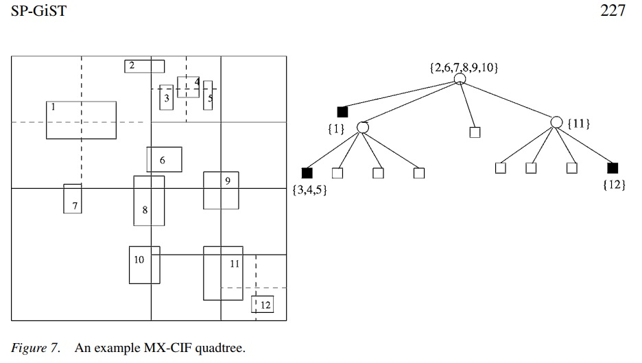

## PostgreSQL 9种索引的原理和应用场景    
                    
### 作者                    
digoal                    
                    
### 日期                    
2017-06-25                   
                    
### 标签                    
PostgreSQL , btree , hash , gin , gist , sp-gist , brin , bloom , rum , zombodb , bitmap       
                    
----                    
                    
## 背景                
PostgreSQL 拥有众多开放特性，例如    
    
1、开放的数据类型接口，使得PG支持超级丰富的数据类型，除了传统数据库支持的类型，还支持GIS，JSON，RANGE，IP，ISBN，图像特征值，化学，DNA等等扩展的类型，用户还可以根据实际业务扩展更多的类型。    
    
2、开放的操作符接口，使得PG不仅仅支持常见的类型操作符，还支持扩展的操作符，例如 距离符，逻辑并、交、差符号，图像相似符号，几何计算符号等等扩展的符号，用户还可以根据实际业务扩展更多的操作符。    
    
3、开放的外部数据源接口，使得PG支持丰富的外部数据源，例如可以通过FDW读写MySQL, redis, mongo, oracle, sqlserver, hive, www, hbase, ldap, 等等只要你能想到的数据源都可以通过FDW接口读写。    
    
4、开放的语言接口，使得PG支持几乎地球上所有的编程语言作为数据库的函数、存储过程语言，例如plpython , plperl , pljava , plR , plCUDA , plshell等等。用户可以通过language handler扩展PG的语言支持。    
    
5、开放的索引接口，使得PG支持非常丰富的索引方法，例如btree , hash , gin , gist , sp-gist , brin , bloom , rum , zombodb , bitmap (greenplum extend)，用户可以根据不同的数据类型，以及查询的场景，选择不同的索引。    
    
6、PG内部还支持BitmapAnd, BitmapOr的优化方法，可以合并多个索引的扫描操作，从而提升多个索引数据访问的效率。    
    
不同的索引接口针对的数据类型、业务场景是不一样的，接下来针对每一种索引，介绍一下它的原理和应用场景。    
    
## 一、btree    
### 原理    
[《深入浅出PostgreSQL B-Tree索引结构》](../201605/20160528_01.md)      
    
### 应用场景    
b-tree适合所有的数据类型，支持排序，支持大于、小于、等于、大于或等于、小于或等于的搜索。    
    
索引与递归查询结合，还能实现快速的稀疏检索。     
    
[《PostgrSQL 递归SQL的几个应用 - 极客与正常人的思维》](../201705/20170519_01.md)    
    
### 例子    
```    
postgres=# create table t_btree(id int, info text);    
CREATE TABLE    
postgres=# insert into t_btree select generate_series(1,10000), md5(random()::text) ;    
INSERT 0 10000    
postgres=# create index idx_t_btree_1 on t_btree using btree (id);    
CREATE INDEX    
postgres=# explain (analyze,verbose,timing,costs,buffers) select * from t_btree where id=1;    
                                                          QUERY PLAN                                                               
-------------------------------------------------------------------------------------------------------------------------------    
 Index Scan using idx_t_btree_1 on public.t_btree  (cost=0.29..3.30 rows=1 width=37) (actual time=0.027..0.027 rows=1 loops=1)    
   Output: id, info    
   Index Cond: (t_btree.id = 1)    
   Buffers: shared hit=1 read=2    
 Planning time: 0.292 ms    
 Execution time: 0.050 ms    
(6 rows)    
```    
    
## 二、hash    
### 原理    
src/backend/access/hash/README    
    
（hash index entries store only the hash code, not the actual data value, for each indexed item. ）    
    
### 应用场景    
hash索引存储的是被索引字段VALUE的哈希值，只支持等值查询。    
    
hash索引特别适用于字段VALUE非常长（不适合b-tree索引，因为b-tree一个PAGE至少要存储3个ENTRY，所以不支持特别长的VALUE）的场景，例如很长的字符串，并且用户只需要等值搜索，建议使用hash index。    
    
### 例子    
```    
postgres=# create table t_hash (id int, info text);    
CREATE TABLE    
postgres=# insert into t_hash select generate_series(1,100), repeat(md5(random()::text),10000);    
INSERT 0 100    
    
-- 使用b-tree索引会报错，因为长度超过了1/3的索引页大小  
postgres=# create index idx_t_hash_1 on t_hash using btree (info);    
ERROR:  index row size 3720 exceeds maximum 2712 for index "idx_t_hash_1"    
HINT:  Values larger than 1/3 of a buffer page cannot be indexed.    
Consider a function index of an MD5 hash of the value, or use full text indexing.    
    
postgres=# create index idx_t_hash_1 on t_hash using hash (info);    
CREATE INDEX    
    
postgres=# set enable_hashjoin=off;    
SET    
postgres=# explain (analyze,verbose,timing,costs,buffers) select * from t_hash where info in (select info from t_hash limit 1);    
                                                             QUERY PLAN                                                                  
-------------------------------------------------------------------------------------------------------------------------------------    
 Nested Loop  (cost=0.03..3.07 rows=1 width=22) (actual time=0.859..0.861 rows=1 loops=1)    
   Output: t_hash.id, t_hash.info    
   Buffers: shared hit=11    
   ->  HashAggregate  (cost=0.03..0.04 rows=1 width=18) (actual time=0.281..0.281 rows=1 loops=1)    
         Output: t_hash_1.info    
         Group Key: t_hash_1.info    
         Buffers: shared hit=3    
         ->  Limit  (cost=0.00..0.02 rows=1 width=18) (actual time=0.012..0.012 rows=1 loops=1)    
               Output: t_hash_1.info    
               Buffers: shared hit=1    
               ->  Seq Scan on public.t_hash t_hash_1  (cost=0.00..2.00 rows=100 width=18) (actual time=0.011..0.011 rows=1 loops=1)    
                     Output: t_hash_1.info    
                     Buffers: shared hit=1    
   ->  Index Scan using idx_t_hash_1 on public.t_hash  (cost=0.00..3.02 rows=1 width=22) (actual time=0.526..0.527 rows=1 loops=1)    
         Output: t_hash.id, t_hash.info    
         Index Cond: (t_hash.info = t_hash_1.info)    
         Buffers: shared hit=6    
 Planning time: 0.159 ms    
 Execution time: 0.898 ms    
(19 rows)    
```    
    
## 三、gin    
### 原理    
gin是倒排索引，存储被索引字段的VALUE或VALUE的元素，以及行号的list或tree。    
    
（ col_val:(tid_list or tid_tree) ， col_val_elements:(tid_list or tid_tree) ）    
    
[《PostgreSQL GIN索引实现原理》](../201702/20170204_01.md)     
    
[《宝剑赠英雄 - 任意组合字段等效查询, 探探PostgreSQL多列展开式B树 (GIN)》](../201702/20170205_01.md)      
    
### 应用场景    
1、当需要搜索多值类型内的VALUE时，适合多值类型，例如数组、全文检索、TOKEN。（根据不同的类型，支持相交、包含、大于、在左边、在右边等搜索）    
    
2、当用户的数据比较稀疏时，如果要搜索某个VALUE的值，可以适应btree_gin支持普通btree支持的类型。（支持btree的操作符）    
    
3、当用户需要按任意列进行搜索时，gin支持多列展开单独建立索引域，同时支持内部多域索引的bitmapAnd, bitmapOr合并，快速的返回按任意列搜索请求的数据。    
    
### 例子    
1、多值类型搜索    
    
```    
postgres=# create table t_gin1 (id int, arr int[]);    
CREATE TABLE    
    
postgres=# do language plpgsql $$    
postgres$# declare    
postgres$# begin    
postgres$#   for i in 1..10000 loop    
postgres$#     insert into t_gin1 select i, array(select random()*1000 from generate_series(1,10));    
postgres$#   end loop;    
postgres$# end;    
postgres$# $$;    
DO    
postgres=# select * from t_gin1 limit 3;    
 id |                    arr                        
----+-------------------------------------------    
  1 | {128,700,814,592,414,838,615,827,274,210}    
  2 | {284,452,824,556,132,121,21,705,537,865}    
  3 | {65,185,586,872,627,330,574,227,827,64}    
(3 rows)    
    
postgres=# create index idx_t_gin1_1 on t_gin1 using gin (arr);    
CREATE INDEX    
    
postgres=# explain (analyze,verbose,timing,costs,buffers) select * from t_gin1 where arr && array[1,2];    
                                                       QUERY PLAN                                                            
-------------------------------------------------------------------------------------------------------------------------    
 Bitmap Heap Scan on public.t_gin1  (cost=8.93..121.24 rows=185 width=65) (actual time=0.058..0.207 rows=186 loops=1)    
   Output: id, arr    
   Recheck Cond: (t_gin1.arr && '{1,2}'::integer[])    
   Heap Blocks: exact=98    
   Buffers: shared hit=103    
   ->  Bitmap Index Scan on idx_t_gin1_1  (cost=0.00..8.89 rows=185 width=0) (actual time=0.042..0.042 rows=186 loops=1)    
         Index Cond: (t_gin1.arr && '{1,2}'::integer[])    
         Buffers: shared hit=5    
 Planning time: 0.208 ms    
 Execution time: 0.245 ms    
(10 rows)    
    
postgres=# explain (analyze,verbose,timing,costs,buffers) select * from t_gin1 where arr @> array[1,2];    
                                                     QUERY PLAN                                                          
---------------------------------------------------------------------------------------------------------------------    
 Bitmap Heap Scan on public.t_gin1  (cost=7.51..9.02 rows=1 width=65) (actual time=0.022..0.022 rows=0 loops=1)    
   Output: id, arr    
   Recheck Cond: (t_gin1.arr @> '{1,2}'::integer[])    
   Buffers: shared hit=5    
   ->  Bitmap Index Scan on idx_t_gin1_1  (cost=0.00..7.51 rows=1 width=0) (actual time=0.020..0.020 rows=0 loops=1)    
         Index Cond: (t_gin1.arr @> '{1,2}'::integer[])    
         Buffers: shared hit=5    
 Planning time: 0.116 ms    
 Execution time: 0.044 ms    
(9 rows)    
```    
    
2、单值稀疏数据搜索    
    
```    
postgres=# create extension btree_gin;    
CREATE EXTENSION    
postgres=# create table t_gin2 (id int, c1 int);    
CREATE TABLE    
postgres=# insert into t_gin2 select generate_series(1,100000), random()*10 ;    
INSERT 0 100000    
postgres=# create index idx_t_gin2_1 on t_gin2 using gin (c1);    
CREATE INDEX    
postgres=# explain (analyze,verbose,timing,costs,buffers) select * from t_gin2 where c1=1;    
                                                         QUERY PLAN                                                              
-----------------------------------------------------------------------------------------------------------------------------    
 Bitmap Heap Scan on public.t_gin2  (cost=84.10..650.63 rows=9883 width=8) (actual time=0.925..3.685 rows=10078 loops=1)    
   Output: id, c1    
   Recheck Cond: (t_gin2.c1 = 1)    
   Heap Blocks: exact=443    
   Buffers: shared hit=448    
   ->  Bitmap Index Scan on idx_t_gin2_1  (cost=0.00..81.62 rows=9883 width=0) (actual time=0.867..0.867 rows=10078 loops=1)    
         Index Cond: (t_gin2.c1 = 1)    
         Buffers: shared hit=5    
 Planning time: 0.252 ms    
 Execution time: 4.234 ms    
(10 rows)    
```    
    
3、多列任意搜索    
    
```    
postgres=# create table t_gin3 (id int, c1 int, c2 int, c3 int, c4 int, c5 int, c6 int, c7 int, c8 int, c9 int);    
CREATE TABLE    
postgres=# insert into t_gin3 select generate_series(1,100000), random()*10, random()*20, random()*30, random()*40, random()*50, random()*60, random()*70, random()*80, random()*90;    
INSERT 0 100000    
postgres=# create index idx_t_gin3_1 on t_gin3 using gin (c1,c2,c3,c4,c5,c6,c7,c8,c9);    
CREATE INDEX    
    
postgres=# explain (analyze,verbose,timing,costs,buffers) select * from t_gin3 where c1=1 or c2=1 and c3=1 or c4=1 and (c6=1 or c7=2) or c8=9 or c9=10;    
                                                                                              QUERY PLAN                                                                                                   
-------------------------------------------------------------------------------------------------------------------------------------------------------------------------------------------------------    
 Bitmap Heap Scan on public.t_gin3  (cost=154.03..1364.89 rows=12286 width=40) (actual time=1.931..5.634 rows=12397 loops=1)    
   Output: id, c1, c2, c3, c4, c5, c6, c7, c8, c9    
   Recheck Cond: ((t_gin3.c1 = 1) OR ((t_gin3.c2 = 1) AND (t_gin3.c3 = 1)) OR (((t_gin3.c4 = 1) AND (t_gin3.c6 = 1)) OR ((t_gin3.c4 = 1) AND (t_gin3.c7 = 2))) OR (t_gin3.c8 = 9) OR (t_gin3.c9 = 10))    
   Heap Blocks: exact=834    
   Buffers: shared hit=867    
   ->  BitmapOr  (cost=154.03..154.03 rows=12562 width=0) (actual time=1.825..1.825 rows=0 loops=1)    
         Buffers: shared hit=33    
         ->  Bitmap Index Scan on idx_t_gin3_1  (cost=0.00..83.85 rows=9980 width=0) (actual time=0.904..0.904 rows=10082 loops=1)    
               Index Cond: (t_gin3.c1 = 1)    
               Buffers: shared hit=6    
         ->  Bitmap Index Scan on idx_t_gin3_1  (cost=0.00..9.22 rows=172 width=0) (actual time=0.355..0.355 rows=164 loops=1)    
               Index Cond: ((t_gin3.c2 = 1) AND (t_gin3.c3 = 1))    
               Buffers: shared hit=8    
         ->  BitmapOr  (cost=21.98..21.98 rows=83 width=0) (actual time=0.334..0.334 rows=0 loops=1)    
               Buffers: shared hit=13    
               ->  Bitmap Index Scan on idx_t_gin3_1  (cost=0.00..7.92 rows=42 width=0) (actual time=0.172..0.172 rows=36 loops=1)    
                     Index Cond: ((t_gin3.c4 = 1) AND (t_gin3.c6 = 1))    
                     Buffers: shared hit=6    
               ->  Bitmap Index Scan on idx_t_gin3_1  (cost=0.00..7.91 rows=41 width=0) (actual time=0.162..0.162 rows=27 loops=1)    
                     Index Cond: ((t_gin3.c4 = 1) AND (t_gin3.c7 = 2))    
                     Buffers: shared hit=7    
         ->  Bitmap Index Scan on idx_t_gin3_1  (cost=0.00..14.38 rows=1317 width=0) (actual time=0.124..0.124 rows=1296 loops=1)    
               Index Cond: (t_gin3.c8 = 9)    
               Buffers: shared hit=3    
         ->  Bitmap Index Scan on idx_t_gin3_1  (cost=0.00..12.07 rows=1010 width=0) (actual time=0.102..0.102 rows=1061 loops=1)    
               Index Cond: (t_gin3.c9 = 10)    
               Buffers: shared hit=3    
 Planning time: 0.272 ms    
 Execution time: 6.349 ms    
(29 rows)    
```    
    
## 四、gist    
### 原理    
GiST stands for Generalized Search Tree.     
    
It is a balanced, tree-structured access method, that acts as a base template in which to implement arbitrary indexing schemes.     
    
B-trees, R-trees and many other indexing schemes can be implemented in GiST.    
    
[《从难缠的模糊查询聊开 - PostgreSQL独门绝招之一 GIN , GiST , SP-GiST , RUM 索引原理与技术背景》](../201612/20161231_01.md)      
    
### 应用场景    
GiST是一个通用的索引接口，可以使用GiST实现b-tree, r-tree等索引结构。    
    
不同的类型，支持的索引检索也各不一样。例如：    
    
1、几何类型，支持位置搜索（包含、相交、在上下左右等），按距离排序。    
    
2、范围类型，支持位置搜索（包含、相交、在左右等）。    
    
3、IP类型，支持位置搜索（包含、相交、在左右等）。    
    
4、空间类型（PostGIS），支持位置搜索（包含、相交、在上下左右等），按距离排序。    
    
5、标量类型，支持按距离排序。    
    
[《PostgreSQL 百亿地理位置数据 近邻查询性能》](../201601/20160119_01.md)      
    
### 例子    
1、几何类型检索    
    
```    
postgres=# create table t_gist (id int, pos point);    
CREATE TABLE    
postgres=# insert into t_gist select generate_series(1,100000), point(round((random()*1000)::numeric, 2), round((random()*1000)::numeric, 2));    
INSERT 0 100000    
postgres=# select * from t_gist  limit 3;    
 id |       pos           
----+-----------------    
  1 | (325.43,477.07)    
  2 | (257.65,710.94)    
  3 | (502.42,582.25)    
(3 rows)    
postgres=# create index idx_t_gist_1 on t_gist using gist (pos);    
CREATE INDEX    
    
postgres=# explain (analyze,verbose,timing,costs,buffers) select * from t_gist where circle '((100,100) 10)'  @> pos;    
                                                       QUERY PLAN                                                           
------------------------------------------------------------------------------------------------------------------------    
 Bitmap Heap Scan on public.t_gist  (cost=2.55..125.54 rows=100 width=20) (actual time=0.072..0.132 rows=46 loops=1)    
   Output: id, pos    
   Recheck Cond: ('<(100,100),10>'::circle @> t_gist.pos)    
   Heap Blocks: exact=41    
   Buffers: shared hit=47    
   ->  Bitmap Index Scan on idx_t_gist_1  (cost=0.00..2.53 rows=100 width=0) (actual time=0.061..0.061 rows=46 loops=1)    
         Index Cond: ('<(100,100),10>'::circle @> t_gist.pos)    
         Buffers: shared hit=6    
 Planning time: 0.147 ms    
 Execution time: 0.167 ms    
(10 rows)    
    
postgres=# explain (analyze,verbose,timing,costs,buffers) select * from t_gist where circle '((100,100) 1)' @> pos order by pos <-> '(100,100)' limit 10;    
                                                              QUERY PLAN                                                                   
---------------------------------------------------------------------------------------------------------------------------------------    
 Limit  (cost=0.28..14.60 rows=10 width=28) (actual time=0.045..0.048 rows=2 loops=1)    
   Output: id, pos, ((pos <-> '(100,100)'::point))    
   Buffers: shared hit=5    
   ->  Index Scan using idx_t_gist_1 on public.t_gist  (cost=0.28..143.53 rows=100 width=28) (actual time=0.044..0.046 rows=2 loops=1)    
         Output: id, pos, (pos <-> '(100,100)'::point)    
         Index Cond: ('<(100,100),1>'::circle @> t_gist.pos)    
         Order By: (t_gist.pos <-> '(100,100)'::point)    
         Buffers: shared hit=5    
 Planning time: 0.092 ms    
 Execution time: 0.076 ms    
(10 rows)    
```    
    
2、标量类型排序    
    
```    
postgres=# create extension btree_gist;    
CREATE EXTENSION    
    
postgres=# create index idx_t_btree_2 on t_btree using gist(id);    
CREATE INDEX    
    
postgres=# explain (analyze,verbose,timing,costs,buffers) select * from t_btree order by id <-> 100 limit 1;    
                                                                QUERY PLAN                                                                     
-------------------------------------------------------------------------------------------------------------------------------------------    
 Limit  (cost=0.15..0.19 rows=1 width=41) (actual time=0.046..0.046 rows=1 loops=1)    
   Output: id, info, ((id <-> 100))    
   Buffers: shared hit=3    
   ->  Index Scan using idx_t_btree_2 on public.t_btree  (cost=0.15..408.65 rows=10000 width=41) (actual time=0.045..0.045 rows=1 loops=1)    
         Output: id, info, (id <-> 100)    
         Order By: (t_btree.id <-> 100)    
         Buffers: shared hit=3    
 Planning time: 0.085 ms    
 Execution time: 0.076 ms    
(9 rows)    
```    
    
## 五、sp-gist    
### 原理    
SP-GiST is an abbreviation for space-partitioned GiST.     
    
SP-GiST supports partitioned search trees, which facilitate development of a wide range of different non-balanced data structures, such as quad-trees, k-d trees, and radix trees (tries).     
    
The common feature of these structures is that they repeatedly divide the search space into partitions that need not be of equal size.     
    
Searches that are well matched to the partitioning rule can be very fast.    
    
SP-GiST类似GiST，是一个通用的索引接口，但是SP-GIST使用了空间分区的方法，使得SP-GiST可以更好的支持非平衡数据结构，例如quad-trees, k-d tree, radis tree.    
    
[《Space-partitioning trees in PostgreSQL》](20170627_01_pdf_001.pdf)    
    
[《SP-GiST for PostgreSQL User Manual》](20170627_01_pdf_002.pdf)    
    
### 应用场景    
1、几何类型，支持位置搜索（包含、相交、在上下左右等），按距离排序。    
    
2、范围类型，支持位置搜索（包含、相交、在左右等）。    
    
3、IP类型，支持位置搜索（包含、相交、在左右等）。    
    
### 例子    
1、范围类型搜索    
    
```    
postgres=# create table t_spgist (id int, rg int4range);    
CREATE TABLE    
    
postgres=# insert into t_spgist select id, int4range(id, id+(random()*200)::int) from generate_series(1,100000) t(id);    
INSERT 0 100000    
postgres=# select * from t_spgist  limit 3;    
 id |   rg        
----+---------    
  1 | [1,138)    
  2 | [2,4)    
  3 | [3,111)    
(3 rows)    
    
postgres=# set maintenance_work_mem ='32GB';    
SET    
postgres=# create index idx_t_spgist_1 on t_spgist using spgist (rg);    
CREATE INDEX    
    
postgres=# explain (analyze,verbose,timing,costs,buffers) select * from t_spgist where rg && int4range(1,100);    
                                                       QUERY PLAN                                                            
-------------------------------------------------------------------------------------------------------------------------    
 Bitmap Heap Scan on public.t_spgist  (cost=2.55..124.30 rows=99 width=17) (actual time=0.059..0.071 rows=99 loops=1)    
   Output: id, rg    
   Recheck Cond: (t_spgist.rg && '[1,100)'::int4range)    
   Heap Blocks: exact=1    
   Buffers: shared hit=6    
   ->  Bitmap Index Scan on idx_t_spgist_1  (cost=0.00..2.52 rows=99 width=0) (actual time=0.043..0.043 rows=99 loops=1)    
         Index Cond: (t_spgist.rg && '[1,100)'::int4range)    
         Buffers: shared hit=5    
 Planning time: 0.133 ms    
 Execution time: 0.111 ms    
(10 rows)    
    
postgres=# set enable_bitmapscan=off;    
SET    
postgres=# explain (analyze,verbose,timing,costs,buffers) select * from t_spgist where rg && int4range(1,100);    
                                                             QUERY PLAN                                                                  
-------------------------------------------------------------------------------------------------------------------------------------    
 Index Scan using idx_t_spgist_1 on public.t_spgist  (cost=0.28..141.51 rows=99 width=17) (actual time=0.021..0.051 rows=99 loops=1)    
   Output: id, rg    
   Index Cond: (t_spgist.rg && '[1,100)'::int4range)    
   Buffers: shared hit=8    
 Planning time: 0.097 ms    
 Execution time: 0.074 ms    
(6 rows)    
    
```    
    
## 六、brin    
### 原理    
BRIN 索引是块级索引，有别于B-TREE等索引，BRIN记录并不是以行号为单位记录索引明细，而是记录每个数据块或者每段连续的数据块的统计信息。因此BRIN索引空间占用特别的小，对数据写入、更新、删除的影响也很小。    
    
BRIN属于LOSSLY索引，当被索引列的值与物理存储相关性很强时，BRIN索引的效果非常的好。    
    
例如时序数据，在时间或序列字段创建BRIN索引，进行等值、范围查询时效果很棒。    
    
### 应用场景    
    
[《BRIN (block range index) index》](../201504/20150419_01.md)     
    
[《PostgreSQL 物联网黑科技 - 瘦身几百倍的索引(BRIN index)》](../201604/20160414_01.md)      
    
[《PostgreSQL 聚集存储 与 BRIN索引 - 高并发行为、轨迹类大吞吐数据查询场景解说》](../201702/20170219_01.md)      
    
[《PostgreSQL 并行写入堆表，如何保证时序线性存储 - BRIN索引优化》](../201706/20170611_02.md)      
    
### 例子    
    
```    
postgres=# create table t_brin (id int, info text, crt_time timestamp);    
CREATE TABLE    
postgres=# insert into t_brin select generate_series(1,1000000), md5(random()::text), clock_timestamp();    
INSERT 0 1000000    
    
postgres=# select ctid,* from t_brin limit 3;    
 ctid  | id |               info               |          crt_time              
-------+----+----------------------------------+----------------------------    
 (0,1) |  1 | e48a6cd688b6cc8e86ee858fa993b31b | 2017-06-27 22:50:19.172224    
 (0,2) |  2 | e79c335c679b0bf544e8ba5f01569df7 | 2017-06-27 22:50:19.172319    
 (0,3) |  3 | b75ec6db320891a620097164b751e682 | 2017-06-27 22:50:19.172323    
(3 rows)    
    
    
postgres=# select correlation from pg_stats where tablename='t_brin' and attname='id';    
 correlation     
-------------    
           1    
(1 row)    
    
postgres=# select correlation from pg_stats where tablename='t_brin' and attname='crt_time';    
 correlation     
-------------    
           1    
(1 row)    
    
postgres=# create index idx_t_brin_1 on t_brin using brin (id) with (pages_per_range=1);    
CREATE INDEX    
postgres=# create index idx_t_brin_2 on t_brin using brin (crt_time) with (pages_per_range=1);    
CREATE INDEX    
    
postgres=# explain (analyze,verbose,timing,costs,buffers) select * from t_brin where id between 100 and 200;    
                                                       QUERY PLAN                                                            
-------------------------------------------------------------------------------------------------------------------------    
 Bitmap Heap Scan on public.t_brin  (cost=43.52..199.90 rows=74 width=45) (actual time=1.858..1.876 rows=101 loops=1)    
   Output: id, info, crt_time    
   Recheck Cond: ((t_brin.id >= 100) AND (t_brin.id <= 200))    
   Rows Removed by Index Recheck: 113    
   Heap Blocks: lossy=2    
   Buffers: shared hit=39    
   ->  Bitmap Index Scan on idx_t_brin_1  (cost=0.00..43.50 rows=107 width=0) (actual time=1.840..1.840 rows=20 loops=1)    
         Index Cond: ((t_brin.id >= 100) AND (t_brin.id <= 200))    
         Buffers: shared hit=37    
 Planning time: 0.174 ms    
 Execution time: 1.908 ms    
(11 rows)    
    
postgres=# explain (analyze,verbose,timing,costs,buffers) select * from t_brin where crt_time between '2017-06-27 22:50:19.172224' and '2017-06-27 22:50:19.182224';    
                                                                                       QUERY PLAN                                                                                            
-----------------------------------------------------------------------------------------------------------------------------------------------------------------------------------------    
 Bitmap Heap Scan on public.t_brin  (cost=59.63..4433.67 rows=4474 width=45) (actual time=1.860..2.603 rows=4920 loops=1)    
   Output: id, info, crt_time    
   Recheck Cond: ((t_brin.crt_time >= '2017-06-27 22:50:19.172224'::timestamp without time zone) AND (t_brin.crt_time <= '2017-06-27 22:50:19.182224'::timestamp without time zone))    
   Rows Removed by Index Recheck: 2    
   Heap Blocks: lossy=46    
   Buffers: shared hit=98    
   ->  Bitmap Index Scan on idx_t_brin_2  (cost=0.00..58.51 rows=4494 width=0) (actual time=1.848..1.848 rows=460 loops=1)    
         Index Cond: ((t_brin.crt_time >= '2017-06-27 22:50:19.172224'::timestamp without time zone) AND (t_brin.crt_time <= '2017-06-27 22:50:19.182224'::timestamp without time zone))    
         Buffers: shared hit=52    
 Planning time: 0.091 ms    
 Execution time: 2.884 ms    
(11 rows)    
```    
    
## 七、rum    
### 原理    
https://github.com/postgrespro/rum    
    
rum 是一个索引插件，由Postgrespro开源，适合全文检索，属于GIN的增强版本。    
    
增强包括：    
    
1、在RUM索引中，存储了lexem的位置信息，所以在计算ranking时，不需要回表查询（而GIN需要回表查询）。    
    
2、RUM支持phrase搜索，而GIN无法支持。    
    
3、在一个RUM索引中，允许用户在posting tree中存储除ctid（行号）以外的字段VALUE，例如时间戳。    
    
这使得RUM不仅支持GIN支持的全文检索，还支持计算文本的相似度值，按相似度排序等。同时支持位置匹配，例如（速度与激情，可以采用"速度" <2> "激情" 进行匹配，而GIN索引则无法做到）    
    
位置信息如下    
    
```  
postgres=# select to_tsvector('english', 'hello digoal');  
     to_tsvector        
----------------------  
 'digoal':2 'hello':1  
(1 row)  
  
postgres=# select to_tsvector('english', 'hello i digoal');  
     to_tsvector        
----------------------  
 'digoal':3 'hello':1  
(1 row)  
  
postgres=# select to_tsvector('english', 'hello i am digoal');  
     to_tsvector        
----------------------  
 'digoal':4 'hello':1  
(1 row)  
  
postgres=# select to_tsquery('english', 'hello <1> digoal');  
      to_tsquery        
----------------------  
 'hello' <-> 'digoal'  
(1 row)  
  
postgres=# select to_tsquery('english', 'hello <2> digoal');  
      to_tsquery        
----------------------  
 'hello' <2> 'digoal'  
(1 row)  
  
postgres=# select to_tsquery('english', 'hello <3> digoal');  
      to_tsquery        
----------------------  
 'hello' <3> 'digoal'  
(1 row)  
  
postgres=# select to_tsvector('hello digoal') @@ to_tsquery('english', 'hello <1> digoal');  
 ?column?   
----------  
 t  
(1 row)  
  
postgres=# select to_tsvector('hello digoal') @@ to_tsquery('english', 'hello <2> digoal');  
 ?column?   
----------  
 f  
(1 row)  
  
postgres=# select to_tsvector('hello i digoal') @@ to_tsquery('english', 'hello <2> digoal');  
 ?column?   
----------  
 t  
(1 row)  
```  
    
### 应用场景    
    
[《PostgreSQL 全文检索加速 快到没有朋友 - RUM索引接口(潘多拉魔盒)》](../201610/20161019_01.md)      
    
[《从难缠的模糊查询聊开 - PostgreSQL独门绝招之一 GIN , GiST , SP-GiST , RUM 索引原理与技术背景》](../201612/20161231_01.md)      
    
[《PostgreSQL结合余弦、线性相关算法 在文本、图片、数组相似 等领域的应用 - 3 rum, smlar应用场景分析》](../201701/20170116_04.md)      
    
### 例子    
    
```    
postgres=# create table rum_test(c1 tsvector);    
CREATE TABLE    
    
postgres=# CREATE INDEX rumidx ON rum_test USING rum (c1 rum_tsvector_ops);    
CREATE INDEX    
    
$ vi test.sql    
insert into rum_test select to_tsvector(string_agg(c1::text,',')) from  (select (100000*random())::int from generate_series(1,100)) t(c1);    
    
$ pgbench -M prepared -n -r -P 1 -f ./test.sql -c 50 -j 50 -t 200000    
    
postgres=# explain analyze select * from rum_test where c1 @@ to_tsquery('english','1 | 2') order by c1 <=> to_tsquery('english','1 | 2') offset 19000 limit 100;    
                                                               QUERY PLAN                                                                    
-----------------------------------------------------------------------------------------------------------------------------------------    
 Limit  (cost=18988.45..19088.30 rows=100 width=1391) (actual time=58.912..59.165 rows=100 loops=1)    
   ->  Index Scan using rumidx on rum_test  (cost=16.00..99620.35 rows=99749 width=1391) (actual time=16.426..57.892 rows=19100 loops=1)    
         Index Cond: (c1 @@ '''1'' | ''2'''::tsquery)    
         Order By: (c1 <=> '''1'' | ''2'''::tsquery)    
 Planning time: 0.133 ms    
 Execution time: 59.220 ms    
(6 rows)    
    
postgres=# create table test15(c1 tsvector);    
CREATE TABLE    
postgres=# insert into test15 values (to_tsvector('jiebacfg', 'hello china, i''m digoal')), (to_tsvector('jiebacfg', 'hello world, i''m postgresql')), (to_tsvector('jiebacfg', 'how are you, i''m digoal'));    
INSERT 0 3    
postgres=# select * from test15;    
                         c1                              
-----------------------------------------------------    
 ' ':2,5,9 'china':3 'digoal':10 'hello':1 'm':8    
 ' ':2,5,9 'hello':1 'm':8 'postgresql':10 'world':3    
 ' ':2,4,7,11 'digoal':12 'm':10    
(3 rows)    
postgres=# create index idx_test15 on test15 using rum(c1 rum_tsvector_ops);    
CREATE INDEX    
postgres=# select *,c1 <=> to_tsquery('hello') from test15;    
                         c1                          | ?column?     
-----------------------------------------------------+----------    
 ' ':2,5,9 'china':3 'digoal':10 'hello':1 'm':8     |  16.4493    
 ' ':2,5,9 'hello':1 'm':8 'postgresql':10 'world':3 |  16.4493    
 ' ':2,4,7,11 'digoal':12 'm':10                     | Infinity    
(3 rows)    
postgres=# explain select *,c1 <=> to_tsquery('postgresql') from test15 order by c1 <=> to_tsquery('postgresql');    
                                   QUERY PLAN                                       
--------------------------------------------------------------------------------    
 Index Scan using idx_test15 on test15  (cost=3600.25..3609.06 rows=3 width=36)    
   Order By: (c1 <=> to_tsquery('postgresql'::text))    
(2 rows)    
```    
    
GIN VS RUM    
    
GIN    
    
```  
postgres=# create table t_gin_1 (id int, ts tsvector);  
CREATE TABLE  
postgres=# insert into t_gin_1 values (1, to_tsvector('hello digoal')),(2, to_tsvector('hello i digoal')),(3, to_tsvector('hello i am digoal'));  
INSERT 0 3  
postgres=# create index idx_t_gin_1_1 on t_gin_1 using gin (ts);  
CREATE INDEX  
postgres=# explain select * from t_gin_1 where ts @@ to_tsquery('english', 'hello <1> digoal');  
                       QUERY PLAN                         
--------------------------------------------------------  
 Seq Scan on t_gin_1  (cost=0.00..1.04 rows=1 width=36)  
   Filter: (ts @@ '''hello'' <-> ''digoal'''::tsquery)  
(2 rows)  
  
postgres=# set enable_seqscan=off;  
SET  
postgres=# explain select * from t_gin_1 where ts @@ to_tsquery('english', 'hello <1> digoal');  
                                 QUERY PLAN                                   
----------------------------------------------------------------------------  
 Bitmap Heap Scan on t_gin_1  (cost=4.50..6.01 rows=1 width=36)  
   Recheck Cond: (ts @@ '''hello'' <-> ''digoal'''::tsquery)  
   ->  Bitmap Index Scan on idx_t_gin_1_1  (cost=0.00..4.50 rows=1 width=0)  
         Index Cond: (ts @@ '''hello'' <-> ''digoal'''::tsquery)  
(4 rows)  
  
postgres=# explain (analyze,verbose,timing,costs,buffers) select * from t_gin_1 where ts @@ to_tsquery('english', 'hello <1> digoal');  
                                                      QUERY PLAN                                                        
----------------------------------------------------------------------------------------------------------------------  
 Bitmap Heap Scan on public.t_gin_1  (cost=4.50..6.01 rows=1 width=36) (actual time=0.029..0.030 rows=1 loops=1)  
   Output: id, ts  
   Recheck Cond: (t_gin_1.ts @@ '''hello'' <-> ''digoal'''::tsquery)  
   Rows Removed by Index Recheck: 2  
   Heap Blocks: exact=1  
   Buffers: shared hit=4  
   ->  Bitmap Index Scan on idx_t_gin_1_1  (cost=0.00..4.50 rows=1 width=0) (actual time=0.018..0.018 rows=3 loops=1)  
         Index Cond: (t_gin_1.ts @@ '''hello'' <-> ''digoal'''::tsquery)  
         Buffers: shared hit=3  
 Planning time: 0.106 ms  
 Execution time: 0.061 ms  
(11 rows)  
```  
    
RUM    
    
```  
postgres=# create table t_gin_1 (id int, ts tsvector);  
CREATE TABLE  
postgres=# insert into t_gin_1 values (1, to_tsvector('hello digoal')),(2, to_tsvector('hello i digoal')),(3, to_tsvector('hello i am digoal'));  
INSERT 0 3  
postgres=#  create index idx_t_gin_1_1 on t_gin_1 using rum (ts rum_tsvector_ops);  
CREATE INDEX  
postgres=# explain select * from t_gin_1 where ts @@ to_tsquery('english', 'hello <1> digoal');  
                       QUERY PLAN                         
--------------------------------------------------------  
 Seq Scan on t_gin_1  (cost=0.00..1.04 rows=1 width=36)  
   Filter: (ts @@ '''hello'' <-> ''digoal'''::tsquery)  
(2 rows)  
  
postgres=# set enable_seqscan =off;  
SET  
postgres=# explain select * from t_gin_1 where ts @@ to_tsquery('english', 'hello <1> digoal');  
                                  QUERY PLAN                                    
------------------------------------------------------------------------------  
 Index Scan using idx_t_gin_1_1 on t_gin_1  (cost=2.00..4.01 rows=1 width=36)  
   Index Cond: (ts @@ '''hello'' <-> ''digoal'''::tsquery)  
(2 rows)  
  
postgres=# explain (analyze,verbose,timing,costs,buffers) select * from t_gin_1 where ts @@ to_tsquery('english', 'hello <1> digoal');  
                                                          QUERY PLAN                                                             
-------------------------------------------------------------------------------------------------------------------------------  
 Index Scan using idx_t_gin_1_1 on public.t_gin_1  (cost=2.00..4.01 rows=1 width=36) (actual time=0.049..0.049 rows=1 loops=1)  
   Output: id, ts  
   Index Cond: (t_gin_1.ts @@ '''hello'' <-> ''digoal'''::tsquery)  
   Buffers: shared hit=3  
 Planning time: 0.288 ms  
 Execution time: 0.102 ms  
(6 rows)  
```  
    
## 八、bloom    
### 原理    
bloom索引接口是PostgreSQL基于bloom filter构造的一个索引接口，属于lossy索引，可以收敛结果集(排除绝对不满足条件的结果，剩余的结果里再挑选满足条件的结果)，因此需要二次check，bloom支持任意列组合的等值查询。    
    
bloom存储的是签名，签名越大，耗费的空间越多，但是排除更加精准。有利有弊。        
     
```  
CREATE INDEX bloomidx ON tbloom USING bloom (i1,i2,i3)  
       WITH (length=80, col1=2, col2=2, col3=4);  
  
签名长度 80 bit, 最大允许4096 bits  
col1 - col32，分别指定每列的bits，默认长度2，最大允许4095 bits.  
```  
    
bloom provides an index access method based on Bloom filters.    
    
A Bloom filter is a space-efficient data structure that is used to test whether an element is a member of a set. In the case of an index access method, it allows fast exclusion of non-matching tuples via signatures whose size is determined at index creation.    
    
This type of index is most useful when a table has many attributes and queries test arbitrary combinations of them.     
    
### 应用场景    
bloom索引适合多列任意组合查询。    
    
[《PostgreSQL 9.6 黑科技 bloom 算法索引，一个索引支撑任意列组合查询》](../201605/20160523_01.md)     
    
### 例子    
    
```    
=# CREATE TABLE tbloom AS    
   SELECT    
     (random() * 1000000)::int as i1,    
     (random() * 1000000)::int as i2,    
     (random() * 1000000)::int as i3,    
     (random() * 1000000)::int as i4,    
     (random() * 1000000)::int as i5,    
     (random() * 1000000)::int as i6    
   FROM    
  generate_series(1,10000000);    
SELECT 10000000    
=# CREATE INDEX bloomidx ON tbloom USING bloom (i1, i2, i3, i4, i5, i6);    
CREATE INDEX    
=# SELECT pg_size_pretty(pg_relation_size('bloomidx'));    
 pg_size_pretty    
----------------    
 153 MB    
(1 row)    
=# CREATE index btreeidx ON tbloom (i1, i2, i3, i4, i5, i6);    
CREATE INDEX    
=# SELECT pg_size_pretty(pg_relation_size('btreeidx'));    
 pg_size_pretty    
----------------    
 387 MB    
(1 row)    
    
=# EXPLAIN ANALYZE SELECT * FROM tbloom WHERE i2 = 898732 AND i5 = 123451;    
                                                        QUERY PLAN    
---------------------------------------------------------------------------------------------------------------------------    
 Bitmap Heap Scan on tbloom  (cost=178435.39..178439.41 rows=1 width=24) (actual time=76.698..76.698 rows=0 loops=1)    
   Recheck Cond: ((i2 = 898732) AND (i5 = 123451))    
   Rows Removed by Index Recheck: 2439    
   Heap Blocks: exact=2408    
   ->  Bitmap Index Scan on bloomidx  (cost=0.00..178435.39 rows=1 width=0) (actual time=72.455..72.455 rows=2439 loops=1)    
         Index Cond: ((i2 = 898732) AND (i5 = 123451))    
 Planning time: 0.475 ms    
 Execution time: 76.778 ms    
(8 rows)    
```    
    
## 九、zombodb    
### 原理    
    
zombodb是PostgreSQL与ElasticSearch结合的一个索引接口，可以直接读写ES。    
    
https://github.com/zombodb/zombodb    
    
### 应用场景    
    
与ES结合，实现SQL接口的搜索引擎，实现数据的透明搜索。    
    
### 例子    
    
```    
-- Install the extension:    
    
CREATE EXTENSION zombodb;    
    
-- Create a table:    
    
CREATE TABLE products (    
    id SERIAL8 NOT NULL PRIMARY KEY,    
    name text NOT NULL,    
    keywords varchar(64)[],    
    short_summary phrase,    
    long_description fulltext,     
    price bigint,    
    inventory_count integer,    
    discontinued boolean default false,    
    availability_date date    
);    
    
-- insert some data    
-- Index it:    
    
CREATE INDEX idx_zdb_products     
          ON products     
       USING zombodb(zdb('products', products.ctid), zdb(products))    
        WITH (url='http://localhost:9200/', shards=5, replicas=1);    
    
-- Query it:    
    
SELECT *     
  FROM products     
 WHERE zdb('products', ctid) ==> 'keywords:(sports,box) or long_description:(wooden w/5 away) and price < 100000';    
```    
    
## 十、bitmap Index   
    
### 原理    
bitmap索引是Greenplum的索引接口，类似GIN倒排，只是bitmap的KEY是列的值，VALUE是BIT（每个BIT对应一行），而不是行号list或tree。    
    
[《Greenplum 最佳实践 - 什么时候选择bitmap索引》](../201705/20170512_01.md)      
    
### 应用场景    
    
当某个字段的唯一值个数在100到10万之间(超出这个范围，不建议使用bitmap)时，如果表的记录数特别多，而且变更不频繁（或者是AO表），那么很适合BITMAP索引，bitmap索引可以实现快速的多个或单个VALUE的搜索。因为只需要对行号的BITMAP进行BIT与或运算，得到最终的BITMAP，从最终的BITMAP映射到行进行提取。    
    
bitmap与btree一样，都支持 等于，大于，小于，大于等于，小于等于的查询。    
    
### 例子    
    
```    
postgres=# create table t_bitmap(id int, info text, c1 int);  
NOTICE:  Table doesn't have 'DISTRIBUTED BY' clause -- Using column named 'id' as the Greenplum Database data distribution key for this table.  
HINT:  The 'DISTRIBUTED BY' clause determines the distribution of data. Make sure column(s) chosen are the optimal data distribution key to minimize skew.  
CREATE TABLE  
postgres=# insert into t_bitmap select generate_series(1,1000000), 'test', random()*1000;  
INSERT 0 1000000  
postgres=# create index idx_t_bitmap_1 on t_bitmap using bitmap(c1);  
CREATE INDEX  
postgres=# explain analyze select * from t_bitmap where c1=1;  
                                       QUERY PLAN                                         
----------------------------------------------------------------------------------------  
 Gather Motion 3:1  (slice1; segments: 3)  (cost=0.00..200.27 rows=1 width=13)  
   Rows out:  0 rows at destination with 3.769 ms to end, start offset by 0.250 ms.  
   ->  Index Scan using idx_t_bitmap_1 on t_bitmap  (cost=0.00..200.27 rows=1 width=13)  
         Index Cond: c1 = 1  
         Rows out:  0 rows (seg0) with 0.091 ms to end, start offset by 3.004 ms.  
 Slice statistics:  
   (slice0)    Executor memory: 115K bytes.  
   (slice1)    Executor memory: 273K bytes avg x 3 workers, 273K bytes max (seg0).  
 Statement statistics:  
   Memory used: 128000K bytes  
 Total runtime: 4.110 ms  
(11 rows)  
  
postgres=# explain analyze select * from t_bitmap where c1<=10;  
                                       QUERY PLAN                                         
----------------------------------------------------------------------------------------  
 Gather Motion 3:1  (slice1; segments: 3)  (cost=0.00..200.27 rows=1 width=13)  
   Rows out:  0 rows at destination with 2.952 ms to end, start offset by 0.227 ms.  
   ->  Index Scan using idx_t_bitmap_1 on t_bitmap  (cost=0.00..200.27 rows=1 width=13)  
         Index Cond: c1 <= 10  
         Rows out:  0 rows (seg0) with 0.055 ms to end, start offset by 3.021 ms.  
 Slice statistics:  
   (slice0)    Executor memory: 115K bytes.  
   (slice1)    Executor memory: 273K bytes avg x 3 workers, 273K bytes max (seg0).  
 Statement statistics:  
   Memory used: 128000K bytes  
 Total runtime: 3.278 ms  
(11 rows)   
```    
    
## 十一、varbitx    
    
### 原理    
varbitx是阿里云RDS的扩展包，丰富bit类型的函数接口，实际上并不是索引接口，但是在PostgreSQL中使用varbitx可以代替bitmap索引，达到同样的效果。    
    
### 应用场景    
    
[《阿里云RDS for PostgreSQL varbitx插件与实时画像应用场景介绍》](../201705/20170502_01.md)      
    
[《基于 阿里云 RDS PostgreSQL 打造实时用户画像推荐系统》](../201610/20161021_01.md)      
    
[《PostgreSQL (varbit, roaring bitmap) VS pilosa(bitmap库)》](../201706/20170612_01.md)      
    
### 例子    
    
略，请参考以上文章。     
    
## 十二、部分索引    
    
PostgreSQL允许用户创建部分索引，例如业务上只关心激活用户，所以可以只对激活用户创建索引。    
    
例子    
    
```    
create table test(id int, info text, crt_time timestamp, active boolean);    
    
create index idx_test_id on test(id) where active;    
    
select * from test where active and id=?;  -- 可以使用部分索引    
```    
    
## 十三、表达式索引    
    
表达式索引也是PostgreSQL特有的特性，例如用户的数据需要转换后查询，例如某些设备上传的地理坐标的坐标系不符合国标，需要转换为国内的空间坐标来查询。    
    
那么可以针对这类字段，创建表达式索引，将转换过程放到表达式中，查询时也使用表达式进行查询。    
    
```    
create table t_express (id int, pos geometry);    
    
create index idx_t_express_1 on t_express using gist ( ( ST_Transform(pos, 26986) ) );    
    
select * from t_express order by ST_Transform(pos, 26986) <-> ST_Transform(ST_GeomFromText('POINT(108.50000000001 22.8)', 4326), 26986) limit 10;    
```    
    
## 十四、内部窥视索引存储    
    
https://www.postgresql.org/docs/9.6/static/pageinspect.html    
    
通过pageinspect插件，可以读取索引页的内容。    
    
例子    
    
```    
test=# SELECT * FROM bt_page_stats('pg_cast_oid_index', 1);    
-[ RECORD 1 ]-+-----    
blkno         | 1    
type          | l    
live_items    | 256    
dead_items    | 0    
avg_item_size | 12    
page_size     | 8192    
free_size     | 4056    
btpo_prev     | 0    
btpo_next     | 0    
btpo          | 0    
btpo_flags    | 3    
    
test=# SELECT * FROM bt_page_items('pg_cast_oid_index', 1);    
 itemoffset |  ctid   | itemlen | nulls | vars |    data    
------------+---------+---------+-------+------+-------------    
          1 | (0,1)   |      12 | f     | f    | 23 27 00 00    
          2 | (0,2)   |      12 | f     | f    | 24 27 00 00    
          3 | (0,3)   |      12 | f     | f    | 25 27 00 00    
          4 | (0,4)   |      12 | f     | f    | 26 27 00 00    
          5 | (0,5)   |      12 | f     | f    | 27 27 00 00    
          6 | (0,6)   |      12 | f     | f    | 28 27 00 00    
          7 | (0,7)   |      12 | f     | f    | 29 27 00 00    
          8 | (0,8)   |      12 | f     | f    | 2a 27 00 00    
    
test=# SELECT * FROM brin_page_items(get_raw_page('brinidx', 5),    
                                     'brinidx')    
       ORDER BY blknum, attnum LIMIT 6;    
 itemoffset | blknum | attnum | allnulls | hasnulls | placeholder |    value         
------------+--------+--------+----------+----------+-------------+--------------    
        137 |      0 |      1 | t        | f        | f           |     
        137 |      0 |      2 | f        | f        | f           | {1 .. 88}    
        138 |      4 |      1 | t        | f        | f           |     
        138 |      4 |      2 | f        | f        | f           | {89 .. 176}    
        139 |      8 |      1 | t        | f        | f           |     
        139 |      8 |      2 | f        | f        | f           | {177 .. 264}    
```    
    
## 小结  
1、btree，适合任意单值类型，可用于```=, >, <, >=, <=```以及排序。  
  
选择性越好(唯一值个数接近记录数)的列，越适合b-tree。  
  
当被索引列存储相关性越接近1或-1时，数据存储越有序，范围查询扫描的HEAP PAGE越少。  
  
2、hash，当字段超过单个索引页的1/4时，不适合b-tree索引。如果业务只有```=```的查询需求，使用hash index效率更高。  
  
3、gin，倒排存储，（column value: row IDs tree|list）。适合多值列，也适合单值列。例如数组、全文检索、JSON、HSTORE等类型。  
  
多值列搜索：包含、相交、不包含。  
  
单值列搜索：等值。  
  
适合多列组合索引(col1,col2,coln)，适合任意列组合搜索。  
  
目前gin索引仅支持bitmap scan（按heap page id顺序搜索）。  
  
4、gist，适合数据有交错的场景，例如 全文检索、range类型、空间类型(点、线、面、多维对象... ...)。  
  
空间类型，支持几何搜索（包含、相交、上、下、左、右等）。支持KNN排序。  
  
全文检索类型、范围类型，支持包含搜索。  
  
[《PostgreSQL 黑科技 - 空间聚集存储, 内窥GIN, GiST, SP-GiST索引》](../201709/20170905_01.md)    
  
https://www.citusdata.com/blog/2017/10/17/tour-of-postgres-index-types/  
  
5、sp-gist，空间分区索引类型，适合不平衡数据集(例如xxxyyyzzz??????组成的VALUE，xxx, yyy, zzz，每个值包含一些数据集，每个数据集的数据量不平衡可能导致TREE不平衡)。  
  
sp-gist索引结构，可以用于解决此类不平衡数据的倾斜问题。  
  
适合空间数据类型。  
  
[SP-GiST: An Extensible Database Index for Supporting Space Partitioning Trees](20170627_01_pdf_003.pdf)  
  
  
  
6、brin，块级索引，记录每个或每连续N个数据块的数据边界。  
  
BRIN适合单值类型，当被索引列存储相关性越接近1或-1时，数据存储越有序，块的边界越明显，BRIN索引的效果就越好。  
  
BRIN支持多列、单列。  
  
BRIN适合搜索一个范围的数据。目前只支持BITMAP扫描方式（按heap page id顺序搜索）。  
  
[《万亿级电商广告 - brin黑科技带你(最低成本)玩转毫秒级圈人(视觉挖掘姊妹篇) - 阿里云RDS PostgreSQL, HybridDB for PostgreSQL最佳实践》](../201708/20170823_01.md)    
  
7、bloom，支持被索引字段的任意组合的等值搜索。  
  
[《PostgreSQL 9.6 黑科技 bloom 算法索引，一个索引支撑任意列组合查询》](../201605/20160523_01.md)    
  
8、rum，支持全文检索类型，支持单值列+全文检索列，支持近似文本搜索。  
  
[《从难缠的模糊查询聊开 - PostgreSQL独门绝招之一 GIN , GiST , SP-GiST , RUM 索引原理与技术背景》](../201612/20161231_01.md)    
  
9、zombodb，PG与ES搜索引擎结合的一种索引，在PG数据库中透明使用ES。  
  
[《[未完待续] PostgreSQL Elasticsearch 插件 - zomboDB》](../201710/20171001_06.md)    
  
10、bitmap，支持1000~10000个唯一值的列。适合多个值的 与或 条件搜索。  
  
[《Greenplum 最佳实践 - 什么时候选择bitmap索引》](../201705/20170512_01.md)    
  
11、varbitx，阿里云RDS PG提供的一种BIT类型管理插件，支持BIT的设置，搜索等操作。  
  
[《阿里云RDS for PostgreSQL varbitx插件与实时画像应用场景介绍》](../201705/20170502_01.md)    
  
12、部分索引，只检索部分列。在索引中过滤不需要被搜索，不适合建立索引的行。  
  
13、表达式索引，对于不同的搜索条件，支持使用表达式索引提高查询速度。例如函数索引。  
  
14、多索引bitmap合并扫描，多个索引可以使用BITMAP SCAN合并扫描。例如两个条件与搜索，使用BITMAP SCAN，可以跳过不需要扫描的数据块。  
  
[《PostgreSQL bitmapAnd, bitmapOr, bitmap index scan, bitmap heap scan》](../201702/20170221_02.md)    
   
  
<a rel="nofollow" href="http://info.flagcounter.com/h9V1"  ></a>  
  
  
  
  
  
  
## [digoal's 大量PostgreSQL文章入口](https://github.com/digoal/blog/blob/master/README.md "22709685feb7cab07d30f30387f0a9ae")
  
