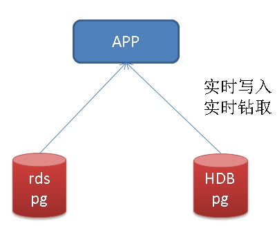
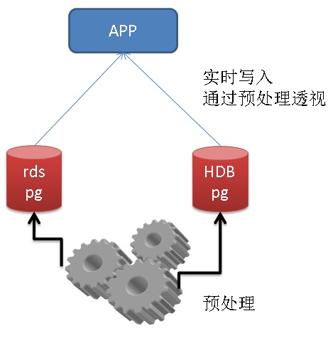
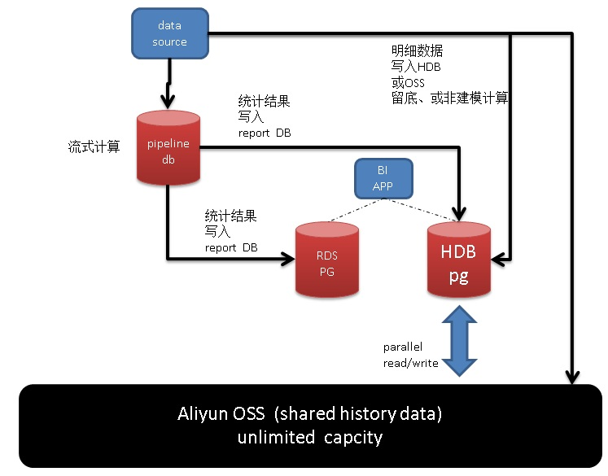
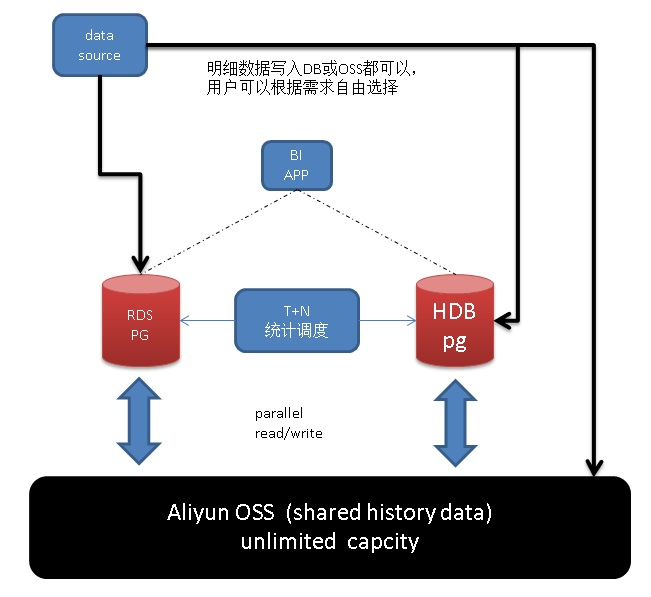
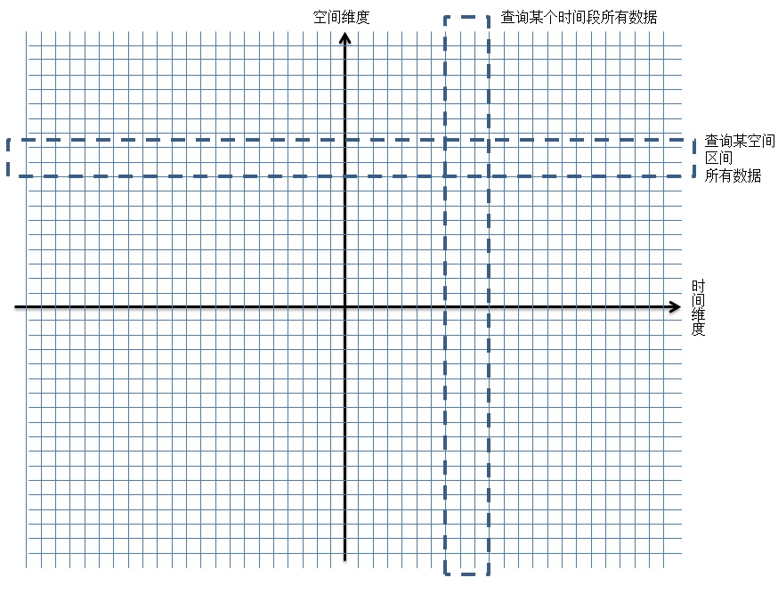
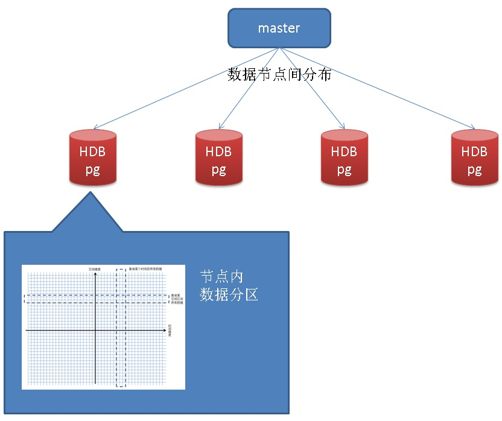
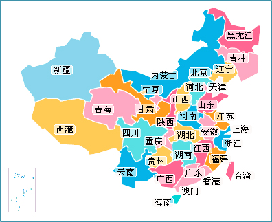
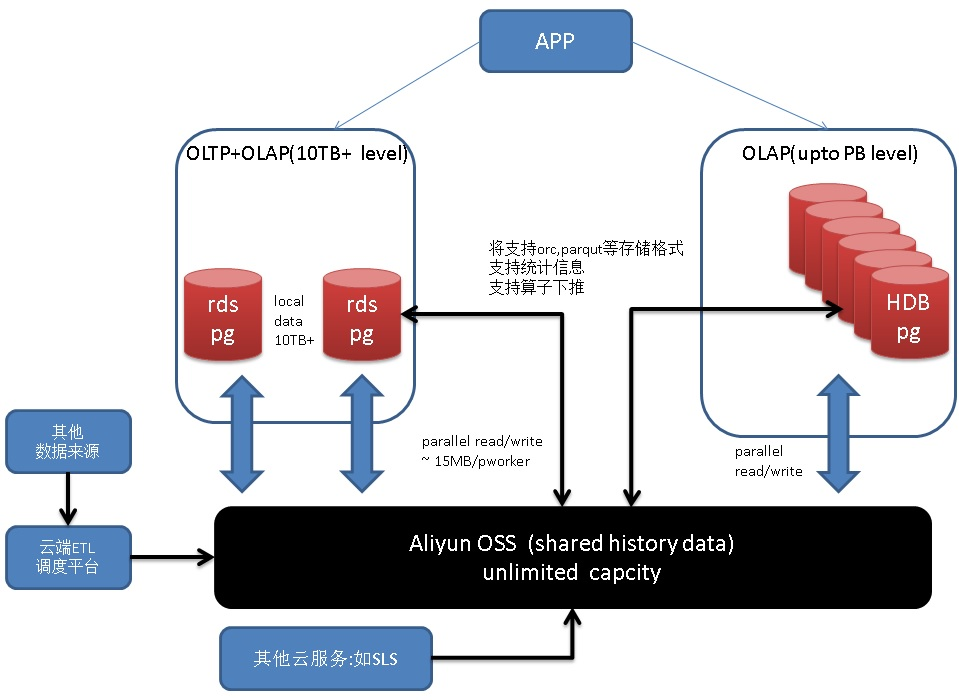
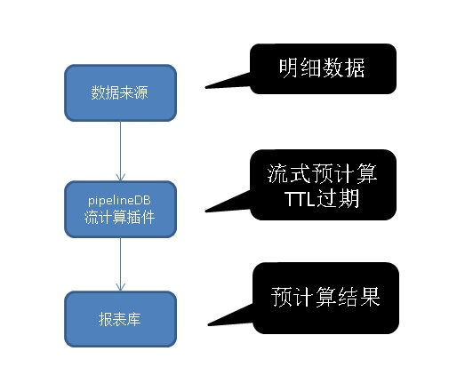

## PostgreSQL\GPDB 毫秒级海量时空数据透视 典型案例分享         
##### [TAG 18](../class/18.md)
                      
### 作者                      
digoal                      
                      
### 日期                      
2017-06-29                     
                      
### 标签                      
PostgreSQL , GIS , 时空数据 , 数据透视 , bitmapAnd , bitmapOr , multi-index , 分区 , brin , geohash cluster      
                      
----                      
                      
## 背景         
随着移动终端的普及，现在有越来越多的业务数据会包含空间数据，例如手机用户的FEED信息、物联网、车联网、气象传感器的数据、动物的溯源数据，一系列跟踪数据。  
  
这些数据具备这几个维度的属性：  
  
1、空间  
  
2、时间  
  
3、业务属性，例如温度、湿度、消费额、油耗、等。  
  
数据透视是企业BI、分析师、运营非常关心的，以往的透视可能是时间结合业务维度的，现在会加入空间的透视（例如某个点附近，在某个时间段的透视；或者某个省的数据透视；或者北纬度附近的数据透视等）。  
  
数据实时透视的一个关键点是预计算、实时计算、流式计算。下面有一个案例：  
  
[《PostgreSQL\GPDB 毫秒级海量多维数据透视 案例分享》](../201706/20170625_01.md)    
  
以上案例的数据中不包含空间维度，本文将介绍包含 "空间、时间、业务" 等多个维度数据透视的数据库设计和DEMO。  
    
## 一、场景介绍  
我们以一个场景为例，讲解时空数据透视。  
  
在滴滴、出租车、公交车、大巴、危化品车辆上安装了传感器，这些传感器的位置是跟着汽车流动的，同时这些传感器会不断的生成数据并上报数据。  
  
同时还有一些静止的传感器，也会上传并上报数据。  
  
数据结构有3种，根据不同的上报模式，对应不同的结构。  
  
1、单条上报模式  
  
```  
table  
(  
  sid int,       -- 传感器ID  
  pos geometry,  -- 传感器位置  
  ts timestamp,  -- 时间  
  val1 int,      -- 传感器探测到的属性1值  
  val2 float,    -- 传感器探测到的属性2值   
  val3 text      -- 传感器探测到的属性3值  
  ......   
)  
```  
  
2、批量上报模式，聚合后的明细(一条记录包含多个VALUE)  
  
```  
table  
(  
  sid int,         -- 传感器ID  
  pos geometry[],  -- 传感器位置数组  
  ts timestamp[],  -- 时间数组  
  val1 int[],      -- 传感器探测到的属性1值数组  
  val2 float[],    -- 传感器探测到的属性2值数组  
  val3 text[]      -- 传感器探测到的属性3值数组  
  ......   
)  
```  
  
3、批量上报模式，JSON打包的明细  
  
```  
table  
(  
  sid int,         -- 传感器ID  
  info jsonb       -- 批量打包数据 {k1: {pos:val, ts:val, val1:val, val2:val, ...}, k2: {}, k3: {}, ....}  
)  
```  
  
## 二、架构设计  
  
数据透视架构设计，分为两种，一种比较暴力，实时裸算，需要更多的计算能力，但是比较适合无法建模的透视需求。  
  
另一种，对于可以建模的透视，则可以通过预处理的方式，使用更低的成本，提高透视的响应速度。  
  
如下  
  
一、实时架构  
  
实时模式，指数据写入后，用户根据需求查询，统计结果。实时模式的查询响应速度取决于集群的计算能力，通常为了达到高速响应，需要大量的投入。  
  
    
  
实时计算除了提高计算能力，通常还可以通过任意列索引来提高透视的响应速度，例如：  
  
[《多字段，任意组合条件查询(无需建模) - 毫秒级实时圈人 最佳实践》](../201706/20170607_02.md)    
  
二、预处理架构  
  
预处理的方法较多，例如流式计算、T+N调度，lambda调度。  
  
    
  
1、流处理  
  
流计算可以选择PostgreSQL的pipelineDB插件（预计7月份插件化），支持TTL，滑动窗口，估值统计，以及PG内置的聚合统计函数等。性能也非常不错，单机可以达到100万行/s的处理速度。  
  
[《流计算风云再起 - PostgreSQL携PipelineDB力挺IoT》](../201612/20161220_01.md)    
  
数据来源实时写入pipelinedb进行流式计算，流式计算的结果（例如统计维度为天，TTL设置为7天，每天将前天的统计结果写入报表库RDS PG或者HDB PG），数据来源的明细数据如果要留底，则可以将其写入 HDB PG或OSS。  
  
这种架构设计，对于可以建模的透视，可以做到毫秒级的响应。对于无法建模的透视需求（需要使用明细进行实时的计算），同样可以使用HDB PG的并行计算能力，得到较快速度的响应。  
  
    
  
2、T+n 调度  
  
T+n 调度，实际上是一种常见的报表系统的做法，例如在凌晨将明细数据导入到数据库或者OSS中，根据建模，生成报表。  
  
案例如下：  
  
[《PostgreSQL\GPDB 多维数据透视典型案例分享》](../201706/20170625_01.md)   
  
    
  
3、lambda 调度  
  
T+N调度，只是将流计算节点更换成HDB PG或者RDS PG，通过FUNCIONT和任务调度的方式，增量的对建模数据进行统计和合并统计结果。  
  
案例如下：  
  
[《(流式、lambda、触发器)实时处理大比拼 - 物联网(IoT)\金融,时序处理最佳实践》](../201705/20170518_01.md)    
  
## 三、分区规则设计  
分区规则指数据在某一个数据节点内的分区规则，分区规则应考虑到数据的查询方式，例如经常按时间、空间范围搜索或查询，所以我们有两个分区维度。  
  
PostgreSQL, HDB都支持多级分区，因此可以在这两个维度上进行多级分区。  
  
```  
   [ PARTITION BY partition_type (column)  
       [ SUBPARTITION BY partition_type (column) ]   
          [ SUBPARTITION TEMPLATE ( template_spec ) ]  
       [...]  
    ( partition_spec )   
        | [ SUBPARTITION BY partition_type (column) ]  
          [...]  
    ( partition_spec   
      [ ( subpartition_spec   
           [(...)]   
         ) ]   
    )  
  
  
where partition_type is:  
    LIST  
  | RANGE  
  
  
where partition_specification is:  
partition_element [, ...]  
  
and partition_element is:  
   DEFAULT PARTITION name  
  | [PARTITION name] VALUES (list_value [,...] )  
  | [PARTITION name]   
     START ([datatype] 'start_value') [INCLUSIVE | EXCLUSIVE]  
     [ END ([datatype] 'end_value') [INCLUSIVE | EXCLUSIVE] ]  
     [ EVERY ([datatype] [number | INTERVAL] 'interval_value') ]  
  | [PARTITION name]   
     END ([datatype] 'end_value') [INCLUSIVE | EXCLUSIVE]  
     [ EVERY ([datatype] [number | INTERVAL] 'interval_value') ]  
[ WITH ( partition_storage_parameter=value [, ... ] ) ]  
[column_reference_storage_directive [, ...] ]  
  
  
where subpartition_spec or template_spec is:  
subpartition_element [, ...]  
and subpartition_element is:  
   DEFAULT SUBPARTITION name  
  | [SUBPARTITION name] VALUES (list_value [,...] )  
  | [SUBPARTITION name]   
     START ([datatype] 'start_value') [INCLUSIVE | EXCLUSIVE]  
     [ END ([datatype] 'end_value') [INCLUSIVE | EXCLUSIVE] ]  
     [ EVERY ([datatype] [number | INTERVAL] 'interval_value') ]  
  | [SUBPARTITION name]   
     END ([datatype] 'end_value') [INCLUSIVE | EXCLUSIVE]  
     [ EVERY ([datatype] [number | INTERVAL] 'interval_value') ]  
[ WITH ( partition_storage_parameter=value [, ... ] ) ]  
[column_reference_storage_directive [, ...] ]  
[ TABLESPACE tablespace ]  
```  
  
1、时间范围，例如每天一个分区。  
  
2、GEOHASH范围，geohash是经纬坐标的编码值，代表一个BOX，编码长度决定了它的精度(BOX的大小)，相邻的BOX的编码PREFIX相同。因此使用geohash进行范围编码是可行的。  
  
例如用户需要搜索某个时间段的数据，可以使用分区规则，挑选出对应的分区进行查询，从而缩小搜索的范围。  
  
用户需要搜索某个空间范围的数据，通过GEOHASH范围分区，同样可以挑选出对应的分区进行查询，从而缩小搜索的范围。  
  
    
  
HDB不仅仅支持geohash同时支持geometry，在geometry上可以建立GiST空间索引，使用空间索引可以支持KNN检索（精准检索，与BOX无关）。      
  
## 四、分布规则设计  
分布规则指数据在多个数据节点层面的分布，不要与分区规则一致。我们可以选择随机或者业务相关字段作为分布规则，同时需要考虑数据的倾斜。  
  
关于分区和分布列的选择，可以参考这篇文档：  
  
[《Greenplum 最佳实践 - 数据分布黄金法则 - 分布列与分区的选择》](../201607/20160719_02.md)    
  
1、随机分布，数据将随机写入不同的数据节点，保证了数据的均匀性。但是查询时，需要调用所有数据节点进行查询。如果是JOIN，还会涉及数据的重分布。  
  
2、业务ID，按业务ID来分布，当按业务ID进行查询时，只需要调用对应业务ID所在数据节点，但是请务必考虑到数据倾斜，例如某个业务ID的数据特别多，那么可能导致分布不均匀。  
  
PS：（一致性HASH解决了分布不均匀的问题。）  
  
    
  
## 五、预计算设计  
对于可以建模的透视需求，预计算是可以大幅度提升透视响应时间的手段。  
  
除了业务指标维度，常见的还有时间、空间维度的预计算。  
  
统计有一个相通性，都是基于分组进行，比如时间分组（小时，天，月，年等），空间分组（行政区，box，GEOHASH，GRID等）。  
  
### 预计算 - 固定时间  
例如业务要查询天、月、年的报表。那么我们可以按天进行预计算。  
  
使用GROUPING SETS语法进行多维透视。  
  
```  
insert into result  
select date(crt_time),col1,col2,col3,...,agg_func1(),agg_func2(),...   
from table  
  where crt_time between ? and ?  
  group by date(crt_time),GROUPING SETS(col1,col2,col3,...);  
```  
  
### 预计算 - 滑动时间窗口  
在《星际穿越》这部电影中，未来的人类构造了一个五维空间，让主人公可以在过去的时间中穿越，在过去的时间内任意的滑动。  
  
    
  
实际上数据透视，也有类似的滑动需求，可能需要查询过去任意时间窗口的统计。  
  
例如，查询 2017-06-27 13:50:00 前后30分钟的统计。  
  
有两种方式实现滑动窗口：  
  
1、非预计算，即根据明细直接进行统计。  
  
2、若预计算需要支持滑动窗口，我们需要进行更小粒度的统计，例如窗口大小为1小时，那么细粒度至少要小于一小时，例如使用半小时的粒度，在查询滑动窗口时，将细粒度的统计结果进行二次统计得到滑动窗口的统计结果。  
  
pipelineDB的滑动窗口也是这么来实现的。  
  
http://docs.pipelinedb.com/sliding-windows.html  
  
### 预计算 - 固定行政区  
为了实现空间维度的预计算，我们需要将空间数据进行分组，这个分组也是根据业务对空间数据透视的需求来的。  
  
例子  
  
1、业务需要根据区级行政区进行统计，那么我们可以根据区级行政区进行预计算，（图片取自互联网）。  
  
  
  
首先需要有翻译行政区ID的函数支持，根据经纬度，返回该经纬度属于哪个行政区的ID。  
  
一个比较土的方法，用一张表来表示行政区的多边形geometry，通过gist索引，可以快速的返回某个经纬度属于哪个多边形。  
  
```  
table (  
  ID int,        -- 行政区ID  
  bb geometry    -- 行政区的多边形  
)  
  
create or replace function get_id(pos geometry) returns int as $$  
  select id from table where bb && pos limit 1;  
$$ language sql strict immutable;  
```  
  
统计  
  
```  
insert into result  
select get_id(pos),col1,col2,col3,...,agg_func1(),agg_func2(),...   
from table  
  where crt_time between ? and ?  
  group by get_id(pos),GROUPING SETS(col1,col2,col3,...);  
```  
  
2、按GEOHASH PREFIX进行统计，例如去5位长度的hash，聚合。（通过PostGIS的ST_GeoHash()函数计算经纬度geohash value。）  
  
  
  
```  
insert into result  
select ST_GeoHash(pos,5),col1,col2,col3,...,agg_func1(),agg_func2(),...   
from table  
  where crt_time between ? and ?  
  group by ST_GeoHash(pos,5),GROUPING SETS(col1,col2,col3,...);  
```  
  
GEOHASH精度如下  
  
```  
so one symbol (letters or digits) is base 32 (8 bits) Each first bit is used for high or low window,   
then subsequent bits divide the precision by 2.   
  
(so divide by 8 in the best case) but there is an alternance between lat and long precision,   
so it ends up dividing by 4 and 8 alternatively.  
  
#   km        
1   ±2500  
2   ±630  
3   ±78  
4   ±20  
5   ±2.4  
6   ±0.61  
7   ±0.076  
8   ±0.019  
9   ±0.0024  
10  ±0.00060  
11  ±0.000074  
  
Note that, as mentioned on the Wiki page, those values come from a location near the equator,   
where a degree has nearly the same lenght in X and Y.   
  
For a more accurate information, you should start from the lat and long errors,   
and compute the km precision along X-axis based on the latitude of your position.  
```  
  
### 预计算 - 滑动空间窗口(点辐射)  
空间维度的滑动窗口，实现方法和时间维度的滑动窗口类似，例如我们可以对8位编码的geohash进行统计，然后我们可以按5位geohash编码进行二次聚合透视。  
  
  
  
空间滑动和时间滑动窗口一样，使用预计算都会有一定的失真。（因为边界无法做到完全清晰。）  
  
如果用户在意这样的失真，可以考虑实时计算。  
  
业务维度的预计算与时间、空间维度类似，就不赘述了。  
  
## 六、透视设计  
  
### 透视需求 - 固定时间  
  
```  
select sum,avg,count,min,max,hll,....   
  from result   
where   
  ts =   
  and val1 =   
  and ...;  
```  
  
### 透视需求 - 滑动窗口  
  
通过预计算实现的滑动，需要进行二次聚合。方法如下：  
  
```  
sum = sum(sum)  
count = sum(count)  
min = min(min)  
max = max(max)  
avg = sum(sum)/sum(count)  
hll = hll_union_agg(hll)  
```  
  
```  
select sum(sum),sum(count),hll_union_agg(hll),...  
  from result   
where   
  ts between ? and ?  
  and val1 =   
  and ...;  
```  
  
### 透视需求 - 固定行政区  
  
```  
select sum,avg,count,min,max,hll,....   
  from result   
where   
  loc_id = ?  
  and val1 =   
  and ...;  
```  
  
### 透视需求 - 滑动空间窗口(点辐射)  
  
```  
sum = sum(sum)  
count = sum(count)  
min = min(min)  
max = max(max)  
avg = sum(sum)/sum(count)  
hll = hll_union_agg(hll)  
```  
  
```  
select sum(sum), sum(count), hll_union_agg(hll), ...  
  from result   
where   
  substring(geohash_val, 1, 5) = ?   
  and val1 =   
  and ...;  
```  
  
## 七、结合OSS  
实际上，如果用户不需要查询明细，或者用户不需要频繁的要求低延迟的查询少量明细的话，明细数据是不需要进入数据库的，导入OSS即可。  
  
    
  
用户可以使用RDS PG或HDB PG，并发的访问OSS，从而达到实时透视，或者预计算的目的。  
  
## 八、流计算，lambda  
  
[《流计算风云再起 - PostgreSQL携PipelineDB力挺IoT》](../201612/20161220_01.md)    
  
流计算的模式，用户根据数据结构创建流，并对流创建统计视图，然后激活这个统计视图，将数据实时写入数据库，数据库对流过的数据进行实时的统计，生成统计结果。  
  
如果统计结果本身也非常庞大，那么我们可以使用TTL统计视图，定期将统计结果转移到HDB即可。  
  
  
  
例子  
  
定义流  
  
```  
create stream s1 (  
  sid int,       -- 传感器ID  
  pos geometry,  -- 传感器位置  
  ts timestamp,  -- 时间  
  val1 int,      -- 传感器探测到的属性1值  
  val2 float,    -- 传感器探测到的属性2值   
  val3 text      -- 传感器探测到的属性3值  
  ......   
);  
```  
  
定义TTL统计视图，保留1周  
  
```  
CREATE CONTINUOUS VIEW v1 WITH (ttl = '7 day', ttl_column = 'crt_time') AS  
select date(crt_time) crt_time,col1,col2,col3,...,agg_func1(),agg_func2(),...   
from table  
  group by date(crt_time),GROUPING SETS(col1,col2,col3,...);  
```  
  
激活统计视图  
  
```  
ACTIVATE v1;   
```  
  
定期数据转移  
  
```  
insert into result  
  select * from v1 where crt_time = '昨天';  
```  
  
数据透视  
  
```  
select * from result ....;  
```  
  
## 九、小结  
  
1、为什么不使用时间、空间复合索引？  
  
当用户需要查询某个时间区间，某个点附近N公里的数据时，有什么快速定位到目标明细数据的方法？  
  
在实际维度建索引、在空间维度建索引，只能快速的收敛到一个维度，另一维度需要通过HEAP得到TUPLE后进行RECHECK和过滤。  
  
为什么不建立时间、空间两个字段的复合索引呢？因为都是连续查询，所以这类复合索引都需要扫描驱动列的所有索引ENTRY。  
  
复合索引对于驱动列为等值的查询效率是很高的。  
  
对于时间、空间双维度数据查询，建议使用分区的方法，分区是最有效的可以缩小数据范围的方法。  
  
空间维度的分区，建议使用GEOHASH的range分区。  
  
2、毫秒级任意维度透视的核心，预计算。  
  
3、数据估算类型：HLL。有助于用户快速的查询唯一值数量，新增值数量。  
  
4、如果用户需要对明细VALUE进行聚合，可以使用数组、JSONB等字段存储聚合明细。  
  
5、阿里云 **RDS PG、HDB for PG、OSS、流计算插件、云端ETL调度任务服务** , 为毫秒级的时间、空间任意维度数据透视提供了一个完整的大数据实时计算的解决方案。  
      
- [RDS PostgreSQL](https://www.aliyun.com/product/rds/postgresql)   
  
- [HDB PostgreSQL](https://www.aliyun.com/product/gpdb)   
  
- [OSS](https://www.aliyun.com/product/oss)   
  
6、对于空间数据，除了使用GiST索引，我们还有一个更省成本的索引BRIN索引，按st_geohash规整数据后，过滤性非常棒。建议一定要看一下，你会开阔更多的优化思路的：
  
[《PostGIS空间索引(GiST、BRIN、R-Tree)选择、优化 - 阿里云RDS PostgreSQL最佳实践》](../201708/20170820_01.md) 
  
[《PostgreSQL BRIN索引的pages_per_range选项优化与内核代码优化思考》](../201708/20170824_01.md)
  
[《Greenplum 空间(GIS)数据检索 b-tree & GiST 索引实践 - 阿里云HybridDB for PostgreSQL最佳实践》](../201708/20170824_02.md)
  
[《通过空间思想理解GiST索引的构造》](../201708/20170825_01.md)  
    
## 参考  
http://docs.pipelinedb.com/sliding-windows.html  
  
[《PostgreSQL\GPDB 多维数据透视典型案例分享》](../201706/20170625_01.md)   
  
[《(流式、lambda、触发器)实时处理大比拼 - 物联网(IoT)\金融,时序处理最佳实践》](../201705/20170518_01.md)    
      
  
<a rel="nofollow" href="http://info.flagcounter.com/h9V1"  ></a>  
  
  
  
  
  
  
## [digoal's 大量PostgreSQL文章入口](https://github.com/digoal/blog/blob/master/README.md "22709685feb7cab07d30f30387f0a9ae")
  
