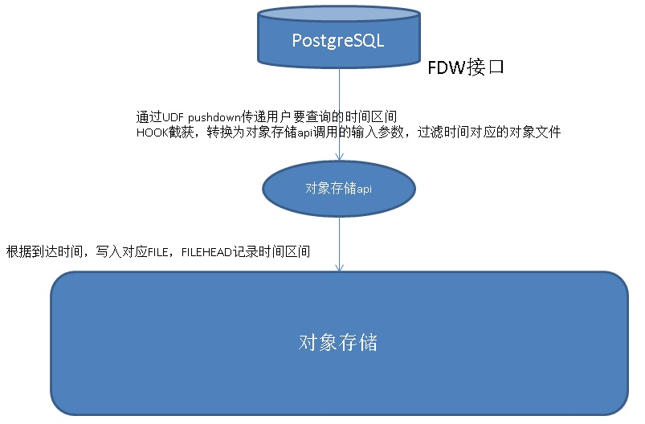

## PostgreSQL FDW 伪列实现 时序数据存储自动分区 - FUNCTION pushdown  
##### [TAG 18](../class/18.md)
                
### 作者              
digoal              
              
### 日期              
2017-06-30              
              
### 标签              
PostgreSQL , FDW , 伪列 , function pushdown , DS , 时序数据         
              
----              
              
## 背景   
金融、气象、物联网、互联网等行业，有特别多的时序数据，例如股票的交易数据，气象传感器的采集数据，车联网的轨迹数据，互联网的FEED数据，都具有非常强的时序属性。  
  
时序数据如何有效的存储、方便的使用呢？  
  
例如这样的写入  
  
```  
create table xx (xxx) ts interval day;  
  
insert into table values (x,x,x,x) ;   
```  
  
数据可以根据到达时间，自动写入对应时间存储分片中。  
  
而这样的查询，会自动从对应的存储分片中获取数据。  
  
```  
select * from table where ts between ? and ?;  
```  
  
这样的功能是很好实现的，例如使用分区表，每个分区对应一个时间片。  
  
PostgreSQL的timescale插件，就可以方便的实现时序数据存取的功能。  
  
但是本文讲的是另一种时序实现方法，当我们不想把数据存在本地，而是想存到外部时（例如对象存储），PG提供了一个FDW的接口，阿里云RDS PG提供了一种OSs_fdw允许用户将数据写入OSS对象存储，而不落数据库。  
  
有没有一种简单的方法可以将时序数据写入外部，并且查询时还能从中获取对应的分片，减少数据传输呢？  
  
使用FDW分区表是一种方法，如果INTERVAL很细的话，会造成分区表过多，分区表过多至少目前是会有一定的影响。（例如每小时一个分区，一年一章报就有365*24个分区）。  
  
有没有更好的方法呢？  
  
## 伪列  
  
通过伪列实现是不错的，用户不需要存储一个真实的时间字段，而是将数据到达时间作为一个条件，将对应记录写入对应的存储分片。  
  
同时可以在文件头部记录每个分片的时间区间。  
  
伪列实际是不存在的，所以表上其实没有这列，（类似PG的ctid,xmin,xmax,cmin,cmax列） 但是查询时如何将时间传给FDW呢？  
  
## 操作符, 函数 pushdown  
使用操作符、函数的pushdown，可以将一些信息传给FDW，使用HOOK，可以在中途截获这部分pushdown，转换成对应的请求发给远端，从而实现伪列的用户SQL接口和远端的消息传递。  
  
例如  
  
```  
select * from table where xxx and function(ts1, ts2);  
```  
  
中途截获SQL，得到ts1,ts2，传递给远端。  
  
PostgreSQL postgres_fdw插件支持的pushdown介绍如下，building function可以pushdown，extension的immutable function可以下推。  
  
我们自己定义FDW接口，也可以借鉴。  
  
```  
Remote Execution Options  
  
By default, only WHERE clauses using built-in operators and functions will be considered for execution on the remote server.   
  
Clauses involving non-built-in functions are checked locally after rows are fetched.   
  
If such functions are available on the remote server and can be relied on to produce the same results as they do locally,   
performance can be improved by sending such WHERE clauses for remote execution.   
  
This behavior can be controlled using the following option:  
  
  
extensions  
  
This option is a comma-separated list of names of PostgreSQL extensions that are installed, in compatible versions, on both the local and remote servers.   
  
Functions and operators that are immutable and belong to a listed extension will be considered shippable to the remote server.   
  
This option can only be specified for foreign servers, not per-table.  
  
When using the extensions option, it is the user's responsibility that the listed extensions exist and behave identically on both the local and remote servers.   
  
Otherwise, remote queries may fail or behave unexpectedly.  
  
  
fetch_size  
  
This option specifies the number of rows postgres_fdw should get in each fetch operation.   
  
It can be specified for a foreign table or a foreign server.   
  
The option specified on a table overrides an option specified for the server.   
  
The default is 100.  
```  
  
当然，这里面是存在一定的开发工作量的。  
  
实现后，PG+外部存储 能实现非常高效的时序数据写入和检索。  
  
  
  
## 参考  
http://www.timescale.com/  
  
  
<a rel="nofollow" href="http://info.flagcounter.com/h9V1"  ></a>  
  
  
  
  
  
  
## [digoal's 大量PostgreSQL文章入口](https://github.com/digoal/blog/blob/master/README.md "22709685feb7cab07d30f30387f0a9ae")
  
