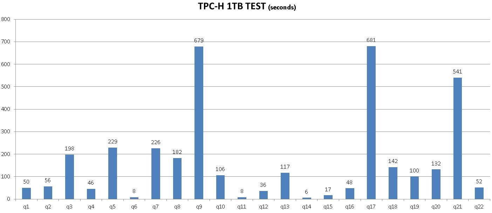
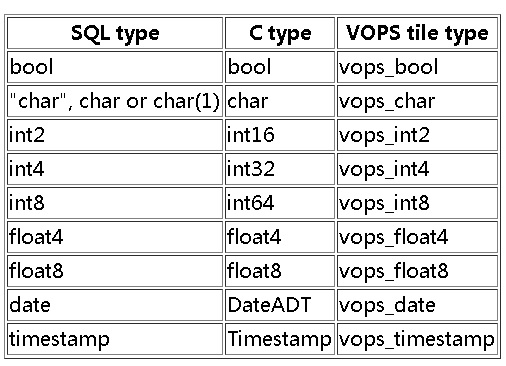
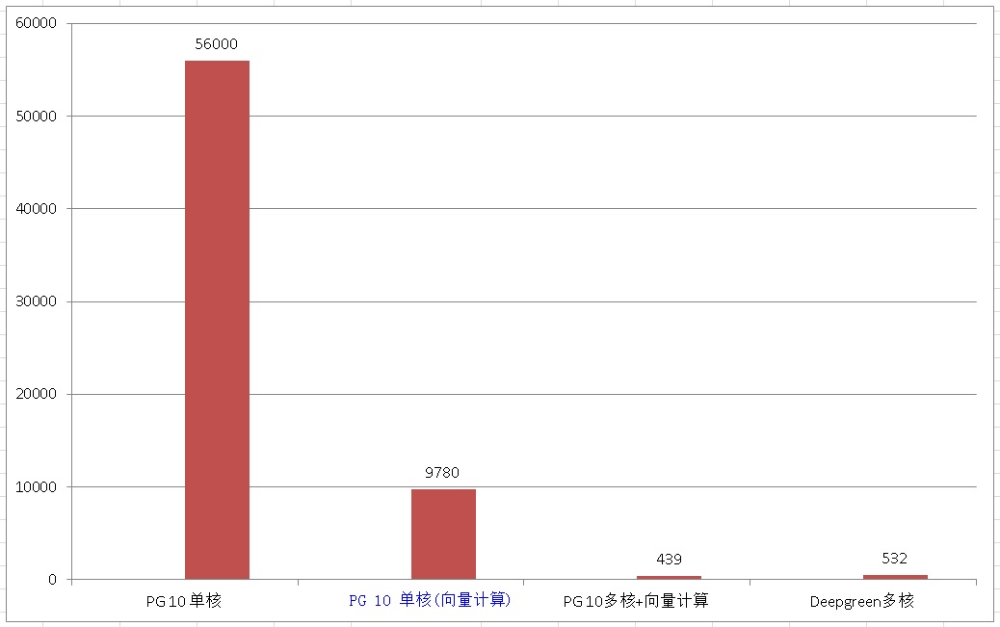
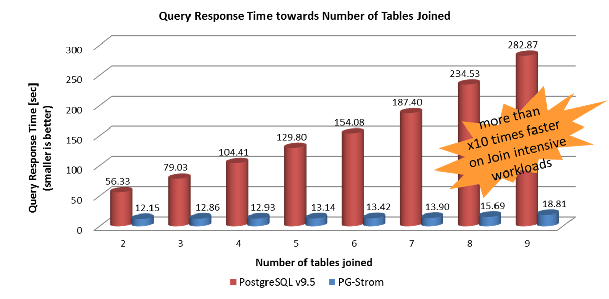
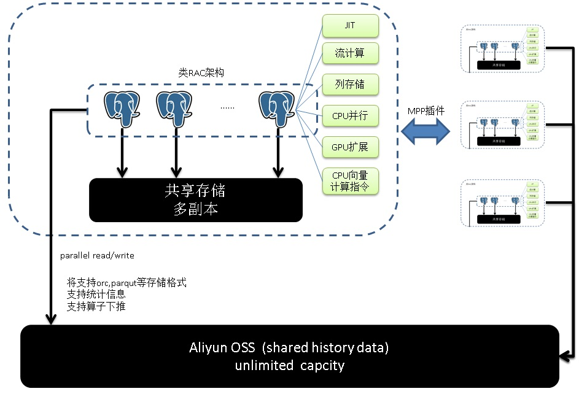

## 100TB级, 日增量1TB(100亿)的OLTP OLAP混合场景数据库设计方向     
     
### 作者      
digoal     
       
### 日期       
2017-07-03     
                
### 标签    
PostgreSQL , LLVM , JIT , 并行 , 列存储 , GPU      
      
----     
     
## 背景    
总量100TB，日增量1TB(日增约100亿记录)左右。这样的体量应该可以覆盖目前绝大多数企业的数据库体量。  
  
提到100TB级别，OLTP和OLAP的混合场景，大家可能会想到Oracle的一体机extradata，没错Oracle在这方面做得确实是非常棒的，但是价格也是很漂亮的。  
  
Oracle主要通过几个方面来提升它在这个级别的性能：  
  
共享存储+RAC架构，同时提升OLTP和OLAP的扩展能力，（OLTP：多个业务可以分配到多个主机上，但是需要注意数据库维护缓存一致性带来的性能下降问题，所以通常不同的主机访问不同的数据块是较好的设计），（OLAP：同一条SQL可以使用单机CPU多核甚至多个主机的CPU计算能力）。  
  
列存储，提升OLAP的性能。  
  
内部使用IB互联，解决了网络瓶颈的问题。  
  
在单纯的OLAP数据库方面，代表作有Greenplum, TeraData, AsterData等MPP数据库，比如GPDB就可以利用廉价的x86达到及其好的AP性能，我记得很多年前用6台4万左右的x86搭建的GPDB集群，以性能逾10倍多的差异干掉了2台IBM p570顶配的Oracle RAC。  
  
回到主题，开源界有没有应对OLTP+OLAP场景的数据库呢？  
  
大多数开源数据库选择了分而治之(sharding)的路线，因为大多数开源数据库单机做不到像Oracle那么好的性能。  
  
  
  
然而，sharding要做到体验和单机一样是非常困难的，包括分布式事务，全局一致性，全局时间点恢复，跨节点JOIN，节点间数据交换，数据重分布，扩容，窗口查询，聚合下推等都是巨大的调整。目前还没有哪个sharding技术敢说体验和单机一样，（通常sharding为了实现的便利，会阉割掉大量单机下面的功能）。  
  
其二，要支持OLAP其实仅仅sharding是不够的，还有大量的SQL兼容性的工作（例如多维分析、多表JOIN、窗口查询、递归查询、科学计算等等）。   
  
个人认为目前体验做得最好的sharding应该属Greenplum了，但是也仅仅局限在纯OLAP方面。  
  
开源数据库如果不走sharding路线，能稳定的扛住100TB+, 日增量1TB(日增约100亿记录)的OLTP OLAP混合场景吗？  
  
## PostgreSQL 100TB+, 日增量1TB的OLTP OLAP混合场景数据库设计  
  
### 从单机聊起  
以10万左右的 32Core + SSD 单机为例，聊一下单机能做到什么样的性能。  
  
### 单机OLTP性能如何? TPC-C  
tpc-c是OLTP的工业测试标准之一，商业数据库，硬件厂商大都会用TPC-C的测试结果来彰显自己的性能。  
  
PostgreSQL TPC-C在单机的一组测试数据(warehouses=3000, terminals=256)如下，（这组测试数据是机器上有其他混合应用时的测试数据，还有较大的提升空间，到120万tpmC应该没有问题。）。   
  
[《数据库界的华山论剑 tpc.org》](../201701/20170125_01.md)    
  
```  
08:54:57,345 [main] INFO   jTPCC : Term-00,   
08:54:57,348 [main] INFO   jTPCC : Term-00, +-------------------------------------------------------------+  
08:54:57,348 [main] INFO   jTPCC : Term-00,      BenchmarkSQL v5.0  
08:54:57,348 [main] INFO   jTPCC : Term-00, +-------------------------------------------------------------+  
08:54:57,348 [main] INFO   jTPCC : Term-00,  (c) 2003, Raul Barbosa  
08:54:57,349 [main] INFO   jTPCC : Term-00,  (c) 2004-2016, Denis Lussier  
08:54:57,350 [main] INFO   jTPCC : Term-00,  (c) 2016, Jan Wieck  
08:54:57,351 [main] INFO   jTPCC : Term-00, +-------------------------------------------------------------+  
08:54:57,351 [main] INFO   jTPCC : Term-00,   
08:54:57,351 [main] INFO   jTPCC : Term-00, db=postgres  
08:54:57,351 [main] INFO   jTPCC : Term-00, driver=org.postgresql.Driver  
08:54:57,351 [main] INFO   jTPCC : Term-00, conn=jdbc:postgresql://xxx.xxx.xxx.xxx:1921/db0  
08:54:57,351 [main] INFO   jTPCC : Term-00, user=benchmarksql  
08:54:57,351 [main] INFO   jTPCC : Term-00,   
08:54:57,351 [main] INFO   jTPCC : Term-00, warehouses=3000  
08:54:57,351 [main] INFO   jTPCC : Term-00, terminals=256  
08:54:57,353 [main] INFO   jTPCC : Term-00, runMins=30  
08:54:57,353 [main] INFO   jTPCC : Term-00, limitTxnsPerMin=0  
08:54:57,353 [main] INFO   jTPCC : Term-00, terminalWarehouseFixed=false  
08:54:57,354 [main] INFO   jTPCC : Term-00,   
08:54:57,354 [main] INFO   jTPCC : Term-00, newOrderWeight=45  
08:54:57,354 [main] INFO   jTPCC : Term-00, paymentWeight=43  
08:54:57,354 [main] INFO   jTPCC : Term-00, orderStatusWeight=4  
08:54:57,354 [main] INFO   jTPCC : Term-00, deliveryWeight=4  
08:54:57,354 [main] INFO   jTPCC : Term-00, stockLevelWeight=4  
08:54:57,354 [main] INFO   jTPCC : Term-00,   
08:54:57,354 [main] INFO   jTPCC : Term-00, resultDirectory=null  
08:54:57,354 [main] INFO   jTPCC : Term-00, osCollectorScript=null  
08:54:57,355 [main] INFO   jTPCC : Term-00,   
08:54:57,439 [main] INFO   jTPCC : Term-00, C value for C_LAST during load: 223  
08:54:57,440 [main] INFO   jTPCC : Term-00, C value for C_LAST this run:    138  
08:54:57,440 [main] INFO   jTPCC : Term-00,   
09:24:58,011 [Thread-46] INFO   jTPCC : Term-00,   
09:24:58,012 [Thread-46] INFO   jTPCC : Term-00,   
09:24:58,012 [Thread-46] INFO   jTPCC : Term-00, Measured tpmC (NewOrders) = 380234.68  
09:24:58,012 [Thread-46] INFO   jTPCC : Term-00, Measured tpmTOTAL = 844858.82  
09:24:58,012 [Thread-46] INFO   jTPCC : Term-00, Session Start     = 2017-01-27 08:54:57  
09:24:58,012 [Thread-46] INFO   jTPCC : Term-00, Session End       = 2017-01-27 09:24:58  
09:24:58,012 [Thread-46] INFO   jTPCC : Term-00, Transaction Count = 25346862  
```  
  
PostgreSQL的优化器完备（例如成熟的CBO体系，丰富的NODE运算方法等），在线事务处理能力方面，性能卓越。  
  
```  
  AGG_HASHED:  
  AGG_MIXED:  
  AGG_PLAIN:  
  AGG_SORTED:  
  
  JOIN_ANTI:  
  JOIN_FULL:  
  JOIN_INNER:  
  JOIN_LEFT:  
  JOIN_RIGHT:  
  JOIN_SEMI:  
    
  T_Agg:  
  T_Append:  
  T_BitmapAnd:  
  T_BitmapHeapScan:  
  T_BitmapIndexScan:  
  T_BitmapOr:  
  T_CteScan:  
  T_CustomScan:  
  T_ForeignScan:  
  T_FunctionScan:  
  T_Gather:  
  T_GatherMerge:  
  T_Group:  
  T_Hash:  
  T_HashJoin:  
  T_IndexOnlyScan:  
  T_IndexScan:  
  T_Limit:  
  T_LockRows:  
  T_Material:  
  T_MergeAppend:  
  T_MergeJoin:  
  T_ModifyTable:  
  T_NamedTuplestoreScan:  
  T_NestLoop:  
  T_ProjectSet:  
  T_RecursiveUnion:  
  T_Result:  
  T_SampleScan:  
  T_SeqScan:  
  T_SetOp:  
  T_Sort:  
  T_SubqueryScan:  
  T_TableFuncScan:  
  T_TidScan:  
  T_Unique:  
  T_ValuesScan:  
  T_WindowAgg:  
  T_WorkTableScan:  
```  
  
### 单机OLAP性能如何? TPC-H  
tpc-h是OLA的工业测试标准之一，有大量的JOIN，GROUP等大运算量的操作。大多数的商业AP数据库会以tpc-h测试结果来彰显自己的性能。  
  
测试使用这个github:   https://github.com/digoal/gp_tpch    
  
PG 10的数据请做如下优化   
  
1\. postgresql.conf  
  
```
listen_addresses = '0.0.0.0'
port = 1921
max_connections = 500
superuser_reserved_connections = 13
unix_socket_directories = '.'
shared_buffers = 128GB
work_mem = 8GB
maintenance_work_mem = 32GB
autovacuum_work_mem = 8GB
dynamic_shared_memory_type = posix
vacuum_cost_delay = 0
bgwriter_delay = 10ms
bgwriter_lru_maxpages = 500
bgwriter_lru_multiplier = 5.0
bgwriter_flush_after = 0
effective_io_concurrency = 0
max_worker_processes = 256
max_parallel_workers_per_gather = 24
max_parallel_workers = 128
backend_flush_after = 0
wal_level = minimal
synchronous_commit = off
full_page_writes = off
wal_buffers = 2047MB
wal_writer_delay = 10ms
wal_writer_flush_after = 0
checkpoint_timeout = 30min
max_wal_size = 256GB
min_wal_size = 80GB
checkpoint_completion_target = 0.5
checkpoint_flush_after = 0
max_wal_senders = 0
enable_mergejoin = off
enable_nestloop = off
random_page_cost = 1.3
parallel_tuple_cost = 0
parallel_setup_cost = 0
min_parallel_table_scan_size = 0 
min_parallel_index_scan_size = 0
effective_cache_size = 128GB
log_destination = 'csvlog'
logging_collector = on
log_timezone = 'PRC'
autovacuum_vacuum_cost_delay = 0
autovacuum_vacuum_cost_limit = 0
datestyle = 'iso, mdy'
timezone = 'PRC'
lc_messages = 'C'
lc_monetary = 'C'
lc_numeric = 'C'
lc_time = 'C'
default_text_search_config = 'pg_catalog.english'
```
    
2\. option优化  
  
```
 public | customer      | table | postgres | 29 GB   | 
 public | lineitem      | table | postgres | 997 GB  | 
 public | nation        | table | postgres | 40 kB   | 
 public | orders        | table | postgres | 216 GB  | 
 public | part          | table | postgres | 33 GB   | 
 public | partsupp      | table | postgres | 143 GB  | 
 public | region        | table | postgres | 40 kB   | 
 public | supplier      | table | postgres | 1844 MB | 

alter table customer set (parallel_workers = 32);
alter table lineitem set (parallel_workers = 32);
alter table orders set (parallel_workers = 32);
alter table part set (parallel_workers = 32);
alter table partsupp set (parallel_workers = 32);
alter table supplier set (parallel_workers = 24);
```
  
3\. orders,lineitem data优化  
  
```
# cluster:  

1. orders
order by o_orderdate,o_orderstatus

2. lineitem
order by l_shipdate,l_linestatus,l_commitdate,l_receiptdate

# brin idx:
create index idx1 on orders using brin(o_orderdate);
create index idx2 on orders using brin(o_orderstatus);
create index idx3 on lineitem using brin(l_shipdate);
create index idx4 on lineitem using brin(l_linestatus);
create index idx5 on lineitem using brin(l_commitdate);
create index idx6 on lineitem using brin(l_receiptdate);

# 数据统计信息

postgres=# select attname,n_distinct,correlation from pg_stats where tablename='lineitem2';
     attname     | n_distinct  | correlation 
-----------------+-------------+-------------
 l_orderkey      | 4.06174e+07 |  -0.0037104
 l_partkey       |          -1 |  0.00409942
 l_suppkey       | 1.06803e+07 |  0.00685116
 l_linenumber    |           7 |    0.180298
 l_quantity      |          50 |   0.0184784
 l_extendedprice | 2.57752e+06 |   -0.001465
 l_discount      |          11 |   0.0820425
 l_tax           |           9 |    0.118235
 l_returnflag    |           3 |    0.183667
 l_linestatus    |           2 |           1
 l_shipdate      |        2491 |           1
 l_commitdate    |        2457 |    0.998449
 l_receiptdate   |        2515 |    0.999927
 l_shipinstruct  |           4 |    0.249326
 l_shipmode      |           7 |    0.141158
 l_comment       | 1.03348e+06 | -0.00203378
(16 rows)

postgres=# select attname,n_distinct,correlation from pg_stats where tablename='orders';
     attname     | n_distinct  | correlation  
-----------------+-------------+--------------
 o_orderkey      |          -1 |   0.00226882
 o_shippriority  |           1 |            1
 o_comment       | 4.36756e+07 |  0.000669195
 o_custkey       | 6.16305e+07 | -0.000200988
 o_orderstatus   |           3 |     0.962756
 o_totalprice    | 3.65714e+07 |   -0.0022367
 o_orderdate     |        2403 |            1
 o_orderpriority |           5 |     0.186165
 o_clerk         |      998950 |  -0.00599872
(9 rows)
```
  
1、PostgreSQL 10 1TB TPC-H在单机的一组测试数据(SF=1000，即1TB的量)。  
  
这组测试非常具有代表意义，例如用户每天新增1TB的数据增量，对增量进行统计，生成报表。  
  
  
  
PG 10 分区表的并行度目前不支持alter设置，需要UPDATE PG_CLASS, 例如   
  
```
update pg_class set reloptions =array['parallel_workers=32'] where relname ~ 'lineitem' and relkind='r';
update pg_class set reloptions =array['parallel_workers=32'] where relname ~ 'orders' and relkind='r';
```
  
从这组数据来看，日增量1TB的场景中，仅仅使用现有特性，PG已可以应付其OLAP需求。  
  
如果数据的线性相关性好(pg_stats.correlation接近1或-1)，可以不使用分区表。   
   
2、另外，在同一主机上，测了一组deepgreen的性能，1TB TPC-H跑完约1小时。（deepgreen是一个完全兼容Greenplum的MPP数据库，在列存储、SQL优化器、JIT、向量计算方面有大幅增强）。  
  
  
  
[deepgreen tpch explain result](20170703_01_explain.tar.bz2)  
  
为什么要测deepgreen？前面说了在OLAP性能方面，Greenplum已经远超Oracle。而Deepgreen的性能已在Greenplum之上。我们可以将deepgreen作为一个标杆（DP实际上也是基于PG开发的MPP版本），PostgreSQL将来在经过增强后OLAP方面有可能达到甚至超过DP的性能。  
  
如果PostgreSQL能达到DP的水平，超过Oracle自然没问题（没有对比就没有伤害，读者可以试试同样数据量的Oracle性能）。  
  
  
  
（PostgreSQL 10目前仅使用了JIT、多核并行、OP复用、分区表、哈希聚合、哈希分组 等若干对OLAP场景有较大性能提升的技术手段，还有列存储、向量计算、appendscan并行等手段可以使用，预计至少还有10倍左右的性能提升空间。）  
    
### 100TB+, 日增量超过1TB后 - PostgreSQL 黑科技  
  
除了PG 10已经具备的 JIT，多核并行、OP复用、分区表、哈希聚合、哈希分组，等OLAP场景黑科技，PostgreSQL还有哪些黑科技可用来大幅提升单机OLAP场景的性能？  
  
#### 1、JIT  
  
LLVM增强，目前PG 10已整合了JIT框架，但是要支持更多的算子。  
  
#### 2、向量化  
  
目前有一个PG插件，可以实现PG的向量计算。  
  
已支持的向量计算类型如下  
  
  
  
下面是一组使用向量化技术后的性能提升数据。  
  
```  
postgres=#   \d customer  
                                      Unlogged table "public.customer"  
    Column    |          Type          | Collation | Nullable |                   Default                     
--------------+------------------------+-----------+----------+---------------------------------------------  
 c_custkey    | bigint                 |           | not null | nextval('customer_c_custkey_seq'::regclass)  
 c_name       | character varying(25)  |           |          |   
 c_address    | character varying(40)  |           |          |   
 c_nationkey  | bigint                 |           | not null |   
 c_phone      | character(15)          |           |          |   
 c_acctbal    | double precision       |           |          |   
 c_mktsegment | character(10)          |           |          |   
 c_comment    | character varying(117) |           |          |   
  
  
postgres=# create unlogged table vops_customer (c_custkey vops_int8, c_nationkey vops_int8, c_acctbal vops_float8);  
CREATE TABLE  
postgres=# select populate(destination := 'vops_customer', source := 'customer');  
 populate    
-----------  
 150000000  
(1 row)  
  
postgres=# create unlogged table c as select c_custkey,c_nationkey,c_acctbal from customer;  
SELECT 150000000  
```  
  
测试时确保数据均在shared buffer中.  
  
使用向量化前，56秒。    
  
```  
postgres=# select sum(c_custkey),avg(c_custkey),min(c_custkey),max(c_custkey),sum(c_nationkey),avg(c_nationkey),min(c_nationkey),max(c_nationkey),sum(c_acctbal),min(c_acctbal),max(c_acctbal),avg(c_acctbal),count(*) from c;  
        sum        |          avg          | min |    max    |    sum     |         avg         | min | max |       sum       |   min   |   max   |       avg        |   count     
-------------------+-----------------------+-----+-----------+------------+---------------------+-----+-----+-----------------+---------+---------+------------------+-----------  
 11250000075000000 | 75000000.500000000000 |   1 | 150000000 | 1800117761 | 12.0007850733333333 |   0 |  24 | 675048124067.72 | -999.99 | 9999.99 | 4500.32082711813 | 150000000  
(1 row)  
  
Time: 55972.494 ms (00:55.972)  
  
postgres=# explain (analyze,verbose,timing,costs,buffers) select sum(c_custkey),avg(c_custkey),min(c_custkey),max(c_custkey),sum(c_nationkey),avg(c_nationkey),min(c_nationkey),max(c_nationkey),sum(c_acctbal),min(c_acctbal),max(c_acctbal),avg(c_acctbal),count(*) from c;  
                                                                                                         QUERY PLAN                                                                                                           
----------------------------------------------------------------------------------------------------------------------------------------------------------------------------------------------------------------------------  
 Aggregate  (cost=7330421.81..7330421.82 rows=1 width=200) (actual time=57319.855..57319.855 rows=1 loops=1)  
   Output: sum(c_custkey), avg(c_custkey), min(c_custkey), max(c_custkey), sum(c_nationkey), avg(c_nationkey), min(c_nationkey), max(c_nationkey), sum(c_acctbal), min(c_acctbal), max(c_acctbal), avg(c_acctbal), count(*)  
   Buffers: shared hit=955415  
   ->  Seq Scan on public.c  (cost=0.00..2455416.60 rows=150000160 width=24) (actual time=0.012..14185.622 rows=150000000 loops=1)  
         Output: c_custkey, c_nationkey, c_acctbal  
         Buffers: shared hit=955415  
 Planning time: 0.068 ms  
 Execution time: 57319.926 ms  
(8 rows)  
  
Time: 57320.443 ms (00:57.320)  
```  
  
使用向量化后，10秒。     
  
```  
postgres=# select sum(c_custkey),avg(c_custkey),min(c_custkey),max(c_custkey),sum(c_nationkey),avg(c_nationkey),min(c_nationkey),max(c_nationkey),sum(c_acctbal),min(c_acctbal),max(c_acctbal),avg(c_acctbal),countall(*) from vops_customer;   
        sum        |       avg        | min |    max    |    sum     |       avg        | min | max |       sum       |   min   |   max   |       avg        | countall    
-------------------+------------------+-----+-----------+------------+------------------+-----+-----+-----------------+---------+---------+------------------+-----------  
 11250000075000000 | 75000000.4473924 |   1 | 150000000 | 1800117761 | 12.0007850733333 |   0 |  24 | 675048124067.72 | -999.99 | 9999.99 | 4500.32082711813 | 150000000  
(1 row)  
  
Time: 9785.634 ms (00:09.786)  
  
postgres=# explain (analyze,verbose,timing,costs,buffers) select sum(c_custkey),avg(c_custkey),min(c_custkey),max(c_custkey),sum(c_nationkey),avg(c_nationkey),min(c_nationkey),max(c_nationkey),sum(c_acctbal),min(c_acctbal),max(c_acctbal),avg(c_acctbal),countall(*) from vops_customer;  
                                                                                                          QUERY PLAN                                                                                                             
-------------------------------------------------------------------------------------------------------------------------------------------------------------------------------------------------------------------------------  
 Aggregate  (cost=568359.38..568359.39 rows=1 width=104) (actual time=9707.393..9707.393 rows=1 loops=1)  
   Output: sum(c_custkey), avg(c_custkey), min(c_custkey), max(c_custkey), sum(c_nationkey), avg(c_nationkey), min(c_nationkey), max(c_nationkey), sum(c_acctbal), min(c_acctbal), max(c_acctbal), avg(c_acctbal), countall(*)  
   Buffers: shared hit=468750  
   ->  Seq Scan on public.vops_customer  (cost=0.00..492187.50 rows=2343750 width=1584) (actual time=0.008..842.816 rows=2343750 loops=1)  
         Output: c_custkey, c_nationkey, c_acctbal  
         Buffers: shared hit=468750  
 Planning time: 0.073 ms  
 Execution time: 9707.461 ms  
(8 rows)  
  
Time: 9709.400 ms (00:09.709)  
```  
  
PG 10采样向量化插件提升了N倍性能，叠加并行化，甚至可以超过DP的性能。  
  
使用向量化除了性能本身的提升，还可以更好的压缩数据。  
  
```  
非向量化存储  
postgres=# \dt+ c  
                    List of relations  
 Schema | Name | Type  |  Owner   |  Size   | Description   
--------+------+-------+----------+---------+-------------  
 public | c    | table | postgres | 7464 MB |   
(1 row)  
  
向量化存储  
postgres=# \dt+ vops_customer   
                         List of relations  
 Schema |     Name      | Type  |  Owner   |  Size   | Description   
--------+---------------+-------+----------+---------+-------------  
 public | vops_customer | table | postgres | 3663 MB |   
(1 row)  
```  
  
并行叠加向量计算的效果测试。  
  
PG 10: 439毫秒。   
   
```
postgres=# set max_parallel_workers_per_gather =48;
SET
postgres=# alter table vops_customer set (parallel_workers =48);
ALTER TABLE

postgres=# explain (analyze,verbose,timing,costs,buffers) select sum(c_custkey),avg(c_custkey),min(c_custkey),max(c_custkey),sum(c_nationkey),avg(c_nationkey),min(c_nationkey),max(c_nationkey),sum(c_acctbal),min(c_acctbal),max(c_acctbal),avg(c_acctbal),countall(*) from vops_customer;  
 Finalize Aggregate  (cost=470827.14..470827.15 rows=1 width=104) (actual time=315.794..315.794 rows=1 loops=1)
   Output: sum(c_custkey), avg(c_custkey), min(c_custkey), max(c_custkey), sum(c_nationkey), avg(c_nationkey), min(c_nationkey), max(c_nationkey), sum(c_acctbal), min(c_acctbal), max(c_acctbal), avg(c_acctbal), countall(*)
   Buffers: shared hit=476862
   ->  Gather  (cost=470825.20..470825.21 rows=48 width=176) (actual time=315.483..315.770 rows=49 loops=1)
         Output: (PARTIAL sum(c_custkey)), (PARTIAL avg(c_custkey)), (PARTIAL min(c_custkey)), (PARTIAL max(c_custkey)), (PARTIAL sum(c_nationkey)), (PARTIAL avg(c_nationkey)), (PARTIAL min(c_nationkey)), (PARTIAL max(c_nationkey)), (PAR
TIAL sum(c_acctbal)), (PARTIAL min(c_acctbal)), (PARTIAL max(c_acctbal)), (PARTIAL avg(c_acctbal)), (PARTIAL countall(*))
         Workers Planned: 48
         Workers Launched: 48
         Buffers: shared hit=476862
         ->  Partial Aggregate  (cost=470825.20..470825.21 rows=1 width=176) (actual time=300.421..300.421 rows=1 loops=49)
               Output: PARTIAL sum(c_custkey), PARTIAL avg(c_custkey), PARTIAL min(c_custkey), PARTIAL max(c_custkey), PARTIAL sum(c_nationkey), PARTIAL avg(c_nationkey), PARTIAL min(c_nationkey), PARTIAL max(c_nationkey), PARTIAL sum(c_
acctbal), PARTIAL min(c_acctbal), PARTIAL max(c_acctbal), PARTIAL avg(c_acctbal), PARTIAL countall(*)
               Buffers: shared hit=468750
               Worker 0: actual time=286.534..286.534 rows=1 loops=1
                 Buffers: shared hit=8616
......
               Worker 46: actual time=310.345..310.345 rows=1 loops=1
                 Buffers: shared hit=9389
               Worker 47: actual time=310.727..310.727 rows=1 loops=1
                 Buffers: shared hit=9280
......
               ->  Parallel Seq Scan on public.vops_customer  (cost=0.00..469238.28 rows=48828 width=1584) (actual time=0.017..114.654 rows=47832 loops=49)
                     Output: c_custkey, c_nationkey, c_acctbal
                     Buffers: shared hit=468750
                     Worker 0: actual time=0.021..107.447 rows=43080 loops=1
                       Buffers: shared hit=8616
                     Worker 1: actual time=0.019..109.747 rows=42325 loops=1
......
                     Worker 47: actual time=0.018..119.142 rows=46400 loops=1
                       Buffers: shared hit=9280
 Planning time: 0.135 ms
 Execution time: 439.027 ms
(208 rows)
```
   
相对应的deepgreen测试如下: 532毫秒.      
  
```
postgres=# select sum(c_custkey),avg(c_custkey),min(c_custkey),max(c_custkey),sum(c_nationkey),avg(c_nationkey),min(c_nationkey),max(c_nationkey),sum(c_acctbal),min(c_acctbal),max(c_acctbal),avg(c_acctbal),count(*) from customer;   
        sum        |    avg     | min |    max    |    sum     |       avg        | min | max |       sum        |   min   |   max   |       avg        |   count   
-------------------+------------+-----+-----------+------------+------------------+-----+-----+------------------+---------+---------+------------------+-----------
 11250000075000000 | 75000000.5 |   1 | 150000000 | 1800117761 | 12.0007850733333 |   0 |  24 | 675048124068.057 | -999.99 | 9999.99 | 4500.32082712038 | 150000000
(1 row)

Time: 531.973 ms

postgres=# explain analyze select sum(c_custkey),avg(c_custkey),min(c_custkey),max(c_custkey),sum(c_nationkey),avg(c_nationkey),min(c_nationkey),max(c_nationkey),sum(c_acctbal),min(c_acctbal),max(c_acctbal),avg(c_acctbal),count(*) from customer;   
                                                                 QUERY PLAN                                                                  
---------------------------------------------------------------------------------------------------------------------------------------------
 Aggregate  (cost=7151025.61..7151025.62 rows=1 width=200)
   Rows out:  1 rows with 0.001 ms to first row, 330 ms to end, start offset by 1.624 ms.
   ->  Gather Motion 48:1  (slice1; segments: 48)  (cost=7151025.03..7151025.53 rows=1 width=224)
         Rows out:  48 rows at destination with 458 ms to end, start offset by 1.625 ms.
         ->  Aggregate  (cost=7151025.03..7151025.04 rows=1 width=224)
               Rows out:  Avg 1.0 rows x 48 workers.  Max 1 rows (seg0) with 0.002 ms to first row, 471 ms to end, start offset by 4.299 ms.
               ->  Append-only Columnar Scan on customer  (cost=0.00..2276025.00 rows=3125000 width=24)
                     Rows out:  0 rows (seg0) with 57 ms to end, start offset by 71 ms.
 Slice statistics:
   (slice0)    Executor memory: 443K bytes.
   (slice1)    Executor memory: 18722K bytes avg x 48 workers, 18722K bytes max (seg0).
 Statement statistics:
   Memory used: 128000K bytes
 Settings:  optimizer=off
 Optimizer status: legacy query optimizer
 Total runtime: 789.744 ms
(16 rows)

Time: 791.114 ms
```
  
  
  
PG 10 多核+向量计算组合后，已和Deepgreen的分析性能持平甚至略好。（要知道测试中，PG10 还没有使用正儿八经的列式存储呢，还有提升的潜力。）       
  
[PostgreSQL VOPS guide](20170703_01_vops.html)  
    
[PostgreSQL VOPS 向量计算中文guide](../201702/20170225_01.md)  
  
#### 3、多核并行  
  
目前PG已支持大多数NODE的多核并行，例如SEQ SCAN，INDEX SCAN，HASH AGG，SORT等。将来会支持更多的NODE。  
  
比如将要支持 APPEND 并行，那么多个分区表(或者多个继承表、多个外部表、以及union查询)都可以并行扫描，理论上这个FEATURE加上后，性能和开源版本Greenplum应该可以对齐。    
   
同时还需要提供一种绕过OS PAGE CACHE的数据扫描方法，比如DIO，在OLAP场景会非常有用。（例如突然发起一个大量数据的查询请求，不至于把CACHE打乱。）     
    
#### 4、列存储  
  
目前PG内置的是行存储，要支持列存储，可以安装列存储插件，例如IMCS插件，CSTORE插件。  
  
使用列存储，可以提升数据压缩比，同时降低列统计时的数据扫描量和deform开销，提升列统计性能，以及更好的支持向量计算（目前VOPS向量计算通过新增数据类型，批量瓦片式存储来实现，比较别扭）等。  
  
列存插件如下：  
  
https://github.com/knizhnik/imcs  
  
https://github.com/citusdata/cstore_fdw  
  
期待未来的PG版本可以支持列存储。  
  
#### 5、hll  
  
通过hhl插件，可以支持一些估值统计的问题，在用户允许一些误差的情况下，高效率的实现实时的PV,UV等查询需求。例如实时查询APP的uv TOP 10。  
  
hll的插件如下：  
  
https://github.com/citusdata/cstore_fdw  
  
#### 6、GPU  
  
CPU的计算能力有限，通过GPU可以大幅提升OLAP的性能。pg-strom是一个利用PostgreSQL scan api和GPU实现的OLAP加速插件。  
  
https://github.com/pg-strom/devel  
  
  
  
JOIN几十张大表毫无压力。  
  
#### 7、读写分离  
  
通过流复制，可以创建PostgreSQL的备库，WAL延迟接近于0。提升数据库集群整体的处理能力。  
  
#### 8、流计算  
  
pipelinedb是基于PostgreSQL开发的一个流计算数据库，正在进行插件化，将来可以作为插件安装到PostgreSQL数据库中。  
  
使用流计算，可以将大量的计算任务分摊到全天，从而减少集中计算的运力需求。集中计算就好像春节放假，大量的人群流动。而流计算就好比城镇化崛起，大家都不外出打工，都在家附近发展，杜绝了节假日的大迁徙。  
    
[《流计算风云再起 - PostgreSQL携PipelineDB力挺IoT》](../201612/20161220_01.md)    
  
#### 9、冷热存储分离  
  
阿里云的RDS PG与云对象存储OSS无缝结合，实现了数据的分层存储。  
  
https://help.aliyun.com/document_detail/44461.html  
  
存放于OSS的数据，通过OSS_FDW插件，使用外部表进行访问，用户访问PG外部表和访问本地表的SQL语法完全一样，无需修改应用。  
  
存放于OSS的数据，用户不需要对其进行备份因为OSS本身就是多副本存储。从而减轻了数据库备份的开销和成本。  
  
使用OSS，PG实际上相当于实现了无限容量的存储，拓展了单个数据库的存储边界。  
  
存放于OSS的数据，不仅可以给一个PG实例使用，同时还可以给多个实例同时使用，例如可以创建一个RDS实例，对接OSS上的数据，分析师就可以在上面进行分析而不需要消耗在线数据库的资源。  
  
#### 10、类rac架构  
  
这个架构最早由亚马逊Aurora提出，目前已经推出了PG的Aurora版本。  
  
和Oracle RAC一样，都使用共享存储的架构，差别仅仅在于一写多读，Oracle是多写多读。  
  
存储为多副本的设计，可以实现跨可用区的多副本一致性，从而解决了HA、容灾层面的问题，使用一写多读，还解决了读性能扩展的问题。  
  
结合PostgreSQL本身的功能、性能等特性，aurora架构让PG可以覆盖更多的企业场景。  
  
相信会有更多的公司会跟进这样的架构。  
  
#### 11、mpp或sharding  
  
不推荐sharding，因为要牺牲一些功能层面的特性。但是不妨碍社区为了某些特定场景而推出的一些sharding插件。  
  
例如citus插件，自带节点间数据传输，JOIN，透明的数据重分布功能。可以很好的支撑OLAP的横向扩展能力。  
  
https://github.com/citusdata/citus  
  
例如TP方面的sharding，基于fdw的sharding，可以解决TP的横向扩展需求。  
  
[《PostgreSQL 10.0 preview sharding增强 - 支持分布式事务》](../201703/20170331_03.md)    
  
[《PostgreSQL 10.0 preview sharding增强 - pushdown 增强》](../201703/20170312_20.md)    
  
[《PostgreSQL 10.0 preview sharding增强 - 支持Append节点并行》](../201703/20170312_11.md)    
   
[《PostgreSQL 10.0 preview sharding增强 - postgres_fdw 多节点异步并行执行》](../201703/20170312_07.md)    
  
[《PostgreSQL 9.6 sharding based on FDW & pg_pathman》](../201610/20161027_01.md)    
  
[《PostgreSQL 9.6 sharding + 单元化 (based on postgres_fdw) 最佳实践 - 通用水平分库场景设计与实践》](../201610/20161005_01.md)    
  
[《PostgreSQL 9.6 单元化,sharding (based on postgres_fdw) - 内核层支持前传》](../201610/20161004_01.md)    
  
#### 12、OLAP SQL兼容性
  
PostgreSQL在OLAP SQL兼容性方面的支持是非常完备的，包括多维分析(grouping sets,cube,rollup,grouping等)，递归查询，窗口查询，多表JOIN，科学计算，机器学习函数 等等。    
  
## PostgreSQL vs Oracle 架构对比  
  
### 比Oracle强的点  
开源软件强大之处在于发展非常的迅速，非常的开放。同时PostgreSQL这个产品本身的开源许可、设计很契合开发者，开放了大量的可扩展接口，因此我们可以看到PostgreSQL生态中有特别多的插件，满足各种场景的需求。  
  
相比Oracle，PG有哪些优势？  
  
1、云生态融合，例如OSS_FDW，就是一个数据库和对象存储融合的例子。  
  
2、软件生态融合，例如PL语言，用户可以通过plpython, plR, plCUDA等语言开发存储过程，融合开发者的软件生态。  
  
3、硬件生态融合，例如与GPU结合，让PG拥有更加强大的计算能力。  
  
4、可扩展，通过开放的数据、索引、扫描、操作符、UDF等接口，可以支持更多的用户场景。  
  
比如图像特征值的存储和搜索，通过扩展就能支持，imgsmlr这个插件就是一个代表。  
  
比如基因数据的存储和搜索，通过扩展就能支持，PostBIS这个插件就是一个代表。  
  
比如化学数据的存储和搜索，rdkit。  
  
机器学习插件，madlib。  
  
GIS插件，PostGIS。  
  
时序数据插件，timescaledb。  
  
hll估值插件。  
  
5、流计算，通过pipelineDB(正在插件化，将来可以作为PG的插件使用)，可以实现流式计算。  
   
6、MPP，通过citus插件，可以实现MPP，多机并行计算。   
   
(未来如果实现单实例内部的MPP架构，单实例的OLAP性能可能会更好。)     
    
7、llvm, 向量计算等优化手段，在OLAP方面有非常大的性能提升。  
  
### 需要向Oracle学习的点  
    
1、类RAC架构，(Aurora PostgreSQL和这种形态非常类似，而且存储层做得更加强大)。  
  
2、类AWR的性能诊断工具。   
  
3、内置的任务调度功能，目前通过pgagent插件来实现。  
      
## 未来的发展方向  
  
[《数据库的未来 - HTAP，软件、硬件、云生态的融合》](../201705/20170526_01.md)    
  
## 小结  
现如今已不是商业数据库独舞，越来越多的开源产品在崛起，从稳定性、性能、功能各个方面包围商业产品，PostgreSQL 是一个非常典型的代表。  
  
扛起100TB，日增量1TB 级别这个市场的OLTP+OLAP混合场景HTAP的大旗，PostgreSQL 值得拥有。  
  
同时，在云上，用户不再需要担心运维、高可用、备份、扩容、迁移、诊断、监控等问题，用户只管用，云为用户提供贴身服务。云上的PG提供了更多的扩展（包括 与对象存储的无缝结合，内核的优化，增值服务，类RAC架构(越来越多的厂商会跟进aurora形态)等）。    
  
     
  
如果用户不想使用云服务，没有关系，在不改内核的情况下，你依旧可以使用目前社区版本提供的这些特性，来满足你的需求（包括流计算、HLL、读写分离、JIT、向量计算、列存储等）。    
  
## 参考  
  
[《数据库界的华山论剑 tpc.org》](../201701/20170125_01.md)    
  
[《数据库的未来 - HTAP，软件、硬件、云生态的融合》](../201705/20170526_01.md)    
      
[《PostgreSQL 向量化执行插件(瓦片式实现) 10x提速OLAP》](../201702/20170225_01.md)    
  
<a rel="nofollow" href="http://info.flagcounter.com/h9V1"  ></a>  
  
  
  
  
  
  
## [digoal's 大量PostgreSQL文章入口](https://github.com/digoal/blog/blob/master/README.md "22709685feb7cab07d30f30387f0a9ae")
  
