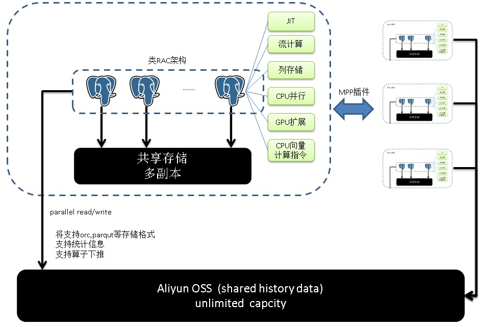

## PostgreSQL 金融类账务流水数据快照分析 案例分享  
##### [TAG 18](../class/18.md)
           
### 作者            
digoal           
             
### 日期             
2017-07-05           
                      
### 标签          
PostgreSQL , 金融 , 审计数据 , feed , 轨迹数据 , 明细数据 , 快照 , 滑动窗口 , binlog , oss       
            
----           
           
## 背景    
在金融行业中，或者一些含有支付业务，往来对账业务，虚拟货币业务等业务的场景中，账户系统的变更流水是一份很大的数据。  
  
为什么需要这份流水呢？直接保留账户的最终状态不就好了吗？  
  
实际上流水数据就是日志数据，它记录了用户的每一笔账户变动，流水数据可以作为审计数据，也可以用于数据分析，还可用于数据的追溯（例如交警说你开车闯红灯了，你会问交警要录像和照片一样）。  
  
有多种产生流水数据的方式，一种是业务上产生，即写表。  
  
另一种是数据库自己产生的日志（WAL），这部分日志也能复原出用户账户变化的流水（old value, new value, 事务号）。    
  
下面是例子，如何管理流水数据呢？  
  
## 例子1  
例子1为业务写流水。  
  
表结构设计   
  
1、账号表  
  
```  
create table tbl  
(  
  xid_num int8,  -- 产生、变更这笔记录的作业号，如果一个作业中包含多个账号的变更（例如转账），可以通过作业号关联起来。  
  uid int primary key,  -- 用户账号ID  
  balance float8 check (balance >=0 ),   -- 余额  
  crt_time timestamp default now(),  -- 记录创建时间  
  mod_time timestamp  -- 记录修改时间  
);  
```  
  
2、流水表  
  
```  
create table tbl_history (  
  xid_num int8,  -- 作业号  
  uid int,    
  crt_time timestamp default now(),   
  audit_old hstore,   -- 变更前的记录，删除前的记录  
  audit_new hstore,   -- 变更后的记录，新增的记录  
  tag text  -- insert,update,delete标记  
);  
  
create index idx_tbl_history_xid on tbl_history (xid_num);  
create index idx_tbl_history_uid on tbl_history (uid);  
```  
  
流水表具备时序属性，使用BRIN索引是最好的。  
  
```  
create index idx_tbl_history_time on tbl_history using brin(crt_time);  
```  
  
3、（可选）流水表可以使用分区表，因为流水表具备时序属性。  
  
```  
create table tbl_history (  
  xid_num int8,  -- 作业号  
  uid int,   
  crt_time timestamp default now(),   
  audit_old hstore,   
  audit_new hstore,   
  tag text  
)  
partition by range(crt_time);  
  
  
do language plpgsql $$  
declare  
  s1 date;  
  s2 date;  
  suffix text;  
begin  
  for i in 1..60 loop  
    s1 := date '2017-06-01'+(i||' month ')::interval;  
    s2 := date '2017-06-01'+((i+1)||' month ')::interval;  
    suffix := to_char(s1,'yyyymm');  
    execute 'create table tbl_history_ptr_'||suffix||' partition of tbl_history for values from ('''||s1||''') to ('''||s2||''')';   
  end loop;  
end;  
$$;  
```  
  
4、业务上控制流水的写入，或者使用数据库自带的rule或触发器实现流水记录的自动生成。  
  
使用规则自动生成流水的例子（创建规则后，不支持insert on conflict语法）  
  
```  
create rule r1 as on insert to tbl do also insert into tbl_history (xid_num,uid,audit_new,tag) values (txid_current(),NEW.uid,hstore(NEW),'insert');  
create rule r2 as on delete to tbl do also insert into tbl_history (xid_num,uid,audit_old,tag) values (txid_current(),OLD.uid,hstore(OLD),'delete');  
create rule r3 as on update to tbl do also insert into tbl_history (xid_num,uid,audit_old,audit_new,tag) values (txid_current(),OLD.uid,hstore(OLD),hstore(NEW),'update');  
```  
  
使用触发器自动生成流水的例子。  
  
```  
create or replace function ftg1() returns trigger as $$  
declare  
begin  
  insert into tbl_history (xid_num,uid,audit_new,tag) values (txid_current(),NEW.uid,hstore(NEW),'insert');  
  return null;  
end;  
$$ language plpgsql strict;  
  
create or replace function ftg2() returns trigger as $$  
declare  
begin  
  insert into tbl_history (xid_num,uid,audit_old,tag) values (txid_current(),OLD.uid,hstore(OLD),'delete');  
  return null;  
end;  
$$ language plpgsql strict;  
  
create or replace function ftg3() returns trigger as $$  
declare  
begin  
  insert into tbl_history (xid_num,uid,audit_old,audit_new,tag) values (txid_current(),OLD.uid,hstore(OLD),hstore(NEW),'update');  
  return null;  
end;  
$$ language plpgsql strict;  
  
create trigger tg1 after insert on tbl for each row execute procedure ftg1();  
create trigger tg2 after delete on tbl for each row execute procedure ftg2();  
create trigger tg3 after update on tbl for each row execute procedure ftg3();  
```  
  
5、压测，生成账号，扣减资金  
  
```  
\set uid random(1,10000000)  
insert into tbl (uid,balance,crt_time) values (:uid, 100000, now()) on conflict (uid) do update set balance=tbl.balance+(random()*100)::int-50,mod_time=now();  
```  
  
压测  
  
```  
pgbench -M prepared -n -r -P 1 -f ./test.sql -c 64 -j 64 -T 120  
  
  
```  
  
6、查询某个账号过去某个时间点的状态  
  
```  
postgres=# select * from tbl_history  limit 10;  
  xid_num   |   uid   |          crt_time          | audit_old |                                                     audit_new                                                      |  tag     
------------+---------+----------------------------+-----------+--------------------------------------------------------------------------------------------------------------------+--------  
 2833936976 | 6301000 | 2017-07-05 18:58:33.014571 |           | "uid"=>"6301000", "balance"=>"100000", "xid_num"=>NULL, "crt_time"=>"2017-07-05 18:58:33.014571", "mod_time"=>NULL | insert  
 2833936980 | 6082888 | 2017-07-05 18:58:33.015117 |           | "uid"=>"6082888", "balance"=>"100000", "xid_num"=>NULL, "crt_time"=>"2017-07-05 18:58:33.015117", "mod_time"=>NULL | insert  
 2833936981 |  941218 | 2017-07-05 18:58:33.015222 |           | "uid"=>"941218", "balance"=>"100000", "xid_num"=>NULL, "crt_time"=>"2017-07-05 18:58:33.015222", "mod_time"=>NULL  | insert  
 2833936977 | 1400395 | 2017-07-05 18:58:33.014793 |           | "uid"=>"1400395", "balance"=>"100000", "xid_num"=>NULL, "crt_time"=>"2017-07-05 18:58:33.014793", "mod_time"=>NULL | insert  
 2833936979 | 1298648 | 2017-07-05 18:58:33.014791 |           | "uid"=>"1298648", "balance"=>"100000", "xid_num"=>NULL, "crt_time"=>"2017-07-05 18:58:33.014791", "mod_time"=>NULL | insert  
 2833936985 | 5278098 | 2017-07-05 18:58:33.017009 |           | "uid"=>"5278098", "balance"=>"100000", "xid_num"=>NULL, "crt_time"=>"2017-07-05 18:58:33.017009", "mod_time"=>NULL | insert  
 2833936978 | 9522366 | 2017-07-05 18:58:33.014795 |           | "uid"=>"9522366", "balance"=>"100000", "xid_num"=>NULL, "crt_time"=>"2017-07-05 18:58:33.014795", "mod_time"=>NULL | insert  
 2833936986 | 9902071 | 2017-07-05 18:58:33.017085 |           | "uid"=>"9902071", "balance"=>"100000", "xid_num"=>NULL, "crt_time"=>"2017-07-05 18:58:33.017085", "mod_time"=>NULL | insert  
 2833936982 | 5473115 | 2017-07-05 18:58:33.015527 |           | "uid"=>"5473115", "balance"=>"100000", "xid_num"=>NULL, "crt_time"=>"2017-07-05 18:58:33.015527", "mod_time"=>NULL | insert  
 2833936988 | 8698002 | 2017-07-05 18:58:33.017249 |           | "uid"=>"8698002", "balance"=>"100000", "xid_num"=>NULL, "crt_time"=>"2017-07-05 18:58:33.017249", "mod_time"=>NULL | insert  
(10 rows)  
  
  
select * from tbl_history where xid_num in (  
  select xid_num from tbl_history where uid=? and crt_time between ? and ?   
);  
```  
  
## 结合OSS的设计  
由于流水数据是历史数据，随着时间越来越久，数据会越来越冷，查询几率会越来越低。  
  
如果所有的数据都放在数据库中，成本是比较高的，除非你不在乎这个成本。  
  
阿里云RDS PostgreSQL和云OSS可以深度整合，使用RDS PG的OSS_FDW外部表，用户的流水数据可以存入OSS，而通过RDS PG可以无缝的查询。  
  
例如，我们将一年前的数据定义为冷数据，将一年前的数据通过oss_fdw外部表接口写入OSS，然后将RDS PG本地对应的数据删掉，释放空间。  
  
当用户需要查询一年前的冷数据时，通过OSS_FDW定义的外部表即可查询。（用法和SQL查询普通表一样）。  
  
OSS_FDW的用法参考  
  
https://help.aliyun.com/document_detail/44461.html  
  
一个简单的DEMO  
  
```  
# 创建插件  
create extension oss_fdw;  
  
# 创建 server   
CREATE SERVER ossserver FOREIGN DATA WRAPPER oss_fdw OPTIONS   
     (host 'oss-cn-hangzhou.aliyuncs.com' ， id 'xxx'， key 'xxx'，bucket 'mybucket');  
  
# 创建 oss 外部表的定义  
CREATE FOREIGN TABLE ossexample   
    (date text， time text， open float，  
     high float， low float， volume int)   
     SERVER ossserver   
     OPTIONS ( filepath 'osstest/example.csv'， delimiter '，' ，  
         format 'csv'， encoding 'utf8'， PARSE_ERRORS '100');  
  
# 查询外部表  
select * from ossexample where .....;  
```  
  
  
  
  
  
## 例子2  
例子2，使用数据库自带的流水，例如MySQL数据库的binlog，或者PostgreSQL数据库的WAL日志，都存储了数据变更前后，插入时，删除时的记录。  
  
## MYSQL用户场景  
MySQL用户，在数据库仅仅存储账户的最终状态，通过binlog将用户insert\update\delete等产生的日志数据解出来，作为流水日志数据。  
  
流水日志数据写入OSS，通过RDS PG对接OSS，即可实现流水数据从MySQL到RDS PG的对接。  
  
RDS PG实例作为SQL查询接口，用户就可以愉快的查询任何时间点的数据了。  
  
  
  
使用RDS PG的好处是可以兼容SQL语法，同时PG在数据分析方面的能力非常强，例如：  
  
1、有地表最强SQL标准支持，地表最强ORACLE兼容性。  
  
2、支持多维分析语法(grouping sets, cube, rollup)，递归查询语法，科学计算函数库，多核并行，向量计算，JIT，哈希JOIN，MERGE JOIN等。  
  
3、支持并行的读写OSS。  
  
4、支持数组、JSON、KV、地理位置、全文检索等扩展数据类型。  
  
5、支持9种索引，加速几乎任何一种数据类型的查询。  
  
RDS PG可以帮助业务实现更多的场景需求。  
  
## 小结  
对接OSS，使得用户可以廉价的存储数据库的binlog流水。  
  
OSS和RDS PG对接，使得用户可以使用通用的SQL语法，分析流水数据。  
  
同时用户还可以享受RDS PG带来的额外特性，包括OLAP分析能力，更强大的语法支持，更强大的计算能力等。  
  
## 参考  
[《PostgreSQL 递归查询一例 - 资金累加链》](../201604/20160405_01.md)    
  
[《PostgreSQL 海量时序数据(任意滑动窗口实时统计分析) - 传感器、人群、物体等对象跟踪》](../201707/20170705_01.md)    
  
<a rel="nofollow" href="http://info.flagcounter.com/h9V1"  ></a>  
  
  
  
  
  
  
## [digoal's 大量PostgreSQL文章入口](https://github.com/digoal/blog/blob/master/README.md "22709685feb7cab07d30f30387f0a9ae")
  
