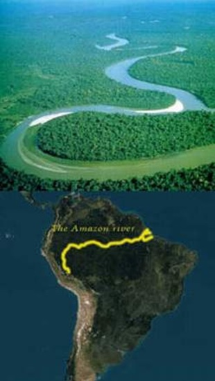
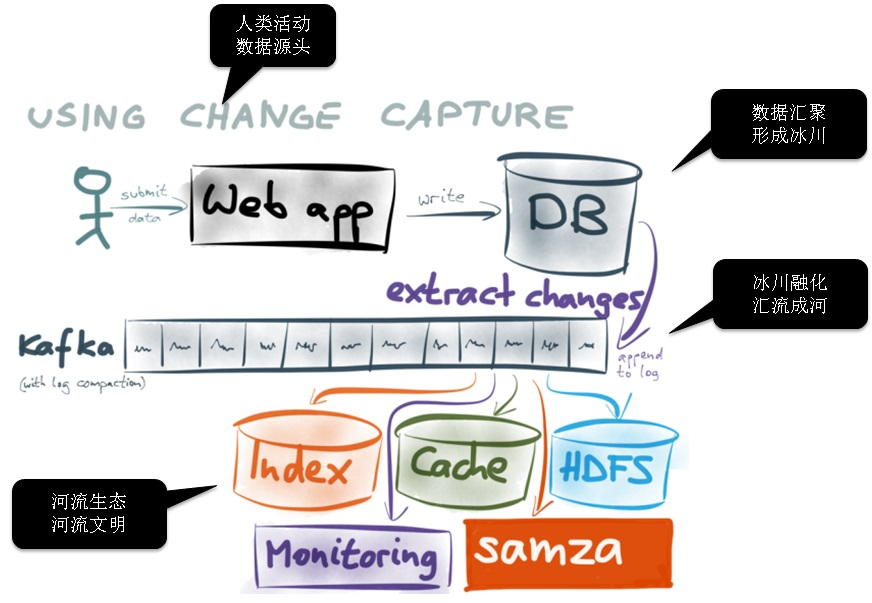

## 从人类河流文明 洞察 数据流动的重要性  
             
### 作者              
digoal             
               
### 日期               
2017-07-06     
       
### 标签      
PostgreSQL , confluent , bottledwater-pg , mq , kafka , 数据流动     
      
----             
    
## 背景      
  
人类社会文明源起于河流文化，人类社会发展积淀河流文化，河流文化生命推动社会发展。  
  
河流文化作为一种人类的文化、文明类型，被人们认知已经经历了很长的历史时期，人们把其称为“大河文明”，尼罗河、幼发拉底河、和底格里斯河流域的两河文明、印度河文明、黄河文明。  
  
这些大河文明与人类文明息息相关，是人类文明的源泉和发祥地。河流与人类文明的相互作用，造就了河流的文化生命。河流先于人类存在于地球上，供养生命，使地球充满生机。  
  
河流与人类社会的关系具有悠久的历史，河流文化生命概念的提出，扩展了社会调控范围，引起了一系列的变革。  
  
    
  
https://en.wikipedia.org/wiki/Amazon_River  
  
http://baike.baidu.com/item/%E4%BA%9A%E9%A9%AC%E5%AD%99%E6%B2%B3/155637  
  
http://baike.baidu.com/item/%E6%B2%B3%E6%B5%81%E6%96%87%E5%8C%96/3895706  
  
## 水是生命的源泉，人类依水而居  
  
水是生命的源泉，人类依水而居，水的流动性，使得更多的地球生物可以共享使用，生物赖以生存，哺育了各个时期的人类文明。  
  
数据的流动具有同等重要的地位，数据流动起来，可以让更多的业务从中受惠，哺育更多的业务，发挥数据更大的价值。  
  
那么如何让数据流动起来呢？  
  
## 从源头说起  
  
水的源头通常发源自大的山脉和冰川，例如长江源（三江源之一）：即长江的源头、也即通天河的几个源头，在青藏高原腹地昆仑山脉和唐古拉山脉之间。  
  
亚马逊河流发源地安第斯山脉（盖丘亚语：Andes；奇楚亚语：Antis）属于科迪勒拉山系，也称安弟斯山脉或安蒂斯山脉，位于南美洲的西岸，范围从巴拿马一直到智利。从北到南全长8900余千米，是世界上最长的山脉，纵贯南美大陆西部，素有“南美洲脊梁”之称，山脉有许多海拔6000米以上、山顶终年积雪的高峰，且地区矿产资源丰富。  
  
数据的源头，和业务相关，例如和人类相关的业务（电商系统、车联网、金融系统等等），人类的活动就是数据的来源。  
  
人类活动产生的数据，写入数据库，形成数据冰川，为河流的形成奠定了基础。  
  
为了提高响应速度，提高可靠性，通常数据库都有预写日志系统。从预写日志可以解读出数据的变化，形成冰川融化效应，将这些解读出来的数据，汇入MQ系统，形成数据的流动。  
  
数据在流动过程中，附着了各种围绕数据而产生的业务生态，例如流计算、全文索引、二级缓存、监控、大数据平台等等。  
  
    
  
confluent是一个开源的数据流平台。  
  
http://docs.confluent.io/current/  
  
## PostgreSQL 河流的形成  
  
    
  
1、PostgreSQL数据库端，添加扩展插件，插件的功能是提供将WAL解析为某种格式。  
  
2、搬运工（客户端），连接PG数据库，通过流复制协议将PG数据库解析好的WAL，获取过来。（支持断点续传、支持拖表的已有数据、支持快照和续传）  
  
3、搬运工（客户端），将从PG数据库获取到的数据写入Kafka队列。  
  
4、河流生态，从Kafka消费数据。  
  
PS：  
  
通过创建SLOT（记录WAL的解析位点），PG支持断电续传，同时也支持多个搬运工，不同的搬用工独立工作，可以搬运重复数据，也可以搬运非重复数据。  
  
当搬运工不在需要时，记得在PG数据库中删除对应的SLOT（例如 select pg_drop_replication_slot('bottledwater');）。  
  
### 其他数据库河流的形成  
与PG类似。  
  
## 应用案例 - 河流生态  
  
### 1 数据实时汇聚和分析  
例如业务有多个OLTP数据库（例如本文提到的PostgreSQL、MySQL等），通过本文提到的方法，可以将数据实时的写入到分析型的数据库（例如RDS PostgreSQL, HybridDB for PostgreSQL）。  
  
分析人员可以在分析库中看到延迟较低的在线业务产生的数据。  
  
### 2 流计算  
通过本文提到的方法，将数据实时从OLTP数据库流出，并流入流计算业务数据库（例如 pipelineDB），实现数据的实时预警、实时流式计算等。  
  
### 3 实时索引  
将流出的数据，实时写入全文检索软件（例如ES），并实时的创建全文索引。  
  
PS：PostgreSQL数据库本身还提供了FDW或UDF接口，也可以实现实时的对接ES全文检索。  
  
或者你可以使用PG自身提供的全文检索功能（tsvector）。  
  
[《PostgreSQL 全文检索加速 快到没有朋友 - RUM索引接口(潘多拉魔盒)》](../201610/20161019_01.md)    
  
[《PostgreSQL 行级 全文检索》](../201604/20160419_01.md)    
  
### 4 实时缓存  
使用本文提到的方法，我们可以将数据实时的在缓存系统进行回放，实时的更新缓存。  
  
更多用法，等你来发掘。  
  
## 参考  
  
http://docs.confluent.io/current/  
  
https://github.com/confluentinc/bottledwater-pg  
  
https://www.confluent.io/blog/bottled-water-real-time-integration-of-postgresql-and-kafka/  
  
