## [转载]Raft 为什么是更易理解的分布式一致性算法  
         
### 作者          
digoal         
           
### 日期           
2017-07-09        
                    
### 标签    
Raft , 分布式系统 , 多数派 , 分布式一致性 , 脑裂    
    
----    
     
## 背景  
## 原文地址  
http://www.cnblogs.com/mindwind/p/5231986.html  
  
原文写得很赞，很好理解，不过有一些细节（例如幂等，例如和数据库结合可能需要考虑的点）我做了一些简单补充。   
    
## 正文  
一致性问题可以算是分布式领域的一个圣殿级问题了，关于它的研究可以回溯到几十年前。  
  
## 拜占庭将军问题  
Leslie Lamport 在三十多年前发表的论文《拜占庭将军问题》（参考[1]）。  
  
拜占庭位于如今的土耳其的伊斯坦布尔，是东罗马帝国的首都。由于当时拜占庭罗马帝国国土辽阔，为了防御目的，军队相隔很远，将军与将军之间靠信差传消息。进行军事决策时，所有将军必需达成 “一致的共识”。但是，在军队内有可能存有叛徒和敌军的间谍，左右将军们的决定，在进行共识时，结果并不一定代表大多数人的意见。于是在已知有成员不可靠的情况下，其余忠诚的将军在不受叛徒或间谍的影响下如何达成一致的协议，拜占庭问题就此形成。拜占庭假设是对现实世界的模型化，由于硬件错误、网络拥塞或断开以及遭到恶意攻击，计算机和网络可能出现不可预料的行为。  
  
Lamport 一直研究这类问题，发表了一系列论文。但综合总结一下就是回答下面三个问题：  
  
1、类似拜占庭将军这样的分布式一致性问题是否有解？  
  
2、如果有解的话需要满足什么样的条件？  
  
3、在特定前提条件的基础上，提出一种解法。  
  
前两个问题 Lamport 在论文《拜占庭将军问题》已经回答，而第三个问题在后来的论文 《The Part-Time Parliament》中提出了一种算法并命名为 Paxos。这篇论文使用了大量的数学证明，而我基本就看不懂了（数学符号都认不全），考虑到大家理解起来都比较困难，后来 Lamport 又写了另外一篇论文 《Paxos Made Simple》完全放弃了所有数学符号的证明，使用纯英文的逻辑推导。我勉强逐字看了一遍，然后感觉若有所悟，但你问我搞懂了吗，我的标准应该还是没懂。对我来说理解一个算法有个明确的标准，就是真的懂了会在头脑里能将算法映射为代码，而看完后面一篇论文仅仅是若有所悟还达不到能映射为代码的清晰度。  
  
虽然 Lamport 认为 Paxos 很 simple，但也许只是针对他的头脑而言。事实是大家理解起来都还是很困难，所以 Raft 就是建立在希望得到一个更易于理解的 Paxos 算法的替代品。把可理解性作为算法的主要目标之一，从论文题目就可看出来《In Search of an Understandable Consensus Algorithm》。  
  
在进入正题前，我想起一个旧故事可以很直观的感受对一个问题不同的思维视角在可理解性上的差异。  
  
## 不同视角的可理解性  
  
依稀记得大约在二十年前，我还在读初中时在一本可能大概叫《数学中的发散思维》（不能很清晰记得书名了）的书中看到这么一个有趣的问题。  
  
```  
甲乙两人轮流在一张圆桌上平放黑白围棋子，每次放一子，棋子不许重叠，谁先没有地方放就输。  
  
请问怎样放才能赢？  
```  
  
这个问题有两层意思，第一，有没有一种放法保证必赢？第二，如果有怎么证明？这里先停顿下，思考十秒钟。  
  
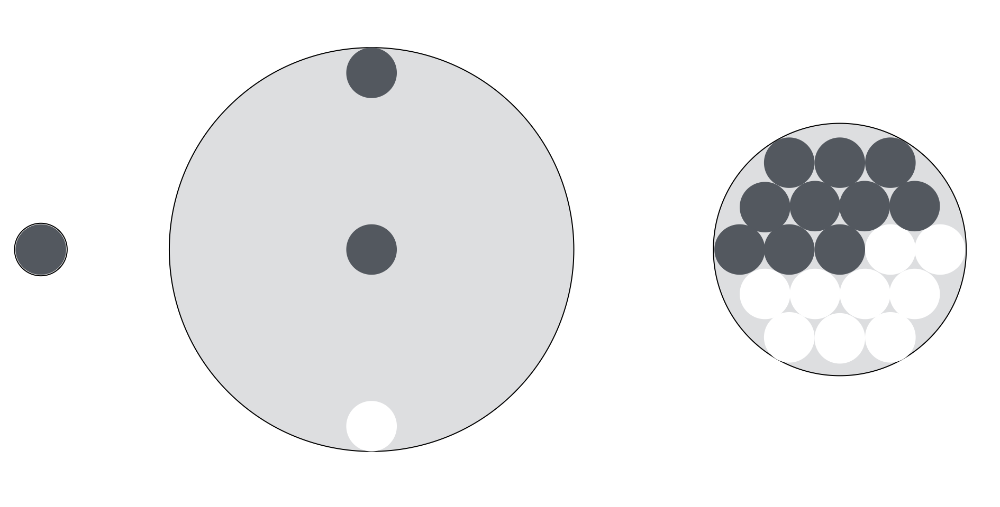  
  
上面的图回答了这个问题，就是先行者必胜，这里使用了三种不同的思维方式。  
  
1、假如桌子只有一个围棋子那么大。  
  
2、假如桌子无限大，先行者先占住圆心，由于圆是对称图形，所以只要对手还能找到位置放，你总能在对称的另一面找到位置放。  
  
3、一个圆中可画单数个直径相等且互切的小圆。  
  
三种不同的思维方式在可理解性难度上逐渐加深。第一种是极简化思维，但数学上是不严谨的。第二种是极限思维，和第一种结合起来就是数学归纳法了，在数学上是严谨的。第三种是形象思维，使用了几何学概念，但对于没有几何学基础知识的人就很难理解了。  
  
## Raft 协议的易理解性描述  
虽然 Raft 的论文比 Paxos 简单版论文还容易读了，但论文依然发散的比较多，相对冗长。读完后掩卷沉思觉得还是整理一下才会更牢靠，变成真正属于自己的。这里我就借助前面黑白棋落子里第一种极简思维来描述和概念验证下 Raft 协议的工作方式。  
  
在一个由 Raft 协议组织的集群中有三类角色：  
  
1、Leader（领袖）  
  
2、Follower（群众）  
  
3、Candidate（候选人）  
  
就像一个民主社会，领袖由民众投票选出。刚开始没有“领袖”，所有集群中的参与者都是“群众”，那么首先开启一轮大选，在大选期间所有群众都能参与竞选，这时所有群众的角色就变成了“候选人”，民主投票选出领袖后就开始了这届领袖的任期，然后选举结束，所有除领袖的候选人又变回群众角色服从领袖领导。这里提到一个概念「任期」，用术语 Term 表达。关于 Raft 协议的核心概念和术语就这么多而且和现实民主制度非常匹配，所以很容易理解。三类角色的变迁图如下，结合后面的选举过程来看很容易理解。  
  
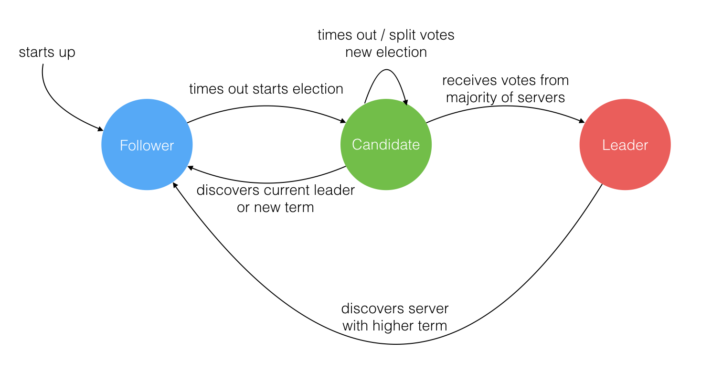  
  
### Leader 选举过程  
  
在极简的思维下，一个最小的 Raft 民主集群需要三个参与者（如下图：A、B、C），这样才可能投出多数票。初始状态 ABC 都是 Follower，然后发起选举这时有三种可能情形发生。下图中前二种都能选出 Leader，第三种则表明本轮投票无效（Split Votes），每方都投给了自己，结果没有任何一方获得多数票。之后每个参与方随机休息一阵（Election Timeout）重新发起投票直到一方获得多数票。这里的关键就是随机 timeout，最先从 timeout 中恢复发起投票的一方向还在 timeout 中的另外两方请求投票，这时它们就只能投给对方了，很快达成一致。  
  
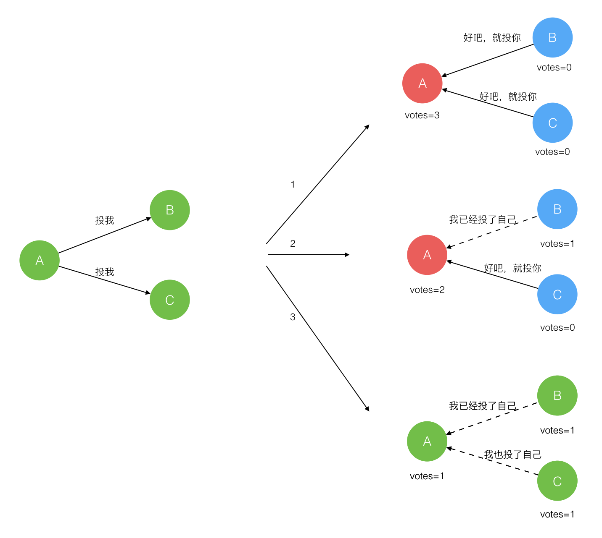  
  
选出 Leader 后，Leader 通过定期向所有 Follower 发送心跳信息维持其统治。若 Follower 一段时间未收到 Leader 的心跳则认为 Leader 可能已经挂了再次发起选主（election）过程。  
  
### Leader 节点对一致性的影响  
  
Raft 协议强依赖 Leader 节点的可用性来确保集群数据的一致性。数据的流向只能从 Leader 节点向 Follower 节点转移。当 Client 向集群 Leader 节点提交数据后，Leader 节点接收到的数据处于未提交状态（Uncommitted），接着 Leader 节点会并发向所有 Follower 节点复制数据并等待接收响应，确保至少集群中超过半数节点(quorum based)已接收到数据后再向 Client 确认数据已接收。一旦向 Client 发出数据接收 Ack 响应后，表明此时数据状态进入已提交（Committed），Leader 节点再向 Follower 节点发通知告知该数据状态已提交。  
  
（读者疑问：是不是没有4.2这个步骤？或者换句话说4.2如果没有发送成功，此时如果Leader异常，并发生了重新选举，有没有风险？New Leader的这笔事务到底是commit还是uncommit?(个人认为应该是commit，否则就有问题了)）    
  
（读者疑问：4.1是指数据库已完成commit的持久化？）  
  
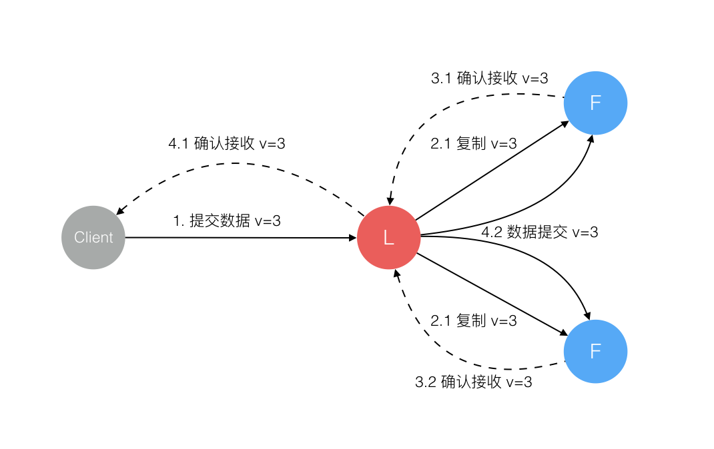  
  
在这个过程中，主节点可能在任意阶段挂掉，看下 Raft 协议如何针对不同阶段保障数据一致性的。  
  
### 1. 数据到达 Leader 节点前  
  
这个阶段 Leader 挂掉不影响一致性，不多说。  
  
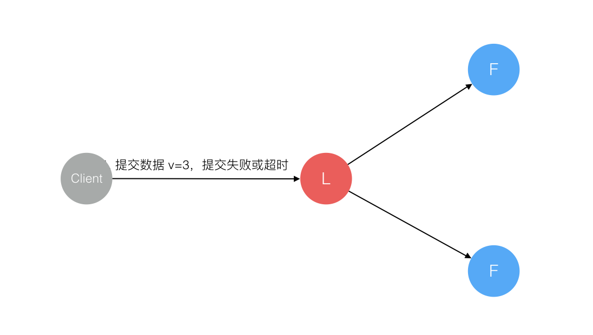  
  
### 2. 数据到达 Leader 节点，但未复制到 Follower 节点  
  
这个阶段 Leader 挂掉，数据属于未提交(uncommit)状态，Client 不会收到 Ack 会认为超时失败可安全发起重试。Follower 节点上没有该数据，重新选主后 Client 重试 (重新发起整个事务请求？) 重新提交可成功。原来的 Leader 节点恢复后作为 Follower 加入集群重新从当前任期的新 Leader 处同步数据，强制保持和 Leader 数据一致。  
  
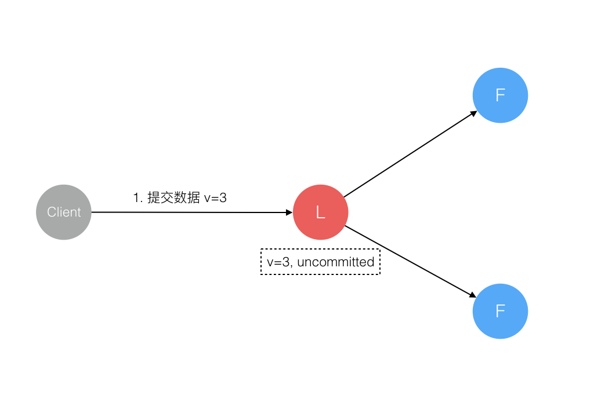  
  
### 3. 数据到达 Leader 节点，成功复制到 Follower 所有节点，但还未向 Leader 响应接收  
  
这个阶段 Leader 挂掉，虽然数据在 Follower 节点处于未提交状态（Uncommitted）但保持一致，重新选出 Leader 后可完成数据提交，此时 Client 由于不知到底提交成功没有，可重试 (重新发起整个事务请求?) 提交。  
  
针对这种情况 Raft 要求 RPC 请求实现“幂等”性，也就是要实现内部去重机制。  
  
（读者疑问：如果是数据库，单纯的 update table set balance=balance-100 where id=?; 重试会出问题，因为出现了多次扣减。）  
  
（读者疑问：如果数据库使用两阶段提交，提交是比较容易实现幂等的。又或者业务方在设计事务逻辑时，就考虑幂等。）  
  
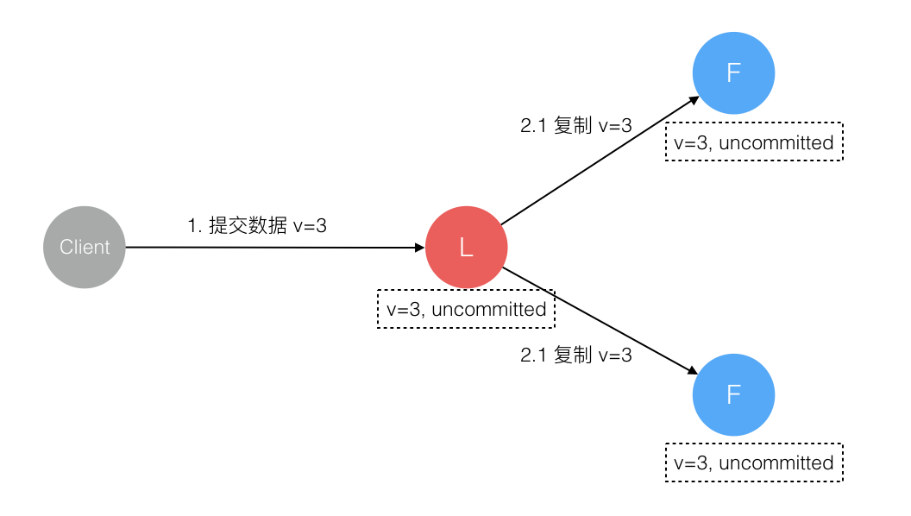  
  
### 4. 数据到达 Leader 节点，成功复制到 Follower 部分节点，但还未向 Leader 响应接收  
  
这个阶段 Leader 挂掉，数据在 Follower 节点处于未提交状态（Uncommitted）且不一致，Raft 协议要求投票只能投给拥有最新数据的节点。所以拥有最新数据的节点会被选为 Leader 再强制同步数据到 Follower，数据不会丢失并最终一致。  
  
针对这种情况 Raft 要求 RPC 请求实现幂等性，也就是要实现内部去重机制。  
  
（读者疑问：如果是数据库，单纯的 update table set balance=balance-100 where id=?; 重试会出问题，因为出现了多次扣减。）  
  
（读者疑问：如果数据库使用两阶段提交，提交是比较容易实现幂等的。）  
  
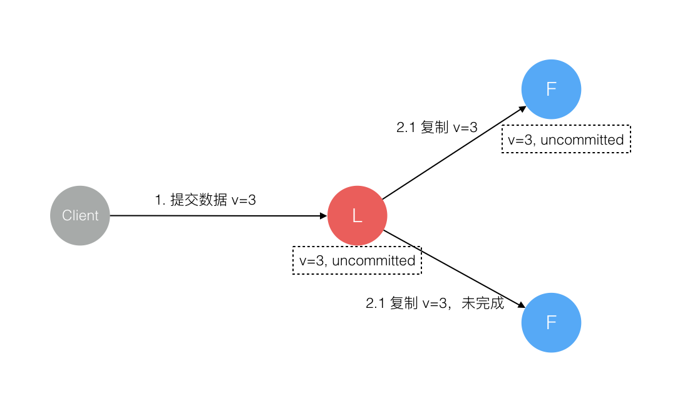  
  
### 5. 数据到达 Leader 节点，成功复制到 Follower 所有或多数节点，数据在 Leader 处于已提交状态，但在 Follower 处于未提交状态  
  
这个阶段 Leader 挂掉，重新选出新 Leader 后的处理流程和阶段 3 一样。  
  
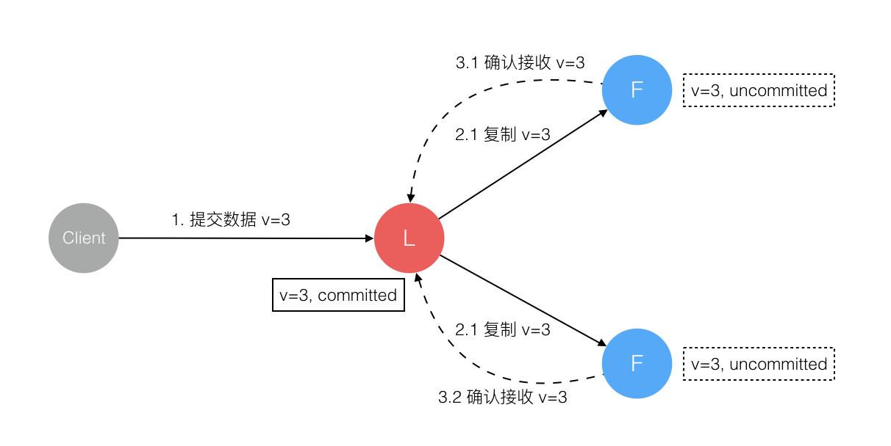  
  
### 6. 数据到达 Leader 节点，成功复制到 Follower 所有或多数节点，数据在所有节点都处于已提交状态，但还未响应 Client  
  
这个阶段 Leader 挂掉，Cluster 内部数据其实已经是一致的，Client 重复重试基于“幂等”策略对一致性无影响。  
  
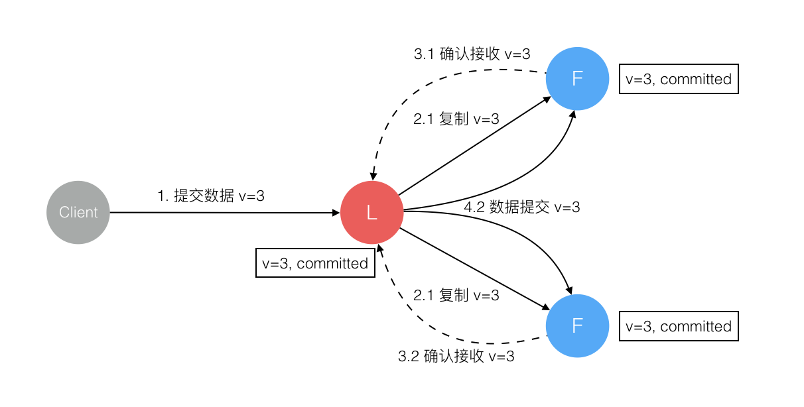  
  
### 7. 网络分区导致的脑裂情况，出现双 Leader  
  
网络分区将原先的 Leader 节点和 Follower 节点分隔开，Follower 收不到 Leader 的心跳将发起选举产生新的 Leader。这时就产生了双 Leader，原先的 Leader 独自在一个区，向它提交数据不可能复制到多数节点所以“永远提交不成功”（虽然提交不成功，从数据库WAL日志角度来看，依旧可能出现旧Leader和新Leader存在差异的情况。例如旧Leader接收到某些请求，产生了WAL，只是提交事务的信息由于无法到达多数派，客户端是收不到commit ack的。）。向新的 Leader 提交数据可以提交成功，网络恢复后旧的 Leader 发现集群中有更新任期（Term）的新 Leader 则自动降级为 Follower 并从新 Leader 处同步数据（对于数据库，可能首先要rewind，然后才能从new Leader同步）达成集群数据一致。  
  
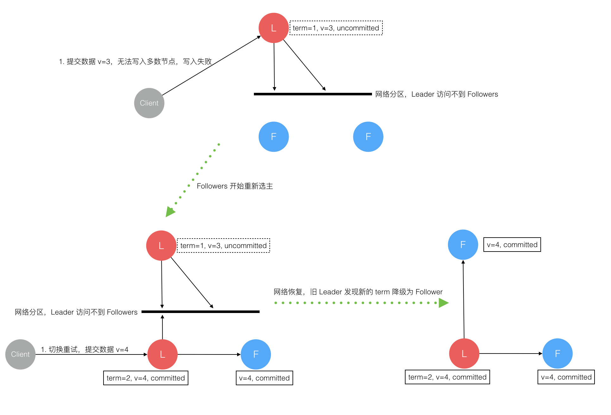  
  
综上穷举分析了最小集群（3 节点）面临的所有情况，可以看出 Raft 协议都能很好的应对一致性问题，并且很容易理解。  
  
但是要结合数据库和Raft，实现金融级零数据丢失和一致性的数据库多副本产品，一定需要解决“幂等”的问题。  
  
## 总结  
  
就引用 Raft 论文最后的一节的综述来总结本文吧。  
  
```  
算法以正确性、高效性、简洁性作为主要设计目标。  
  
虽然这些都是很有价值的目标，但这些目标都不会达成直到开发者写出一个可用的实现。  
  
所以我们相信可理解性同样重要。  
```  
  
我深以为然，Paxos 算法是 Leslie Lamport 在 1990 年就公开发表在了自己的网站上，想想我们是什么时候才听说的？什么时候才有一个可用的实现？而 Raft 算法是 2013 年发表的，大家在参考[5]上面可以看到有多少个不同语言开源的实现库了，这就是可理解性的重要性。  
  
## 参考  
  
[1]. LESLIE LAMPORT, ROBERT SHOSTAK, MARSHALL PEASE. [The Byzantine General Problem](http://research.microsoft.com/en-us/um/people/lamport/pubs/byz.pdf). 1982  
  
[2]. Leslie Lamport. [The Part-Time Parliament](http://research.microsoft.com/en-us/um/people/lamport/pubs/lamport-paxos.pdf). 1998  
  
[3]. Leslie Lamport. [Paxos Made Simple](http://research.microsoft.com/en-us/um/people/lamport/pubs/paxos-simple.pdf). 2001  
  
[4]. Diego Ongaro and John Ousterhout. [Raft Paper](https://ramcloud.stanford.edu/raft.pdf). 2013  
  
[5]. Raft Website. [The Raft Consensus Algorithm](https://raft.github.io/#implementations)  
  
[6]. Raft Demo. [Raft Animate Demo](http://thesecretlivesofdata.com/raft/)  
  
  
<a rel="nofollow" href="http://info.flagcounter.com/h9V1"  ></a>  
  
  
  
  
  
  
## [digoal's 大量PostgreSQL文章入口](https://github.com/digoal/blog/blob/master/README.md "22709685feb7cab07d30f30387f0a9ae")
  
